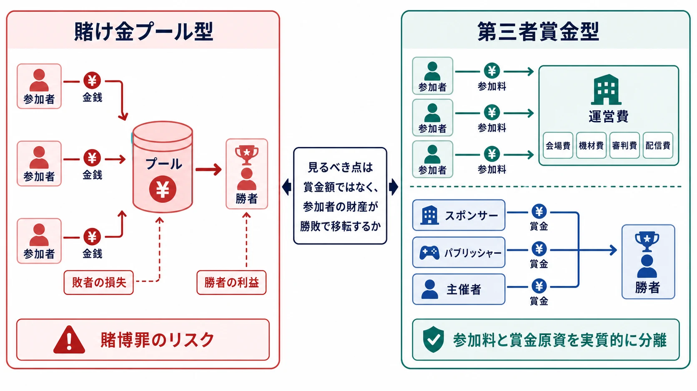
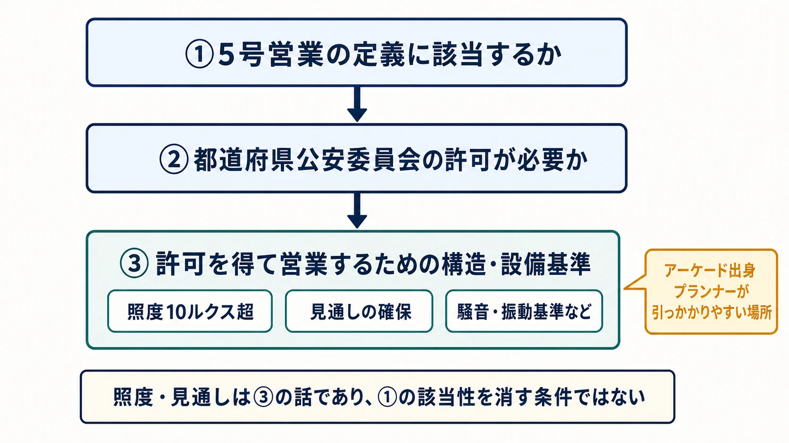

# eスポーツ大会賞金の賭博法制論点――なぜプロゴルフの高額賞金は疑問視されず、eスポーツは賭博を疑われるのか

> **注意：** 本稿は法的助言ではありません。具体的な大会の適法性は、参加料・賞金・協賛金の流れ、会場、機材、開催頻度、参加条件などによって変わります。企画段階で弁護士・法務部門へ確認し、風営適正化法の適用が問題となる場合は、開催地を管轄する警察署や都道府県公安委員会にも事前に相談してください。法令、行政解釈、業界ガイドラインは更新されることがあるため、最新の条文と公的資料を参照してください。

プロゴルフでは、一大会で高額な賞金が支払われても、「ゴルフは賭博ではないか」と疑われることはほとんどない。一方、eスポーツでは、賞金額が大きいだけで「刑法の賭博罪に触れるのではないか」という懸念がしばしば持ち上がる。

この差は、ゴルフが技能競技で、ゲームにはランダム要素があるから生じるのだろうか。

法律が見ているのは、競技の歴史や社会的な呼び名ではない。賭博罪では **誰の財産が勝敗によって誰へ移るのか** が重要であり、風俗営業等の規制及び業務の適正化等に関する法律（以下、風営適正化法）では **どのような会場と機材で客に遊技させる営業なのか** が重要になる。本稿は景品表示法の高額賞金問題とは範囲を分け、賭博罪と風営適正化法5号営業を、大会仕様へ落とし込める形で整理する。

***

## 1. 賭博罪の「偶然性」は、実はどんな競技にも当てはまりうる

刑法185条は賭博をした者を処罰し、「一時の娯楽に供する物」を賭けた場合を例外としている。刑法186条は、常習として賭博をした場合と、賭博場を開くなどして利益を図った場合を、さらに重く扱う。判例・実務上の賭博は、平たく言えば、 **偶然の勝敗に関して財物を賭け、その得喪を争うこと** である。[[1](#ref-1)][[2](#ref-2)]

ここでいう「偶然」は、サイコロや乱数だけを意味しない。当事者が結果を確実に予見できず、自由に支配できない事情が勝敗へ影響すれば、技能が大きな割合を占める競技にも偶然性は認められうる。[[3](#ref-3)]

この広さを示すのが、賭け将棋をめぐる東京高裁昭和32年1月17日判決である。同判決は、賭け将棋を「偶然の支配」による財物の得喪と捉え、賭博罪の成立を認めた。判例を解説する資料では、将棋は純粋な技能競技に見えても、棋士の体調・精神状態・思考能力のコンディションなどによって勝敗が変わるため、偶然の支配を否定できないと整理されている。[[2](#ref-2)]

同じ考え方を使えば、風、天候、コース状態、道具の微細な差、その日の選手の体調が影響するゴルフにも、競技当事者が完全には支配できない要素がある。eスポーツでも、乱数を使わないタイトルであっても、相手の選択、入力のずれ、通信や機材の状態などを選手が完全に予見・支配することはできない。

したがって、少なくとも賭博罪の判例上の建て付けでは、 **「eスポーツには偶然性があるが、伝統的なスポーツにはない」** という切り分けは成立しない。競技がスキル中心かチャンス中心かだけでは、賭博罪への答えは出ない。

***

## 2. 明暗を分けるのは、賞金が「誰のお金」かである

偶然性が広く認められるなら、プロゴルフの賞金大会まで賭博になりそうに見える。そこで重要になるのが、もう一つの要件である **財物の得喪** だ。

賭けゴルフや賭け麻雀では、参加者が自分の金銭を賭け、勝者が他の参加者の金銭を得る。ある参加者の利益と別の参加者の損失が、同じ勝敗を通じて対応する。この関係が「財物を賭け、その得喪を争う」に当たりうる。金額が少なければ当然に安全になるわけでもない。判例上、金銭そのものは原則として「一時の娯楽に供する物」と扱われないためである。[[4](#ref-4)]

賞金大会では、資金の流れを別に設計できる。参加者ではないスポンサーや主催者が賞金を拠出し、参加料を徴収する場合でも、その全額を会場、機材、審判、配信、保険などの運営費へ充てる。賞金と参加料の原資が実質的に切り離されていれば、敗者の参加料が勝者へ移る関係にはならず、参加者同士が財物の得喪を争う構造を避けられる。[[3](#ref-3)][[4](#ref-4)]

プロゴルフのトーナメントでは、スポンサー企業の協賛金、テレビ・配信の放映権料、チケット・観客収入などが大会収入の柱となり、その一部から賞金が設定される。国税庁の質疑事例も、ゴルフ大会の協賛者が入賞者へ賞金・賞品を提供する構造を前提に、支払主体に応じた課税関係を整理している。選手が互いの財布を取り合っているのではなく、第三者が競技成績に応じて報酬を提供する構造である。[[5](#ref-5)][[6](#ref-6)]

eスポーツ大会でも、基本設計は同じである。

- **参加料を賞金へ回さない：** 賞金はスポンサー、パブリッシャー、主催者など、競技参加者以外の拠出として予算化する。
- **参加料の使途を運営費へ限定する：** 会場費、機材費、審判費、配信費など、何を参加者に負担してもらうのかを規約と予算で示す。
- **資金と証拠を分ける：** 参加料収入、賞金原資、その他の協賛金を帳簿・口座・精算書で追跡できるようにし、参加料が賞金へ流れていないことを説明可能にする。
- **表示ではなく実態を合わせる：** 名目を「運営費」と変えるだけでなく、金額、支出先、スポンサー契約、賞金の支払主体まで一貫させる。

これはeスポーツだけの特別扱いではない。適法に設計された賞金付き麻雀大会やプロゴルフ大会と同じく、 **参加者間の賭け金プールを作らず、第三者賞金と大会運営費を切り離す** という論理である。

***

## 3. 2018年前後の混乱で先行したのは景品表示法だった

「eスポーツ元年」と呼ばれた2018年前後、日本では高額賞金を出せないのではないかという懸念が広がった。当時の議論では、賭博罪だけでなく景品表示法や風営適正化法が一緒に語られ、法律ごとの問いが混同されやすかった。なかでも高額賞金問題の主軸となったのは、賞金が景品表示法上の「景品類」に当たり、上限規制を受けるのではないかという懸念だった。[[7](#ref-7)]

景品表示法が見るのは、賞金が商品・サービスの取引に付随する顧客誘引のための景品類なのか、それとも選手による実演・仕事への報酬なのかという点である。消費者庁は現在、個々の大会の実態から仕事の報酬等と認められる賞金は景品類に当たらないと説明している。[[8](#ref-8)]

これは、参加者同士が自分の財物の得喪を争うかを見る賭博罪とは別の法体系であり、同じ賞金へ異なる角度から検討を加えている。景品表示法、JeSU、プロライセンス制度と高額賞金問題の経緯は、既刊記事「[eスポーツの歴史とビジネス構造――賞金、リーグ、配信、選手を支える仕組み](esports-history-and-business-structure.md)」で扱っている。本稿ではそこへ深入りせず、賭博罪では **賞金原資と参加者間の得喪関係** を見る、という切り分けを押さえておきたい。

***

## 4. アーケード出身プランナーが見落としやすい、風営適正化法5号営業

オフラインのeスポーツ大会には、賞金とは別の論点がある。主催者がパソコン、家庭用ゲーム機、スマートフォンなどを会場へ設置し、参加者に使わせる形は、ゲームセンター等営業と構造が似るためである。[[9](#ref-9)]

風営適正化法2条1項5号は、スロットマシン、テレビゲーム機その他の対象となる遊技設備を備えた店舗その他これに類する区画された施設で、その設備により客に遊技させる営業を、風俗営業の一類型としている。該当する営業を営むには、原則として都道府県公安委員会の許可が必要である。[[10](#ref-10)][[11](#ref-11)]

### 明るく見通しが良くても、許可不要にはならない

アーケード施設の設計経験があると、「照度を10ルクスより明るくし、区画の見通しを良くすれば風営適正化法の対象外になる」と捉えてしまうことがある。

この理解は、二段階の判断を混ぜている。客室内部に見通しを妨げる設備を設けないことや、客室内の照度が10ルクス以下にならないようにすることは、5号営業の **許可を受ける営業所に求められる構造・設備の技術上の基準** である。基準を満たせば許可が不要になるのではなく、5号営業に該当した場合に、許可を得て営業するため満たすべき条件となる。[[11](#ref-11)]

順序は次のようになる。

1. その大会運営が、5号営業の定義に該当するかを確認する。
2. 該当するなら、開催地を管轄する都道府県公安委員会の許可が必要かを確認する。
3. 許可を受ける場合に、照度、見通し、騒音・振動などの構造・設備基準を満たす。

照明設計だけを直しても、最初の「客に対象設備で遊技させる営業か」という問いは消えない。

### 該当性を下げる三つの大会設計

eスポーツ大会の実務では、ゲームセンター等営業に当たらないよう、次の三つの方向から設計する考え方が示されている。[[12](#ref-12)][[13](#ref-13)]

1. **ゲーム以外にも現実に使える汎用機器を用いる。** 通信可能なパソコン、スマートフォン、タブレットなどを使い、ブラウザ等のゲーム以外の機能も現実に利用できる状態にする。名称がPCであるだけでは足りず、専用ゲーム機同様に機能を固定していないかまで確認する。
2. **常設施設ではなく仮設会場で開く。** 野外の仮設会場など、店舗その他これに類する区画された施設に当たらない開催形態を検討する。ただし、仮設という呼び名だけで結論は決まらず、期間、設備、区画、反復継続性を含む実態判断となる。[[14](#ref-14)]
3. **参加料の合計額を大会設営費用以下にする。** 最大参加者数に一人当たり参加料を掛けた額が、大会設営費用の見込額を上回らないようにする。2022年2月17日の衆議院予算委員会分科会でも、警察庁の政府参考人は、このような条件を満たす場合にはゲームセンター等営業に該当しないとの整理が可能だと答弁している。[[12](#ref-12)][[13](#ref-13)]

三つ目は、賭博罪の資金分離と似ているが、確認している対象が違う。賭博罪では参加者の金銭が賞金へ移転しないことを確かめる。風営適正化法では、参加料が参加者に遊技設備を使わせる対価として主催者の利益になるのではなく、大会設営費用の負担に収まることを確かめる。 **同じ参加料を、二つの法律から別々に点検する** 必要がある。

また、これらは個別の大会を自動的に適法とする免許証ではない。JeSUのガイドラインも、既存大会の適法性をJeSUが判断するものではないとしている。常設のeスポーツ施設、家庭用ゲーム機を固定した会場、複数日にわたる反復開催、飲食や観戦料を含む複合事業では、営業の実態全体を持って所轄へ事前相談するのが安全である。弁護士による近時の解説も、一日限りという名目だけで許可不要とは決まらないと注意を促している。[[14](#ref-14)][[15](#ref-15)]

***

## 5. 企画書では「賞金額」より先に資金と会場を書く

ゲームプランナーが大会企画を法務へ持ち込むとき、「賞金100万円は出せるか」だけを質問しても判断材料が足りない。少なくとも、次の情報を一枚にまとめる必要がある。

| 確認対象 | 企画書に書く内容 | 主に関係する論点 |
|---|---|---|
| 賞金原資 | 拠出者、金額、契約、支払主体、支払時期 | 賭博罪、景品表示法 |
| 参加料 | 一人当たり額、最大参加者数、総額、具体的な使途 | 賭博罪、風営適正化法 |
| 資金管理 | 参加料・賞金・協賛金の口座、帳簿、精算方法 | 賭博罪の得喪関係の説明 |
| 機材 | PC・スマートフォン・家庭用ゲーム機の別、ゲーム以外の機能を使える状態か | 風営適正化法5号営業 |
| 会場 | 常設・仮設、区画、開催日数、開催頻度、設備の設置期間 | 風営適正化法5号営業 |
| 施設基準 | 見通し、照度、騒音・振動、出入口 | 5号営業に該当した場合の許可基準 |
| 周辺収益 | 観戦料、配信、広告、物販、飲食、スポンサー収入 | 営業実態と各法令の個別確認 |

重要なのは、同じ金銭を二重、三重に説明できる状態にすることだ。たとえば参加料について、「賞金へは一円も回らない」「大会設営費用を超えない」「規約と会計処理が一致する」を同時に確認する。スポンサー賞金についても、契約書だけでなく、実際の入出金と支払主体まで追えるようにする。

仕様書、募集要項、スポンサー契約、会場契約、予算表、精算書が別々の前提で作られると、完成直前の法務確認では直せない。資金フローと会場・機材の条件は、ゲームルールと同じく企画初期に決める大会仕様である。

***

## 6. 法的評価を決めるのは、ゲームの中身ではなく大会の設計である

プロゴルフとeスポーツの差を、「現実のスポーツかゲームか」「技能か運か」で説明すると、賭博罪の核心を外す。将棋でさえ、判例上は偶然の支配を否定できない。プロゴルフの高額賞金が通常の賭けゴルフと区別されるのは、スポンサー等が賞金を拠出し、選手同士が自分の財物を取り合う構造になっていないからである。

風営適正化法5号営業も、競技タイトルが健全か、選手がプロかという呼び名だけで決まらない。運営者がどの機材をどの状態で用意し、どの会場で、どの程度継続して、どの対価を得て客に使わせるかが問われる。照度10ルクス超や見通しの確保は、該当性を消す免除条件ではなく、許可営業に求められる設備基準である。

二つの法律は着眼点が違う。しかし、ゲームプランナーへの結論は共通している。

- 賭博罪には、 **賞金と参加料の資金フロー** で対応する。
- 風営適正化法には、 **会場、機材、開催形態、参加料** の設計で対応する。
- 景品表示法とは問いを分け、必要な場合は別に確認する。

法的評価を左右するのは、ゲーム内のスキルとチャンスの比率ではない。 **誰のお金を、どの契約と会計で動かし、どの場所と機材で大会を開くか** という大会設計である。法務確認を公開直前の許可取りにせず、資金フロー図と会場仕様を作る段階から組み込むことが、高額賞金と参加の開かれた競技を両立させる出発点となる。

## References

1. [e-Gov法令検索「刑法」][1] - 刑法185条の賭博罪、186条の常習賭博及び賭博場開張等図利の現行条文。

2. [みずほ中央法律事務所「将棋に関する法律問題（著作権や賭け将棋による賭博罪）」][2] - 東京高裁昭和32年1月17日判決と、体調・精神状態などが勝敗へ与える影響を踏まえた偶然性の解説。

3. [eスポーツと法「賞金を配分するeスポーツ大会を開催するには―①賭博罪、賭博場開帳等図利罪との関係」][3] - 偶然性の解釈、プロゴルフ等との比較、参加料と賞金原資を分ける大会設計の解説。

4. [弁護士ドットコム「なぜ『賭け麻雀は違法』なのに『賞金総額1000万円』の麻雀大会はOKなのか？」][4] - 財物の得喪、金銭と一時の娯楽に供する物、スポンサー賞金による大会設計を弁護士が解説した記事。

5. [ゴルフFOCUS「ゴルフの賞金の仕組みを解説！大会の賞金はどこから出てどう分配されるのか」][5] - ゴルフトーナメントの賞金原資として、スポンサー協賛金、放映権料、チケット・観客収入などを挙げる解説。

6. [国税庁「ゴルフ大会の協賛者が提供するプロゴルファーの賞金」][6] - 主催者または協賛者がプロゴルファーへ賞金・賞品を交付する場合の課税関係を示す公式質疑事例。

7. [eSports World「日本のeスポーツと『高額賞金問題』の法的課題」][7] - 2018年前後の高額賞金問題と、景品表示法・JeSU・プロライセンスをめぐる経緯の解説。

8. [消費者庁「景品類ではないもの」][8] - eスポーツ大会の賞金が仕事の報酬等と認められる場合、景品類に当たらないとする公式Q&A。

9. [関真也法律事務所「eスポーツ大会は風営法の規制を受けるか」][9] - オフライン大会と5号営業の関係、汎用機器、仮設会場、参加料と設営費用の考え方を整理した弁護士解説。

10. [e-Gov法令検索「風俗営業等の規制及び業務の適正化等に関する法律」][10] - 2条1項5号の定義、3条の許可、4条の許可基準などの現行条文。

11. [e-Gov法令検索「風俗営業等の規制及び業務の適正化等に関する法律施行規則」][11] - 5号営業に係る見通し、照度、騒音・振動などの構造・設備基準。

12. [日本eスポーツ協会「JeSU参加料徴収型大会ガイドライン」][12] - 汎用機器の考え方、参加料を大会設営費用へ充てる条件、最大参加者数を使った上限計算を示すガイドライン。

13. [衆議院「第208回国会 予算委員会第七分科会 第2号」][13] - 参加料の合計額が大会設営費用を上回らないなどの条件を満たす場合、ゲームセンター等営業に該当しないとの整理が可能だとした警察庁政府参考人答弁。

14. [警察庁「風俗営業等の規制及び業務の適正化等に関する法律等の解釈運用基準」][14] - 5号営業の趣旨、対象となる遊技設備、店舗その他これに類する区画された施設などの現行解釈運用基準。

15. [NEXILL & PARTNERS「eスポーツと風営法の関係性とは？」][15] - 大会・施設運営の実態、単発イベント、事前相談などの実務上の注意点を整理した弁護士解説。

[1]: https://laws.e-gov.go.jp/law/140AC0000000045#Mp-At_185
[2]: https://www.mc-law.jp/kigyohomu/2751/
[3]: https://electronicsports-law.com/article001/
[4]: https://www.bengo4.com/c_1009/n_1574/
[5]: https://www.itocc.jp/archives/644
[6]: https://www.nta.go.jp/law/shitsugi/gensen/05/05.htm
[7]: https://esports-world.jp/column/17273
[8]: https://www.caa.go.jp/policies/policy/representation/fair_labeling/faq/premium/other
[9]: https://www.mseki-law.com/archives/2411
[10]: https://laws.e-gov.go.jp/law/323AC0000000122
[11]: https://laws.e-gov.go.jp/law/360M50400000001/
[12]: https://jesu.or.jp/wp-content/themes/jesu/contents/pdf/terms/participationfee_guidelines.pdf?20220419
[13]: https://www.shugiin.go.jp/internet/itdb_kaigiroku.nsf/html/kaigiroku/003720820220217002.htm
[14]: https://www.npa.go.jp/laws/notification/seian/hoan/hoantsutatu2/R080701kaisiyaku.pdf
[15]: https://nexillpartners.jp/law/kigyou/column/esports/2423/

----

この文書は、Perplexity、Claude、OpenAI Codex の3つのAIの支援を受けて著述されたものです。引用画像を除き、MIT License にて提供されています。
