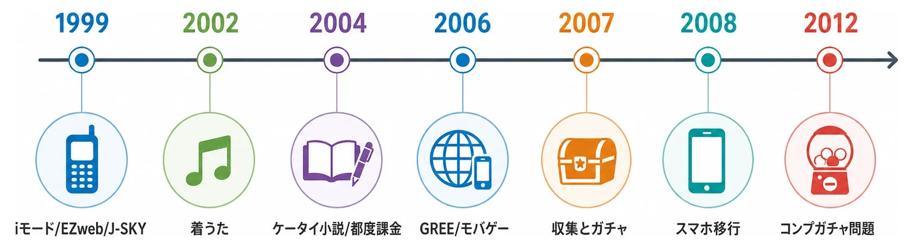
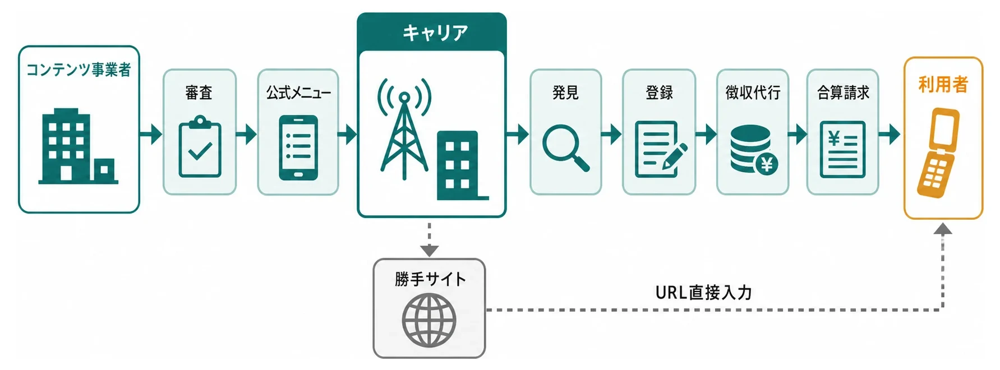
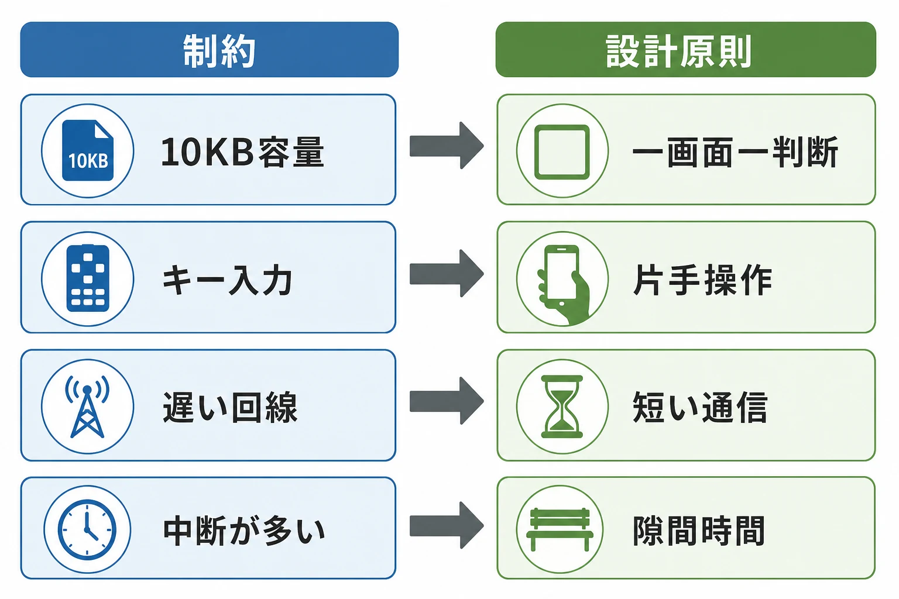
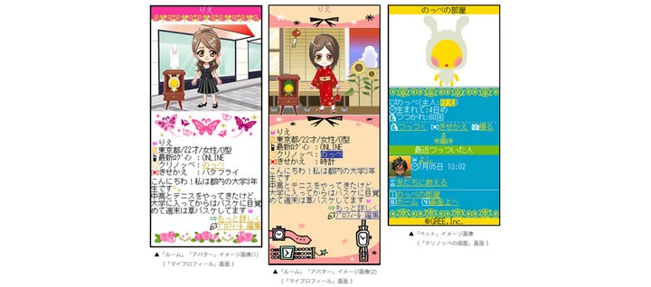
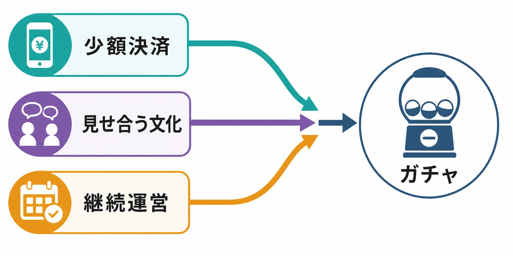
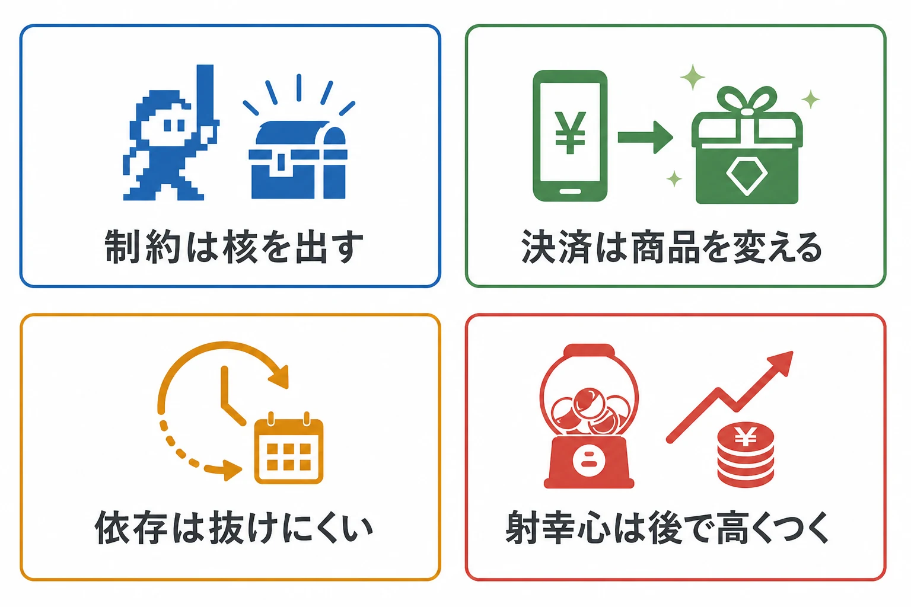

# ポケットの中に、現在があった――ガラケー時代のモバイルゲーム文化史

電車の座席で、折りたたみ式の携帯電話を開く。親指で方向キーを押し、数秒待ってページを送る。遊び終えたら画面を閉じ、次の休み時間にまた開く。

現在のスマートフォンゲームから見れば、ずいぶん素朴な光景である。だが、その小さな画面には、基本プレイ無料、アイテム課金、アバター、フレンド、期間限定イベント、ランキング、ユーザー投稿、そして通信料金と一緒に支払える決済まで、現在につながる部品がすでに並んでいた。

フィーチャーフォン、いわゆるガラケーの時代は、スマートフォンゲームの未完成な前史ではない。通信会社、コンテンツ事業者、端末メーカー、そして利用者が、限られた画面と回線の上で「毎日持ち歩く遊び」を組み立てた時代である。そこで生まれた成功と失敗は、端末が変わった現在も、プランナーの足元に残っている。

***

## 1999年、携帯電話の中に「街」ができた

転機は1999年に訪れた。NTTドコモは2月22日にiモードを開始した。企画時の言葉は「話すケータイから使うケータイへ」。銀行、チケット、ニュース、天気、ゲーム、占いを一つの入口から利用できるサービスとして設計されていた。[[1](#ref-1)] 4月にはDDIセルラーグループとIDOがEZwebを、12月にはJ-フォンがJ-SKYを開始する。J-SKYは後にボーダフォンライブ！を経て、2006年にYahoo!ケータイへつながった。[[2](#ref-2)][[3](#ref-3)]

ここで重要なのは、携帯電話がウェブを表示できるようになったことだけではない。キャリアのメニューには、審査を通った **公式サイト** が並んだ。利用者は端末のメニューボタンからサイトを見つけ、登録し、利用料を毎月の電話料金とまとめて支払えた。一方のコンテンツ事業者は、個々の利用者から代金を回収する仕組みを一から用意せずに済んだ。iモードの初期設計にも、NTTドコモが情報料を徴収代行するビジネスモデルが明記されている。[[4](#ref-4)]

公式サイトの外には、URLを直接入力して訪れる一般サイト、通称「勝手サイト」もあった。つまり完全な閉鎖空間ではなかったが、発見、信用、課金を一体で得られる公式メニューの力は大きかった。キャリアは通信路だけでなく、店頭、レジ、請求書、審査窓口まで兼ねる巨大な流通事業者だったのである。

この仕組みは事業者に安心を与える一方、強い依存も生んだ。キャリアごとに技術仕様、審査、メニュー、対応端末が異なり、同じサービスでも複数版を作る必要があった。公式メニューの掲載位置や審査結果は集客を左右した。現在のアプリストアに似ているが、通信契約と請求まで同じ主体が握るぶん、囲い込みはさらに深かった。

***

## 着信音は、デジタル商品を買う練習になった

ゲームがアイテムを売る前に、携帯電話は音を売っていた。

着信メロディ、いわゆる着メロは、好きな曲を電子音で鳴らし、電話がかかってきた瞬間に持ち主の趣味を周囲へ示す商品だった。やがて通信と端末が進化すると、2002年12月にauのEZ「着うた」が始まる。これはレコード会社が提供する音源から切り出した歌声や演奏をダウンロードし、着信音にできるサービスだった。[[5](#ref-5)] 2004年11月には、1曲を丸ごと端末へ保存できるEZ「着うたフル」も始まった。KDDIによれば、2008年5月までの累計ダウンロードは2億曲を超え、その約9割が有料だった。[[6](#ref-6)]

ここで利用者が買っていたのは、CDの代用品だけではない。「この端末を自分らしくする短いデータ」に料金を払っていた。数百円規模のデジタル商品を選び、その場で登録し、電話料金と一緒に支払う。この購入体験が日常に入ったことは、後の待受画像、デコレーションメール、アバター、ゲーム内アイテムにとって大きな下地になった。

課金方法も一枚岩ではない。iモードでは当初の月額固定課金に加え、2004年に個別課金、いわゆる都度課金が導入された。[[7](#ref-7)] 月額サイトへ入会するだけでなく、「この曲」「この画像」「この追加データ」にその都度払えるようになる。現在のゲームで購入ボタンを押す行為は、ゲームだけから突然生まれたのではない。通信契約、コンテンツ配信、音楽文化が、先に決済の作法を教えていたのである。

***

## 読者が作家を連れてきた――ケータイ小説と投稿文化

同じ端末は、消費の道具であると同時に、発表の舞台にもなった。

1999年に無料ホームページ作成サービスとして始まった「魔法のiらんど」では、利用者が自分のページを持ち、やがて小説を投稿する文化が育った。『恋空』をはじめ、携帯電話上で人気を得た作品が書籍、漫画、映像へ展開していく。[[8](#ref-8)] ケータイ小説サイトでは、読者の反応を受けながら連載が進み、ランキングや感想が作品の発見を助けたと専門メディアは振り返っている。[[9](#ref-9)]

これはUGC、すなわち企業ではなく利用者が作るコンテンツが商業作品へ育つ経路の先駆けだった。出版社が完成原稿だけを選ぶのではない。無料で公開され、読まれ、感想が寄せられ、数字と熱量が見えた作品を商業側が見つける。企画、制作、宣伝、選抜が一本道ではなく、同じサービス内で回り始めた。

短い段落、改行の多い文体、更新を待つ読み方は、携帯電話の画面や生活時間とも結び付いていた。ただし、それを「端末が文体を自動的に決めた」と断言するのは乱暴である。読者層、投稿者の語り口、ランキング、出版側の選択も影響した。それでも、作品の形が表示面積、入力方法、更新単位と無関係ではなかったことは、現在の縦読み作品や短尺動画にも通じる。

プランナーにとっての要点は、UGCが単なる投稿欄ではないことだ。投稿する道具、見つけるランキング、反応を返す仕組み、外部展開への道がそろって初めて文化になる。コンテンツを増やす機能と、作り手が報われる構造は別々に設計できない。

***

## GREEとモバゲータウンが、ゲームと人間関係を重ねた

2000年代半ば、携帯電話の中の街にSNSとゲームが合流する。

GREEは2004年に会社として設立され、携帯電話向けサービスへ広がった。2007年5月には『釣り★スタ』を公開する。GREEは同作を「世界初のモバイルソーシャルゲーム」と位置付けている。[[10](#ref-10)] この「世界初」は企業自身の整理であり、交流機能を持つ先行ゲームや海外事例まで含めた唯一の起源と断定する必要はない。ただ、『釣り★スタ』が、短い操作で釣り、記録を持ち帰り、他者とつながるモバイル向けソーシャルゲームの象徴になったことは確かである。

DeNAは2006年2月、「ケータイゲーム＆SNS」を掲げてモバゲータウンを本格開始した。無料ゲームに加え、メール、チャット、日記、掲示板、サークル、アバターを同じ場所へ置いた。対戦相手と友達になり、再戦を申し込み、プロフィールを見に行ける設計も開始時点から示されている。[[11](#ref-11)]

ここで「ソーシャルゲーム」は、単にネット対戦できるゲームという意味から変わっていった。ゲームが人を集め、人間関係が次の起動理由になる。友達の進行、応援、対戦、贈り物、ランキングが、ゲーム本編の外側ではなく、継続の中心へ入ったのである。

その発明は一社、一作品、一日に帰せるものではない。SNS、ブラウザゲーム、アバター、キャリア決済、招待、ランキングという既存の部品が、常時携帯する端末の上で組み合わされた。ジャンルの新しさは、個々の部品より **関係性をゲームループへ編み込んだこと** にあった。

***

## 小さな画面と親指が、遊びの文法を決めた

当時の端末を、性能の低いスマートフォンとして見ると設計を読み違える。

初期のiアプリは、1本あたり10KBという厳しい容量制限から始まった。これはダウンロードの待ち時間と、アプリの表現力の釣り合いを考えた仕様だった。[[12](#ref-12)] 回線は遅く、パケット通信料も意識され、画面は小さい。端末ごとに解像度、処理能力、キー配置、対応技術が違った。ゲームの途中で電話やメールが入ることも当然だった。

入力の中心は方向キー、決定キー、数字キーである。片手の親指で扱え、立ったままでも数分遊べることが強かった。『不思議のダンジョン 風来のシレンMEGA2』の当時のレビューは、数字キーを8方向移動に割り当て、中央の5キーを攻撃と決定に使う操作を、携帯電話との高い親和性として評価している。[[13](#ref-13)] 複雑なゲームが存在しなかったわけではない。制約に合う複雑さへ翻訳できたゲームが生き残ったのである。

ブラウザ型のソーシャルゲームでは、画面遷移ごとに通信が発生する。そのため「クエストを押す」「結果を見る」「装備を替える」といった、一画面一判断の構造が合理的だった。派手なアクションを同期させるより、サーバーが結果を返す短い操作の方が、多様な端末へ届けやすい。体力が時間で回復する仕組みも、長時間の連続操作ではなく、生活の隙間に何度も戻る遊び方と相性がよかった。

単純操作は、作り手が怠けた結果ではない。通信、端末差、片手操作、中断、利用料金という条件を同時に満たす解だった。制約が多いほど、何を削り、何だけは一押しで気持ちよく返すかが問われた。

***

## アバターは飾りではなく、社会の身体だった

モバゲータウンでは、開始時から髪型、服、アクセサリーを組み合わせるアバターが、ゲームと掲示板に共通する利用者の分身だった。2006年12月には有料のプレミアムアバター販売も始まっている。[[14](#ref-14)] GREEも2007年にアバター、ルーム、ペットをプロフィールへ統合した。[[15](#ref-15)]

*画像出典（引用）：GREE, [GREE／EZ GREE、仮想世界サービスを開始][15] / アバター、ルーム、ペットがプロフィールやSNSに統合された画面例として引用。WebP変換。*

アバターの価値は、能力値を上げることだけではない。掲示板へ書く、友達を訪ねる、ランキングに載るという複数の場所で同じ姿が見える。服は「自分が何者か」を表すと同時に、「このイベントへ参加した」「長く遊んでいる」という履歴にもなる。表示される場所が多いほど、装飾アイテムの価値は高まった。

フレンドも名簿ではなかった。再戦、招待、協力、贈答、訪問の入口であり、ゲームを離れにくくする関係の網だった。現在のプロフィールカード、ギルド、フォロー、協力報酬、ソーシャルロビーは、表示方法こそ変わっても、この時代の問いを引き継いでいる。

ただし、人間関係を報酬に使う設計には副作用がある。招待を断りにくくする、仲間へ迷惑をかける不安で起動させる、競争から降りにくくする、といった圧力も作れるからだ。ソーシャル機能は継続率の部品である前に、人と人の間へ介入する仕様である。

***

## ガチャが、収集と収益を直結させた

アバターやカードを集める文化、都度課金、仮想通貨、期間限定イベントが合流すると、ランダム型販売が強い収益装置になる。

ゲームのガチャは、代金や有償通貨を支払い、結果を選べない抽選からアイテムを得る仕組みである。[[16](#ref-16)] 低い単価で一回試せること、結果がすぐ表示されること、重複を含む収集が継続目標になること、入手物を対戦やプロフィールで見せられることが結び付いた。買い切りや月額課金とは異なり、支出額の上限が商品画面だけでは見えにくい設計でもあった。

ここでも「最初のゲーム内ガチャ」を一つに決めるより、なぜ加速したかを見る方が有益である。携帯電話には、すでに少額決済の習慣があった。SNSには、見せる相手と競う相手がいた。運営型ゲームには、毎週新しい商品を追加できるサーバーがあった。ガチャは単独の発明というより、それらを高い回転率で結ぶ方法だった。

売上が伸びれば、イベントを増やし、強い報酬を置き、さらに回してもらう圧力が生まれる。短期の数値が良いほど、仕組みの負担を見落としやすい。重課金ユーザーの支出、未成年者の利用、表示の分かりやすさ、結果を得られないまま支払い続ける体験は、売上とは別の安全指標として見る必要があった。

***

## 2012年、成長物語に急ブレーキがかかった

その危うさが社会に可視化された転換点が、2012年のコンプガチャ問題である。

コンプガチャは、通常のガチャ一般を指す言葉ではない。有料ガチャで異なる種類のアイテムをそろえ、その組み合わせに対して別の景品を与える方式である。消費者庁は2012年5月、この典型的な仕組みが、景品表示法の運用上以前から禁止されていた「カード合わせ」に該当すると整理した。[[16](#ref-16)]

報道と批判が広がると、主要プラットフォーム6社は新規コンプガチャを止め、既存企画を終了する方針を相次いで決めた。[[17](#ref-17)] 詳しい法的構造や、その後の確率表示、自主規制、ストア規約の変化は別記事「[ガチャは違法になったのか？ コンプガチャ規制から確率表示までの歴史](gacha-regulation-japan-history.md)」に譲る。

文化史として重要なのは、急成長したビジネスモデルが、事業者の論理だけでは存続できないと示されたことである。売上として集計される行動が、家庭では高額利用の不安になり、報道では消費者問題になり、行政には既存規制との関係として見える。同じ仕様でも、見る主体が変われば意味が変わる。

業界が得たのは「この方式だけを外せばよい」という教訓ではない。プレイヤーが理解できるか、途中で止められるか、支出の全体像が見えるか、未成年者を守れるか、問い合わせ時に履歴を説明できるか。収益機能は、実装した瞬間から社会との接点になるという教訓だった。

***

## スマートフォンという地殻変動

2008年7月11日にiPhone 3Gが日本で発売され、続いてAndroid端末が広がると、携帯電話の街を支えていた地盤そのものが動き始めた。[[18](#ref-18)]

変化は画面が大きくなったことだけではない。タッチ操作、高性能なOS、アプリストア、Wi-Fi、国際的な開発環境が、端末と流通の基準を置き換えた。NTTドコモ モバイル社会研究所の経年調査では、携帯電話所有者に占めるスマートフォン比率は2010年には約4％だったが、2015年には5割を超えた。[[19](#ref-19)] 数年で、企画書が前提にする端末が逆転したのである。

既存事業者も動いた。GREEは2010年12月、スマートフォン向けプラットフォームの仕様を公開し、ウェブアプリ、iOSアプリ、Androidアプリを受け入れる構想を示した。[[20](#ref-20)] Mobageも2010年末からスマートフォン向けブラウザ版を展開し、2011年にはAndroid版とiOS版のアプリを公開した。[[21](#ref-21)]

だが、同じゲームを画面だけ広げれば移行できるわけではなかった。タッチ操作では押しやすい領域と画面構成が変わる。高性能化はリッチな表現を可能にする一方、制作費と利用者の期待も上げる。流通の主導権は国内キャリアからAppleやGoogleを含む国際的なストアへ移り、審査、手数料、ランキング、決済規則も変わった。フィーチャーフォン向けの会員基盤や技術資産を持つことが、そのまま次の市場での優位を保証しなくなった。

プラットフォームは永遠の大地ではない。ある日少しずつ沈み始め、気付いたときには、昨日までの最適解が移行コストになっている。

***

## 現代のプランナーが持ち帰る四つの教訓

### 制約は、企画を小さくする壁ではなく、核を露出させる

10KBのアプリ、方向キーと決定キー、短い通信、頻繁な中断。その条件では、曖昧な操作や長い待ち時間を豪華な演出で隠せない。押す、結果が返る、次の目標が見えるという核が研ぎ澄まされた。

現代の端末は高性能だが、制約が消えたわけではない。片手操作、通信が不安定な場所、短い休憩、アクセシビリティ、バッテリー、更新容量が新しい制約になる。プランナーが問うべきは「何でもできる端末で何を足すか」だけではない。「最悪の条件でも残す一操作は何か」である。

制約を創造性の美談にしてもいけない。厳しい容量や端末差は、移植、検証、圧縮の負担も生んだ。良い制約とは、プレイヤー体験の焦点を作る条件である。価値を生まない互換対応や手作業は、単なるコストとして減らすべきだ。

### 決済摩擦を一段減らすと、商品設計まで変わる

公式サイトとキャリア決済は、カード番号をその都度入力せず、電話料金と一緒に支払える体験を作った。着メロ、着うた、アバターで少額のデジタル購入が日常化し、その延長にゲーム内課金が乗った。

決済摩擦の低下は、購入率だけを変えるのではない。月額、都度課金、仮想通貨、低単価商品の組み合わせを可能にし、更新頻度や運営体制まで変える。同時に、支払った感覚を弱める。確認画面を一枚減らすことは売上施策であると同時に、誤購入や高額利用の危険を増やす判断でもある。

だから現在の企画では、購入までの短さと、理解までの短さを分けて考えたい。操作は少なくても、価格、内容、確率、期限、上限、取り消せない条件は読めなければならない。摩擦を減らす対象は、納得ではなく事務作業である。

### プラットフォーム依存は、成功するほど抜けにくくなる

公式メニュー、キャリア課金、端末仕様へ最適化した企業は、フィーチャーフォン市場で強かった。しかしスマートフォンへの移行では、その最適化の一部が作り直しの対象になった。顧客接点、アカウント、決済、技術、集客を一つのプラットフォームへ預けるほど、平時の効率は上がり、地殻変動の損失は大きくなる。

依存をゼロにはできない。配信には必ずOS、ストア、SNS、決済事業者、クラウドが関わる。必要なのは「依存しない」という標語ではなく、どこまで借り、何を自分で持つかの台帳である。

- プレイヤーとの連絡手段は、プラットフォーム外にもあるか。
- アカウントと購入履歴を、移行可能な形で管理しているか。
- 特定の入力方式、画面比率、APIにゲームルールまで埋め込んでいないか。
- 規約変更やサービス終了時に、告知、返金、データ移行を行えるか。

フィーチャーフォンからスマートフォンへの交代は、未来予知を求めていない。移行できる余白を、好調なうちに買っておけと教えている。

### 射幸心を強く刺激する設計は、短期収益ほど後で高くつく

ガチャとコンプガチャの歴史では、短期の売上が伸びることと、長期に受け入れられることが同じではなかった。強い収集圧力、終了期限、重複、仲間との競争は、支出を促す。だが、止めにくさを価値として売れば、苦情、返金、離脱、報道、規制対応、ブランド毀損という形で費用が戻る。

プランナーは重課金ユーザーの支出を、成功の証拠だけとして見てはならない。支出分布、購入後の後悔、未成年者の利用、問い合わせ、返金、離脱理由を同じ画面で見る必要がある。売上指標が上がり、安全指標が悪化した施策を「成功」と呼ばない判断基準が要る。

重要なのは、楽しさからランダム性を追放することではない。偶然の驚きと、支出の制御不能を切り分けることだ。上限、交換、重複救済、履歴、確率表示、保護者向け機能は後付けの注意書きではなく、商品設計の一部である。信頼は収益の反対側にある制約ではない。長く運営するための資産である。

***

## まとめ――古い端末ではなく、現在の設計図を見る

ガラケー時代のモバイル文化を振り返ると、現在のスマートフォンゲームは突然現れたものではないと分かる。

キャリアの公式サイトは、審査、発見、課金、請求を束ねた。着メロと着うたは、少額のデジタル商品を買う習慣を作った。ケータイ小説は、投稿、反応、ランキング、商業化を一つの循環へ近づけた。GREEとモバゲータウンは、アバターとフレンドをゲームの継続理由へ変えた。端末の制約は短い操作の文法を生み、ガチャは収集と収益を直結させた。そしてコンプガチャ問題とスマートフォン移行は、収益モデルも流通基盤も永続しないことを示した。

この時代から持ち帰るべきものは、懐かしい画面の再現ではない。制約の中から核を見つけること、支払いを簡単にする責任を引き受けること、借り物のプラットフォームに出口を作ること、短期売上の外側に信頼の費用を置くことだ。

折りたたみ式の携帯電話は閉じられた。だが、その中で作られた設計図は、まだ私たちの企画書の上に開かれている。

***

## References

1. [iモードサービス特集 iモードサービスの概要―21世紀の情報配信インフラストラクチャー―][1] - NTTドコモがiモードの開始日、企画コンセプト、初期サービスの構成を解説する技術資料。

2. [au携帯電話のインターネット接続サービス「EZweb」のサービス10周年記念とキャンペーンの実施について][2] - KDDIがEZwebを1999年4月14日に開始したことを振り返る公式発表。

3. [PCインターネットと肩を並べる携帯インターネット][3] - 1999年のiモード、EZweb、J-SKY開始と、その後のサービス名の変遷を整理した記事。

4. [iモードサービス特集 新サービス・新技術][4] - 情報提供者、利用者、NTTドコモの間で情報料を徴収代行する初期iモードのビジネスモデルを示す技術資料。

5. [KDDI and Okinawa Cellular to Offer New Ring Tone Service “CHAKU-UTA”][5] - 原盤音源をダウンロードして着信音に設定できるEZ「着うた」の2002年開始を告知したKDDI公式発表。

6. [KDDI Announces EZ “Chaku Uta Full” Downloads Exceed 200 Million][6] - 2004年11月のサービス開始と、2008年5月までの累計ダウンロード、うち有料分の比率を公表した資料。

7. [iモード情報料の個別課金（都度課金）方式の開始][7] - 月額固定課金に加えて個別課金を導入した2004年のNTTドコモ公式発表。

8. [『恋空』を生んだ小説投稿サイト「魔法のiらんど」3月31日単独サービス終了「カクヨム」と合併][8] - 1999年に無料ホームページ作成サイトとして始まり、多数の投稿作品を生んだサービス史を振り返るKADOKAWA公式発表。

9. [“泣ける恋愛”から“ファンタジー”へ――スマホ時代のケータイ小説事情][9] - 携帯向けCGMサイトで読者と交流しながら執筆され、ランキングやコンテストから書籍化へ進んだケータイ小説文化を解説する記事。

10. [GREEのはじまり][10] - GREEの創業史と、2007年5月公開の『釣り★スタ』を同社がモバイルソーシャルゲーム史上どう位置付けているかを示す公式資料。

11. [DeNA、携帯電話専用ゲームサイト「モバゲータウン」を開始][11] - 2006年の開始時点における無料ゲーム、対戦、友達、掲示板、日記、サークル、アバターの構成を示すDeNA公式発表。

12. [NTTドコモ、Javaベースの新サービス「iアプリ」を26日開始][12] - 初期iアプリの10KB制限と、待ち時間と機能の釣り合いから容量が決められたことを伝える当時の記事。

13. [モバイルゲームレビュー「不思議のダンジョン 風来のシレンMEGA2」][13] - 数字キーを移動へ、中央キーを攻撃と決定へ割り当てた片手操作を評価する当時のレビュー。

14. [「モバゲータウン」プレミアムアバターの販売を開始][14] - モバゲータウンのアバター、仮想通貨、コミュニティ機能と、2006年の有料アバター販売を説明するDeNA公式発表。

15. [GREE／EZ GREE、仮想世界サービスを開始][15] - 2007年にアバター、ルーム、ペットをプロフィールとSNS、ゲームへ統合したことを示すGREE公式発表。

16. [オンラインゲームの「コンプガチャ」と景品表示法の景品規制について][16] - ガチャとコンプガチャを区別し、典型的なコンプガチャとカード合わせの関係を説明する消費者庁資料。

17. [ソーシャルゲームプラットフォーム連絡協議会が「コンプリートガチャガイドライン」を策定][17] - 主要6社による新規コンプガチャ停止と既存企画終了の方針を示す公式発表。

18. [ソフトバンクとアップル、iPhone 3Gを7月11日より日本で発売][18] - 2008年の日本におけるiPhone 3Gの発売日と提供主体を示す公式発表。

19. [スマートフォン比率96.3％に――2010年は約4％、ここ10年で急速に普及][19] - 2010年以降の携帯電話所有者に占めるスマートフォン比率を示すNTTドコモ モバイル社会研究所の経年調査。

20. [スマートフォン向け「GREE Platform」に171社がアプリを提供へ][20] - 2010年にGREEがウェブ、iOS、Androidを含むスマートフォン向けプラットフォームを公開した公式発表。

21. [DeNA Launches Mobage iPhone App for Japanese Market][21] - Mobageのスマートフォン向けブラウザ版、Androidアプリ、iOSアプリの展開時期を記録したDeNA公式発表。

[1]: https://www.docomo.ne.jp/corporate/technology/rd/technical_journal/bn/vol7_2/006.html
[2]: https://www.kddi.com/corporate/news_release/2009/0413/
[3]: https://www.itmedia.co.jp/enterprise/articles/0711/01/news013.html
[4]: https://www.docomo.ne.jp/binary/pdf/corporate/technology/rd/technical_journal/bn/vol7_2/vol7_2_012jp.pdf
[5]: https://www.kddi.com/english/corporate/news_release/archive/2002/1118/
[6]: https://www.kddi.com/english/corporate/news_release/2008/0507/
[7]: https://www.docomo.ne.jp/info/news_release/page/20041104a.html
[8]: https://www.kadokawa.co.jp/topics/13338/
[9]: https://www.itmedia.co.jp/mobile/articles/1306/27/news029.html
[10]: https://gree.co.jp/jp/ja/corporate/origin/
[11]: https://dena.com/jp/news/207/
[12]: https://k-tai.watch.impress.co.jp/cda/article/news_toppage/2055.html
[13]: https://game.watch.impress.co.jp/docs/20071214/shiren.htm
[14]: https://dena.com/jp/news/271/
[15]: https://hd.gree.net/jp/ja/news/press/2007/0710.html
[16]: https://www.caa.go.jp/policies/policy/representation/fair_labeling/guideline/pdf/120518premiums_1.pdf
[17]: https://dena.com/jp/news/516/
[18]: https://www.softbank.jp/corp/group/sbm/news/press/2008/20080610_01/
[19]: https://www.moba-ken.jp/project/mobile/20230410.html
[20]: https://www.gree.co.jp/jp/ja/news/press/2010/1217.html
[21]: https://dena.com/intl/news/1275/

----

この文書は、Perplexity、Claude、OpenAI Codex の3つのAIの支援を受けて著述されたものです。引用画像を除き、MIT License にて提供されています。
