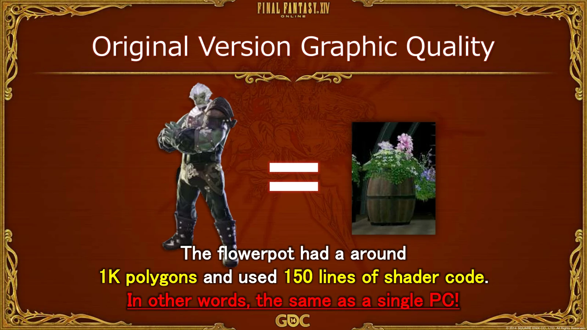
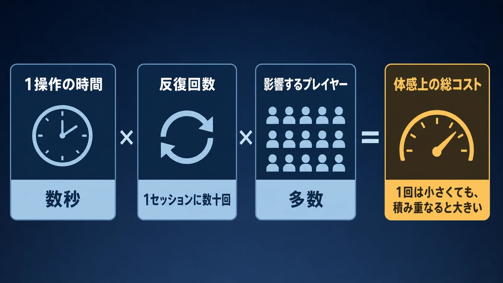
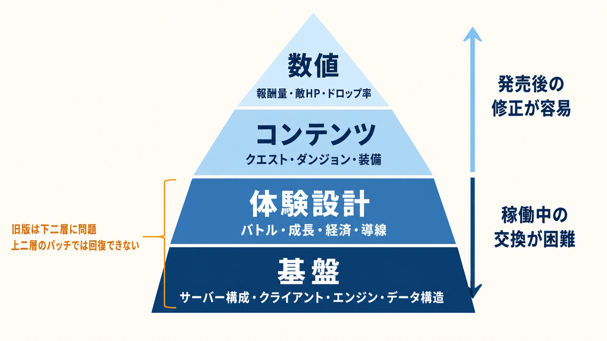
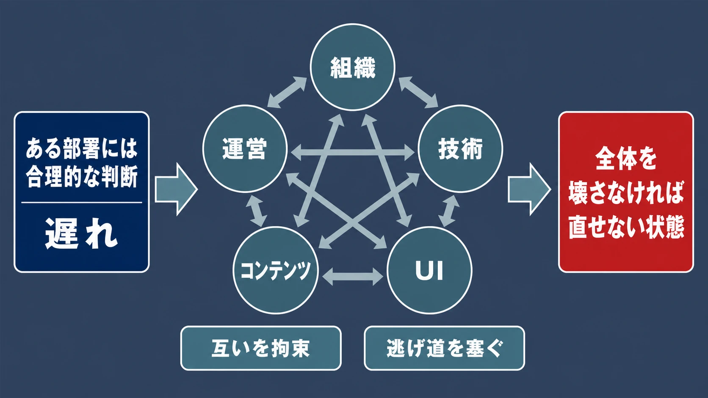

# FF14旧版（1.0）はなぜ崩壊したのか――大型タイトルが開発で破綻する構造

***

## はじめに

2010年9月30日、Windows版『ファイナルファンタジーXIV』の正式サービスが始まった。『ファイナルファンタジーXI』（以下、FFXI）に続く、シリーズ2作目のMMORPGである。MMORPGとは、多数のプレイヤーが同じ世界へ継続的に接続して遊ぶオンラインRPGを指す。[[1](#ref-1)]

ところが旧版、いわゆる「1.0」は、発売直後から操作の重さ、サーバーの不安定さ、分かりにくいUI、遊びの少なさを厳しく批判された。レビュー集積サイトMetacriticのPC版評価は、26媒体の平均で49点だった。[[2](#ref-2)] 同時期のGameSpotも、煩雑な導入、反復的なギルドリーヴ、オークションハウスの不在などを具体的に問題視している。[[3](#ref-3)]

ただし、これは「バグの多いゲームを急いで出した」という一文では説明しきれない。

新人プランナーが早い段階で解いておきたい誤解は、次の三つである。

- 面白い企画と美しいアセットがあれば、最後に統合してゲームになる
- 技術上の問題は、プログラマーが発売までに最適化すれば解決する
- オンラインゲームは発売後も更新できるので、不足はパッチで補える

どれも部分的には正しい。しかし大型タイトルでは、組織、技術、UI、コンテンツ、運営が互いを拘束する。どこか一つの判断が遅れると、別の部署がその前提で大量生産を始める。やがて問題を認識しても、直すには全体を壊すしかなくなる。

本記事は、後の『ファイナルファンタジーXIV: 新生エオルゼア』の成功物語ではなく、旧版がその状態へ至った構造を主役にする。特定の個人を断罪するためではない。大型開発で同じ兆候を見逃さないためである。

***

## 1. 何が起きたのか

旧版の経緯は、長い復活劇にせず、判断の節目だけを見る。

| 時期 | 確認できた出来事 | プロジェクト上の意味 |
|---|---|---|
| 2010年9月30日 | Windows版の正式サービス開始 | 低い完成度のまま市場評価を受ける段階へ入った |
| 2010年12月 | PS3版の発売時期を「未定」へ変更。Windows版の無料期間を継続 | 通常の月額課金へ移れず、品質改善を優先した[[4](#ref-4)] |
| 2010年12月 | 開発・運営体制を刷新し、吉田直樹氏がプロデューサー兼ディレクターへ就任 | 改修ではなく、プロジェクトの統治から組み替えた[[5](#ref-5)] |
| 2011年 | 旧版を更新しながら、別系統で新バージョンを開発 | 稼働中のサービスと作り直しを並行させた |
| 2012年11月11日 | 現行版の全ワールドを停止し、物語上も「第七霊災」で一区切り | 旧世界の終了をプレイヤー体験の一部として扱った |
| 2013年8月27日 | 『新生エオルゼア』正式サービス開始 | クライアント、サーバー、UI、マップ、バトルなどを刷新して再出発 |

2010年12月の公式発表は、PS3版をWindows版の単純移植にせず改善したものにするため、発売時期を未定へ変更すると説明した。また「最高品質のサービスを提供するための改善策」を示せるまで、Windows版の無料期間を継続するとした。[[4](#ref-4)] これは、売り切りソフトの不評とは違う。サービスを続けるほど運営費がかかるのに、本来予定していた継続課金を始めにくい状態だった。

同日、当時の社長だった和田洋一氏は公式メッセージで謝罪し、開発・運営チームの刷新を発表した。これにより、旧体制の田中弘道氏に替わって吉田氏がプロデューサー兼ディレクターに就任した。[[5](#ref-5)] 田中氏自身も、刷新に先立つ2010年11月の報道で、開発チームがデバッグ作業に追われてユーザーの要望を反映しきれなかったことを認め、発売後の反応はもっともだと語っていた。[[16](#ref-16)]

ここから先で重要なのは、悪評の大きさではない。なぜ、発売前に止められなかったかである。

***

## 2. 旧版はなぜ崩壊したのか

### 2-1. FFXIの成功が、次の市場を見る目を曇らせた

FFXIは、家庭用ゲーム機を含む複数機種で運営された先駆的なMMORPGであり、長期サービスにも成功した。旧版FF14は、その成功を経験した制作陣と企業文化の延長上で始まった。

成功経験の継承自体は悪くない。問題は、 **何が今も有効で、何が市場変化によって失効したか** を分けなかったことにある。

NoclipのドキュメンタリーPart 1で、吉田直樹氏は、FFXI開発時には当時の有力作『EverQuest』を研究していた一方、旧版FF14の開発チームでは、当時最大級の競合作『World of Warcraft』（以下、WoW）を遊んでいる人がいなかったと振り返っている。これはNoclipによる後年のインタビュー記録であり、当時の全メンバーを個別調査した統計ではない。それでも吉田氏が、競合と最新のユーザー体験を知らないことを失敗要因として認識していた点は重要である。[[6](#ref-6)]

WoW以降のMMORPGでは、クエストによる導線、短時間でも進む遊び、検索しやすい取引、素早いUI応答などが期待値になっていた。旧版はFFXIと同一ではないものの、長い反復や不親切さを「オンラインRPGらしさ」として残し、新しい標準への対応が遅れた。

2014年のGDC講演で、吉田氏は旧版失敗の背景を、FFXIの成功によって市場変化、ジャンル全体の設計変化、ユーザーニーズの変化を認識できなかったことだと整理した。さらに「グラフィックス品質への執着」「チーム内のMMORPG知識不足」「問題は将来のアップデートで直せるという考え」を、失敗へ至る三つの要因として挙げている。[[7](#ref-7)]

俗に「FFブランドなら売れるという慢心」と説明されることがある。ただし、その文言が当時の社内方針だったと確認できる資料は見当たらない。より正確には、吉田氏が後に「ファンベースを当然視した」「他作品と世界標準の知識が足りなかった」と述べ、過去の成功が偽の安心感を生んだと総括している。[[7](#ref-7)][[8](#ref-8)]

実務で警戒すべきなのは、誇りそのものではない。次の会話が増えたときである。

- 前作で成立したから、今回も説明を省いてよい
- 自社の客は、この不便さを理解してくれる
- 競合の仕組みは、自分たちの作品らしくないので調べなくてよい
- ブランド公開後なので、根本を変える方が危険だ

成功体験は、仮説を強くする材料にはなる。しかし検証を免除する証明書にはならない。

### 2-2. 役職はあっても、全体体験を止めるオーナーが弱かった

旧版にもプロデューサーとディレクターはいた。したがって「責任者が存在しなかった」と書くのは不正確である。問題は、 **複数部門をまたぐ完成体験に対して、実効的なオーナーシップが働いたか** である。

NoclipのPart 1で、ローカライズ責任者のMichael-Christopher Koji Fox氏は、バトルやアートなど各チームが自分たちの成果に誇りを持っていた一方、組み合わせると全体が混乱しており、ローカライズやQAは比較的早くその状態を見られる立場だったと回想する。また開発者の間では、ベータ前後に「この品質で出してよいのか」という非公式な懸念があったとも語られている。[[6](#ref-6)]

ここで起きていたのは、各部品の品質と、商品としての品質の逆転である。

| 部分最適で問われること | 全体最適で問うべきこと |
|---|---|
| バトル案は独創的か | 入力してから結果が返るまで気持ちよいか |
| 背景モデルは美しいか | 必要な人数分を量産でき、快適に表示できるか |
| 生産システムは奥深いか | レシピを理解し、素材を探し、売買まで完了できるか |
| 各機能は仕様どおり動くか | 初見のプレイヤーが迷わず一晩遊べるか |

大型開発では、誰も怠けていなくても破綻する。担当者は、自分の成果物をよくするほど評価される。一方、全体のために「この高品質アセットを軽くする」「この独自仕様を捨てる」「発売を止める」と言う役割は摩擦を生む。

必要なのは、肩書だけの責任者ではない。フレーム時間、通信応答、導線、コンテンツ量、制作速度を同じテーブルへ載せ、未達なら仕様を落とせる人である。

### 2-3. 技術選定は、企画が作れる範囲を先に決めていた

ゲームエンジンは、映像を表示するだけの道具ではない。入力、UI、アセット管理、通信、サーバー処理、制作ツールまで含めて、チームが何をどの速度で作れるかを決める土台である。

旧版ではCrystal Toolsが採用された。しかし「Crystal Toolsを選んだから失敗した」と単純化すると、判断を誤る。NoclipのPart 1で吉田氏が詳しく説明しているのは、エンジン名だけではなく、ゲームロジックとUIの多くをスクリプトで組む実装方針である。プランナーが自分で素早く実装できる利点がある一方、実行時のCPU負荷が大きく、小さな処理でもサーバー周期を圧迫した。その結果、ゲーム側で実現できる処理が狭まり、UI処理にも時間がかかったという。[[6](#ref-6)]

これは、プロトタイプの生産性と、製品運用時の性能が衝突した例である。

プランナーがコードを書かずに機能を作れる環境は強い。試行回数が増え、エンジニアの待ち時間も減る。しかしMMORPGでは、同じ処理が多数のプレイヤーとオブジェクトに対して同時に走る。1回では軽い処理も、数百人分では重くなる。通信の整合性をサーバー側で確認すれば、不正に強くなる代わりに、応答待ちが増える。

GDC講演では、旧版ローンチ時の状態として、不安定なサーバー、壊れたバトル、迷路状のマップ、不親切なUI、コンテンツ不足が一緒に挙げられている。[[7](#ref-7)] これは別々の不具合一覧ではない。重い基盤の上では、UI改善にもコンテンツ追加にも同じ技術的制約がかかる。

技術選定時にプランナーも確認すべきなのは、エンジンの有名さではない。

- 想定する同時人数で、最悪条件の処理が何ミリ秒に収まるか
- UI操作のたびに、どこまでサーバー応答を待つか
- 量産する敵、装備、クエストを誰がどのツールで作るか
- 仕様変更時に、何件のアセットとデータを作り直すか
- 発売後の更新を、サービスを止めずに安全に投入できるか

「実装できる」と「運用可能な性能で量産できる」は別の判定である。

### 2-4. 美しい植木鉢は、優先順位の誤りを可視化した

旧版を語るとき、植木鉢に約1,000ポリゴンと150行のシェーダーコードが使われ、プレイヤーキャラクター1体に近い負荷だったという逸話がよく出る。これは匿名の伝聞ではない。吉田氏がGDC 2014の講演スライドで、グラフィックス偏重の例として示した数字である。[[7](#ref-7)]

> 出典：吉田直樹「[Behind the Realm Reborn][7]」（GDC 2014、スライド15）。© 2014 SQUARE ENIX CO., LTD. All Rights Reserved.

ただし、「植木鉢一つがゲームを壊した」という話ではない。植木鉢は、 **画面の一部を最高品質にする評価軸が、画面全体と量産工程の予算を上回った** ことの象徴である。

高品質なアセットはFinal Fantasyの価値になる。問題は、次の予算が見えないまま作り込むことだ。

- 同じ画面に何個置かれるか
- プレイヤーや敵と同時表示されたときの負荷はいくつか
- 遠景用モデルやLODを作る工数はあるか
- 別地域へ流用できる部品になっているか
- その工数をUI、敵、クエスト、最適化へ使う案より価値が高いか

LODとは、カメラからの距離に応じて軽いモデルへ切り替える仕組みである。MMORPGでは、一つの最高品質モデルより、異なる距離と人数で破綻しないアセット群の方が重要になる。

一方で旧版のフィールドは、見た目への大きな投資にもかかわらず、迷路状で変化が乏しいと批判された。豪華な素材が、分かりやすい地形、遊びの密度、制作効率へ自動的につながるわけではない。

アセットレビューには「きれいか」だけでなく、「1時間のプレイ価値をいくら増やすか」「何回再利用できるか」「実機の混雑時にいくつ出せるか」を入れる必要がある。

### 2-5. UI/UXの遅さは、不便ではなくゲーム全体の遅さだった

旧版のUIは、単にメニューの見た目が古かったのではない。2010年当時のPC Gamerレビューは、インベントリ確認のような基本操作にも、操作系、ラグ、フレームレート低下、メニュー遷移が重なっていたと報告している。[[9](#ref-9)] GameSpotも、アカウント作成、パッチ適用、設定変更からゲーム内取引まで、複数の段階で摩擦を指摘した。[[3](#ref-3)]

UIはゲーム内容を包む外装ではない。プレイヤーがゲームルールへ入力する唯一の窓口である。

たとえば、アイテムを一つ売るまでに5回操作し、それぞれに待ち時間があるとする。1回の遅れは小さくても、冒険中に何十回も繰り返せば、その遅さがプレイ時間の大部分になる。クラフトが奥深くても、レシピ確認、素材選択、結果表示が重ければ、奥深さへ到達する前に離脱される。

UIの性能は、次の掛け算で見るとよい。

`1操作の時間 × 1セッションの反復回数 × 影響するプレイヤー数`

この値が大きい操作ほど、華やかな新機能より先に直す価値がある。旧版では、技術基盤とUI設計が結びついていたため、表示だけを差し替えても根治しにくかった。

### 2-6. 「公平にしたい」設計が、遊ぶほど損をする感覚を生んだ

旧版の疲労度システムは、長時間遊べる人だけが極端に先行しないようにし、時間の少ない人にも有効な成長を与える意図で説明されていた。一定の成長量を超えると、得られる経験値やスキルポイントが段階的に減る設計である。

狙いには合理性がある。MMORPGでは、プレイ時間の差がコミュニティ内の格差になりやすい。複数クラスを試してほしいという、アーマリーシステムとの整合も考えられる。

しかしプレイヤー側から見ると、「遊びたいときに遊ぶほど報酬が減る」。休ませたい運営の都合が、ペナルティとして表示される。しかも発売時には、反復的なギルドリーヴが主要な遊びを占め、クエストや終盤コンテンツも不足していた。選択肢が少ない状態で、その少ない進行まで制限したため、意図と体感が逆転した。

疲労度と余剰ポイントは、2011年7月のパッチ1.18で廃止された。[[10](#ref-10)] 重要なのは、評判が悪かったから削除されたという結果だけではない。

制限設計では、次の三点を分ける必要がある。

1. 運営が抑えたい行動は何か
2. プレイヤーに増やしてほしい別の行動は何か
3. 切り替え先に、同等以上に面白い選択肢があるか

3番がなければ、制限は遊び方の提案ではなく、ログアウトの提案になる。

### 2-7. 経済とコンテンツは、機能の存在より到達性で決まる

旧版にはプレイヤー間取引がなかったわけではない。リテイナーとマーケット区画を使って売買する仕組みがあった。しかし発売時には一般的なオークションハウスがなく、欲しい品を見つけるまで、多数のリテイナーを調べる必要があった。GameSpotの発売時レビューは、この仕組みをゲーム内経済の大きな摩擦として扱っている。[[3](#ref-3)]

ここでも独自性自体が問題なのではない。市場を人のいる空間として見せる設計には、世界設定上の魅力がある。検索一発の取引より、偶然の発見を生む可能性もある。

ただし、必要な素材を探すコストが高いと、生産職の体験まで止まる。売れた価格を比較できなければ、相場形成も遅れる。経済UIの不便は商人役のプレイヤーだけでなく、装備更新、クラフト、戦闘準備へ連鎖する。

コンテンツ不足も同じである。「クエストが何本あるか」だけでは測れない。

- 次の遊びを見つけられるか
- 同じ目的でも、場所、敵、判断が変わるか
- 成長した先に、新しい挑戦と報酬があるか
- パーティーを組む理由と、組むまでの手段があるか
- 運営が次の更新を量産できる構造か

旧版は、個々のシステムに複雑さがあっても、プレイヤーが繰り返し到達できる遊びの幅が狭かった。 **システムの深さと、コンテンツの厚さは別物** である。

### 2-8. 最後の防波堤だった発売判定が、「後で直せる」に負けた

NoclipのPart 1では、ベータ段階で品質への懸念がありながら、「出せば意外に受け入れられるかもしれない」「MMORPGによくある問題としてパッチで直せるかもしれない」という、根拠の薄い期待が残っていたと関係者が振り返っている。[[6](#ref-6)]

オンラインゲームは発売後に直せる。これは事実である。しかし、直せる範囲には層がある。

| 層 | 発売後の修正 | 例 |
|---|---|---|
| 数値 | 比較的しやすい | 報酬量、敵HP、ドロップ率 |
| コンテンツ | 工数をかければ追加できる | クエスト、ダンジョン、装備 |
| 体験設計 | 影響範囲が大きい | バトル、成長、経済、導線 |
| 基盤 | 稼働中の交換が極めて難しい | サーバー構成、クライアント、エンジン、データ構造 |

旧版は、下二層に問題を抱えたまま、上二層のパッチで回復できるように扱ってしまった。

吉田氏は2011年のインタビューで、旧版には技術面とゲーム内の双方に問題があり、当時のMMORPGで当然期待される要素が不足していたこと、ユーザーと十分に近い距離で開発していなかったことを挙げている。また、社内の別チームから支援を出す判断も遅かった可能性があると述べた。[[11](#ref-11)]

発売判定に必要なのは「残件が何件あるか」ではない。残件がどの層にあり、発売後に安全に交換できるかである。

***

## 3. 新人プランナーが警戒すべき兆候

旧版の要因を、現在のプロジェクトで観測できる言葉へ置き換える。

| 兆候 | 隠れている危険 | 確認する問い |
|---|---|---|
| 前作の仕様が理由なしで残る | 成功条件を市場の普遍法則と誤認している | 今回の対象ユーザーでも、同じ行動が観測できるか |
| 競合作品の話が好みの議論で終わる | 現在の最低期待値を把握していない | 競合ができて自作ができないことは何か |
| 各部署の進捗は良いのに、通しプレイが少ない | 部分最適を止めるオーナーがいない | 初回起動から1時間を、誰が責任を持って評価するか |
| 実機負荷を「最適化で何とかする」と言う | 企画量と技術予算が接続されていない | 最悪条件の計測値と削減候補はあるか |
| 代表アセットだけが先に豪華になる | 量産性、再利用性、表示予算が後回し | 同品質で必要数を期限までに作れるか |
| UI改修が終盤工程に置かれる | ゲーム全体の反復コストを過小評価している | 最頻操作の完了時間を計測したか |
| 制限だけあり、代替行動がない | 運営都合がプレイヤーへの罰になる | 制限に達した人へ、次の面白さを提示できるか |
| 「発売後に直す」が増える | 基盤問題をコンテンツパッチと同列に扱っている | 稼働中に交換できない要素はどれか |

この表は正解集ではない。たとえば、意図的に不親切な探索ゲームもある。検索性を落とすことで、人づての取引を生む作品もある。重要なのは、不便を消すことではなく、 **不便が狙った体験を生み、その代価をチームが理解しているか** である。

また、全機能に一人の承認を要求すれば、今度は意思決定が詰まる。必要なのは独裁ではない。越えてはいけない性能、体験、納期の境界を明文化し、境界を越えたときだけ全体責任者が止める仕組みである。

***

## 4. どう立て直したのか――対比として見る

立て直しの詳細は、本記事の主題ではない。旧版との違いが見える点だけを押さえる。

吉田氏の体制は、旧版を更新しながら、新しいクライアント、サーバー、グラフィックス基盤、マップ、UIを並行して作る方針を採った。GDC講演では、基本設計の重要判断をプロデューサー兼ディレクターへ集める一方、詳細はMMORPG経験のあるリードへ委ね、一般的なMMORPGの基礎機能を先にそろえたと説明されている。[[7](#ref-7)]

NoclipのPart 2では、UI担当の皆川裕史氏らが、まず旧版で優先順位の高いUI修正とバトル改修を進め、それと並行して新生版を構築した過程を振り返る。旧版の運営は、残ったプレイヤーへの対応であると同時に、新しい設計と運営手順を試す場にもなった。[[12](#ref-12)]

2012年11月11日の全ワールド停止は、単なるサーバー停止告知で終わらなかった。月が落ち、世界が第七霊災に包まれる出来事としてゲーム内の物語へ組み込まれた。後のプロデューサーレターでも、吉田氏は「ひとつの時代」の終焉として説明している。[[13](#ref-13)] プレイヤーが費やした時間をなかったことにせず、旧世界の最期を新世界の前史にした。

NoclipのPart 3は、新生版の発売時にもサーバー収容で問題が起きたことを含め、再出発が無傷の成功ではなかった点を記録している。同時に、プレイヤーが自分の速度で遊び、遅れても追いつける設計思想や、継続的な対話が信頼回復を支えたと描いている。[[14](#ref-14)] 2013年8月27日の公式発表も、UIとバトルを含む全面刷新、テスト参加者のフィードバックを明記した。[[15](#ref-15)]

ただし、この復活を「優れたリーダーを一人連れてくれば再現できる」と一般化してはいけない。

吉田氏のMMORPG経験、意思決定速度、対外説明、現場の信頼形成は大きかった。一方で、旧版を保守しながら別のMMORPGを作る予算、人員、時間を会社が認めなければ実行できない。吉田氏自身も2011年、開発と運営をスクウェア・エニックスが自社資金で支えていたため、会社が支援を続けると決める限り再挑戦できたと説明している。[[11](#ref-11)]

再現しやすい教訓があるとすれば、個人の天才性ではなく次の条件である。

- 既存版の延命と、基盤の作り直しを別計画として扱う
- 誰が最終判断するかを明確にする
- 競合の標準機能を学び、独自性より先に土台をそろえる
- プレイヤーの不満を、広報上の問題ではなく仕様の入力として扱う
- 経営が、短期採算だけでは説明しにくい並行開発を引き受ける

それでも、同じ条件をそろえれば必ず復活できるわけではない。多くの会社では、失敗後に二重開発を支える資金も、ブランドを待ってくれる顧客もない。だからこそ、旧版が発した兆候を発売前に拾う方が再現性は高い。

***

## 5. 大型タイトルは、一つの大失敗ではなく判断の連鎖で崩れる

旧版FF14は、技術だけ、UIだけ、コンテンツだけで失敗したのではない。

FFXIの成功が市場認識を遅らせた。グラフィックスを優先する制作文化が、アセット予算を膨らませた。重い実装基盤が、UI応答と追加できる遊びを制約した。全体を通した評価が遅れ、ベータで見えた問題も発売を止める根拠にならなかった。そして「オンラインなら後で直せる」という性質が、延期すべき問題と更新で直せる問題の境界をぼかした。

大型タイトルが怖いのは、誰か一人が露骨に誤った判断をすることではない。各部署にとっては合理的な判断が、全体では互いの逃げ道を塞ぐことである。

プランナーの仕事は、面白い仕様を書くことだけではない。

- この仕様は最悪条件で動くか
- 必要数を量産できるか
- 初見の人が価値へ到達できるか
- 競合と比べて、意図した不便なのか、単なる遅れなのか
- 発売後に直せる層か、今止めなければならない層か

これらを早く問い、都合の悪い答えを計画へ戻すことも企画である。

旧版FF14が残した最も普遍的な示唆は、失敗から奇跡的に復活できることではない。 **成功経験、専門性、ブランド、努力が十分にあっても、全体を検証する仕組みがなければ大型開発は破綻する** ということだ。

## References

1. [「ファイナルファンタジー」シリーズ最新作「ファイナルファンタジーXIV」Windows版発売日決定！MMORPGとして全世界同時発売][1] - 2010年9月30日の正式サービス開始日と、当初の料金体系を確認できるスクウェア・エニックス公式発表。

2. [Final Fantasy XIV Online Reviews][2] - 旧版PC版について、26媒体のMetascoreが49であったことを示すレビュー集積ページ。

3. [Final Fantasy XIV Online Review][3] - GameSpotによる2010年10月の発売時レビュー。反復的なギルドリーヴ、UI、マーケット区画、オークションハウス不在などを具体的に報告。

4. [「ファイナルファンタジーXIV」プレイステーション3版 発売時期変更およびWindows版 無料期間継続のお知らせ][4] - 2010年12月10日のスクウェア・エニックス公式発表。PS3版延期と無料期間継続の理由を説明。

5. [「ファイナルファンタジーXIV」、開発体制刷新　和田社長が謝罪「もう過去の繰り返しはできない」][5] - 2010年12月の体制刷新と吉田直樹氏のプロデューサー兼ディレクター就任を報じた当時の記事。

6. [FINAL FANTASY XIV Documentary Part #1 - “One Point O”][6] - Noclipによる指定ドキュメンタリー第1部。吉田直樹氏、Michael-Christopher Koji Fox氏らのインタビューを通じ、旧版の技術、競合認識、組織、発売判断を扱う。

7. [Behind the Realm Reborn][7] - 吉田直樹氏によるGDC 2014講演スライド。FFXIの成功体験、グラフィックス偏重、MMORPG知識不足、植木鉢の負荷、作り直しの計画を説明。

8. [FFXIV: A Realm Reborn interview: “We took our fanbase for granted”][8] - 吉田直樹氏が、ファンベースを当然視したこと、他作品と世界標準の知識不足を振り返った2013年のインタビュー。

9. [Final Fantasy XIV review][9] - PC Gamerによる2010年10月の発売時レビュー。UI、操作、ラグ、フレームレート、コンテンツの問題を同時代のプレイ体験として記録。

10. [Patch 1.18 Notes][10] - 2011年7月の公式パッチノート。疲労度システムと余剰ポイントの廃止を確認できる。

11. [Fixing Final Fantasy XIV: The Yoshida Interview][11] - 2011年4月の吉田直樹氏インタビュー。技術とゲーム内容、ユーザーとの距離、社内支援、自社資金による再挑戦について説明。

12. [FINAL FANTASY XIV Documentary Part #2 - “Rewriting History”][12] - Noclipによる指定ドキュメンタリー第2部。旧版の更新と新生版開発の並行、UIとバトルの改修、運営継続を関係者証言から記録。

13. [第39回 FFXIVプロデューサーレター][13] - 2012年11月11日の全ワールド停止と、物語上の「終焉」を吉田直樹氏が振り返った公式フォーラム投稿。

14. [FINAL FANTASY XIV Documentary Part #3 - “The New World”][14] - Noclipによる指定ドキュメンタリー第3部。新生版の再出発、発売時のサーバー問題、長期運営の設計思想を扱う。

15. [ファイナルファンタジーXIV: 新生エオルゼア 正式サービス開始！][15] - 2013年8月27日の正式サービス開始と、UI、バトル、グラフィックスなどの刷新を告知した公式発表。

16. [『FFXIV』プロデューサー田中氏： ユーザーの要望を取り入れる余裕がなかった][16] - 2010年11月のGame*Spark記事。田中弘道氏が、開発チームがデバッグ作業に追われて寄せられた要望を反映しきれなかったこと、発売後のユーザーの反応は理解できると述べたことを伝えている。

[1]: https://www.jp.square-enix.com/company/ja/news/2010/html/b5aa688d063d514f066ccca4593d77870c21fb64.html
[2]: https://www.metacritic.com/game/final-fantasy-xiv-online/?platform=pc
[3]: https://www.gamespot.com/reviews/final-fantasy-xiv-online-review/1900-6280901/
[4]: https://www.jp.square-enix.com/company/ja/news/pdf/20101210_266.pdf
[5]: https://www.itmedia.co.jp/news/articles/1012/10/news090.html
[6]: https://youtu.be/Xs0yQKI7Yw4
[7]: https://media.gdcvault.com/GDC2014/Presentations/GDC2014_FFXIV_Behind_The_Realm_Reborn_NaokiYoshida_v2.pdf
[8]: https://www.pcgamer.com/ffxiv-a-realm-reborn-interview-we-took-our-fanbase-for-granted-we-lacked-the-knowledge-of-other-titles/
[9]: https://www.pcgamer.com/final-fantasy-xiv-review/
[10]: https://forum.square-enix.com/ffxiv/threads/17007-patch1.18-Patch-1.18-Notes?p=241517&viewfull=1
[11]: https://www.gamedeveloper.com/business/fixing-i-final-fantasy-xiv-i-the-yoshida-interview
[12]: https://youtu.be/aoOI5R-6u8k
[13]: https://forum.square-enix.com/ffxiv/threads/58628
[14]: https://youtu.be/ONT6fxiu9cw
[15]: https://jp.finalfantasyxiv.com/lodestone/topics/detail/cd83d833536cee6cb843112e33869ef25cf07a55
[16]: https://www.gamespark.jp/article/2010/11/12/25602.html

----

この文書は、Perplexity、Claude、OpenAI Codex の3つのAIの支援を受けて著述されたものです。引用画像を除き、MIT License にて提供されています。
