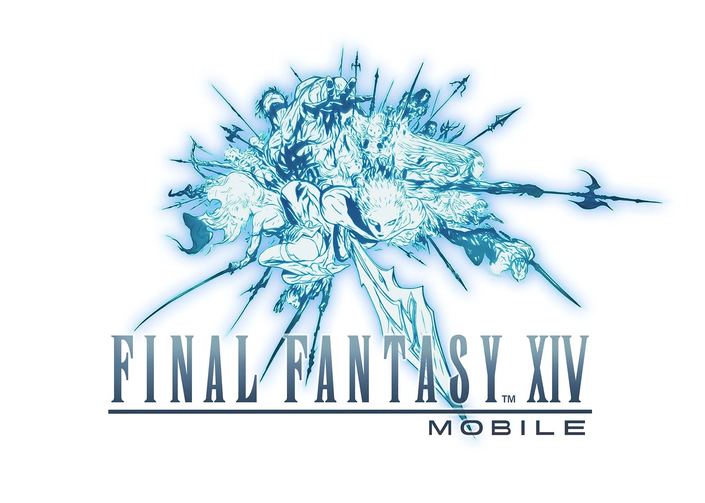
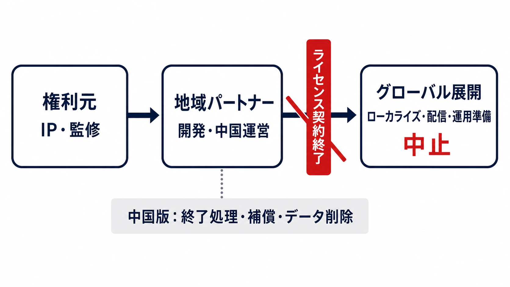
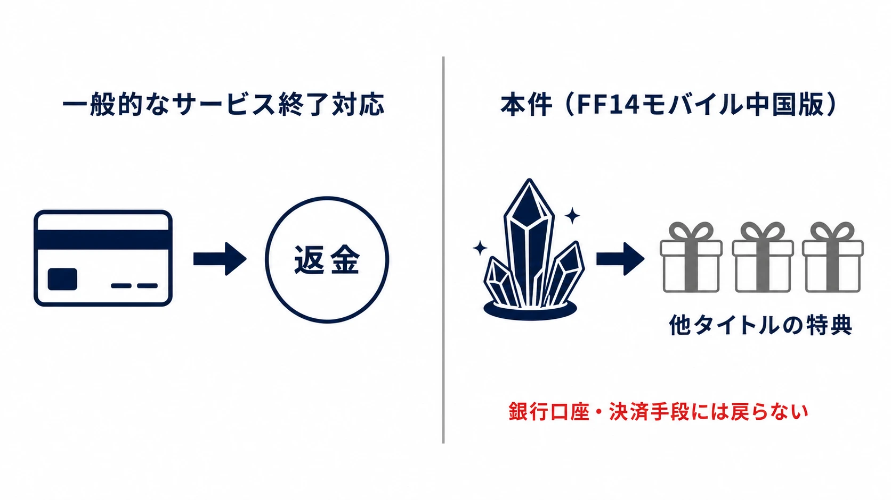

# 『ファイナルファンタジーXIV モバイル』は、なぜ中国版とグローバル展開を同時に失ったのか――提携・ライセンス契約がロードマップを止めるとき

## はじめに――これは「ゲームが売れなかった」だけでは説明できない終了である

2026年7月17日、『ファイナルファンタジーXIV：モバイル（最终幻想14：水晶世界）』の運営チームは、中国本土版を同年9月30日に終了すると発表した。同じ告知には、テンセントとスクウェア・エニックスがライセンス契約を終了すること、そしてグローバル版を待っていた人々の期待に添えなかったことへの謝罪も記された。[[1](#ref-1)]

これは、発売後の市場適合に失敗した『Concord』、P2Eの収支構造を抱えた『TOKYO BEAST』、ビジュアルが集めた客層とライブサービスの設計が噛み合わなかった『BLUE PROTOCOL』とは、見るべき場所が異なる事例である。本件の公式説明は、ゲーム内容の評価や売上を終了理由に挙げていない。運営業務の見直しと市場環境の変化を背景に、二社が友好的な協議を経てライセンス契約を終了した、というものである。[[1](#ref-1)]

したがって本稿は、作品の出来やプレイヤー数を推測して終了原因とするものではない。中国先行からグローバル展開へ進むはずだった製品が、ライセンスを持つ提携の解消によって、提供済みの地域と未提供の地域をともに失うまでを追う。焦点は「何が売れなかったか」ではなく、「誰が何を持つ提携だったか」である。

***

## 中国先行とグローバル展開を、一つの提携で結んだ製品

### スクウェア・エニックス監修、LIGHTSPEED STUDIOS開発という座組み

『ファイナルファンタジーXIV モバイル』は、スクウェア・エニックスのライセンスを受け、テンセント傘下のLIGHTSPEED STUDIOSが開発を担う形で2024年11月に発表された。『ファイナルファンタジーXIV』のプロデューサー兼ディレクター吉田直樹氏と開発メンバーが監修し、中国本土で先行して提供した後、フィードバックを踏まえてグローバル展開する計画であった。[[2](#ref-2)]

ここで重要なのは、中国版が単なる地域版ではなかった点である。モバイル向けに別途構成されたMMORPGを、同じ開発・権利許諾の枠組みで中国から海外へ広げる計画だった。中国での提供結果は市場テストであると同時に、グローバル版の開発、運用、ローカライズ、配信の前提を支える最初の稼働拠点でもあった。

発表時に示された内容は、モバイル操作に最適化したバトル、開始時点の9ジョブ、ギャザラーやクラフターといった生産・採集系クラス、釣りやトリプルトライアド、ゴールドソーサーなどである。PC・コンソール版へそのまま接続する補助アプリではなく、原作の物語と遊びをモバイル向けに組み直す独立した製品として設計されていた。[[2](#ref-2)]

*画像出典（引用）：[Proxima Beta Pte. Ltd.「スクウェア・エニックス監修『ファイナルファンタジーXIV』公式モバイルゲームが世界初公開」][2]（PR TIMES、2024年11月20日）。© SQUARE ENIX / LOGO & IMAGE ILLUSTRATION: © YOSHITAKA AMANO。無改変で引用。*

### 2025年6月から、約15か月の運営へ

中国版『最终幻想14：水晶世界』は、2025年6月19日にデータを削除しない公開テストとして提供を開始した。終了予定日の2026年9月30日までを運営期間として数えると、約15か月である。[[3](#ref-3)][[1](#ref-1)]

| 時点 | 公開された出来事 | 製品ロードマップへの意味 |
| --- | --- | --- |
| 2024年11月 | LIGHTSPEED STUDIOSとスクウェア・エニックスがモバイル版を発表。中国先行後のグローバル展開を案内 | 中国版を最終市場ではなく、海外展開を含む出発点に置いた。[[2](#ref-2)] |
| 2025年6月19日 | 中国版が提供開始 | 実サービス、運用組織、課金、サポートが動き始めた。[[3](#ref-3)] |
| 2026年7月17日 | ライセンス契約終了とサービス終了予定を告知。課金と新規登録を停止 | 新規売上を止め、運用を終了処理へ切り替えた。[[1](#ref-1)] |
| 2026年7月20日 | 未使用の有償「水晶点」への補償施策を公表 | 利用者への対応を、現サービスの継続ではなく別タイトルの特典へ移した。[[4](#ref-4)] |
| 2026年9月30日予定 | 中国本土版のゲームサーバーと公式サイトを閉鎖 | 中国版の提供を終え、ログイン不可となる。[[1](#ref-1)] |
| 2026年10月15日予定 | フォーラムと専用カスタマーサポートを終了 | 終了後の問い合わせ窓口も閉じる。[[1](#ref-1)] |

*図：権利元、地域パートナー、グローバル展開が一つの提携で結ばれる場合、契約終了は中国版の終了処理と海外展開の中止へ同時に波及する。*

***

## 二社が公式に述べたこと、述べていないこと

終了告知の名義は『ファイナルファンタジーXIV モバイル』運営チームである。告知は、運営業務の見直しと市場環境の変化を理由として挙げ、テンセントとスクウェア・エニックスが友好的な協議を経てライセンス契約を終了すると記した。中国本土版の終了時刻、課金と新規登録の停止、サーバー・公式サイト・フォーラム・専用サポートの閉鎖予定も同じ告知に示された。[[1](#ref-1)]

これは両社の共同発表として読める公式説明である。ただし、どちらの企業が契約終了を求めたか、収益、利用者数、開発費、具体的な市場変化、あるいはゲーム内容のどこを問題と判断したかまでは説明していない。公開された理由を「中国市場で失敗した」「品質が基準に届かなかった」と読み替えることはできない。

グローバル版については、告知が「期待していた皆様には、ご期待に添えなかった」と謝罪している。これは、当初に中国先行後の展開として案内されていた海外版が実現しないことを、運営側が明示したものと読める。海外向けの発売日が正式に告知された後に取り消された事例ではないが、計画段階の製品ロードマップが契約終了と同時に閉じた事例である。[[2](#ref-2)][[1](#ref-1)]

### なぜ中国版の契約終了が、海外版まで止めるのか

ライセンス契約には通常、使えるIP、地域、期間、許される改変、監修、素材の取り扱い、収益の分配、終了後の処理が定められる。モバイル版の開発、地域運営、グローバル展開準備を一つのパートナーが担う場合、契約が終了すればロゴやキャラクターを使う権利だけでなく、継続開発の法的な前提も失われる。

このとき、完成度が高いクライアントや未配信のローカライズ済みテキストが残っていたとしても、それだけでは発売できない。誰がサーバーを運用するのか、誰がストア上の販売主体になるのか、誰が個人情報とCSを担うのか、誰が監修を受けて更新を承認するのかを、契約に沿って再構成する必要がある。権利元が別のパートナーへ引き継ぐ選択肢はあり得るが、ソースコード、運用ツール、アカウント基盤、データ保護の責任範囲まで移管できなければ、既存ロードマップをそのまま再開することは難しい。

本件は、この再構成が公表されないまま、グローバル版への謝罪と中国版の終了が同時に告知された。提供済みの一地域だけでなく、まだ収益化していない将来地域の売上機会、コミュニティ形成、コンテンツ投資も、提携終了の影響範囲に入ったのである。

***

## 課金ユーザーへの対応――返金ではなく、他タイトルの特典への補償

終了告知では、2026年7月17日にゲーム内課金と新規登録を停止し、法令または利用者との契約に別段の定めがない限り、サーバー終了後にアカウントデータとキャラクター情報を削除すると案内した。[[1](#ref-1)]

続いて中国版の運営チームは7月20日、補償施策の詳細を公表した。対象は、同日11時までに本作の商品を購入し、未使用の有償「水晶点」が残る利用者である。残高に応じて、『剣侠情縁』『天龍八部』『天涯明月刀』の関連特典パックを選べる仕組みであり、無料で獲得した通貨は対象外とされた。[[4](#ref-4)]

この対応を現金返金と呼ぶのは正確ではない。中国版の終了告知は、未消費の仮想通貨や未失効のゲームサービスについて、補償施策で扱うことを「置換」と表現している。詳細告知も、残高に対応する他タイトルの特典パックを示しており、銀行口座や決済手段へ返金する手続きは案内していない。参加者は補償・置換案を承認したものと扱われ、当初告知では参加期限を2026年9月19日23時59分としていた。[[4](#ref-4)][[5](#ref-5)]

これは終了対応の受け止め方を左右する。プレイヤーにとって、残高を別タイトルで使える特典に替えることと、購入額を同じ決済手段へ戻すことは同じではない。運営側にとっては、終了タイトルの残高を現金精算だけでなく自社・提携先の別サービスへ接続する方法でもある。企画段階では、終了時の有償通貨をどの法域でどの手段により扱うか、契約と利用規約に加え、プレイヤーが理解できる説明として準備しておく必要がある。

*図：本件の補償は、有償「水晶点」の残高を他タイトルの特典へ置き換えるものであり、銀行口座や決済手段への返金ではない。*

***

## 単一パートナーに海外展開を委ねるときの、四つの確認項目

ライセンスを使った共同開発自体は、専門性、地域の配信基盤、既存の運営組織を素早く得られる有効な選択肢である。問題は、地域パートナーへの依存がどこまで製品全体へ広がっているかを、契約締結時に見えない状態のままにすることである。

### 1. 地域ごとの売上ではなく、依存関係を地図にする

中国、北米、欧州、日本を収益予測の列として並べるだけでは足りない。IPの利用許諾、クライアントの知的財産、ビルド環境、サーバー、決済主体、アカウント、個人情報、CS、ローカライズ、ストア契約を列にし、誰が所有し、契約終了後に誰が使えるかを地域ごとに書き出す必要がある。

中国のパートナーが開発だけを担うのか、中国の運営も担うのか、さらに海外の配信・運用まで担うのかで、同じ「中国先行」でも失う範囲が変わる。地域の契約解消がグローバル版の停止へ直結するなら、その地域は市場の一つではなく、ロードマップ上の単一障害点である。

### 2. 契約終了を、終了通知の文面まで落とし込む

契約には、満了・解除・更新停止の条件だけでなく、その後に何が残るかを定める必要がある。具体的には、ソースコードや運用ツールの引渡し、継続利用できるIP素材の範囲、監修の継続、未配信地域のローカライズ資産、ストア掲載情報、ドメイン、公式SNS、障害対応の責任分界である。

権利元が後継の運営者を指定できるステップイン権、移管のための技術文書、データを移す際の同意取得手順をあらかじめ置いておけば、契約終了は直ちに世界全体の中止を意味しない。一方、相手方の専有技術や地域規制上の主体に強く依存するなら、移管できないことを前提に、グローバル版の発表時期と投資額を決めるべきである。

### 3. 先行地域を「試験」と呼ぶなら、次地域の解除条件を共有する

中国先行には、端末性能、操作性、課金、運用負荷を実サービスで確かめられる利点がある。しかし、先行地域の結果や提携状況が悪化したとき、次地域のどの開発が止まり、いつ意思決定するのかが決まっていなければ、海外の事前登録者や社内のローカライズ・マーケティング組織に不確実性を広げる。

そのため、事業計画では中国版のKPIだけでなく、グローバル版を進めるための権利・開発・運営の継続条件を分けて管理する。たとえば、地域版の売上目標未達と、ライセンス更新の失敗と、ストア審査の遅延は、同じ「海外展開リスク」でも必要な対策が異なる。前者には収支の見直し、後者には代替運営体制、ストア審査には配信計画の余裕が必要になる。

### 4. 課金の出口を、地域別に製品仕様として持つ

サービス終了時の課金対応は法務の最後の作業ではない。通貨の発行主体、購入経路、未使用残高、利用規約、地域法、返金か代替提供か、問い合わせ窓口、データ削除の時期を、地域ごとに製品仕様として持つ必要がある。

本件では、中国版の未使用有償通貨に対して他タイトルの特典を提示した。グローバル版が実現していた場合、各地域の決済事業者、消費者保護、アカウント体系に合わせた別の対応を用意する必要があったはずである。終了処理を一地域の運営者に任せる設計は、開始時の速さを得る一方、撤退時の説明と補償もその地域の座組みに結び付ける。

***

## おわりに――製品の寿命は、ゲームサーバーの外側でも決まる

『ファイナルファンタジーXIV モバイル』中国版の終了は、ゲーム内容への評価を公式理由として示さないまま、ライセンス契約の終了によって告知された。中国本土版のサービス終了、未使用有償通貨への代替補償、グローバル版への謝罪は、一つの判断がプレイヤー対応と将来の市場展開へ同時に波及したことを示している。[[1](#ref-1)][[4](#ref-4)]

ゲームを海外へ広げるとき、契約は発売許可を得るための書類ではない。誰が開発し、誰が運営し、どの地域まで権利を使え、提携が終わったときに誰が製品を引き継げるかを決める、ロードマップそのものである。市場に届く前のグローバル版まで守りたいなら、ゲームの面白さと地域別の収支に加え、提携が切れた後も製品を動かせる設計を最初から持たなければならない。

## References

1. [『ファイナルファンタジーXIV モバイル』公式ポータル][1] - 中国本土版のサービス終了、ライセンス契約終了、課金停止、サーバー・公式サイト・サポートの閉鎖予定に関する案内。

2. [スクウェア・エニックス監修『ファイナルファンタジーXIV』公式モバイルゲームが世界初公開][2] - LIGHTSPEED STUDIOSによる開発、中国先行後のグローバル展開、初公開時の内容を示すProxima Beta Pte. Ltd.の発表。

3. [腾讯手游《最终幻想 14：水晶世界》9 月 30 日停止在中国大陆地区运营][3] - 2025年6月19日の公開テスト開始と終了日程を報じたIT之家の記事。

4. [『最终幻想14：水晶世界』公式ポータル][4] - 未使用の有償「水晶点」に対する他タイトル特典への補償施策の案内。

5. [『最终幻想14：水晶世界』公式ポータル][5] - サービス終了時の未消費通貨とゲームサービスの置換に関する案内。

[1]: https://ffxivmobile.com/web202409/#/news/detail?lang=jp&id=d28adab3-376d-460a-aa74-70f4b2cc1c1f
[2]: https://prtimes.jp/main/html/rd/p/000000001.000152649.html
[3]: https://www.ithome.com/0/978/213.htm
[4]: https://ffxivmobile.com/web202409/#/news/detail?lang=zh&id=8f1ac1f0-9624-46a1-b29d-35b36433fba7
[5]: https://ffxivmobile.com/web202409/#/news/detail?lang=zh&id=504ce0f0-707c-4292-bf2a-9e197641eac2

----

この文書は、Perplexity、Claude、OpenAI Codex の3つのAIの支援を受けて著述されたものです。引用画像を除き、MIT License にて提供されています。
