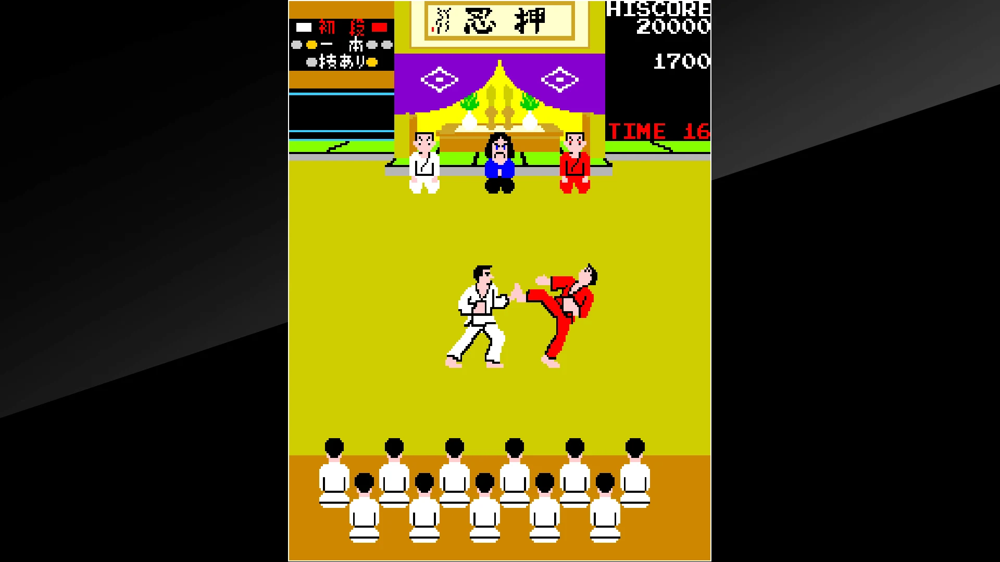
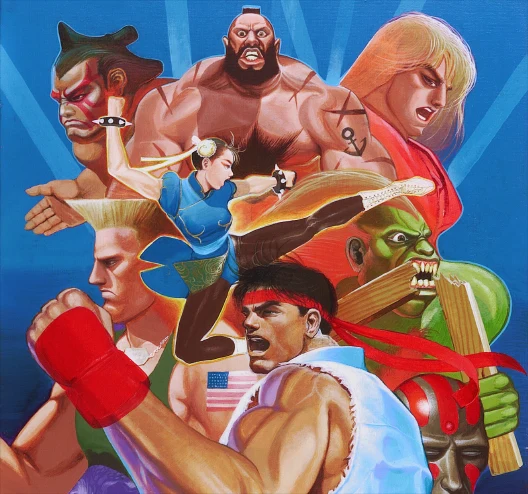
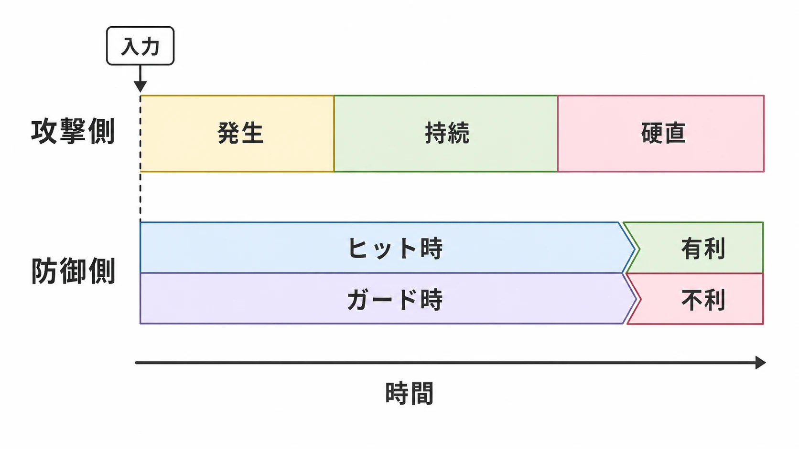
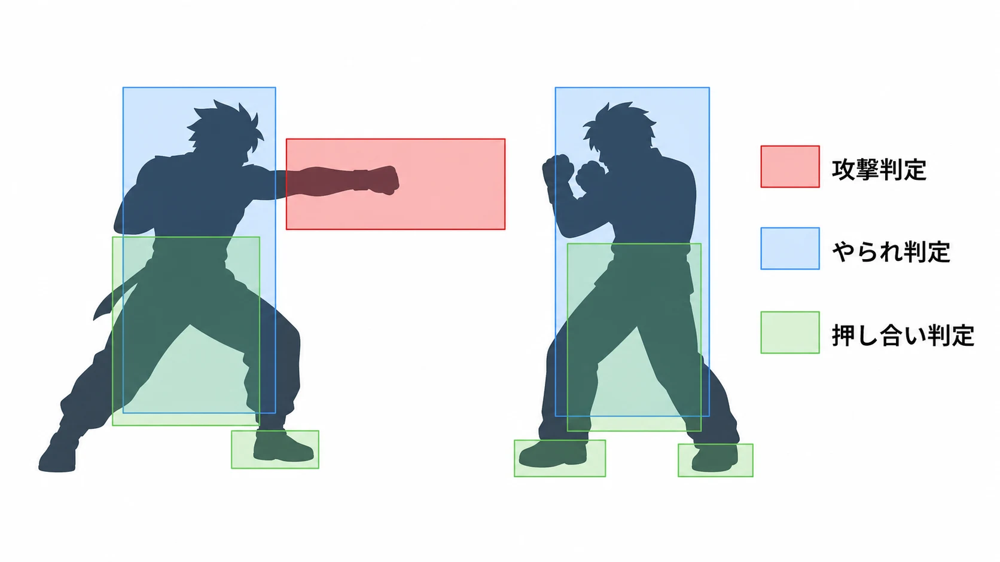
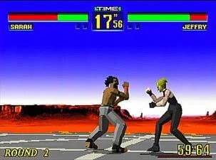
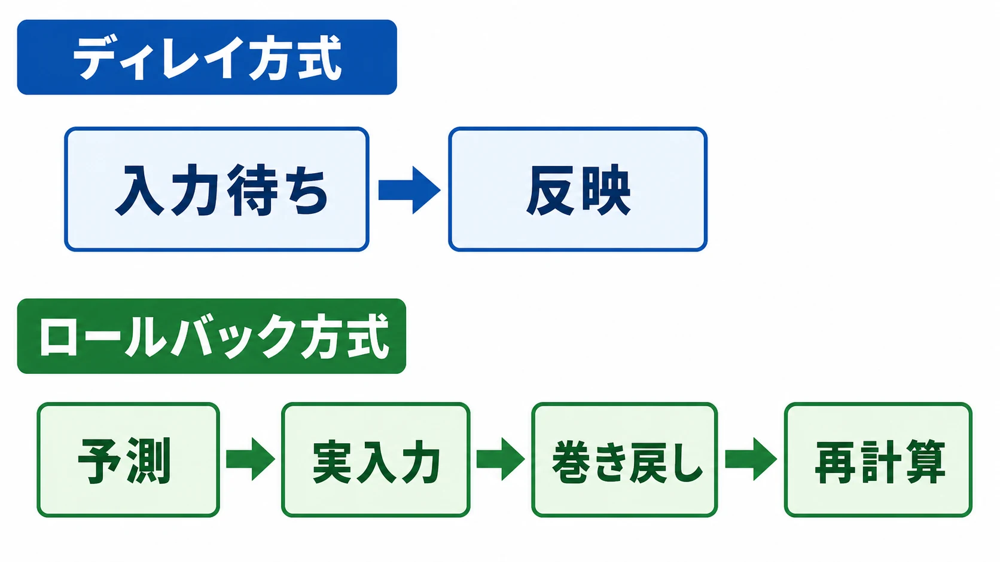

# 対戦格闘ゲームの歴史――ストII以前からロールバック時代まで

対戦格闘ゲームの歴史は、しばしば『ストリートファイターII』から始まる。しかし、これは半分だけ正しい。

1対1で武術を競うゲームは、それ以前にもあった。『空手道』は2本のレバーで技を出し分け、『カラテカ』は横から見た決闘を映画的な動きで描き、初代『ストリートファイター』はコマンド入力の必殺技と6ボタン操作をすでに備えていた。『ストリートファイターII』が発明したのは「画面の左右に立った2人が殴り合う」という形式ではない。

同作が決定的だったのは、散在していた要素を **繰り返し対戦できる競技の体系** にまとめ、ゲームセンターという場所ごと大衆化したことだ。本稿では、この違いを出発点にする。作品の年表だけでなく、フレーム、当たり判定、通信、店舗運用、コミュニティという泥臭い条件が、ジャンルをどう形づくったかを追う。

----

## まず全体像――「最初」と「確立した作品」は別である

| 年 | 作品・出来事 | 本稿で見る意味 |
| --- | --- | --- |
| 1984 | 『空手道』 | 1対1の武術競技を、技の出し分けとラウンドで構成 |
| 1984 | 『カラテカ』 | 1人用だが、横視点の決闘と写実的な動きを普及 |
| 1985 | 『イー・アル・カンフー』 | 異なる外見・武器・攻撃を持つ敵との連戦を提示 |
| 1987 | 『ストリートファイター』 | コマンド必殺技、パンチ・キック、6ボタンの原型、対人戦を搭載 |
| 1991 | 『ストリートファイターII』 | 多人数のプレイアブルキャラクター、相性、連続技、対戦の反復性を一体化 |
| 1992 | 『龍虎の拳』『餓狼伝説2』 | 気力という資源、一発逆転の超必殺技を明示的な仕組みにした |
| 1993 | 『バーチャファイター』 | フルポリゴンの3D対戦格闘を確立 |
| 1994 | 『鉄拳』 | 3D格闘を家庭用市場へつながる長期シリーズへ育てた |
| 1996 | Battle by the Bay | 後のEvoにつながる、コミュニティ主導の公開大会 |
| 2000年代後半以降 | GGPOなどのロールバック方式 | 遠隔対戦でもオフラインに近い入力感を目指す |
| 2020年代 | クロスプレイ、簡易入力、公式ツアー | 入口を広げつつ、競技の深さを保つ設計が主戦場になる |

この表は「誰が唯一の元祖か」を決めるためのものではない。何を数えるかで起点は変わる。対人戦を条件にするのか、体力ゲージを条件にするのか、固有技を持つ複数キャラクターを条件にするのか。歴史を見る実務上のコツは、 **作品名ではなく、成立条件を分解すること** である。

----

## ストII以前――部品はすでに存在していた

### 『空手道』は競技を操作へ落とし込んだ

データイーストが1984年に発売した『空手道』は、2本のジョイスティックの組み合わせで突きや蹴りを出し、CPUとの1対1で勝敗を競った。体力をゼロにする現在の標準とは異なり、審判が有効打に技あり・一本を与える空手競技寄りの構成だった。ここには「相手との距離を測り、出す技を選び、短い試合を反復する」という骨格がある。[[1](#ref-1)]

*画像出典（引用）：ハムスター, [アーケードアーカイブス 空手道](https://www.arcadearchives.com/title/aca-012/), ©G-MODE Corporation / ©HAMSTER Corporation / 『空手道』の1対1の武術競技画面を示す資料として引用。WebP変換。*

一方、『カラテカ』は同じ1984年の1人用アクションである。作者ジョーダン・メックナーはロトスコープ、すなわち実写を下敷きに絵を起こす手法で滑らかな動きを作り、映画のカット割りをゲームへ持ち込んだ。対人競技の直接の祖先ではないが、横視点で相手と向き合う緊張や、動作を読ませるアニメーションの源流として重要である。[[2](#ref-2)]

1985年のコナミ『イー・アル・カンフー』は、見た目や攻撃手段の異なる相手を順番に攻略させた。現在の「キャラクター対策」に近い発想は見えるものの、アーケード版の中心はCPU戦だった。[[3](#ref-3)]

### 初代『ストリートファイター』に、6ボタンと必殺技はあった

カプコンの初代『ストリートファイター』は1987年に登場した。大型筐体には、叩く強さを検出するパンチ・キック用の感圧ボタンがあった。後にコストを抑えたテーブル筐体で、弱・中・強のパンチとキックを分けた6ボタン式が採用された。波動拳などをレバーとボタンの組み合わせで出す発想も、すでにここにある。カプコン自身も、この6ボタン筐体が『ストリートファイターII』の設計に引き継がれたと説明している。[[4](#ref-4)][[5](#ref-5)]

ただし、部品があることと、競技として広く遊ばれることは別だ。初代は入力受付が厳しく、必殺技を狙って安定して出すこと自体が難しかった。使用キャラクターの選択肢も狭い。対戦できても、異なる戦術を試しながら何度も遊ぶための幅は、後継作ほど整っていなかった。

### なぜ大きなムーブメントにならなかったのか

原因を「昔のゲームだから」で済ませると、企画の教訓を失う。少なくとも次の条件が重なっていた。

- **入力の再現性が低い** 。意図した技が出なければ、負けた理由を自分の判断として受け止めにくい。
- **対戦の組み合わせが少ない** 。同じ能力の2人、または固定主人公とCPUの連戦では、攻略が広がりにくい。
- **画面情報と内部処理が粗い** 。動きの枚数、当たり判定、入力受付に使える容量が限られ、見た目と結果を一致させにくい。
- **店舗側の運用が固まっていない** 。知らない客同士を安全に対戦させ、待ち順を整理し、勝者に連戦させる設備と作法がまだ一般化していない。
- **家庭と店舗を往復する学習環境が弱い** 。家で練習し、店で腕試しをする循環は、移植版と攻略情報の普及を待つ必要があった。

つまり、ゲームルールだけではジャンルは成立しない。入力装置、筐体、店内の導線、攻略情報、対戦相手の人口までそろって、初めて一つの市場になる。

----

## 『ストリートファイターII』が実際に確立したもの

1991年の『ストリートファイターII』は、前作の「ジャンプして1人の相手と戦う」構造と6ボタン筐体を継承した。開発者の西谷亮は、初代の対戦が面白く売上もあったため、そのゲーム性を強めようとしたと振り返っている。つまり開発側の証言から見ても、断絶した発明ではなく改良の連続である。[[5](#ref-5)]

そのうえで、同作は次の要素を一つの循環にまとめた。

1. **弱・中・強のパンチとキック** により、速さ、間合い、危険度を選べる。
2. レバー操作とボタンを組み合わせる **コマンド必殺技** により、習得する楽しさを作る。
3. 体格、移動、通常技、必殺技が異なる複数のキャラクターにより、相性と対策を生む。
4. 通常技から必殺技へつなぐキャンセルや、相手が動けない間に攻撃を重ねる連続技により、練習の成果を伸ばす。
5. 短いラウンドと乱入により、勝者、挑戦者、観客が入れ替わる店舗運用を作る。

とりわけ重要なのは、キャラクター差が単なる見た目ではなかったことだ。長い手足で遠距離を支配する者、飛び道具と対空技で相手を動かす者、接近して投げを狙う者がいる。キャラクター選択は、難易度選択ではなく **対戦方針の選択** になった。カプコンは同作が多彩なキャラクターと必殺技で世界的なブームを起こしたと整理している。[[6](#ref-6)]

さらに、日本のゲームセンターでは筐体を背中合わせに置き、プレイヤーが画面越しに向かい合う対戦台が普及した。相手の顔が直接見えないため参加しやすく、片方の席から途中参加できる。店にとっても、CPUを最後まで遊ばれるより短い試合が回転しやすい。ゲームの競技性と店舗の収益構造がかみ合い、対戦文化が爆発したのである。[[7](#ref-7)]

ここで新人プランナーが学ぶべきことは、「良い戦闘システムを作れば流行する」ではない。 **上達したくなる差、再挑戦しやすい長さ、相手が見つかる場所、観戦して理解できる画面** が連結したとき、システムは文化になる。

  

*画像出典（引用）：CAPCOM, [ストリートファイター II｜カプコンタウン](https://captown.capcom.com/ja/classic_games/22), ©CAPCOM / 多彩なプレイアブルキャラクターを示す資料として引用。WebP変換。*

----

## 1フレームの中にある設計

### フレームデータは、技の時間割である

対戦格闘ゲームは、多くの場合、1秒を約60枚の静止画に分けて処理する。その1枚分が **フレーム** である。フレームデータとは、各技がどの順番で何フレーム動くかを数値化したものだ。

- **発生** ：ボタンを押してから攻撃判定が出るまで。
- **持続** ：攻撃判定が出ている時間。
- **硬直** ：攻撃判定が消えた後、自分が次に動けるまで。
- **有利・不利** ：技が当たる、または防がれた後、どちらが何フレーム先に動けるか。

たとえば、攻撃をガードさせた側が先に動けるなら「有利」で、守った側が先なら「不利」である。ただし、数値だけで強さは決まらない。届く距離、姿勢、押し戻す量、キャンセル先、相手の反撃技が届くかまで含めて結果が変わる。具体的な数値は作品や更新版で変わるため、本稿では固定値を挙げない。

実務では、発生を1フレーム速くする変更でも影響が大きい。その技が反撃に使える場面が増え、連続技が変わり、近距離の主導権まで動く。フレーム表は攻略情報であると同時に、仕様変更の影響範囲を示す依存関係表でもある。

### 判定は、絵ではなく見えない図形同士の衝突である

画面上の拳そのものを精密に衝突判定へ使うとは限らない。一般には、攻撃が届く **攻撃判定** 、攻撃を受ける **やられ判定（喰らい判定）** 、キャラクター同士が重ならないための **押し合い判定** などを別々に置く。カプコンの解説でも、この3種が基本として示されている。[[8](#ref-8)]

この分離には理由がある。見た目どおりの細かな輪郭を毎フレーム判定すると処理も調整も重い。さらに、拳の先までやられ判定を付けるか、攻撃判定だけ前へ出すかで、技のリスクを変えられる。強そうな絵を作るだけでは足りず、「空振りを殴り返せるか」「先端なら安全か」を判定で設計しなければならない。

この積み重ねが **差し合い** を作る。英語圏では *footsies* とも呼ばれる。相手の技が届く境界を出入りし、空振りを誘い、踏み込んだ瞬間を刺す読み合いだ。単なる反射神経勝負ではない。移動速度、技の長さ、発生、空振り硬直、画面端までの距離を材料に、相手の選択を予測するゲームである。

### キャンセルとコンボは、自由度と拘束時間を同時に増やす

**キャンセル** は、ある動作の終了を待たず、許可された次の動作へ移る仕組みである。通常技を必殺技で中断できれば、攻撃が当たったことを見て次へつなぐ道が生まれる。『ストリートファイターII』の必殺技キャンセルは、必殺技を出しやすくする入力受付から生じた副作用を、開発中に面白い要素として残したものだと西谷は説明している。「単なるバグが偶然すべてを生んだ」とする俗説より、この説明のほうが正確である。[[9](#ref-9)]

**コンボ** は、最初の攻撃を受けた相手が操作で割り込めないまま続けて当たる連続攻撃を指す。キャンセル以外にも、先に出した技の硬直が短く、次の技が間に合う「目押し」などがある。

コンボは上達の見せ場になる一方、長すぎれば被攻撃側が操作できない時間を増やす。高火力にすれば一度の判断ミスが重くなり、低火力にすれば試合が間延びする。入力猶予を広げれば初心者も成功しやすいが、確認の難しさを競技性に使っていた技は再調整が必要になる。ここでも正解は一つではない。

### ゲージは「いま使うか、後へ残すか」を加えた

1992年のSNK『龍虎の拳』は、必殺技で消費する **気力ゲージ** と、ボーナスステージで習得する超必殺技を採用した。SNKは同作を、対戦格闘で初めて超必殺技を実装した作品と説明している。[[10](#ref-10)] 同年の『餓狼伝説2』では、体力が減って赤く点滅すると超必殺技を使えた。劣勢側に一発逆転の選択肢を与える設計である。[[11](#ref-11)]

ゲージの意義は派手な演出だけではない。攻撃、防御、位置交換、コンボ延長のどれへ有限資源を使うかという、中期的な判断を試合へ持ち込む。貯め得にすると試合が停滞し、攻めるだけで大量に増えると優勢側がさらに有利になる。増加条件、持ち越し、最大本数、ラウンド終了時の扱いは、試合の心理を決める経済設計である。

----

## 2Dから3Dへ――奥行きは何を変えたか

1993年12月に稼働したセガの『バーチャファイター』は、業界初のフルポリゴン対戦格闘ゲームとして、上段・中段・下段、ボタンガード、リングアウトを組み合わせた。レバーと3ボタンという少ない入力から、キャラクターごとに多数の技を出せた。[[12](#ref-12)]

  

*画像出典（引用）：SEGA, [バーチャファイター｜セガ・アーケードゲームヒストリー](https://www.sega.jp/history/arcade/product/9122/), © SEGA / フルポリゴン3D対戦格闘の画面を示す資料として引用。WebP変換。*

3D化の本質は、絵が立体になったことだけではない。前後だけでなく、画面の奥や手前へ避ける選択が加わった。リングの端、横移動への追尾、軸がずれたときの当たり方が、新しい設計項目になる。カメラも演出装置であると同時に、距離と向きを誤解させない情報装置になった。

1994年にアーケードで始まった『鉄拳』シリーズは、左右のパンチ・キックを手足に対応させ、3D格闘を長期的な市場へ育てた。シリーズは家庭用を中心に展開するようになり、アーケードで競技性を磨き、家庭用で練習・収集・物語を補う往復が強まった。[[13](#ref-13)]

2D格闘と3D格闘は、単純な旧式・新式の関係ではない。2Dは横方向の距離と飛び越しを明快にしやすい。3Dは横移動、壁、軸、膨大な技表から立体的な対策を作れる。必要なアニメーション、カメラ、判定テスト、学習支援も変わる。企画段階で「3Dのほうが豪華だから」と選べば、後から技術的な負債になる。

----

## ゲームセンターが作ったコミュニティ

対戦台の周囲では、攻略が口頭で伝わった。強いプレイヤーの手元を見て、負けた直後にもう一度並び、別の店へ遠征する。雑誌の技表や大会結果は、地域ごとに閉じていた知識をつないだ。家庭用移植は練習時間を増やしたが、長く完全移植は難しく、最新バージョンと対戦相手がいるゲームセンターの価値は残った。

一方で、店舗文化には弱点もある。初心者が1回の敗北で席を立つ料金構造、店ごとに違う待ち順、迷惑行為への対応、筐体メンテナンスなどだ。レバーやボタンの不調は、そのまま競技の公正さを壊す。ゲーム内のバランスだけを見ても、現場は回らない。

1990年代後半には、地域大会が遠征者を結ぶようになった。米国では1996年、40人が『スーパーストリートファイターII X』などを競った集まりが、後のEvolution Championship Series、通称Evoへつながった。2023年には『ストリートファイター6』部門だけで7,083人が登録している。草の根の対戦会が、誰でも参加できる大規模イベントへ成長した例である。[[14](#ref-14)]

### 「背水の逆転劇」は、なぜ伝説になったのか

日本の競技コミュニティを語る際、梅原大吾は欠かせない。よく知られるのが、Evo 2004の『ストリートファイターIII 3rd STRIKE』でJustin Wongと対戦した場面である。体力がほとんど残っておらず、通常のガードでは削りダメージで負ける状況から、梅原は春麗のスーパーアーツを連続でブロッキングし、反撃してラウンドを取った。映像は「Evo Moment 37」「背水の逆転劇」と呼ばれ、Guinness World Recordsも競技格闘ゲームの著名な映像記録として扱っている。[[15](#ref-15)]

ただし、「瞬間的な反射だけで奇跡を起こした」という語りは伝説化を含む。ブロッキングは攻撃が当たる直前に方向を入力する仕組みであり、連続技のタイミングを知り、相手がその選択をする状況を読んで初めて成立する。価値は超人的な逸話だけでなく、 **知識、予測、入力精度が観客にも伝わる一場面になったこと** にある。

> **関連動画：[Evo Moment 37 梅原大吾 vs Justin Wong 解説動画](https://youtu.be/5T2OS1eUMcM)**

  <iframe
    src="https://www.youtube.com/embed/5T2OS1eUMcM"
    title="Evo Moment 37 梅原大吾 vs Justin Wong 解説動画"
    style="width: 100%; height: 100%; border: 0;"
    allow="accelerometer; autoplay; clipboard-write; encrypted-media; gyroscope; picture-in-picture; web-share"
    allowfullscreen>
  </iframe>

----

## 家庭用とネット対戦――場所をソフトウェアで作り直す

家庭用機の性能が上がり、アーケード版との差は縮んだ。練習モード、リプレイ、フレーム表示、課題別チュートリアルも充実した。プレイヤーは店の営業時間や地理に縛られず学べるようになった。反面、家庭で一人でも上達できる導線と、同じ実力の相手を継続的に供給するマッチメイキングが必要になった。

### ロールバックは通信遅延を消す魔法ではない

従来のディレイ方式は、相手の入力が届くまで入力反映を遅らせ、双方の状態を合わせる。同期は理解しやすいが、回線が遠いほど操作が重くなる。1フレーム単位の確認が重要な格闘ゲームでは、オフラインで覚えたタイミングがオンラインで変わることが大きな問題だった。

**ロールバック方式** は、届いていない相手入力を予測して先に進め、後から実入力が届いて予測と違えば、過去の状態へ戻して再計算する。GGPO（Good Game Peace Out）は、この方式を対戦ゲーム向けSDKとして普及させた代表的な実装である。公式説明では、同じ入力なら同じ結果になる決定論的なシミュレーション、状態の保存と復元、描画せず高速に再実行する仕組みが必要とされる。[[16](#ref-16)] ディレイ方式との比較や、クライアントサイド予測・ラグ補償との関係は、[家庭用オンラインマルチプレイの遅延対策](console-online-multiplayer-latency-techniques.md)で詳しく扱っている。

実装の難所はネットワークAPIだけではない。

- 乱数、物理、浮動小数点計算を含め、別の機械でも結果を一致させる。
- キャラクター、飛び道具、ゲージなど、必要な状態を短時間で保存・復元する。
- 巻き戻した映像だけでなく、効果音や振動を二重再生させない。
- 何フレームまで巻き戻すかを決め、入力遅延との配分を調整する。
- 無線の揺らぎ、パケット損失、処理落ちを、単なるPingとは別に診断する。

したがって、完成後に「オンライン対応」として後付けすると高くつく。ゲームロジックと描画を分離し、決定論と状態保存を早期から検証する必要がある。ロールバックは遅延そのものをなくさない。 **入力の重さを、予測違いによる位置補正や演出の欠けへ交換する設計** である。

クロスプレイも同様だ。対戦人口をまとめ、近い実力・近い回線の相手を探しやすくする一方、機種ごとの処理性能、アカウント、通報、更新時期をそろえなければならない。オンライン化は「店をなくす」のではなく、対戦台、待ち列、観戦、戦績、迷惑行為対策をソフトウェア上で作り直す仕事である。

公正さには、通信同期だけでなくマッチメイキングと不正対策も要る。実力差と回線品質を同時に評価し、改造クライアントや入力自動化をどこで検知するかを決める。すべてをサーバーで計算すれば費用が増え、端末を広く信頼すれば改ざん余地が増える。大会賞金、ランクの価値、対応機種に応じて、リプレイ監査、通報、実行環境の検査などを組み合わせる必要がある。対戦相手の選び方は[レーティングとマッチメイキングの設計](competitive-game-matchmaking-rating-explained.md)、不正対策の層は[オンラインゲームのアンチチート技術史](online-game-anti-cheat-technology-history.md)で掘り下げているが、本稿の要点は「対戦の公正さはバトル部分だけでは閉じない」ということだ。

----

## eスポーツ化と現在――入口を広げても、読み合いは残せるか

配信基盤と公式ツアーの整備により、格闘ゲームは店舗の常連だけでなく、世界中の選手と観客を結ぶ競技になった。Evoのようなオープン大会には、無名の参加者がトップ選手と同じトーナメント表へ入れる文化が残る。一方、賞金、スポンサー、放映時間、パッチ日程が関われば、運営は厳密になる。使用機種、入力機器、キャラクター追加の解禁日、回線事故、失格条件まで文書化しなければ、公正さを説明できない。

2020年代半ばの競技シーンでは、『ストリートファイター6』『鉄拳8』『GUILTY GEAR -STRIVE-』『グランブルーファンタジーヴァーサス -ライジング-』『餓狼伝説 City of the Wolves』など、2D・3Dと新旧IPが併存している。『ストリートファイター6』は2026年6月に世界累計販売700万本を超え、競技だけでなく幅広い遊び方を含む商品として市場を広げている。[[17](#ref-17)]

現在の大きな課題は、新規参入者が「読み合いを始める前」に脱落することだ。必殺技コマンド、長い技表、コンボ練習、対戦用語、敗北の連続が一度に来る。そこで各社は入力の入口を見直している。『ストリートファイター6』のモダン操作は必殺技をワンボタンで出せるようにし、従来の6ボタン式であるクラシック操作と併存させた。公式マニュアルは、その目的を複雑な入力より先に読み合いを楽しめることだと説明している。[[18](#ref-18)] 『グランブルーファンタジーヴァーサス -ライジング-』も、必殺技のワンボタン入力や、連打で連続技を出す操作タイプを用意している。[[19](#ref-19)]

ただし、簡易入力は「初心者だけ得をする補助」ではない。技を即座に出せるなら、対空や割り込みの反応性能が変わる。使える通常技、ダメージ、入力方法ごとの選択肢などで差を付ける場合、その差が分かりにくいと不公平感を生む。補助輪として隔離するのか、競技で対等な選択肢にするのかを最初に決め、上級者を含めて検証する必要がある。

----

## 新人プランナーが持つべき判断表

対戦格闘を企画するとき、技のアイデアより先に次を確認したい。

| 判断対象 | 問うべきこと | 見落とした場合の破綻 |
| --- | --- | --- |
| 入力 | 失敗は判断ミスか、装置・受付の問題か | 納得できない敗北になる |
| フレーム | 変更が反撃、連続技、相性のどこへ波及するか | 小修正で環境全体が変わる |
| 判定 | 見た目と結果が一致し、空振りの危険が読めるか | 「当たった／当たらない」が不信になる |
| キャラクター差 | 強みだけでなく、相手が付け込める弱みがあるか | 一方的な押し付けになる |
| ゲージ | 優勢側と劣勢側のどちらを助ける資源か | 雪だるま式か、過剰な逆転になる |
| 学習 | 負けた理由と次の練習をゲーム内で示せるか | 外部攻略情報が必須になる |
| 通信 | 決定論、状態保存、演出補正をいつ検証するか | 終盤の後付けで作り直しになる |
| 運営 | 更新、通報、大会ルールを誰が保守するか | 公正さを説明できなくなる |
| 人口 | 初心者が近い実力・回線の相手と会えるか | 良いルールでも対戦が成立しない |

この表にも唯一の答えはない。短い高火力コンボが合う作品もあれば、長い連続技を創作すること自体が魅力の作品もある。複雑なコマンドを習得の核にする作品も、入力を簡略化して判断へ集中させる作品も作れる。重要なのは、採用した制約がどんなプレイヤー行動を生み、制作費と運営費をどこへ移すかを説明できることだ。

----

## おわりに――格闘ゲーム史は、公正な読み合いを作る歴史である

『ストリートファイターII』は、対戦格闘ゲームを無から発明した作品ではない。『空手道』『カラテカ』『イー・アル・カンフー』、初代『ストリートファイター』などが作った部品を受け継ぎ、異なるキャラクター、6ボタン、必殺技、連続技、短い試合、乱入、対戦台を、反復可能な文化へまとめた作品である。

その後の歴史は、派手な技を増やすだけの歩みでもない。フレームと判定で納得できる因果を作り、ゲージで時間をまたぐ判断を加え、3Dで空間を広げ、家庭用で練習を支え、ロールバックで距離の制約を軽くし、簡易入力で読み合いまでの距離を縮めてきた。

この歴史観は他ジャンルにも効く。「元祖」を一作へ押し込めず、成立条件を分けて考えること。そして、公正さを数値だけでなく、入力、表示、対戦相手、通信、運営まで含めて設計すること。プレイヤーが負けたときに「次はこうしてみよう」と思えるなら、その敗北は次の対戦を生む。対戦格闘ゲームの核心は、勝つ技を作ることではなく、 **もう一度試したくなる読み合いを壊さず運び続けること** にある。

----

## References

1. [アーケードアーカイブス 空手道][1] - 1984年の作品で、2本のレバーを組み合わせて多彩な技を繰り出すゲームであることを示す公式復刻ページ。

2. [Jordan Mechner - Karateka][2] - 作者自身が1984年の制作、ロトスコープ、映画的技法、1人用の救出劇を説明している。

3. [Yie Ar KUNG-FU｜KONAMI][3] - コナミが1985年の格闘アクションとして紹介する公式製品ページ。

4. [上野事業所レポート｜CAPCOM][4] - 初代『ストリートファイター』の感圧式大型筐体と、後のテーブル筐体で成立した6ボタンの原型を説明。

5. [ストリートファイターII開発者インタビュー｜CAPCOM][5] - 初代の対戦を引き継いだ経緯、6ボタン筐体の継承、キャラクターと判定の設計を開発者が証言。

6. [ストリートファイターII｜Capcom Town][6] - 1991年のアーケード登場、多彩なキャラクター、攻撃、必殺技が世界的現象につながったことを記す公式ページ。

7. [ゲームジャンルに「格闘」という新カテゴリを生んだ『ストリートファイター』｜ゲーム文化保存研究所][7] - 初代からストIIへの流れと、ゲームセンターの対戦コミュニティ形成を解説。

8. [7時間目 ～当たり判定の基本～｜CAPCOM][8] - 攻撃判定、やられ判定、押し合い判定の役割と、見た目どおりにしない設計理由を解説。

9. [Street Fighter 2's lead game designer says cancelling wasn't a bug｜EventHubs][9] - 西谷亮への取材をもとに、入力猶予から生じた必殺技キャンセルを開発中に機能として残した経緯を紹介。

10. [龍虎の拳｜SNK ARCADE CLASSICS Vol.1][10] - 1992年9月24日の稼働、気力システム、SNKが「対戦格闘では初」とする超必殺技を記載。

11. [餓狼伝説2｜SNK][11] - 1992年の作品で、体力低下時に超必殺技を使える一発逆転の仕組みを説明。

12. [バーチャファイター｜セガ][12] - 1993年12月稼働、業界初のフルポリゴン対戦格闘、3ボタン、攻撃属性、リングアウトを記載。

13. [『鉄拳8』発売1か月で世界累計出荷200万本を突破｜バンダイナムコエンターテインメント][13] - シリーズが1994年12月の業務用『鉄拳』から始まり、家庭用中心に展開したことを説明。

14. [About Evo｜Evolution Championship Series][14] - 1996年の40人規模の大会から、2023年の『ストリートファイター6』部門7,083人登録までをまとめた公式史。

15. [Most views for a competitive fighting game match on YouTube｜Guinness World Records][15] - Evo 2004の梅原大吾対Justin Wongと「Evo Moment 37」の記録を掲載。

16. [GGPO Rollback Networking SDK][16] - 入力予測、投機実行、状態の保存・復元、再シミュレーションというロールバックの仕組みを開発元が解説。

17. [『ストリートファイター6』が販売本数700万本を突破｜CAPCOM][17] - 2026年6月時点の世界累計販売本数とシリーズ史を示す公式発表。

18. [ファイティンググラウンドの基本操作｜『ストリートファイター6』公式Webマニュアル][18] - モダン、クラシック、ダイナミックの各操作方式と利用範囲を説明。

19. [バトル｜『グランブルーファンタジーヴァーサス -ライジング-』][19] - ワンボタン必殺技、スマートなど複数の操作タイプを紹介する公式ページ。

[1]: https://www.arcadearchives.com/title/aca-012/
[2]: https://www.jordanmechner.com/en/games-movies/karateka/
[3]: https://www.konami.com/games/jp/ja/products/dl_win_yiearkung-fu_egg/
[4]: https://game.capcom.com/cfn/sfv/column/132588
[5]: https://game.capcom.com/cfn/sfv/column/132581
[6]: https://captown.capcom.com/ja/classic_games/22
[7]: https://igcc.jp/%E3%82%B9%E3%83%88%E3%83%AA%E3%83%BC%E3%83%88%E3%83%95%E3%82%A1%E3%82%A4%E3%82%BF%E3%83%BC/
[8]: https://game.capcom.com/cfn/sfv/column/130393
[9]: https://www.eventhubs.com/news/2013/oct/28/myth-busted-street-fighter-2s-lead-game-designer-says-cancelling-wasnt-bug/
[10]: https://game.snk-corp.co.jp/official/ac_vol1/game/ryuko.html
[11]: https://game.snk-corp.co.jp/event/virtual-console/fatalfury2/index_fatalfury2_j.html
[12]: https://www.sega.jp/history/arcade/product/9122/
[13]: https://www.bandainamcoent.co.jp/pdfs/HP_3D%E5%AF%BE%E6%88%A6%E6%A0%BC%E9%97%98%E3%82%B2%E3%83%BC%E3%83%A0%E3%80%8E%E9%89%84%E6%8B%B3%E3%80%8F%E3%82%B7%E3%83%AA%E3%83%BC%E3%82%BA%E6%9C%80%E6%96%B0%E4%BD%9C%E3%80%8E%E9%89%84%E6%8B%B38%E3%80%8F%E3%81%8C%E7%99%BA%E5%A3%B21%E3%81%8B%E6%9C%88%E3%81%A7%E4%B8%96%E7%95%8C%E7%B4%AF%E8%A8%88%E5%87%BA%E8%8D%B7%E6%9C%AC%E6%95%B0200%E4%B8%87%E6%9C%AC%E3%82%92%E7%AA%81%E7%A0%B4.pdf
[14]: https://evo.gg/about-evo/
[15]: https://www.guinnessworldrecords.com/world-records/most-viewed-competitive-videogame-match
[16]: https://www.ggpo.net/
[17]: https://www.capcom.co.jp/ir/news/html/260609.html
[18]: https://game.capcom.com/manual/SF6/ja/switch2/page/2/3
[19]: https://rising.granbluefantasy.jp/gamemode/battle

----

この文書は、Perplexity、Claude、OpenAI Codex の3つのAIの支援を受けて著述されたものです。引用画像を除き、MIT License にて提供されています。
