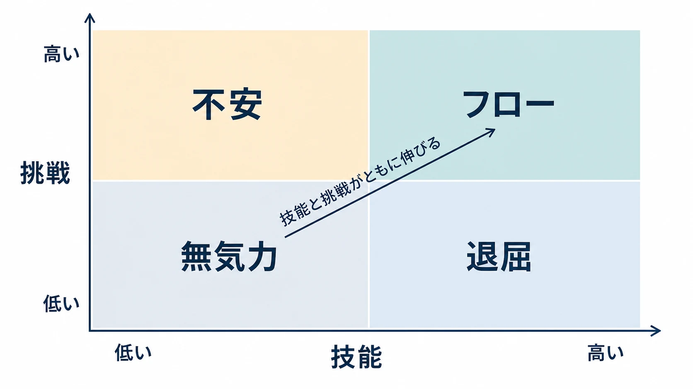
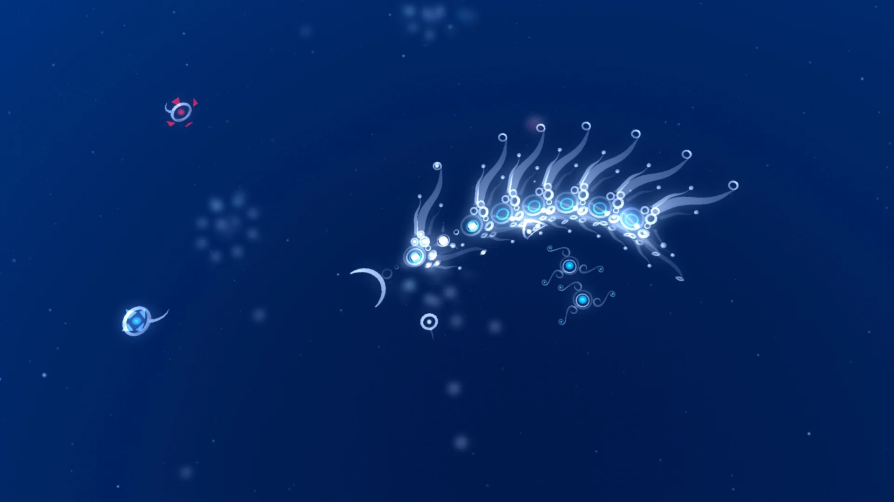

# フロー理論はゲームのために生まれたのか――原典・調査手法・反証から読み直す「ちょうどよい挑戦」

ゲームの難易度を語るとき、「挑戦とスキルを釣り合わせればフローに入る」という図は便利である。敵を強くする時期と、プレイヤーが新しい操作を覚える時期を重ねる。その直感は、レベル設計を考える入口になる。

フロー理論は、心理学者ミハイ・チクセントミハイが、創作する人、ロッククライマー、外科医、チェスプレイヤーなど、活動の種類をまたいで「その活動そのものが報酬になる経験」を追った研究から生まれた理論である。初期のまとまった著作『Beyond Boredom and Anxiety』は1975年に刊行された。[[1](#ref-1)] つまり、ゲームのために作られた設計理論ではない。

では、なぜゲーム語りにこれほど浸透したのか。本稿では、フロー理論が原典で何を主張したか、ゲームデザインが何を受け取ったか、そして「釣り合い」という説明が実証研究でどこまで支えられたかを分けて確認する。実装手法としての動的難易度調整は、既存記事「[難易度設計とダイナミックディフィカルティ――「ちょうどよい挑戦」を壊さず運用する実務](difficulty-design-and-dynamic-adjustment.md)」に譲る。

---

## 1. フローは、活動へ深く入り込む主観的な経験である

チクセントミハイはTED2004の講演で、インタビューした人々が、創作や仕事がうまく進む経験を自発的な「流れ」として繰り返し表現したことから、これを *flow experience* と呼んだと説明している。[[2](#ref-2)] ここで中心にあるのは、画面上の難易度値ではない。注意が活動へ集中し、時間や自己意識が薄れ、その行為自体に取り組む価値を感じるという、当人の経験である。

同講演で彼は、文化や職業をまたぐインタビューから、集中、明確さ、即時のフィードバック、困難だが達成可能だという感覚、時間感覚の変化などを、フロー時に重なりやすい条件として挙げた。条件のすべてが常にそろう、という意味ではない。フローは、プレイヤーの入力数やクリア時間と同じ種類の観測値ではなく、まず本人が報告する経験として扱われる。

### 経験サンプリング法は、その瞬間ごとの自己報告を集める

この違いを示すのが、経験サンプリング法（Experience Sampling Method：ESM）である。チクセントミハイは、電子ポケベルを一日に10回鳴らし、その時点で何をしているか、どう感じているか、どこにいるか、何を考えているかを記録してもらう方法を講演内で説明した。[[2](#ref-2)]

さらに各人について、その瞬間に感じる挑戦と、自分が持つと感じる技能を尋ね、本人の平均値を基準に置く。講演での説明は、挑戦も技能もその人自身の平均より高いとき、フローを比較的よく予測できる、というものである。これは「全プレイヤーへ同じ難易度を与える」話ではない。各人の主観的な基準線と、その時点の報告を使う調査である。

ゲームのテレメトリは、死亡回数、命中率、滞在時間を大量に取れる。一方で、それだけから「退屈している」「フローに入った」と断定することはできない。ESMが示すのは、主観的な経験を知りたいなら、その経験を尋ねる必要があるという、設計調査上の原則である。

---

## 2. 「挑戦とスキル」の図は、成長の関係を読むためのモデルである

『Beyond Boredom and Anxiety』に遡る初期のモデルでは、活動の挑戦と当人の技能を二軸に置き、両方が高い領域をフローとして捉える。挑戦が技能を上回る側は不安、技能が挑戦を上回る側は退屈、両方が低い側は無気力として整理される。[[1](#ref-1)] 後年、より多くの状態を加えた図も使われるが、ゲームで広まった「フローチャンネル」の原型は、この二軸の見方にある。

ここで重要なのは、釣り合いを静止した一点として読む必要はないことだ。チクセントミハイ自身も講演で、技能より挑戦が少し先行する「覚醒」の側では技能を伸ばしてフローへ入りやすく、逆に技能が先行する「統制」の側では挑戦を上げることでフローへ向かう、と説明している。[[2](#ref-2)] 成長に応じて次の要求を置く、という動きが含まれている。

たとえば『スーパーマリオブラザーズ』のワールドを進める場面を考える。プレイヤーは走る、跳ぶ、敵を避けるという基本操作を繰り返すうちに、着地の距離や敵の動きに慣れる。そこへ穴、移動する足場、敵の組み合わせといった新しい要求を重ねれば、伸びた技能を使う理由が生まれる。「プレイヤーの技能が伸びるから、次のチャレンジを上げられる」というレベル進行の直感を、挑戦と技能の関係として記述したものがこのモデルである。

この図は、プレイヤー体験を観察するための仮説として有用である。だが、すべての時間を右上に留めることは、必ずしも作品の目標ではない。恐怖を蓄積する場面、圧倒的な強さを楽しむ場面、失敗から学ぶ場面には、別の感情の起伏が意図的に置かれる。

---

## 3. Jenova Chenは、フローを「プレイヤーが選べる難易度」へ翻訳した

ゲームとフロー理論を強く結びつけた一人が、Jenova Chenである。2006年のUSC修士論文『Flow in Games』は、プレイヤー中心の動的難易度調整を、ゲーム側が不完全なプレイデータから状態を推定する受動的な方式と対比し、プレイヤーが活動の中で選択して自分の体験を調整する方式として提案した。[[3](#ref-3)] 2007年には、その考えをより広いインタラクティブな体験へ広げた論考「Flow in Games (and Everything Else)」を *Communications of the ACM* に発表している。[[4](#ref-4)]

Chenの論文がゲーム実務へ持ち込んだ要点は、難易度を裏側で当てにいくことだけではない。選択をゲームプレイへ埋め込み、プレイヤー自身が進む速さや向かう先を調整できるようにする点にある。

### 『flOw』は、選択を遊びの中へ埋め込んだ試作だった

Chenの自作ゲーム『flOw』は、その検証のために作られた。プレイヤーは生物を動かして他の生物を食べ、成長しながら深い階層へ進む。論文によれば、全20階層で新しい生物と挑戦が導入されるが、階層を順番にクリアする必要はない。食べる対象を選ぶことでより難しい階層へ進め、いつでも易しい階層へ戻れる。難しい相手を避け、あとから戻ることもできる。[[3](#ref-3)]

*画像出典（引用）：Jenova Chen, [flOw](https://jenovachen.info/flow) / 制作者の公式紹介ページに掲載されたスクリーンショットを、食べる対象を選んで進行を調整する本文の説明に必要な範囲で引用。WebP変換。*

食べる、近づく、離れるという基本操作そのものが、プレイヤー主導の動的難易度調整になっている。失敗を検知してゲーム側が自動で敵を弱くする形式ではない。Chenは、頻繁に設定画面を開かせる選択は集中を妨げうるため、選択をゲームプレイの中へ埋め込む必要があると論じた。[[3](#ref-3)]

同じ論文は、計測値と体験のずれも明記している。例として『スーパーマリオブラザーズ』で、レベルを一つもクリアせずに跳び回っているだけでも、プレイヤーがフローを経験している場合を挙げた。クリア率だけを見たDDAは、その状態を「進めない」と誤読しかねない。[[3](#ref-3)] この指摘は、ESMが残した問題意識とつながる。行動データは重要だが、体験をそのまま代弁しない。

---

## 4. 「釣り合い」は、フローをどこまで説明できるのか

フローチャンネルは広く使われる一方、挑戦と技能が釣り合うことが最良の経験を生む、という仮説には実証的な反論がある。LøvollとVittersøの2014年の研究「Can Balance be Boring?」は、屋外活動の実地調査を二つ行い、合計958件の経験報告を分析した。[[5](#ref-5)]

第1調査は学生64人の海岸行程とスキー行程から698件、第2調査は学生26人の氷河コースから260件の報告を得たものだった。挑戦、技能、その交互作用を使った重回帰分析では、主観的な肯定的・否定的経験を説明できた割合は、二つの調査で平均9％と14％にとどまった。[[5](#ref-5)]

さらに、研究者たちのフロー指標は、挑戦と技能が釣り合う条件で最も高くならなかった。むしろ、釣り合わないモデルを支持する結果が得られたという。[[5](#ref-5)] これは「挑戦と技能は無関係だ」と証明した研究ではない。少なくとも、この二つの変数の釣り合いだけを、最適な経験を生む十分な法則とは扱えない、という反証である。

ゲームへ引き寄せるなら、同じ技能と同じ敵配置でも、初見の驚き、物語上の緊張、仲間と協力する安心感、失敗時の損失、目標の理解しやすさで経験は変わる。Chen自身も、フローを支えるものとして挑戦と技能の関係に加え、活動が内発的に報われることと、プレイヤーが統制感を持つことを挙げていた。[[3](#ref-3)] フローチャンネルは、それらの一部を照らす図なのである。

---

## おわりに――フロー理論を、観察のための語彙として使う

フロー理論は、ゲームを最適化するために生まれた万能の公式ではない。人が多様な活動の最中に何を感じるかを、インタビューと自己報告で追った心理学の理論である。ゲームデザインはそこから、技能の成長に合わせて挑戦を置くという有力な見方と、プレイヤーが自分で調整できる選択を受け取った。

同時に、挑戦と技能の釣り合いだけでは、良い経験の大半を説明できない。だから実務では「この数値ならフローになる」と決めるより、「この区間でプレイヤーは何を要求され、何を学び、何を感じているか」を問う語彙として使う方がよい。主観的な調査、プレイ観察、テレメトリを突き合わせれば、フローは設計判断を固定するラベルではなく、問いを増やすための理論になる。

動的難易度調整をどの信号で発動し、どの要素を、どこまで変えるかという実務の設計は、[難易度設計とダイナミックディフィカルティ](difficulty-design-and-dynamic-adjustment.md)で扱っている。本稿が担うのは、その設計比喩を使う前に、何が原典の主張で、何が後年の翻訳と検証なのかを確かめることである。

## References

1. [Mihaly Csikszentmihalyi, *Beyond Boredom and Anxiety*][1] - フロー研究の初期のまとまった著作。挑戦と技能の関係を用いた経験のモデルと、ロッククライミング、外科、チェスなどを含む研究対象を確認するために参照。

2. [Mihaly Csikszentmihalyi, “Flow, the secret to happiness”][2] - TED2004講演。フロー経験の命名、条件の説明、電子ポケベルを一日10回用いる経験サンプリング法、本人の平均を基準にした挑戦と技能の説明を確認するために参照。

3. [Jenova Chen, *Flow in Games*][3] - 2006年USC修士論文。プレイヤー中心の動的難易度調整、『flOw』の設計と試作、行動指標が主観的フローを取りこぼす例を確認するために参照。

4. [Jenova Chen, “Flow in Games (and Everything Else)”][4] - *Communications of the ACM* 50巻4号（2007年）。フロー理論をゲームを含むインタラクティブな体験の設計へ接続する論考。

5. [Helga Løvoll and Joar Vittersø, “Can Balance be Boring?”][5] - *Social Indicators Research* 115巻1号（2014年）。挑戦と技能の釣り合いが主観的経験をどこまで説明するかを、二つの実地調査で検証した研究。

[1]: https://books.google.com/books?id=afdGAAAAMAAJ
[2]: https://www.ted.com/talks/mihaly_csikszentmihalyi_flow_the_secret_to_happiness
[3]: https://www.jenovachen.com/flowingames/Flow_in_games_final.pdf
[4]: https://www.jenovachen.com/flowingames/p31-chen.pdf
[5]: https://doi.org/10.1007/s11205-012-0211-9

----

この文書は、Perplexity、Claude、OpenAI Codex の3つのAIの支援を受けて著述されたものです。引用画像を除き、MIT License にて提供されています。
