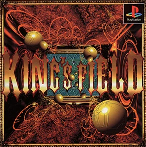
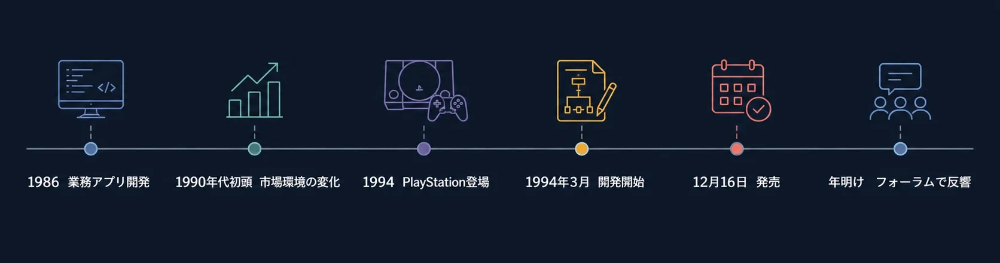
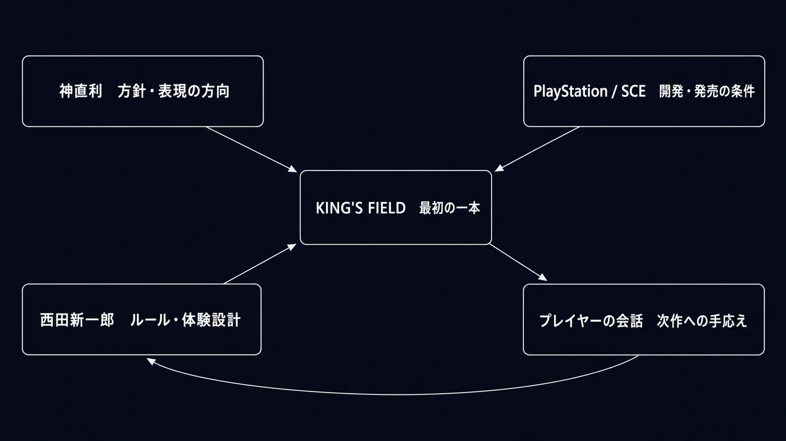

# キングスフィールドができるまで――フロム・ソフトウェア前史

***

## はじめに：12月16日、まだ名前の知られていない会社が出した一本

1994年12月16日、PlayStationが日本で発売されてから13日後に、『KING'S FIELD』は店頭へ並んだ。フロム・ソフトウェア公式は本作を、主観視点で3Dポリゴンのダンジョンを探索する3DリアルタイムRPGと説明している。[[1](#ref-1)]

画像出典：[FromSoftware『KING'S FIELD』公式製品情報](https://www.fromsoftware.jp/jp/detail.html?csm=001)

しかし、この時点のフロム・ソフトウェアは、最初からゲーム制作を目的に作られた会社ではなかった。公式沿革によれば、同社は1986年に東京都渋谷区笹塚で設立され、ビジネスアプリケーション開発を展開していた。ゲームへの参入は1994年である。[[2](#ref-2)]

8年にわたり受託開発をしてきたプログラマー集団が、PlayStationという未知のハードで、フルポリゴンのRPGを作る。ここには、後から見ればフロム・ソフトウェアらしいと思える要素が、すでにいくつもある。だが当時の彼らにとって、それは「らしさ」を証明するための企画ではなかったはずだ。最初の一本を完成させ、プレイヤーの前へ送り出すための、切実な賭けだった。

本稿では、公式沿革と、2001年に西田新一郎氏が振り返った開発インタビューを軸に、その賭けがどのような仕事だったのかをたどる。史料が語る事実の先では、断定を避けつつも、そこから読み取れる組織と設計の意味を考えていく。[[3](#ref-3)]

***

## 1. スーツを着たプログラマーたち

フロム・ソフトウェアの出発点は、ゲーム会社の華やかなイメージから遠い。専門アプリケーションを顧客ごとに受託開発するソフトハウスであった。西田氏は後年、この仕事を続けていけば市場が縮むのではないかという不安があり、自分たちの作ったものを世に出したいという思いもあった、と振り返っている。[[3](#ref-3)]

受託開発とゲーム開発は、どちらもソフトウェアを作る仕事でありながら、成果の届き方がまったく違う。受託開発では、仕様を決める相手が比較的明確である。納期、機能、安定性を満たして納品することが、まず仕事の骨格になる。ゲームでは、仕様書に名前のないプレイヤーが最後の判断者になる。遊び始めて数分で何を感じたか、投げ出したか、誰かに話したかが、作品の価値を左右する。

ここからは推測だが、「自分たちの作品を直接世に出したい」という言葉には、単に自社IPを持ちたいという事業上の願望だけでなく、作ったものへの反応を自分たちで引き受けたいという職人的な欲求も含まれていたのではないか。受託仕事で鍛えた技術を、今度は自分たちが決めた体験のために使う。その転換は、会社の売り物を変えるだけでなく、仕事の評価基準を変えることでもある。

後年、長く同社で働いた鍋島俊文氏は、ゲーム以外の業務に携わる社員がいたため、社内ではスーツで統一していた時期があったと語っている。ゲーム業界では珍しく見えたというこの逸話は、フロム・ソフトウェアがしばらく、ゲーム会社の文化だけではできていなかったことを伝える。[[4](#ref-4)] その静かな業務ソフト会社が、やがてプレイヤーを暗い地下墓所へ一人で送り込む作品を作る。この振れ幅こそが、前史を読む面白さである。

この転換の時期には、バブル崩壊後の日本経済も重なっている。日本銀行は、1990年代初頭の資産価格急落以後、日本企業が構造的な調整圧力に直面したと整理している。[[5](#ref-5)] フロム・ソフトウェアがゲームへ向かった理由をバブル崩壊だけへ還元するのは正確ではない。しかし、西田氏が語った受託開発市場への懸念は、企業が投資と事業の前提を見直していたこの時代の空気の中で、いっそう切実なものだったと考えられる。

***

## 2. PlayStationが開けた、まだ定石のない入口

1994年12月3日に日本で発売されたPlayStationは、CD-ROMを採用し、リアルタイム3DCGを前面に掲げた家庭用ゲーム機だった。[[6](#ref-6)] フロム・ソフトウェアの公式沿革も、PlayStationの登場に合わせてゲーム開発へ参入し、『KING'S FIELD』を発売したと記録している。[[2](#ref-2)]

神直利氏は1999年のインタビューで、PlayStation立ち上げ期のSCEは、大手だけではなく中小のデベロッパーも巻き込む必要があったと回顧している。初期の支援がなければ、自社がゲームを作ることは難しかったとも述べている。[[7](#ref-7)]

新しいプラットフォームの価値は、性能表だけでは測れない。性能が上がれば競争が楽になるわけではなく、むしろ誰も正解を知らない領域へ入ることになる。ただ、定石が固まっていない時代には、過去の成功体験を持たないことが弱みだけではなくなる。

フロム・ソフトウェアにとってPlayStationは、ゲーム業界の外から持ち込んだ技術感覚を試せる入口だったのだろう。少人数の会社が大手と同じ規模で戦える、という意味ではない。何を作るべきかがまだ決まっていない場所では、経験の少なさが「前例に縛られない」ことと表裏一体になる、という意味である。

***

## 3. 最初の一本に、フルポリゴンRPGを選ぶ

西田氏の回顧によれば、フロム・ソフトウェアはPlayStation向けの企画を考える段階で、早くからポリゴンRPGを選んだ。当時の社長である神氏は、フルポリゴンのRPGを作ることを掲げていたという。社内はもともとアプリケーション開発者で、全員がプログラマーだった。ポリゴンを表示する仕組みを理解した後は、開発ツールが十分ではないことを決定的な苦労とは感じなかったとも語られている。[[3](#ref-3)]

このエピソードは、技術に強い会社だったから挑戦できた、というだけではない。ゲーム開発の経験がない会社が、最初の作品で何を「できそうだ」と見たのかを示している。彼らは完成済みのゲーム制作パイプラインを持っていなかった一方で、計算機の中に空間を表示することには手応えを得た。ならば、その手応えを中心にゲームを組み立てる。これは、限られた資源の中で自分たちの最も強い手札を主役にする判断である。

RPGを選んだ理由には、技術とは別の層がある。西田氏は、神氏と自分がApple IIの頃からゲームを遊び、とりわけ『Wizardry』から受けた感覚をPlayStation上で表現したかったと振り返る。ただし、意識的に模倣したわけではないとも述べている。[[3](#ref-3)]

ここから推測できるのは、彼らが移植しようとしたのは『Wizardry』の画面やルールではなく、知らない場所へ踏み込み、自分で危険を読み取る感覚だったということである。新ハードの3D表現は、その感覚を「キャラクターを眺める画面」ではなく「自分がそこにいる視界」へ置き換える手段になったのではないか。後の作品群との因果を安易に一本線で結ぶ必要はない。それでも、技術、遊びの記憶、会社の得意分野を一つの企画へ重ねる発想は、この最初の一本ですでに見えている。

***

## 4. 「孤独感」は、制約だけでも意図だけでもない

初代『KING'S FIELD』の開発は1994年3月に始まり、主なプログラマーは準備を経た同年6月から7月頃に加わった。開発は10月に終わったという。西田氏は、ソニー提供のプログラミングライブラリが更新された際、フォグ表現が意図どおりに動かなくなった問題も挙げている。[[3](#ref-3)]

ゲームの雰囲気は、企画書だけでは決まらない。視界の先が闇に溶けること、遠くが見えないこと、地形を自分で覚えなければならないことは、アート、プログラム、マップ、操作、納期のすべてが重なって初めて体験になる。フォグのような技術上の問題が、単なる表示の不具合ではなく、空間の感触そのものに触れる問題だったことは想像に難くない。

西田氏は、チュートリアルを作る時間がなかった一方で、神氏にはプレイヤーへ孤独感を与えたいという意図があったと振り返っている。[[3](#ref-3)]

この二つを合わせると、ここからは推測だが、初代の導入は「時間が足りなかったから説明しなかった」だけでも、「最初から孤独を完璧に設計した」だけでもなかったのだろう。時間不足によって削られかねなかった説明を、孤独感という表現意図が受け止め、作品の方向へ組み込み直した。制約が偶然に個性になったのではない。制約をそのまま放置せず、体験の核と接続できる意味を見つけたから、作品の一部として立ち上がったのだと読める。

もちろん、すべての不足を個性に変えられるわけではない。だからこそこの話は、「制約を歓迎せよ」という教訓ではなく、制約が出た時点で、何を守れば作品の芯が残るかを問うべきだという教訓になる。

***

## 5. ニフティサーブで見つかった、次の一本を作る理由

『KING'S FIELD』は1994年12月16日に発売された。PlayStation発売から間もない時期である。[[1](#ref-1)][[6](#ref-6)]

西田氏は、発売直後の動きは鈍かったが、ニフティサーブのゲームフォーラムで話題になった後、年明け以降に販売が伸びたと回顧している。そこで続編を作れるという手応えを得たという。[[3](#ref-3)]

ニフティサーブは、1987年から提供された会員制のパソコン通信サービスである。電子メールやチャットに加え、趣味や関心ごとごとの「フォーラム」と呼ばれるコミュニティを持ち、1995年には会員数100万人を超えた。[[8](#ref-8)] フォーラムには掲示板、会議室、チャット、ファイル共有がまとまり、テーマごとに管理者も置かれていた。[[9](#ref-9)]

現在の感覚でたとえるなら、ゲーム、パソコン、音楽、模型などの話題別コミュニティが、一つの会員制サービスの中に集まっていた場である。Redditのサブレディット群に近い面があるが、当時はリアルタイムの検索や動画共有よりも、ログを読み、掲示板へ書き込み、必要ならデータを落として持ち帰ることが中心だった。『KING'S FIELD』のように自力で地図を作り、発見を言葉にしたくなるゲームにとって、そこは単なる宣伝の受け皿ではなく、遊び方を持ち寄る場所になり得た。

この話を「口コミだけで売れた」という神話にする必要はない。だが、少なくとも開発チームにとって、プレイヤー同士の会話は次の判断を変えるほどの信号になった。わかりやすさだけでは評価しにくいゲームでも、迷いながら進んだ人が発見を交換し、地図を埋め、危険を語り合うことで、作品の価値が別の形で立ち上がることがある。

ここから推測するなら、初代『KING'S FIELD』の魅力は、プレイヤーを一人にするだけで終わらなかったのだろう。孤独に探索した体験が、ゲームの外では「どう進んだか」を語りたくなる体験になった。ゲーム内の不確かさと、ゲーム外の情報交換が補い合う。この構造は、当時のパソコン通信という場だからこそ、なおさら強く働いたのではないか。

これは現代のオンラインゲームへそのまま移植できる処方箋ではない。ただ、発売後にどの場所で、誰が、どんな言葉で作品を語るのかを設計と無関係な出来事として扱わない、という視点は今も使える。

***

## 6. 三つの役割が、最初の一本を前へ進めた

この前史を、神氏一人の創業神話にしてはならない。『KING'S FIELD』が形になるまでには、少なくとも三つの役割が見える。

- **神直利**：業務ソフト中心の会社をゲームへ向け、フルポリゴンRPGという大きな方針と、プレイヤーに孤独感を与えるという表現の方向を示した経営者である。[[3](#ref-3)]
- **西田新一郎**：RPGに既存作の「こうあるべき」を持ち込まず、NPCとモンスターを同じパラメータで扱うといった具体的な設計を語った開発者である。方針をプレイヤーが触れるルールへ落とし込む役割を担った。[[3](#ref-3)]
- **PlayStationとSCE**：新しいハードと初期支援を通じ、ゲーム業界の外にいた開発会社が挑戦できる条件を作ったプラットフォーム側の存在である。[[6](#ref-6)][[7](#ref-7)]

経営者が作品の方向を示すことと、ゲームデザイナーがルールと体験を設計することは同じではない。さらに、その二人だけで商品は成立しない。新しいハード、開発環境、発売の場、プレイヤーの会話までがあって、初めて一本のゲームは市場へ出る。

この分業が見えると、『KING'S FIELD』は「天才が突然名作を作った物語」から、異なる専門性が同じ一点へ集まった仕事の記録へ変わる。ゲームプランナーが持ち帰るべきなのは、誰かの情熱を神話化することではなく、自分の企画で誰がどの決定を担うのかを明らかにすることだろう。

***

## 7. 新人ゲームプランナーへの三つの持ち帰り

### 自分たちの強い手札から、企画の中心を作る

最初の一本で全方位の完成度を追うことは難しい。フロム・ソフトウェアは、プログラマー集団として得た3D表示への手応えと、RPGを遊んできた記憶を重ね、ポリゴンRPGを企画の中心へ置いた。自分たちにできないことの一覧ではなく、すでに強く握れている技術や感覚から、何を体験の中心にできるかを考えるべきである。

### 制約は、先に体験の芯を決めてから扱う

制約は美談ではない。納期不足や技術的な不具合は、普通なら品質を損なう。だからこそ、何を削っても守るべき体験は何かを先に決める必要がある。説明を減らしても探索の緊張が残るのか。遠景を削っても空間の気配は残るのか。制約を受け入れるのではなく、制約と戦う場所を選ぶのが企画の仕事である。

### 発売後の会話を、次の仕様へ戻す

ニフティサーブの反響が続編への手応えにつながったという回顧は、発売後の観察が開発の終わりではなく、次の企画の始まりになることを示す。コミュニティの声、問い合わせ、プレイデータ、テストの観察は、同じものではない。それぞれが何を示しているのかを分けて読み、次の仕様へ戻す回路を作ることが大切である。

***

## おわりに：暗い地下墓所の前にあったもの

『KING'S FIELD』の前には、ビジネスアプリケーションを作る会社があった。そこには、受託仕事への不安、自分たちの作品を世に出したいという願い、新ハードへの好奇心、そしてポリゴンを表示できたという手応えがあった。

暗いダンジョン、説明の少ない導入、手探りの探索は、ひとつの壮大な設計思想から自動的に生まれたものではない。会社の得意分野、ゲームを遊んできた記憶、表現への意図、短い開発期間、技術上の問題、発売後のプレイヤーの会話が交差して、あの一本になった。

だから『KING'S FIELD』を後年の名作群の単なる予告編として読む必要はない。まだ何者でもなかった会社が、自分たちの手札で、まだ正解のない場所へ踏み出した記録として読むべきである。その記録は、今のプランナーにも問いを残す。自分たちが本当に強く握っているものは何か。そして、それをどんな体験に変えるのか。

## References

1. [KING'S FIELD｜FromSoftware][1] - 初代『KING'S FIELD』の発売日、ジャンル、主観視点の3Dポリゴンダンジョンという公式製品情報。

2. [沿革｜FromSoftware][2] - 1986年の設立・ビジネスアプリケーション開発と、1994年のゲームソフト開発参入を示す公式沿革。

3. [King's Field – 2001 Developer Interview｜shmuplations][3] - 2001年刊行の『キングスフィールド I・II・III 聖典』掲載インタビューの英訳。西田新一郎氏による、会社の転換、開発、設計、発売後の反響の回顧を参照する。

4. [フロム・ソフトウェアってどんな会社ですか｜4Gamer.net][4] - 鍋島俊文氏が、ゲーム以外の業務に携わる社員とスーツで統一していた社内の様子を振り返るインタビュー。

5. [近年の設備投資動向と本格回復への課題｜日本銀行][5] - 1990年代初頭のバブル崩壊後に続いた企業部門の構造調整圧力を整理する資料。

6. [プレイステーション クラシック発表｜ソニー・インタラクティブエンタテインメント][6] - PlayStationの日本発売日が1994年12月3日であることを示す公式リリース。

7. [FromSoftware – 1999 Developer Interview｜shmuplations][7] - 1999年の『ゲーム批評』掲載インタビューの英訳。神直利氏によるSCEの初期支援に関する後年の回顧を参照する。

8. [スペシャル対談インタビュー｜ニフティ株式会社][8] - ニフティサーブの提供期間、会員制パソコン通信としての機能、フォーラム、1995年の会員数100万人突破を説明する公式資料。

9. [パソコン通信とインターネットの相互接続実験｜JPNIC][9] - ニフティサーブのフォーラムに用意された掲示板、会議室、チャット、データライブラリと、管理者の役割を説明する記録。

[1]: https://www.fromsoftware.jp/jp/detail.html?csm=001
[2]: https://www.fromsoftware.jp/jp/company_history.html
[3]: https://shmuplations.com/kingsfield/
[4]: https://www.4gamer.net/games/103/G010386/20120120009/
[5]: https://www.boj.or.jp/research/brp/ron_2003/ron0306b.htm
[6]: https://sonyinteractive.com/jp/press-releases/2018/180919a/
[7]: https://shmuplations.com/fromsoftware/
[8]: https://recruit.nifty.co.jp/interview/special
[9]: https://www.nic.ad.jp/ja/newsletter/No57/0320.html

----

この文書は、Perplexity、Claude、OpenAI Codex の3つのAIの支援を受けて著述されたものです。引用画像を除き、MIT License にて提供されています。
