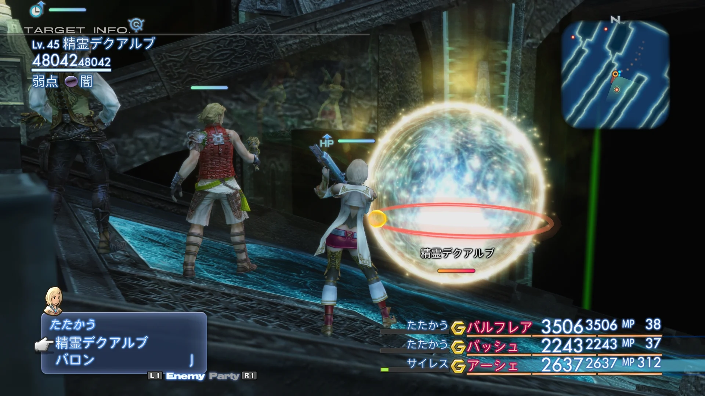
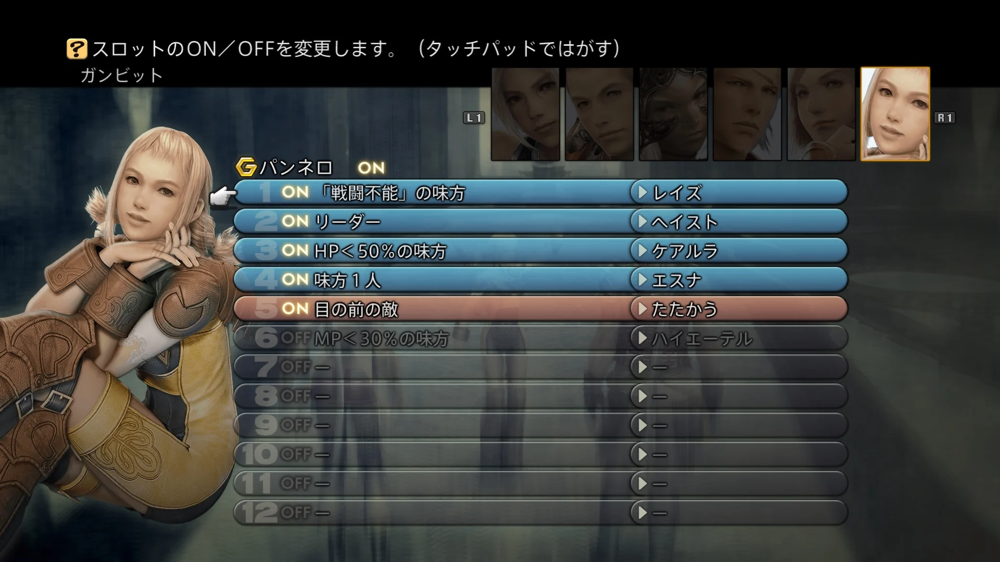

# ターン制RPGの戦闘AIを構築するためのガンビットシステム

**ファイナルファンタジーXIIの革新的な設計哲学と、その汎用化に向けた実践的アプローチ**

***

## はじめに：なぜガンビットシステムは特別なのか

2006年3月にPS2で発売された『ファイナルファンタジーXII』（以下FF12）は、シリーズの常識を大きく塗り替えた作品だった。その核心にあったのが「ガンビット」システム——プレイヤーが仲間キャラクターの行動をプログラミングによって自動化できる、全く新しい戦闘AIの仕組みだ。[[1](#ref-1)][[2](#ref-2)]

20周年を迎えた今もなお、「以後のゲームで追従する流れはあまりなかった」と語られるほどユニークなこのシステムは、ゲームデザインの観点からはどのような構造を持ち、なぜプレイヤーに愛されるのか。本レポートでは、システムの仕組みを解剖し、ゲームプランナーが新規タイトルに応用できる汎用的な設計仕様までを掘り下げて解説する。[[3](#ref-3)]

***

## 第1章：ガンビットシステムの解剖

### 1-1. 生まれた背景

FF12の開発チームが直面した課題はシンプルだった。「シームレスなリアルタイム戦闘を実現しながら、操作が複雑になりすぎないようにするにはどうすればよいか」という問いだ。[[4](#ref-4)]

『ザ ゾディアック エイジ』のプロデューサー・加藤弘彰氏（PS2版ではプロジェクトマネージャー）は、開発の狙いを次のように説明している。FF12のバトルのコンセプトは「リアルタイムでシームレスに進行すること」にあったが、従来のコマンドベースの戦闘にリアルタイム要素を足しただけでは操作が速すぎて難しくなる——その懸念を解消するために採用されたのがガンビットシステムだった、という趣旨だ。[[4](#ref-4)]


*画像出典（引用）：[Gematsu, "Final Fantasy XII: The Zodiac Age screenshots"](https://www.gematsu.com/2017/05/final-fantasy-xii-zodiac-age-screenshots-2)。Square Enix公開スクリーンショット。本文中の戦闘UI解説のため引用。*

FF12でディレクター（ゲームデザイン担当）を務めた伊藤裕之氏は、ATBシステム（アクティブタイムバトル）の生みの親であり、NFL（アメリカンフットボール）の試合を参考にFF4のモンスターAIを設計した人物だ。その「事前に戦術を計画して自動的に実行する」という発想が、FF4の背後で稼働していたモンスターAIへと発展し、そしてプレイヤーが自ら設定できる形で昇華されたのがFF12のガンビットシステムだった。[[5](#ref-5)][[6](#ref-6)][[7](#ref-7)][[4](#ref-4)]

### 1-2. 構造の全体像

ガンビットシステムは、以下の要素によって構成される：[[8](#ref-8)][[9](#ref-9)]

| 要素 | 説明 | 例 |
|------|------|-----|
| **対象（Target）** | 誰に対して行動するか | 「味方：最もHPが低い」「敵：飛行中」 |
| **条件（Condition）** | 行動を発動する条件 | 「HP＜40%」「スロウ状態」 |
| **アクション（Action）** | 実行する行動 | 「ケアル」「たたかう」「デスペル」 |
| **優先度（Priority）** | リストの上が高優先 | 1番目→2番目→…→12番目 |


*画像出典（引用）：[Gematsu, "Final Fantasy XII: The Zodiac Age screenshots"](https://www.gematsu.com/2017/05/final-fantasy-xii-zodiac-age-screenshots-2)。Square Enix公開スクリーンショット。本文中のガンビットUI解説のため引用。*

ガンビットの動作ロジックはシンプルな **if-elseの連鎖** だ。キャラクターが行動を開始するたびに、リストを上から順に評価し、条件が満たされた最初のガンビットのアクションを実行する。条件が満たされなければ次のガンビットへと移行する。[[10](#ref-10)][[8](#ref-8)]

```
[優先度1] HP＜70%の味方 → ケアルガ
[優先度2] 戦闘不能の味方 → レイズ
[優先度3] プロテス状態の敵 → デスペル
[優先度4] リーダーの敵   → たたかう
```

このような設定を施すと、回復が最優先され、次に状態回復・デバフ解除、そして余裕がある場合に攻撃する、という合理的なキャラクターの判断が自動で行われる。[[11](#ref-11)]

### 1-3. 入手とアンロックの仕組み

FF12では、ガンビットは単なる機能ではなく **ゲームのリソース** として扱われる。これには重要なデザイン意図がある。[[9](#ref-9)]

- ストーリー序盤、バルフレアによってチュートリアル的に解放され、最初はスロット数が少ない[[12](#ref-12)]
- 対象やアクションのバリエーションは **ショップで購入** して拡充する（ゾディアックエイジでは多くの種類が用意される）[[9](#ref-9)]
- 最大 **12スロット** まで拡張できる（初期付与の2スロットに加え、ライセンスボードで10スロット分を取得して計12になる）[[13](#ref-13)]
- 最初から付与される汎用ガンビットだけでもストーリークリアは可能なほど、基本設計は丁寧[[11](#ref-11)]

アンロックを段階的にすることで「AIの組み方を学びながら遊ぶ」構造になっており、後述するオンボーディングのモデルケースとして評価できる。

### 1-4. 手動介入との関係

ガンビットによる自動行動中でも、プレイヤーがコマンドを直接指示した場合はそちらが優先される。[[14](#ref-14)]

これは設計上極めて重要なポイントだ。完全オートでも、完全マニュアルでも動作する。ガンビットは「デフォルト行動の委任」であり、プレイヤーはいつでも介入できる。

```
ガンビットOFF → 全コマンドを手動入力（FF1〜FF9スタイル）
ガンビットON  → ガンビット設定に従い自動行動（介入は随時可能）
```

***

## 第2章：なぜ「面白い」のか——設計哲学の深読み

### 2-1. プレイヤーがAIを設計する体験

ガンビットシステムの本質は「プレイヤーが自らAIを設計する体験」を提供していることにある。[[2](#ref-2)]

一般的なRPGの戦闘AIは、開発者が設計したものをプレイヤーが受け取るだけだ。しかしガンビットシステムでは、プレイヤーが **AIの設計者** として戦闘に参加する。これはゲームプレイのレイヤーを一段階上に引き上げる発想だ。

- **パズル性**：ガンビットの組み合わせを最適化することが知的な楽しさを生む
- **試行錯誤**：強敵を相手に設定を調整し、完璧に動くAIが完成した瞬間の達成感[[4](#ref-4)]
- **表現の自由**：同じキャラクターでも、ガンビットの組み方次第で全く異なる「役割」を持たせられる[[15](#ref-15)]

### 2-2. 複雑さの段階的な開示（スキャフォールディング）

初心者が突然12スロットのガンビットを渡されたら混乱するだろう。FF12はこれを巧みに解決している：[[11](#ref-11)][[9](#ref-9)]

1. 序盤：3スロット程度、汎用的な基本ガンビットのみ
2. 中盤：スロット増加、ショップに新種のガンビットが登場
3. 終盤：12スロット、高度な条件設定が可能に

この設計は教育的であり、プレイヤーはゲームを進めながら自然にシステムへの理解を深めていく。

### 2-3. 批判とその本質

一部のプレイヤーからは「ガンビットに戦闘を任せてしまうと、自分でプレイする感覚がなくなる」という批判もある。これは設計上のジレンマだ。[[16](#ref-16)]

しかし、この批判は「ガンビットを使わなくてもクリアできる」という事実を見落としている。強力なガンビットセットを組むこと自体が **戦略的な意思決定のプロセス** であり、ゲームプレイの一形態だ。現代のオートバトル機能（設定変更不可）との大きな違いは、「AIの完成度を高めること自体がゲームの楽しさ」として機能している点にある。[[2](#ref-2)]

***

## 第3章：汎用的なガンビットシステムの設計仕様

ここからは、ゲームプランナーが新規のターン制RPGにガンビットシステムを応用する際の **汎用設計仕様** を提案する。

### 3-1. コアデータ構造

ガンビットシステムの最小実装は以下の3要素で表現できる：[[17](#ref-17)][[10](#ref-10)]

```
GambitRule {
  int      priority      // 優先順位（1が最高）
  bool     isEnabled     // ON/OFFフラグ
  Condition condition    // 条件（ターゲット選択ロジック）
  Action   action        // 実行するアクション
}
```

各キャラクターは `List<GambitRule>` を持ち、ターンが回ってきたときにリストを上から順に評価する。[[10](#ref-10)]

**条件（Condition）のインターフェース設計：**

```
interface ICondition {
  string   conditionName   // 表示名（UI用）
  Unit     Evaluate()      // 条件を満たすターゲットを返す
                           // 条件不成立時はnullを返す
}
```

**代表的な条件の種類：**

| カテゴリ | 条件例 |
|---------|--------|
| HP系    | 味方：HP＜X%、敵：HP＞Y% |
| 状態異常 | 味方：毒状態、敵：バリア状態 |
| ターゲット | 敵：最もHPが高い、敵：飛行タイプ |
| 属性弱点  | 敵：炎弱点、敵：聖耐性 |
| 役割     | 味方：タンクロール、自キャラのみ |
| 特殊     | 敵の残り数：X体以下、ターン数：X回経過 |

### 3-2. ターン制RPGへの適用：評価ループ

ターン制RPGにガンビットシステムを組み込む場合、評価タイミングが重要になる。[[17](#ref-17)]

```
キャラクターのターン開始時:
  foreach (GambitRule rule in character.GambitRules) {
    if (!rule.isEnabled) continue;
    Unit target = rule.condition.Evaluate();
    if (target != null) {
      ExecuteAction(rule.action, target);
      break;  // ガンビット1つを実行したらループを抜ける
    }
  }
  // 全ガンビット不成立時は「待機」または「通常攻撃」
```

**ターン制特有の考慮点：**

- **再評価のタイミング**：各キャラクターのターン開始時に毎回リストを頭から評価し直す
- **行動のキャンセル**：プレイヤーが直接コマンドを入力した場合、ガンビット評価をスキップする
- **デフォルトアクション**：全条件が不成立の場合にフォールバックする行動を設定できるようにする

### 3-3. UIデザインの原則

ガンビットシステムのUIは「非プログラマーがプログラミング的な思考を行える」インターフェースでなければならない。以下の原則を推奨する：[[18](#ref-18)]

**原則1：視覚的な優先度表示**
数字付きリストで優先度を明示し、ドラッグ＆ドロップ（またはボタン操作）で並べ替えられるようにする。

**原則2：条件とアクションを分離した選択UI**
「どの対象に（条件）」→「何をする（アクション）」の2ステップで設定できるUIフロー。

**原則3：ON/OFFトグル**
個々のガンビットルールを削除せずに一時停止できるトグル機能。特定の戦闘だけルールを変えたいときに有効。[[12](#ref-12)]

**原則4：プレビュー機能**
設定中の条件が現在のシーンでどのキャラクター/敵に適用されるかをハイライト表示する。試行錯誤のコストを下げる。

**原則5：段階的アンロック**
全スロット・全条件を最初から提供しない。ゲームの進行に合わせて徐々に開放し、学習曲線を緩やかにする。[[11](#ref-11)]

### 3-4. トライアンドエラーを促進する設計

プランナーが「試しやすい」システムにするための実装テクニック：

1. **プリセット（テンプレート）機能**：「タンクのデフォルト設定」「ヒーラーのデフォルト設定」などを初期値として用意し、カスタマイズの出発点にする
2. **テスト戦闘モード（モック戦闘）**：設定を変えたままフィールドに出ずに試せるサンドボックス環境（後述のユニコーンオーバーロードが採用）
3. **ログ表示**：「このターンにどのガンビットが発動したか」をUI上で確認できる仕組み
4. **比較モード**：2つのガンビット設定を並べて同じ敵で試せる機能（Zodiac Ageのトライアルモードが参考になる）

### 3-5. 拡張的な設計案：マルチ条件とAND/OR演算

FF12では各ガンビットルールに条件は1つだけだった。しかしユニコーンオーバーロード（後述）の実装が示すように、 **1ルールに複数条件のAND結合** を持たせることで表現力が大幅に向上する。[[19](#ref-19)]

| 実装レベル | 条件数/ルール | 表現力 | 学習コスト |
|-----------|-------------|--------|-----------|
| 基本（FF12型）   | 1 | 標準 | 低 |
| 中級（UO型）    | 2（AND結合） | 高 | 中 |
| 上級（DAO型）   | 複数（AND/OR） | 非常に高 | 高 |

ターゲット層や目標とする複雑さに応じて、どのレベルの実装を採用するかを決定することが重要だ。

***

## 第4章：ガンビットに学んだゲームたち

FF12のガンビットと類似したルールベース戦闘AIを持つ主要タイトルを比較する。

### 4-1. Dragon Age: Origins（2009年）——西洋RPGへの移植

BioWare社のドラゴンエイジ：オリジンズは、FF12と独立的に類似した「タクティクスシステム」を実装した。基本構造は同様に「条件→アクション→優先度リスト」だが、AND/OR条件の組み合わせや、条件を複数設定できる点でより複雑だ。[[20](#ref-20)][[21](#ref-21)][[22](#ref-22)]

| 項目 | FF12 ガンビット | Dragon Age タクティクス |
|------|----------------|----------------------|
| 条件数/ルール | 1 | 複数（AND/OR可） |
| 最大ルール数 | 12 | キャラレベルに依存 |
| 入手方法 | ショップで購入 | レベルアップで拡張 |
| 戦闘スタイル | リアルタイム | RTwP（ポーズ可） |
| プレイヤー評価 | 高い | 高い（ただし学習コスト高め）[[21](#ref-21)] |

### 4-2. Unicorn Overlord（2024年）——「完成形」への進化

ヴァニラウェア社の『ユニコーンオーバーロード』は、FF12ガンビットを「完成させた」とも評される。[[23](#ref-23)]

各スキルに **2つの条件を設定でき**、「絞り込み条件（対象を限定する）」と「優先条件（対象に優先度をつける）」の2種類を組み合わせる設計になっている。さらに **モック戦闘機能** があり、実際のフィールドに出ることなくタクティクスのテストができる。これはトライアンドエラーを設計思想の中心に置いた実装例として特筆に値する。[[24](#ref-24)][[25](#ref-25)][[19](#ref-19)]

```
ユニコーンオーバーロードのタクティクス構造：
  スキルA [条件1: 騎馬ユニット対象][条件2: HPが最も低い] → 発動
  スキルB [条件1: なし（デフォルト）] → スキルAの条件不成立時に発動
```

### 4-3. Pillars of Eternity II（2018年）——RTwPでの洗練

Obsidian Entertainmentの『Pillars of Eternity II』は、FF12・Dragon Ageと並んでルールベース戦闘AIの三大実装として挙げられる。このゲームが最も印象的なのは、ルールの表現力の高さと、戦闘中にいつでもルールを変更できる柔軟性だ。[[21](#ref-21)]

***

## 第5章【コラム】スクウェア・エニックスにおけるガンビット的設計

### FF XIV：冒険者小隊（Adventurer Squadron）

FF14には、FF12のガンビットをプレイヤーが直接編集する機能として移植したシステムはない。しかし、開発側の実装思想として見ると、「冒険者小隊」はかなりガンビットに近い位置にある。冒険者小隊そのものはパッチ3.4で実装され、NPCの小隊員を集めて育成し、任務に出すコンテンツとして始まった。パッチ4.1では、小隊員3名とインスタンスダンジョンを攻略する「攻略任務」が追加され、小隊員は各自の判断で行動しつつ、プレイヤーの「号令」によってある程度制御されるようになった。[[26](#ref-26)][[27](#ref-27)]

重要なのは、これが「プレイヤーがガンビットを組む」システムではなく、開発側がルールを書いたNPC AIとして作られていた点だ。2022年のインタビューで吉田直樹氏は、冒険者小隊の中身はフェイスとは別の仕組みであり、「プランナーがスクリプトで書いた」「IF文の集合体」に近いものだったと説明している。つまり冒険者小隊は、プレイヤーに if-then リストを公開したFF12型ガンビットではなく、プランナーが内部的に組む「開発者用ガンビット」として理解すると位置づけが見えやすい。[[28](#ref-28)]

### FF XIV：フェイス（Trust）／コンテンツサポーター

2019年の拡張パック「漆黒のヴィランズ」（パッチ5.0）で導入された **フェイス**（英語名 Trust）システムは、NPCと一緒にダンジョンを攻略する体験を、より本格的なストーリー演出とセットで実装したものだった。ここでもプレイヤーが行動ルールを編集するわけではないが、開発者がNPCの判断ロジックを設計し、キャラクターごとの行動やセリフ、ギミック対応を作り込むという意味で、ガンビット的な発想は裏側に残っている。[[29](#ref-29)]

この点は、開発者インタビューの発言からも読み取れる。『暁月のフィナーレ』メディアツアーで吉田氏は、フェイスのタンクが全体範囲攻撃に合わせて支援アクションを使う、ヒーラーが瀕死の対象を優先して回復する、ボス攻撃の回避もぎりぎりまで攻撃を粘るようになった、といった改修を挙げたうえで、「ガンビット（AIの思考）はかなり賢くなっている」と述べている。ここでいう「ガンビット」はUI名ではなく、NPCが状況を評価して行動を選ぶ内部ロジックを指す言葉として使われている。[[30](#ref-30)]

さらに2022年のパッチ6.1以降、メインクエストで攻略が必須となるインスタンスダンジョンをNPCと進められる仕組みは「コンテンツサポーター」として拡張された。吉田氏は同時期のインタビューで、スタッフの多くが汎用的にフェイスのアルゴリズムを書ける準備をしてきたからこそインスタンスダンジョンの改修に踏み切れた、と説明している。一方で、AIを強化しても対応しきれないギミックについては、NPCとクリアできるようインスタンスダンジョン側も調整している。つまりフェイス／コンテンツサポーターは、単にNPCを賢くするだけでなく、「NPC AIが解けるダンジョン構造」にコンテンツ側を合わせる設計でもある。[[31](#ref-31)][[32](#ref-32)][[33](#ref-33)]

この流れを整理すると、FF14におけるガンビット的設計は、プレイヤー向けの編集UIとしてではなく、開発チームがNPC行動を量産・調整するための内部的なルール設計として発展してきたと言える。FF12が「プレイヤーにAI設計を開放したゲーム」だとすれば、FF14の冒険者小隊からフェイス／コンテンツサポーターへの流れは、「プランナーや開発スタッフがAI設計を行い、物語体験の中に埋め込んだゲーム」と見ることができる。

| システム | 導入時期 | ルール設計の性質 | 主な目的 |
|---------|---------|----------------|---------|
| 冒険者小隊 | 3.4（蒼天）／攻略任務は4.1（紅蓮） | プランナーがスクリプトで組むIF文型AI＋プレイヤーの号令 | 育成した小隊員とのインスタンスダンジョン攻略 |
| フェイス（Trust） | 5.0（漆黒） | 開発者がキャラクター別に作り込むNPC AI | 物語上の仲間とのメインクエストダンジョン攻略 |
| コンテンツサポーター（Duty Support） | 6.1（暁月期） | 汎用化されたフェイス系アルゴリズム＋インスタンスダンジョン側の調整 | メインクエストをひとりでも進められる導線 |

### FF XII：レヴァナント・ウイング（DS、2007年）

FF12の正統続編として発売されたDSソフト『ファイナルファンタジーXII レヴァナント・ウイング』（英題 Revenant Wings）にもガンビットシステムが登場するが、RTSの文脈で大幅に簡略化されており、戦闘前に1スキルを事前選択するのみと機能が絞られている。これは「ガンビットシステムは原作のセミリアルタイム・シームレスバトルと切り離せない」ことを示す反面教師的な事例とも言える。[[34](#ref-34)][[35](#ref-35)]

***

## 第6章：ゲームプランナーへの実践的提言

### 「AIを育てる楽しさ」をゲームの骨格にする

ガンビットシステムを単なる「便利機能」として実装すると、「オートバトル」と本質的に変わらなくなる。重要なのは、 **AIを設計することそのものをゲームの楽しさの中心に置く** 設計思想だ。[[2](#ref-2)]

これを実現するためのチェックリスト：

- [ ] ガンビットが「攻略の鍵」になるボスや敵グループを設計する（設定なしでは勝ちにくい）
- [ ] 設定の良し悪しがプレイヤーに体感できるフィードバックを用意する（戦闘ログ、リプレイ機能）
- [ ] 段階的アンロックにより、新しいガンビット種類の入手が喜びになるよう設計する
- [ ] プリセットで「正解例」を示しつつ、カスタマイズの余地を残す

### ルールベースAIの限界と補完

ガンビットシステムは **ルールベースAI** の一形態だ。現代のAIアーキテクチャとの比較を整理しておこう。[[36](#ref-36)]

| AI手法 | 特徴 | 向いているシーン |
|--------|------|----------------|
| ルールベース（ガンビット型） | 決定論的、透明性が高い、デバッグが容易 | プレイヤー向け戦闘AI、チュートリアル的導入 |
| ビヘイビアツリー | 階層的、複雑な状態管理が可能 | 敵AIの実装、UE5/Unity向き[[37](#ref-37)] |
| GOAP（目標指向計画） | 適応的、動的な問題解決 | 複雑なオープンワールドの敵AI[[36](#ref-36)] |
| ユーティリティ型 | スコアベース、最適行動を計算 | リソース管理が複雑な戦闘[[36](#ref-36)] |

ゲームプランナーとしては、「プレイヤーが操作するキャラクターのAI」にはガンビット型の透明なルールベース設計が、「敵キャラクターのAI」にはビヘイビアツリーやGOAPが向いていることが多い。両者を組み合わせ、プレイヤーのガンビット設定と敵AIとの「戦略的な応酬」を生み出すことが、豊かな戦闘体験の設計につながる。

***

## まとめ：ガンビットが残した遺産

FF12のガンビットシステムは、20年近くが経過した今も「なぜ真似されないのか不思議なほど優れたシステム」として語り継がれている。その本質は次の3点に集約できる。[[38](#ref-38)][[15](#ref-15)]

1. **透明性**：プレイヤーがAIの思考を完全に把握・制御できる
2. **試行錯誤の喜び**：設定を調整して戦闘を観察することそのものが報酬になる
3. **スケーラブルな複雑さ**：入門者でも上級者でも、自分のレベルで楽しめる深さがある

ユニコーンオーバーロードがこの設計を進化させ、FFXIV がAI同士の協働体験を提供しているように、ガンビットの精神は形を変えながらゲームデザインの中で生き続けている。新たなターン制RPGを設計するプランナーにとって、このシステムの仕組みを深く理解することは、プレイヤーに「ゲームと知的に対話する」体験を届けるための、最良の出発点のひとつだろう。

---

## References

<a id="ref-1"></a>1. [『FF12』20周年。イヴァリースを舞台にした壮大な冒険と斬新 ...][1] - 行動をプログラムしておく“ガンビット”のシステムが斬新だった. 2006年（平成18年）3月16日は、プレイステーション2（PS2）用ソフト『ファイナルファンタジーXII』が ...

<a id="ref-2"></a>2. [「ファイナルファンタジーXII」本日で20周年！ ガンビットが魅せた ...][2] - そして「ガンビット」という、自らの手でAIを構築する全く新しい自動戦闘システムは、多くのゲーマーに革命的な衝撃を与えた。本稿では、20周年という記念 ...

<a id="ref-3"></a>3. [【FF12 ザ ゾディアック エイジ】でガンビットシステムの逸材さを ...][3] - ... システム」です。例えば、目の前の敵に攻撃する、とか、HPが50%を切った味方にケアルをかける、とか、キャラクターごとに設定しておけます。これだけ ...

<a id="ref-4"></a>4. [How Final Fantasy XII's Gambit Created One of the Most ...][4] - “The design know-how and techniques that Hiroyuki Ito had learned over the years have all been poure...

<a id="ref-5"></a>5. [Hiroyuki Ito][5] - He is known as the director of Final Fantasy VI (1994), Final Fantasy IX (2000) and Final Fantasy XI...

<a id="ref-6"></a>6. [Wow, Final Fantasy's Combat Really Is Based On Football][6] - Speaking with Jeremy Parish, Ito said his designs for Final Fantasy's battle system were inspired by...

<a id="ref-7"></a>7. [Why Final Fantasy IV was key to FFXII's AI-driven Gambit ...][7] - "We did look into variations on the party control, and one key here was Hiroyuki Ito. His system for...

<a id="ref-8"></a>8. [Gambits - Final Fantasy Wiki - Fandom][8] - Gambits are composed of a target (Ally, Foe, or Self), a condition, and an action to be performed on...

<a id="ref-9"></a>9. [Beginner's Guide To Gambits: Final Fantasy XII The Zodiac Age][9] - ... Gambit system. In this Gambit System guide, which is very much aimed at beginners, we will be co...

<a id="ref-10"></a>10. [Programming the FFXII Gambit System][10] - With the gambit system, you can control what every party member should do in battle in a series of i...

<a id="ref-11"></a>11. [「ファイナルファンタジーXII」発売17周年！ 未だに斬新さのある ...][11] - ガンビットシステムについては非常に独自性が高く、17年経った今でも全く色褪せることのないシステムだ。近年「同じようなシステムのゲームばかりで飽き ...

<a id="ref-12"></a>12. [ガンビットのおすすめ組み合わせ一覧丨設定方法【FF12TZA ...][12] - FF12ゾディアックエイジ（FF12TZA／スイッチ）におけるガンビットについての記事です。役割別のおすすめ組み合わせ、いつからガンビットが使用可能か、 ...

<a id="ref-13"></a>13. [システム/【ガンビット】 - ファイナルファンタジー用語辞典 Wiki*][13] - 自機となる3タイプのロボットに対して、「対象」と「アクション」からなるガンビットを最大5種類まで設定でき、召喚したロボットはそれぞれのガンビットに応じて自動的に ...

<a id="ref-14"></a>14. [ファイナルファンタジーXII][14] - ガンビットシステム. 編集. プレイヤーは戦闘メンバーの操作を「ガンビット」と呼ばれる簡易スクリプトで自動化できる。キャラの役割分担を明確化させ、今までのRPG ...

<a id="ref-15"></a>15. [Final Fantasy 12's Gambit system is a neglected design ...][15] - You can pause battles at any moment to select skills or items, but they unfold in a continuous, smoo...

<a id="ref-16"></a>16. [Battle systems - Final Fantasy XII][16] - With that feature, many battles could be fought without the interaction of the player. This led to c...

<a id="ref-17"></a>17. [AI Overhaul – A Turn Based Interpretation of FFXII's Gambit ...][17] - Inspired by FFXII's gambit system, I've overhauled the engine's artificial intelligence system for c...

<a id="ref-18"></a>18. [【ファイナルファンタジーⅫ】 ガンビットシステムがプログラミング ...][18] - ゲームシステムがどうなっているのか、主人公はどんな立場なのか、お話しの方向性はどんな風なのか、と親切な方々がネタバレをしないように紹介されるもの ...

<a id="ref-19"></a>19. [How Tactics work in regards to priority and logic gates ... - Reddit][19] - 2.) When setting up a command with multiple conditions, the one in the right slot, the "Condition 2"...

<a id="ref-20"></a>20. [RPGs With Combat Similar to FF XII's Gambit System][20] - Dragon Age Origins and Pillars of Eternity 2... and that's probably it. Tales of and Star Ocean game...

<a id="ref-21"></a>21. [Are there any other games with a Dragon Age like tactics ...][21] - One of my favourite things about the gameplay of the first two Dragon Age games is the tactics syste...

<a id="ref-22"></a>22. [Evolution of Combat Mechanics in the Dragon Age Series][22] - Origins had a robust tactics screen, where the player could input commands for the AI to execute. It...

<a id="ref-23"></a>23. [Unicorn Overlord Has Perfected FF12's Gambit System][23] - The Gambit system provides a keen sense of control without being tedious, and Unicorn Overlord has r...

<a id="ref-24"></a>24. [Unicorn Overlord ｜ Comprehensive Tactics Guide - YouTube][24] - SEE PINNED COMMENT FOR CORRECTIONS!!! You asked, and I answered: Presenting my beginner friendly gui...

<a id="ref-25"></a>25. [Become Unstoppable With TACTICS in Unicorn Overlord - YouTube][25] - Follow Me on Twitter! - https://x.com/CoatTay ➡️Join Are Discord: https://discord.gg/GqN6EWW8R4 Mast...

<a id="ref-26"></a>26. [3.4 パッチノート 公開！][26] - パッチ3.4で、小隊員となるNPCを集めて小隊を結成し、任務を成功させる「冒険者小隊」が実装されたことを説明している。

<a id="ref-27"></a>27. [4.1パッチノート公開！][27] - 冒険者小隊の「攻略任務」が追加され、小隊員が各自の判断で行動しつつ、プレイヤーの号令や作戦で制御されることを説明している。

<a id="ref-28"></a>28. [【インタビュー】「FFXIV」吉田直樹プロデューサーPLLフォローインタビュー][28] - 冒険者小隊はフェイスとは別の仕組みで、プランナーがスクリプトで書いたIF文の集合体に近いものだったと説明している。

<a id="ref-29"></a>29. [5.0パッチノート公開！][29] - パッチ5.0で、NPCと一緒にダンジョンを攻略できる「フェイス」が追加されたことを説明している。

<a id="ref-30"></a>30. [『FF14』メディアツアー・吉田直樹P/Dインタビュー！ 『暁月のフィナーレ』＝ENDWALKERに込めた想いとは？][30] - フェイスのタンク・ヒーラーの行動改善や、吉田氏の「ガンビット（AIの思考）」という表現を確認できる。

<a id="ref-31"></a>31. [『FF14』吉田直樹P/D合同インタビュー。「今後の10年に向け、さらに間口を3倍にも4倍にも広げたい」][31] - スタッフの多くが汎用的にフェイスのアルゴリズムを書ける準備をしてきたこと、フェイスAI強化とインスタンスダンジョン側の調整について語っている。

<a id="ref-32"></a>32. [パッチ 6.1 新たなる冒険][32] - パッチ6.1で、NPCとパーティを編成してインスタンスダンジョンを攻略できる「コンテンツサポーター」が実装されることを説明している。

<a id="ref-33"></a>33. [6.1パッチノート公開！][33] - コンテンツファインダーに「コンテンツサポーターで参加」「フェイスで参加」が追加され、フェイスとコンテンツサポーターの導線が整理されたことを示している。

<a id="ref-34"></a>34. [Final Fantasy XII: Revenant Wings][34] - Final Fantasy XII: Revenant Wings features the Final Fantasy XII Gambit system, a means of pre-selec...

<a id="ref-35"></a>35. [Final Fantasy XII: Revenant Wings review][35] - Final Fantasy XII's love-it-or-hate-it Gambit system makes a return in Revenant Wings, too, but it's...

<a id="ref-36"></a>36. [Game AI Planning: GOAP, Utility, and Behavior Trees][36] - Explore game AI planning systems, GOAP, utility, classical, and behavior trees, and learn how they s...

<a id="ref-37"></a>37. [Behaviour Trees: The Cornerstone of Modern Game AI ｜ AI 101][37] - As the new series of AI 101 continues I take a look at behaviour trees - arguably the dominant AI te...

<a id="ref-38"></a>38. [Final Fantasy XII's Gambit System Deserves to be Imitated][38] - I don't think anybody prefers solo characters opposed to any entire party. It enhances replays and g...

[1]: https://www.famitsu.com/article/202603/68391
[2]: https://game.watch.impress.co.jp/docs/kikaku/2092408.html
[3]: https://shibayamablog.net/game/game_diary/19938/
[4]: https://blog.playstation.com/2017/07/07/extended-play-how-final-fantasy-xiis-gambit-created-one-of-the-most-distinct-rpgs-ever/
[5]: https://en.wikipedia.org/wiki/Hiroyuki_Ito
[6]: https://kotaku.com/wow-final-fantasys-combat-really-is-based-on-football-5954150
[7]: https://www.gamedeveloper.com/design/why-i-final-fantasy-iv-i-was-key-to-i-ffxii-i-s-ai-driven-gambit-system
[8]: https://finalfantasy.fandom.com/wiki/Gambits
[9]: https://www.youtube.com/watch?v=lTCNcIo8VwM
[10]: https://immersivenick.wordpress.com/2019/03/31/programming-the-ffxii-gambit-system/
[11]: https://game.watch.impress.co.jp/docs/kikaku/1485808.html
[12]: https://game8.jp/ff12/336468
[13]: https://wikiwiki.jp/ffdic/%E3%82%B7%E3%82%B9%E3%83%86%E3%83%A0/%E3%80%90%E3%82%AC%E3%83%B3%E3%83%93%E3%83%83%E3%83%88%E3%80%91
[14]: https://ja.wikipedia.org/wiki/%E3%83%95%E3%82%A1%E3%82%A4%E3%83%8A%E3%83%AB%E3%83%95%E3%82%A1%E3%83%B3%E3%82%BF%E3%82%B8%E3%83%BCXII
[15]: https://www.polygon.com/gaming/24133011/final-fantasy-12-combat-gambits/
[16]: https://www.rpg-o-mania.com/coverage_battlesystems_ff12.php
[17]: https://projectgoldscript.com/development/ai-overhaul-a-turn-based-interpretation-of-ffxiis-gambit-system/
[18]: https://note.com/tale_54nagaru/n/n7b35595ae7be
[19]: https://www.reddit.com/r/UnicornOverlord/comments/1b34ysz/how_tactics_work_in_regards_to_priority_and_logic/
[20]: https://www.resetera.com/threads/rpgs-with-combat-similar-to-ff-xiis-gambit-system-do-they-exist.453349/
[21]: https://www.reddit.com/r/rpg_gamers/comments/1dsd6vq/are_there_any_other_games_with_a_dragon_age_like/
[22]: https://www.thefandomentals.com/evolution-combat-dragon-age/
[23]: https://www.thegamer.com/unicorn-overlord-ff12-gambit-system-conditions-comparison/
[24]: https://www.youtube.com/watch?v=W0IoDop4e_k
[25]: https://www.youtube.com/watch?v=SxMDeaK4fMg
[26]: https://jp.finalfantasyxiv.com/lodestone/topics/detail/b2ae6bf59ac6553e554c55b6f2a91b493fef0e19
[27]: https://jp.finalfantasyxiv.com/lodestone/topics/detail/070a1dc3c34e11d49e5ee169f002b1a4ba6849a1
[28]: https://game.watch.impress.co.jp/docs/interview/1390020.html
[29]: https://jp.finalfantasyxiv.com/lodestone/topics/detail/a4e218620c071ac211fb713bde888de90461f1fd
[30]: https://dengekionline.com/articles/99793/
[31]: https://www.famitsu.com/news/202202/22252178.html
[32]: https://jp.finalfantasyxiv.com/endwalker/patch_6_1/
[33]: https://jp.finalfantasyxiv.com/lodestone/topics/detail/c73cd284013587066d8f9e697fab1db9f007372c
[34]: https://www.nintendo.com/en-gb/Games/Nintendo-DS/Final-Fantasy-XII-Revenant-Wings-270814.html
[35]: https://www.eurogamer.net/final-fantasy-xii-revenant-wings-review
[36]: https://tonogameconsultants.com/game-ai-planning/
[37]: https://www.youtube.com/watch?v=6VBCXvfNlCM
[38]: https://www.reddit.com/r/FinalFantasy/comments/1o7j35w/final_fantasy_xiis_gambit_system_deserves_to_be/

----

この文書は、Perplexity、Claude、OpenAI Codex の3つのAIの支援を受けて著述されたものです。引用画像を除き、MIT License にて提供されています。
