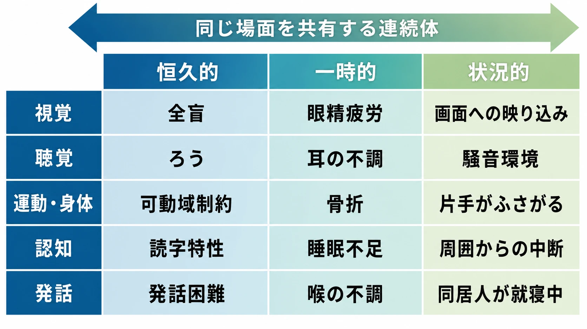
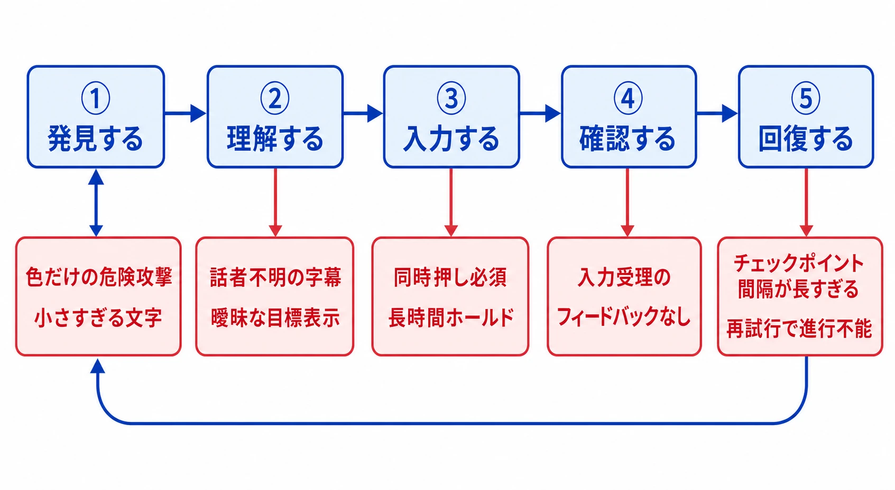
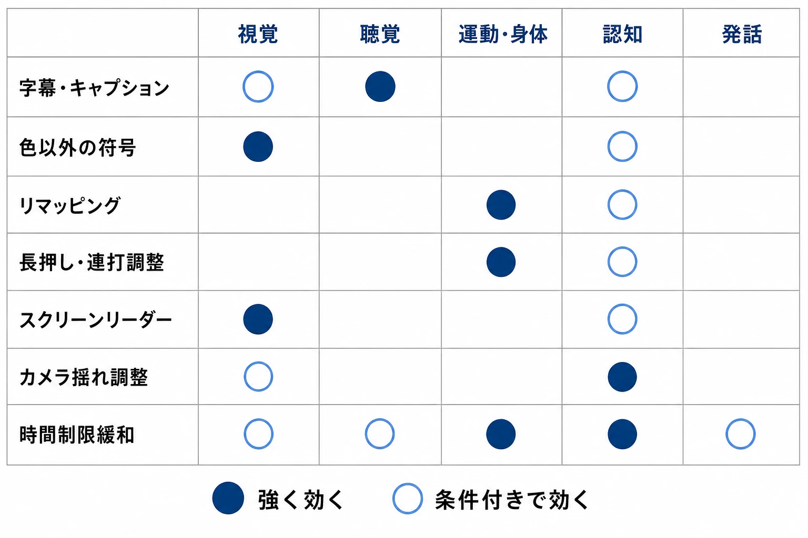
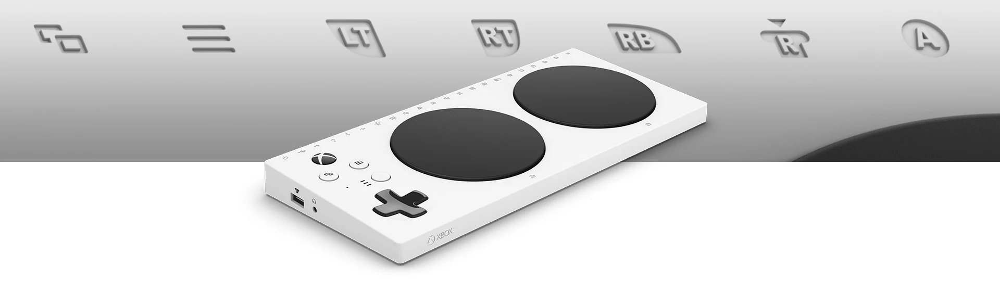
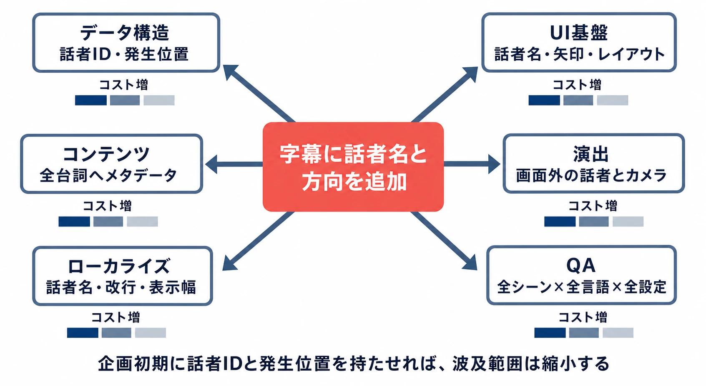
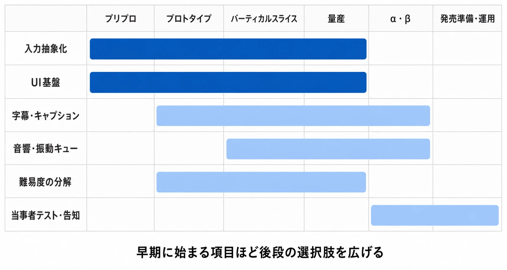
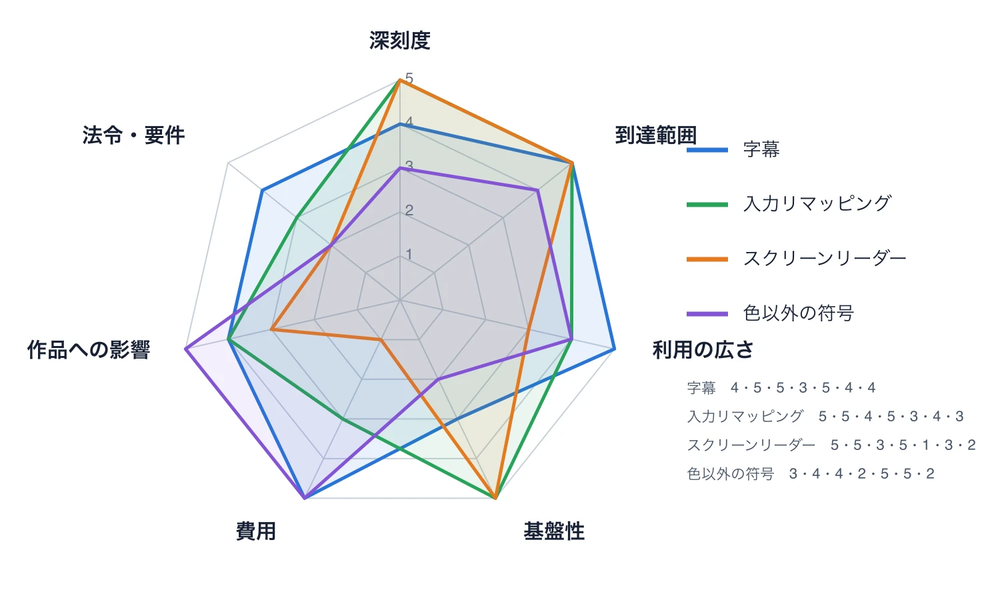

# ゲームのアクセシビリティ設計――「遊べない」を減らす企画・実装・検証の実務

## はじめに――「障害者向けの追加機能」ではない

ゲームのアクセシビリティと聞くと、発売直前に字幕や色覚サポートを足す仕事を想像しやすい。しかし、その理解では遅い。

アクセシビリティとは、プレイヤーとゲームの間にある障壁を見つけ、 **遊べる人を増やすための設計** である。障壁は人の身体だけにあるのではない。「重要情報を色だけで示す」「両手での同時押しを必須にする」「音声でしか次の目標を伝えない」といった設計との組み合わせで生まれる。この見方は、障害を個人の属性だけでなく、社会にある障壁との関係で捉える「社会モデル」にも通じる。[[1](#ref-1)]

新人プランナーがまず解いておきたい誤解は、次の3つだ。

- アクセシビリティは、一部の人だけが使う特殊機能ではない。
- アクセシビリティとゲームの難易度は、重なる部分はあっても同じものではない。
- 対応項目を増やせば完成するのではない。必要な情報へ到達し、理解し、入力し、結果を確認できる一連の体験がつながって初めて機能する。

本記事では、個々の機能に加え、いつ、何を、どこまで作るかを決める実務まで扱う。すべてのゲームに同じ正解はない。

---

## 1. 制約は恒久的とは限らない

Microsoftのインクルーシブデザインでは、能力の制約を **恒久的・一時的・状況的** な連続体として捉えている。片腕を恒久的に動かしにくい人、骨折で一時的に片手を使えない人、子どもを抱いていて状況的に片手しか使えない人は、原因が違っても「片手で操作したい」という場面を共有する。[[2](#ref-2)]

同じことは、ほかの感覚や認知にも当てはまる。

| 制約 | 恒久的な例 | 一時的・状況的な例 | ゲームで生じる障壁 |
|---|---|---|---|
| 視覚 | 全盲、弱視、色覚特性 | 眼精疲労、画面への映り込み、小画面 | 色だけの識別、小さい文字、画像化されたメニュー |
| 聴覚 | ろう、難聴 | 耳の不調、騒音、消音が必要な場所 | 音だけの警告、話者不明の字幕、ボイスチャット必須 |
| 運動・身体 | 可動域や筋力の制約、震え | 骨折、疲労、片手がふさがる | 同時押し、連打、長時間のホールド、精密照準 |
| 認知 | 読字・注意・記憶などの特性 | 睡眠不足、緊張、周囲からの中断 | 情報過多、短い制限時間、複雑な手順、曖昧な目標 |
| 発話 | 発話が難しい、声を出せない | 喉の不調、同居人が寝ている | 音声入力やボイスチャットだけに依存する協力 |

字幕は、聴覚に制約のある人だけでなく、家族が寝ている部屋や騒がしい電車内でも役立つ。リマッピングは身体条件への対応であると同時に、慣れた配置で遊びたい人にも有効だ。読みやすいUIや明確な目標表示は、初心者や復帰者も助ける。

障壁を減らせば、購入して遊び続けられる人が増える。一方で、娯楽やコミュニティへ参加する機会を、避けられる設計上の都合で閉ざさないこと自体にも価値がある。市場性だけでは少数のニーズが後回しになりやすく、倫理だけでは予算と工程を決められない。現場では両方を実装可能な計画へ変える。

---

## 2. 「どの障害か」より「どこで止まるか」を見る

企画時に診断名の一覧から考え始めると、当事者をひとまとめにしやすい。同じ弱視でも見え方は異なり、同じ運動障害でも使いやすい入力装置は異なる。そこで、プレイの流れを次の5段階に分けて障壁を探す。

1. **発見する** ｜目的地、敵、アイテム、警告に気づけるか。
2. **理解する** ｜ルール、文章、現在の状態、失敗理由が分かるか。
3. **入力する** ｜必要な速さ、精度、姿勢で操作できるか。
4. **確認する** ｜入力が受理され、何が変わったか分かるか。
5. **回復する** ｜ミスを取り消す、再試行する、休憩して戻ることができるか。

たとえば、敵の危険攻撃を赤い発光だけで示せば「発見する」で止まる。字幕に話者や音の方向がなければ「理解する」情報が足りない。リマッピング後もチュートリアルに元のボタンが出れば、設定と説明が食い違う。

アクセシビリティは設定項目の数ではなく、 **開始から終了までの経路が切れていないか** で確かめる。

---

## 3. よく使われる実装パターンと落とし穴

Xbox Accessibility Guidelinesは、文字表示、コントラスト、字幕、音声、入力、難易度、画面読み上げ、光過敏、コミュニケーションなどを、設計・実装・テストの観点で整理している。これは法令適合を保証するチェックリストではなく、開発時のベストプラクティスである。[[3](#ref-3)] Game Accessibility Guidelinesも、幅広く低コストで効きやすい基本項目から、計画を要する項目、高度な対応まで段階を分けている。[[4](#ref-4)]

### 3-1. 情報は一つの感覚だけに預けない

重要情報は、色・形・文字・音・振動のうち複数の経路で伝える。

- 敵味方を赤と緑だけで分けず、輪郭、模様、アイコン、名前も変える。
- 時限爆弾の接近を警告音だけにせず、画面上の方向表示や振動も用意する。
- ステルス中の発見度をゲージだけにせず、段階的な効果音やコントローラーの反応でも伝える。

全部を同時に強く出すと情報過多になる。各経路を調整可能にし、重要度に応じて強弱を付ける。

### 3-2. 字幕は台詞を書き起こすだけでは足りない

字幕と、効果音なども文字で示すキャプションでは、次を検討する。

- 文字サイズ、文字色、背景の濃さを変更できるか。
- 話者名と、画面外にいる話者の方向を示せるか。
- 戦闘中の掛け声や無線も対象にするか。
- ドアを叩く音、敵の接近、音楽の変化など、進行に必要な非言語音をどう記述するか。
- 表示時間、改行位置、画面上のUIとの重なりは適切か。

実務上の難所はローカライズである。言語ごとに文章長や改行が変わり、話者名や音の説明を加えると表示領域も増える。音声に話者、方向、優先度などのメタデータがなければ、後から全イベントを洗い直すことになる。

### 3-3. 色覚サポートは画面全体の色変換では終わらない

色覚特性への対応では、まず「色だけで意味を持たせない」。カードの属性なら記号を足し、レアリティなら枠形状や文字も変える。画面全体へ色フィルターをかける方法は、アートの見え方を変えても、同じ明度のUI要素を識別できるとは限らない。

HUDだけでなく、ミニマップ、照準、攻撃予兆、ドロップ品、パズル、チュートリアルまで確認する。意味を持つ色を共通データで管理すると、変更範囲を追いやすい。

### 3-4. 入力の変更はゲーム内表示まで連動させる

入力まわりでは、次の選択肢が広く役立つ。

- ボタンやキーのリマッピング
- 長押しとトグルの切り替え
- 連打を長押しや1回押しへ変更
- 同時押しを順番押しへ変更
- 入力受付時間、照準感度、デッドゾーン、ゲーム速度の調整
- 自動照準、自動取得、移動アシスト

難しいのは依存箇所を揃えることだ。操作表示、チュートリアル、QTE、メニュー、セーブデータが同じ入力定義を参照する必要がある。ハードウェア側のボタン交換だけでは、ゲーム内表示と一致しない場合もある。

Xbox Adaptive Controllerは、可動域に制約のあるプレイヤーを主な対象とし、外部スイッチ、ボタン、ジョイスティックなどを接続するハブとして設計されている。[[5](#ref-5)] ただし、対応機器を接続できても、ゲーム側が固定配置や複雑な同時押しを要求すれば障壁は残る。ハードウェア対応とゲーム内設計はセットで考える。

*Xbox Adaptive Controller。背面の3.5mmジャック群やUSBポートへ外部スイッチなどを接続できるハブ型コントローラー（出典：[Xbox Adaptive Controller｜Xbox](https://www.xbox.com/en-US/accessories/controllers/xbox-adaptive-controller/)、© Microsoft）。*

### 3-5. 難易度とアシストを分解する

「EASYを用意する」だけでは、何が難しいのかを選べない。被ダメージ、敵の反応速度、照準、資源量、パズル、制限時間、入力精度を別々に調整できれば、プレイヤーは苦手な部分だけを補える。

認知面では、次の対応も候補になる。

- 目標と次の操作を短く再確認できる。
- チュートリアルを後から読み直せる。
- 制限時間を延長または停止できる。
- 画面効果や通知を減らせる。
- 失敗理由を具体的に示し、同じ地点から再試行できる。
- 複雑な操作を練習できる安全な場所を用意する。

認知の制約を「理解力が低い」と一括りにしてはいけない。注意、短期記憶、読字、情報処理速度など、詰まる理由は異なる。情報を減らす設定と詳しい説明を増やす設定は、別の人に必要になる。

### 3-6. UI拡大とスクリーンリーダーは土台から作る

UIは文字だけ大きくしても、枠からあふれたり、ほかの情報を隠したりすれば使えない。可変レイアウト、折り返し、スクロール、フォーカス順、十分なコントラストを一緒に設計する。テレビから離れて遊ぶ、携帯画面で遊ぶ、配信映像を見るといった状況もテスト条件に含めたい。

スクリーンリーダーは、画面情報を音声で伝える仕組みである。独自描画UIでは、見た目とは別に項目名、状態、値、操作方法、フォーカス順を持たせる必要がある。後から全UIへ追加すれば高コストになる。

### 3-7. 画面酔いと光過敏は「警告だけ」で済ませない

画面酔いには、カメラ揺れ、モーションブラー、急なズーム、視野角、追従速度の調整、画面中央の固定点などがある。演出を消せなくても、強度を下げる選択肢を検討する。

光過敏への配慮では、強い点滅や高コントラストの反転を企画・VFX制作時から把握する。必要な演出なら、頻度、明るさ、表示面積を抑え、無効化や代替表現を用意する。起動時の警告は情報提供にはなるが、障壁そのものを除く機能ではない。

### 3-8. 発話を前提にしないコミュニケーション

協力ゲームでボイスチャットを唯一の連携手段にすると、発話や聴覚に制約のある人、声を出せない環境の人が参加しにくい。定型文、ピング、チャットホイール、テキストチャット、音声の文字起こし、入力文の読み上げなど、別経路を用意する。

機能の存在だけでは足りない。設定画面が読み上げられない、チャット操作を変更できない、戦闘中に文字入力する時間がない、といった経路上の詰まりも確認する。

---

## 4. ガイドライン、プラットフォーム、法制度をどう扱うか

### ガイドラインは「考え漏れを減らす道具」

各ガイドラインは、企画の発想、実装基準、QAの観点表として使える。プラットフォームにもズーム、読み上げ、クローズドキャプション、ボイストランスクリプション、コントローラー設定などがある。[[6](#ref-6)] PS5では、対応タイトルの機能をPlayStation Storeのゲームハブから一覧で確認できる「アクセシビリティ タグ」が2023年4月から提供されている。[[11](#ref-11)]

本体機能がゲーム内情報をすべて扱えるわけではなく、作品固有の障壁もある。法令、プラットフォーム要件、推奨事項、自社目標は区別して管理する。

### 具体例――『The Last of Us Part II』

『The Last of Us Part II』の日本向け公式ページでは、操作の再マッピング、連打から長押しへの変更、字幕の大きさ・色・背景・話者名・方向表示、テキスト読み上げ、移動や戦闘の音響キュー、ハイコントラスト表示、ナビゲーションアシスト、項目別の難易度調整などが公開されている。[[7](#ref-7)]

注目したいのは、視覚情報を音や振動へ置き換え、入力方法を変え、難しさを要素別に分解している点だ。一つの万能モードではなく、障壁ごとに異なる経路を用意している。

### 米国のCVAA――ゲーム全体の難易度を規制する法律ではない

米国のTwenty-First Century Communications and Video Accessibility Act、通称CVAAは2010年に成立し、障害のある人が通信サービスや機器、映像番組へアクセスできることを目的とする制度である。FCCはこれに基づき、Advanced Communications Services、すなわち高度通信サービスなどのアクセシビリティ要件を整備した。[[8](#ref-8)]

ゲームとの関係で重要なのは、 **ゲームプレイ全般ではなく、対象となる通信機能** が中心だという点である。ビデオゲームソフトウェアに対する一時的な適用除外は2018年12月31日までとされ、2019年1月1日より前に市場へ投入された対象ソフトは販売が続く間も除外対象になる、というFCCの決定がある。[[9](#ref-9)]

したがって「米国で販売するゲームは、すべてのゲーム内容を完全にアクセシブルにする法的義務がある」と短絡してはいけない。一方で、オンラインの音声・テキストチャットを持つ企画では、法務と連携し、対象機能、発売地域、開発時期、記録やサポートを含む最新要件を個別に確認する必要がある。本記事は法的助言ではない。

### 日本国内――法制度と製品設計を直結させすぎない

日本では、改正障害者差別解消法が2024年4月1日に施行され、事業者による合理的配慮の提供が努力義務から義務へ改められた。合理的配慮は、意思の表明があった場合に、負担が過重でない範囲で社会的障壁を取り除くための対応を行う考え方である。加えて、不特定多数を対象とする事前の環境整備は努力義務として説明されている。[[1](#ref-1)]

ただし、これを個々のゲーム機能へ機械的に対応付けることはできない。販売、イベント、顧客対応、オンラインサービスなど事業の形も関係する。国内では、法務確認と並行して、プラットフォームの日本語情報、当事者団体や専門家の知見、実際のユーザーテストを積み上げるのが現実的である。

### 米国CVAAと日本の改正障害者差別解消法の比較

両制度は性質が異なるため、対応関係を一覧で整理しておく。あくまで概要であり、個別案件の判断は法務に確認すること。

| 観点 | 米国 CVAA（ACS関連） | 日本 改正障害者差別解消法 |
|---|---|---|
| 制定・施行 | 2010年制定、ビデオゲームは2018年12月31日まで一時的適用除外 | 2013年制定（2016年施行）、改正法は2024年4月1日施行 |
| 対象範囲 | 高度通信サービス（ACS）：VoIP、電子メッセージング、ビデオ会議など。 **ゲームプレイ全般ではなく通信機能** | 事業者と障害のある人との関係全般。販売、サービス提供、オンライン対応など |
| 求められる対応 | 通信機能のアクセシビリティ要件、記録保持、年次コンプライアンス証明 | 不当な差別的取扱いの禁止、合理的配慮の提供（義務）、事前の環境整備（努力義務） |
| 義務の発生条件 | 対象通信機能を含む2019年1月1日以降の新作・実質改修ソフト | 障害のある人から意思の表明があった場合に、過重でない範囲で対応 |
| 違反時の措置 | FCCによる調査、最大100万ドル超の罰金（ACS規則違反） | 罰則なし。主務大臣による報告徴収、助言、指導、勧告 |
| 主な所管 | FCC（連邦通信委員会） | 内閣府、各府省庁（事業分野ごとの対応指針） |
| 関連する一次資料 | [[8](#ref-8)] [[9](#ref-9)] | [[1](#ref-1)] |

CVAAはゲーム内通信の **機能要件** を定めるのに対し、改正障害者差別解消法は事業者と利用者の **個別場面での対話** に重点を置く。前者はチェックリスト的に確認できる一方、後者は意思表明への応答プロセスを設計する必要がある。

---

## 5. なぜ後付けは高くつくのか

アクセシビリティ対応が高価なのではない。 **前提を固定した後で、その前提を崩す変更が高価** なのである。

たとえば開発終盤に、字幕へ話者名と方向を付けるとする。台詞に話者IDがなく、字幕枠は2行固定で、翻訳とカットシーン調整も完了していれば、データ、UI、ローカライズ、演出、QAを横断して修正が発生する。

企画初期に「台詞は話者IDと発生位置を持つ」「字幕領域は可変」と決めておけば、追加コストは小さくなる。

後付けで壊れやすい箇所は次の通りだ。

- **データ構造** ｜色、入力、話者、音、UI文言が意味ではなく見た目へ直書きされている。
- **ゲームロジック** ｜連打や制限時間がイベント進行と一体化している。
- **UI基盤** ｜固定座標、固定サイズ、画像化された文字、読み上げ不能な独自部品が多い。
- **コンテンツ** ｜大量のステージ、ムービー、チュートリアルが同じ障壁を複製している。
- **ローカライズ** ｜変更後の文字量、読み上げ、用語、音声収録を再確認する必要がある。
- **QA** ｜設定の組み合わせが増え、セーブ、オンライン、難易度、入力機器との総当たりが膨らむ。

だから、発売直前にアクセシビリティ担当者へ「できる範囲でお願いします」と渡すのは危険だ。担当者の努力では、基盤の前提まで短期間に変えられない。

---

## 6. いつ着手し、どこまで作るか

### 6-1. 工程ごとに決めること

| 工程 | プランナーが行うこと | 成果物の例 |
|---|---|---|
| 企画・プリプロダクション | コア体験と必須能力を分け、重大な障壁を洗い出す | アクセシビリティ方針、対象プラットフォーム要件 |
| プロトタイプ | 入力、時間制限、情報経路を複数案で試す | リマッピング可能な入力定義、情報チャネル表 |
| バーティカルスライス | 製品相当の1区間で設定から再試行まで通す | 字幕、UI拡大、アシストの実動サンプル |
| 量産 | 共通基盤を使い、コンテンツへメタデータを入れる | 話者・方向・重要音・色用途のデータ |
| α・β | 当事者を含むテストで障壁を観察し、優先度を更新する | 課題票、修正判断、既知の制約 |
| 発売準備・運用 | 機能を正確に告知し、更新で退行させない | 機能一覧、サポート情報、回帰テスト |

最初から全機能を完成させる必要はない。入力をアクション名で抽象化する、文字を画像へ焼き込まない、重要情報をデータ化する、UI部品を共通化するなど、後で選択肢を足せる構造を早く作る。これは仕様変更やローカライズにも効く。

### 6-2. 優先順位は「人数」だけで決めない

全部を同時に実装できない場合は、次の軸で比較する。

1. **深刻度** ｜ないと不便なのか、開始不能・進行不能になるのか。
2. **到達範囲** ｜一部のミニゲームだけか、メニューを含む全編か。
3. **利用の広さ** ｜異なる制約や状況にも効果があるか。
4. **基盤性** ｜後続機能の前提になるか。入力抽象化や可変UIは基盤性が高い。
5. **実装と検証の費用** ｜開発費だけでなく、翻訳、収録、QA、運用を含むか。
6. **作品への影響** ｜意図した緊張、競技公平性、物語表現へどう影響するか。
7. **法令・プラットフォーム要件** ｜発売地域と機能に応じた必須条件があるか。

*スコアは議論用の目安であり、実際のプロジェクトでは状況に応じて再評価する。*

低コストで広く効き、進行不能を防ぐ項目は早く着手しやすい。字幕、色以外の符号、長押しとトグルの選択、カメラ揺れの調整などが候補になる。

段階別ガイドラインは、小規模チームにも使いやすい。高度な読み上げや音響ナビゲーションが難しくても、入力変更、字幕、色以外の符号、揺れの無効化、時間制限の緩和、機能一覧の公開は検討できる。重大な障壁を少数でも確実に減らしたい。

### 6-3. 当事者を含むテストは、答え合わせではなく発見である

開発者が設定をオンにして遊ぶだけでは、実際の障壁を再現できない。普段使う支援機器、操作姿勢、情報の探し方、疲労の出方は人によって違う。Microsoftのゲームアクセシビリティテストサービスも、専門家と障害のあるプレイヤーがXbox Accessibility Guidelinesに沿って評価する形を採っている。[[10](#ref-10)]

テストでは「この機能は便利ですか」と感想だけを聞かない。次のような課題を実際に行ってもらう。

- 初回起動から設定へ到達する。
- セーブデータを作り、チュートリアルを終える。
- 音を消した状態、色を区別しにくい状態、片手の入力構成など、対象条件で重要場面を通す。
- 失敗理由を理解し、設定を変え、再試行する。
- 休憩後に再開し、現在の目標を確認する。

一人を「当事者全体の代表」にしてはいけない。大きな字幕は画面を隠し、強い振動は負担になる場合もある。相反するニーズがあるから、選択肢と個別調整が重要になる。謝礼、参加方法、同意、個人情報の扱いもテスト設計に含める。

### 6-4. プランナーが仕様書へ書けること

アクセシビリティを「エンジニアが後で考える非機能要件」にしない。各仕様へ次を添える。

- この機能でプレイヤーが得るべき情報は何か。
- その情報は、どの感覚経路で伝わるか。
- 必須の入力回数、同時押し、精度、制限時間は何か。
- 操作方法や表示サイズを変えたとき、説明も追従するか。
- 失敗した理由と回復方法が分かるか。
- 設定はいつ変更でき、セーブデータやアカウント間でどう保持するか。
- ムービー、オンライン、チュートリアル、ローカライズ版でも同じ情報へ到達できるか。
- 自動テストで守れる部分と、人が確認すべき部分はどこか。

また、アクセシビリティ設定を初回起動時から選べるようにする。メインメニューの小さな文字が読めない人に、メニューの奥で文字拡大を探させてはいけない。設定名には専門用語だけでなく、何が変わるかを短く説明する。可能なら変更結果をその場でプレビューする。

---

## 7. 難易度オプションは作家性を損なうのか

この議論に一つの正解はない。反応時間や失敗の重さが作品の核なら、変更で別の体験になることはある。対戦ではアシストが公平性やランキングへ影響しうる。

一方で、「意図した難しさ」と操作上の障壁は分けられる。敵を読む難しさを残して連打を長押しに変える、探索の不安を残して文字を大きくするなど、全員へ強制せず **選択肢として提供する** 方法もある。

判断するときは、次の順で問うとよい。

1. プレイヤーに味わってほしい核は何か。
2. 現在の制約は、その核を生むために本当に必要か。
3. 障壁を減らしても核を保つ代替案はあるか。
4. オンラインの公平性、実績、ランキングへの影響を分離できるか。
5. 選択肢を使った人を罰したり、恥じさせたりする表示になっていないか。

何を守り、何を選べるようにするかを明文化する。その対話自体がゲームデザインである。

---

## おわりに――アクセシビリティは品質の土台である

アクセシビリティは、完成したゲームへ善意で足す飾りではない。プレイヤーが情報を発見し、理解し、入力し、結果を確認し、失敗から戻れるようにする品質設計である。

怪我、疲労、騒音、小画面、片手がふさがる状況まで見れば、字幕、リマッピング、明確なUIなどが幅広い人に効く理由が分かる。作品の核、障壁の深刻度、基盤、費用、発売地域を比較し、当事者と優先順位を決める。

早く始めるほど、対応は特別な追加作業ではなく、データ設計、UI基盤、入力、ローカライズ、QAの日常へ溶け込む。アクセシビリティとは「誰かのためにゲームを易しくすること」ではない。 **意図していない理由で入口を閉ざさず、より多くの人へ意図した体験を届けること** である。

---

## References

1. [第1章 改正障害者差別解消法の施行｜令和6年版 障害者白書（概要）][1] - 障害の社会モデル、合理的配慮、事前的な環境整備、2024年4月施行の改正内容を説明する内閣府資料。

2. [Inclusive 101][2] - 恒久的・一時的・状況的な制約を連続体として捉え、特定の人への解決を多くの人へ広げるインクルーシブデザインの考え方を解説。

3. [Xbox Accessibility Guidelines][3] - 文字、字幕、入力、難易度、画面読み上げ、光過敏、コミュニケーションなど、ゲーム開発向けの推奨事項を掲載。

4. [Game Accessibility Guidelines - Full list][4] - 運動、認知、視覚、聴覚、発話などの対応を、基本・中級・上級の段階に分けて整理。

5. [Xbox Adaptive Controller][5] - 外部スイッチ、ボタン、ジョイスティックなどを接続できる、可動域に制約のあるプレイヤーを主対象としたコントローラーの公式説明。

6. [PS5のアクセシビリティ設定][6] - PS5本体のコントローラー設定、ズーム、音声読み上げ、クローズドキャプション、ボイストランスクリプションなどの公式案内。

7. [『The Last of Us Part II』アクセシビリティオプション][7] - 日本向け公式ページに掲載された入力、字幕、音響キュー、読み上げ、ナビゲーション、難易度などの機能一覧。

8. [Accessibility of Communications in Video Games][8] - CVAAの目的、ACS（高度通信サービス）の定義、ビデオゲームへの適用範囲を整理したFCC公式の解説ページ。

9. [Entertainment Software Association; Petition for Class Waiver (DA 17-1243)][9] - ビデオゲームソフトウェアに対する高度通信サービスのアクセシビリティ要件の適用除外を2018年末までとしたFCC決定。

10. [Microsoft Gaming Accessibility Testing][10] - アクセシビリティ専門家と障害のあるプレイヤーがガイドラインに沿って評価するテストサービスの公式説明。

11. [PS5™のPlayStation®Storeにアクセシビリティ タグが追加][11] - PS5のPS Storeのゲームハブから△ボタンで対応アクセシビリティ機能を一覧表示できる機能を案内するPlayStation Blog公式記事。

[1]: https://www8.cao.go.jp/shougai/whitepaper/r06hakusho/gaiyou/h01.html
[2]: https://inclusive.microsoft.design/articles/inclusive-101-guidebook
[3]: https://learn.microsoft.com/en-us/gaming/accessibility/guidelines
[4]: https://gameaccessibilityguidelines.com/full-list/
[5]: https://www.xbox.com/en-US/accessories/controllers/xbox-adaptive-controller
[6]: https://www.playstation.com/ja-jp/support/hardware/ps5-accessibility-settings/
[7]: https://www.playstation.com/ja-jp/games/the-last-of-us-part-ii/accessibility/
[8]: https://www.fcc.gov/consumers/guides/accessibility-communications-video-games
[9]: https://docs.fcc.gov/public/attachments/DA-17-1243A1.pdf
[10]: https://learn.microsoft.com/en-us/gaming/accessibility/mgats
[11]: https://blog.ja.playstation.com/2023/04/04/20230404-ps5/

----

この文書は、Perplexity、Claude、OpenAI Codex の3つのAIの支援を受けて著述されたものです。引用画像を除き、MIT License にて提供されています。
