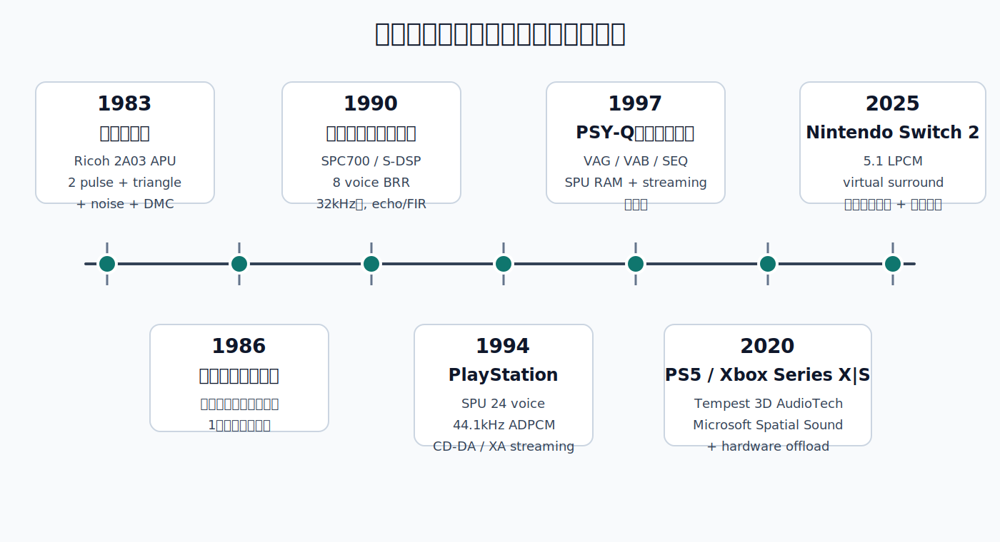
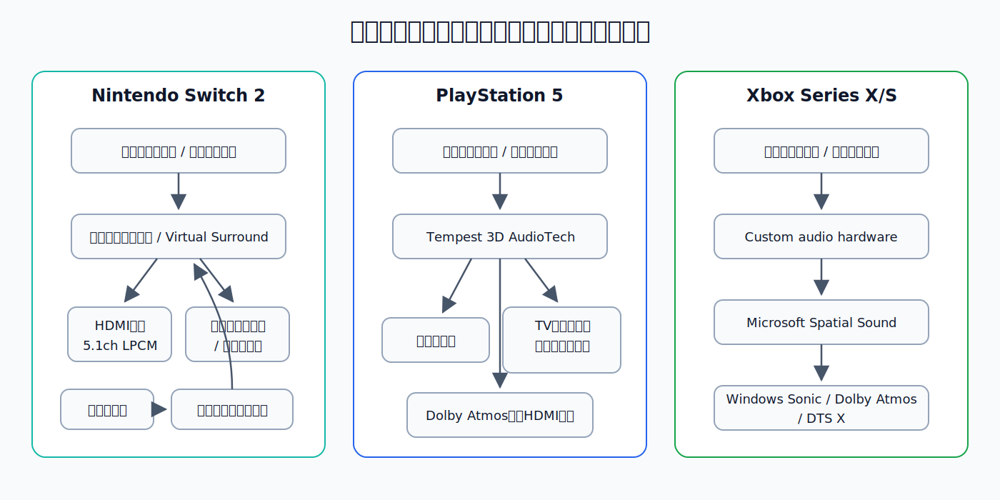

# 家庭用ゲーム機サウンドの歴史

## エグゼクティブサマリー

家庭用ゲーム機のサウンド史は、単純に「音が良くなった」という一本線ではない。むしろ、 **どこに希少資源があったか** が世代ごとに移り変わった歴史として捉えるほうが正確である。ファミコン期では、希少資源はまず **発音チャンネル** そのものだった。スーパーファミコン期では、チャンネル数は増えたが、今度は **64KBの音声RAM** と **BRR圧縮サンプル** の運用が制約になった。PlayStation期では、 **24ボイスSPU** と **CD-DA/XAストリーミング** の併用によって、制約の中心は **512KBのSPU RAMをどう使い、どこからストリームするか** に移った。現行機では低レベルの音源仕様が一般公開されにくくなり、差別化の主戦場は **空間音響レンダラ、HRTF、ミドルウェア、ストレージ帯域、そして制作ワークフロー** になっている。

本稿の結論は三つある。第一に、 **ファミコンからスーパーファミコンへの転換点** は、波形合成中心の"作曲＝レジスタ設計"から、サンプル選定・圧縮・ループ設計を含む"作曲＝音色制作"への転換だった。第二に、 **PlayStationの本質的な飛躍** は、PCM/ADPCMの高品位化それ自体より、 **シーケンス再生とCDストリーミングを同じ作品内で役割分担できたこと** にある。第三に、現行機では「音源チップの個性」は後退したが、その代わりに **空間化、動的ミキシング、ボイス処理、オブジェクト化、アクセシビリティ対応** が、音響表現の中心になっている。これは、昔のサウンドが「限られた5本の筆で描く版画」に近かったのに対し、現在は「編集可能な多トラック映画音響をリアルタイムで再構成する」段階に入った、という変化である。

## 対象範囲と分析の枠組み

対象範囲は、 **ファミコン → スーパーファミコン → PlayStation → 現行機** とする。現行機は、2026年4月時点の主要メーカー最新家庭用機として、任天堂のNintendo Switch 2、ソニーのPlayStation 5、MicrosoftのXbox Series X｜Sを含める。なおNintendo Switch 2は2025年6月5日発売で、TV出力と5.1ch Linear PCMを持つため、本稿では任天堂系の現行"家庭用"基幹機として扱う。旧世代では公式のレジスタ公開資料が断片的なため、一次資料として残るアーカイブ化された開発マニュアルを優先しつつ、レジスタ級仕様は長年利用されてきたハードウェア技術資料で補った。

### 主要スペック比較

| 世代 / 機種           | 主な音源ブロック                                             | 合成 / 再生方式                                              | 公開上の同時発音能力                                                      | サンプリング / 量子化                                         | 音響メモリ・媒体                              | 技術的な要点                                    |                                       |
| ----------------- | ---------------------------------------------------- | ------------------------------------------------------ | --------------------------------------------------------------- | ---------------------------------------------------- | ------------------------------------- | ----------------------------------------- | :------------------------------------ |
| ファミコン             | Ricoh 2A03内蔵APU                                      | 2パルス、三角波、ノイズ、DMC                                       | 5ch（うち音楽的に使いやすい有音程は実質3系統）                                       | 波形生成系は固定波形、DMCは約4.18–33.14kHzのレート選択・7-bit出力          | 専用音声RAMなし、ROM/CPUメモリ依存                | 発音数と波形制約が厳しく、アルペジオ・疑似和音・ノイズ打楽器が発達         |                                       |
| スーパーファミコン         | Sony SPC700系S-SMP + S-DSP                            | BRR圧縮サンプル再生、ノイズ、ピッチ変調、エコー                              | 8ボイス                                                            | DSP出力16-bit stereo、出力サンプルレートは32kHz、ソースは4-bit BRRブロック | ARAM 64KB、カートリッジROM                   | サンプルベース化。エコー用バッファがARAMを大きく消費              |                                       |
| PlayStation       | SPU + CD-ROM decoder                                 | SPU ADPCM、CD-DA 16-bit PCM、CD-ROM XA ADPCM、ストリーミング     | 24ボイス + CD系音源のミックス                                              | 44.1kHz、SPUはADPCM、CD-DAは16-bit PCM                   | SPU RAM 512KB + CD-ROM                | "ローカルRAM上の音"と"ディスクから流す音"の分業が成立            |                                       |
| Nintendo Switch 2 | 公開資料上はCustom NVIDIA processor + 音声入出力機能 + 音声処理用専用チップ | ソフトウェア / ミドルウェア主体、立体サウンド、Virtual Surround、5.1ch LPCM出力 | 固定ボイス数は非公開。公開される出力はStereo / 5.1 LPCM                            | 内部サンプルレート/ビット深度は非公開                                  | 本体保存メモリー256GB、高速化されたmicroSD Express対応 | 公開される差分は"出力能力"と"ボイス処理"寄りで、旧来の音源チップ的公開は少ない |                                       |
| PlayStation 5     | Tempest 3D AudioTech                                 | 3D / 空間音響レンダリング、ヘッドホン / TV / Dolby Atmos対応             | 固定チャンネル数は非公開                                                    | 内部サンプルレート/ビット深度は非公開                                  | SSD 825GB、高速I/O                       | 低レベル音源ではなく、空間レンダラと出力経路が差別化要素              |                                       |
| Xbox Series X｜S  | Custom audio hardware block + Microsoft Spatial Sound | オブジェクトベース spatial rendering、Windows Sonic / Dolby Atmos / DTS:X | API上は17 static channels (8.1.4.4) + dynamic objects | 内部サンプルレート/ビット深度は非公開 | SSD + custom hardware offload | CPU負荷を下げつつ空間音響を標準化し、出力先差分をプラットフォームが吸収 |                                       |

表中のファミコン行は2A03 APU/DMC仕様、スーパーファミコン行はSPC700/S-DSPとARAM・DAC仕様、PlayStation行はPSY-Qハードウェアリファレンスと開発者ガイド、現行機行は各社の現行公開仕様とオーディオ機能説明に基づく。現行機では、旧世代のような内部DSPのサンプリング周波数・内部量子化ビット深度・固定ボイス数が公開されないケースが多いため、その欄は「非公開」と明記した。

## 世代別技術分析

**ファミコン期。** 2A03 APUは、 **2つのパルス波、1つの三角波、1つのノイズ、1つのDMC** から成る。ハードウェア上は5チャンネルだが、近藤浩治が「ファミコンでは3音しか使えない」と回想しているのは、音楽的に使いやすい有音程パートが実質的に **2パルス＋三角波** で、ノイズとDMCが打楽器や効果音に回りがちだったからである。DMCは1-bit delta-encoded sample（DPCM）を再生し、NTSCで約4.18kHzから33.14kHzまで16段階のレートを選べるが、サンプル読み出し時にはCPUを1〜4サイクル停止させるため、音色拡張の代償として処理負荷が増えた。

この時代の作曲は、今日のDAW上の"音色選び"というより、 **どの瞬間にどのチャンネルを旋律、ベース、和声、打楽器、効果音のどれに割り当てるか** を設計する作業だった。三角波は32ステップ4-bit値の階段波で音量制御ができず、ノイズは16段階の擬似ランダム周期、パルス波はデューティとスイープを持つ。結果として、和音は高速アルペジオで代用され、推進感はノイズやDMCのリズム、旋律の輪郭はパルス波の duty 変化で稼ぐ、という文法が固まった。後年の"チップチューンらしさ"の多くは、この **制約の副産物** である。

**スーパーファミコン期。** 転換点は、 **Sony SPC700系S-SMP + S-DSP** を中心とする独立音響サブシステムの採用にある。ここではもはや固定波形の直接生成ではなく、 **BRR圧縮サンプル** を8ボイスで再生する方式が中心になる。音響RAMは64KB、DSP出力は16-bit stereoで出力サンプルレートは32kHz、ホワイトノイズ、ピッチ変調、8-tap FIRを用いたエコーがハードウェア支援された。BRRは9バイト単位のブロックで16サンプルを符号化する固定構造で、ループ点やフィルタ係数を前提に設計されている。なお、実際にROMに収められるサンプル素材は32kHzより低いサンプリング周波数であることが多く、S-DSPが再生時に32kHzへリサンプルする。

ただし、この世代の豊かな残響感は"無料"ではなかった。エコー遅延 `EDL` は **16msごとに2KB** のメモリを消費し、最大30KB（EDL=15のとき0x7800バイト）をエコーバッファに取られる。つまり、64KBしかないARAMの中で、 **サンプル本体、シーケンス、DSP状態、そしてエコー領域が綱引き** していた。結果としてスーパーファミコンサウンドの本質は、「PCM導入」そのものより、 **限られたサンプルメモリをどう圧縮・ループ・エコー共有するか** にあった。

**PlayStation期。** ソニーのPlayStationでは、サウンド系は **SPU** と **CD-ROM decoder** の二層構成になった。SPUは **24ボイス、44.1kHz、ADPCM、512KBのSPU RAM** を持ち、デジタルリバーブとCDデコーダ出力のミキシングを備える。一方、CD-ROM decoder側は **CD-DA 16-bit PCM** と **CD-ROM XA ADPCM** を読み、SPUに送って混ぜられる。つまりPlayStationの音響表現は、「何をSPU RAMに常駐させるか」と「何をCDから連続供給するか」の設計問題だった。

PSY-Q開発資料が示すように、PlayStation世代では **VAG（サンプル）→ VAB（音色バンク）→ SEQ/SEP（シーケンス）** という制作フローが定着した。VAGは約3.5:1のADPCM圧縮（28サンプル×16-bit＝56バイト→16バイト）を前提にし、ADPCM圧縮の都合でループ点は **28サンプル境界** に縛られる。さらに、SPU streaming library は、512KBに収まらない波形を連続転送して再生する仕組みを用意しており、これによって音楽・ボイス・環境音の役割分担が一気に柔軟になった。PlayStationで"ゲーム音楽が映画に近づいた"という印象は、波形品質だけでなく、この **ストリーミング前提の実装自由度** から来ている。

**現行機。** 2020年代の家庭用機は、旧来のような「何Hzで何bitの音源チップが何chあるか」を前面には出さない。公開資料の中心は、 **空間レンダリング、出力経路、ユーザー体験** である。PlayStation 5はTempest 3D AudioTechを **"custom engine for 3D audio"** として位置付け、ヘッドホン、TVスピーカー、さらに2023年以降は **Dolby Atmos対応HDMI機器** へのレンダリングを拡張してきた。Xbox Series X｜Sは **custom audio hardware** でCPUから空間音響処理をオフロードし、Microsoft Spatial Soundで **17の静的チャンネル (8.1.4.4) と dynamic objects** を扱える。Nintendo Switch 2は、公開されるのが主に **5.1ch Linear PCM出力、System/Headphone Virtual Surround、立体サウンド、内蔵マイクのノイズ抑制** であり、さらにゲームチャット用として **音声処理専用の高性能なチップ** を搭載することが明かされている。

この"非公開化"は退歩ではない。むしろ、現代のボトルネックが **固定チャンネル数から、リアルタイム空間化・動的ミキシング・大量アセットの帯域管理・ツールチェーン整合** へ移ったことを示している。昔はチップの制約が音の個性を作ったが、今は **レンダラ、コーデック、ミドルウェア、空間プロファイル、ストレージI/O** の設計が個性を作る。歴史的に見ると、サウンド技術の重心が **発音器そのもの** から **音響パイプライン全体** へ移ったのである。

進化の節目を年表にすると、以下のように整理できる。

年表で重要なのは、 **1990年と1994年に不連続な飛躍がある** ことだ。1990年は「波形合成からサンプルベースへ」、1994年は「ローカル音源からディスク連携へ」、2020年以降は「チャンネル管理から空間レンダリングへ」の移行点として読むのが妥当である。

## 代表タイトル事例

選定基準は、各世代の制約を **そのまま音楽表現に変えたか**、あるいは **ハードの新機能を作品の実装思想にまで落とし込んだか** である。音源入手先は、可能な限り公式公開サントラや公式アプリ、公式商品ページを優先した。

**ファミコン期**

1. **『スーパーマリオブラザーズ』（1985年）** — 近藤浩治は、3音しか使えない環境で「自然に音楽に聞こえ、しかも3音だからこそ面白いもの」を目指し、地上・地下・水中・城で音楽の役割を明確に分けた。特に地上BGMでは、マリオの走行とジャンプのリズムに合わせて曲を書き直したと述べており、ここでは **ゲームプレイ速度が作曲を規定** している。技術的には、2パルス＋三角波の枠内にメロディ・ベース・和声を押し込み、ノイズの連打が前進感を作る典型例である。公式音源の現行入手先としてはNintendo Musicとマリオ25周年の公式サウンドトラックCDがある。

2. **『スーパーマリオUSA』（1992年）** — ディスクシステム版『夢工場ドキドキパニック』を海外NES向けに『Super Mario Bros. 2』としてリメイクし、さらに日本のファミコンへ再リメイクした作品。同じく近藤は、この作品で **delta modulation（DPCM）によるパーカッションサンプリング** を使うと「単体では音が悪いが、打楽器として混ぜると豊かで良い音になった」と振り返っている。これはファミコン内蔵DMCの最も実践的な使い方の一つで、 **サンプルは"メロディ"ではなく"質感の加算"に使う** という設計思想を示す。公式音源はNintendo Musicのスーパーマリオブラザーズ2 / USA系プレイリストで辿れる。

3. **『ゼルダの伝説』（1986年、ディスクシステム）** — 厳密にはディスクシステムの拡張例だが、ファミコン世代の上限を示す代表例として重要である。近藤は、ファミコンの3音に対しディスクシステムでは **4音目と新音色** が加わり、その新音源の多くを効果音に使ったが、 **"1音増えるだけで非常にありがたかった"** と語っている。つまり、この時期のサウンド表現はまだ「高音質化」ではなく、 **1ch増加の価値が極端に大きい世界** だった。公式音源はNintendo Musicで確認できる。

**スーパーファミコン期**

4. **『スーパーマリオワールド』（1990年）** — 近藤はこの作品について、「スーパーファミコンでは **8音同時に鳴らせる** のがうれしく、最初から多くの楽器を次々に使って"新ハードらしさ"を伝えようとした」と述べている。さらにジャンプ音をパンフルート系音色で作るなど、BGMと効果音の境目が"波形の共有"から"音色設計の一貫性"へ移っている。ここでは **PCM導入が、メロディだけでなく効果音の質感設計まで変えた** ことが重要である。公式音源はマリオ25周年公式サウンドトラックCDで辿れる。

5. **『ファイナルファンタジーVI』（1994年）** — 植松伸夫が関わったこの作品は、スーパーファミコン期後半の **大規模シーケンス + サンプルバンク運用** の極北である。後年のCEDECレポートでは、植松が当時の低いハードスペックゆえに、ひらめいたアイデアをそのまま実現できないことが多かったと振り返っている。技術的に見ると、この作品の厚いオーケストレーション感は、64KBのARAMの中でBRRサンプル、ループ、エコー領域をやり繰りした結果であり、 **表現力の増加とメモリ制約が正面衝突した時代** の代表例といえる。公式音源はスクウェア・エニックスの公式サントラ商品ページで入手できる。

6. **『スーパードンキーコング』（1994年）** — David Wiseのサウンドは、カートリッジ機でありながらCD機に匹敵する広がりを感じさせる代表例としてしばしば評価される。主要レビュー / 回顧記事でも、 **CD-ROM機が"スタジオ品質音声"を売りにしていた時代に、カートリッジ上でこのサウンドを実現した** 点が強調されている。技術的には、これはSPC700/S-DSPの"高自由度"というより、 **少数のループサンプルとエコー感を最適化して空間印象を作る職人芸** だった。現行での公式音源確認先はNintendo Musicである。

7. **『テイルズ オブ ファンタジア』（1995年）** — ナムコ（現バンダイナムコ）の回顧記事は、この作品の発端を「 **歌と声が出るスーパーファミコン基板** 」と表現している。別の公式記事でも、当時としては珍しく **主題歌とゲーム内ボイス** を収録したことがシリーズの特徴として語られている。これは、スーパーファミコンの標準的8ボイスPCM運用を越え、 **圧縮音声を"世界観の売り"にまで押し上げた事例** として重要である。公式の現行参照先としては、シリーズ公式回顧記事と関連移植版商品ページがある。

**PlayStation期**

8. **『リッジレーサー』（1994年）** — PlayStation開発者ガイドは、 **トンネル通過時に全サウンドへリバーブを適用する例** としてこのシリーズを挙げている。ハードウェア側では、CD-ROM decoderがCD-DA / XAを再生し、その出力がSPUに入り、SPU側の24ボイスADPCMと混ざって最終出力になる。つまりこの系統の作品は、 **ストリーミング音楽 / 環境反射 / 効果音を別レーンで扱う** という、PlayStationらしい実装の分かりやすい教材である。現行の公式補助資料としてはシリーズ開発日記が残る。

9. **『ファイナルファンタジーVII』（1997年）** — SEQはMIDI同様に **ノートイベントとシーケンス** としてVABの楽器サンプルを参照する方式で、同じサンプルを何度でも使い回せるため、少数の波形で長大な楽曲を効率よく賄える。『ファイナルファンタジーVII』はこの長所を最大限に使った代表作で、PlayStation時代の"豪華な音"のかなりの部分は、実際には **大量の生波形ではなく、慎重に作られたVAGサンプル群とシーケンス** で成立していた。これによってSPU RAMを節約しつつ長大なスコアを保持できた点が、PlayStation時代のゲーム音楽制作を象徴する。公式音源はスクウェア・エニックスの公式オリジナル・サウンドトラックで入手できる。

10. **『ビブリボン』（1999年）** — PlayStation Blogは、この作品の核心を「**プレイヤーの任意の音楽CDに合わせてコースが変形する**」ことだと説明し、PlayStation 3版でも「選んだ音楽CDに基づくユニークなレベルを作る機能」を保持したと明記している。これはPlayStation世代のストリーミング音響が、BGM再生だけでなく **ゲームルールそのものの入力** として機能した珍しい事例である。ストレージメディア上の音を、単なる"曲"ではなく **レベルジェネレータ** に転用した点で、PlayStation世代の最も先鋭的な音楽実装の一つといえる。公式参照先はゲーム本編そのものだ。

**現行機**

11. **『ASTRO's PLAYROOM』（2020年、PlayStation 5）** — PlayStation 5世代の最初期ショーケースとして、この作品はTempest 3D AudioTech対応タイトル群に明示されている。加えてPlayStation Blogは、公式サウンドトラックの配信とともに作曲面の背景を紹介しており、 **ハード機能のデモンストレーションと記憶に残る楽曲設計** を同時に成立させた。技術的には、旧来の"高音質PCM"というより、 **空間化された定位、触覚、UIサウンドの一体設計** が特徴である。公式音源はSony Music Masterworksの公式サントラ案内から辿れる。

12. **『Returnal』（2021年、PlayStation 5）** — Game Directorのコメントは、この作品の3D Audioが **縦方向の多い戦場で敵や弾の位置把握を直感化する** と説明している。別の公式インタビューでも、作曲の側から「HousemarqueがTempest Engineで優れた方向感を実現している」と語られている。ここで重要なのは、3Dオーディオが"没入感の演出"に留まらず、 **ゲームプレイ上の situational awareness** に組み込まれていることだ。公式音源はデジタルサウンドトラックと先行公開トラックから確認できる。

13. **『Senua's Saga: Hellblade II』（2024年、Xbox Series X｜S）** — Xbox Developer\_Directは、この作品で **binaural and spatial audio** がプレイヤーを世界へ深く沈めると説明している。これはXbox Series X｜Sの空間音響が、"対応機器があればAtmosで鳴る"という出力段の話ではなく、 **知覚設計そのものをゲームの主題に結びつける** 段階に達していることを示す。とくにHellblade系作品は、定位が単なるサラウンド効果ではなく、主観経験の演出装置として機能するため、現行Xboxの代表例に適している。公式入手先としてはXbox版商品ページおよび拡張版の公式案内がある。

14. **『カービィのエアライダー』（2025年、Nintendo Switch 2）** — 任天堂の公式記事では、桜井政博がこの作品の音楽コンセプトを **"子どもが歌えること""一度走っただけでも残るシグネチャ・メロディ""オーケストラを核にすること"** として語っている。さらに100曲超がNintendo Musicで聴取可能で、開発時点の素材がかなり大規模だったことも示される。これはNintendo Switch 2の低レベル音源を見せる事例ではなく、 **現行任天堂作品の制作規模が、レイヤー分割・オーケストレーション・長尺サントラ運用へ完全に移った** ことを示す事例として重要である。公式音源はNintendo Music。

## 世代間比較

まず音質そのものの変化を見ると、ファミコンは **波形の種類と発音数が音色の限界** を決め、スーパーファミコンは **サンプルベース化によって"楽器らしさ"を獲得** した。PlayStationはそれを一段推し進め、 **44.1kHzのSPU ADPCMとCD-DA/XA** によって、BGM・ボイス・環境音を質的に分業できるようにした。現行機では、音質の差は「44.1kHzか32kHzか」のような単純な軸ではなく、 **どれだけ多くの音を空間的・動的・個別にレンダリングできるか** へ移っている。

次に、CPU / メモリ / ストレージの影響は、ほぼそのまま実装思想の変化を説明する。ファミコンではDMC再生でCPUが止まり、専用音声RAMもなく、 **音そのものがCPU資源を持っていく**。スーパーファミコンではCPUを分離した代わりに、今度は **64KB ARAMの中でサンプルとエコーが競合** する。PlayStationではSPU RAMは512KBと増えるが、ゲーム全体から見れば依然小さく、その不足を **CDストリーミング** で補った。現行機では高速SSD / 高速フラッシュが前提化し、PlayStation 5は5.5GB/sのraw read bandwidthを掲げ、Nintendo Switch 2も読み書き高速化とmicroSD Express対応を打ち出す。ここでストレージは単なる保存領域ではなく、 **高品位のステムやオブジェクト音を遅延なく供給する一部** になっている。

制作ワークフローの変化は、もっとはっきりしている。ファミコン期は、 **作曲と実装がほぼ同義** で、音楽はチャンネル占有設計とレジスタ書き込みに近かった。スーパーファミコンでは、BRR圧縮、サンプルループ、エコー設定が入り、作曲家の仕事は **音符を書くこと** から **音色資産を管理すること** へ広がった。PlayStationではSound Artist ToolやPSY-Qのlibspu/libsndによって、 **VAG/VAB/SEQ** という資産管理・変換・シーケンス前提の工程が標準化され、今日のオーディオミドルウェア的発想に近づく。現行機ではDAWに加え、Wwise、FMOD、CRI ADX2、Unreal MetaSoundsのような環境が、 **資産生成・圧縮・ミキシング・パラメータ駆動・空間化連携** を担当する。

### 制作・実装ワークフローの変化

| 時代                                                                       | 作曲家が主に扱ったもの                                                                                                                                                                       | 実装側の主戦場                         | 代表的な圧縮 / 再生                           |
| ------------------------------------------------------------------------ | --------------------------------------------------------------------------------------------------------------------------------------------------------------------------------- | ------------------------------- | ------------------------------------- |
| ファミコン                                                                    | 音高・長さ・チャンネル割当・簡易エンベロープ                                                                                                                                                            | レジスタ駆動、疑似和音、SFXとの競合回避           | DMC / 直接波形生成                          |
| スーパーファミコン                                                                | ノートデータ + サンプル選定 + ループ + DSP設定                                                                                                                                                     | BRR変換、ARAM配置、エコーメモリ節約           | BRR                                   |
| PlayStation                                                              | MIDI系シーケンス + VAGサンプル + ストリーム管理                                                                                                                                                    | VAB設計、SPU RAM節約、XA/CDとの分業       | SPU ADPCM / XA ADPCM / CD-DA          |
| 現行機                                                                      | 多トラック音源、ステム、オブジェクト、DSPグラフ                                                                                                                                                         | ミドルウェア連携、空間音響、動的ミックス、コーデック別銀行生成 | Opus / ATRAC9 / XMA / ADX系などプラットフォーム別 |

この表の後半ほど、作曲家と実装者の境界は曖昧になっていく。FMODは現行機でOpusをPlayStation 5 / Xbox Series X｜S / Nintendo Switch向け推奨コーデックとして扱い、Unreal MetaSoundsはサンプルアキュレートなDSPグラフ生成を可能にし、CRI ADX2はSound xRによってプラットフォーム差を吸収する方向を取っている。つまり現在の"音質向上"は、単純なPCM化ではなく、 **圧縮効率・空間整合・ツールの横断性** で達成されている。

サウンドミドルウェアの意味も変わった。ファミコン / スーパーファミコン期の"サウンドエンジン"はほぼ各タイトル固有だったが、PlayStation期にはソニーの標準ライブラリとファイル形式が共通基盤として働き始める。現在はWwise、FMOD、CRI ADX2のような汎用ミドルウェアが **複数プラットフォームへ同一プロジェクトを展開** し、その上でPlayStation 5のTempestやXbox Spatial Sound、各プラットフォーム固有のデコーダ / 出力に橋をかける。この意味で、現代のサウンドエンジンは"再生器"ではなく、 **プラットフォーム差分の翻訳層** に近い。

## 現行機アーキテクチャと今後の展望

以下の図は、各社が **公開している範囲だけ** で抽象化した現行家庭用機のオーディオアーキテクチャである。PlayStation 5はTempest 3D AudioTechを核にしたレンダラ、Xbox Series X｜Sはcustom audio hardwareとMicrosoft Spatial Sound、Nintendo Switch 2は5.1ch LPCM / Virtual Surroundとゲームチャット向けの音声処理専用チップが公開情報の中心で、旧来のような"このDSPが何kHzで何ボイス"という低レベル仕様はほぼ表に出ない。

この図が示す最大の変化は、 **音響処理の中心が"サウンドチップ"から"レンダリングサービス"へ移った** ことだ。ファミコンやスーパーファミコンならチップ仕様そのものが作品個性を強く規定したが、現行機ではゲーム側はオブジェクトやステムやイベントを供給し、最終空間化はプラットフォーム側が担う。そのため、作品差は「どのPCM音源を鳴らしているか」より、 **どういう音場メタデータを持ち、どういうミキシング規則で再構成しているか** に宿る。

以下の展望は、公開資料にもとづく **推定** である。

1. 今後3〜5年で、 **プラットフォーム固有の空間レンダラは維持されたまま、ミドルウェア側で"共通の音場記述"を持つ流れ** がさらに強まる可能性が高い。XboxはSpatial Sound APIを、PlayStation 5はTempestを、CRI ADX2はSound xRを、それぞれ"差分吸収の受け口"として育てているためである。

2. **個人最適化HRTF** は標準要素に近づく。PlayStation 5はすでにpersonalized 3D audio profilesを導入し、Xbox / WindowsはHRTFベースのspatial audio object実装を公開している。Nintendo Switch 2もSystem / Headphone Virtual Surroundをユーザー設定として露出しており、将来的には測定や推定の個人化が広がると見るのが自然である。

3. アセット圧縮は、 **ロスレスPCM常駐より"Opus中心の高効率ストリーム + 必要時だけ高品位展開"** に寄る公算が大きい。FMODはPlayStation 5 / Xbox Series X｜S / Nintendo SwitchでOpusをプラットフォーム提供デコーダとして扱っており、高速ストレージと組み合わせることで、長尺のステムや環境音を細かく差し替える設計がしやすいからである。

4. **ボイス / チャット / アクセシビリティとゲーム音響の統合** はさらに進む。Nintendo Switch 2は内蔵マイクと音声処理専用チップを公開しており、Xboxのアクセシビリティ指針も"方向定位が重要な音のspatial audio表現"を推奨している。現行機の音響設計は、BGMやSEだけでなく、 **会話・聴覚支援・ノイズ抑制まで含む総合I/O設計** へ広がっていくはずだ。

5. 音楽と効果音は、より **プロシージャル** になる。MetaSoundsが示すように、現代のオーディオシステムは"固定音源を再生する場所"より"リアルタイムにDSPグラフを組む場所"へ進んでいる。これは過去のチャンネル数制限と逆に、 **音を事前に全部作り切る必要がなくなる** 方向の変化であり、今後のゲーム音響の質感を大きく変える可能性がある。

## 結論

家庭用ゲーム機サウンドの歴史を通して見ると、本質的な進化は「チップのbit数が増えたこと」ではない。より重要だったのは、 **音をどう表現する自由が、どの制約と引き換えに与えられたか** である。ファミコンはチャンネル制約の極限で独自文法を作り、スーパーファミコンはサンプルベース化の代わりにメモリ管理を難しくし、PlayStationはCDストリーミングを獲得する代わりにRAMと媒体の二重設計を要求した。現行機は、低レベル仕様を隠す代わりに、空間化・I/O・ミドルウェア・高速ストレージを総動員する"システム音響"の時代に入っている。

したがって、「ゲーム機のサウンドはチップチューンからオーケストラへ進化した」という定番の要約は半分だけ正しい。もう半分は、 **制作現場の重心が、作曲からサンプル設計へ、サンプル設計からストリーム設計へ、ストリーム設計から空間レンダリングとパイプライン設計へ移った** という事実である。この観点に立つと、過去の名機が残した最大の遺産は音色そのものではなく、 **制約を美学へ変える設計思想** だったと言える。現行機のサウンド技術も、その思想を別の形で継承している。
