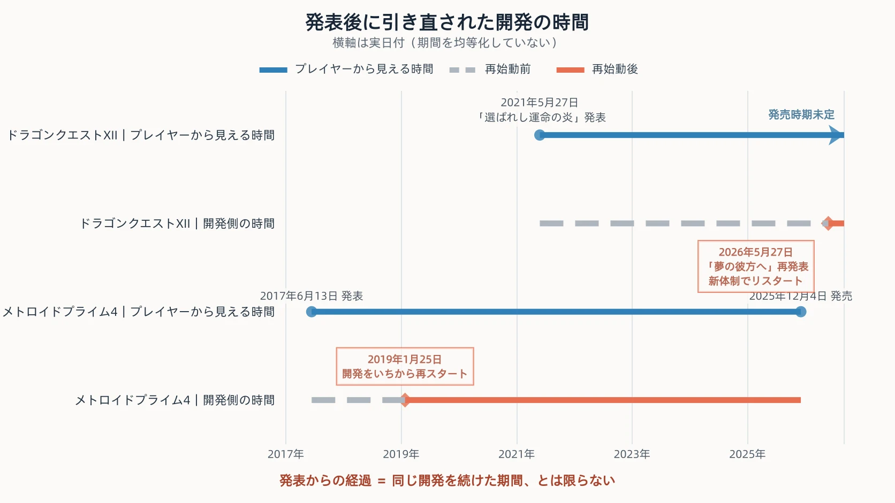
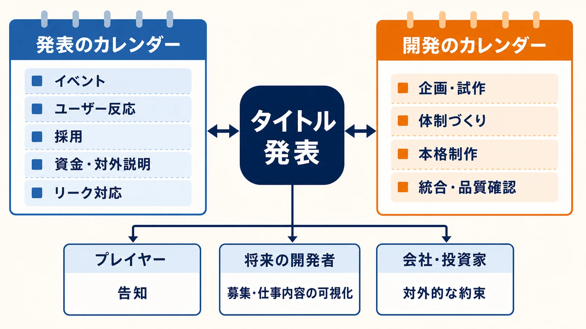
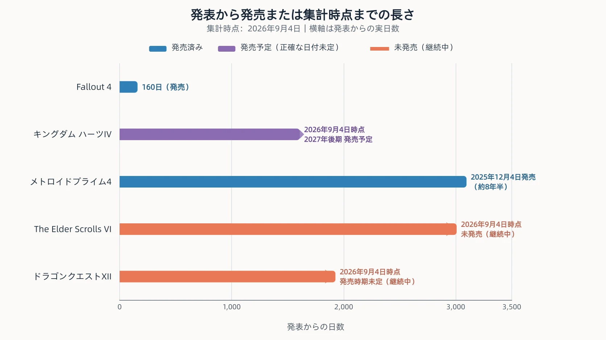

# 発表されたタイトルに、あとから人が集まる――発表と開発は別のカレンダーで動いている

***

## 1. 発表されたタイトルに、あとから人が集まる

かつて編者は、あるデベロッパー企業で、社内のすべての案件を調整する立場にいた。パブリッシャーとの折衝も担う、半ば企画営業に近い部隊である。ここでいうデベロッパーはゲームを開発する会社、パブリッシャーは企画の承認、資金、販売などを担う会社を指す。両者の役割は案件ごとに異なるが、本稿ではこの程度の理解で十分である。

ある年、東京ゲームショウの前に一つのタイトルが発表された。その後、社内で開発人員を配置する段階になった。配置される側のスタッフにとって、それはそのとき初めて名前を聞くタイトルだった。

これは外部から真偽を検証できない編者個人の経験である。会社名、作品名、IP、ジャンルを伏せるため、個別案件の記録として検証することもできない。また、誰かの判断を告発する意図もない。ここで見たいのは、発表時点で制作に必要な人が全員そろっているとは限らず、発表のあとからタイトルの下へ人が集まる場合がある、という構造だけである。

プレイヤーから見れば、発表はゲームが姿を現す瞬間だ。開発者から見れば、その発表を境に担当者が決まり、本格的な制作が始まることもある。だとすれば、発表と開発は本当に同じカレンダーで動いているのだろうか。

本稿では、発表日から発売日までの日数を、そのまま開発期間とは呼ばない。公表された出来事と当事者の証言をたどり、 **発表を決める事情** と **ゲームを作る工程** が別々の時計で動く様子を見ていく。

***

## 2. 「開発が長くなった」で説明できる部分、できない部分

近年の大作について、発表から発売までが長い理由を「ゲーム開発が巨大化したから」と説明するのは、半分は正しい。高精細な画面を作るだけでなく、多数の遊びを一つの作品に統合し、複数の機種や言語へ対応し、品質を確かめる仕事が重なる。Todd Howard氏も『Starfield』開発中の取材で、ゲーム開発は予測しにくく、野心的になるほど予測しにくさが増すと説明している。[[1](#ref-1)] 作るものが大きくなれば、設計、制作、統合、検証に時間がかかる。これは否定する必要のない事実である。

ただし、発表日から発売日までの長さと、同じ設計を継続して作った期間は一致しない。

第一に、発表時点が本格制作の開始後とは限らない。 **プリプロダクション** とは、本格的に大量のデータを作る前に、企画、試作、技術検証、制作体制などを固める段階である。Bethesda Game Studiosは2018年6月に『The Elder Scrolls VI』を発表した公式記事で、同作がプリプロダクション中だと明記していた。[[2](#ref-2)] タイトルの存在を公表するカレンダーが、大人数で作る工程より先へ進んでいたことを、発表主体自身が示した例である。

第二に、発表後に設計や開発体制が見直され、制作が再始動することがある。この場合、外から見える一本の待ち時間の内側に、最初の開発、見直し、別の体制による開発が含まれる。発表から8年で発売されたとしても、「同じものを8年間作り続けた」とは限らない。

したがって、発表から発売までの長さには少なくとも二つの要素が混ざる。

1. 一つのゲームを作り、仕上げるために必要な時間
2. どの段階でそのゲームの存在を公表したか

発売日の変更が企業や市場へ及ぼす影響は、既刊記事「[GTA6再延期はなぜ海外を揺らし、日本では温度差が見えるのか](gta6-delay-japan-overseas-perception-gap.md)」で扱った。本稿が扱うのは、その前段にある「いつ発表の時計を動かし始めるか」である。次に、発表後の再始動によって、二つの時間がはっきり分かれた事例を見よう。

***

## 3. 発表された企画が、そのまま世に出ないとき

### 『ドラゴンクエストXII』――5年後に名前と体制を改める

スクウェア・エニックスは2021年5月27日、シリーズ35周年の日に『ドラゴンクエストXII 選ばれし運命の炎』の制作を発表した。公開されたのはタイトルロゴとティザートレーラーで、対応機種と発売日は未定だった。[[3](#ref-3)]

作品内容に踏み込む大きな続報がないまま、およそ5年が経過した。2026年5月27日のシリーズ40周年に、同社は『ドラゴンクエストXII 夢の彼方へ』を発表した。公式発表では「新しい体制でリスタート」を行い、サブタイトルとロゴを一新したと説明している。対応機種と発売時期は、この時点でも未定であった。[[4](#ref-4)]

発表映像でエグゼクティブプロデューサーの齊藤陽介氏は、シリーズ最新作としてさまざまな挑戦を続けたうえで、堀井雄二氏との話し合いを重ね、『ドラゴンクエスト』のナンバリング作品がどうあるべきかを突き詰めた結果、新体制で再出発する判断に至ったと説明した。[[5](#ref-5)] 堀井氏は新しい作品について、「夢の彼方には、きっとダークではなくて 明るくワクワクするような世界が広がっていると思いますよ」と述べた。2021年に語られていたダークな方向からの変化を示す発言である。キャラクターデザインは鳥山明氏、音楽はすぎやまこういち氏が担当している。[[5](#ref-5)]

ここで「リスタート」を、過去に作ったものを一つ残らず捨てたという意味に広げてはならない。どのデータや仕様を引き継いだかは公表されていない。確認できるのは、会社が新体制での再始動、名称とロゴの変更、作品の方向を検討し直した経緯を公表したことまでである。それでも、2021年の発表から2026年の再発表までを、同じ計画が予定どおり進んだ5年間として数えることはできない。

### 『メトロイドプライム4』――開発を「いちから」再スタートする

『メトロイドプライム4』は、2017年6月13日のE3でNintendo Switch向けに開発中だと発表された。最初の映像はタイトルロゴを中心とする短い内容であった。[[6](#ref-6)]

2019年1月25日、任天堂の高橋伸也氏は開発状況を説明する映像を公開した。発表後も開発を続けてきたが、任天堂がシリーズ続編に求める品質へ届いていないとして、開発体制そのものを見直すと説明したのである。プロデューサーの田邊賢輔氏は継続し、過去の『メトロイドプライム』シリーズを手がけた米国のレトロスタジオと組み、開発を「いちから再スタート」すると明言した。[[7](#ref-7)]

再始動後の作品は『メトロイドプライム4 ビヨンド』として、2025年12月4日にNintendo Switch版とNintendo Switch 2 Editionが発売された。[[8](#ref-8)] 2017年の初報から約8年半である。ただし、その8年半は一つの制作工程ではない。少なくとも公表情報の上では、2019年に開発体制と制作の起点が切り替わっている。

二作に共通するのは、単に作業量が多く、同じ道を進む速度が遅かったという説明では足りない点である。『ドラゴンクエストXII』は新体制でリスタートし、『メトロイドプライム4』は開発をいちから再スタートした。最初の発表が作った一本の長い時間軸の内側で、開発側の時間軸は引き直されている。

***

## 4. それでも早く発表するのはなぜか

発表が待ち時間を生み、後の変更を難しくするなら、完成が近づくまで伏せておけばよいように見える。それでも早期発表が選ばれる理由として、どのようなものが語られているのだろうか。

AUTOMATONは2026年4月、Redditのr/gamingに投稿された「ゲームの発表が早すぎるのが嫌いだ」という趣旨の投稿と、それに対する反応を紹介した。元の投稿は記事執筆時点で約1万1000件のUpvoteを集めていたという。その議論では、ゲーム業界関係者を名乗る匿名ユーザーが、早期発表の理由を説明していた。[[9](#ref-9)]

以下の7項目は、 **外部から身元や真偽を検証できない匿名投稿に由来する見解** であり、確認済みの業界慣行ではない。AUTOMATONの記事が過去の開発者発言も参照して整理した論点として扱い、「業界では必ずこうしている」とは読まないことが重要である。

| 向いている相手 | 挙げられた理由 | 発表が果たすと説明された役割 |
| --- | --- | --- |
| プレイヤー | ユーザーの反応を確認する | 企画や見せ方に対する反応を、変更できる段階で知る |
| 開発者・会社 | 開発者が経歴書に記載できる | 秘密保持契約の下でも、発表済み作品への参加を職歴として示しやすくする |
| 開発者・会社 | 開発中止を難しくする | 公に約束された企画として、開発者の安心材料になりうる |
| 開発者・会社 | 投資家の注目を集める | 出資や開発資金の確保につながる可能性を作る |
| 開発者・会社 | 採用・人材募集に使う | 何を作るチームかを候補者へ示し、参加を促す |
| 開発者・会社 | リークへ先回りする | 断片的な流出より先に、公式が選んだ形で第一印象を作る |
| 開発者・会社 | スタッフが家族へ仕事を説明できる | 守秘義務のある仕事を、身近な人へ発表済みの範囲で話せるようにする |

この分類で目立つのは、プレイヤーへ直接向いた理由が「反応の確認」の一つであり、残る六つが開発者や会社の事情へ向いていることである。もちろん、一つの発表が宣伝と採用を同時に担うことはあり、二群を完全には分離できない。それでも、早期発表をプレイヤーへの発売予告だけと捉えると、その決定理由の多くが見えなくなる。

匿名投稿とは別に、実名の開発者が同じ方向を語った例もある。小島秀夫氏は2016年、『DEATH STRANDING』のティザーを公開した直後のインタビューで、当時は会社の立ち上げ、企画、人集めを並行しており、スタッフを集めている段階だったと説明した。そのうえで、ティザーを見た人から多くの応募があることへの期待と、観客の賛同を得て制作への決意が強まったことを語っている。[[10](#ref-10)] これは先の7項目すべてを証明するものではないが、「反応の確認」と「採用」については、発表当事者の説明と重なる。

早く発表することの重さは、長く待たせた作品を作る当事者の言葉にも表れる。Bethesda Game Studiosは2018年のE3で、『The Elder Scrolls VI』をタイトルと風景の短い映像で発表した。当時、公式にはプリプロダクション中であった。[[2](#ref-2)] Todd Howard氏は2023年のGQインタビューで、当時発表したことを後悔しているかと問われ、こう答えた。

> “I have asked myself that a lot. I don't know. I probably would've announced it more casually.” [[1](#ref-1)]

何度も自問したが分からない、おそらくもっと控えめに発表しただろう、という趣旨である。Bethesda Game Studiosは2026年7月、同作が現在の主要な開発対象であり、多くのスタッフが取り組んでいると公表した。2026年9月4日現在、発売には至っていない。[[11](#ref-11)] 発表が本格制作より先に立ち、その後も長く作品の顔として残った例である。

『キングダム ハーツIV』も、2022年4月のシリーズ20周年イベントで発表された。[[12](#ref-12)] 2026年8月のD23で、発売時期が2027年後期だと公表された。[[13](#ref-13)] 発表によって存在を知らせることと、発売時期を約束できることの間には、この作品でも数年の隔たりがあった。

***

## 5. 発表は誰のためのものか

ここで冒頭の経験へ戻ろう。東京ゲームショウの前にタイトルが発表され、その後で社内の人員が配置された。配置されるプランナーにとっては、発表されたとき初めて名前を聞く仕事だった。

第4章で整理した早期発表の理由に採用と人材募集が含まれるなら、別の読み方ができる。発表を見て「何それ」と思ったプランナー自身が、その発表によって集められる側だった可能性である。

これは冒頭の個別案件で、実際に採用広報が目的だったと断定する話ではない。その意図は確認できない。そうではなく、 **発表の受け手には、将来のプレイヤーだけでなく、将来の開発者も含まれうる** という構造を示している。

開発のカレンダーには、企画の検討、試作、体制づくり、本格制作、統合、品質確認が並ぶ。発表のカレンダーには、イベント、採用、資金調達、株主への説明、ファンとの関係、リークへの対応などが並びうる。前者は「いつなら作れるか」を中心に進み、後者は「いつ外へ示す必要があるか」を中心に進む。担当する部門も、判断の材料も、締切も同じとは限らない。

だから、タイトル発表は完成へ向かう進捗報告であると同時に、人と資金と期待を動かす装置になる。発表を先に置くことで人を集め、その人たちが開発を本格化させることもある。プレイヤーには「もう作っているから発表した」と見えるが、会社側では「作る体制を成立させるために発表した」という因果が混ざりうるのである。

この見方を持つと、「発表から何年たったか」だけで開発の健全さを測る危うさも分かる。プレイヤーが数え始める日は発表日だが、チームが同じ仕様と体制で本格制作を始めた日は、もっと後かもしれない。途中で作り直したなら、その二つはさらに離れる。外から観測できる一本の時計を、内部の進捗率へそのまま変換しないことが大切である。

***

## 6. 発表は盾であり、枷でもある

匿名投稿で挙げられた「発表済みの作品は容易に中止できないため、開発者の安心材料になる」という見解を裏返すと、発表の両面性が見える。公表された企画は、社内の都合だけでは消しにくい約束となり、開発を中止から守る **盾** になりうる。一方で、その約束は開発を縛る **枷** にもなりうる。[[9](#ref-9)]

発表で見せた主人公、舞台、遊び、対応機種、発売時期は、法的な契約と同じ意味を持つわけではない。それでも、プレイヤーや取引先が抱く期待の基準にはなる場合が多い。開発中の検証によって別の設計がよいと分かっても、発表内容との差を説明する仕事が生じる。変更できないわけではないが、未発表の企画を変える場合より、調整する相手と判断材料が増えうる。

あとからアサインされたプランナーは、白紙から企画を始めるとは限らない。発表済みのロゴ、映像、言葉が先にあり、どこまでが確定事項で、どこからが演出上の仮置きかを読み解くところから仕事が始まる場合がある。そこで必要になるのは、発表を絶対視することでも、無視することでもない。

実務では、少なくとも次の点を分けて確認したい。

1. **外部へ何を見せたか**：映像、文章、対応機種、発売時期などを一覧にする。
2. **何を約束として受け取られているか**：明言した内容と、映像から推測されている内容を分ける。
3. **現在の開発で何が変わったか**：技術上の制約、試作結果、体制変更による差を整理する。
4. **変更を誰が判断するか**：開発、販売、IP管理など、関係者ごとの承認範囲を確認する。
5. **外部説明が必要か**：変更自体の可否と、いつどのように伝えるかを別の課題として扱う。

これは、すべての会社で同じ手続きが採られるという説明ではない。発表済みの案件へ途中参加したときに、観察できる事実と推測を混ぜないための整理である。

発表を盾として使えば、企画へ人や資金を集め、中止の不安を小さくできるかもしれない。だが盾を構えた瞬間、その形に合わせて進む責任も生まれる。早期発表の価値と危うさは、同じ約束の表裏にある。

***

## 7. おわりに――発表も開発の一部として設計する

対極にあるのが『Fallout 4』である。Bethesda Softworksは2015年6月3日に同作を正式発表し、同年11月10日に発売した。発表から発売までは160日、およそ5か月である。[[14](#ref-14)][[15](#ref-15)] プレイヤーがタイトルの存在を公式に知ってから、実際に遊べるまでの時間を短くした出し方だった。

『Fallout 4』型の短い発表期間が常に正しく、『The Elder Scrolls VI』型の早期発表が常に誤りだという話ではない。発表には、作品を待つプレイヤーへの告知だけでなく、反応の確認、採用、対外説明、リークへの先回りといった目的が重なる場合がある。完成間近まで伏せれば待ち時間は短くできるが、発表を使って人や支持を集める機会は遅くなる。

プランナーが持ち帰るべき問いは、「何年前に発表するのが正しいか」ではない。 **この発表で誰を動かし、何を約束し、その約束を開発側がいつから引き受けられるのか** である。発表日を広報だけの締切にせず、採用、体制、仕様変更の余地、次に情報を出せる時期まで含めて開発の一部として設計する必要がある。

2021年に発表され、2026年に新体制で再始動した『ドラゴンクエストXII 夢の彼方へ』は、2026年9月4日現在も発売時期・対応プラットフォームともに未定である。[[4](#ref-4)]

## References

1. [Inside Starfield: How Bethesda's “NASA punk” epic became the biggest Xbox game in a decade][1] - Todd Howard氏が大規模で野心的なゲーム開発の予測困難さと、『The Elder Scrolls VI』の発表時期を振り返ったGQインタビュー。

2. [Bethesda Game Studiosの新作][2] - 2018年6月10日のBethesda公式発表。『The Elder Scrolls VI』が発表時点でプリプロダクション中だったことを明記。

3. [「ドラゴンクエスト」シリーズ最新作『ドラゴンクエストXII 選ばれし運命の炎』制作を発表][3] - 2021年5月27日のスクウェア・エニックス公式発表。初報時の名称、対応機種・発売日未定を確認。

4. [本編第12作目『ドラゴンクエストXII 夢の彼方へ』を発表！][4] - 2026年のドラゴンクエスト公式発表。新体制でのリスタート、名称・ロゴの一新、対応機種・発売時期未定を掲載。

5. [『ドラゴンクエスト12 夢の彼方へ』発表。なんと「新体制で開発をリスタート」していた][5] - 2026年5月27日の発表映像における齊藤陽介氏と堀井雄二氏の説明を収録したAUTOMATON記事。

6. [『メトロイドプライム4』人気シリーズ最新作がNintendo Switch向けに開発中！【E3 2017】｜ファミ通.com][6] - 現地時間2017年6月13日の「Nintendo Spotlight: E3 2017」での発表を報じた記事。公開されたのはタイトルロゴのみであったことを記載。

7. [Nintendo Switch『メトロイドプライム4』の開発が事実上の“やり直し”。原点であるスタジオと再出発｜AUTOMATON][7] - 2019年1月25日に任天堂の高橋伸也氏が公開した説明の内容を報じた記事。品質が求める水準へ届いていないこと、田邊賢輔氏の継続とレトロスタジオによる再始動を掲載。

8. [Metroid Mondays: Things will go boom…][8] - 任天堂公式記事。『メトロイドプライム4 ビヨンド』の2025年12月4日発売と、Nintendo Switch版・Nintendo Switch 2 Editionを確認。

9. [「“新作ゲームの早すぎる発表”をやめて」との声に、ゲーム開発者も注目。待たせちゃうけど、早めに発表したい複雑な事情][9] - 2026年4月28日のAUTOMATON記事。Reddit上の匿名投稿に由来する見解であり、検証済みの業界慣行ではない。

10. [〖E3 2016〗テーマは「繋がり」―謎に包まれた「DEATH STRANDING」について、小島秀夫氏に訊いた][10] - 小島秀夫氏がティザー制作と会社設立、人集めを並行していたこと、反応と応募への期待を語ったインタビュー。

11. [A Note from Bethesda Game Studios][11] - 2026年7月17日のBethesda Game Studios公式発表。『The Elder Scrolls VI』を主要な開発対象として進めている現況を掲載。

12. [『キングダム ハーツIV』『キングダム ハーツ ミッシングリンク』同時発表！][12] - 2022年4月のスクウェア・エニックス公式記事。

13. [『KINGDOM HEARTS IV』2027年後期 発売決定][13] - 2026年8月16日のスクウェア・エニックス公式発表。D23での発表内容は[ファミ通.comの記事](https://www.famitsu.com/article/202608/84470)でも照合。

14. [Bethesda Softworks Announces Fallout 4][14] - Bethesda Softworks提供の2015年6月3日付プレスリリース。正式発表日を確認。

15. [Fallout 4 – Why Details Matter][15] - Bethesda公式記事。2015年11月10日の発売を告知。

[1]: https://www.gq-magazine.co.uk/article/starfield-todd-howard-interview
[2]: https://bethesda.net/ja-JP/news/starfield-and-the-elder-scrolls-vi-teaser
[3]: https://www.jp.square-enix.com/company/ja/news/2021/html/68521fbf7a269c919dba30c72cdbf8d9a1e30113.html
[4]: https://www.dragonquest.jp/portal/news_detail/sq/4246/
[5]: https://automaton-media.com/articles/newsjp/20260527-445513/
[6]: https://www.famitsu.com/news/201706/14135376.html
[7]: https://automaton-media.com/articles/newsjp/20190125-83976/
[8]: https://www.nintendo.com/us/whatsnew/metroid-mondays-things-will-go-boom/
[9]: https://automaton-media.com/articles/newsjp/20260428-440323/
[10]: https://www.gamer.ne.jp/news/201606170004/
[11]: https://bethesda.net/en-US/news/a-note-from-bethesda-game-studios
[12]: https://www.jp.square-enix.com/topics/detail/2083/
[13]: https://www.jp.square-enix.com/company/ja/news/files/28b69901ec6028bae1160c61bcef8f8a.pdf
[14]: https://www.prnewswire.com/news-releases/bethesda-softworks-announces-fallout-4-300093425.html
[15]: https://bethesda.net/en-US/news/fallout-4-why-details-matter
----

この文書は、Perplexity、Claude、OpenAI Codex の3つのAIの支援を受けて著述されたものです。引用画像を除き、MIT License にて提供されています。
