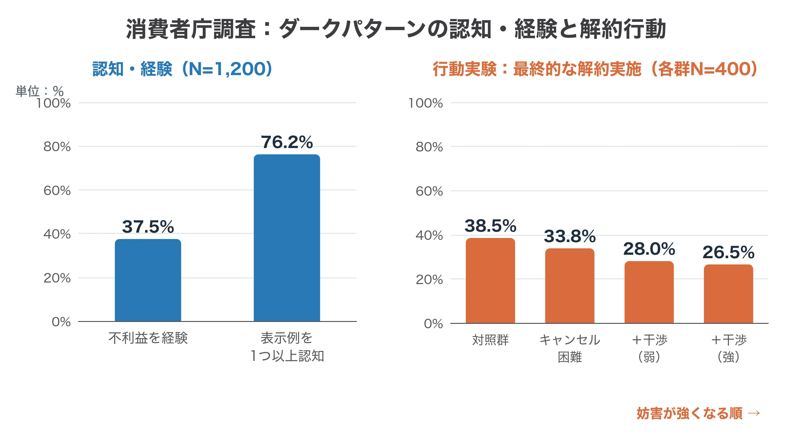
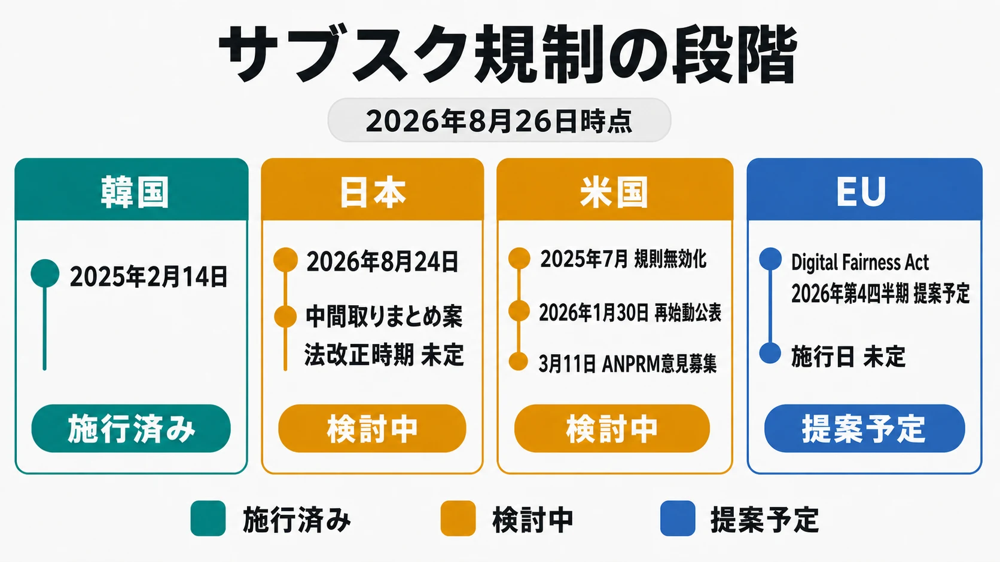
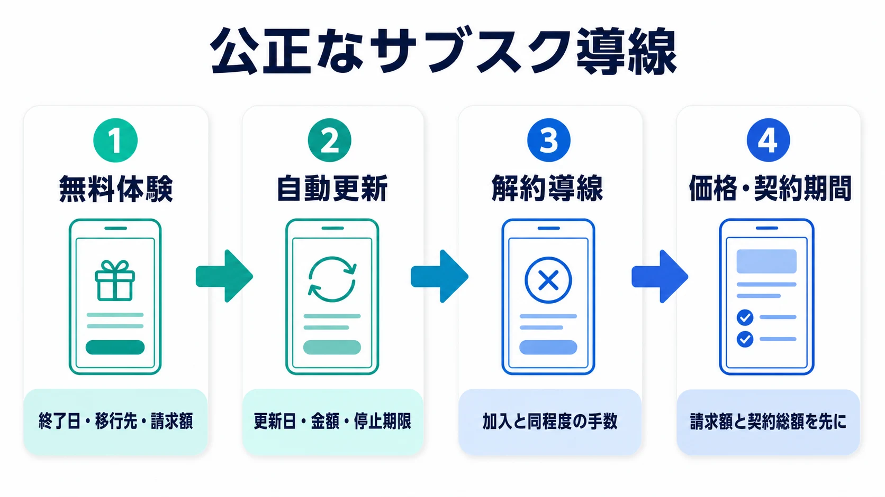

# ゲームアプリのサブスクとダークパターン――炎上事例・国内外規制から設計指針を考える

> **注意：** 本稿は法的助言ではありません。表示の適法性は、販売主体、決済経路、対象地域、画面遷移、表示時点、契約条件によって変わります。個別サービスの設計については、画面と遷移を含む証拠をそろえて法務へ確認してください。また、本稿の制度・事例は2026年8月26日時点の情報に基づいています。

2026年8月25日、AIチャットRPGアプリ『RyzaChat:AI ライザと創るあなただけのひと夏の夢物語』が国内で正式配信された。運営主体はSpiralAIであり、コーエーテクモゲームスから『ライザのアトリエ』のライセンスを受けて開発されたアプリである。配信直後から、3日間の無料トライアル後に年額6,000円のプランへ移行する仕組み、サブスクに含まれる会話回数、追加トークン課金をめぐって、「課金圧が強い」という反応がXやApp Storeへ広がった。[[1](#ref-1)][[2](#ref-2)][[3](#ref-3)]

その約2か月前には、動画配信サービスDAZNの「DAZN Soccer」が炎上している。最初の3か月は月980円という表示が目立つ一方、実際には12か月の契約で、4か月目以降は月2,600円、総支払額は26,340円となる。SNS上で「月額プランだと思った」「ダークパターンではないか」という批判が拡散し、DAZNは謝罪、対象者への返金等、新規受付停止へ段階的に対応した。消費者庁長官の会見でも、SNSで注目された個別事案として質問が出るまでになった。[[4](#ref-4)][[5](#ref-5)][[6](#ref-6)]

二つの事例の事実関係と企業対応は同じではない。RyzaChat:AIについて、公開情報だけから違法性やダークパターン該当性を断定することはできない。一方、両者は、 **契約条件が規約のどこかに書かれているだけでは、購入画面で生じた認識とのずれを防げない** ことを示している。強いゲームIPは購入への関心を高めるが、価格設計への不信も同じIPへ返ってくる。サブスクのUIは決済機能ではなく、運営会社、ライセンサー、作品への信頼を扱うゲーム仕様なのである。

日本法全般の入口は[ゲームプランナーが知っておくべき法令ガイド](game-planner-japanese-law-guide.md)が扱っている。本稿は、その特定商取引法の概説から一歩進み、サブスクで起きるダークパターンの類型、国内外の規制段階、具体的な画面・導線の設計基準に範囲を絞る。

***

## ダークパターンとは

ダークパターンとは、Webサイトやアプリの画面・文言・操作手順を使い、利用者が十分に理解して自由に選ぶことを妨げ、事業者に有利な行動へ誘導する設計の総称である。例えば、本来は年額契約なのに月換算額だけを大きく見せる、加入ボタンは目立たせる一方で拒否ボタンを背景へ溶け込ませる、登録より解約だけを何段階も複雑にするといった設計が該当しうる。OECDは、こうした手法を、消費者の自律性や意思決定を損ない、本人の利益に反する選択へ誘導・操作しうる商慣行として整理している。[[7](#ref-7)]

一般的な販売促進や使いやすいUIとの違いは、 **誰のために迷いを減らしているか** に現れる。購入ボタンを見つけやすくすること自体は、利用者が内容を理解したうえで購入したいなら、操作を助ける設計である。ところが、契約期間や総額を理解するための情報だけを弱くし、加入しない選択や解約する選択へ余分な手間を課すと、事業者に都合のよい方向へ判断を偏らせる設計になる。

ダークパターンは、悪意のあるデザイナーが作った露骨な罠だけを指す言葉でもない。購入率や継続率だけを改善指標にして、拒否率、誤購入、返金、解約失敗を品質指標から外すと、個々の担当者に欺く意図がなくても、画面は少しずつ非対称になる。利用者から見れば、制作側の意図よりも、重要な条件を理解できたか、断る選択肢が実質的に使えたか、後から無理なく解約できたかが問題になる。

現時点の日本では、「ダークパターン」という語に一つの法令上の確定的な定義があるわけではなく、すべての類型が一律に違法になるわけでもない。手法や表示内容に応じて、特定商取引法、景品表示法、消費者契約法など既存法との関係が判断される。消費者庁の2026年調査も、ダークパターンは多種多様で完全な分類が難しいという前提を置いている。[[6](#ref-6)][[8](#ref-8)]

プランナーが企画段階で確かめるべき問いは、次の三つである。

1. **理解できるか**：価格、期間、自動更新、利用上限、解約条件が、決定する前に同じ画面で読めるか
2. **自由に断れるか**：加入と拒否、継続と解約の選択肢に、視認性や操作量の不自然な差がないか
3. **後から変えられるか**：一度加入しても、加入時と釣り合う手間で契約を確認・解約できるか

この三点のどれかを、文言、色、配置、画面数、感情的な圧力で弱める設計が、ダークパターンとして問題視されやすい。次節では、その「選ばせ方」をサブスクで頻出するUIパターンへ分解する。

***

## ダークパターンは「情報の有無」より選択のさせ方に現れる

ダークパターンを見分けるときは、重要な情報がページのどこかに存在するかだけでは足りない。その情報が、利用者の判断に間に合う場所へ、ほかの選択肢と釣り合う強さで示されているかを見る必要がある。

自動更新、年額割引、継続確認のポップアップは、それだけでダークパターンになるわけではない。問題は、重要情報を弱くし、拒否側の操作コストだけを上げ、感情や疲労を使って同意へ押すという **選択肢間の非対称** にある。ゲームアプリのサブスクで頻出する形を、画面仕様へ翻訳すると次のようになる。

| 類型 | 具体的なUIパターン | プレイヤーに生じる誤認・負担 | 公正な設計への置き換え |
|---|---|---|---|
| 無料体験から有料への自動移行 | 「3日間無料」を最大表示し、移行先の年額・請求日を脚注へ置く | 無料期間だけの申込み、または月契約だと受け取る | 有料移行日、移行先プラン、初回請求額、更新周期を確定ボタンの近くへ同じ視認性で置く |
| 視認性の操作 | 「続ける」は高彩度・全幅、「今はしない」は背景同化・小さい文字にする | 拒否できることに気づかず、推奨と必須を混同する | 同意・拒否を隣接させ、文字サイズ、コントラスト、タップ領域を同等にする |
| 総額・契約期間の不明瞭化 | 月換算額だけを大きく見せ、12か月拘束や総額を離れた場所へ置く | 月単位で解約できる、表示額だけ払えばよいと考える | 「年額6,000円を一括請求」「12か月総額26,340円」のように契約単位と支払総額を主表示にする |
| confirmshaming | 「特典を捨てる」「ライザを悲しませる」など、拒否へ罪悪感を付ける | 条件ではなくキャラクターへの感情で判断させられる | 「無料体験を利用しない」「現在のプランを続ける」など結果を中立に書く |
| ローチモーテル型 | 登録はアプリ内1画面、解約は外部ヘルプ、複数階層、電話・チャット待ちを要求する | 方法が分からない、途中で諦める、期限を越える | 設定から現在の契約と解約入口へ直達させ、加入時と同程度の手数で完了させる |

「規約へリンクした」「ストア決済が最終確認を出す」という説明だけでは、最初の比較画面が与えた印象は消えない。プランナーは単一画面ではなく、広告、ストア説明、ゲーム内オファー、OS決済シート、契約後の管理画面、解約完了までを一つの導線として設計する必要がある。

***

## ケース1：RyzaChat:AI――IPへの期待と購入条件が同時に評価された

RyzaChat:AIは、キャラクターとの会話を軸に探索、採集、調合、戦闘を進めるAIチャットRPGである。公式利用規約は、サービスの運営主体をSpiralAIとし、サブスクは期間終了24時間前までに自動更新を止めなければ更新されること、アプリやアカウントの削除だけでは解約にならず、iOSまたはAndroidのサブスクリプション管理画面で停止することを定めている。サブスクには一定数のテキスト会話の無料枠が含まれ、それを超える会話には追加購入するトークンが使われる。新たに有償トークンを買うにはサブスク加入が必要である。[[9](#ref-9)]

特定商取引法に基づく表記は、無料トライアルがある場合、終了までに解約しなければ有料契約へ移行することを説明している。実際の配信時には、3日間の無料トライアルから12か月プランへ移行し、年額6,000円が自動請求される購入条件が確認された。月額プランは980円で、サブスクのテキスト会話無料枠は10日ごとに15回分、すなわち毎月45回相当と案内された。[[2](#ref-2)][[10](#ref-10)]

配信初日の8月25日、料金画面の画像とともに「課金圧が強い」「加入しても会話枠が少ない」という反応がXで拡散し、ITmedia NEWSも同日中に報じた。App Storeのレビューでも、無料で主要な会話を試しにくいこと、サブスクに加えて会話トークンが必要になることへの不満が投稿された。ここでは価格の高さそのものと、契約画面の公正さを分けて考える必要がある。高い価格、少ない無料枠、追加従量課金は商品設計への評価である。対して、無料体験から年額契約へ移る条件や、拒否ボタンの視認性は、意思決定を歪めるUIかという評価である。[[1](#ref-1)][[3](#ref-3)]

2026年8月26日時点で、公式サイトと公式Xから、料金表示への批判を受けた謝罪、購入画面の変更、返金方針の発表は確認できない。したがって「企業が問題を認めた」とは書けない。確認できる対応は、公開済みの利用規約と特定商取引法表示で、自動更新とOS側での解約方法を説明していることまでである。 **規約上の説明があることと、購入時の選択設計が十分に公正であることは別の評価軸** だと理解すべきである。

IP案件では責任分界も重要になる。サービス運営と決済UIを作る会社、IPを許諾する会社、ストアを運営する会社は別々でも、プレイヤーはキャラクター名を中心に体験を記憶する。ライセンス契約と監修項目に、シナリオやビジュアルだけでなく、価格比較画面、無料体験、更新、解約、返金告知を含めるべき理由がここにある。

***

## ケース2：DAZN――「980円」の強調から新規受付停止まで

DAZN Soccerの問題は、表示、SNS拡散、初動、追加対応が短期間に連鎖した事例である。

| 日付 | 表示・反応・企業対応 |
|---|---|
| 2026年5月30日〜6月11日20時 | DAZNが後に、一部に「月額プランと受け取れる記載」があったと認めた期間 |
| 6月11日〜12日 | 「980円」が強く見える一方、12か月契約と総額26,340円が分かりにくいとして、画面画像と批判がXで拡散 |
| 6月13日 | DAZNが謝罪。対象期間の加入者へ個別に解約・返金、またはDAZN Standard月額プランへの変更を案内 |
| 6月15日 | 表示と救済対象が限定的だとしてSNS上の批判が継続したと報道された |
| 6月18日 | DAZNが契約期間、料金、解約条件の案内に分かりにくい点があったとして、新規受付を停止。販売開始から停止までの加入者全体へ選択肢を拡大 |
| 6月30日 | 特別対応の受付を終了し、7月1日に公式ページを更新 |

問題となったプランは、最初の3か月が月980円、残り9か月が月2,600円であり、総額は `980円 × 3か月 + 2,600円 × 9か月 = 26,340円` となる。月ごとに支払うことと、月ごとに解約できることは同じではない。「月々払い」という決済間隔が「月間プラン」という契約期間に見える画面では、プランナーが内部で正しく用語を使っていても誤認は起こる。[[4](#ref-4)][[5](#ref-5)]

初動の対象を狭く定義したことで、謝罪後も「現在の表示も月980円に見える」「対象期間外は救済されないのか」という投稿が続いた。6月18日の追加対応では、DAZNは新規受付を止め、対象者へ、解約と直近1か月分の返金、DAZN Standard月額プランへの変更、現在の年間契約の継続という三つの選択肢を示した。[[4](#ref-4)][[5](#ref-5)]

同日の消費者庁長官会見では、記者がDAZNを名指しし、景品表示法や特定商取引法との関係、相談、行政対応を質問した。長官は個別事案への回答を控え、違反認定をしていない。そのうえで一般論として、虚偽・誇大広告や意に反する申込みは現行法の対象になりうること、無料・割引期間だけでなく解約条件と方法を確認すること、アプリ削除だけでは契約が終わらないことを説明した。[[6](#ref-6)]

この線引きは記事を読むうえでも重要である。SNSで「ダークパターン」と呼ばれたこと、企業が分かりにくい表示を認めたこと、行政が違法と認定したことは、それぞれ別の事実である。

***

## 「経験者37%」は何を数えた数字か

消費者庁が2026年6月に公表した調査では、オンラインショッピングを利用した1,200人に、過去1年間にダークパターンによる不利益を経験したかを尋ねた。少なくとも一つ経験した回答者は **37.5%** であり、28の表示例のうち少なくとも一つを見たことがある回答者は76.2%だった。よく紹介される「経験者37%」は、この37.5%を丸めた表現である。日本人全体の37.5%でも、すべての回答者が意図しない契約をした割合でもない。[[8](#ref-8)]

同調査は別の1,600人を対象に、架空の動画配信サブスクで契約と解約を試す行動実験も行った。解約妨害がない画面で解約した割合は38.5%であり、妨害を強めた条件では33.8%、28.0%、26.5%へ下がる傾向が出た。調査自身が、架空サイト、限られた選択肢、実験上の報酬などの制約を明記しているため、この差をそのまま実サービスの解約率へ当てはめることはできない。それでも、ボタンの視認性、継続確認、繰り返し妨害を重ねるほど、意思決定が変わりうるという設計上の警告になる。[[8](#ref-8)][[11](#ref-11)]

***

## 日本：最終確認画面の規制から、横断的な規律の検討へ

### 2022年改正ですでに必要なこと

2022年6月1日に施行された改正特定商取引法は、通信販売の申込みにおける最終確認画面で、分量、販売価格・対価、支払時期・方法、引渡し・提供時期、申込期間、撤回・解除に関する事項を直ちに確認できるよう表示することを求めた。必要事項を表示しない、または誤認させる表示によって申し込んだ場合には、取消しが認められることがある。[[12](#ref-12)]

サブスクでは、無料から有料へ切り替わる時期と金額、各回の請求額、契約期間、総額、更新条件、解約方法が最終確定の前に読めなければならない。これは2026年の新しい議論を待つ話ではない。既存法の段階ですでに、確定直前の画面を広告バナーの延長として作るべきではないのである。

### 2026年8月の中間取りまとめ案

消費者庁の「デジタル取引・特定商取引法等に関する検討会」は、2026年8月24日の第8回会合で中間取りまとめ案を示した。これは **会合資料の案であり、成立した法律ではない**。具体的な法改正の提出時期、成立時期、施行時期も同案には明記されていない。[[13](#ref-13)]

案が示す方向は、個別のボタン色を法律へ列挙する方式ではない。まず、消費者の誤認を招く手法と、迷惑・不安を覚えさせて望まない申込み等を迫る手法を中心に、広い規律を法律で置く。そのうえで、対象となる具体的手法、判断基準、禁止例と適切な表示例を下位規範やガイドラインで明確にする二層構造である。confirmshamingや繰り返しポップアップは、後者の「迷惑・不安」側から検討対象になりうる。総支払額、契約期間、解約方法の分離・不明瞭化は、誤認側の中心論点になる。[[13](#ref-13)]

中間取りまとめ案はダークパターンだけを扱うものではない。SNS上の広告からチャットへ移し、双方向のやり取りで不意打ち的に契約を迫る勧誘について、電話勧誘販売に近い規律を検討する。また、行政処分後も不当な広告や勧誘が残る場合に、取引プラットフォーム、広告プラットフォーム、SNSへ、表示の削除やアカウント停止・削除を要請する法的根拠も提案している。[[13](#ref-13)]

ゲーム運営に置き換えると、公式Xの投稿、インフルエンサー施策、DMやチャットサポート、ゲーム内購入画面を別部署の成果物として切り離せなくなる。入口の訴求と最終条件が一致し、途中の対話が断りにくさを作らず、問題発生時に広告素材を速やかに止められる運用までが一つの設計対象である。

***

## 海外比較：同じ方向を向いていても、規制段階は違う

| 地域 | 2026年8月時点の段階 | サブスク設計で注目する点 |
|---|---|---|
| 韓国 | 2025年2月14日施行済み | 無料から有料への転換、値上げ前の同意、隠れた更新、解約妨害などを具体化 |
| 日本 | 中間取りまとめ案を検討中 | 大枠の横断規律とガイドライン、最終確認画面の拡充、SNS勧誘・プラットフォーム対応 |
| 米国 | 連邦規則が無効化され、再規則制定中 | 明確な開示、明示的同意、加入と同程度に簡単な解約を再検討 |
| EU | Digital Fairness Actの提案準備中 | ダークパターン、依存を促す設計、不公正なパーソナライズ、デジタル契約の解約・更新 |

### 米国：click-to-cancelは無効化後に再始動した

FTCは2024年、ネガティブ・オプション規則を改正し、重要条件の明確な開示、明示的な同意、申込みと同程度に簡単な解約を求める、いわゆるclick-to-cancel規則をまとめた。しかし第8巡回区控訴裁判所は2025年7月8日、FTCが必要な予備的規制分析を行わなかったという手続上の理由で改正規則を無効化した。裁判所が「簡単な解約は不要」と判断したわけではない。1973年の狭い規則へ戻った後も、FTC法5条やROSCAなどによる執行は残っている。[[14](#ref-14)]

FTCは2026年1月30日、ネガティブ・オプションに関する規則制定事前通知案を行政管理予算局へ提出したと公表し、再始動を明らかにした。3月11日にはANPRM（規則制定事前通知）を公表して意見募集を開始し、無効化された規則の一部を採り直す案を含めて検討している。したがって、1月30日は再始動の公表日、3月11日は公開の意見募集開始日と分けるのが正確である。[[15](#ref-15)][[16](#ref-16)]

### EU：法案提出は2026年第4四半期、施行日は未定

EUではDigital Services Actが、オンラインプラットフォームによる欺瞞的・操作的なインターフェースをすでに禁じている。一方、消費者法の適合性点検では、デジタル契約の解約・更新、ダークパターン、依存を促す設計、不公正なパーソナライズなどに残る課題が確認され、Digital Fairness Actの準備が進んでいる。[[17](#ref-17)][[18](#ref-18)]

欧州委員会の2026年作業計画と実施トラッカーでは、法案提出は2026年第4四半期の予定である。2026年8月26日時点では提案前であり、欧州議会・理事会での審議、採択、移行期間が残る。外部の制度追跡サイトには2028〜2030年ごろの施行・適用を想定する見込みもあるが、これは **推測であってEU公式の日程ではない**。公式に確認できるのは第4四半期の提案予定までであり、施行日と義務内容は今後の法案・審議で変わりうる。[[19](#ref-19)][[20](#ref-20)]

### 韓国：比較した4地域では最も先に施行済み

韓国では改正電子商取引法と下位規則が2025年2月14日に施行された。公正取引委員会は、新たに規律する類型として、隠れた更新、価格の段階的開示、誤った階層表示、事前選択、解約・撤回の妨害、繰り返し干渉などを示している。定期決済の金額を引き上げる場合や、無料サービスを有料へ転換する場合には、増額・転換前30日以内に消費者の同意を得て、取消し・解約の条件と方法を知らせる仕組みも導入された。[[21](#ref-21)][[22](#ref-22)]

韓国は、本稿で比較する日本、米国、EU、韓国のうち、具体的な改正法が最も早く施行された地域である。日本は中間取りまとめ案、米国は再規則制定、EUは提案準備であり、同じ「規制強化」という見出しでも実装期限の確度が違う。海外配信では、最も厳しい地域へ全世界のUIを合わせるか、地域別に画面を分けるかを早い段階で決める必要がある。

***

## ゲームプランナーの設計チェックリスト

法令名を暗記するより、購入前、契約中、解約時の仕様へ検査項目を埋め込むほうが実務に効く。次の確認表は、現行法だけでなく、各国で示されている規制強化を先取りするための基準である。

### 無料体験

- [ ] 「無料」の近くに、期間、終了日時、移行先プラン、初回請求額、請求周期を表示したか
- [ ] 月額プランと年額プランがある場合、無料体験後にどちらへ移るかを選択前から固定して見せたか
- [ ] 年額へ移る無料体験を、月額プランのカードや月換算額と組み合わせて誤認させていないか
- [ ] 無料体験を使わない選択肢が、背景へ溶けず、十分な大きさとコントラストを持つか
- [ ] 有料移行前の通知を、ストア任せにせずサービス側でも設計したか
- [ ] 無料中に解約しても期間末まで使えるのか、即時終了するのかを明示したか

### 自動更新

- [ ] 「自動更新あり」を規約リンクの中だけでなく、確定ボタンに隣接して表示したか
- [ ] 更新日、更新後の金額、更新される期間、停止期限を具体的な日付または計算可能な形で示したか
- [ ] 値上げや無料から有料への転換を、通知だけで済ませず、対象地域に応じて再同意できる状態にしたか
- [ ] プッシュ通知を拒否した人にも、メールやアプリ内受信箱など別の到達経路があるか
- [ ] 契約内容、同意時の画面版、表示価格、日時を監査可能な形で記録したか

### 解約導線

- [ ] ゲーム内の設定または購入管理から、現在の契約と解約方法へ直接到達できるか
- [ ] 登録より解約だけが多画面、多入力、営業時間依存になっていないか
- [ ] 「続ける」を繰り返し押させる妨害、同じ提案の再表示、不要なアンケート必須化をしていないか
- [ ] 解約ボタンと継続ボタンの文字サイズ、コントラスト、タップ領域が同等か
- [ ] 「特典を失います」の事実説明を超えて、キャラクターの悲しみや仲間への罪悪感で継続を迫っていないか
- [ ] アプリ削除、アカウント削除、サブスク解約の違いと、正しい順序を画面内で説明したか
- [ ] 完了画面と確認メールに、終了日、今後の請求、利用可能期間を明記したか

### 価格・契約期間

- [ ] 月換算額より、実際の請求額と契約総額を先に、または同等の強さで見せたか
- [ ] 「月々払い」と「月間プラン」、「年額一括」と「12か月契約」を別の概念として表記したか
- [ ] 割引前後の各期間、各期間の金額、合計を一つの画面で確認できるか
- [ ] サブスクに含まれる利用量と、追加課金が始まる条件を購入前に具体的な単位で示したか
- [ ] 広告、ストア、ゲーム内画面、FAQ、規約で、価格名、契約期間、解約条件が一致しているか
- [ ] ローカライズで「monthly」「per month」「annual paid monthly」を同じ「月額」に潰していないか

### リリース判定と運用

- [ ] 法務レビューへ静止画だけでなく、広告から解約完了までの動画または遷移図を渡したか
- [ ] 購入率だけでなく、誤購入申告、短期解約、返金、チャージバック、問い合わせ理由を品質指標にしたか
- [ ] A/Bテストで、拒否ボタンを弱くして購入率を上げる案を実験対象から除外したか
- [ ] IP許諾案件では、ライセンサーの監修範囲に料金、無料体験、自動更新、解約、謝罪・返金告知を含めたか
- [ ] 炎上時に、広告停止、購入導線停止、対象者抽出、返金、告知文更新を誰が判断するか決めたか
- [ ] 地域別規制の施行状態を四半期ごとに確認し、画面版と対応地域を更新できるか

このチェックリストの狙いは、すべてのボタンを同じ色にすることではない。プレイヤーが **契約しない選択、後でやめる選択、いくら払うかを理解する選択** を、収益化の邪魔として扱わないことである。公正な比較画面は短期の購入率を下げる場合があるが、誤購入、返金、サポート負荷、ストア評価、IP毀損を含む総コストを下げる。

***

## まとめ：規制を待つ設計から、規制を先取りする設計へ

RyzaChat:AIは、人気キャラクターとの会話体験が、配信初日からサブスク条件と一体で評価されることを示した。DAZNは、重要条件が画面のどこかに存在しても、価格の強調と契約期間の弱い表示が認識をずらし、初動の狭さが炎上を長引かせることを示した。どちらも、課金画面が法務の末端作業ではなく、商品の信頼を決める中核仕様であることを教えている。

日本では2022年改正特定商取引法がすでに最終確認画面を規律し、2026年8月の中間取りまとめ案は、誤認を招く設計と不安・迷惑で申込みを迫る設計を横断的に扱う方向を示した。韓国は施行済み、米国は規則を作り直し、EUは2026年第4四半期の法案提出を予定する。施行日はそろっていなくても、 **明確な総額、明示的な同意、容易な解約、対称な選択肢** という設計原則は収れんしている。

ゲームプランナーが待つべきなのは法令の施行日ではない。無料体験の出口、自動更新の通知、総額表示、解約完了までを、次のスプリントの受入条件へ入れるべきである。規制を先取りする設計とは、将来の罰則を恐れて画面を直すことではない。プレイヤーが理解して選び、その選択を後から変えられる状態を、最初からゲーム体験の品質として作ることである。

## References

1. [「まるでキャバクラ」――「ライザのアトリエ」主人公と話せるAIアプリに「課金圧強すぎ」の声][1] - 運営・ライセンス関係、配信初日のX上の反応、3日間の無料体験、年額移行、会話枠と追加トークンを確認できるITmedia NEWSの報道。

2. [『ライザチャットAI』本日（8/25）正式リリース！][2] - 2026年8月25日の正式配信、月額・年額プラン、無料体験後の年額請求、会話枠を掲載する電撃オンラインの記事。

3. [RyzaChat:AI 評価とレビュー][3] - 配信直後の課金・会話枠に対する利用者投稿を掲載するApp Storeのレビュー一覧。評価値と件数は変動するため本文では使用していない。

4. [[7月1日更新情報] DAZN Soccer][4] - 問題があった表示期間、謝罪、新規受付停止、対象者の解約・返金・プラン変更・継続の選択肢を掲載するDAZN公式案内。

5. [DAZN「月980円」問題、謝罪も炎上続く][5] - 料金表示、年間契約、総額、X上で批判が続いた経緯、初期対応の対象範囲を記録したITmedia NEWSの報道。

6. [堀井消費者庁長官記者会見要旨（2026年6月18日）][6] - DAZNに関する質疑、個別事案への回答留保、現行法の一般論、サブスク契約時の注意を収録する消費者庁資料。

7. [OECD: Dark commercial patterns][7] - ダーク・コマーシャル・パターンの作業定義、類型、被害、政策対応をまとめたOECD Digital Economy Papers No.336。

8. [ダークパターンに関する消費者意識調査 概要][8] - 1,200人の認知・経験調査と1,600人の行動実験の対象、37.5%、76.2%、実験結果の要点を示す消費者庁資料。

9. [RyzaChat:AI 利用規約][9] - 運営主体、自動更新、OS側での解約、会話枠、有償トークンとサブスクの関係を定める公式規約。

10. [RyzaChat:AI 特定商取引法に基づく表記][10] - 販売主体、無料トライアルから有料契約への移行、決済時期、解約方法を掲載する公式表示。

11. [ダークパターンに関する消費者意識調査 報告書][11] - 契約・解約行動実験の条件、各群の解約割合、調査上の制約を収録する消費者庁の全報告書。

12. [通信販売の申込み段階における表示についてのガイドライン][12] - 2022年6月1日施行の改正特定商取引法に基づく最終確認画面の表示事項と誤認表示を説明する消費者庁資料。

13. [デジタル取引・特定商取引法等に関する検討会 中間取りまとめ（案）][13] - ダークパターンの大枠規律と具体化、SNS上の勧誘、プラットフォームへの削除等の要請制度を提案する2026年8月24日の会合資料。

14. [FTC Advance Notice of Proposed Rulemaking Regarding Negative Option Marketing Practices][14] - 2025年7月8日の規則無効化の理由、残る法制度、再規則制定で検討する選択肢を説明するFTCのANPRM本文。

15. [FTC Submits Draft ANPRM Related to Negative Option Plans for OMB Review][15] - 2026年1月30日にANPRM案を行政管理予算局へ提出したことを公表するFTC発表。

16. [FTC Seeks Public Comment on Negative Option Rulemaking][16] - 2026年3月11日にANPRMを公表し、意見募集を始めたことを示すFTC発表。

17. [European Commission: Review of EU consumer law][17] - Digital Fairness Actが検討するダークパターン、依存を促す設計、不公正なパーソナライズ、デジタル契約等を示す欧州委員会資料。

18. [European Commission: Digital Services Act explained][18] - オンラインプラットフォームのダークパターン禁止を含むDigital Services Actの公式説明。

19. [European Commission Democracy implementation tracker][19] - Digital Fairness Actを2026年第4四半期の提案予定とする欧州委員会の進捗表。

20. [Digital Fairness Act Timeline][20] - 2028〜2030年を推測上の適用時期として示し、公式日程と分けている制度追跡サイト。

21. [韓国公正取引委員会：改正電子商取引法施行令・施行規則][21] - 2025年2月14日の施行と、新たに規律されるダークパターン類型を説明する公式発表。

22. [韓国政策ブリーフィング：オンライン・ダークパターン規制施行][22] - 無料から有料への転換や定期決済の値上げに関する同意など、施行内容を説明する韓国政府資料。

[1]: https://www.itmedia.co.jp/news/article/2608/25/2000000774/
[2]: https://dengekionline.com/article/202608/85461
[3]: https://apps.apple.com/jp/app/ryzachat-ai/id6763540981?platform=iphone&see-all=reviews
[4]: https://www.dazn.com/ja-JP/help/articles/36812568842525-7%E6%9C%881%E6%97%A5%E6%9B%B4%E6%96%B0%E6%83%85%E5%A0%B1
[5]: https://www.itmedia.co.jp/news/article/2606/15/1260615058/
[6]: https://www.caa.go.jp/notice/statement/horii/046660.html
[7]: https://www.oecd.org/en/publications/dark-commercial-patterns_44f5e846-en.html
[8]: https://www.caa.go.jp/policies/future/icprc/research_002/assets/caa_futurer_cms201_260618_02.pdf
[9]: https://ryzachat-ai.go-spiral.ai/terms
[10]: https://ryzachat-ai.go-spiral.ai/tokushoho
[11]: https://www.caa.go.jp/policies/future/icprc/research_002/assets/caa_futurer_cms201_260618_01.pdf
[12]: https://www.caa.go.jp/policies/policy/consumer_transaction/specified_commercial_transactions/assets/consumer_transaction_cms101_2401119_03.pdf
[13]: https://www.caa.go.jp/policies/policy/consumer_transaction/meeting_materials/assets/consumer_transaction_cms101_260824_03.pdf
[14]: https://www.ftc.gov/system/files/ftc_gov/pdf/p064202negativeoptionruleanprm.pdf
[15]: https://www.ftc.gov/news-events/news/press-releases/2026/01/ftc-submits-draft-anprm-related-negative-option-plans-omb-review
[16]: https://www.ftc.gov/news-events/news/press-releases/2026/03/ftc-seeks-public-comment-response-advance-notice-proposed-rulemaking-regarding-negative-option
[17]: https://commission.europa.eu/law/law-topic/consumer-protection-law/review-eu-consumer-law_en
[18]: https://commission.europa.eu/strategy-and-policy/priorities-2019-2024/europe-fit-digital-age/digital-services-act_en
[19]: https://commission.europa.eu/priorities-2024-2029/democracy-and-our-values/implementation-tracker_en
[20]: https://digitalfairnessact.com/historic-timeline
[21]: https://www.ftc.go.kr/www/selectBbsNttView.do?bordCd=3&key=12&nttSn=43795
[22]: https://www.korea.kr/news/policyNewsView.do?newsId=148939436

----

この文書は、Perplexity、Claude、OpenAI Codex の3つのAIの支援を受けて著述されたものです。引用画像を除き、MIT License にて提供されています。
