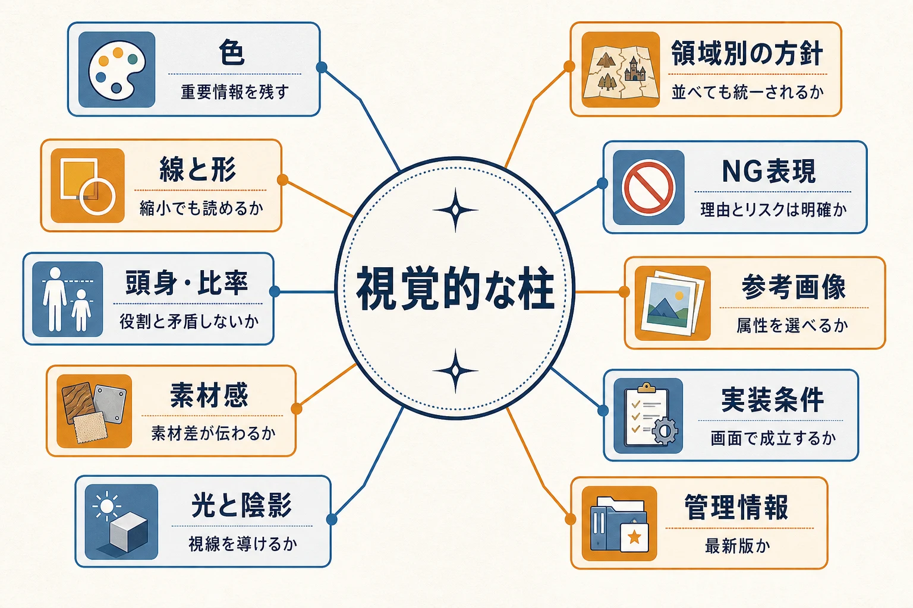
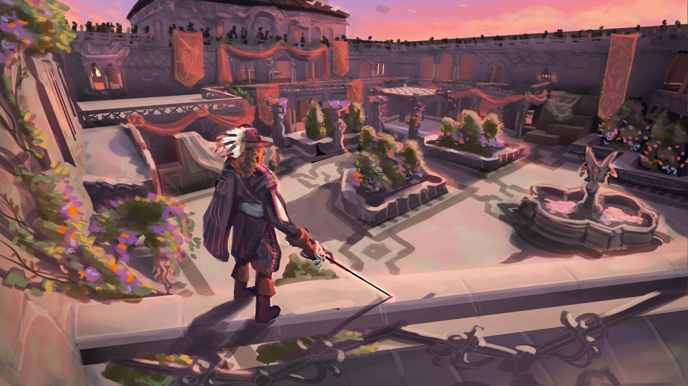
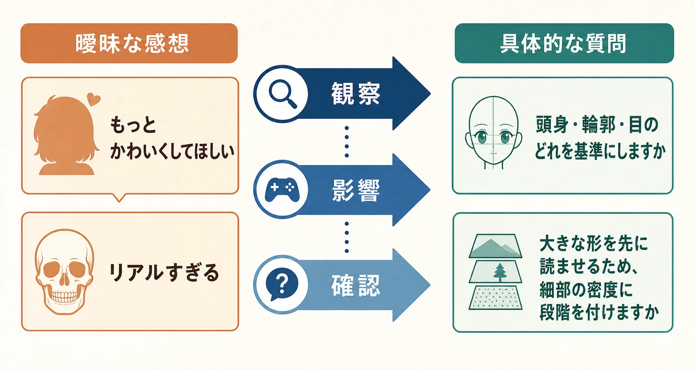

# ゲームのアートディレクション基礎――スタイルガイド・アートバイブルの役割
## 新人プランナーが「決める人」ではなく「関与し、使う人」として知っておくこと

> **用語注記：「世界観」という言葉について**
>
> 「世界観」（Weltanschauung）は本来、「ある人物がこの世界をどのように捉えているか」という哲学的な概念を指す言葉である。「創作物の舞台設定やデザインのまとまり」を指す用法は本来の語義からの転用であり、規範的には誤用とする立場もある（一方で、現在は主要な国語辞典がこの拡張義を採録している）。本稿では誤解を避けるため、一貫して **「世界設定」** という言葉を使用する。[[1](#ref-1)][[2](#ref-2)]

## はじめに

最初に、役割をはっきりさせておく。

スタイルガイドやアートバイブルを策定し、最終的な表現を決定するのは、多くの場合、ゲームディレクターやアートディレクターである。絵を描く専門教育を受けていない新人ゲームプランナーが、単独で絵柄を決めたり、アーティストへ最終的な修正を命じたりするものではない。

では、なぜプランナーが理解する必要があるのか。それは、ゲームのルール、画面上の情報、キャラクターの役割、報酬や導線といった企画上の意図が、アートと切り離せないからである。Riot Gamesも、ゲームのアートはゲームデザインと一体に機能しなければ、ゲーム体験が混乱したものになると説明している。[[3](#ref-3)]

プランナーの立場は、決定者ではなく **関与者・利用者** である。方向性を決める前の会議では、ゲーム上の目的や懸念を観察可能な言葉で伝える。方向性が決まった後は、その判断を個別の発注、制作中のレビュー、完成品の検収へ接続する。本稿では、そのために必要な最低限の見方と言葉を整理する。

***

## 1. スタイルガイドとアートバイブルは何のためにあるのか

### 呼び方には案件ごとの揺れがある

「スタイルガイド」と「アートバイブル」は、すべての会社や案件で同じ意味に使われているわけではない。

ある案件では、スタイルガイドを色、線、形、質感などの実務ルールをまとめた短い資料として扱う。別の案件では、アートバイブルの中に、作品の視覚的な狙い、参考画像、キャラクター・背景・UI・エフェクトの方針、制作上の注意、禁止例まで収録する。逆に、アートバイブルという名前でも、実態は数ページの発注用資料にとどまることがある。

したがって、名称だけで文書の権限や範囲を判断してはいけない。新人プランナーが確認すべきなのは、次の四点である。

- この文書は何を決める資料か
- どの制作物に適用されるか
- どの文書より優先されるか
- 更新と最終承認を誰が担当するか

文書の呼称より、適用範囲、版、決定者、更新者が明確であることの方が重要である。

### 目的1：新しく参加した人のオンボーディング

制作途中の案件には、後から参加するアーティスト、外部ベンダー、業務委託スタッフ、別部署の担当者がいる。そのたびに、既存メンバーが「この案件はこういう絵柄だ」と口頭で説明すると、説明する人によって内容が変わる。

スタイルガイドは、最初に読むべき共通資料として、最低限の前提を渡す役割を持つ。完成絵を何枚か見せるだけでは、「何をまねればよいのか」が分からない。色をまねるのか、形の単純化をまねるのか、光の方向をまねるのかを、注釈や比較例で示す必要がある。

### 目的2：複数の制作担当者やベンダーの間で一貫性を保つ

アートディレクターの仕事には、ゲームの視覚的なアイデンティティを形作り、維持し、スタイルガイドを伝え、制作物全体の一貫性を確認することが含まれる。Ubisoftのアートディレクター職の説明でも、視覚的な基準や参考資料を設定し、アート制作をレビューして統一された品質を保つ役割が示されている。[[4](#ref-4)]

これは、全員に同じ絵を描かせるという意味ではない。キャラクター担当と背景担当が別の解釈をしても、同じゲームの画面に並べたときに、色、線、形の単純化、素材の扱いが衝突しないようにするという意味である。

### 目的3：時間が経っても判断の軸を残す

開発が長期化すると、初期メンバーの記憶は薄れ、プロトタイプの都合で一時的な例外も増える。初期に決めた理由が失われると、後から参加した人は、例外を標準だと思うかもしれない。

ここで必要なのは、ガイドを一度作って保管することではない。更新日、変更点、変更理由、承認者を残し、実際の制作で生じた例外を反映することである。AppleのHuman Interface Guidelinesも、長期にわたって更新され、変更履歴を持つ「生きた文書」として説明されている。ゲーム用の資料と同一ではないが、ガイドラインを固定された初版ではなく、製品の変化に合わせて管理する考え方の参考になる。[[5](#ref-5)]

### 目的4：IPやブランドの核を保持する

ゲームの個別アセットは増えていくが、プレイヤーがそのゲームらしさとして受け取る要素には、一定の核がある。たとえば、色の温度、形の丸さ、陰影の強さ、装飾の密度、ユーモアの出し方、キャラクターと環境の距離感などである。

アートディレクションは、見た目だけを飾る作業ではない。作品が何を大切にし、プレイヤーにどう受け取ってほしいかを、各アセットの判断へ翻訳する作業である。Ubisoftはクリエイティブディレクションについて、ゲームの見た目、物語、体験を一つの目的へ集め、方針が変化しても共通の目標を明確に保つ仕事だと説明している。[[6](#ref-6)]

***

## 2. 一般的に記載される構成要素

案件によって構成は異なるが、スタイルガイドには次のような項目が入りやすい。プランナーは、項目を暗記するよりも、「この項目が制作上のどんな判断を支えるのか」を理解すればよい。

| 項目 | 記載する内容 | プランナーが確認する問い |
|:--|:--|:--|
| 視覚的な柱 | 明るい、重厚、親しみやすいなどの狙いと、その具体例 | その印象はゲーム上の役割や体験にどう関係するか |
| 色 | 使用色の範囲、色数、彩度、明度、アクセントカラー | 重要な情報に色を残し、画面全体で競合させていないか |
| 線と形 | 線の太さ、強弱、情報量、輪郭、形の単純化 | 縮小表示や動作中でも役割が読めるか |
| 頭身・比率 | 頭身、手足や頭部の比率、誇張する部位 | キャラクターの役割や年齢感が既存要素と矛盾しないか |
| 素材感 | 金属、布、木、皮膚、魔法的な物質などの差 | 素材の差が細部を拡大しなくても伝わるか |
| 光と陰影 | 光源、コントラスト、影の柔らかさ、演出上の例外 | プレイヤーが見るべき場所へ視線が向くか |
| 領域別の方針 | キャラクター、背景、武器、UI、エフェクトなどの個別ルール | 領域ごとの違いがあり、並べたときに一つの作品に見えるか |
| NG表現 | 避ける色、形、質感、モチーフ、誤読を招く表現 | 禁止の理由が目的やリスクと結び付いているか |
| 参考画像 | 採用する要素を注釈した画像、比較例、良い例・悪い例 | 画像全体ではなく、どの属性を参照するのか分かるか |
| 実装条件 | 表示距離、画面サイズ、カメラ、負荷、トリミング、アニメーション | アート上の狙いが実際のゲーム画面で成立するか |
| 管理情報 | 版、更新日、変更履歴、適用範囲、承認者 | 今見ている資料が最新で、判断の根拠として使えるか |


*図：スタイルガイドの構成要素を、暗記事項ではなく制作判断を支える地図として整理したもの。*

Unreal Engineが紹介する学生ゲームの制作事例でも、冒険らしさを伝えるためにドラマチックな光と夢のような色を選び、環境や小道具は認識しやすい形に整理し、テクスチャは素材の違いを示しながら画面の読みやすさを妨げない程度に抑えている。これは一つのゲームの事例にすぎないが、スタイルを「雰囲気」という一語で済ませず、光、色、形、質感、情報量へ分解する考え方を示している。[[7](#ref-7)]


*画像出典（引用）：[Explore En Garde! a 17th century, action-packed UE4 student game](https://www.unrealengine.com/tech-blog/explore-engarde-seventeenth-century-action-packed-ue4-student-game)（Unreal Engine公式Tech Blog）。Supinfogame Rubika（フランス）の学生チームによる En Garde! の環境コンセプトアート。*

### 参考画像は「完成形の命令」ではない

参考画像を貼るだけでは、解釈はそろわない。画像の横に、何を参照するのかを書くべきである。

たとえば「この画像のようにする」ではなく、次のように分解する。

- 色：全体は低彩度で、警告を示す色だけを高彩度にする
- 形：大きな外周を先に読み、細部は後から見る
- 光：顔よりも操作対象へ明るさを集める
- 素材：金属は硬い反射、布は広い明暗で表す
- 避ける：細い装飾線を全身へ均等に入れない

参考画像は一対一の模倣指示ではなく、視覚的な属性を共有するための材料である。

***

## 3. 決定前の議論で、新人プランナーができること

方向性検討、キックオフ、レビュー会議では、プランナーが絵の最終解を出す必要はない。ゲーム上の目的と、プレイヤーが受け取る情報について意見を出せばよい。

### 「好き嫌い」を「観察・影響・確認」に変える

「なんとなく違う」「もっとゲームらしく」「少し地味だ」と感じること自体は自然である。しかし、そのまま発言すると、アーティストには修正の手掛かりがない。次の順番へ変換する。

1. **観察** ：画面のどこに、何が見えているか
2. **影響** ：その状態が、プレイヤーの理解やゲーム上の目的にどう影響するか
3. **確認** ：どの方針を優先するか、決定者へ問う

たとえば、次のように言える。

> 現在は、武器、髪飾り、背景の看板がすべて高彩度で、縮小すると視線の起点が分かれています。戦闘中に役割を早く読ませたいなら、アクセントカラーを武器とUIに限定する方針でしょうか。それとも、背景の華やかさを優先しますか。

これは「色が嫌い」という発言ではない。色の分布を観察し、ゲーム上の読みやすさへの影響を示し、優先順位の判断をアートディレクターへ返している。


*図：曖昧な感想を、観察可能な要素とゲーム上の影響を経由して、判断を求める質問へ変換する流れ。*

### 実務で使える言語化の例

#### 「もっとかわいくしてほしい」

> 現在は頭身が約六頭身で、顎の角度と目の幅も現実寄りです。親しみやすさを優先するなら、頭部を大きくするのか、輪郭を丸くするのか、目の情報量を減らすのか、どの特徴を基準にしますか。

「かわいい」という評価語を、頭身、輪郭、目の大きさといった観察可能な要素へ分解している。

#### 「リアルすぎる」

> 金属の傷、布のしわ、肌の陰影が同じ密度で入っているため、遠距離では全体が細かい一つの塊に見えます。写実性を下げたいというより、役割を示す大きな形を先に読ませるため、細部の密度に段階を付けたいという懸念です。

「リアル」という言葉を、細部の密度と画面距離の問題へ置き換えている。

#### 「既存キャラクターと合っていない」

> 既存キャラクターは輪郭線が太く、影の境界が明確です。今回の案は輪郭線が細く、陰影も連続的なので、同じ画面に置くと新キャラクターだけが背景へ溶けやすいです。線と陰影のどちらを既存側へ寄せるか、方針を決めたいです。

「合っていない」を、線の太さ、陰影の境界、画面上の分離へ分解している。

#### 「この色は違う」

> 現在は味方を示す色と、危険を示す色が同じ赤系統です。戦闘中に敵味方を色だけで補助的に判別させる仕様があるため、色相を変えるか、明度や輪郭のルールを追加したいです。

ここでは好みではなく、ゲーム内の情報設計との衝突を伝えている。

### 質問の形で提案する

新人プランナーが避けたいのは、担当範囲を越えて「こう直してください」と断定することである。代わりに、次のような質問を使う。

- この特徴は、ゲーム内で何を読ませるために残していますか
- 画面を縮小したときにも、この情報は必要ですか
- このルールは必須条件ですか、それとも今回の案で試している表現ですか
- 既存のどのアセットを基準に比較すべきですか
- 今回決めるのは色までですか、それとも素材の表現は後工程に残しますか

質問は遠慮ではない。決定者が判断すべき論点を表に出し、プランナーが担当するゲーム上の条件を会議へ持ち込むための手段である。

### 会議後に残すべき記録

会議では、次の四つを区別して記録する。

- **決定** ：採用する方針と、決定者
- **保留** ：追加の比較や検証が必要な事項
- **例外** ：通常ルールから外れる理由と適用範囲
- **次の確認** ：誰が、どの制作物を、いつ確認するか

決定者がアートディレクターやディレクターであることを記録に残すのも重要である。後で意見が割れたとき、会議参加者の多数決や、最も声の大きい人の好みへ戻らずに済む。

***

## 4. 完成したスタイルガイドを発注で使う

スタイルガイドは、読了を報告する資料ではなく、日々の制作判断へ変換する道具である。

### 発注前は「全文を渡す」より「適用部分を抜き出す」

外部ベンダーや新しい担当者へ、分厚い資料をそのまま渡して終わりにすると、今回の発注に関係する条件が埋もれる。まず、発注するアセットに関係する章を抜き出し、次の形へ翻訳する。

```
今回の目的：何をプレイヤーに読ませるアセットか
必須条件：外せない役割、形、色、設定、用途
狙う印象：スタイルガイドのどの方針を適用するか
避ける表現：NG例のうち今回に関係するもの
参考画像：参照する属性と、参照しない属性
確認段階：ラフ、線画、着彩、実装後のどこで何を見るか
決定者：最終承認を行う担当者
```

たとえば「低彩度で」とだけ書かない。「背景は低彩度、プレイヤーが操作する装置だけは高彩度のアクセント色、装置の輪郭は縮小表示でも読める大きさ」と、スタイルのルールを目的と用途へ接続する。

### 発注時は、必須・狙い・余地を分ける

スタイルガイドのすべてを同じ強さで指定してはいけない。発注書では次の三層に分けると、アーティストが判断しやすい。

- **必須** ：ゲーム上の役割、既存IPの記号、表示条件、決定済みの形や色
- **狙い** ：プレイヤーへ与えたい印象、視線誘導、素材の対比
- **余地** ：具体的な装飾、細部の配置、複数案を見たい部分

アートディレクターが認めた範囲で、作り手が解決方法を提案できる余地を残す。ガイドに従うことは、すべての線や装飾を発注側が指定することではない。

### レビュー時は、三つの層で見る

納品物のレビューでは、いきなり「絵として好きか」を判定しない。次の順番で確認すると、指摘が整理される。

#### 1. ゲーム上の役割

そのアセットが何で、どの場面で、どの距離から見られるのかを確認する。味方と敵、通常報酬と特別報酬、操作対象と背景などの区別が読めるかを見る。

#### 2. スタイルの適用

色数、彩度、線の情報量、プロポーション、素材、光と陰影が、該当するガイドの章と整合しているかを見る。比較対象は、直前に作られた絵だけでなく、アートディレクターが基準として承認した代表アセットにする。

#### 3. 実装と運用

ゲーム内のカメラ、縮小表示、暗い背景、動作中、複数アセットを並べた状態で成立するかを見る。スタイル上は正しくても、UIに重なって読めない、アニメーションで形が潰れる、画面の負荷条件を満たさないということはある。

指摘は、次のテンプレートで書くとよい。

```
対象：どのアセットの、どの箇所か
基準：スタイルガイドのどの章・例か
観察：現状で何が見えているか
影響：ゲーム上、どんな誤読や不具合につながるか
優先度：必須修正／優先修正／検討事項
確認：修正後に、何が読めれば完了か
```

「ガイド違反」と断定する前に、意図的な例外として承認されていないかを確認する。例外なら、例外の理由、適用範囲、承認者を記録へ戻す。スタイルガイドは機械的な採点表ではなく、共通の判断軸だからである。

***

## 5. 機能しないスタイルガイドと、問題を見つけたときの伝え方

### 曖昧すぎる：形容詞だけで終わっている

「スタイリッシュ」「温かい」「重厚」「ゲームらしい」といった言葉だけで、比較画像も観察基準もないケースである。人によって意味が変わるため、アーティストは自分の経験から補うしかない。

新人プランナーがすることは、ガイドを勝手に書き換えることではない。まず、実際の発注やレビューで起きた事実を集める。

> 「『親しみやすい』という方針を適用したが、担当者ごとに頭身、輪郭、色のどれを変えるかが分かれました。代表例を二つ置き、親しみやすさを判断する特徴を決めたいです。アートディレクターに基準追加を相談できますか」

このように、曖昧さ、発生した差、影響、相談したい決定を伝える。

### 初版のまま更新されない：現行アセットと矛盾する

開発が進むと、初版にはなかった表現が正式採用されることがある。しかし、ガイドが更新されなければ、新しい担当者はどちらを信じるべきか分からない。

報告するときは、矛盾するアセットを一つだけ挙げず、次のようにまとめる。

- どの章のどのルールと、どの現行アセットが食い違うか
- その結果、発注者やベンダーがどの判断で迷ったか
- 今後も同じ表現を使う予定があるか
- 変更するなら、誰が承認し、いつ版を更新するか

> 「第2版では金属の反射を鋭くする方針ですが、直近で承認された武器3点は広い明暗で表現されています。今後の武器発注で判断が分かれそうです。現行武器を基準へ昇格するのか、例外として扱うのかをアートディレクターに確認し、次版の更新担当も決めたいです」

### 逆に細かすぎる：すべてを固定し、提案の余地がない

禁止事項、色番号、装飾位置、線の太さ、例外条件が増えすぎると、ガイドは読めても判断には使えなくなる。個別アセットの仕様書と、作品全体の原則が混ざっている状態である。

この場合は、「削除してください」とすぐに書き換えるのではなく、次の分離を提案する。

- 作品全体に関わる核：アートバイブルや上位ガイドへ残す
- 領域に共通するルール：キャラクター、背景、UIなどの章へまとめる
- 一つのアセットだけの仕様：個別発注書や制作仕様へ移す
- 試行中の案：検証中の資料として版を分ける

> 「この章に、特定キャラクターだけの装飾位置と全キャラクター共通の輪郭ルールが混在しています。新規キャラクターの発注時に、どこまで必須か判定しづらいです。共通ルールと個別仕様を分け、上位ガイドには判断原則だけを残す構成を相談したいです」

### 問題を伝える相手と順番

スタイルガイドの問題は、原則として、その場のアーティスト一人へ直接修正を押し付けるのではなく、ガイドの所有者へ伝える。一般的には、アートディレクター、アートリード、ゲームディレクター、またはプロジェクトで定めたアート資料の管理担当者である。

伝える順番は次の形が扱いやすい。

1. 現物と発生条件を示す
2. ガイドのどの記載と関係するかを示す
3. 制作、レビュー、プレイヤー理解への影響を示す
4. 判断してほしい選択肢を示す
5. 決定後に更新すべき資料と担当者を確認する

新人プランナーが自分で追記したローカル版を配り始めると、正式版との二重管理が発生する。自分で発見したメモは、会議資料や課題管理へ残してよいが、正式なルールへの変更は決定者の承認と版管理を経て行うべきである。

***

## 6. 新人プランナー向けの最小チェックリスト

最後に、スタイルガイドを読むとき、発注するとき、レビューするときの確認項目をまとめる。

### 読むとき

- 文書名ではなく、版、適用範囲、決定者、更新者を確認したか
- 抽象語に、画像や具体例が付いているか
- 必須条件、狙い、許容される余地が分かれているか
- NG表現に、避ける理由が書かれているか
- 実装時の表示距離や画面条件まで考慮されているか

### 発注するとき

- 今回のアセットで、プレイヤーに何を読ませるか書いたか
- 関係する章だけを抜き出し、発注条件へ変換したか
- 参考画像のどの属性を見るか注釈したか
- 既存の基準アセットを指定したか
- 最終決定者と、途中レビューの確認者を明記したか

### レビューするとき

- まず役割と読みやすさを確認したか
- 次に色、線、形、素材、光などの適用を確認したか
- 実際のカメラ、縮小表示、動作中でも成立するか見たか
- 好みの指摘と、目的・設定・実装に関わる指摘を分けたか
- 例外を見つけたとき、承認者と記録の所在を確認したか

***

## まとめ

スタイルガイドやアートバイブルは、絵の上手さを採点するための規則集ではない。新しい参加者へ前提を渡し、複数の制作担当者の判断をそろえ、時間が経っても作品の核を保持し、ゲーム上の目的を視覚表現へ翻訳するための共有基盤である。

ただし、その基盤を決定するのは、多くの場合、ディレクターやアートディレクターである。新人プランナーが担うのは、絵柄の最終決定ではない。決定前には、色、形、密度、距離、明暗、誤読といった観察可能な言葉で、ゲーム上の目的と懸念を伝える。決定後には、ガイドを発注条件とレビュー基準へ変換し、例外や矛盾を所有者へ返す。

「もっとよくしてほしい」という感想を、どこで、何が、どの目的を妨げているのかへ翻訳できれば、絵を描けなくてもアートディレクションへ有効に関与できる。プランナーに必要なのは、決定者の代わりに絵を決めることではなく、ゲームの意図が制作とレビューの場で失われないように、判断をつなぐことである。

## References

<a id="ref-1"></a>1. [「世界観」の誤用が気になる｜さかもと五度 - note][1] - 「世界観」の誤用について。「世界観」という言葉が誤用されるようになって久しいという見解を紹介している。

<a id="ref-2"></a>2. [翻訳における「ゲームの世界観」をどう表現するのか問題][2] - 「ゲームの世界観」という用語の扱いと、翻訳上の問題を論じている。

<a id="ref-3"></a>3. [Game Design｜Riot Games][3] - ゲームのアートとゲームデザインを一体の体験として扱う必要性を説明している。

<a id="ref-4"></a>4. [Art Director — Art Team｜Ubisoft Careers][4] - アートディレクターが視覚的なアイデンティティ、スタイルガイド、制作基準、品質レビュー、一貫性を担うことを示している。

<a id="ref-5"></a>5. [Meet the new Human Interface Guidelines｜Apple Developer][5] - ガイドラインを更新履歴を持つ「生きた文書」として管理する考え方を示している。

<a id="ref-6"></a>6. [Creative Direction｜Ubisoft][6] - ゲームの見た目、物語、体験を共通の目的へまとめ、方針の変化に対して目標を明確に保つ考え方を説明している。

<a id="ref-7"></a>7. [Explore En Garde! a 17th century, action-packed UE4 student game｜Unreal Engine][7] - スタイル方針を光、色、形、質感、キャラクターの単純化、画面の読みやすさへ具体化した制作事例を紹介している。

[1]: https://note.com/sakamoto444/n/n564e428706fd
[2]: https://www.trivector.co.jp/contents/?p=2801
[3]: https://www.riotgames.com/en/artedu/game-design
[4]: https://www.ubisoft.com/en-us/company/careers/search/744000109660515-art-director-art-team-
[5]: https://developer.apple.com/news/?id=v8a3aetj
[6]: https://www.ubisoft.com/en-us/company/careers/our-jobs/design-creative-direction/creative-direction
[7]: https://www.unrealengine.com/tech-blog/explore-engarde-seventeenth-century-action-packed-ue4-student-game

----

この文書は、Perplexity、Claude、OpenAI Codex の3つのAIの支援を受けて著述されたものです。引用画像を除き、MIT License にて提供されています。
