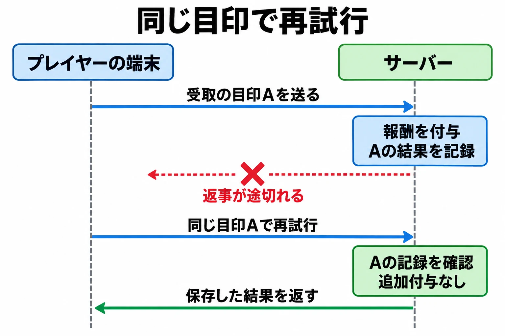

# 「受け取る」を一度だけにする――ゲームプランナーのための連打と通信再試行の話

報酬の受け取りボタンを押したが、画面が変わらない。押せていなかったのかと思い、もう一度押す。電車がトンネルに入り、購入結果が出る前に通信が切れる。ゲームを開き直して、アイテムが届いたか確かめる。

どちらも、普通のプレイヤーが経験しうる場面だ。ところが仕様書の「ボタンを押したら報酬を受け取る」「1日1回だけ引ける」という一行は、操作が一つずつ届き、結果が分かってから次へ進む場面だけを思い描きやすい。

実際には、考えておきたいことが二つある。

| 届き方 | 身近なきっかけ | 決めておくこと |
|---|---|---|
| 同じ操作がほぼ同時に届く | 反応を待たずにボタンを続けて押す | 同じ残高や受取権を、複数の処理が取り合ったらどうするか |
| 同じ操作が二度届く | 通信不良後の送り直しや、未完了の購入の再処理 | すでに済んだ操作だと、どう見分けるか |

本稿は「ゲームプランナーのためのコンピュータ科学」の第4回である。前回の[「いま何ができるか」を仕様にする](game-state-transitions-for-planners.md)では、通信切断やアプリの中断も、状態を変える出来事として扱った。今回はその先にある、 **操作が重なったり、もう一度届いたりしても、約束した回数だけ処理するための仕様** を考える。

***

## 1. 残高を確かめている間にも、次の操作が届く

ゲームの記録を管理するサーバーで、コインを使って抽選する場面を考えよう。画面では一瞬でも、裏側では「残高を読む」「足りているか確かめる」「残高を減らす」という段階がある。

以下は仕組みを説明するための架空の例だ。残高は100コイン、抽選1回の費用も100コインとする。本来なら、抽選できるのは1回だけである。

しかし、二つの操作A・Bが同じ残高を先に読み、それぞれ計算した残高を書き戻す作りでは、次のような順序が起こりうる。

| 時間の流れ | 操作Aの処理 | 操作Bの処理 | 保存されている残高 |
|---|---|---|---|
| 最初 | まだ処理していない | まだ処理していない | 100コイン |
| ↓ | 100コインと読む | — | 100コイン |
| ↓ | — | 100コインと読む | 100コイン |
| ↓ | 足りていると判断する | 足りていると判断する | 100コイン |
| ↓ | 読んだ100から100を引き、0を書き込む | — | 0コイン |
| ↓ | — | 先ほど読んだ100から100を引き、0を書き込む | 0コイン |
| 最後 | 抽選を1回実行する | 抽選を1回実行する | 0コイン |

残高は100から0へ減っただけなのに、抽選は2回通ってしまった。Bが使ったのは、Aが減らしたあとの残高ではなく、 **自分が先に読んでいた残高** である。

DeNAのエンジニアリングブログは、同時に届いた複数の操作が消費前のコイン数を確認し、1回分の消費のまま複数回のガチャを実行してしまう事例を紹介している。上の表は、その仕組みを単純化したものだ。[[1](#ref-1)]

### 同じ残高を扱う処理に、順番をつける

対策の一つは、同じ残高について「読んで、確かめて、書く」までを一まとめの処理（トランザクション）にし、その間は別の処理を待たせることだ。DeNAの記事も、データベースでこの区間を保護し、順番に処理する方法を示している。[[1](#ref-1)]

この例なら、Aが残高を0にするまでBを待たせる。Bはそのあと0を読み、残高不足として抽選へ進まない。全プレイヤーの操作を一列に並べるという意味ではなく、同じ残高など、取り合いになる記録を守る考え方である。

一まとめにしたうえで、ほかの処理が割り込めないようにする方法までエンジニアと確認したい。保存の理論は[データベースの基礎](database-basics-for-game-planners.md)に譲り、仕様書では「支払った回数と抽選の回数が一致する」といった、守るべき結果を明確にする。

報酬でも構造は同じだ。「まだ受け取っていない」と二つの処理が判断すれば、両方が渡してしまう余地がある。 **受取済みかの確認と、報酬の付与・受取済みの記録を、途中で食い違わない形にする** 必要がある。

***

## 2. 通信エラーは、結果が分からないこともある

次は、同時でなくても起きる問題だ。受け取り操作を送ってから、結果が画面に届くまでには往復の通信がある。

| 通信が切れた場面 | サーバー側の状況 | プレイヤーから見えること |
|---|---|---|
| 操作が届く前 | まだ報酬を渡していない | 結果が表示されない |
| 報酬を渡したあと、返事が届く前 | すでに報酬を渡している | 結果が表示されない |

画面の見え方が同じでも、裏側の結果は違う。送り直した操作を毎回新しい受け取りとして扱うと、後者では二重に渡すことになる。

そこで、通信が途切れたときには **「失敗が確定した」と「結果がまだ分からない」を分ける** 。結果不明のまま新しい購入を促すのではなく、元の操作の結果を確認し、必要なら同じ操作として送り直せるようにする。

### 購入は、途中から改めて処理される

Appleの開発者向け文書「Finishing a transaction」は、購入を記録し、購入した内容を渡す・利用可能にし、画面を更新してから、ストアの仕組みに取引の完了を伝えるよう求めている。未完了の取引は残り、アプリを起動した際にも処理できるようにする必要がある。[[2](#ref-2)] 別の文書でも、未完了の取引を取り出し、購入内容の提供などを行う仕組みが説明されている。[[3](#ref-3)]

この流れでは、アイテムを渡した直後、完了を伝える前にアプリが中断することも考える必要がある。再び同じ購入を処理するときには、付与済みの記録を確認し、二重に渡さず残りを完了できる作りが要る。

プレイヤー向けの案内にも、結果を確かめ直す導線がある。『Fate/Grand Order』の公式FAQは、購入した聖晶石が反映されない場合、Android端末では購入の完了を確認したうえで、ストアへ再度アクセスすると反映されることがあると案内している。その際、ストアの購入ボタンを押すと新しい購入になるため、押さずに戻るよう明記している。[[4](#ref-4)]

これは同作の内部処理を説明する資料ではない。仕様づくりで参考になるのは、 **元の購入の反映を確かめる操作と、追加購入する操作を、案内でも区別していること** だ。

***

## 3. 同じ操作には、同じ「合言葉」を付ける

送り直しへの対策として広く使われる考え方を、決済サービスStripeの文書で見てみよう。

Stripeは、操作ごとに重複しない「合言葉」（<ruby>冪等<rt>べきとう</rt></ruby>キー）を付ける方法を提供している。同じ合言葉で送り直した場合、保存された最初の結果を返すため、通信エラー後にも同じ操作を二重に実行せずに再試行できる。[[5](#ref-5)]

ここでいう合言葉は、秘密のパスワードではなく、操作を見分けるための目印だ。たとえば「今回の購入」と「次に行う別の購入」には別の目印を使い、「今回の購入の送り直し」には同じ目印を使う。

ゲームの報酬に置き換えるなら、サーバー側で「誰の、どの受け取りか」と結果を記録し、同じ受け取りが届いたら、その記録から結果を返す。 **届いた回数と、報酬を渡す回数を切り離す** のである。

この目印にも、扱いを決める必要がある。送り直すたびに新しい目印を付ければ、別の操作に見える。反対に、別の購入へ同じ目印を使い回すと、正当な次の購入を区別できない。

記録を残す期間も確認したい。Stripeでは一定期間を過ぎたキーを削除でき、削除後の再利用は新しい要求になる。また、同じキーで内容を変えるとエラーになり、実行開始前の入力エラーや同時実行との衝突では結果を保存しない場合がある。[[5](#ref-5)] ゲームでも、再処理されうる期間に合わせて記録を残す必要がある。

ここまでの二つの対策は組み合わせて使う。同じ残高を順番に扱っても、済んだ操作を見分けなければ、送り直しを新しい操作として処理してしまう。目印を付けても、同時に届いた二つがどちらも「未処理」と判断できる作りでは不十分だ。 **同じ操作を見分けることと、その判定から結果の記録までを守ること** が一組になる。

***

## 4. 記録の食い違いは、遊べる機能にも影響する

オンラインゲーム『New World』では2021年11月、ゴールドを複製できる不具合の可能性を受け、Amazon Gamesがプレイヤー間の富の移転を一時停止した。Massively Overpoweredが同年11月1日に引用した運営告知には、通貨の送付、ギルドに相当するカンパニーの金庫、取引所、プレイヤー同士の取引が含まれている。[[6](#ref-6)]

翌日のGameSpotも停止を報じ、Amazonが詳しい手口を公表していないことを記している。本稿では報道に基づく停止の事例として扱い、先ほどの残高更新や送り直しが原因だったとは推測しない。[[7](#ref-7)]

この事例から仕様づくりへ持ち帰れるのは、通貨やアイテムの記録の問題が、取引など複数の機能を止める判断につながりうることだ。報酬を一度だけ渡す仕組みに加え、異常が見つかったとき、どの機能を止めれば影響の拡大を抑えられるかも考えておきたい。

***

## 5. 「一度だけ」を仕様書へ書き足す

### 何を「1回」と数えるか

最初に、プレイヤーへ約束する単位を決める。

| ルール | 同じ1回を見分けるために決めること |
|---|---|
| 購入1回につき付与 | 同じ商品を買った回数ではなく、どの購入記録に対する付与か |
| 1日1回だけ受け取れる | どのプレイヤーの、どの日の受取権か。日付を切り替える時刻と基準の時間帯 |
| イベントで1回だけ受け取れる | どのプレイヤーの、どの開催回・報酬か。復刻開催を別の回と数えるか |

さらに、受取済みの記録をどこに残し、再起動後にも何を基準に判定するかを決める。オンラインで管理する報酬なら、サーバー側の記録を判定の基準にすることをエンジニアと確認する。

「1日1回」では、日付が変わってから昨日の操作を送り直した場合も考えたい。元の操作の結果を返すのか、今日の受け取りを新しく始めるのかを区別するためだ。

### 待っている間と、結果不明のときの画面を決める

処理中の表示やボタンの無効化は、プレイヤーが反応を待ちやすくする。対象の受け取りだけを止めるのか、同じ残高を使う別の操作も止めるのか、どこまで操作を制限するかを書く。

ただし、画面で押せなくしても、すでに送られた操作や、再起動後に届く操作への対策は別に要る。サーバー側でも同じ受け取りを一度だけ処理できることを確認する。判定をサーバーで行う設計の詳しい話は[オンラインゲームのアンチチート技術](online-game-anti-cheat-technology-history.md)で扱っている。

以下は、架空のイベント報酬に対する仕様例である。

| 項目 | 仕様例 |
|---|---|
| 受け取りの単位 | 1アカウント・1開催回・1報酬につき1回 |
| 成立時に残すもの | 報酬の付与と受取済みの記録を、片方だけ確定しない形で残す |
| 同じ受け取りが届いたとき | 追加付与せず、保存した受取結果を返す。処理中なら完了を待つ案内にする |
| 操作直後 | 対象ボタンを押せなくし、処理中と表示する |
| 結果が分からないとき | 「受取結果を確認しています」と表示し、結果を再確認する導線を用意する |
| 再起動したとき | サーバーの記録を確認し、受取済みなら残高と表示を更新する |
| 確認を続けても解決しないとき | 対象の受け取りを特定できる情報とともに、問い合わせへ進めるようにする |

ここで守りたいのは、二重付与を防ぎながら、正当な受け取りも失わせないことだ。受取済みの印だけ付いて報酬がない、という結果も防ぐ対象になる。

### 異常時に止める範囲を用意する

問題のあるイベント報酬の受け取りだけを止める、取引機能をまとめて止める、といった停止手段も機能の仕様に含める。停止を決める担当、停止中の表示、すでに処理中の操作をどう扱うかまで決めたい。入口だけ閉じても、進行中の処理が残る場合があるためだ。

New Worldの例は、複数の取引経路をまとめて止めたものだった。自分たちのゲームでも、同じ通貨やアイテムが動く経路を洗い出すと、必要な停止範囲を相談しやすい。

### 操作と、期待する結果を一緒にテスト項目へ書く

「連打を試す」だけでなく、試したあとに何が正しければよいかを添える。以下は、仕様に合わせて調整する確認例である。

| 確認する場面 | 期待する結果 |
|---|---|
| 受取ボタンを素早く2回押す | 同じ報酬の付与は1回分で、受取済みの表示と記録が一致する |
| 受け取り操作の直後に通信を切り、再起動する | 結果を確認でき、成立済みなら追加付与しない。未成立なら受取権が残る |
| 購入中にアプリを閉じる | 再起動後に購入結果を確認でき、成立した購入の付与が抜けたり重複したりしない |
| 1回分の残高で二つの消費操作を重ねる | 成立する処理は1回分で、残高と獲得物が対応する |
| 受取結果を待っている間に日付が変わる | 昨日の受け取りの再確認と、今日の新しい受け取りが混同されない |
| 受取機能の停止中に操作する | 新しい処理が始まらず、停止中であることが伝わる |

通信を切るタイミングによって結果は変わる。端末での操作確認に加え、処理の前後に切断を起こす検証や、サーバーへ同時に操作を届ける検証もエンジニアと組み立てる。

仕様書の一行を出発点に、 **何を1回と数えるか、重なったらどう扱うか、結果が分からないときどこへ戻るか** を書き足す。それによって、「受け取る」は、連打しても通信が途切れても、プレイヤーが結果を確かめられる機能になる。

## References

1. [hyu.ogawa「DeNAでのセキュリティチェックから分かるゲーム開発で作りがちなチートの穴」][1] — DeNA Engineering Blog、2023年1月10日。「リクエスト再送・同時送信」の仕組みと対策を参照。

[1]: https://engineering.dena.com/blog/2023/01/game-vulns/

2. [Apple「Finishing a transaction」][2] — Apple Developer、公開日記載なし（2026年9月25日確認）。購入の記録・内容の提供・画面更新と、取引完了の順序。本文は公式のMarkdown版でも確認。

[2]: https://developer.apple.com/documentation/storekit/finishing-a-transaction

3. [Apple「unfinished」][3] — Apple Developer、公開日記載なし（2026年9月25日確認）。未完了取引を取り出して処理する仕組み。本文は公式のMarkdown版でも確認。

[3]: https://developer.apple.com/documentation/storekit/transaction/unfinished

4. [Fate/Grand Order「購入した聖晶石が付与されません。」][4] — Fate/Grand Order公式FAQ、2018年4月6日公開、2026年8月1日更新（2026年9月25日確認）。Android向けの再アクセスと追加購入を避ける案内を参照。

[4]: https://faq.fate-go.jp/faq/show/325?category_id=1&site_domain=default

5. [Stripe「Idempotent requests」][5] — Stripe Docs、公開日記載なし（2026年9月25日確認）。同じキーに対する結果の保存・再利用と適用条件。

[5]: https://docs.stripe.com/api/idempotent_requests

6. [Bree Royce「New World disables ‘all forms of wealth transfer’ in the wake of a new gold dupe exploit」][6] — Massively Overpowered、2021年11月1日。現在閲覧できない公式フォーラムの運営告知を引用した報道として参照。

[6]: https://massivelyop.com/2021/11/01/new-world-disables-all-forms-of-wealth-transfer-in-the-wake-of-a-new-gold-dupe-exploit/

7. [Cameron Koch「New World Exploit Forces Amazon To Disable Gold Trading, Item Sales」][7] — GameSpot、2021年11月2日。停止された機能と、Amazonが手口を公表していない旨を参照。

[7]: https://www.gamespot.com/articles/new-world-exploit-forces-amazon-to-disable-gold-trading-item-sales/1100-6497633/

----

この文書は、Perplexity、Claude、OpenAI Codex の3つのAIの支援を受けて著述されたものです。引用画像を除き、MIT License にて提供されています。
