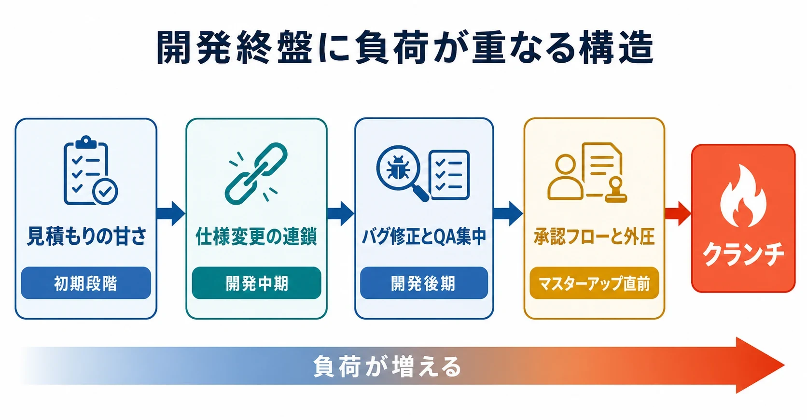
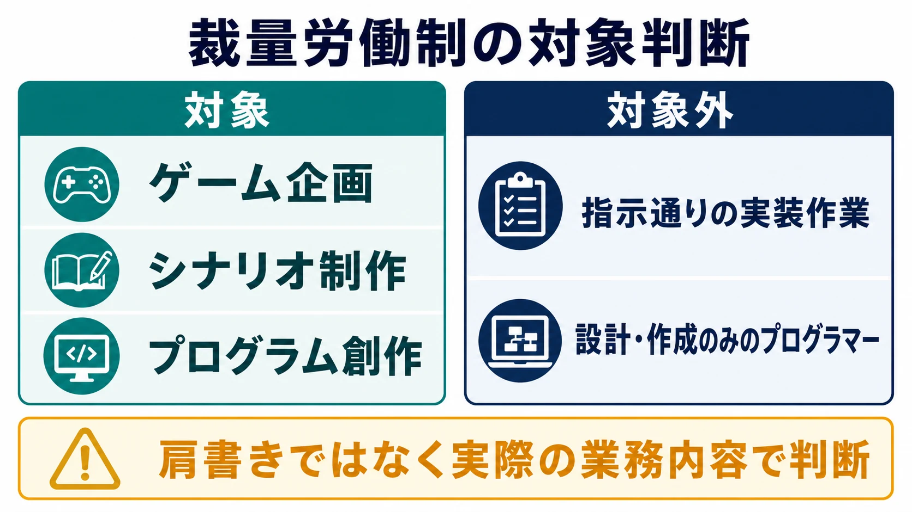
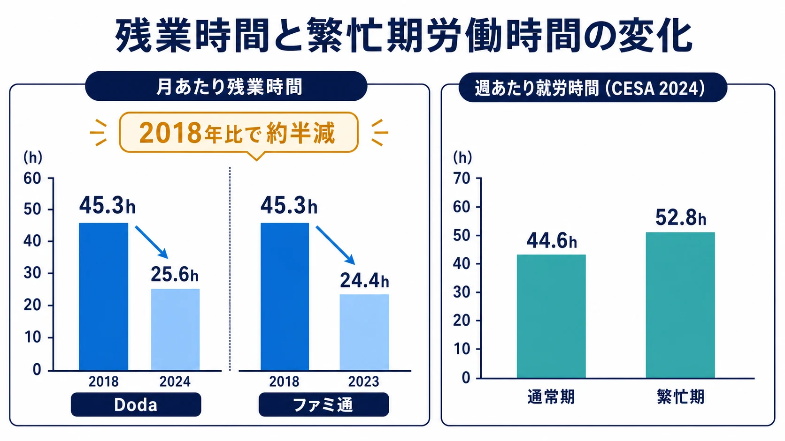
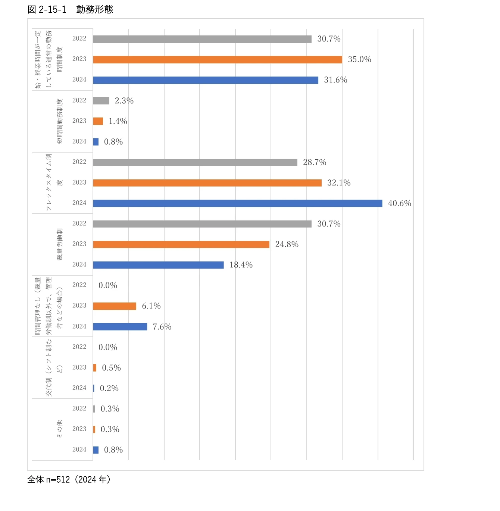
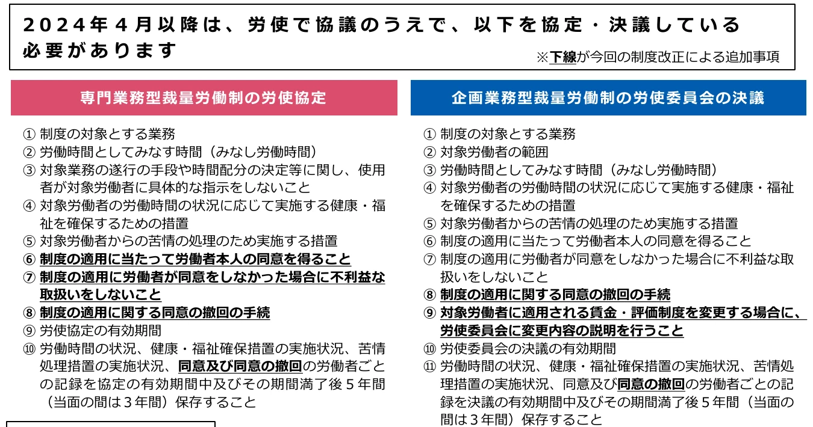
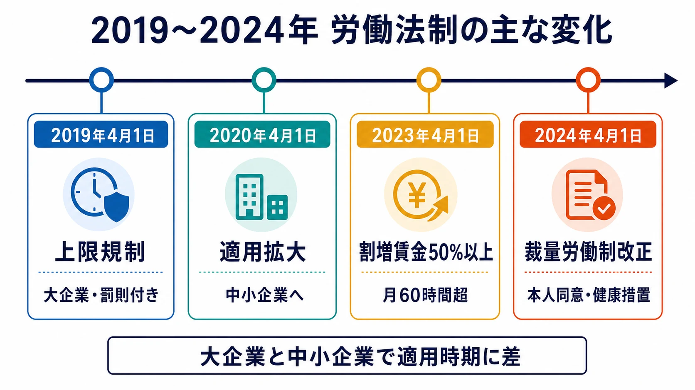

# 日本のゲーム業界における「クランチ」と労働法制の歴史
### ── 新人ゲームプランナーと業界の裏側を知りたいプレイヤーのための解説 ──

***

## はじめに

「クランチ」という言葉を耳にしたことがあるだろうか。ゲーム開発の世界では、プロジェクト終盤──特にマスターアップ（ゴールドマスター）直前──に発生する、長時間労働の集中期間を指す業界用語だ。締め切りに追われ、徹夜を含む連日の残業が常態化する。この現象は国内外を問わず報告されており、『Uncharted』シリーズを手がけたAmy Hennig氏は「Naughty Dog時代に勤務時間が週80時間を切ることはなかった」と振り返っている。[[1](#ref-1)]

この記事では、クランチとは何か、なぜ起きるのかという構造的な問いから、日本の労働法制の仕組み、2019〜2024年の法改正の流れ、海外との比較、そして現場で使える対策までを整理する。特定の企業や個人への断定的な批判は避け、 **業界全体の構造問題** として論じる。

***

## 1. クランチとは何か

クランチとは、ゲーム開発の終盤において、締め切りに間に合わせるために労働者が過剰な長時間労働を強いられる状態を指す。IGDA（国際ゲーム開発者協会）の2015年調査では、回答者の62%が「クランチを経験した」と答え、そのうち37%が残業分の報酬を受け取っていなかった。GDC（Game Developers Conference）の調査でも、ゲーム開発者の46%が週40時間以上の労働を行っていることが判明している。[[2](#ref-2)][[3](#ref-3)][[1](#ref-1)]

日本国内を見ると、転職情報サービスDodaの調査では、ゲーム業界の平均残業時間は2018年に月45.3時間と全職種1位を記録した。リリース直前のピーク時には月40〜100時間以上の残業になるケースも報告されている。厚生労働省の職業情報サイトでも、ゲームクリエイターの「制作の追い込み段階では夜間の作業や残業が増える」と明記されている。[[4](#ref-4)][[5](#ref-5)][[6](#ref-6)]

***

## 2. なぜ「開発終盤」に集中するのか──構造的な原因

クランチは単なる個人の怠慢や企業の悪意から生まれるのではなく、ゲーム開発特有の **複数の構造要因** が重なって発生する。

### 2-1. 見積もりの甘さとコーンの法則

ゲーム開発において、初期段階の工数見積もりは本質的に不確実性が高い。「プロジェクトの進行に連れて不確実性が収束する」という考え方があるが、実際にはプロト版からアルファ、ベータ、マスターという工程を経るたびに **新たな問題が発覚** する。初期の楽観的な見積もりのまま開発が進み、終盤になって取り返しのつかない遅延が表面化するケースは業界内で繰り返されてきた。[[7](#ref-7)][[8](#ref-8)]

KLab株式会社の技術ブログは、「見積もりを直感や経験則だけに頼ることがプロジェクト失敗の要因になる」と指摘し、過去のプロジェクトデータを用いた統計的手法や不確実性の定量化が不十分な場合に炎上リスクが高まると述べている。三点見積もり（楽観値・最頻値・悲観値）などの手法が開発現場での精度改善に有効とされるが、普及は道半ばだ。[[8](#ref-8)][[9](#ref-9)]

### 2-2. 仕様変更の連鎖

ゲーム開発では「途中で仕様が変わることが必ずと言っていいほど起こる」。コンセプトの変更、パブリッシャーからの要求、プレイテスト結果を受けたゲームバランスの調整など、仕様変更の波は開発後期まで続く。仕様変更そのものは品質向上に必要なプロセスでもあるが、スケジュールの再調整が伴わないまま積み重なると、残業で吸収するほかなくなる。開発終盤に向けて労働時間が緩やかに、しかし確実に増加していく傾向は、前節で挙げたDodaやCESAの調査結果とも整合的である。[[4](#ref-4)]

### 2-3. バグ修正とQAの集中

マスターアップ前には、ゲームが完成に近づくほど **バグが集中して発覚する** という技術的な現実がある。開発初期はユニットテストで対応できても、終盤には「最初から最後まで通したプレイ」が必要となり、結合テストの工数は指数関数的に膨らむ。特にソフトウェア開発の終盤で発生するパフォーマンス問題や、ハードウェア・OS側の制約に起因するクリティカルなバグは、想定外の工数を要求することが多い。[[10](#ref-10)][[11](#ref-11)]

### 2-4. 承認フローと外圧

コンシューマタイトルの場合、開発チームの完成後にパブリッシャーによる審査（ロットチェック、プラットフォームホルダーの認証）が待っている。審査で差し戻しが発生すると、想定外の修正工数が発生し、その分だけ残業に転嫁される。「延期した後でも余裕が生まれるわけではなく、むしろ長時間労働が継続した」というケースも海外事例として報告されている。[[12](#ref-12)]

***

## 3. 日本の労働法制の基本構造

法律の仕組みを正確に理解することは、クランチ問題を議論する上で不可欠だ。以下では一次情報（法令・厚生労働省資料）に基づいて、ゲーム業界に関連する主要な制度を解説する。

### 3-1. 労働基準法の原則と36協定

労働基準法は、法定労働時間を原則として **1日8時間・週40時間** と定めている。これを超えて残業させるには、労使間で「時間外労働・休日労働に関する協定」（36協定、労基法第36条）を締結し、労働基準監督署に届け出る必要がある。[[13](#ref-13)][[14](#ref-14)][[15](#ref-15)]

2019年の法改正以前、36協定には事実上の上限がなく、特別条項を設ければいくらでも残業させることが可能な抜け穴が存在した。[[16](#ref-16)]

### 3-2. 専門業務型裁量労働制

ゲーム業界で特に注目されるのが「**専門業務型裁量労働制**」（労基法第38条の3）だ。これは、業務の性質上、遂行の手段や時間配分を労働者の裁量に委ねる必要がある業務について、 **実際の労働時間に関係なく、労使協定で定めた「みなし労働時間」を労働したものとみなす** 制度である。[[17](#ref-17)][[18](#ref-18)]

対象業務として法令に明示されているのは **「ゲーム用ソフトウェアの創作業務」**（ゲームの企画・シナリオ・プログラム創作）だ。ただし、「プログラムの設計または作成を行うプログラマー」は **適用対象外** とされており、肩書きではなく業務の実態で判断される点に注意が必要だ。[[19](#ref-19)][[17](#ref-17)]

この制度の問題点として、弁護士事務所による解説では「裁量労働制を悪用した残業代不払い」が最も特徴的なIT・ゲーム業界の手法として挙げられており、実労働時間がみなし時間を大幅に超えても残業代が支払われないケースが散見されると指摘している。裁量労働制が適法に採用されている場合でも、 **深夜（22〜翌5時）や休日の労働については、別途割増賃金が発生する** ことが法律上の原則であることも確認されている。[[20](#ref-20)][[15](#ref-15)][[21](#ref-21)]

### 3-3. 固定残業代（みなし残業）

「みなし残業」とも呼ばれる固定残業代は、一定時間分の残業代をあらかじめ給与に含める仕組みだ。この制度自体は合法だが、固定残業代を超えた残業については追加支払いが必要であり、それが不払いになるケースが問題となることがある。[[20](#ref-20)]

***

## 4. 2019〜2024年の法改正──業界への影響

この5年間に、ゲーム業界の労働環境に直接影響を与える法改正が相次いで施行された。

### 4-1. 2019年：時間外労働の上限規制（大企業）

2019年4月1日、 **「働き方改革を推進するための関係法律の整備に関する法律」（働き方改革関連法）** が大企業に対して施行された。これにより初めて、36協定に **罰則付きの上限** が設けられた。[[22](#ref-22)]

| 種別 | 上限 |
|------|------|
| 原則（通常時） | 月45時間・年360時間 |
| 特別条項（臨時的な特別の事情） | 年720時間以内 |
| 特別条項（休日労働含む複数月平均） | 月80時間以内 |
| 特別条項（単月の絶対上限） | 月100時間未満 |
| 月45時間超えの回数上限 | 年6か月まで |

上限を超えた使用者には、 **6か月以下の懲役または30万円以下の罰金** が科せられる。改正前は36協定に上限がなく行政指導のみで済んでいたため、罰則付き上限の設定は画期的な変化だった。[[23](#ref-23)][[24](#ref-24)][[16](#ref-16)]

### 4-2. 2020年：中小企業への適用拡大

中小企業には1年間の猶予が設けられ、 **2020年4月1日から上限規制が適用** された。ゲーム業界には中小規模の開発スタジオが多数存在するため、この適用拡大は実質的な影響が大きかった。[[25](#ref-25)]

### 4-3. 2023年：月60時間超の割増賃金率引上げ（中小企業）

2010年の労働基準法改正で、月60時間を超える時間外労働の割増賃金率は25%から **50%以上** に引き上げられていたが、中小企業には長年猶予措置が取られていた。**2023年4月1日、この猶予措置が撤廃** され、大企業・中小企業を問わず月60時間超の残業には50%以上の割増賃金支払いが義務化された。[[26](#ref-26)][[27](#ref-27)][[28](#ref-28)]

深夜（22時〜翌5時）に月60時間超の残業を行わせた場合は、時間外割増50%＋深夜割増25%＝ **75%の割増賃金** となる。これにより、クランチ期における深夜・長時間残業のコストが大幅に増大し、企業にとって財務上の抑止力が生まれた。[[28](#ref-28)]

### 4-4. 法改正の実際の効果

複数の調査が、この時期の残業時間の減少を示している。

| 調査・出典 | 2018年 | 2022〜2024年 |
|------------|--------|--------------|
| Doda（ゲームクリエイター） | 月45.3時間 | 月25.6時間（2024年）[[29](#ref-29)] |
| ファミ通調査（ゲーム制作・開発職） | 月45.3時間 | 月24.4時間（2023年）[[6](#ref-6)] |
| CESA調査（繁忙期・週あたり） | – | 約52.8時間（2024年）[[30](#ref-30)] |

CESA（一般社団法人コンピュータエンターテインメント協会）の「ゲーム開発者の就業とキャリア形成 2024」によると、回答者の通常期の就労時間は週平均44.6時間（標準偏差6.3）、繁忙期は週平均52.8時間（標準偏差9.2）となっており、繁忙期でも約10%が週60時間以上に達している。[[30](#ref-30)] なお、このCESA調査はCEDECコミュニティを中心としたインターネット調査であり、2024年版の有効回答数は512件、2025年版は339件にとどまる。業界全体を代表する無作為抽出調査ではなく、特に中小・独立系スタジオの実態は過小に反映されている可能性がある点には留意が必要だ。[[30](#ref-30)][[31](#ref-31)]

ゲーム業界の残業時間は2018年比で約半減したが、この改善の主因は働き方改革関連法の施行と、リモートワーク普及が重なったことだとされている。ただし「繁忙期の週52時間」という数値は、通常期との落差が依然として8時間近くあることを示しており、クランチ構造が完全に解消されたわけではない。[[6](#ref-6)][[29](#ref-29)]

***

## 5. 裁量労働制をめぐる2019〜2024年の動向

裁量労働制はゲーム業界に広く普及している制度だが、この期間に変化が見られた。CESA調査では、「裁量労働制」の採用比率が2022年の30.7%から2024年には18.4%に低下し、フレックスタイム制の比率が28.7%から40.6%へ上昇している。一方、2025年調査では22.1%とやや再増加しており、企業によって対応が分かれている実態が見える。[[31](#ref-31)][[30](#ref-30)]

> 出典：CESA「ゲーム開発者の就業とキャリア形成 2024」図2-15-1「勤務形態」より引用。[[30](#ref-30)]

制度自体にも変化があった。2024年4月1日には専門業務型裁量労働制の運用ルールが改正され、制度の適用にあたって対象労働者本人の同意を得ることや、同意しなかった場合に不利益な取り扱いをしないこと、同意撤回の手続きなどを労使協定に明記することが新たに義務づけられた。あわせて、勤務間インターバルの確保や深夜業回数の制限といった健康・福祉確保措置の強化も求められるようになっている。「ゲーム用ソフトウェアの創作業務」を対象に裁量労働制を運用してきたゲーム会社にとっても、この改正への対応は避けて通れないものとなった。[[32](#ref-32)]

> 出典：厚生労働省リーフレット「裁量労働制の導入・継続には新たな手続きが必要です」より引用。[[32](#ref-32)]

2018年には、モバイルゲーム会社コロプラが「**裁量労働制の原則廃止**・深夜残業禁止・休日出勤禁止」という踏み込んだ制度改革を発表しており、業界内で先進的な取り組みとして注目を集めた。この事例は、大規模な制度変更が技術系クリエイティブ企業でも実施可能であることを示す参考例となっている。[[33](#ref-33)]

厚生労働省の事例集でも、「裁量労働制・事業場外みなし労働時間制を廃止し、スーパーフレックスタイム制度に移行した」事例（2021年10月）が紹介されており、ゲーム・IT業界全体での制度見直しの流れを反映している。[[34](#ref-34)]

***

## 6. 海外のクランチ議論との比較

### 6-1. 欧米の告発報道とメディアの役割

欧米では、Jason Schreierらのジャーナリストが特定スタジオの内部告発を継続的に取材し、クランチ問題を産業全体の議題として可視化させてきた。日本との大きな違いは、 **メディアによる実名・実態報道の蓄積** だ。これにより「クランチフリーを宣言するスタジオ」という概念が欧米業界では一定のブランド価値を持つようになった。[[3](#ref-3)][[35](#ref-35)]

ある海外スタジオの定義では、クランチとは「週52時間以上の労働を2週間以上続けること」とされており、1日10時間・週52時間は超えるまでをクランチと見なさないとする考え方もある。定義の曖昧さ自体が問題の一端だ。[[35](#ref-35)]

### 6-2. Game Workers Unite（GWU）と組合運動

2018年のGDCで発足した **Game Workers Unite（GWU）** は、ゲーム労働者の組合結成運動を代表する国際的な団体となった。IGDAの調査では、29か国のゲーム労働者のうち79%が職場での組合結成を「支持または強く支持する」と回答している。[[36](#ref-36)][[37](#ref-37)]

同調査での主要な不満は、低賃金（66%）、過剰な労働時間（43%）、不十分な福利厚生（43%）、差別やハラスメント（35%）という順だった。[[36](#ref-36)]

### 6-3. レイオフとクランチの「裏表」関係

欧米ゲーム業界では、クランチとは反対の局面として、リリース後の大規模レイオフが構造的な問題として報じられている。ゲーム業界のレイオフを独自集計する「Game Industry Layoffs」によれば、2022年に約8,500人、2023年に約10,500人、2024年には約14,600人（前年比39%増）のゲーム業界就業者が解雇されたという。2025年には5,300人程度に落ち着いたとされるが、2026年に入っても大手企業でのレイオフやスタジオ閉鎖が散発的に続いている。[[38](#ref-38)][[39](#ref-39)]

この「開発中はクランチで酷使し、リリース後に解雇する」というサイクルは、恒常的な雇用を基本とする日本型雇用慣行とは異なるモデルだ。日本はゲーム業界の大規模レイオフが例外的に少ない市場として注目されることがある一方、終身雇用モデルが「出ていけない」圧力としてクランチを慢性化させる可能性についても、議論の余地がある。[[39](#ref-39)]

***

## 7. 業界的な傾向として報告されてきた構造問題

特定の企業・個人を名指しすることなく、業界で繰り返し報告されてきた構造的傾向を以下に整理する。

- **裁量労働制の不適切な適用**：「ゲーム用ソフトウェアの創作業務」に該当しない職種（実態として指示通りのプログラム作業のみ行うプログラマーなど）に制度を適用し、残業代を支払わないケースが法的問題となった事例が報告されている[[19](#ref-19)][[20](#ref-20)]
- **サービス残業の常態化**：固定残業代の設定時間を大幅に超過した分の残業が不払いとなるケースが「散見される」と法律家が指摘している[[20](#ref-20)]
- **プロジェクト単位の雇用**：プロジェクト終了後に契約終了となるケースが多く、雇用の不安定さがサービス残業を受け入れる圧力になりうる
- **自主的残業という名の文化的圧力**：GDC調査では、週40時間以上働く原因の第1位が「自分へのプレッシャー」（73%）であり、上司からの指示ではなく **自発的な過重労働** として表れるケースが増えている[[2](#ref-2)]

***

## 8. クランチを減らすために現場で見ておきたいこと

ここで扱うスコープ調整、見積もり、バッファ設計は、主にプロジェクトマネージャーやディレクターが判断する領域である。新人ゲームプランナーが、独断でスケジュールや人員計画を変えられる余地はほとんどない。したがって本節は、「将来PM/D職に就いたときに気をつけたい判断軸」と、「新人の立場からPM/Dに進言しやすい観察ポイント」に分けて読むのがよい。

### 8-1. スコープ管理とMVP設計

PM/Dの立場では、開発途中で仕様変更が発生したとき、「スケジュールを守るか、スコープを削るか、品質を下げるか」の三択を明示的に議題に上げることが重要だ。スクラム開発の知見を援用するなら、「リリースはできるだけ小さな単位で、頻繁に行う」ことで、終盤への仕様積み残しを防ぐことができる。[[40](#ref-40)]

新人プランナーの立場では、仕様追加を提案するときに「入れたい理由」だけでなく、「削れる範囲」「後回しにできる範囲」「QAに影響しそうな範囲」を一緒に出すだけでも、PM/Dが判断しやすくなる。決裁権がなくても、変更の代償を言語化することはできる。

### 8-2. 三点見積もりの導入

単一の日数を予測する「一点見積もり」ではなく、楽観値・最頻値・悲観値の三点を設け、$$\text{期待工数} = \frac{\text{悲観値} + 4 \times \text{最頻値} + \text{楽観値}}{6}$$ で計算する三点見積もり法は、スケジュールのバッファを統計的に根拠づけられる手法だ。KLABの技術資料でも、スクエア・エニックスのGDC発表資料でも、ゲーム開発への応用が言及されている。[[41](#ref-41)][[42](#ref-42)][[9](#ref-9)][[8](#ref-8)]

新人プランナーがチーム全体に三点見積もりを導入するのは難しい。しかし、自分の担当タスクについて「最短なら何日、普通なら何日、詰まったら何日」と前提を分けて伝えることはできる。見積もりが外れたときも、「なぜ外れたか」を残しておけば、次回以降の見積もり精度を上げる材料になる。

### 8-3. バッファの明示的な確保

一般的な開発現場では、会議・レビュー等の間接工数として算出工数の **10〜20%程度のバッファを上乗せ** することが推奨されている。このバッファをスケジュール上に「見えるかたち」で組み込み、削ったときのリスクを関係者間で共有することが、終盤の炎上防止につながる。[[9](#ref-9)]

新人プランナーにできるのは、バッファを勝手に確保することではなく、バッファが削られている兆候を早めに報告することだ。レビュー待ち、仕様確認待ち、実装差し戻し、QA観点の追加など、作業そのものではない時間が増えているなら、それはスケジュール上の見えない負債として扱う必要がある。

### 8-4. 労働時間の記録と36協定の確認

自分が勤務する職場に36協定が締結されているかを確認すること、そして実労働時間を自分で記録しておくことは、労働者として最低限の自己防衛だ。裁量労働制が適用されている場合でも、深夜・休日労働については割増賃金の請求権が発生する可能性があることを知っておきたい。[[15](#ref-15)][[4](#ref-4)]

***

## 9. 終わりに

クランチは、単に「忙しい時期がある」という話ではない。見積もり、仕様変更、QA、承認フロー、労働制度、職場文化が重なったとき、最後に現場の長時間労働として表面化する構造的な問題である。

新人ゲームプランナーにとって大切なのは、いきなり制度やスケジュールを変えようと背負い込むことではない。まず、自分の担当範囲で何が遅れを生み、どの変更が誰の作業を増やし、どの判断が終盤の負荷につながるのかを観察することだ。その観察を、感情論ではなく「仕様」「工数」「リスク」「労働時間」の言葉で共有できるようになるほど、PM/Dやチーム全体の判断を助けやすくなる。

そして、自分の働き方を守る知識も同じくらい重要だ。36協定、裁量労働制、固定残業代、深夜・休日労働の扱いを知っておくことは、対立のためだけではなく、健全な開発を長く続けるための基礎になる。よいゲームを作ることと、作り手が壊れないことは、本来どちらか一方を選ぶ関係ではない。

***

## References

1. [AAAタイトルは開発者を破壊する。『Uncharted』シリーズの Amy Hennig氏が語る、クランチ文化の実態][1] - Amy Hennig氏はNaughty Dog在籍時代を振り返り、クランチによる長時間労働の非効率性について語っている。

2. [ゲーム開発者の約半数が週40時間以上の長時間労働を行っている][2] - Game Developers Conferenceの調査で、ゲーム開発者の46%が週40時間以上働いていることが判明。週40時間超の原因の第1位は「自分へのプレッシャー」（73%）。

3. [ビデオゲーム業界の開発現場に巣くう闇を粘り強く取材してきたジャーナリスト、Jason Schreier氏][3] - Jason Schreier氏がビデオゲーム業界のクランチ問題や社内の性差別など、業界の悪習を粘り強く取材してきた経緯を紹介。

4. [【実話】なぜゲーム会社は残業が多いの？残業時間とその原因を解説][4] - ゲーム業界の残業実態や、リリース直前のピーク時に残業が増加する傾向について解説。

5. [ゲームクリエーター - 職業詳細 ｜ 職業情報提供サイト（job tag）][5] - 厚生労働省の職業情報提供サイト。ゲームクリエイターの労働条件の特徴として、制作の追い込み段階で夜間作業や残業が増える点を明記。

6. [ゲーム業界はやめとけ？理由と向き不向き、将来性まで解説！][6] - ファミ通調査を引用し、ゲーム制作・開発職の月平均残業時間が2018年の45.3時間から2023年には24.4時間まで下がったと紹介。

7. [ゲーム開発の流れと重要視するべき2つのポイント][7] - ゲーム開発におけるコンセプト立案からスケジュール策定までの一連の流れを解説。

8. [見積りの常識を疑え！ -ゲーム開発プロジェクト失敗の要因-｜KLab Creative][8] - KLab株式会社の技術ブログ。見積もりを直感や経験則だけに頼ることがプロジェクト失敗の要因になると指摘し、三点見積もりなどの統計的手法を紹介。

9. [工数見積もりはプロジェクトの成否を分ける！根拠や手法・注意点][9] - 工数見積もりの精度を上げる手法として、類推見積もりや三点見積もり法、バッファの持たせ方を解説。

10. [ソフトウェア技術者のためのバグ百科事典（12）デスマーチを呼ぶバグ][10] - ソフトウェア開発の終盤で発生しやすいクリティカルなバグの類型について解説。

11. [バグを限りなくゼロにする方法（CEDEC 2009 講演資料）][11] - CEDEC 2009の講演資料。ゲーム開発におけるテスト・QA工程の課題を扱う。

12. [ノーティードッグの長時間労働問題に「単一の解決策はない」と開発者ら][12] - 匿名の開発者らの証言として、本作が延期された後でも余裕が生まれず、むしろ長時間労働が継続したと報じている。

13. [裁量労働制とは？職種や残業代についてわかりやすく解説][13] - 労働基準法上の法定労働時間の原則（1日8時間・週40時間）と裁量労働制の関係を解説。

14. [裁量労働制とは？メリットやデメリット、導入企業の特長まで解説][14] - 36協定の基本的な仕組みと、法定労働時間を超えて労働させるための要件を解説。

15. [「裁量労働制」とは？ 残業代と労働時間の仕組みやメリット・デメリット][15] - 裁量労働制の目的や、深夜・休日労働に対する割増賃金の扱いについて解説。

16. [時間外労働の上限規制とは？企業がとるべき対応についても解説][16] - 時間外労働の上限規制の内容と、違反した場合の罰則（6か月以下の懲役または30万円以下の罰金）を解説。

17. [【実務】専門業務型裁量労働制を徹底解説][17] - 専門業務型裁量労働制の対象業務として「ゲーム用ソフトウェアの創作」（ゲームの企画・シナリオ・プログラム創作）が明示されている点を解説。

18. [裁量労働制とはどんな制度？ 2024年改正内容と導入時の注意点を解説][18] - 裁量労働制の基本的な仕組みと、2024年4月の改正内容（本人同意・健康福祉確保措置の強化）を解説。

19. [【今すぐ確認！】その職種、実は裁量労働を適用できないかも][19] - ゲーム制作会社の事例をもとに、裁量労働制の対象業務に該当しない職種への不適切な適用について解説。

20. [IT・ゲーム業界の残業代不払いの特徴 - 大阪労災・労働法律事務所][20] - 専門業務型裁量労働制を悪用した残業代不払いが、IT・ゲーム業界で最も特徴的な手法の一つであると指摘。

21. [専門業務型裁量労働制が適用されるための要件 - 四谷麹町法律事務所][21] - 専門業務型裁量労働制の対象業務の要件について、法律事務所の立場から解説。

22. [「働き方改革関連法」の概要][22] - 働き方改革関連法の施行時期（2019年4月・中小企業2020年4月）と時間外労働の上限規制の概要を紹介。

23. [中小企業が時間外労働の上限規制に対応する際のポイント][23] - 大企業への適用開始（2019年4月）と中小企業への適用拡大（2020年4月）の経緯を解説。

24. [働き方改革関連法で変わる業務とは？【対策ポイントは5つ】][24] - 36協定で定められる時間外労働の限度（原則月45時間・年360時間）と特別条項の扱いを解説。

25. [時間外労働の上限規制まとめ。2023年4月からの変更点も紹介][25] - 2019年の罰則付き上限規制導入の経緯と、その後の制度変更を整理。

26. [【2023年4月1日】中小企業も月60時間超の割増賃金率50％に！][26] - 2023年4月1日以降、中小企業も含めて月60時間超の時間外労働の割増賃金率が50%となったことを解説。

27. [中小企業の残業代 2023年4月1日から60時間を超えたら50％割り増し][27] - 2023年4月1日の猶予措置撤廃による、中小企業の割増賃金率引き上げを解説。

28. [中小企業も2023年4月から50％に！時間外労働の「割増賃金率」とは][28] - 深夜割増（25%）と時間外割増（50%）が重なった場合の割増賃金率（75%）について解説。

29. [ゲーム業界は本当に【残業】が多いのか？真相を徹底解説][29] - Doda調査を引用し、ゲーム業界の平均残業時間が2018年の月45.3時間から2024年には月平均25.6時間まで減少したと紹介。

30. [ゲーム開発者の就業とキャリア形成 2024（CESA）][30] - CESAによるインターネット調査（有効回答512件）。通常期の就労時間は週平均44.6時間、繁忙期は週平均52.8時間。裁量労働制の採用比率は18.4%。

31. [ゲーム開発者の就業とキャリア形成 2025（CESA）][31] - CESAによるインターネット調査（有効回答339件）。裁量労働制の採用比率が22.1%へ再増加したことを報告。

32. [裁量労働制の導入・継続には新たな手続きが必要です（厚生労働省リーフレット）][32] - 2024年4月1日施行の改正内容として、専門業務型裁量労働制における本人同意の取得や健康・福祉確保措置の強化などを解説。

33. [クリエイティブ業界で、裁量労働制の廃止＆残業禁止！？ コロプラ人事部による働き方改革の全貌][33] - コロプラが2018年に実施した「裁量労働制の原則廃止」「深夜残業禁止」「休日出勤禁止」という制度改革についての人事担当者インタビュー。

34. [働き方・休み方改革 取組事例集（厚生労働省）][34] - 2021年10月に裁量労働制・事業場外みなし労働時間制を廃止し、スーパーフレックスタイム制度へ移行した企業事例を紹介。

35. [『Dead by Daylight』開発スタジオの残業時間は][35] - 海外スタジオの事例として、クランチの定義（週52時間以上の労働を2週間以上続けること）と実際の残業割合を紹介。

36. [長時間労働と低賃金に押しつぶされるゲーム開発労働者][36] - UNI Global Unionが29か国のビデオゲーム労働者を対象に行った調査。低賃金（66%）、過剰な労働時間（43%）などの不満を報告。

37. [Access Accepted第694回：北米ゲーム業界で労働組合結成の動きが活発化][37] - 2018年のGDCで発足したGame Workers Uniteをはじめとする、北米ゲーム業界の労働組合結成の動きを紹介。

38. [ゲーム業界では、レイオフ経験者の44％が「業界外への転職検討中」との調査レポート][38] - Game Industry Layoffsの集計として、2022年に8,500人、2023年に10,500人、2024年に14,600人、2025年に5,300人がゲーム業界で解雇されたと報告。

39. [ゲーム会社は大規模なレイオフが起きやすいが日本だけは例外][39] - Game Industry Layoffsの集計データをもとに、日本のゲーム企業では大規模な一斉解雇がほとんど見られない点を紹介。

40. [プロジェクトのスコープ調整を考える - 開発チームが信頼を獲得しながら進めるには][40] - アジャイル開発におけるスコープ調整の考え方と、信頼を獲得しながら計画を進めるアプローチを解説。

41. [開発工数の見積もり精度を高める7つの確認項目！工数の削減・効率化にも][41] - WBS（作業分解構造図）に基づく工数見積もり手法を解説。

42. [ゲーム開発 プロジェクトマネジメント講座（スクウェア・エニックス GDC発表資料）][42] - スクウェア・エニックスによるプロジェクトマネジメント講座資料。二点見積もりなど、工数見積もりの精度向上手法を紹介。

[1]: https://automaton-media.com/articles/newsjp/amy-hennig-interview-crunch/
[2]: https://www.gamespark.jp/article/2021/04/29/108231.html
[3]: https://news.denfaminicogamer.jp/news/200417g
[4]: https://game-jobchange.jp/game-company-overtime-reality/
[5]: https://shigoto.mhlw.go.jp/User/Occupation/Detail/330
[6]: https://career.ticketme.co.jp/industry/game-yametoke/
[7]: https://service.shiftinc.jp/column/4918/
[8]: https://www.klab.com/jp/blog/creative/2025/uiux-vol04-1.html
[9]: https://www.crowdlog.jp/blog/110824/
[10]: https://monoist.itmedia.co.jp/mn/articles/2009/14/news013.html
[11]: https://cedec.cesa.or.jp/2009/ssn_archive/pdf/sep1st/PG54.pdf
[12]: https://jp.ign.com/the-last-of-us-2/54211/news/
[13]: https://www.nec-solutioninnovators.co.jp/sp/contents/column/20221104_discretionary-labor-system.html
[14]: https://www.works-hi.co.jp/businesscolumn/discretionary-labor-system
[15]: https://www.hrpro.co.jp/series_detail.php?t_no=4032
[16]: https://solution.natec-japan.co.jp/column/detail/65/
[17]: https://www.mh5.jp/announce2_95217.html
[18]: https://www.obc.co.jp/360/list/post355
[19]: https://media.o-sr.co.jp/news/news-17350/
[20]: https://shikata-law.com/zangyou-it.html
[21]: https://www.y-klaw.com/faq1/765.html
[22]: https://jsite.mhlw.go.jp/aichi-roudoukyoku/jirei_toukei/koyou_kintou/hatarakikata/newpage_01128.html
[23]: https://lysithea.jp/knowledge/column/workstyle05.html
[24]: https://www.works-hi.co.jp/businesscolumn/work-change-point
[25]: https://www.oro.com/zac/blog/over-timework-maximum-limit/
[26]: https://xn--alg-li9dki71toh.com/column/sme-overtime-extra-pay-rate/
[27]: https://www.e-pap.info/column/2023/0428091010.html
[28]: https://www.ntt.com/bizon/d/00501.html
[29]: https://confidence-creator.jp/column/441/
[30]: https://www.cesa.or.jp/uploads/2025/info20250120-1.pdf
[31]: https://www.cesa.or.jp/uploads/2026/info20260106-2.pdf
[32]: https://www.mhlw.go.jp/content/001080850.pdf
[33]: https://get.wevox.io/media/story-colopl
[34]: https://work-holiday.mhlw.go.jp/material/pdf/category1/0101012.pdf
[35]: https://automaton-media.com/articles/newsjp/20190528-93005/
[36]: https://blogs.uniglobalunion.org/japan/?p=6119
[37]: https://www.4gamer.net/games/036/G003691/20210808001/
[38]: https://automaton-media.com/articles/newsjp/20260420-438623/
[39]: https://gigazine.net/news/20240713-game-layoff/
[40]: https://agilejourney.uzabase.com/entry/2023/01/31/103000
[41]: https://biz.moneyforward.com/erp/basic/6212/
[42]: https://www.jp.square-enix.com/tech/openconference/library/2011/dldata/PM/PM.pdf

----

この文書は、Perplexity、Claude、OpenAI Codex の3つのAIの支援を受けて著述されたものです。引用画像を除き、MIT License にて提供されています。
