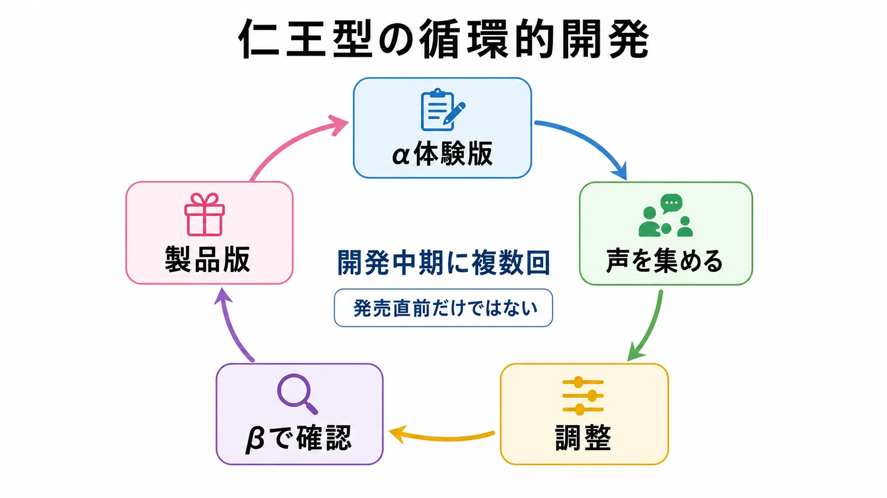
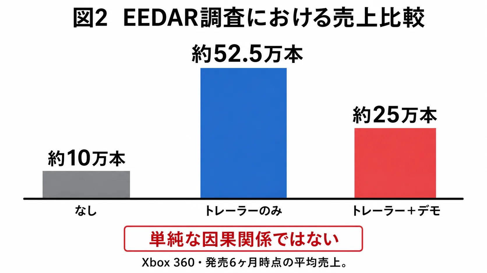
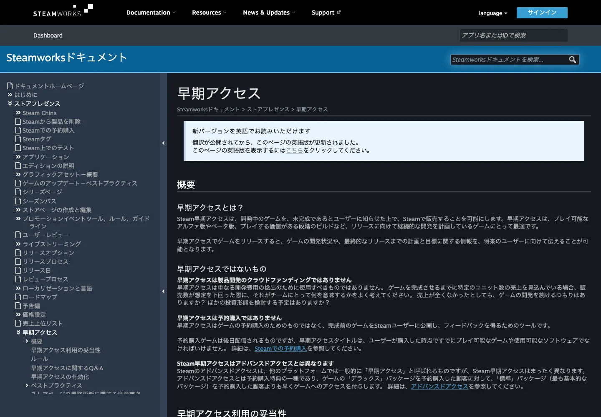
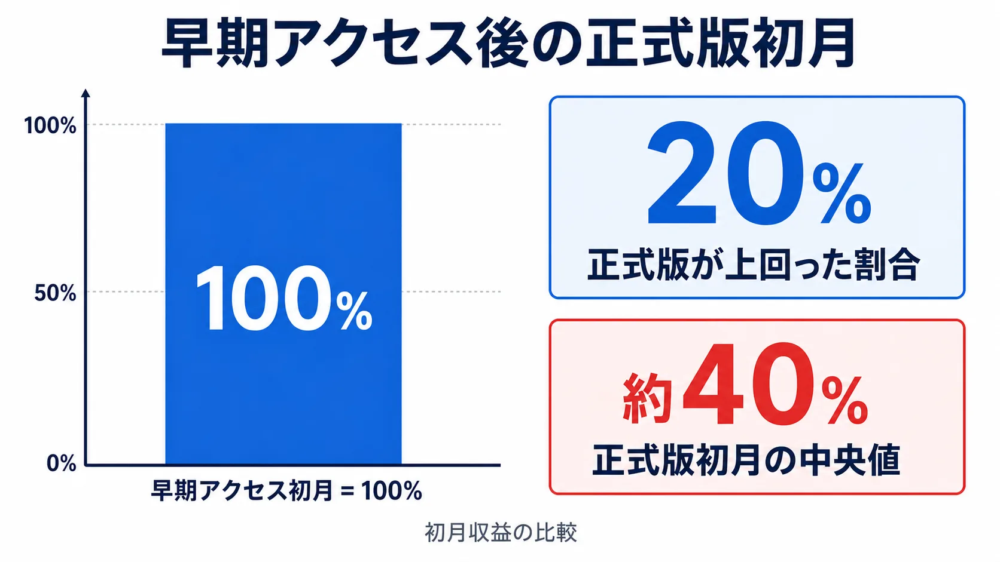
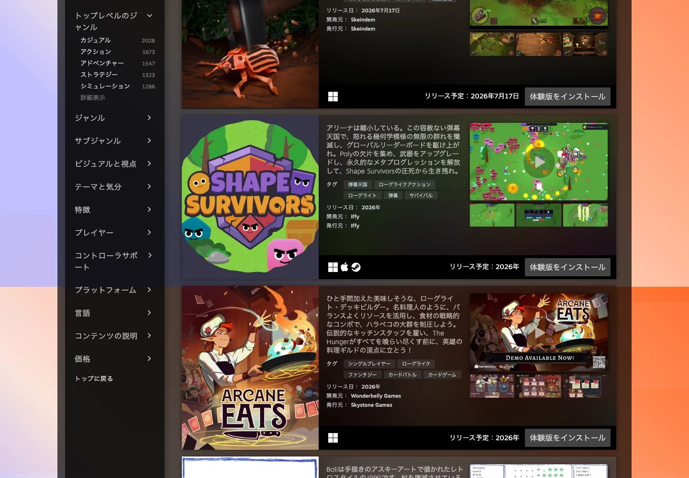
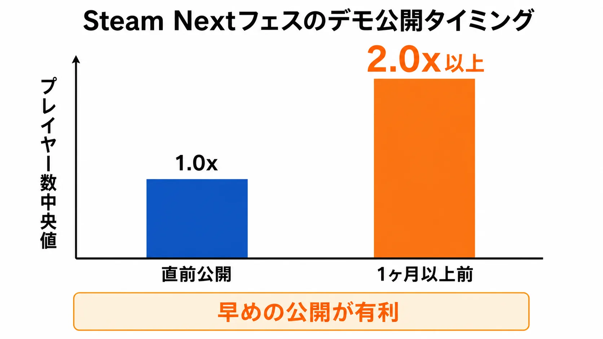

# 体験版戦略の功罪——コンソールゲームとSteam早期アクセスから考える

## はじめに

ゲームの体験版は「製品版を売るための試み」である。しかしその位置づけは時代とともに変化し、単純なプロモーションツールから、開発方針を左右するフィードバック収集の手段、さらにはビジネスモデルそのものへと進化してきた。本稿では、コンソールゲームにおける体験版配信と、PC配信プラットフォームSteamが提供する「早期アクセス」という二つの手法を軸に、メリットとデメリットを多角的に論じる。

----

## 体験版の本質：何のために配信するのか

体験版の目的は、大きく分けて三つある。第一に「認知拡大」、第二に「購入後のミスマッチ防止」、第三に「開発フィードバックの収集」である。[[1](#ref-1)][[2](#ref-2)]

かつて体験版はゲーム雑誌の付録CDやイベント会場での試遊という形で提供されていたが、現在はPlayStation Store、ニンテンドーeショップ、Steamといった公式デジタルストアを通じた無料配信が主流となっている。プレイヤーにとっては「購入の失敗」を防ぐ手段であり、ゲームメーカーにとっては製品版リリース前に期待感を醸成し、発売初動をロケットスタートさせるための布石でもある。[[2](#ref-2)]

ただし、その目的を明確にしないまま体験版を出すことは、後述するリスクを招く原因になりうる。「なぜ体験版を出すのか」という問いへの答えが、設計の全てを左右する。

----

## コンソールゲームにおける体験版のメリット

### 購入意欲の喚起と認知獲得

体験版は、購入を迷っているプレイヤーに対し、トレーラー動画だけでは伝わらない「操作感」や「ゲームの空気感」を直接届ける手段である。文章や映像で説明できないゲームフィールを体験させることで「もっと続きをプレイしたい」という衝動を生み出す。特にアクションゲームやリズムゲームのように、ゲームプレイそのものが魅力の核となるジャンルでは、この効果が顕著に現れる。[[3](#ref-3)][[4](#ref-4)]

### フィードバックによる品質向上

体験版を開発の「中間チェック」として機能させた代表的な事例が、コーエーテクモゲームスの『仁王』シリーズである。開発陣の安田文彦氏は、通常の発売直前配信ではなく開発中期の段階で複数回の体験版を配信し、「プレイヤーに確認したい」という明確な意図のもとフィードバックを反映させた。αバージョンで得たフィードバックをもとに難易度設計や操作感を調整し、β版ではその変化を確認させるという循環的な開発プロセスが、シリーズの高評価につながった。[[5](#ref-5)][[6](#ref-6)]

*図1：開発中期の体験版を起点に、フィードバックと調整を循環させる仁王型の開発プロセス。*

『仁王３』でも同手法が継続して採用されており、2025年6月にはアルファ体験版が配信され、公式サイトでのアンケートを通じてフィードバックを収集した。このように、体験版を「品質を担保するための開発ツール」として捉え直すアプローチは、制作者側と想定プレイヤー層の「手応えのズレ」を早期に発見・修正できるという大きな利点を持つ。[[7](#ref-7)]

出典：[PlayStation Blog「PS5®『仁王3』2026年初頭発売決定！ 期間限定の体験版も本日配信開始！」][7]（©コーエーテクモゲームス。画像は引用、MIT License の対象外）。

### コミュニティの早期形成

体験版の配信は、SNSやゲーム実況を通じた口コミ拡散の起点になる。プレイヤーが体験版をプレイし、その感想を発信することで、有料広告では生み出しにくい「プレイヤー目線の推薦」が生まれる。コミュニティが発売前に形成されることで、発売日当日の購入者数も底上げされる傾向がある。[[8](#ref-8)]

### セーブデータ引継ぎによるロイヤルティ醸成

近年のコンソールゲームでは、体験版のセーブデータを製品版に引き継げる設計が普及している。任天堂の『ピクミン4』では、キャラクタークリエイト・レベルアップ・アイテム収集といった全データが引き継がれる形で約3時間遊べる体験版を提供した。発売月（2023年7月）に約51.8万本を販売し、ファミ通集計で月間首位を記録するという結果は、データ引き継ぎが「体験版で積み上げた愛着を購入というアクションに直結させる」設計の有効性を示している。[[9](#ref-9)][[1](#ref-1)][[2](#ref-2)]

----

## コンソールゲームにおける体験版のデメリット

### 「EEDAR問題」：売上を下げる可能性

体験版の最大の懸念として、しばしば引用される研究がある。アナリティクス会社EEDARが収集したデータによれば、Xbox 360ゲームにおいて「トレーラーのみ」で販売したゲームの平均売上は6ヶ月で約52万5000本だったのに対し、「トレーラー＋デモ」では約25万本と半減した（なお、トレーラーもデモもなしの場合は約10万本にとどまる）。ゲームデザイナーのJesse Schell氏が2013年2月のDICE Summit 2013でこのデータを発表し、「体験版を出すことで売上が半分になる」という言説が業界に広まった。[[10](#ref-10)][[11](#ref-11)][[12](#ref-12)][[13](#ref-13)]

*図2：Xbox 360・発売6ヶ月時点の平均売上比較。ただし、単純な因果関係ではない。*

ただし、このデータの解釈には注意が必要だ。上位AAA大作はそもそも体験版不要の宣伝力を持ち、デモを出すのは認知度の低い中・小規模タイトルに偏る傾向がある。さらに、デモの品質が低い場合は「悪い第一印象」を与え、購入意欲を損なうという側面も指摘されている。つまりこの数字は「体験版そのものが悪い」のではなく、「質の低い体験版は出さないほうがよい」という読み方のほうが適切である。[[14](#ref-14)]

### 未完成のUIが引き起こす印象悪化

発売直前、あるいは発売後しばらく経った段階で配信される体験版とは異なり、開発途中で配信される体験版は、UIが洗練されていない状態でプレイヤーの目にさらされるリスクがある。未完成なメニュー画面、仮置きのアイコン、説明不足のチュートリアルは、実際のゲームの面白さとは無関係に「作り込みが甘い」という印象を生じさせかねない。特にSNSや動画配信を通じて「粗い部分」が切り取られ拡散された場合、製品版のマーケティングにとって致命的なマイナスイメージになることもある。[[1](#ref-1)]

### 制作工数とコストの問題

体験版は「製品版の一部を切り取るだけ」ではない。体験版専用のオープニング演出、ゲームの途中で強制終了させるためのシステム、プレイ範囲を制限する設計、動作安定性のためのQAテストなど、独自の開発工数が発生する。中小規模の開発チームにとって、この追加工数は本編の開発スケジュールを圧迫する直接的な要因になりうる。さらに、発売後に体験版を配信する場合でも、バグ修正や対応プラットフォームへの申請作業が必要になるため、コストゼロではない。[[3](#ref-3)]

### 「既にプレイした」による需要の先食い

体験版でゲームの序盤を遊んだプレイヤーが「もうこれで満足した」と感じてしまう場合がある。特にRPGやアドベンチャーゲームのように、序盤の謎やキャラクターへの興味が購入動機になるジャンルでは、体験版の設計次第で「先食い」が発生しやすい。体験版は「続きが気になる」状態でプレイヤーを終わらせることが理想であり、その匙加減はジャンルや作品の性質に強く依存する。[[15](#ref-15)]

----

## Steam早期アクセスという別の選択肢

### 早期アクセスの仕組みと位置づけ

Steam早期アクセスは、開発中のゲームを「未完成である」とユーザーに明示したうえで有料販売し、プレイヤーのフィードバックを得ながら完成を目指すSteam独自のシステムである。Valveは2013年3月20日、『Arma 3』『Prison Architect』など12タイトルとともにこのプログラムを開始した。その背景には、開発中のバージョンを自社サイトで有料販売する「アルファ資金調達」モデルで大成功を収めた『Minecraft（マインクラフト）』（2009年に有料販売を開始し、2011年1月には100万本を突破）の存在があったとされる。ただし『Minecraft』自体はSteamで販売されておらず、早期アクセスの参加タイトルではない点には注意が必要だ。早期アクセスはこのモデルを制度化したものとして、インディー開発者を中心に急速に普及した。[[16](#ref-16)][[17](#ref-17)]

Steamの公式ドキュメントでは「早期アクセスはゲームの予約購入のためのものではなく、完成前のゲームをSteamユーザーに公開し、フィードバックを得るためのツール」と位置づけられている。この点で、無料配信される体験版とは本質的に異なる——早期アクセスは有料であり、プレイヤーは「開発に参加する」という意識のもとでゲームに関与する。[[16](#ref-16)]

出典：[Steamworksドキュメント - 早期アクセス][16]（スクリーンショットは引用、MIT License の対象外）。

### 早期アクセスの主なメリット

**資金調達と開発継続性**：早期アクセスにより、開発が完了する前に収益を得ることができる。特に自己資金で開発を行うインディースタジオにとって、これは開発を継続させるための生命線になりうる。2026年時点でも約35%の開発者が自己資金でゲームを制作しており、早期アクセスはその資金源として機能している。[[18](#ref-18)]

**フィードバックによるゲームデザインの最適化**：Larian Studiosは『バルダーズ・ゲート3』を2020年10月から約3年間（正式リリースは2023年8月）早期アクセスとして公開し、その間に膨大なプレイヤーフィードバックをゲームシステムに反映させた。Supergiant Gamesの『Hades』も約2年間（2018年12月〜2020年9月）の早期アクセスから始まり、ローグライクゲームの完成度を高め続け、正式リリース後にはD.I.C.E.アワードやGDCアワード、BAFTA最優秀ゲーム賞などでゲーム・オブ・ザ・イヤーを受賞する大成功を収めた。[[19](#ref-19)][[20](#ref-20)][[18](#ref-18)]

**コミュニティの共同作成感**：早期アクセスのプレイヤーは、フィードバックを通じてゲームを「自分たちで作った」という連帯感を持ちやすい。この感情は強力な口コミ効果を生む。ゲームを迎え入れ、丁寧に回答し、更新を繰り返す開発者の姿勢は、ロイヤルティの高いファンベースを形成する。[[21](#ref-21)]

### 早期アクセスの主なデメリット

**「正式リリース」の段階的な失速**：GameDiscoverCoの2025年のデータによれば、早期アクセスを経て正式リリースしたゲームのうち、正式版の初月収益が早期アクセス開始時の初月を上回ったのはわずか20%にとどまる。正式リリース時の中央値は、早期アクセス初月収益の40%程度に過ぎない。つまり早期アクセスが「正式版への期待感の前借り」になるリスクは非常に高い。[[18](#ref-18)]

*図3：正式版初月は早期アクセス開始時の初月を上回りにくく、中央値も約40%にとどまることを示す図解。*

**未完成ゲームへの悪評が固定化する**：プレイヤーは早期アクセスに対してある程度の寛容さを持つが、それには限界がある。Steamのレビューシステムはゲームの評判を強力に形成し、早期アクセス中の低評価が正式リリース後もゲームに付きまとう場合がある。2016年以降に登場した数多くの「失敗した早期アクセスゲーム」——The Day Beforeのような詐欺的事例まで含めれば——が示すように、「完成しない」「約束を守らない」という状況はゲームの評判を決定的に破壊する。[[22](#ref-22)][[23](#ref-23)]

**ウィッシュリストから購入への転換率の低下**：ある業界ベンチマークによれば、ウィッシュリストから実プレイヤーへの転換率は2018年の約20%から2026年には5〜10%程度にまで下がっているとされる。ただしGameDiscoverCo（Simon Carless氏）は、転換率そのものは2022年以降おおむね横ばいで、むしろ「ゲーム数の急増によりウィッシュリストを集めること自体が難しくなった」点を強調しており、低下傾向の解釈には注意が必要だ。なお、早期アクセスでの購入転換率は正式版リリース時と比較して約3分の1低いというデータもある。Steam上のゲーム数の急増（2024年には前年比32.3%増の約1万8945本がリリース）による発見の困難さと相まって、早期アクセスの収益予測は難しくなっている。[[24](#ref-24)][[25](#ref-25)][[18](#ref-18)]

----

## Steam Nextフェスとデモ戦略

コンソールでの体験版配信に加え、Steamにはインディー開発者にとって重要なデモ配信の機会として「Steam Nextフェス」がある。このイベントは、まだリリースされていないゲームの無料体験版を集中的に公開するもので、参加ゲームはウィッシュリスト登録数を大幅に増やせる可能性がある。[[26](#ref-26)][[27](#ref-27)]

出典：[Steam Nextフェス公式ページ][26]（2026年6月26日時点の表示。スクリーンショットは引用、MIT License の対象外）。

ゲーム市場コンサルタントのChris Zukowski氏の分析によれば、Steam Nextフェスで注目を集めるためには「直前ではなく数か月前から体験版を公開しておくこと」が有効であり、フェス1ヶ月以上前から公開したゲームはフェス直前に公開したゲームと比べてプレイヤー数の中央値が2倍以上多かったという。また、体験版を事前に公開してストリーマー（実況者）にプレイさせることが、フェス参加前のウィッシュリスト獲得の重要な手段となる。[[28](#ref-28)][[29](#ref-29)]

*図4：フェス直前公開を1.0倍とした場合、1ヶ月以上前から公開した体験版はプレイヤー数中央値が2倍以上だった。*

体験版の理想的な長さは15〜30分程度——ゲームの核となるループを一通り体験させつつ、続きへの期待感を高める形で終わるもの——が推奨されている。これはいわゆる「バーティカルスライス（製品の最終品質を凝縮して示す代表的な一区切り）」の発想に近く、量より「完成度の高い一場面」を見せることが重視される。[[30](#ref-30)]

----

## コンソールとSteam早期アクセスの比較

| 観点 | コンソール体験版 | Steam早期アクセス |
|------|----------------|-----------------|
| **費用負担** | 無料（プレイヤー側） | 有料（早期割引が多い） |
| **目的** | 購入前のお試し・プロモーション | 開発継続資金＋フィードバック |
| **プレイヤーの期待** | 完成品の一部を体験する | 未完成を承知で参加する |
| **開発リスク** | 体験版専用の工数が発生 | 常時アップデートの運用コスト |
| **フィードバック量** | アンケートや口コミが主 | レビュー・フォーラム等で大量取得 |
| **失敗時の影響** | 低評価は製品版にも波及 | 悪評が早期アクセス期間中に固定化 |
| **適合ジャンル** | アクション・RPG全般 | サバイバル・ローグライク・シミュレーション |
| **成功事例** | 仁王シリーズ、ピクミン4 | Hades、バルダーズ・ゲート3 |

コンソール体験版は「出来上がった製品を広く知ってもらう」プロモーション的性格が強く、Steam早期アクセスは「開発とビジネスを同時に進める」パラダイムを体現している。[[1](#ref-1)][[18](#ref-18)]

----

## 体験版設計における実践的な考え方

### 目的の明確化が第一

体験版を「なぜ出すのか」を最初に定義することが全ての出発点である。「開発の方向性確認のため」ならば仁王型のα/β複数回配信が有効であり、「発売直前の認知獲得のため」ならば完成度の高いプロローグを切り出すアプローチが適切だ。[[5](#ref-5)][[3](#ref-3)]

### ジャンルとゲームデザインとの相性

体験版が効果的なジャンルの特徴は、「短い時間で魅力的なゲームサイクルを体験させられる」点にある。ローグライクやアクションゲームはその典型だ。一方、長時間の没入を前提とするストーリー主導のRPGや、序盤の謎が購入動機を形成するゲームでは、体験版の「先食い」リスクをより慎重に検討する必要がある。[[15](#ref-15)]

### 「終わり方」のデザイン

体験版の最後の数分間が、その体験版の成否を決める。プレイヤーが「もっと続きをプレイしたい」という状態で終わるようにシナリオやゲームループを設計し、明確なウィッシュリスト登録や予約購入へのCTA（行動喚起）を設けることが不可欠である。[[30](#ref-30)]

### UIの品質管理

体験版において、UIは「ゲームの窓口」である。たとえゲームプレイが洗練されていても、粗いUIは全体の印象を大きく損なう。開発中の段階でフィードバックを得ることを目的とする場合でも、UIに一定の水準を設けることは、フィードバックの質を高めることにもつながる——「UIが分かりにくい」という声が大量に集まると、ゲームデザインの本質的なフィードバックが埋もれてしまう可能性があるからだ。[[1](#ref-1)]

----

## 結論：体験版は「出し方」が全てを決める

体験版の効果は、出すか出さないかではなく「いつ・何を・どのように出すか」によって決まる。低品質な体験版は売上を半減させるデータが示す通り、準備不足のデモは出さないよりも悪い。しかし、仁王やピクミン4のように設計を徹底した体験版は、製品への信頼と期待を同時に高める強力な武器となる。[[13](#ref-13)][[9](#ref-9)][[5](#ref-5)]

Steam早期アクセスは、資金調達とコミュニティ構築という点で有効なモデルだが、「正式リリース後の期待超過」という高いハードルが待っている。早期アクセスを選択するならば、それ自体が既に十分に楽しめる垂直断面の完成度を持つことと、透明なコミュニケーションを維持し続ける覚悟が不可欠だ。[[21](#ref-21)][[19](#ref-19)][[18](#ref-18)]

体験版戦略は、制作側の意図とプレイヤーの期待値のズレを測る「最初の対話」である。そのズレを早期に発見するためのものとして捉えるか、それとも発売直前のプロモーションの仕上げとして捉えるか——その判断が、体験版の成否のみならず、ゲームそのものの完成度にも影響を与えていく。

----

## References

1. [ゲームの体験版とは？ユーザーとゲーム会社のメリット・注意点を ...][1] - そこでこのコラムでは体験版の意味やメリット、注意点などを解説します。ぜひ最後まで読んで参考にしてください。 目次. 1. ゲームの体験版とは？ 1-1 ...

2. [ゲームの「体験版」に込められる意図とは？概要と ...][2] - 体験版でのプレイが無駄にならないように、データを製品版に引き継げるタイトルも多数あります。この仕組みがないと、製品版を購入した際に、同じ部分を ...

3. [そのゲームの「体験版」、逆効果かも……。｜EIKI` - note][3] - 有料で売る体験版もまた、無料体験版とは別の性質のものです。偉い人は言いました。体験版は七回までOKだと。 同人ゲームの文脈では100円～300円くらいで ...

4. [ゲームプロモーションとは？効果的な宣伝方法や面白い事例を紹介][4] - ゲームの一部を「お試し」してもらうことで、ゲームの楽しさや魅力が伝わりやすく、「もっとプレイしたい」と、アプリのダウンロードや購入を促進する効果 ...

5. [体験版配信のメリットとデメリットとは？ 『仁王』安田文彦 ...][5] - 体験版配信を活かしたゲーム作り. 本格的な『仁王』開発にあたって序盤に ... 版は予約促進向けのプロモーション的な意味合いが強かったという。

6. [「仁王」のβ体験版配信に先駆けた先行試遊会が開催。α ... - 4Gamer][6] - 「仁王」のβ体験版配信に先駆けた先行試遊会が開催。α体験版のフィードバックをもとにした調整や，高難度モードなど新要素の存在が明らかに.

7. [PS5®『仁王3』2026年初頭発売決定！ 期間限定の体験版も本日 ...][7] - あらゆる要素で進化を遂げる『仁王3』は本日6月5日（木）から体験版を配信開始します。ぜひ、お試しください。 Play Video PS5®『仁王3』2026年初頭発売決定 ...

8. [ゲーム実況配信(動画)は売上に影響する？無視できない効果や ...][8] - ゲーム実況配信(動画)は売上に影響する？無視できない効果やメリットを紹介 · ファンとの感情的なつながりを活かせる · 視聴者に情報提供して信頼を借りれる ...

9. [ゲーム業界が教える「売れ続ける仕組み」の正体｜吉沼 浩][9] - 体験版でプレイヤーが積み上げた時間・感情・キャラクターへの愛着は、通常であれば製品版購入で「捨てるしかないコスト」になる。 任天堂はこれを購入 ...

10. [Jesse Schell: Releasing a Game Demo Can Cut Sales in Half - IGN][10] - Releasing a game demo may not actually be a very good way to boost game sales; in fact, it could red...

11. [Demos Are Great For Gamers, Not-So-Great For Game Sales - Kotaku][11] - The data, gathered by analytics firm EEDAR, shows the average sales for an Xbox 360 game promoted on...

12. [Game demos can hurt sales, suggests research - GameSpot][12] - Schell's slide showed that the average Xbox 360 game sells 525,000 units after six months when relea...

13. [Game demos cut sales by half, study claims - MCV/DEVELOP][13] - Releasing a demo can cut a game's sales by half, claims a new report from industry research company ...

14. [The Unfair Lie That Ruined Demos - by JB Oger - The Arcade Artificer][14] - Some developers keep believing that demos negatively impact games, even when current-day data says o...

15. [インディーゲームのプロローグ版や体験版がもたらす効果とは ...][15] - まとめると、成功するプロローグ版とデモ版の特徴は多くの場合「短いが魅力的なゲームサイクルを持つ」、「リプレイの価値が高い」、「何回やっても本編を ...

16. [Steamworksドキュメント - 早期アクセス][16] - Steam早期アクセスは、開発中のゲームを、未完成であるとユーザーに知らせた上で、Steamで販売することを可能にします。早期アクセスは、プレイ可能なアルファ版やベータ版 ...

17. [Steam started Early Access for games 10 years ago - Neowin][17] - On March 20, 2013, Valve announced its new Early Access program on Steam. Before Valve started Early Access, a few small developers sold early versions of their games to fund development; one of the most notable was Minecraft, whose creator started charging just after launching the game in 2009.

18. [Early Access Games in 2026: Is the Model Still Worth It for ...][18] - The success stories are the reason the model still has defenders. Baldur's Gate 3 spent about three ...

19. [Christopher Anjos GamesBeat's Post - LinkedIn][19] - The exception are games such as Baldur's Gate 3, which are rich in systems. A successful Early Acces...

20. [Hades: Coming Soon to Steam Early Access! - Supergiant Games][20] - We're really excited to announce that our rogue-like dungeon crawler Hades is coming to Steam Early ...

21. [The Case for Steam Early Access - Haemimont Games][21] - Still, our experience with Steam Early Access as developers has been nothing but positive and I am c...

22. [steamのアーリーアクセス（early access）のデメリットを理解して ...][22] - 「早期アクセスレビューで問題とされている箇所が製品版でも残っているかもしれない」と判断されると、それによって購入意欲が落ちたり無くなってしまう事 ...

23. [8 Early Access Video Games That Were Horrible Messes ｜ PCMag][23] - 8 Early Access Video Games That Were Horrible Messes · 1. The Stomping Land · 2. Towns · 3. Bot Colo...

24. [Conversion benchmarks of Steam wishlists into sales in the first month][24] - The median conversion rate of wishlists to sales in the first month is 27%. In the first week, it is...

25. [What's the average Steam wishlist conversion rate in 2026?][25] - Wishlist-to-player conversion has shifted across the industry, with averages now falling between 5% ...

26. [Steam Nextフェス：2026年6月エディション開催のお知らせ][26] - まだリリースされていないゲームの無料体験版をプレイしよう！ あらゆるジャンルの近日登場タイトルを探索し、その舞台裏にいる開発者と交流し、お気に入りをウィッシュ ...

27. [Steam Next Festでのウィッシュリスト獲得の分析(2022年6月 ...][27] - このウィジェットはフェスの一番目立つウィジェットです。そこに3つのタブがあります。 ・「人気の近日登場」 ・「ウィッシュリストで最も人気の近日登場 ...

28. [「Steam Nextフェス向け体験版」は“1か月以上前から公開しておく ...][28] - Steam Nextフェスで注目された作品は数千件から数万件のウィッシュリスト登録が得られるとされており、特にあまり宣伝に予算や労力を投じられない ...

29. [How to win at Steam Next Fest (2025 data) - YouTube][29] - How do you get the most wishlists out of Steam Next Fest? I will tell you in this video. But don't f...

30. [Steam Next Fest Marketing: 11 Strategies for Success in 2026][30] - Monitor “Demo to Wishlist” Conversion: High download numbers indicate strong marketing; low wishlist...

[1]: https://game-creators.jp/media/career/988/
[2]: https://game-matching.jp/g-job-agent/news_articles/193
[3]: https://note.com/eiki_okuma/n/n8f4e81529994
[4]: https://balance.bz/magazine/category/campaign/game-promotion/
[5]: https://www.famitsu.com/news/201703/03128216.html
[6]: https://www.4gamer.net/games/120/G012039/20160822004/
[7]: https://blog.ja.playstation.com/2025/06/05/20250605-nioh3/
[8]: https://nokid.jp/blog/8406
[9]: https://note.com/samurai_xx_japan/n/n06c63cbc1f81
[10]: https://www.ign.com/articles/2013/02/11/jesse-schell-releasing-a-game-demo-can-cut-sales-in-half
[11]: https://kotaku.com/demos-are-great-for-gamers-not-so-great-for-game-sales-608603895
[12]: https://www.gamespot.com/articles/game-demos-can-hurt-sales-suggests-research/1100-6410863/
[13]: https://mcvuk.com/development-news/game-demos-cut-sales-by-half-study-claims/
[14]: https://jboger.substack.com/p/the-unfair-lie-that-ruined-demos
[15]: https://indiegamesjp.dev/?p=3240
[16]: https://partner.steamgames.com/doc/store/earlyaccess?l=japanese
[17]: https://www.neowin.net/news/steam-started-early-access-for-games-10-years-ago-now-its-everywhere-for-better-or-worse/
[18]: https://news.viverse.com/post/early-access-games-2026
[19]: https://www.linkedin.com/posts/anjosaaa_what-does-fortnite-baldurs-gate-3-hades-activity-7190695786848948225-mn0c
[20]: https://www.supergiantgames.com/blog/hades-coming-soon-to-steam-early-access/
[21]: https://www.haemimontgames.com/the-case-for-steam-early-access/
[22]: https://note.com/ogatahiroto/n/nf360e584dfba
[23]: https://www.pcmag.com/news/8-early-access-video-games-that-were-horrible-messes
[24]: https://gamedevreports.substack.com/p/gamediscoverco-conversion-benchmarks
[25]: https://www.immutable.com/insights/steam-wishlist-conversion-rates
[26]: https://store.steampowered.com/sale/nextfest?l=japanese
[27]: https://indiegamesjp.dev/?p=5982
[28]: https://automaton-media.com/articles/newsjp/steam-20260415-437627/
[29]: https://www.youtube.com/watch?v=Px2Zsvag29c
[30]: https://www.biggamesmachine.com/steam-next-fest-marketing-strategies/

----

この文書は、Perplexity、Claude、OpenAI Codex の3つのAIの支援を受けて著述されたものです。引用画像を除き、MIT License にて提供されています。
