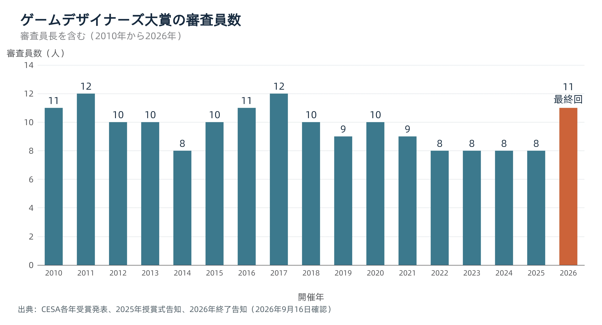

# 売上や人気だけでは拾えない価値を、誰が評価するのか――ゲームデザイナーズ大賞が残した制度設計の問い

## 1. 同じ年に、二つの賞が別の作品を選んでいた

2026年9月15日、日本ゲーム大賞の年間作品部門大賞には『ぽこ あ ポケモン』が、ゲームデザイナーズ大賞には『文字遊戯』が選ばれた。同じ主催者が、同じ授賞式で、異なる作品に大賞を贈ったのである。[[1](#ref-1)]

日本ゲーム大賞は、一般社団法人コンピュータエンターテインメント協会（CESA）が主催する表彰事業だ。第1回の開催は1997年で、2026年に30回目を迎えた。[[2](#ref-2)][[3](#ref-3)] 年間作品部門では、一般投票と選考委員会の審査を組み合わせ、その年を代表する作品を選ぶ。ゲームデザインや映像、音、シナリオなどを総合的に評価し、投票結果や販売本数も参考にする仕組みである。[[4](#ref-4)]

その中に、作り手の視点から独創性を評価するもう一つの賞があった。2010年に始まり、2026年を最後に終了したゲームデザイナーズ大賞だ。CESAの終了告知は、最終回を「17回目」、それまでの歩みを「16年間」と記している。2010年から2025年までに16回を重ね、2026年が17回目となる。本稿では、最終回までの17回分を扱う。[[3](#ref-3)]

第3章で並べるとおり、この二つの大賞は、17回を通じて一度も同じ作品を選んでいない。この違いを生んだのは、評価する人と、評価する問いの違いではないか。

受賞作の優劣ではなく、 **何を評価し、その判断を誰に託すか** を考えたい。ゲームデザイナーズ大賞は、その選択を公開された制度の形にしていた。

***

## 2. 売上に出ない価値を、誰が評価するのか

2010年の新設発表は、クリエイターが作り手の視点から、独創性が高く、ゲームの歴史に残すべき革新的な作品を選ぶ、と説明した。名称の「ゲームデザイナーズ」も、ゲーム制作に携わる人々自身が選ぶことに由来する。[[5](#ref-5)] 2026年の回顧でも、売上やトレンドに加えて、新しい遊びを評価する場だったと説明されている。[[3](#ref-3)]

そこで置かれたのが、「日本ゲーム大賞選考委員会」とは別の、クリエイターによる審査会である。2012年の公式説明と2026年の公式ページには、同じ骨格の手続きが掲載されている。[[6](#ref-6)][[4](#ref-4)]

| 決めていたこと | 公開されていた仕組み |
| --- | --- |
| 誰が評価するか | 選考委員会とは別に、クリエイターによる審査会を置く |
| 判断をどう集めるか | 各審査員が持ち点10点で評価し、ポイントを集計する |
| 誰が最終決定するか | 審査会が選出した作品について、選考委員会の承認を得る |

持ち点10点は、各作品を一律に10点満点で採点する、という説明ではない。2014年の概要には、受賞にふさわしいと思う作品へ点を割り振り、合計得点の高い作品を選ぶと明記されている。[[7](#ref-7)]

評価する内容も、二つの基準に分かれていた。公式説明の「独創性」は、従来の作品と異なる新たなアイデアがあること。「斬新性」は、新しい楽しみ方や遊び方を提示し、ゲームソフトの可能性を広げることを指す。[[6](#ref-6)] 言い換えれば、着想の新しさと、それが生む遊びの広がりである。

投票は一度で終わるとは限らなかった。2021年の講評は、票の多かった作品を挙げて第二次投票を行ったと説明している。2026年の講評にも、対象を絞った第二次審査への言及がある。少なくとも両年では、候補を共有して再び判断する段階があった。[[8](#ref-8)][[1](#ref-1)]

この構造では、作り手の専門的な判断、複数人の票の集計、主催側の最終承認が組み合わされている。審査員長一人の好みだけで決定する仕組みではなかった。 **独創性を見る主体を別に置き、その判断を賞の正式な結果へつなぐ** ことが、制度の特徴である。

***

## 3. 17年分の受賞作が示すもの

次の表は、同年の二つの大賞を並べたものだ。年間作品部門大賞の2010〜2025年はCESAの歴代一覧、ゲームデザイナーズ大賞は各年の受賞発表を出典とする。2026年はCESAの受賞発表による。[[2](#ref-2)][[1](#ref-1)] 作品名は一部の副題・商標記号を省略した。

| 年 | ゲームデザイナーズ大賞 | 年間作品部門大賞 |
| --- | --- | --- |
| 2010 | HEAVY RAIN -心の軋むとき- [[9](#ref-9)] | New スーパーマリオブラザーズ Wii |
| 2011 | ヒラメキパズル マックスウェルの不思議なノート [[10](#ref-10)] | MONSTER HUNTER PORTABLE 3rd |
| 2012 | 風ノ旅ビト [[11](#ref-11)] | GRAVITY DAZE |
| 2013 | The Unfinished Swan [[12](#ref-12)] | とびだせ どうぶつの森 |
| 2014 | ブラザーズ ２人の息子の物語 [[13](#ref-13)] | モンスターハンター４／妖怪ウォッチ |
| 2015 | Ingress [[14](#ref-14)] | 妖怪ウォッチ2 元祖／本家／真打 |
| 2016 | Life Is Strange [[15](#ref-15)] | Splatoon |
| 2017 | INSIDE [[16](#ref-16)] | ゼルダの伝説 ブレス オブ ザ ワイルド |
| 2018 | Gorogoa [[17](#ref-17)] | モンスターハンター：ワールド |
| 2019 | ASTRO BOT：RESCUE MISSION [[18](#ref-18)] | 大乱闘スマッシュブラザーズ SPECIAL |
| 2020 | Baba Is You [[19](#ref-19)] | あつまれ どうぶつの森 |
| 2021 | マリオカート ライブ ホームサーキット [[8](#ref-8)] | Ghost of Tsushima／モンスターハンターライズ |
| 2022 | Inscryption [[20](#ref-20)] | ELDEN RING |
| 2023 | ＲＰＧタイム！～ライトの伝説～ [[21](#ref-21)] | モンスターハンターライズ：サンブレイク |
| 2024 | Viewfinder [[22](#ref-22)] | ゼルダの伝説 ティアーズ オブ ザ キングダム |
| 2025 | INDIKA [[23](#ref-23)] | メタファー：リファンタジオ |
| 2026 | 文字遊戯 [[1](#ref-1)] | ぽこ あ ポケモン |

年間作品部門大賞が2作品だった2014年と2021年も含め、 **同年の受賞作の一致は0回** である。ゲームデザイナーズ大賞には、言葉や絵を使うパズル、物語への関わり方を変える作品、位置情報やVR、現実の玩具を使う作品まで並ぶ。独創性を探す対象は、一つのジャンルに収まっていない。

この違いを、投票の内側から説明した例が2011年である。『マックスウェルの不思議なノート』の講評には、日本ゲーム大賞の一般公募で得た票数よりも、同作を支持したゲームデザイナーズ大賞の審査員数が多かったとある。少人数の作り手が、一般投票では目立たなかった作品を拾い上げた事例だ。[[10](#ref-10)]

ただし、この一覧が示すのは二つの賞の選択の違いであり、各作品の売上規模ではない。同じ2011年の講評は、同作の海外版『Scribblenauts』をミリオンセラーと紹介している。独創性を評価された作品にも、商業的なヒットはあった。[[10](#ref-10)]

CESAの受賞発表に掲載された桜井政博氏の統括コメントは、この賞の位置づけを次のように述べている。「独創性をテーマにして賞を与えることができるという点において、ゲームデザイナーズ大賞は人気票になりがちなゲーム大賞において別の評価軸を与えることができたと思っています」。同じコメントは「残酷なことを言うと、独創性というものは売上には直接繋がりにくいこともあります」とも記す。授賞式の壇上でも、独創性は売上にあまり影響しないという趣旨が語られたと報じられている。[[1](#ref-1)][[24](#ref-24)] 17回の実績から確かめられるのは、売上と独創性の相関ではなく、一般投票や市場評価を含む総合賞とは別の作品を選び続けたことだ。 **市場での成功と、新しい遊びを生んだ価値を、別々に評価する余地があった** のである。

***

## 4. 「他に例がない」という評価が、16回の講評を貫く

2010〜2025年の16回分の講評を読むと、評価する対象は変わっても、その作品ならではの体験を探す姿勢が続いている。「他に例がない」は、毎年そのまま繰り返された定型句ではない。2018年の『Gorogoa』に使われた短い表現が、ほかの年の講評にも通じる問いをよく表している。[[17](#ref-17)]

以下は各年の桜井氏の講評の要旨である。作品そのものの批評ではなく、審査側が受賞理由として何を説明したかを並べる。

| 年・作品 | 講評で評価された点の要旨 |
| --- | --- |
| 2010・HEAVY RAIN | 日常の行為を操作させる積み重ねが緊張感と介入感を生み、物語の見せ方を変えた。[[9](#ref-9)] |
| 2011・マックスウェルの不思議なノート | 作り込みと仕組みによって自由な組み合わせを支え、遊び方をプレイヤーに委ねた。[[10](#ref-10)] |
| 2012・風ノ旅ビト | 説明や会話などを削ぎ落とす姿勢と、映像・音を含む完成度を評価した。[[11](#ref-11)] |
| 2013・The Unfinished Swan | 操作によって見えなかった世界を可視化する着想と、表現・物語の見せ方を評価した。[[12](#ref-12)] |
| 2014・ブラザーズ | 二人を左右のスティックで同時に動かす新鮮さが、物語と仕組みの両方に結びついていた。[[13](#ref-13)] |
| 2015・Ingress | 現実の場所を使う陣取りのルールや見せ方に加え、人を没頭させる魅力があった。[[14](#ref-14)] |
| 2016・Life Is Strange | 時間を巻き戻す仕組みを選択のやり直しへつなぎ、その分岐を作り込んだ。[[15](#ref-15)] |
| 2017・INSIDE | 操作は一般的でも、世界の描き方に類似作を挙げにくい個性があった。[[16](#ref-16)] |
| 2018・Gorogoa | 絵の操作、美術、解法、語り方が組み合わさり、この作品固有の魅力を作った。[[17](#ref-17)] |
| 2019・ASTRO BOT | VRの視点やコントローラーを遊びへ組み込み、磨き込みによって固有の体験を生んだ。[[18](#ref-18)] |
| 2020・Baba Is You | キャラクターや壁などの当たり前の役割を変えることで、常識から解放される面白さを生んだ。[[19](#ref-19)] |
| 2021・マリオカート ライブ | ラジコンとARを組み合わせ、現実に作るコースをゲームの場にした。[[8](#ref-8)] |
| 2022・Inscryption | カードゲームに設定や語りの仕掛けを重ね、予想できない展開と面白さを生んだ。[[20](#ref-20)] |
| 2023・ＲＰＧタイム！ | 一目で伝わる独特の表現と、ほかの作品とは違う方向の作り込みがあった。[[21](#ref-21)] |
| 2024・Viewfinder | 平面と立体を行き来する仕組みが、理解しやすく独自の遊びになっていた。[[22](#ref-22)] |
| 2025・INDIKA | 一般的な三人称視点の操作でも、宗教観や心象風景、物語と雰囲気に固有性があった。[[23](#ref-23)] |

一貫しているのは、新しい技術や操作方法だけを探す姿勢ではない。2019年の講評は、斬新さより磨き込みが光るとしながら、体験の固有性を評価した。2025年も、操作の仕組みはよくあるものだと述べたうえで、表現や物語を受賞理由にしている。[[18](#ref-18)][[23](#ref-23)] **何が新しいかを、作品ごとに説明し直していた** のである。

最終回の『文字遊戯』でも、文字の配置で情景を作り、意味や文脈を改変して進む遊びと、その日本語化の工夫が評価された。最後まで、作品固有の着想を言葉にする講評だった。[[1](#ref-1)]

公開された理由を見る限り、独創性・斬新性という基準は長く共有されていた。ただし、運用が常に同じだったとまではいえない。たとえば2015年の『Ingress』については、サービス開始時期を厳密に適用すると対象外になるが、対象期間の国内での広がりや複数の審査員の投票を踏まえて選んだと説明されている。[[14](#ref-14)] 基準への一貫した関心と、対象条件の柔軟な運用は、分けて捉える必要がある。

***

## 5. なぜ終わったのか

### 5-1. 公表された事実

CESAは2026年9月8日、17回目となる同年の発表を最後に、ゲームデザイナーズ大賞が役割を終えると告知した。[[3](#ref-3)] 授賞式当日のGAME Watchの記事は、桜井氏が終了理由を「私の代わりがいなかった」と説明し、現役のクリエイターが多忙であることにも触れたと伝えている。[[24](#ref-24)]

電ファミニコゲーマーの当日の報道は、桜井氏の説明を次のように要約している。独創性を評価する賞に説得力を持たせるには、斬新なゲームデザインを手がけた作り手自身が評価する必要がある。その審査員の人選と取りまとめ、必要に応じた依頼、さらに他者の作品を紹介する壇上でのプレゼンテーションまで担う後継者を数年探したが、見つからなかったという。これは同記事による発言の要約である。[[25](#ref-25)]

公表された説明の中心は、後継者の不在だった。採点方式の欠陥や、独創性を評価する必要性の消失が終了理由として示されたわけではない。桜井氏はむしろ、統括コメントで「独創性を失った業界というものは、ゆっくりと消えていくだけなのです」と述べ、「新しさや独創性、その作品にしかないものに目を向けていただけたら幸いです」と結んでいる。[[1](#ref-1)][[24](#ref-24)]

審査員数にも目を向けよう。各年の公式発表にある名簿・人数表記を、審査員長を含めて数えると、次のようになる。2010〜2024年は第3章・第4章で挙げた各年の受賞発表、2025年は授賞式の事前告知、2026年は終了告知を出典とする。[[26](#ref-26)][[3](#ref-3)]

出典：CESA各年受賞発表（2010〜2024年）、2025年授賞式告知、2026年終了告知。審査員長を含む。2026年9月16日確認。

2022〜2025年は4年続けて8人、最終回は11人だった。人数は初回と同じである。2026年の名簿には上田文人氏と三上真司氏が含まれ、両氏は2016年・2017年の名簿にも載っている。両氏の参加は、新たな招聘ではなく復帰に当たる。[[15](#ref-15)][[16](#ref-16)][[3](#ref-3)]

この人数の推移は、審査員が減り続けて終わったという説明には合わない。また、審査に参加する人を集めることと、賞の運営全体を引き継ぐ人を得ることは、報じられた役割の上でも異なっている。

### 5-2. ここからは編者の考察――説得力を誰が引き継ぐのか

ここからは編者の考察である。公表された説明を踏まえると、この賞は、作り手を集めて判断を取りまとめ、その価値を観客へ説明する役割を、一人の審査員長に強く預けて成立していたと読める。

独創性の評価では、点数を示すだけでなく、なぜその体験に価値があるのかを伝える必要がある。制作経験を持つ人が、ほかの作り手を招き、その判断を代表して説明することで、選考の説得力を支えていたという説明も立つ。

一方、属人性だけで終了のすべてを説明することはできない。別の審査会、複数人の投票、最終承認という手続きは明文化されており、最終回にも11人が参加していた。この事実は、選考の仕組み自体は一人の判断を超えて共有されていたという反証として読める。

したがって、継承の課題は、基準や採点方法を残すことに加えて、人選・調整・説明という複数の役割を誰が担うかにもあったと読める。役割の分担が可能だったか、後継候補との間で何が障害になったかまでは公表資料から分からず、運営全体を一人で継ぐ形が難しかったという範囲の説明も立つ。

***

## 6. プランナーへの持ち帰り

社内表彰や企画コンテストでも、「売上に貢献した案」と「次の遊び方につながる案」を評価する問いは異なる。新しい試みを称える場を作るなら、賞の名前と採点表に加えて、評価する人、候補を見つける手順、結果を説明する役割まで決めておきたい。

次のチェックリストは、ゲームデザイナーズ大賞の仕組みと終了時の説明を、評価制度を作る際の問いへ置き換えたものだ。

- [ ] **評価する価値を一文で書いたか**：たとえば「既存の売上目標への貢献」か、「プレイヤーに新しい選択を生んだ工夫」か。異なる目的を一つの総合点に詰め込む前に、賞を分ける必要を考える。
- [ ] **その価値を見抜く人を、理由とともに選んだか**：肩書きの高さだけでなく、どの制作経験や専門性を判断に生かしてもらうかを決める。
- [ ] **候補に触れる機会を確保したか**：応募や推薦の窓口、試遊の時間、候補を共有する段階を用意する。知られていない案も評価対象へ届くようにする。
- [ ] **点の配り方と決定手順を公開したか**：持ち点の扱い、再投票、同点時の処理、最終承認者を決める。応募者と審査員が同じルールを読める状態にする。
- [ ] **利害関係と例外の扱いを決めたか**：自分が関わった案の審査、対象期間、審査条件を外れる候補への対応を先に定め、例外を認めた場合は理由を残す。
- [ ] **受賞理由を基準と結びつけて説明できるか**：「面白かった」で止めず、どの工夫がどんな新しい体験を生んだかを言葉にする。
- [ ] **中心人物が抜けた後の担当を決めたか**：候補収集、審査員への依頼、集計、会議の進行、結果発表を分け、それぞれの引き継ぎ先と作業時間を確保する。

受賞作と講評は、組織が何に価値を認めたかを残す記録になる。その記録を次の担当者が使えるようにし、評価する仕事そのものも引き継ぐ。新しい試みを称える仕組みには、 **価値を見つける設計と、その判断を続ける設計** の両方が必要である。

## References

1. [CESA「【日本ゲーム大賞2026 年間作品部門 発表授賞式】年間作品部門 大賞は、「ぽこ あ ポケモン」経済産業大臣賞は、「ポケットモンスター」本年で幕を閉じるゲームデザイナーズ大賞は、「文字遊戯」に決定！」][1] — PR TIMES（CESA配信）、2026年9月15日22:45。受賞結果、『文字遊戯』の授賞理由、桜井政博氏の統括コメント。本文中では表題を短縮して参照している。

[1]: https://prtimes.jp/main/html/rd/p/000000160.000013057.html

2. [CESA「年間作品部門大賞 受賞作品のご紹介」][2] — 日本ゲーム大賞、公開日記載なし（2026年9月16日確認）。1997年の第1回および2010〜2025年の大賞を参照。

[2]: https://awards.cesa.or.jp/year/history/

3. [CESA「桜井政博氏が創設したゲームデザイナーズ大賞が本年でラストイヤーに」][3] — 日本ゲーム大賞、2026年9月8日。終了告知、創設の趣旨、最終回の審査員名簿。

[3]: https://awards.cesa.or.jp/pdf/press/20260908.pdf

4. [CESA「年間作品部門：表彰内容と選考基準」][4] — 日本ゲーム大賞、公開日記載なし（2026年9月16日確認）。

[4]: https://awards.cesa.or.jp/year/

5. [CESA「ゲームデザイナーズ大賞 新設！」][5] — 日本ゲーム大賞、2010年6月1日。

[5]: https://awards.cesa.or.jp/2010/press/pdf/100601.pdf

6. [CESA「日本ゲーム大賞2012：年間作品部門の表彰内容と選考基準」][6] — 日本ゲーム大賞、2012年。審査会の構成、持ち点、承認、独創性・斬新性の定義。

[6]: https://awards.cesa.or.jp/2012/overview/overview_b_1.html

7. [CESA「ゲームデザイナーズ大賞2014 概要決定」][7] — 日本ゲーム大賞、2014年9月9日。持ち点の割り振りと8名の名簿。

[7]: https://awards.cesa.or.jp/2014/press/pdf/140909.pdf

8. [CESA「日本ゲーム大賞2021 ゲームデザイナーズ大賞 受賞作品発表」][8] — 日本ゲーム大賞、2021年10月2日。受賞作品・桜井政博氏の講評・審査員名簿。

[8]: https://awards.cesa.or.jp/2021/release/pdf/20211002_3.pdf

9. [CESA「日本ゲーム大賞2010 ゲームデザイナーズ大賞 受賞作品発表」][9] — 日本ゲーム大賞、2010年9月16日。受賞作品・桜井政博氏の講評・審査員名簿。

[9]: https://awards.cesa.or.jp/2010/press/pdf/100916_gd.pdf

10. [CESA「日本ゲーム大賞2011 ゲームデザイナーズ大賞 受賞作品発表」][10] — 日本ゲーム大賞、2011年9月15日。受賞作品・桜井政博氏の講評・審査員名簿。

[10]: https://awards.cesa.or.jp/2011/press/pdf/110915_02.pdf

11. [CESA「日本ゲーム大賞2012 ゲームデザイナーズ大賞 受賞作品発表」][11] — 日本ゲーム大賞、2012年9月20日。受賞作品・桜井政博氏の講評・審査員名簿。

[11]: https://awards.cesa.or.jp/2012/press/pdf/120920_02.pdf

12. [CESA「日本ゲーム大賞2013 ゲームデザイナーズ大賞 受賞作品発表」][12] — 日本ゲーム大賞、2013年9月19日。受賞作品・桜井政博氏の講評・審査員名簿。

[12]: https://awards.cesa.or.jp/2013/press/pdf/130919_02.pdf

13. [CESA「日本ゲーム大賞2014 ゲームデザイナーズ大賞 受賞作品発表」][13] — 日本ゲーム大賞、2014年9月18日。受賞作品・桜井政博氏の講評・審査員名簿。

[13]: https://awards.cesa.or.jp/2014/press/pdf/140918_02.pdf

14. [CESA「日本ゲーム大賞2015 ゲームデザイナーズ大賞 受賞作品発表」][14] — 日本ゲーム大賞、2015年9月17日。受賞作品・桜井政博氏の講評・審査員名簿。

[14]: https://awards.cesa.or.jp/2015/press/pdf/150917_02.pdf

15. [CESA「日本ゲーム大賞2016 ゲームデザイナーズ大賞 受賞作品発表」][15] — 日本ゲーム大賞、2016年9月15日。受賞作品・桜井政博氏の講評・審査員名簿。

[15]: https://awards.cesa.or.jp/2016/press/pdf/160915_02.pdf

16. [CESA「日本ゲーム大賞2017 ゲームデザイナーズ大賞 受賞作品発表」][16] — 日本ゲーム大賞、2017年9月21日。受賞作品・桜井政博氏の講評・審査員名簿。

[16]: https://awards.cesa.or.jp/2017/release/pdf/170921_2.pdf

17. [CESA「日本ゲーム大賞2018 ゲームデザイナーズ大賞 受賞作品発表」][17] — 日本ゲーム大賞、2018年9月20日。受賞作品・桜井政博氏の講評・審査員名簿。

[17]: https://awards.cesa.or.jp/2018/release/pdf/20180920_2.pdf

18. [CESA「日本ゲーム大賞2019 ゲームデザイナーズ大賞 受賞作品発表」][18] — 日本ゲーム大賞、2019年9月12日。受賞作品・桜井政博氏の講評・審査員名簿。

[18]: https://awards.cesa.or.jp/2019/release/pdf/20190912_2.pdf

19. [CESA「日本ゲーム大賞2020 ゲームデザイナーズ大賞 受賞作品発表」][19] — 日本ゲーム大賞、2020年9月26日。受賞作品・桜井政博氏の講評・審査員名簿。

[19]: https://awards.cesa.or.jp/2020/release/pdf/20200926_3.pdf

20. [CESA「日本ゲーム大賞2022 ゲームデザイナーズ大賞 受賞作品発表」][20] — 日本ゲーム大賞、2022年9月15日。受賞作品・桜井政博氏の講評・審査員名簿。

[20]: https://awards.cesa.or.jp/2022/release/pdf/20220915_3.pdf

21. [CESA「日本ゲーム大賞2023 ゲームデザイナーズ大賞 受賞作品発表」][21] — 日本ゲーム大賞、2023年9月21日。受賞作品・桜井政博氏の講評・審査員名簿。

[21]: https://awards.cesa.or.jp/2023/release/pdf/20230921_03.pdf

22. [CESA「日本ゲーム大賞2024 ゲームデザイナーズ大賞 受賞作品発表」][22] — 日本ゲーム大賞、2024年9月26日。受賞作品・桜井政博氏の講評・審査員名簿。

[22]: https://awards.cesa.or.jp/2024/pdf/press/20240926_03.pdf

23. [CESA「日本ゲーム大賞2025 受賞作品決定」][23] — 日本ゲーム大賞、2025年9月23日。受賞作品・桜井政博氏の講評。

[23]: https://awards.cesa.or.jp/2025/pdf/press/20250923.pdf

24. [屋敷悠太「『文字遊戯』が日本ゲーム大賞2026『ゲームデザイナーズ大賞』受賞！ 桜井氏登壇『ゲームデザイナーズ大賞は今年で最後』」][24] — GAME Watch、2026年9月15日19:49。授賞式での桜井政博氏の発言を報じた記事。

[24]: https://game.watch.impress.co.jp/docs/news/2141168.html

25. [なごみ「桜井政博氏、『ゲームデザイナーズ大賞』を終える理由は『私の代わりがいなかった』と語る」][25] — 電ファミニコゲーマー、2026年9月15日19:55。後継者の役割は、同記事による桜井氏の説明の要約を参照。逐語引用ではない。

[25]: https://news.denfaminicogamer.jp/news/2609153f

26. [CESA「日本ゲーム大賞2025 各賞発表授賞式のお知らせ」][26] — 日本ゲーム大賞、2025年9月18日。審査員8名の名簿。

[26]: https://awards.cesa.or.jp/2025/pdf/press/20250918.pdf

----

この文書は、Perplexity、Claude、OpenAI Codex の3つのAIの支援を受けて著述されたものです。引用画像を除き、MIT License にて提供されています。
