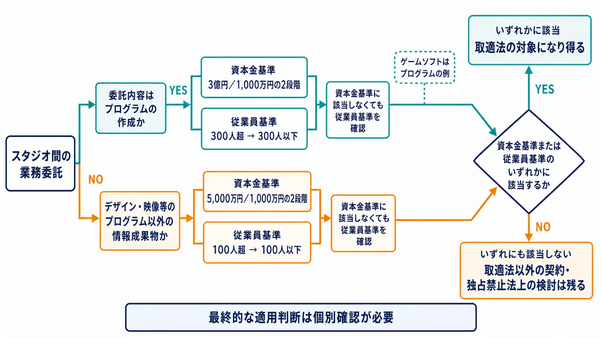
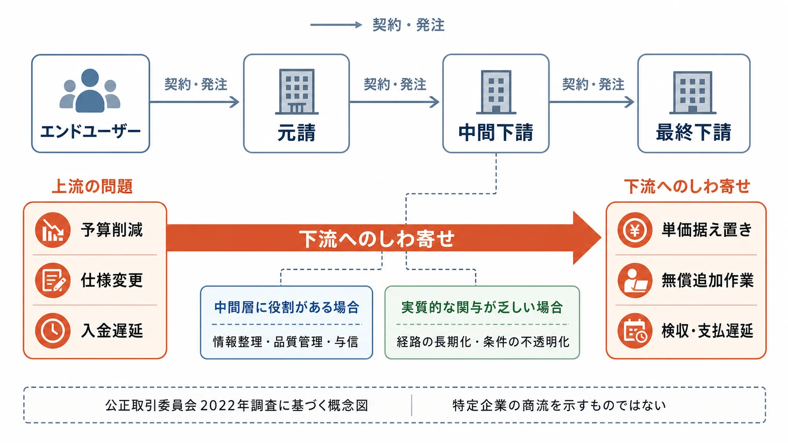

# ゲーム受託開発と取適法――中小デベロッパーの現場で気づく契約リスク

> **注意：** 本稿は法的助言ではありません。取適法の適用は、当事者の資本金・従業員数だけでなく、委託内容や取引関係によって変わります。具体的な契約条件や法的判断は、必ず弁護士・法務部門に確認してください。

## はじめに――法人間の受託開発は、フリーランス発注とは入口が違う

大手パブリッシャーが中小デベロッパーへゲームの全部または一部を委託する取引では、まず **中小受託取引適正化法（取適法）** の適用を検討する。2026年1月1日に、それまでの下請法が改称・改正されて施行された法律である。スタジオ同士の力関係を、単なる商慣行や「業界では普通」の一言で処理しないための枠組みだ。[[1](#ref-1)]

一方、フリーランス法が主に想定する受注者は、従業員を使用しない個人、または代表者以外の役員がおらず従業員も使用しない法人である。数十人の開発チームを抱えるデベロッパー法人への委託を、個人イラストレーターへの一件発注と同じ入口から判断することはできない。[[2](#ref-2)] 個人クリエイターへの発注、フリーランス法、著作権法27条・28条については、[外部クリエイターへの発注ガイド](game-planner-outsourcing-guide.md)で扱っている。本稿はそこから範囲を切り替え、 **法人対法人・スタジオ対スタジオのゲーム受託開発** に絞る。

プランナーは契約書へ署名する立場でなくても、マイルストーンの受け入れ、仕様変更、修正指示、進捗報告を日々扱う。つまり、契約条件と開発実態のずれを最初に観測しやすい。求められるのは現場で違法性を断定することではなく、異変を記録し、法務や上長が判断できる段階で早く渡すことである。

***

## 1. 2026年からの取適法を、ゲーム開発へ当てはめる

### 1-1. 名称だけでなく、用語と適用範囲が変わった

2026年1月1日、法律の正式名称は「下請代金支払遅延等防止法」から **「製造委託等に係る中小受託事業者に対する代金の支払の遅延等の防止に関する法律」** へ変わった。略称が「中小受託取引適正化法」、通称が「取適法」である。用語も「親事業者」から **「委託事業者」** へ、「下請事業者」から **「中小受託事業者」** へ改められた。[[1](#ref-1)]

改正では、資本金基準に加えて **常時使用する従業員数の基準** が新設された。資本金を小さくしているため従来の基準から外れていた企業でも、従業員規模によって対象になり得る。さらに、中小受託事業者が価格協議を求めたのに協議へ応じない、必要な説明をしないといった形で一方的に代金を決める行為も禁止された。[[3](#ref-3)]

取適法は、企業規模だけで自動的に適用される法律ではない。次の二段階で確認する。

1. 委託が、法律の定める製造委託、情報成果物作成委託、役務提供委託などに当たるか
2. 委託側と受託側が、資本金基準または従業員基準の組み合わせに当たるか

### 1-2. ゲームソフトは「プログラムの作成」に含まれる

経済産業省の情報サービス・ソフトウェア産業向けガイドラインは、「プログラム」の例として **テレビゲームソフト** を明記している。パブリッシャーが販売・提供するゲームソフトの開発を別のデベロッパーへ委託する取引は、典型的には情報成果物作成委託の「プログラムの作成」として検討することになる。[[4](#ref-4)]

ここで、ゲームに関係する成果物をすべて同じ区分に入れてはいけない。ゲーム本体を一体として開発する契約と、キービジュアル、映像、単独のデザインなどプログラム以外の情報成果物だけを作る契約では、適用する規模基準が異なる。契約名が「ゲーム開発業務委託」であっても、実際に何を作成させるかまで確認する必要がある。

### 1-3. 資本金と従業員数には二つの系統がある

取適法の規模基準は、委託内容に応じて次のように分かれる。[[5](#ref-5)]

| 委託内容 | 委託事業者 | 中小受託事業者 |
| --- | --- | --- |
| プログラムの作成など | 資本金3億円超 | 資本金3億円以下 |
| プログラムの作成など | 資本金1,000万円超3億円以下 | 資本金1,000万円以下 |
| プログラムの作成など | 従業員300人超 | 従業員300人以下 |
| プログラム以外の情報成果物作成など | 資本金5,000万円超 | 資本金5,000万円以下 |
| プログラム以外の情報成果物作成など | 資本金1,000万円超5,000万円以下 | 資本金1,000万円以下 |
| プログラム以外の情報成果物作成など | 従業員100人超 | 従業員100人以下 |

資本金基準に該当しない場合でも、従業員基準に該当すれば対象になり得る。ゲーム本体のプログラム作成なら300人、プログラム以外の情報成果物作成なら100人が境目である。なお、表は入口を簡略化したものであり、「常時使用する従業員」の数え方や、複数の成果物を一体で委託する場合の扱いには個別の確認が要る。公正取引委員会は、賃金台帳の調製対象となる労働者を基礎に人数を算定する考え方を示している。[[5](#ref-5)]

取適法の対象になると、委託事業者には発注内容、代金額、支払期日などの明示、受領日から60日以内のできる限り短い期間での支払期日の設定などが求められる。また、中小受託事業者に責任がない受領拒否、代金減額、買いたたき、不当な給付内容の変更・やり直しなどが禁止される。[[5](#ref-5)] 現場で起きる仕様変更や検収の停滞は、この条文上の問題へつながり得る事実である。

***

## 2. 多重委託では、上流の問題が下流へ形を変えて届く

公正取引委員会は2022年、資本金3億円以下のソフトウェア業2万1,000社へのアンケートと関係者ヒアリングを基に、ソフトウェア業の取引実態を調査した。そこでは、エンドユーザー、元請、中間下請、最終下請と連なる構造の中で、上流の予算不足、値下げ、仕様変更、入金遅延が下流へ連鎖する **「下流しわ寄せ型」** の問題が示されている。[[6](#ref-6)]

調査の法人アンケートでは、「下請法の禁止行為に該当するのではないか」と感じた経験について、 **買いたたき15.7%**、 **不当な給付内容の変更14.2%**、 **下請代金の減額13.5%**、 **受領拒否9.6%**、 **不当なやり直し8.1%**、 **支払遅延・不払い7.4%** という回答割合だった。質問ごとに回答者数が異なり、厳密な法適用の有無を問わず取引上の経験を尋ねた集計であるため、そのまま法違反率とは読めない。[[7](#ref-7)]

同じ調査にある **25.9%・18.5%・29.2%・33.5%** は、違反行為の種類を並べた数字ではない。「多重下請構造の下、商流上は形式的に関与するものの、業務や与信などで実質的な貢献をしていない『中抜き』事業者」の存在を感じたことがある割合であり、全体25.9%、元請18.5%、中間下請29.2%、最終下請33.5%である。下流ほど割合が高い点は、商流の全体像が見えにくく、情報の伝言回数と価格差が増える問題を示す。[[6](#ref-6)]

ただし、中間に企業が入ること自体が問題なのではない。与信、調達、仕様整理、品質管理、複数チームの統合など、商流上の役割があれば中間層には意味がある。警戒すべきなのは、開発上の判断に関わらない企業が増える一方で、問い合わせの経路だけが長くなり、責任・価格・検収条件が不透明になる構造である。

***

## 3. アラート1――「完了」の定義がないままマイルストーンが進む

ゲーム開発では、最終成果物を一度に納めるリスクを分割するため、マイルストーンごとに期限と中間成果物を定める。CEDEC 2009でスクウェア・エニックス法務・知的財産部が示した講演資料も、パブリッシャーは最終段階まで成果を見られないリスクを、デベロッパーは完成後に不可とされるリスクを負うため、マイルストーンが双方のリスクを分ける手法になると説明している。[[8](#ref-8)]

ところが、現場の呼び名だけが決まり、受け入れ条件が決まっていないことがある。「アルファ」「機能実装完了」「シナリオ組み込み完了」といったラベルがあっても、次が書かれていなければ発注側と受注側の「完了」は一致しない。

- 対象となる機能・ステージ・データの範囲
- 許容する既知不具合の重大度と件数
- 対象ビルド、対象機種、確認環境
- 発注側が確認結果を返す期限と方法
- 不合格となる条件、再提出の範囲、追加費用の扱い
- マイルストーン承認と請求・支払の関係

公正取引委員会の調査には、検収合否の判断基準が明確でないため支払が遅れる、他社担当分の検収が終わるまで自社分も完了扱いにならない、「検収後」とだけ合意して支払期日が決まっていないといった回答がある。検収基準が曖昧な発注や、受注側の承諾がない支払条件の事後変更が、下流への支払遅延につながる構図である。[[9](#ref-9)]

プランナーが気づける兆候は、「今回の完了条件は誰が承認したか」という質問に答えがないことだ。受領と検収を混同し、発注側の社内確認が終わるまで受領日を動かす運用も注意を要する。取適法上の支払期日は、原則として成果物を受領した日から数えるため、検収が長引けば無制限に後ろへ送れるわけではない。[[5](#ref-5)]

***

## 4. アラート2――仕様変更が「相談」ではなく、無償の既定路線になる

ゲーム制作では、プレイテストや技術検証を通じて仕様が変わる。変更そのものをなくすことはできない。問題は、誰の事情による変更か、工数・納期・対価をどう動かすかを協議しないまま、受注側だけが追加負担を引き受けることである。

2022年調査では、発注後に作業内容が変わり、追加費用分が無償対応になったという回答が、不当な給付内容の変更に関する内訳で最も多かった。契約外だった別会社の担当分を割り振られたのに代金が据え置かれた、約束になかった機能追加を無償で求められたといった事例も報告されている。[[10](#ref-10)]

買いたたきは、単に「相場より安く発注した」と感じたら直ちに成立するものではない。取引内容、対価の水準、決定方法などを踏まえた法的判断が要る。ただし、現場では次の組み合わせが強いアラートになる。

- 仕様書や見積りの前提が変わった
- 工数、必要人員、使用ツール、納期のいずれかが増えた
- 受注側が費用または日程の再協議を求めた
- 発注側が協議せず、元の価格と納期を維持した

中小企業庁の取適法講習会テキストは、ゲームソフトを構成するプログラムの作成を代金未定のまま委託し、受領後に十分な協議をせず、通常の対価を大幅に下回る代金を決めた買いたたき事例を掲載している。代金を定められない正当な理由がないのに、未定のまま委託すること自体も発注内容等の明示義務に反する。[[11](#ref-11)]

さらに2026年施行の改正後は、著しく低い代金かどうかだけでなく、中小受託事業者からの価格協議の求めに応じない、必要な説明を行わないといった **協議に応じない一方的な代金決定** も禁止対象になった。[[3](#ref-3)] 現場の変更履歴は、契約上の当初範囲と追加範囲を法務が比較するための重要な資料になる。

***

## 5. 権利帰属は、受注側から渡すものと発注側から預かるものを分ける

### 5-1. 成果物をパブリッシャーへ集約する方向

ゲームはコード、シナリオ、画像、音楽、映像など多数の著作物を組み合わせる。完成後の販売、移植、更新、続編、宣伝で権利者が分散すると利用のたびに確認が必要になるため、開発成果物の知的財産権をパブリッシャーへ集約する契約設計は広く用いられる。CEDEC 2009の講演資料も、パブリッシャーが資金を負担する開発では知的財産権の譲渡を原則的に認める設計が一般的だとする。IDC2024の弁護士講演でも、成果物の範囲と知的財産権の譲渡を具体的に書く重要性が説明された。[[8](#ref-8)][[12](#ref-12)]

争いになりやすいのは、受託案件のために初めて作ったものと、デベロッパーが以前から持っていたものの境界である。たとえば次の三つを一括して「本件成果物」とすると、受注側が別案件でも使う基盤まで譲渡対象に入るおそれがある。

- **案件固有の成果物**：ゲーム本体のコード、固有アセット、仕様書、データ
- **既存資産**：受注前から保有していた汎用エンジン、ライブラリ、制作ツール
- **開発中に生まれた汎用部分**：本件のために作ったが、他作品にも転用できるツールや技術

CEDEC資料も、デベロッパーが保有していた汎用エンジン・ツールと、開発着手後に作った汎用部分を、争いの多い領域として挙げる。[[8](#ref-8)] 契約では、権利を移す範囲だけでなく、受注側に残す既存資産、パブリッシャーへ与える利用許諾、第三者ライセンスの条件まで分ける必要がある。

### 5-2. 社内エンジンや独自ツールを受注側が預かる方向

逆方向の権利と秘密もある。パブリッシャーが保有する社内ゲームエンジン、ビルド環境、デバッグツール、未公開SDK、運用基盤を受託側へ提供する場合、受注側はそれらを開発目的の範囲でのみ使い、アクセス、複製、持ち出し、再委託、返還・消去を管理する立場になる。

一般的なNDAでは、秘密情報を技術情報や営業情報だけに限定せず、契約や協議の存在・内容まで含める設計がある。経済産業省が示す秘密保持契約書の参考例も、「本契約の存在及び内容」を秘密情報に含めている。[[13](#ref-13)] 同じ考え方で、契約の定義次第では、エンジンのソースコードや仕組みだけでなく、 **そのエンジンを使っている事実** 自体が秘密となり得る。

契約期間と秘密保持義務の存続期間も別に読む必要がある。特許庁のモデル契約解説は、契約期間が短くても残存条項によって契約終了後10年など長期間の秘密保持義務を負う場合があると説明する。[[14](#ref-14)] 技術情報の価値が続く間を基準に、無期限または実質的に長期の義務を置く契約もある。企業法務を扱う法律事務所の解説も、極めて重要な情報では無期限または相当程度長い期間を検討する場合がある一方、通常は情報の内容と技術革新の速度に応じて合理的な期間を決める必要があると整理している。[[15](#ref-15)] 対象情報、例外、公知化、独自開発、返還・消去、存続期間を一組で確認したい。

法人がNDAの当事者でも、情報に触れるのは個々の開発者である。実務では、閲覧者をプロジェクトメンバーに限定し、参加者個人から別の秘密保持誓約書を取得することがある。経済産業省の営業秘密管理に関する調査でも、特定プロジェクトの参加時に従業員へ個別のNDA・誓約書への署名を求める例が報告されている。[[16](#ref-16)] その場合、開発者個人は会社の就業規則だけでなく、個別に署名した誓約にも拘束される。退職・異動・契約終了後に何が残るかは、法人間NDAと個人向け文書を分けて確認する必要がある。

***

## 6. プランナーが残すべきなのは、法的評価ではなく比較できる事実である

法務や上長へ「下請いじめかもしれません」とだけ伝えても、契約と開発実態を比較できない。エスカレーション時は、次の情報を時系列でそろえる。

| 現場で見えた兆候 | 残す事実 | 相談時の問い |
| --- | --- | --- |
| マイルストーンの完了条件が揺れる | 当初の受け入れ条件、追加された条件、発言者、日時 | 契約上の検収条件と一致しているか |
| 仕様変更が続く | 変更前後の仕様、見積り前提、追加工数、納期影響 | 追加発注・価格協議が必要か |
| 価格が据え置かれる | 再見積り、協議要請、相手の回答、説明の有無 | 買いたたきや一方的な代金決定の検討が必要か |
| 上流の事情で支払が止まる | 受領日、検収日、請求日、契約上の支払期日 | 60日ルールと支払条件に問題がないか |
| 成果物の範囲が広がる | 案件固有物、既存ツール、汎用化した部分の一覧 | 譲渡対象と利用許諾を分ける必要があるか |
| 発注側ツールへアクセスする | 閲覧者、保存場所、複製、返還・削除、個人誓約 | NDAとアクセス管理の範囲が一致しているか |

口頭会議で決まった変更は、議事録やチケットへ戻す。チャットの一文だけで作業を開始した場合も、誰が、何を、いつまでに、追加費用をどうする前提で依頼したかを確認する。記録は相手を追及するためではなく、双方が「何を合意したか」を再構成するために残す。

また、取適法の基準から外れた取引なら、どのような要求も許されるわけではない。公正取引委員会の2022年調査は、取適法の前身である下請法が適用されない場合でも、取引上優越した地位にある発注者の同様の行為が、独占禁止法上の優越的地位の濫用として問題になり得ると説明している。[[9](#ref-9)][[10](#ref-10)] 適用判定を現場だけで終わらせず、契約と取引実態を法務へ渡す理由がここにある。

***

## まとめ――早期発見は、交渉権限がなくてもできる

スタジオ間のゲーム受託開発では、取適法の適用を「大企業から中小企業への発注だから」と一行で決めることはできない。ゲーム本体のプログラム作成か、それ以外の情報成果物かを分け、資本金と従業員数の組み合わせを確認する必要がある。多重委託では、上流の予算・仕様・入金の問題が、下流で単価据え置き、無償追加作業、検収遅延へ変わる。

契約交渉と法的判断は、法務・上長・弁護士の仕事である。しかし、完了条件が増えた瞬間、仕様変更が追加発注にならなかった瞬間、上流の検収を理由に支払が止まった瞬間を見ているのは、進行を担うプランナーである。変更前後の事実とやり取りを残し、損失が固定化する前にエスカレーションすることには、交渉権限とは別の大きな実務的価値がある。

## References

1. [公正取引委員会「取適法」][1] - 2026年1月1日の施行、法律名・通称の変更を示す。

2. [公正取引委員会「フリーランス法 Q＆A」][2] - 特定受託事業者となる個人・法人の定義を示す。

3. [公正取引委員会「取適法・振興法」][3] - 従業員基準の追加と、協議に応じない一方的な代金決定の禁止などの改正点を示す。

4. [経済産業省「情報サービス・ソフトウェア産業における下請適正取引等の推進のためのガイドライン」][4] - プログラムの例にテレビゲームソフトを挙げ、情報成果物作成委託の類型を説明する。

5. [公正取引委員会「中小受託取引適正化法ガイドブック」][5] - 委託内容別の資本金・従業員基準、明示・支払義務、禁止行為を整理する。

6. [公正取引委員会「ソフトウェア業の下請取引等に関する実態調査報告書」][6] - 多重下請構造、「下流しわ寄せ型」の問題、「中抜き」事業者に関する階層別調査を収録する。

7. [公正取引委員会「ソフトウェア業の下請取引等に関する実態調査報告書（概要）」][7] - 問題行為を経験したとの回答割合と、調査結果の要点を図示する。

8. [CEDEC 2009「ゲームソフト開発業務に関する 開発委託・受託契約の留意事項」][8] - マイルストーン管理、知的財産権の帰属、汎用エンジン・ツールの論点を扱うスクウェア・エニックス法務・知的財産部の講演資料。

9. [公正取引委員会「ソフトウェア業の下請取引等に関する実態調査報告書」65〜66ページ][9] - 曖昧な検収基準と支払遅延、検収を基準とした支払条件の事例を収録する。

10. [公正取引委員会「ソフトウェア業の下請取引等に関する実態調査報告書」67〜70ページ][10] - 仕様変更、追加作業の無償対応、不当な給付内容の変更に関する回答と事例を収録する。

11. [中小企業庁「令和7年度 中小受託取引適正化法テキスト」][11] - ゲームソフトを構成するプログラムを代金未定で委託し、受領後に低い代金を定めた買いたたき事例を掲載する。

12. [ゲームメーカーズ「ゲームの開発にかかわる著作権・特許権を弁護士が解説！契約書のチェックすべき要点が分かる講演をレポート【IDC2024】」][12] - 成果物の仕様、検査・契約不適合、知的財産権譲渡を契約で具体化する必要性を紹介する。

13. [経済産業省「各種契約書等の参考例」][13] - 秘密情報に技術・営業情報のほか契約の存在・内容を含めるNDA例を示す。

14. [特許庁「AI編 秘密保持契約書（新素材）逐条解説」][14] - 契約期間と秘密保持義務の残存期間を分け、終了後も長期間義務が続く場合を説明する。

15. [モノリス法律事務所「秘密保持契約書（NDA）作成におけるチェックポイント」][15] - 秘密保持義務の存続期間は一定期間とする例が多い一方、重要情報では無期限または長期も検討されると説明する。

16. [経済産業省「営業秘密管理に関する実態調査」][16] - 特定プロジェクト参加者へ個別のNDA・誓約書への署名を求める管理例を紹介する。

[1]: https://www.jftc.go.jp/toriteki/
[2]: https://www.jftc.go.jp/fllaw_limited/fllaw_qa.html
[3]: https://www.jftc.go.jp/toriteki_2025/
[4]: https://www.chusho.meti.go.jp/keiei/torihiki/2019/190328shitaukeGL3.pdf
[5]: https://www.jftc.go.jp/file/toriteki002.pdf
[6]: https://www.jftc.go.jp/houdou/pressrelease/2022/jun/220629_sw_03.pdf
[7]: https://www.jftc.go.jp/houdou/pressrelease/2022/jun/220629_02_sw.pdf
[8]: https://cedec.cesa.or.jp/2009/ssn_archive/pdf/sep3rd/BM10.pdf
[9]: https://www.jftc.go.jp/houdou/pressrelease/2022/jun/220629_sw_03.pdf#page=65
[10]: https://www.jftc.go.jp/houdou/pressrelease/2022/jun/220629_sw_03.pdf#page=67
[11]: https://www.chusho.meti.go.jp/keiei/torihiki/download/toriteki_text_r7.pdf
[12]: https://gamemakers.jp/article/2024_12_10_87869/
[13]: https://www.meti.go.jp/shingikai/sankoshin/chiteki_zaisan/fusei_kyoso/pdf/016_03_02.pdf
[14]: https://www.jpo.go.jp/support/general/open-innovation-portal/document/index/ai-v2-nda_chikujouari.pdf
[15]: https://monolith.law/corporate/checkpoints-nondisclosure-agreement
[16]: https://www.meti.go.jp/policy/economy/chizai/chiteki/pdf/h26jittai.pdf

----

この文書は、Perplexity、Claude、OpenAI Codex の3つのAIの支援を受けて著述されたものです。引用画像を除き、MIT License にて提供されています。
