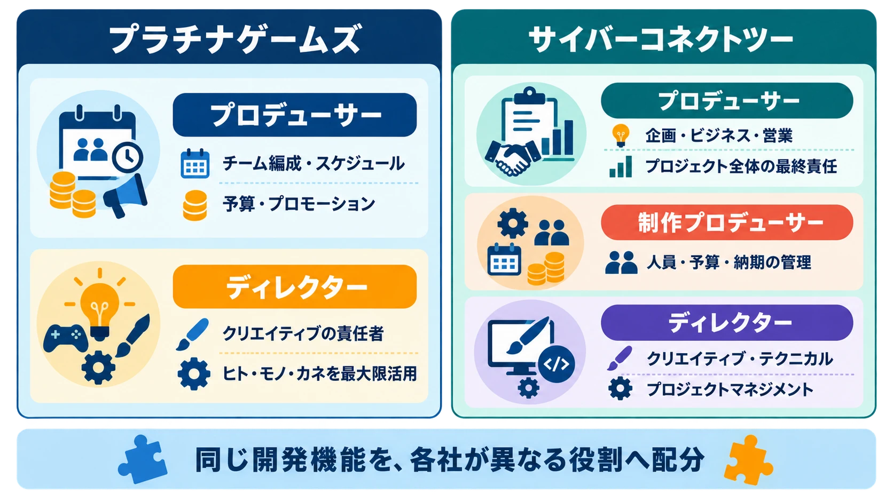
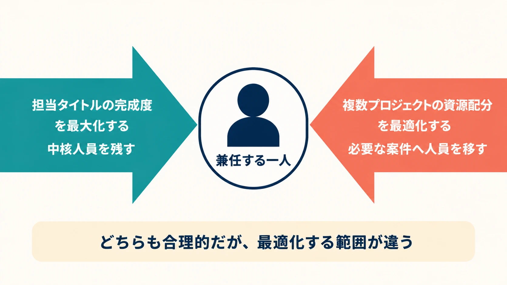

# ディレクターとプロデューサーは何が違うのか――役職の基礎知識

***

## はじめに――二つの肩書き、一つではない境界線

ゲームの公式番組や開発者インタビューでは、「プロデューサー」と「ディレクター」という肩書きをよく目にする。大まかには、ディレクターがゲームの中身を決め、プロデューサーが事業を成立させる役割だと考えればよい。

ただし、「ディレクター＝創作、プロデューサー＝経営」と覚えただけでは、実際の開発体制を読み違える。同じ「ヒト・モノ・カネ」という言葉を使っていても、それを誰が集め、誰が管理し、誰が与えられた範囲で使うのかは、会社によって異なるからだ。

プラチナゲームズの公式ブログでは、プロデューサーを、チーム編成、スケジュール、予算、プロモーションなど、ゲーム制作における「ヒト・モノ・カネ」に関わるすべてを統括する人と説明している。一方、サイバーコネクトツーでは、「制作プロデューサー」が担当プロジェクトの人員、予算、納期などの管理責任を持ち、ディレクターもクリエイティブ、テクニカル、プロジェクトマネジメントの責任者として、決められた「ヒト・モノ・カネ」を活用する。似た言葉を使いながら、管理の単位も役職の組み合わせも同じではない。[[1](#ref-1)][[2](#ref-2)]

どちらも業界の実例であり、優劣で語れるものではない。役職名は、会社ごとに設計された権限と責任を短く呼ぶためのラベルである。本稿では、辞書的な定義を出発点にしつつ、会社、プロジェクト、取引関係によって境界線がどう動くのかを見ていく。

***

## 1. 「ヒト・モノ・カネ」は誰のものか――会社によって違う定義

まず、両者に共通する骨格を押さえておこう。

- **プロデューサー**：企画を事業として成立させ、予算、体制、契約、販売などを含むプロジェクト全体へ責任を持つ。
- **ディレクター**：どのようなゲームを作るかを定め、開発現場を完成形へ導き、クリエイティブな成果へ責任を持つ。

この二分法は便利である。しかし、実務で必要なのは、ここから一段深い問いである。「スケジュールを管理するのは誰か」「人員配置を変えられるのは誰か」「仕様と予算が衝突したとき、最終的に誰が決めるのか」まで確認しなければ、現場の仕組みは分からない。

プラチナゲームズは、プロデューサーをプロジェクト全体の総責任者、ディレクターをクリエイティブの責任者と位置づける。開発スタジオである同社では、発売元となるパブリッシャーへのプレゼンや契約交渉もプロデューサーの仕事である。プロデューサーが「ヒト・モノ・カネ」を引き寄せ、ディレクターはそれを最大限に活用して、決められた期間で最高のものを作るという説明だ。[[1](#ref-1)]

サイバーコネクトツーの説明は、役割をさらに分解する。同社の山岡寛典氏は、ゲームを作って売るための要素を、企画、ビジネス、営業という「ビジネスを立ち上げ、拡げる」領域と、クリエイティブ、テクニカル、プロジェクトマネジメントという「タイトルを制作する」領域に分けている。前者をプロデューサー、後者をディレクターの領域とした上で、同社では両者を支える「制作プロデューサー」も置く。[[2](#ref-2)]

同社の定義では、プロデューサーが企画、ビジネス、営業の方針を決め、品質や納期を含むプロジェクト全体の最終責任を負う。制作プロデューサーは人員、予算、納期などの管理責任を持つ。ディレクターはクリエイティブ、テクニカル、プロジェクトマネジメントの責任を持つ。つまり、プラチナゲームズの説明でプロデューサーにまとまっていた管理機能の一部が、サイバーコネクトツーでは制作プロデューサーとディレクターを含む体制へ展開されている。[[1](#ref-1)][[2](#ref-2)]

*図：同じ開発機能でも、各社はプロデューサー、制作プロデューサー、ディレクターへ異なる形で役割を配分している。*

ここで大切なのは、「プロジェクトマネジメント」という語がディレクター側にあるから、制作プロデューサーは進行管理をしない、と機械的に読むことではない。山岡氏は、実際には境界を厳密に区切らず、制作プロデューサーとディレクターが不足を補い合うとも説明している。役割表は仕事を孤立させる壁ではなく、誰が主担当として判断を引き受けるかを示す基準なのである。[[2](#ref-2)]

したがって、肩書きだけを比べて「こちらの会社ではディレクターの方が強い」と結論づけることもできない。確認すべきなのは、担当領域、最終承認権、他部署や取引先への交渉権、失敗したときに説明を引き受ける範囲である。

***

## 2. 開発会社のディレクターと、パブリッシャー側のプロデューサー

役割の境界線を動かすのは、社内制度だけではない。ゲームが一社だけで作られるとは限らないため、開発会社とパブリッシャーの間にも別の境界線がある。

パブリッシャーは一般に、商品企画、資金、販売、宣伝、プラットフォームとの調整などを担う。開発会社は、契約と企画の条件を受けてゲームを制作する。この関係では、開発会社のディレクターが制作現場の中心にいても、商品としての最終決定権をパブリッシャー側のプロデューサーが持つ場合がある。

バンダイナムコスタジオのディレクター・小柳宗大氏は、ディレクターの役割を、どのようなゲームを作るかを誰よりも方向づけ、チームを完成形へ導くことだと説明している。一方で、プロジェクトによってディレクターの権限は異なり、決定権をパブリッシャー側のプロデューサーが握る場合もあるという。そこでディレクターは、コンセプトに照らしてどの表現と遊びがふさわしいかを判断の軸にする。[[3](#ref-3)]

それでも、開発会社の内部ではディレクターが制作判断の中心にある。小柳氏は、全体方針をディレクターが提示し、各職種のディレクターがビジュアルや技術などの細部へ落とし込む体制も説明している。開発会社とパブリッシャーの間の関係では、これと並行して、パブリッシャー側が企画、予算、販売上の承認を持ち得る。[[3](#ref-3)]

ここには、二つの軸が重なっている。

- **制作組織の軸**：ディレクターが全体方針を示し、職種ディレクターや各担当者が具体化する。
- **事業と契約の軸**：パブリッシャー側のプロデューサーが、商品、予算、契約上の決定を持つ場合がある。

「現場を率いる人」と「プロジェクトの最終決定を持つ人」が常に同一とは限らないのである。開発会社の新人が、自社内の組織図だけを見て承認者を判断すると、ここを見落とす。仕様変更を誰へ提案するのか、追加費用を誰が承認するのか、発売条件との衝突を誰が調整するのかは、社内の職位だけでなく、会社間の契約と窓口によって決まる。

***

## 3. 例外的な統合――プロデューサー兼ディレクターという選択

プロデューサーとディレクターを一人が兼ねる例もある。代表的なのが、『ファイナルファンタジーXIV』でプロデューサー兼ディレクターを務める吉田直樹氏である。

ただし、この体制を「意思決定が速くなる理想形」と一般化するべきではない。吉田氏の就任は、旧版のサービス開始後に開発・運営体制を刷新し、プロジェクトの立て直しと作り直しを同時に進める特殊な局面で行われた。事業上の判断と開発上の判断を一つの方向へ揃える必要があり、それを担える人物へ意図的に権限を集中した、例外中の例外と見る方がよい。

その経緯と旧版が抱えていた問題は、既刊記事「[FF14旧版（1.0）はなぜ崩壊したのか――大型タイトルが開発で破綻する構造](ffxiv-1-0-failure-anatomy.md)」で詳しく扱った。本稿で押さえるべきなのは、兼任という肩書きそのものではなく、なぜ平時の分業を崩してまで意思決定を統合する必要があったかである。

一人へ権限を集めれば、対立する判断をまとめやすくなる。その代わり、情報、承認、説明責任も一人へ集中し、その人物が組織の処理能力を制限する危険が増す。特殊な力量と支援体制を欠いたまま形だけをまねれば、速さではなくボトルネックを作る。

***

## 4. 境界が曖昧になると、何が起きるか――現場の声

公式な役割定義だけでは、分業が崩れるときの感触までは分かりにくい。そこで本章では、note.comで公開された二人の開発者による個人発信も参照する。どちらも企業が確認した公式見解ではなく、記述された経歴や個別現場の真偽を外部から検証できない。業界全体の事実ではなく、一個人の体験談・見解として読む必要がある。

あおばPM氏は、自身の主観を含む説明だと断った上で、プロデューサーとディレクターは会社やプロジェクトによって定義が異なり、領分が重なると述べている。さらに、開発規模が大きくなると、ディレクターが一人で仕様、タスク、スケジュールを把握できなくなり、プランナー、プロデューサー、プロジェクトマネージャーなどへ仕事を分ける必要が生じるという。その分業の過程で、誰が何を決めるかが曖昧になり、プロデューサーやプロジェクトマネージャーが仕様を決める場合もある、というのが同氏の見解である。[[4](#ref-4)]

もう一つの個人発信である文系ゲームクリエイター「雑務屋」氏の記事は、主に運営型タイトルを念頭に置いている。同氏は、一つのプロジェクトにはゲーム開発だけでなく、素材制作、宣伝、広報、顧客対応、デバッグなど複数の領域があり、ゲーム開発を率いるディレクターの責任範囲と、プロジェクト全体の事業判断は同じではないという見方を示す。また、マネタイズやキャンペーンのようなプロデューサー側の判断まで、表に出ているディレクターの責任として受け取られやすいとも述べている。[[5](#ref-5)]

同記事には特定タイトルの体制に関する筆者の推測や強い人物評価も含まれるが、それらは本稿では事実として採用しない。ここで参考になるのは、肩書きと外から見える人物だけでは、実際の責任者を判定できないという問題提起である。

二つの個人発信から見えるのは、役割の重なりそのものが失敗なのではないということだ。ゲーム制作では、面白さ、技術、日程、予算が互いに影響する。サイバーコネクトツーが示すように、制作プロデューサーとディレクターが互いの不足を補うことは、むしろ自然である。[[2](#ref-2)]

危険なのは、補完と無秩序を区別できない状態である。二人が相談することと、二人のどちらが決めるか分からないことは違う。担当外へ意見を出すことと、判断だけを奪って結果の責任を持たないことも違う。境界は多少重なってよいが、少なくとも次の点は明確でなければならない。

- その判断の主担当は誰か。
- 最終承認者は誰か。
- 意見が割れたとき、誰がどの基準で決めるか。
- 決定の影響を、誰がチームと社外へ説明するか。

境界線の目的は、互いの仕事へ口を出さないことではない。協力した結果を、誰も引き受けない状態にしないことである。

***

## 5. 同じ人が、逆方向の判断を同時に下すということ

兼任の難しさは、仕事量が単純に二倍になることだけではない。同じ人物が、異なる範囲を最適化する判断を同時に求められることにある。

現場でしばしば起きる構図を、一般化した例で考えてみよう。ある人物がディレクターとして、「このプロジェクトをどう面白くするか」を決めている。同時にプロデューサー的な立場でもあり、複数プロジェクトの数字と人員状況を見て、必要なら自分のチームから別のプロジェクトへ人を貸し出す判断も担っている。

ディレクターとしては、経験のある担当者を手元に残したい。仕様の理解が深い人が抜ければ、品質だけでなく、残るメンバーへの説明、引き継ぎ、手戻りにも影響する。担当タイトルの完成度を最大化するなら、重要な人員を守るのは合理的である。

一方、プロデューサーとして複数案件に責任を持つなら、自分の担当タイトルだけを守るわけにはいかない。別のプロジェクトが発売直前で止まり、短期間だけ応援を出せば会社全体の損失を抑えられるなら、人員を動かす判断にも合理性がある。こちらが求めるのは、一つの作品の完成度ではなく、プロジェクトを超えた資源配分の最適化である。

つまり、二つの役割は同じ「成功」を見ていても、評価する範囲が異なる。

| 判断する立場 | 守ろうとする範囲 | 人員を貸し出す判断にかかる圧力 |
|---|---|---|
| ディレクター | 担当タイトルの体験と完成度 | 中核人員を残し、品質低下と手戻りを避けたい |
| プロデューサー | 複数案件を含む事業と資源配分 | 全体損失を抑えるため、余力を必要な案件へ移したい |

どちらかが身勝手なのではない。担当プロジェクトの品質を守る判断と、会社全体の資源を生かす判断が、構造的に逆方向の圧力を持つのである。一人が両方を兼ねると、その対立を会議で可視化する前に、本人の頭の中だけで処理しがちになる。どちらを選んでも、自分で自分の責任を裏切った感覚が残り、消耗しやすい。

*図：兼任者には、担当タイトルの完成度と複数プロジェクトの資源配分をそれぞれ最適化しようとする圧力が同時にかかる。*

対処は、兼任を一律に禁止することではない。判断の帽子を分け、議論を外に出すことである。たとえば、人員を動かす前に「担当タイトルへの影響」「他案件を救う効果」「期間」「復帰条件」「代替策」を並べ、別の責任者にも確認してもらう。ディレクターとしての懸念と、プロデューサーとしての結論を同じ言葉で済ませず、どの範囲を最適化した判断かを記録する。

役割を分ける価値は、対立をなくすことではない。正反対の圧力を別々の立場から表に出し、組織として選べるようにすることにある。

***

## まとめ――役割名ではなく、「誰が何にコミットしているか」を見る

ディレクターとプロデューサーの違いは、「作る人」と「売る人」という一文から理解を始められる。しかし、そこで止まると、会社が変わった瞬間に通用しなくなる。

プラチナゲームズでは、プロデューサーが「ヒト・モノ・カネ」を統括し、ディレクターがそれを活用してクリエイティブへ責任を持つ。サイバーコネクトツーでは、プロデューサー、制作プロデューサー、ディレクターに機能を展開し、制作プロデューサーが人員、予算、納期の管理責任を担う。開発会社とパブリッシャーが分かれる案件では、開発会社のディレクターが制作を率いながら、最終決定権をパブリッシャー側のプロデューサーが持つ場合もある。兼任は、こうした境界を一人の中へ畳み込む選択であり、いつでも使える万能の型ではない。

新人プランナーが配属時に確認すべきなのは、肩書きの一般論より、目の前のプロジェクトにおける次の五点である。

1. ゲームのコンセプトと最終的な品質を決めるのは誰か。
2. 予算、人員、納期を変更できるのは誰か。
3. パブリッシャー、開発会社、協力会社との交渉窓口は誰か。
4. 品質と日程が衝突したときの最終承認者は誰か。
5. 意見が割れたとき、どこへエスカレーションするのか。

仕様書を誰へ見せるべきか、追加工数を誰へ相談すべきか、誰の承認で優先順位が変わるのか。この流れを把握せずに働けば、正しい提案を間違った相手へ出し、決まっていないことを決定事項として伝えてしまう。それは新人だから許される用語の勘違いではなく、開発を止め得る実務上の問題である。

肩書きは組織を読む入口にすぎない。見るべきなのは、その人が何を成功させると約束し、どこまで決められ、どの結果を引き受けているかである。「誰が何にコミットしているか」を確かめれば、役職名が会社ごとに違っても、開発の意思決定は読み解ける。

## References

1. [【保存版】ゲームクリエーターの仕事、大解剖！プロデューサーとディレクターってどう違うの？どっちが偉い？][1] - プラチナゲームズ公式ブログ。プロデューサーが統括する「ヒト・モノ・カネ」と、ディレクターが担うクリエイティブ上の責任を説明。

2. [ゲーム開発のプロデューサーとディレクターの境界線][2] - サイバーコネクトツー公式note。執行役員・山岡寛典氏が、同社のプロデューサー、制作プロデューサー、ディレクターの役割を説明。

3. [ディレクターが語る“開発がきっかけで始めたあること”とは？][3] - バンダイナムコスタジオ公式サイト。ディレクター・小柳宗大氏が、制作上の役割と、パブリッシャー側のプロデューサーが決定権を持つ場合について説明。

4. [ゲーム開発プロジェクト上流のプロデューサーとディレクターとプロジェクトマネージャーの三権分立][4] - あおばPM氏による個人のnote記事。外部から真偽を検証できない一個人の体験・見解として参照。

5. [ディレクターとプロデューサー～FGO運営の体制も添えて～][5] - 文系ゲームクリエイター「雑務屋」氏による個人のnote記事。主に運営型タイトルについての、外部から真偽を検証できない一個人の体験・見解として参照。記事内の特定企業・人物に関する推測や評価は、本稿の事実認定には使用していない。

[1]: https://www.platinumgames.co.jp/official-blog/article/10772
[2]: https://note.com/cc2pr/n/n37effeb95433
[3]: https://www.bandainamcostudios.com/creator-interviews/2570
[4]: https://note.com/aobapm/n/na072a4e22e73
[5]: https://note.com/zatsumu_ya/n/n43861405e6bf

----

この文書は、Perplexity、Claude、OpenAI Codex の3つのAIの支援を受けて著述されたものです。引用画像を除き、MIT License にて提供されています。
