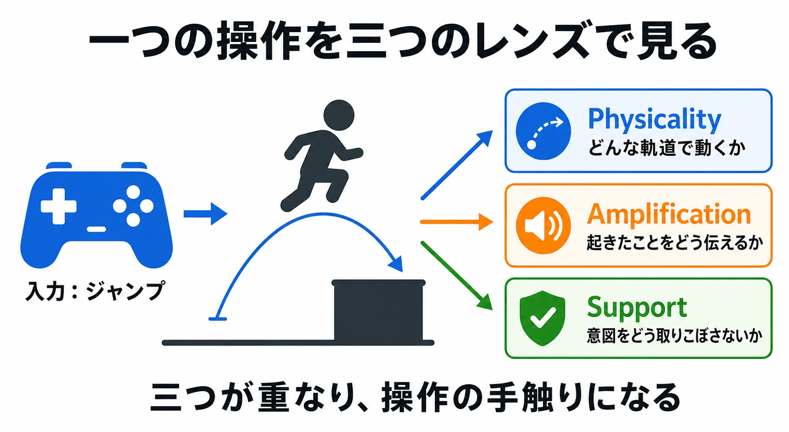
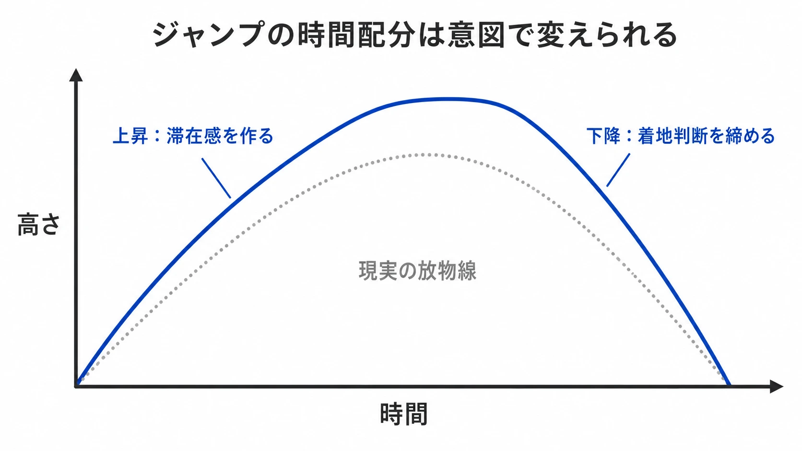
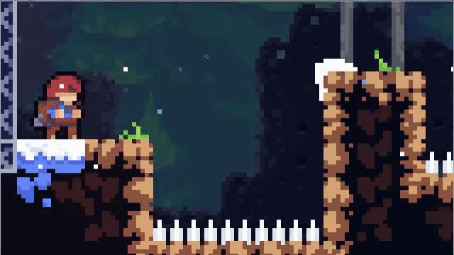

# ゲームフィールとは何か――「気持ちいい操作」を三つの設計領域から読み解く

## はじめに：同じジャンプでも、なぜ手触りは違うのか

スーパーマリオのジャンプを想像してほしい。ボタンを短く押せば低く、長く押せば高く跳べる。任天堂の『スーパーマリオメーカー』の操作ガイドも、歴代の『SUPER MARIO BROS.』系スタイルで「高くジャンプ」をボタン長押しとして示している。[[1](#ref-1)]

一方、パズルゲームには、同じように重力とボタン入力で動くキャラクターでも、音も画面の動きも控えめで、静かに一手を置くようなジャンプがある。どちらも「押すと上がり、重力で落ちる」という規則は似ている。それでも前者は軽快な移動の喜びを、後者は盤面を慎重に読む感覚を生む。

この差を、操作の遅延だけでも、派手なエフェクトだけでも説明することはできない。ゲームデザイナーのSteve Swinkはゲームフィールを「磨き込みで強調された、シミュレートされた空間にある仮想物体のリアルタイム操作」と定義した。[[2](#ref-2)] ここでいうフィールは、入力したこと、画面で起きたこと、その結果を次に予測できることが一続きに感じられる、瞬間ごとの体験である。

本稿は、ジャンプ、ヒットストップ、エイムアシストといった技法が、なぜ同じ「ゲームフィール」の話になるのかを考えるための理論記事である。個々の技法の実装手順は、後述する既存記事に譲る。MikkelsenとWirmanによるDiGRA 2024の研究も、ゲームフィールを情動的な体験として捉え直す課題を示している。[[3](#ref-3)]

***

## 1. ゲームフィールを三つの設計領域に分解する

Martin PichlmairとMads Johansenは、200件を超える研究・実務資料を整理し、ゲームフィールの設計意図を三つの領域に分けた。Physicality、Amplification、Supportである。各領域でいう「磨き込み」は、それぞれTuning、Juicing、Streamliningという異なる仕事になる。[[2](#ref-2)]

| 設計領域 | 問い | 磨き込みの仕事 | 主な働き |
| --- | --- | --- | --- |
| Physicality | この世界の物体は、どう動くのか | Tuning | 一貫性と予測可能性を作る |
| Amplification | 今、何が重要だったのか | Juicing | 出来事の意味と力を伝える |
| Support | プレイヤーは、何をしようとしていたのか | Streamlining | 意図の実行を助ける |

この分け方の利点は、「もっと気持ちよくしてほしい」という一言を、解ける問いへ変えられることにある。移動が浮いて見えるならPhysicality、攻撃が当たったと分からないならAmplification、狙ったのにぎりぎり届かなかったと感じるならSupportを先に疑う。

ただし、三領域は機能ごとの箱ではない。一つのジャンプにも、移動の加速度というPhysicality、着地音や砂煙というAmplification、崖から足を踏み外した直後の猶予というSupportが重なりうる。三つは、同じ瞬間を異なる目的から見るためのレンズである。

*図：一つの操作には、物理法則、出来事の意味づけ、意図の補助が重なっている。*

すでにある [入力遅延の記事](game-input-lag-guide.md) は、ヒットストップ、カメラシェイク、先読みアニメーション、入力バッファリングを遅延の知覚との関係から詳しく扱う、Amplificationの実装を知るためのガイドである。入力バッファリングのようにSupportにも接する技法はあるが、出来事をどう即時に伝えるかという問いを中心に据えている。また、[モーション・アニメーション監修の記事](motion-animation-supervision-basics-for-planners.md) はAmplificationを検収する実務、[コントローラーのハプティクスの記事](controller-haptics-design-guide.md) はAmplificationの一分野である触覚フィードバックを掘り下げたものだ。本稿は個別技法の上位で、三者が一つの操作体験をどう分担しているかを扱う。

***

## 2. Physicality――動きの物理法則を意図的に歪める

### マリオのジャンプは、規則を手に覚えさせる仕組みである

スーパーマリオのジャンプでは、ボタンを押し続ける長さが高度を変える。走ってから跳べば、より高く遠くへ届く。[[1](#ref-1)] プレイヤーは重力加速度の数値を知らなくても、「短く切れば低く、勢いをつければ遠く」という規則を手で覚えていく。

Physicalityは、現実の物理を忠実に再現することではない。加速、減速、空中での方向転換、跳び始めと落下の速度変化、衝突時の押し戻しを、ゲーム固有の物理法則として一貫させることである。そこでいうTuningは、単にパラメータを現実らしくする作業ではない。プレイヤーが次の着地点を予測でき、それでも移動に性格を感じられる値の組み合わせを探す作業である。

たとえば、上昇と下降を同じ重力で扱う必要はない。上昇の終端で少し滞在感を作る、下降を早くして着地判断を締める、といった非対称な時間配分は、現実の放物運動とは異なっていても、操作のためには読みやすい。重要なのは「正しい物理」ではなく、入力と結果の対応が身につく物理である。

*図：ゲーム内のジャンプは、現実の放物運動をそのまま再現せず、操作の目的に合わせて時間配分を変えられる。*

### 重さは、予測できる抵抗から生まれる

重いキャラクターを表現したいとき、移動速度を下げるだけでは、鈍い操作になりやすい。重さは、動き始めに必要な力、止まりにくさ、着地後の安定、攻撃が相手へ及ぼす変化といった関係の中で感じられる。

つまりPhysicalityは、見た目のアニメーションだけの領域でもない。アニメーション、効果音、振動は動きの物理性を伝える助けになるが、土台はキャラクターと世界がどう振る舞うかである。詳しいタイミングやスペーシングの検収は前述の [モーション・アニメーション監修の記事](motion-animation-supervision-basics-for-planners.md) に譲り、本稿では「説得力のある動き」は、予測可能な規則と意図的な誇張の両方から生まれると押さえたい。

### Celesteの「forgiveness」は、判定の境界を静かに動かす

『Celeste』の開発スタジオ公式記事「Celeste & Forgiveness」は、難しい操作を支える複数の猶予を紹介している。コヨーテタイムは、足場を離れた直後でも短時間はジャンプできる仕組みである。ジャンプバッファは、着地の少し前に押したジャンプを、着地した正確なフレームで実行する。[[4](#ref-4)]

これらは画面上ではほとんど見えない。それでも、プレイヤーは「跳びたいと思ったときに跳べた」と感じる。公式記事は、タイミングや位置の許容幅をプレイヤー側へ少し広げる一貫した考え方を示し、難しいゲームでありながら親切に感じられる理由を「成功してほしい」設計意図として説明している。[[4](#ref-4)]

*画像出典（引用）：Maddy Makes Games, [Celeste & Forgiveness](https://www.maddymakesgames.com/articles/celeste_and_forgiveness/index.html). コヨーテタイムの説明に添えられた公式アニメーション。WebP変換。*

分類上、コヨーテタイムとジャンプバッファの中心はSupportである。しかし、それはPhysicalityと切り離せない。表向きの物理法則を保ちながら、判定の境界だけを意図に合わせて調整するからだ。プレイヤーが覚えるべきなのは、フレーム単位の偶然ではなく、跳べるはずの場所とタイミングである。この区別が、理不尽な抜け道と、フィールを支えるforgivenessを分ける。

***

## 3. Amplification――フィードバックが「起きたこと」を伝える

### ヒットストップは、当たった瞬間を読める時間に変える

『大乱闘スマッシュブラザーズ』で攻撃が命中した瞬間、攻撃側と相手の動きがごく短く止まる。これはヒットストップと呼ばれる。画面は一瞬しか止まらないが、その停止によって、接触という短い出来事に輪郭が生まれる。

桜井政博氏は自身のYouTubeチャンネルで、「[8つのヒットストップ仕様 【仕様】](https://www.youtube.com/watch?v=CiQzmwz_Olg)」という回を公開し、『スマブラ』のヒットストップを自ら仕様として組んだものだと説明している。[[5](#ref-5)] ここで重要なのは、停止の役割である。停止はダメージ計算そのものを変える処理ではなく、「今の攻撃は命中した」という出来事を強調するための演出であり、本稿の関心も個々の仕様を再現することではなく、その役割にある。

PichlmairとJohansenの分類では、このような役割はEvent Signification、すなわち画面上で出来事に意味を与えることとして整理される。Amplificationは、プレイヤーを強く感じさせるだけではない。何が成功で、何が危険で、何が決定的だったのかを、知覚できる形にする領域でもある。[[2](#ref-2)]

### Juiceは、意味に合わせてフィードバックを増幅すること

Martin JonassonとPetri PurhoのGDC Europe 2012講演「Juice It or Lose It」は、地味なゲームをライブでより満足感のあるものへ変える試みとして、粒子、音、反応を重ねていく。[[6](#ref-6)] ここから「Juice」は、画面をにぎやかにする言葉として広まった。

しかし、Juicingの核は装飾の量ではない。入力と結果の因果を、プレイヤーが見失わない強さで増幅することである。小さな成功に大爆発を付ければ、重要度の差が消える。逆に、決定打にだけ映像、音、画面、触覚が同じタイミングで応答すれば、その瞬間は大きく感じられる。

ヒットストップ、カメラシェイク、エフェクト、効果音、振動は互いに別の技法だが、同じAmplificationのために協調できる。どの層をどこまで重ねるか、入力遅延の知覚とどう折り合わせるかは、[入力遅延の記事](game-input-lag-guide.md) を参照してほしい。振動を独立した情報経路として扱う際は、[コントローラーのハプティクスの記事](controller-haptics-design-guide.md) が補助線になる。

***

## 4. Support――プレイヤーの意図を先回りする

### エイムアシストは「静かなフィードバック」である

FPSやTPSで照準が敵の近くへ寄ったとき、照準移動をわずかに補助したり、対象を追いやすくしたりすることがある。一般にエイムアシストと呼ばれる設計である。プレイヤーは「ここを狙いたい」と入力しているが、スティックの細かな精度、画面上の距離、敵の移動によって、その意図を完全な座標として出力するのは難しい。

Supportが扱うのは、この「入力された値」と「実行したかった行為」のずれである。ゲームは入力をそのまま受け取るだけでなく、状況の中で解釈する。エイムアシストは、その解釈を通じて、プレイヤーの意図を取りこぼさないようにする例である。

良いSupportは、失敗が「判断を誤ったから」起きるのか、「意図した入力を機械が狭く読み取ったから」起きるのかを分け、後者を減らす仕事である。プレイヤーの代わりに遊ぶことでも、成功を保証することでもない。コヨーテタイム、ジャンプバッファ、角への補正、入力の先行受付も、同じ問いへの別の答えになる。

### 見えない補助には、信頼を損なわない境界がある

Supportは目立たないほどよい場合が多い。敵を狙ったはずなのに別の敵へ吸着する、足場を越えたはずなのに過剰な補正で助かる、といった結果は、プレイヤーから制御を奪う。補助があることよりも、「自分がそう操作した」と納得できることが重要である。

そのため仕様では、何を補うかだけでなく、何を補わないかも決める。たとえばエイムアシストなら、対象との距離、画面上の位置、武器種、対戦ルールによって補助の可否を分けうる。ここでの評価軸は補助率の高さではなく、意図と結果の因果が保たれているかである。

***

## 5. プランナーが「フィール」を仕様に落とすには

「もっと気持ちよくしてほしい」は、出発点として有用だが、そのままでは担当者が異なる解決策を選んでしまう。まず観察した現象を三領域の問いへ置き換える。

| 感想 | 最初に立てる問い | 主に見る領域 |
| --- | --- | --- |
| 「ジャンプがふわふわする」 | 加速、重力、空中制御、着地の規則は予測できるか | Physicality |
| 「攻撃が当たった感じがしない」 | 命中という出来事は、視覚・音・時間の変化で読めるか | Amplification |
| 「押したのに技が出なかった」 | 入力は意図に沿って状況依存で解釈されているか | Support |

次に、評価する一操作を小さく切り出す。「通常攻撃を当てる」「段差を越えてジャンプする」「照準を移動する」といった単位で、入力、ゲーム内の変化、プレイヤーが受け取るフィードバック、失敗時の扱いを順に書く。その上で、次のように仕様へ翻訳する。

- Physicalityでは、「重くしてほしい」ではなく、「走り出しは鈍く、最高速度に入った後は止まりにくくしたい。停止操作への反応は保つ」のように、望む関係を書く。
- Amplificationでは、「派手にしてほしい」ではなく、「命中判定の成立を、通常攻撃と決定打で区別して読めるようにする」のように、伝えるべき出来事を書く。
- Supportでは、「優しくしてほしい」ではなく、「足場の端で意図したジャンプを取りこぼさない。ただし空中からの再ジャンプには見せない」のように、守る意図と境界を書く。

三領域を使う目的は、すべての要素に名前を付けることではない。議論の焦点を揃えることにある。フィールの問題を見つけたとき、パラメータを変えるべきか、フィードバックを足すべきか、入力の解釈を見直すべきかを分けられれば、試作と検証の往復は速くなる。

***

## まとめ：一つの操作体験を、三つの目的で設計する

ゲームフィールは、三つの設計領域が積み重なって生まれる体験である。

- Physicalityは、世界の振る舞いを一貫させ、プレイヤーが身体感覚のように予測できる土台を作る。
- Amplificationは、起きた出来事の重要度を伝え、操作の結果に手応えと意味を与える。
- Supportは、入力値の奥にある意図を読み、機械的な取りこぼしを減らす。

マリオのジャンプ、Celesteの猶予、スマブラのヒットストップ、FPSやTPSのエイムアシストは、それぞれ異なる技法でありながら、どれもプレイヤーの期待とゲームの応答の間を丁寧に設計している。三つの設計領域を行き来して見ることで、「気持ちいい」を感想のままにせず、どの関係を変えるべきかという仕様の言葉へ変換できる。

## References

1. [任天堂：『スーパーマリオメーカー』遊び方ガイド（SUPER MARIO BROS.スタイル）][1] - ボタンを長押しすると高くジャンプできることを示す公式操作ガイド。

2. [Pichlmair, M. & Johansen, M.「Designing Game Feel: A Survey」][2] - Swinkのゲームフィール定義を引用し、Physicality／Amplification／Supportという三つの設計領域の分類を提示する学術サーベイ論文。

3. [Mikkelsen, R. & Wirman, H.「Making Sense of 'Game Feel' through Affective Science」（DiGRA 2024）][3] - ゲームフィールを情動科学の観点から捉え直す研究発表。

4. [Maddy Makes Games：「Celeste & Forgiveness」][4] - コヨーテタイムとジャンプバッファを「forgiveness」という設計思想として解説する開発スタジオ公式記事。

5. [桜井政博のゲーム作るには：「8つのヒットストップ仕様【仕様】」][5] - 『スマブラSP』のヒットストップ仕様を、開発者自身が解説する公式動画。

6. [Jonasson, M. & Purho, P.「Juice It or Lose It」（GDC Europe 2012）][6] - フィードバックの重ね方でゲームの満足感を変える技法を紹介した講演。

[1]: https://www.nintendo.co.jp/wiiu/amaj/guide/page_03.html
[2]: https://arxiv.org/abs/2011.09201
[3]: https://doi.org/10.26503/dl.v2024i1.2223
[4]: https://www.maddymakesgames.com/articles/celeste_and_forgiveness/index.html
[5]: https://www.youtube.com/watch?v=CiQzmwz_Olg
[6]: https://www.gdcvault.com/play/1016487/Juice-It-or-Lose

----

この文書は、Perplexity、Claude、OpenAI Codex の3つのAIの支援を受けて著述されたものです。引用画像を除き、MIT License にて提供されています。
