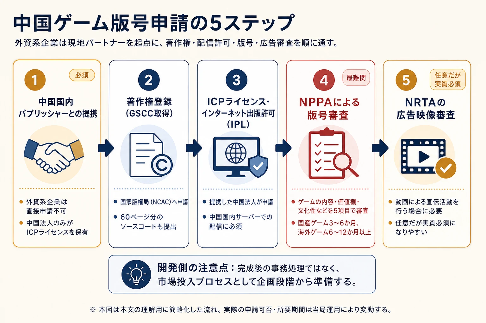

# ゲームにおける各国の審査機関のレギュレーション
## ― 世界リリースを目指す開発者・プランナーのための実践ガイド ―

***

## はじめに

ゲームをグローバルにリリースするとき、最大の壁のひとつが **各国のレーティング審査** だ。国ごとに「何が許容され、何が禁止されるか」の基準は大きく異なり、日本でALL OK だったタイトルが海外でリジェクトされることも、逆に海外タイトルが日本の審査を通過できずに発売中止になることも珍しくない。このレポートでは、主要国の審査機関の仕組み、禁止表現の具体例、審査通過のコツ、そして思わぬ落とし穴を体系的にまとめる。[[1](#ref-1)]

***

## 第1章：世界の主要レーティング機関の全体像

世界には約24のゲーム年齢区分制度が存在する。主要なものを以下に整理する。[[2](#ref-2)]

| 機関名 | 適用地域 | 区分例 | 法的拘束力 |
|--------|----------|--------|----------|
| **CERO** | 日本 | A / B / C / D / Z | なし（業界自主規制だが事実上必須）[[3](#ref-3)] |
| **ESRB** | 北米（米・加・墨） | EC / E / E10+ / T / M / AO | なし（任意だが流通必須） |
| **PEGI** | 欧州35カ国以上 | 3 / 7 / 12 / 16 / 18 | 国によって異なる[[2](#ref-2)] |
| **USK** | ドイツ | 0 / 6 / 12 / 16 / 18 | あり（16歳以下への販売は法規制） |
| **ACB** | オーストラリア | G / PG / M / MA15+ / R18+ / **RC** | あり（RC＝実質的な商業禁止）[[4](#ref-4)] |
| **GRAC** | 韓国 | 全年齢 / 12歳 / 15歳 / 18歳 / 青少年利用不可 | あり（政府機関）[[5](#ref-5)] |
| **NPPA（版号）** | 中国 | 8+ / 12+ / 16+（業界団体CADPAによる適齢提示）[[6](#ref-6)] | あり（版号なし＝違法配信）[[6](#ref-6)] |
| **GAMR（Gmedia）** | サウジアラビア | 3 / 7 / 12 / 16 / 18 / 21 | あり[[7](#ref-7)] |
| **IARC** | モバイル・グローバル共通 | 3+ / 7+ / 12+ / 16+ / 18+ | ストア依存[[8](#ref-8)] |

IARC（国際年齢区分連合）は、開発者がアンケートに答えるだけで複数地域の評価を一括取得できるシステムで、モバイルやインディーゲームの審査コストを大幅に削減する。ただし、韓国GRACはIARCに参加しておらず、別途申請が必要な点に注意。[[9](#ref-9)][[10](#ref-10)]

## コラム：なぜ表現の自由が憲法で保障されている国であってもレーティング審査が必要なのか

「表現の自由があるなら、ゲームにレーティングなど不要ではないか」という疑問はもっともだ。だが、表現の自由が主に制限するのは **国家による検閲や過度な販売規制** であって、親が子どもに何を買い与えるか、プラットフォームがどのような販売ルールを置くか、小売店がどの商品を棚に並べるかまで無条件に保障するものではない。米国最高裁は2011年の *Brown v. Entertainment Merchants Association* で、暴力的ゲームの未成年販売を州法で制限することは合衆国憲法修正第1条との関係で厳格な審査を受けると判断したが、それは「情報提供としての自主的なレーティング」まで否定する趣旨ではない。[[61](#ref-61)]

むしろ米国のESRBは、政府規制を避けるための業界自主規制として生まれた典型例だ。1993年の議会公聴会で暴力表現や性的表現を含むゲームが問題視され、1994年には政府側に評価委員会を設け、業界の対応が十分かを検証する法案まで提出された。こうした政治的圧力の中で、業界は自らレーティング機関を設け、年齢区分・内容記述子・広告/販売上のルールを整備した。[[62](#ref-62)][[63](#ref-63)]

この構造は開発者にとっても重要だ。レーティングは「表現を消すための制度」ではなく、表現を市場に出し続けるための **説明責任のインフラ** である。保護者には購入判断の材料を、小売店やプラットフォームには販売ポリシーの基準を、政府には「業界が未成年保護に無関心ではない」という証拠を示す。結果として、成人向け表現を全面的に禁止するのではなく、年齢区分・販売導線・保護者向け情報によって社会的な摩擦を下げることができる。FTCも米国の主要エンタメ分野を比較した調査で、ESRBを強い自主規制コードとして評価してきた。[[64](#ref-64)]

つまり、表現の自由とレーティング審査は必ずしも対立しない。むしろ自由な表現を行政の直接介入から守り、同時に未成年保護や保護者の選択権を担保するための、業界側の防波堤として機能している。開発者にとってレーティング対応とは、単に「怒られないための事務作業」ではなく、作品をグローバル市場に出し続けるための社会的な合意形成でもある。

***

## 第2章：日本（CERO）の審査基準と禁止表現

### CEROの仕組み

CEROは2002年に審査を開始（2003年に特定非営利活動法人＝NPO法人として認証）した審査機関で、法的拘束力はないものの、PlayStation・Nintendo Switch・Xbox・PCなど主要プラットフォームでの販売には事実上必須の審査機関だ。審査員はゲーム業界と無関係の一般市民（20〜60代、男女）で構成され、1タイトルにつき複数名が審査を担当する。[[11](#ref-11)][[3](#ref-3)]

審査は **性表現・暴力表現・反社会的行為表現・言語/思想関連表現** の4カテゴリ、計27項目に分かれており、それぞれに「上限」が設定されている。上限を超えた表現は **「禁止表現」** と見なされ、いかなるレーティングも付与されない。[[12](#ref-12)]

### CEROの禁止表現（一覧）

#### 性表現における禁止事項
1. 性器および局部（恥毛を含む）の描写
2. 性行為または性行為に関連する抱擁・愛撫等の表現
3. 性的欲求を促進・刺激することを目的とした放尿・排泄等の表現[[13](#ref-13)]

#### 暴力表現における禁止事項
1. 極端に残虐な印象を与える出血表現
2. 極端に残虐な印象を与える身体分離・欠損表現
3. 極端に残虐な印象を与える死体表現
4. 極端に残虐な印象を与える殺傷表現
5. 極端に残虐な印象を与える恐怖[[13](#ref-13)]

#### 反社会的行為表現における禁止事項
1. テーマ上の必然性のない大量殺人・暴行を目的とした表現
2. 規制薬物の不正使用を肯定する表現
3. 虐待を肯定する前提での虐待シーン
4. 犯罪を賞賛・助長する表現
5. **売春・買春等を肯定する表現、および児童買春等の表現**
6. 近親姦、強姦及びこれに準ずる性的行為の直接的・肯定的表現
7. 未成年による飲酒・喫煙を明確に推奨する表現
8. 自殺・自傷を肯定・推奨する表現
9. 不倫を肯定する表現[[13](#ref-13)]

### 重要：「必然性」の判断が鍵

CEROの審査で特徴的なのが、 **「その表現はゲームのテーマ上、必然的か？」** という文脈判断だ。たとえば同じ暴力描写でも、戦争の悲惨さを描くために必要な表現か、単に刺激を目的とした描写かで評価が変わりうる。このグレーゾーンが開発者には悩ましい部分であり、審査基準の詳細数値が非公開であることとあわせて、事前の目安がつかみにくい要因になっている。[[3](#ref-3)][[11](#ref-11)]

***

## 第3章：日本と北米（ESRB）の暴力表現比較

日米間では、 **暴力に対する許容度が大きく異なる**。端的に言えば、**アメリカは暴力に寛容で性表現に厳しく、日本は暴力に厳しく性表現には一定の許容度がある** という傾向がある。[[14](#ref-14)]

### 具体的な評価の差異

| タイトル | CERO評価 | ESRB評価 | 差異の要因 |
|---------|---------|---------|----------|
| *INFAMOUS 〜悪名高き男〜* | **Z（18歳以上）** | **T（13歳以上）** | 日本は暴力を厳しく評価 |
| *ゴールデンアイ 007*（Nintendo Switch Online） | **Z（18歳以上）** | **T（13歳以上）** | 同上 |
| 一部の萌え系アドベンチャー | **A〜B（全年齢〜12歳）** | **M（17歳以上）** | 北米は性的示唆に敏感[[14](#ref-14)] |

### モータルコンバットシリーズの例

*モータルコンバット* シリーズはCEROの禁止表現に該当する「極端に残虐な身体欠損・出血表現」を核心としたゲームデザインのため、 **日本では長年コンシューマー向けに発売されていない**。*Mortal Kombat 11*（2019）もコンソール版は日本・インドネシア・ウクライナでの発売が中止された。[[15](#ref-15)][[16](#ref-16)]

歴史的背景として、1993年に米国SNES版の *Mortal Kombat* は任天堂の自主規制により血液が「汗」に差し替えられていたが、セガのメガドライブ版はチートコードで血液表現を有効化できた。この事件が米国でのESRB設立（1994年）のきっかけのひとつとなった。[[17](#ref-17)][[18](#ref-18)][[19](#ref-19)]

### カリストプロトコルの発売中止

2022年、SFホラー作品 *カリストプロトコル* はCEROの審査を通過できず、 **日本版の発売が全プラットフォームで中止** された。開発元Striking Distance Studiosは「審査通過のために内容を変更すれば、プレイヤーが期待する体験を提供できなくなる」として修正を拒否した。コンソール版とSteam日本語版のいずれも提供不可となった典型的な事例だ。[[20](#ref-20)][[1](#ref-1)]

### ESRB「AO」レーティングの死角

北米では、ESRBの **AO（Adults Only）** レーティングは事実上の商業的死刑宣告を意味する。任天堂・ソニー・マイクロソフトの3社はすべて、AOレーティングのゲームを自社プラットフォーム向けに発売することを禁止しており、大手小売店での販売も断られるケースが多い。ESRBがAOを付与したリリース済みゲームはわずか23本にとどまる。[[21](#ref-21)]

***

## 第4章：「未成年に見える」キャラクターの性的表現禁止

これは世界的に最も厳しく、かつ解釈が多様な領域だ。法的・倫理的リスクが高く、開発段階で十分な対策が求められる。

### 日本（CERO）の扱い

CEROの禁止表現には「**児童買春等の表現**」が明示されており、未成年キャラクターを性的に扱う表現は禁止されている。ただしCERO自体は「キャラクターの外見が未成年に見えるかどうか」という外観の判定基準を数値化して公開してはいない。Zレーティング以上の成人向けコンテンツでも、性的描写そのものに関する禁止表現（性器の描写など）は規制されており、Z指定を取れれば何でも描けるわけではない。[[14](#ref-14)][[13](#ref-13)]

### 北米（ESRB・米国連邦法）

米国では、 **PROTECT法（2003年）** によって、たとえフィクションのキャラクターであっても「外見が18歳未満に見える」性的描写は連邦法違反になりうる。ESRBの審査においても、年齢が明示されていない若年外見のキャラクターの性的表現はAO、もしくは申請拒否の対象になる。[[22](#ref-22)]

### オーストラリア（ACB）

オーストラリアの規制は特に厳格で、 **「18歳未満に見える」人物の性的描写はすべてRefused Classification（RC）** の対象となる。この判断は実際の設定年齢ではなく「外見の印象」で行われる。ビジュアルノベルや萌え系ゲームが狙い撃ちされやすい規制で、控訴費用もAUD 10,000かかるため、インディー開発者にとっては事実上の市場封鎖となる。[[4](#ref-4)]

### 欧州・その他

PEGI・USK・韓国GRACも、外見上未成年に見えるキャラクターの性的表現には極めて厳しい対応を取り、最高レーティングの付与や審査拒否につながる可能性がある。

### 『閃乱カグラ Burst Re:Newal』の事例（ソニーの自主規制）

2018年、*閃乱カグラ Burst Re:Newal* のPS4版はソニーの新方針（Sony Americas/Europe）により「インティマシーモード」の削除を求められた。同機能はPC版（Steam）では削除されず、プラットフォームホルダーによる自主規制がレーティング審査とは別に機能しうることを示した典型例だ。[[23](#ref-23)][[24](#ref-24)]

***

## 第5章：中国の審査フロー ― 世界最難関の5ステップ

中国市場は約7億人のゲーマーを抱える世界最大級の市場だが、審査・許認可プロセスは世界で最も複雑で時間を要する。月間の版号交付数は時期によって変動するものの、近年はおおむね月100本前後にとどまっている。[[6](#ref-6)][[25](#ref-25)]

### 申請の5ステップ

### NPPAの審査5カテゴリ（0〜5点評価）

| カテゴリ | 評価内容 |
|---------|---------|
| 価値観 | 中国の社会主義的価値観に反していないか |
| 独創性 | 既存作品の模倣でないか |
| 制作品質 | クオリティが十分か |
| 文化的コンテンツ | 中国文化への適合度 |
| 開発段階 | リリース準備が整っているか |

いずれか1カテゴリで0点、または合計2点以下だと版号は不交付となる。 **一度申請して2〜3回落とされると、そのタイトルでの中国展開は事実上永久に閉ざされる**。[[25](#ref-25)]

### 中国で禁止されている主なコンテンツ表現

- **血液（色を問わず）**：2019年の新規制でいかなる色の血液も禁止。以前は緑や青の血液で回避していたが現在は不可[[26](#ref-26)]
- **骨・骸骨・死体・欠損描写**：ゾンビゲームやホラー系は修正必須[[27](#ref-27)]
- **「kill」（杀）の文字**：ゲーム内テキストで使用禁止。代替表現が必要[[26](#ref-26)]
- **宗教的シンボル**：十字架・教会・寺院など。中立的なファンタジーシンボルへの差し替えが必要[[27](#ref-27)]
- **政治的・現代史に関わる要素**：台湾問題・天安門・チベット等は即リジェクト
- **賭博要素**：麻雀・ポーカーを含む[[28](#ref-28)]
- **一夫多妻・ハーレム要素**：2019年規制追加[[25](#ref-25)]
- **ゴーストや超自然現象**：「スケルトンキャラ」「幽霊」は修正または削除が必要[[27](#ref-27)]

#### 実例：*PUBG: BATTLEGROUNDS* 中国版
*PUBG: BATTLEGROUNDS* は中国版リリースにあたり、戦場設定を完全に変更し、射撃時の血液エフェクトを光のエフェクトに差し替えた。[[25](#ref-25)]

#### 実例：『あつまれ どうぶつの森』事件（2020年）
*あつまれ どうぶつの森* は中国で正式発売されていなかったが、プレイヤーが香港民主化運動を支持する政治メッセージを作成・拡散したことをきっかけに、2020年4月にタオバオ等のグレーマーケット（並行輸入）での販売が一斉に停止された。ゲーム自体の内容ではなく、UGC（ユーザー生成コンテンツ）が禁止の引き金になった珍しいケースだ。[[25](#ref-25)]

### 未成年保護の技術的要件

中国のゲームには以下のシステム実装が義務付けられている。[[29](#ref-29)][[25](#ref-25)]

- **実名認証システム**：中国の電話番号・ID番号と連携（顔認証の採用も増加）
- **18歳未満の利用時間制限**：金・土・日・祝日の20〜21時のみ（週1時間）
- **年齢別課金上限**：8〜16歳は月200元、16〜18歳は月400元
- **自動ログアウト機能**：制限時間到達時の自動保存と強制ログアウト

***

## 第6章：韓国（GRAC）の審査フロー

### GRACの基本情報

韓国の **GRAC（ゲーム物管理委員会）** は、政府機関によるゲーム審査機関で、デモ・ベータ版を含むすべての「プレイ可能なビルド」に対して審査が必要だ。これは見落とされやすい落とし穴で、早期アクセス版やテストビルドも例外ではない。[[30](#ref-30)][[31](#ref-31)]

### GRAC申請の流れ

1. **ゲームビルドとスクリーンショット・説明資料の提出**
2. **GRAC審査員によるコンテンツ審査**（暴力・性的表現・賭博・薬物・言語等を評価）
3. **レーティング発行**（全年齢 / 12歳 / 15歳 / 18歳以上 / 青少年利用不可）
4. **プレイアブルビルド公開ごとに再申請が必要**（バージョンアップ時も対象）[[30](#ref-30)]

### 韓国特有の規制ポイント

#### ガチャ（ランダムアイテム）の確率開示義務

2024年3月22日施行の **ゲーム産業振興法改正** により、ガチャ等のランダムアイテムの確率をゲーム内・公式サイト・広告に明示することが義務化された。確率の不記載・虚偽表示に対しては文化体育観光部が是正勧告・是正命令を行い、 **この命令に従わない場合は2年以下の懲役または2,000万ウォン以下の罰金** が科される。さらに2024年12月の法改正（公布から6か月後＝2025年に施行）により、表示義務違反で生じた損害を最大3倍まで賠償させる懲罰的損害賠償制度も導入された。[[32](#ref-32)]

#### GaaS（ゲームズ・アズ・ア・サービス）要件

オンラインゲームは以下の実装が義務付けられている。[[30](#ref-30)]

- 実名認証（本人確認）システム
- ゲーム内への依存防止メッセージ表示
- GRAC評価のゲーム内表示
- 保護者向けコントロール機能
- 課金上限設定機能

#### 海外事業者への国内代理人選任義務（2025年10月施行）

**前年度の総売上高が1兆ウォン以上**、または **1日平均1,000件以上のインストール数（韓国版）** を持つ海外ゲーム事業者は、韓国国内に代理人を置くことが2025年10月から義務化された。中規模以上の海外スタジオには直接影響する改正だ。[[33](#ref-33)]

***

## 第7章：欧州・ドイツ・オーストラリアの特殊規制

### ドイツ（USK）：ナチス関連表現の絶対禁止

ドイツでは **刑法第86条a（違憲組織の宣伝手段頒布）** により、ナチスのシンボル（鉤十字など）の使用は「歴史的・芸術的文脈」を問わず原則として違法だ。過去には*Wolfenstein* シリーズや*Sniper Elite* シリーズが鉤十字を差し替えてリリースされてきた（2018年以降、ドイツは表現の自由の観点から一部要件を緩和する判断も下している）。[[34](#ref-34)]

ドイツはまた暴力描写への許容度も低く、*モータルコンバット* シリーズは長年BPjM（青少年に有害なメディアの連邦審査機関。2021年にBzKJへ改組）の禁止リスト（Indizierung）に掲載されてきた。[[34](#ref-34)]

### オーストラリア（ACB）：RC（Refused Classification）の恐怖

オーストラリアでは長年R18+区分がなく、2013年に創設されるまでMA15+が最高区分だったため、多数の成人向けゲームがRCを受けていた歴史がある。RCになると販売・貸出・宣伝・輸入がすべて違法となり、税関で押収・罰金（最大AUD 11万）の対象になる。[[4](#ref-4)]

#### Fallout 3 の薬物名変更事件（2008年）

Bethesdaの *Fallout 3* はオーストラリアで「処方薬（モルヒネ等）の不正使用を促進する」としてRCを受けた。Bethesdaは対応として **全世界版からモルヒネ等の実在薬物名を架空名称に変更** し、再申請によりMA15+を取得した。1地域の規制への対応が全世界版の内容を変えてしまった事例として有名だ。[[35](#ref-35)][[36](#ref-36)]

### PEGIの2026年大規模改革：インタラクティブリスクカテゴリ

2026年3月、PEGIは **インタラクティブリスクカテゴリ** を新設し、マネタイズ・エンゲージメント設計に基づくレーティング変更を導入した。2026年6月以降の新規申請タイトルから適用される。[[37](#ref-37)]

| 機能・仕組み | 最低レーティング |
|------------|--------------|
| 有料ランダムアイテム（ルートボックス） | **PEGI 16** |
| ソーシャルカジノ系ゲーム | **PEGI 18** |
| 時間・数量限定購入オファー | **PEGI 12**（保護者制限ON設定でPEGI 7に緩和可） |
| NFT・ブロックチェーン連携 | **PEGI 18** |
| デイリークエスト等のログインボーナス | **PEGI 7** |
| 報酬のペナルティ付き期限制度（未参加で損失） | **PEGI 12** |
| 通報・ブロック機能なしのオープンコミュニケーション | **PEGI 18**[[37](#ref-37)] |

スポーツゲームや子供向けゲームであっても、 **ルートボックスを実装した瞬間にPEGI 16が確定** する点は特に注意が必要だ。[[37](#ref-37)]

***

## 第8章：中東（UAE・サウジアラビア）の規制

### UAE（NMC管轄）

UAEでは年齢レーティングではなく、コンテンツによる **全面禁止** が採用されている。以下の要素を含むゲームは商業的に販売・配布できない。[[38](#ref-38)]

- イスラム教の宗教的シンボルや文献の不適切な使用
- **同性愛テーマ・LGBTQ+要素**（刑法上も違法）
- 露骨な性的表現・ヌード
- 過度なグロテスク表現
- カジノ・薬物使用の描写[[38](#ref-38)]

私的な所持は禁止されていないが、 **商業的な販売・配布は違法** という点が他国と異なる。[[38](#ref-38)]

### サウジアラビア（GAMR）

サウジアラビアのGAMR（Gmedia。2012年にGCAMとして発足し、後に改組された機関）は、 **21歳以上** という世界的にも珍しい最高年齢区分を2025年に新設した。宗教的配慮のほか、*グランド・セフト・オートV* と *GTAオンライン* が2025年にサウジアラビア・UAEで正式リリースされたことは、MENA地域の規制緩和の転換点として注目されている。[[7](#ref-7)][[39](#ref-39)]

***

## 第9章：審査通過のコツと落とし穴チェックリスト

### 開発初期から取り組むべき設計戦略

#### 1. コンテンツのモジュール化（地域別切り替え設計）
血液エフェクト・言語表現・性的コンテンツなどを「オン/オフ切り替え可能」なモジュールとして設計しておくことで、地域版ごとの修正コストを最小化できる。中国向けのエフェクト差し替えや、オーストラリア向けの薬物名変更が典型例だ。[[26](#ref-26)]

#### 2. 早期にターゲット地域の審査基準を調査する
ローカライズチームと法的レビューを **開発フェーズの最初期** から組み込み、後工程での大規模修正を防ぐ。アート・UI・キャラクターデザインに至るまで、文化的・法的感受性の高い要素を早期に特定する。[[40](#ref-40)][[41](#ref-41)]

#### 3. 中国・韓国向けは必ず現地パートナーを確保する
両国とも、外資系企業が単独で審査申請することは制度上不可能または極めて困難だ。信頼できる現地パブリッシャーとの提携は必須条件と考える。[[42](#ref-42)][[25](#ref-25)]

#### 4. ガチャ・マネタイズの設計は最新規制を確認する
韓国の確率開示義務（2024年）、PEGIのルートボックスPEGI 16化（2026年）など、マネタイズ系の規制は急速に厳格化している。設計段階から各国の最新規制を反映させること。[[32](#ref-32)][[37](#ref-37)]

### 落とし穴チェックリスト

- [ ] **日本（CERO）**：身体欠損・出血の程度を確認。*モータルコンバット* 的な四肢切断は通過不可
- [ ] **日本（CERO）**：キャラクターの「性別・年齢の設定」ではなく「外見の印象」で判断されうる点を認識
- [ ] **北米（ESRB）**：薬物・アルコールに「実在する名称」を使用していないか確認
- [ ] **北米（ESRB）**：AO評価になると主要コンソール・大手小売での販売が実質不可
- [ ] **欧州（PEGI 2026～）**：ルートボックスがあるだけでPEGI 16。スポーツ・子供向けゲームも例外なし
- [ ] **ドイツ（USK）**：ナチス関連シンボル・独裁政権への言及を確認
- [ ] **オーストラリア（ACB）**：薬物名に実在名を使用していないか、未成年に見えるキャラクターの性的描写がないか
- [ ] **中国（NPPA）**：血液・骸骨・宗教シンボル・政治的要素の全排除。UGC機能がある場合は政治的メッセージの抑止設計も必要
- [ ] **中国（NPPA）**：実名認証・プレイ時間制限・課金上限のシステムが実装されているか
- [ ] **韓国（GRAC）**：デモ・ベータ版を含むすべての公開ビルドで審査が必要
- [ ] **韓国（GRAC）**：ガチャ確率の表示義務に対応しているか（2024年3月以降）
- [ ] **UAE・サウジアラビア**：LGBTQ+要素・宗教的シンボル・政治的表現の有無
- [ ] **全地域共通**：IARC対応の場合でも韓国は別途GRAC申請が必要

***

## コラム：レーティング以外でも「使えない」表現がある

ゲームの審査をクリアしても、それだけでは安心できない。世界各地の **法律・条約・知的財産権** によって、レーティング機関とは別に「使用が制限される表現・シンボル」が存在する。見落としがちなポイントをまとめた。

### ① 赤十字マーク（赤新月・赤水晶も含む）

RPGの回復アイテムや医療クレートに「白地に赤い十字」のマークをつけたくなるのは自然な発想だが、これは **世界190カ国以上（ほぼすべての国）が締約するジュネーブ条約** によって使用が厳しく制限されている。[[43](#ref-43)][[44](#ref-44)]

赤十字マークは「戦地・紛争地で傷病者や医療従事者を攻撃から守る保護シンボル」であり、そのマークを誰もが自由に使えると、有事の際に本物の救護施設との区別がつかなくなる危険がある。そのため、正当な権限（日本では日本赤十字社等、米国ではアメリカ赤十字社等）のない者が使用することを、各国の国内法で禁止している。[[45](#ref-45)][[46](#ref-46)][[47](#ref-47)]

日本では **「赤十字の標章及び名称等の使用の制限に関する法律」** により、無許可で使用した場合は **6ヶ月以下の懲役または30万円以下の罰金** が科せられる。米国でも連邦法（18 U.S.C. §706）により、最長6ヶ月の禁錮および罰金が定められている。[[48](#ref-48)][[49](#ref-49)]

ICRC（国際赤十字委員会）は2006年ごろからゲーム業界に対して改善を要請しており、多くのゲームスタジオが自主的にデザインを変更してきた経緯がある。「ゲームのアイコンだから大丈夫」という認識は危険で、 **商用・非商用を問わず** 規制の対象になりうる。[[50](#ref-50)][[48](#ref-48)]

**対処法**：赤十字のような「回復・医療」を示したい場合は、色を変える（白地に緑の十字など）か、十字の形状自体を変形させる（ハートマーク、プラス記号の変形など）のが安全だ。ただし「赤系統の色＋十字形状」の組み合わせは類似と判定されやすいため、色・形の両方を変えることが推奨される。[[51](#ref-51)][[43](#ref-43)]

### ② オリンピックの五輪マーク

五輪マーク（五色のリング）は **IOC（国際オリンピック委員会）が排他的に権利を有する国際的な保護標章** で、IOCおよびその許可を受けたオリンピックスポンサー以外の使用は日本国内では商標法・不正競争防止法等により禁止されている。「オリンピック」「OLYMPIC」という文字も複数の商品分野でIOCが商標登録しており、非スポンサー企業・個人が宣伝広告目的で使用することはできない。[[52](#ref-52)][[53](#ref-53)][[54](#ref-54)]

**ゲームへの影響**：スポーツゲームや国際大会を題材にしたゲームで「架空の五輪風大会」を描く際も、五輪マークを用いることは不可。試合数・競技数・参加国数が実際のオリンピックと酷似している場合、「想起させる」表現としてグレーゾーンに入る可能性もある。[[55](#ref-55)]

### ③ 国旗・国章（パリ条約による制限）

**工業所有権の保護に関するパリ条約** では、加盟国の国旗・国章・公的機関の紋章を商標として登録・使用することを原則禁止している。これはゲームの商標や宣伝ロゴとして国旗をそのまま使用することを制限するものだ。ゲーム内の演出として国旗を表示することは基本的に問題ないが、 **国旗をゲームタイトルのロゴや販促物のデザインに組み込む** 場合は注意が必要となる。[[56](#ref-56)][[57](#ref-57)]

### ④ 国歌・国旗の「改変・冒涜」

多くの国では国歌・国旗の改変や侮辱的な使用を法律で禁止している。日本には国旗・国歌法（1999年）があり、国歌「君が代」の替え歌や冒涜的使用は社会的に問題視される。ゲームで特定国を明示したシナリオや演出を行う場合、対象国の国旗・国歌の扱いには細心の注意が必要だ。[[58](#ref-58)][[59](#ref-59)]

### ⑤ 卍（まんじ）マーク

日本では寺院を示す地図記号として馴染み深い卍マークだが、 **欧米・中東ではナチスの鉤十字（ハーケンクロイツ）と混同されやすく、強烈な反発・配信停止・炎上の引き金** になりえる。特にドイツでは刑法で鉤十字の使用が規制されており、外見が類似している卍も問題視される可能性がある。グローバル配信を前提としたゲームでは、歴史的・宗教的文脈があっても使用を避けるか、文脈説明を加えることが求められる。[[60](#ref-60)]

### ⑥ まとめ：レーティング外のチェックリスト

- [ ] 白地に赤い十字（または類似形状）を使用していないか
- [ ] 赤い三日月・赤いひし形（赤水晶）を無許可で使用していないか
- [ ] 五輪マーク・「オリンピック」の文字を宣伝目的で使用していないか
- [ ] 国旗・国章をゲームロゴや販促物に流用していないか
- [ ] 特定国の国歌を改変・冒涜的に扱っていないか
- [ ] 卍マークが欧米向けビルドに含まれていないか

***

## 結論：「最も厳しい市場」を基準に作るか、地域別に差異化するか

グローバルリリースにおける審査戦略は大きく2つに分かれる。

**①最厳格基準への統一対応**：CEROやNPPAの最も厳しいラインに合わせた1バージョンを制作。修正コストは最小限だが、ゲーム体験が制約される（例：*Fallout 3* の全世界版薬物名変更）。

**②地域別バージョン管理**：コンテンツをモジュール化し、地域ごとに差異化したバージョンを用意。コストはかかるが、各市場で最大限の表現が可能。

どちらが正解かはタイトルの性質と開発リソースによるが、 **「後から修正する」コストは「最初から設計する」コストの何倍にもなる** ことを肝に銘じたい。日本と中国という最大市場のひとつを取りこぼさないためにも、審査レギュレーションは企画フェーズからゲームデザインに組み込む必須要素として扱うべきだろう。[[41](#ref-41)][[40](#ref-40)]

---

## References

1. [The Callisto Protocol gets cancelled in Japan after failing to receive ...][1] - The Callisto Protocol gets cancelled in Japan after failing to receive a rating · The circumstances ...

2. [Adventures in game ratings - Kaspersky][2] - Roughly two dozen video game age rating systems exist worldwide. Most European countries, for exampl...

3. [ゲームの年齢区分マーク「CEROレーティング」との上手な付き合い ...][3] - 審査には禁止表現が設定されており、これが含まれているものにはレーティングが与えられない。禁止表現の具体例は、CEROのホームページにある倫理規定 ...

4. [Video Games Banned in Australia: Censorship & Restricted Titles][4] - Refused Classification (RC) means the game cannot be legally sold, hired, or advertised in Australia...

5. [Game Rating and Administration Committee - Wikipedia][5] - The Game Rating and Administration Committee formerly the Game Rating Board until December 23, 2013,...

6. [ゲーム市場は拡大も、配信許認可に留意（中国・上海発） - ジェトロ][6] - 直近では、2021年7月から2022年3月まで審査が停止され、4月には審査が再開されたが、毎月の許認可作品数は100作品程度になっている。 このような厳しい ...

7. [General Authority of Media Regulation - Wikipedia][7] - (Introduced in 2025) Video game content suitable for ages 21 and above only. ... "Saudi Arabia Devel...

8. [ゲームの対象年齢はどうやって決まる？CEROと海外の違いや ...][8] - 上記のCEROは日本のレーティングですが、海外にも複数のレーティング制度があります。例えば、ESRBがアメリカ、メキシコ、カナダなどで用いられている一方 ...

9. [Age Ratings for Games: A Practical Guide for Game Development ...][9] - Don't know where to start with your game's age rating? This guide will walk you through the essentia...

10. [Now Available: Single age rating system to simplify app submissions][10] - Apps offered in South Korea will use the generic IARC rating. To obtain this rating for your game, f...

11. [日本のゲーム表現規制、CEROはどんな審査を行っている ... - YouTube][11] - サイバーパンク2077やThe Last of Us Part2など、話題のゲームも海外で発売される時と日本で発売される時とで、規制されている表現が違います。

12. [レーティング制度｜特定非営利活動法人コンピュータ ... - CERO][12] - ※審査の対象となる表現項目は、「2．レーティングの対象となる表現項目」の27項目で、それぞれの表現項目には上限があり、上限を超える表現内容を禁止表現とし、禁止表現を ...

13. [意外と知らない!?CEROの審査基準とゲームの規制に関して!! ｜ 株式][13] - 上限以上の過剰な表現は「禁止表現」とされ、該当するゲームには ... 7．未成年による飲酒・喫煙表現を明確に推奨している表現。 8．自殺・自 ...

14. [Computer Entertainment Rating Organization - Rating System Wiki][14] - Games that have a Z rating are still subject to censorship. This mainly has to do with CERO being st...

15. [computer entertainment rating system - NamuWiki][15] - The reason the Mortal Kombat series was banned by CERO was because of this regulation. On the other ...

16. [Mortal Kombat 11 Banned in Other Countries? We've Got You ...][16] - Mortal Kombat 11 has been confirmed to be banned at three countries: Indonesia, Ukraine & Japan. Wor...

17. [TIL that due to Nintendo's strict censorship policy, Mortal Kombat on ...][17] - Due to Nintendo's strict censorship policy, Mortal Kombat on the SNES did not feature blood or as mu...

18. [It's absolutely ridiculous that Nintendo censored Mortal Kombat on ...][18] - On the SNES, Nintendo enforced its family-friendly policies — replacing blood with gray sweat and he...

19. [Understanding Global Age Ratings: A Game Developer's Perspective][19] - The PEGI system is the standard for most European countries. It uses simple age markers like 3, 7, 1...

20. [カリストプロトコル』日本版が発売中止…CEROレーティングを通過 ...][20] - 日本版発売中止の理由については、「現状ではCEROレーティングを通過できず、内容を変更すると、プレイヤーが期待する体験を提供できなくなると判断」したという。 公式 ...

21. [List of AO-rated video games - Wikipedia][21] - All three major video game console manufacturers (Nintendo, Microsoft, and Sony) prohibit AO-rated g...

22. [[PDF] Offenses Involving Commercial Sex Acts and Sexual Exploitation of ...][22] - The word “minor” in this guideline refers to an individual (including fictitious individuals and law...

23. [Sony insists that XSEED censor “Senran Kagura Burst: ReNewal” in ...][23] - According to the game's publisher, XSEED, Sony has insisted that a feature of the game called “intim...

24. [Senran Kagura Burst Re:Newal Censored Due to Sony's "New Policy"][24] - XSEED Games is being forced to delay & censor the western release of the next Senran Kagura game due...

25. [How to publish your games in China: major regulations and things to ...][25] - Any digital publication is required to have a unique International Standard Book Number (ISBN). This...

26. [The Future is Bloodless! China Bans Blood in Video Games][26] - In the past, games that wanted to publish in China could get away with things like “colored” blood—a...

27. [Navigating China's strict gaming regulations for approval - LinkedIn][27] - For example, developers might have to recolor blood to green or completely remove fantasy elements f...

28. [China's New Video Game Rules Officially Ban Blood, Corpses ...][28] - The new regulations also require developers and publishers to divulge more information about a given...

29. [China restricted young people from video games. But kids are ...][29] - In China, strict regulations limit children under 18 to just one hour of online gaming on specified ...

30. [Distribution in South Korea ｜ Meta Horizon OS Developers][30] - GRAC Ratings: South Korea's Game Rating and Administrator Committee (GRAC) requires all playable bui...

31. [Indie game developer region-locks own country due to government ...][31] - In South Korea, every game — including betas and demos — must go through government rating approval ...

32. [National Assembly Passes Amendment to the Game Industry ...][32] - The Disclosure Requirements for loot boxes have been in effect since March 22, 2024. Recently, the N...

33. [ゲーム事業の海外展開〜韓国における国内代理人の選任義務〜 ｜ コラム][33] - 韓国において、海外ゲーム事業者のうち 一定の条件を満たす者 は、韓国内に 「国内代理人」 を選任する義務が創設され、2025年10月23日から施行されます。

34. [[PDF] the effects of national sensitivity to violence on entertainment content][34] - Germany's intolerance for violent entertainment content transcends the expected difficulty with war ...

35. [Australia bans Fallout 3 - GameSpot][35] - ... 3, which states that the game was indeed refused classification because it contains "material pr...

36. [Drug Free In Fallout 3 ｜ Rock Paper Shotgun][36] - Fallout 3 has removed all references to real-world drugs, in order to appease the Australian classif...

37. [PEGI launches “interactive risk categories”; overhauls age…][37] - PEGI launches “interactive risk categories”; overhauls age ratings for loot boxes, in-game spending,...

38. [List of Banned Games in the UAE and Why They're Restricted][38] - Checklist: What NOT to Do When Launching a Game in the UAE · Religious Insensitivity · Sexual Conten...

39. [Grand Theft Approval: A turning point for MENA game regulations][39] - ... games that featured strong violence, sexual content, substance use, or themes conflicting with l...

40. [Regulatory Compliance in The Game Localization Process][40] - This blog will explore why compliance is a foundational part of game localization, the key regulator...

41. [Video Game Localization Examples: Cultural Wins and Fails][41] - From Assassin's Creed Shadows to Black Myth: Wukong – real cultural pitfalls in game localization an...

42. [6 FAQs about ISBN license application for games in China. - LinkedIn][42] - Step 1: Find a local publisher for your game and sign a publishing contract. ; Step 2: Apply for the...

43. [勝手に使っちゃダメ！赤十字マークの取り扱いと本当の意味][43] - 実は赤十字マークはジュネーブ条約で守られたとても意味のあるマークなのです。 ... 無許可の使用や商標登録を禁止しています。 赤十字マークは人々 ...

44. [Navigating The Legalities Of The Red Cross Symbol In Video Gaming][44] - Using the Red Cross emblem in video games without consent can lead to violations of the Geneva Conve...

45. [赤十字マークの意義と使用について][45] - したがって、紛争地域等でこの「赤十字マーク」を掲げている病院や救護員などには、絶対に攻撃を加えてはなりません。これは国際的な取り決め（ジュネーブ ...

46. [赤十字の標章及び名称等の使用の制限に関する法律 - Wikipedia][46] - 本法第1条では、「白地に赤十字、赤新月若しくは赤のライオン及び太陽の標章若しくは赤十字、ジュネーブ十字、赤新月若しくは赤のライオン及び太陽の名称又はこれらに類似 ...

47. [The Red Cross and Video Games ｜ TM TKO Blog][47] - Games have tended to the Geneva symbols in one of two ways: to suggest “health,” and to refer to the...

48. [Videogames and the Red Cross (Updated) - Opinio Juris][48] - The Red Cross has been contacting videogame developers to protest the use of its symbols in their ga...

49. [デザインに赤十字マークは使用禁止！ 不当な使用は法律違反で罰則 ...][49] - 「ジュネーブ条約」と「赤十字の標章及び名称等の使用の制限に関する法律」によって、赤十字のマークは正当な理由なく使ってはいけないとされているのです ...

50. [イラストにおける赤十字マークの使用に関する考察｜おわりあきら][50] - 赤十字マークの使用禁止の根拠: ジュネーブ条約と日本の国内法により ... その中でよっぽど悪質なものは摘発されるだろうが、今のところ具体的な事例はない ...

51. [もしかしたら、やってしまうかも?!デザインで使用禁止のマーク][51] - これは国際的な取り決め（ジュネーブ条約）によって厳格に定められています。 ... 「赤十字」のマークに類似したマークも使用禁止です. オリジナルの色 ...

52. [[PDF] 大会ブランド保護基準 - 東京都オリンピック・パラリンピック調整部][52] - ... 使用禁止（第 17 条）. IOC や IPC は、国際機関として認定されており、オリンピックシンボルは、. 国際機関を表示する標章として、IOC の許可なく使用することはできません ...

53. [オリンピックと知的財産権～その用語やロゴは使って大丈夫？？][53] - （一）「OLYMPIC」又は「オリンピック」の語は、IOCにより、第28類（運動用具関連）、第35類（広告関連）、第41類（スポーツイベント関連）等について商標登録され ...

54. [よくあるご質問｜JOC - 日本オリンピック委員会][54] - これらは知的財産として保護されていますので、権利主体者（国際オリンピック委員会（IOC）や大会組織委員会）の許可なく使用することはできません。詳細はオリンピック等の知 ...

55. [[PDF] オリンピック関連商標の使用に関する課題 - 大和総研][55] - ▫ 現在の JOC の見解では、オリンピックや五輪の文字も入らない表現まで規制する. 方向が示されているが、権利主体である JOC や多額のスポンサー料を払っ ...

56. [Flags in Logos: More Complex Than You Think - Remarkable Europe][56] - Using national flags in brand design raises legal and political questions. When can brands legitimat...

57. [What Signs Cannot Be Registered as a Trade Mark? - LegalVision][57] - National symbols, such as flags and armorial bearings, cannot be registered as trade marks. Common, ...

58. [Is it legally possible to use a national anthem in a game ... - Reddit][58] - It's long out of copyright, which was a maximum of 28 years at the time, by now. You will need to fi...

59. [Who Owns the Copyright to National Anthems? - Hugh Stephens Blog][59] - ... anthem so that he could license it to the government. (No mention of copyright terms was made wh...

60. [ゲームエフェクト制作で使ってはいけないロゴ・マーク][60] - 実際のロゴやシンボルは権利者の許可なく使用しないでください。 赤十字と同じ意味のマーク. 赤十字は特定の国では十字架を連想させるため、赤い三日月を ...

61. [Brown, et al. v. Entertainment Merchants Assn. et al.][61] - The U.S. Supreme Court treated video games as protected speech and applied strict scrutiny to a state sales restriction.

62. [S.1823 - Video Game Rating Act of 1994][62] - The bill proposed an Interactive Entertainment Rating Commission to coordinate with industry and report on the adequacy of its response.

63. [About Us ｜ ESRB Ratings][63] - ESRB describes itself as a non-profit, self-regulatory body established to help consumers, especially parents, make informed choices.

64. [Marketing Violent Entertainment to Children: A Review of Self-Regulation and Industry Practices][64] - The FTC compared entertainment industry self-regulation and discussed the electronic game industry's rating system.

[1]: https://automaton-media.com/en/news/20221027-16440/
[2]: https://www.kaspersky.com/blog/game-ratings/32492/
[3]: https://forest.watch.impress.co.jp/docs/serial/sspcgame/1489218.html
[4]: https://www.juegostudio.com/blog/video-games-banned-in-australia
[5]: https://en.wikipedia.org/wiki/Game_Rating_and_Administration_Committee
[6]: https://www.jetro.go.jp/biz/trendreports/2023/43868c6dbf359b61.html
[7]: https://en.wikipedia.org/wiki/General_Authority_of_Media_Regulation
[8]: https://game-matching.jp/g-job-agent/news_articles/156
[9]: https://www.skala.io/blog/age-ratings-for-games-a-practical-guide-for-game-development-startups
[10]: https://blogs.windows.com/windowsdeveloper/2016/01/06/now-available-single-age-rating-system-to-simplify-app-submissions/
[11]: https://www.youtube.com/watch?v=b9ie3ppcjQs
[12]: https://www.cero.gr.jp/smarts/index/17/
[13]: https://esports-doga.com/cero-judgement/
[14]: https://rating-system.fandom.com/wiki/Computer_Entertainment_Rating_Organization
[15]: https://en.namu.wiki/w/%EC%BB%B4%ED%93%A8%ED%84%B0%20%EC%98%A4%EB%9D%BD%20%EB%93%B1%EA%B8%89%20%EA%B8%B0%EA%B5%AC
[16]: https://play.asia/blog/2019/04/23/mortal-kombat-11-banned-in-other-countries-weve-got-you-covered/
[17]: https://www.reddit.com/r/todayilearned/comments/uak6g/til_that_due_to_nintendos_strict_censorship/
[18]: https://www.facebook.com/groups/retrobitsbobs/posts/1508883576410795/
[19]: https://thedigitalspell.com/global_age_ratings/
[20]: https://gamebiz.jp/news/358894
[21]: https://en.wikipedia.org/wiki/List_of_AO-rated_video_games
[22]: https://www.ussc.gov/sites/default/files/pdf/training/primers/Primer_Sex_Offense_Minors.pdf
[23]: https://thesplintering.com/2018/10/17/welcome-to-the-new-90s-sony-insists-that-xseed-censor-senran-kagura-burst-renewal-in-the-west/
[24]: https://www.youtube.com/watch?v=h7vMuVVVa8U
[25]: https://www.localizedirect.com/posts/how-to-publish-games-in-china
[26]: https://www.gamedeveloper.com/design/the-future-is-bloodless-china-bans-blood-in-video-games
[27]: https://www.linkedin.com/posts/andrey-shepelev-b306b31_in-china-the-hardest-level-isnt-inside-activity-7371437320895422464--yyw
[28]: https://gizmodo.com/chinas-new-video-game-rules-officially-ban-blood-corps-1834221957
[29]: https://theconversation.com/china-restricted-young-people-from-video-games-but-kids-are-evading-the-bans-and-getting-into-trouble-245264
[30]: https://developers.meta.com/horizon/policy/distribution-in-south-korea/
[31]: https://www.facebook.com/groups/132728896890594/posts/3366872683476183/
[32]: https://www.kimchang.com/jp/insights/detail.kc?sch_section=4&idx=31203
[33]: https://legal-leon.jp/column/1118/
[34]: https://scholarsbank.uoregon.edu/bitstreams/3516a780-ea03-4ccf-991f-5242f6b8951c/download
[35]: https://www.gamespot.com/articles/australia-bans-fallout-3/1100-6193496/
[36]: https://www.rockpapershotgun.com/drug-free-in-fallout-3
[37]: https://www.reedsmith.com/articles/pegi-launches-interactive-risk-categories-overhauls-age-ratings-for-loot-boxes-in-game-spending-and-communication-features/
[38]: https://www.juegostudio.com/blog/banned-games-in-the-uae
[39]: https://nikopartners.com/grand-theft-approval-a-turning-point-for-mena-game-regulations/
[40]: https://lcplocalizations.com/regulatory-compliance-in-the-game-localization-process/
[41]: https://www.pangea.global/blog/cultural-pitfalls-in-game-localization-real-examples-and-lessons-learned/
[42]: https://www.linkedin.com/pulse/5-faqs-isbn-license-application-games-china-neo-liu
[43]: https://ilamemo.com/2018/05/redcross/
[44]: https://esportslegal.news/2023/11/11/good-to-know-navigating-the-legalities-of-the-red-cross-symbol-in-video-gaming/
[45]: https://www.jrc.or.jp/information/2022/1005_028731.html
[46]: https://ja.wikipedia.org/wiki/%E8%B5%A4%E5%8D%81%E5%AD%97%E3%81%AE%E6%A8%99%E7%AB%A0%E5%8F%8A%E3%81%B3%E5%90%8D%E7%A7%B0%E7%AD%89%E3%81%AE%E4%BD%BF%E7%94%A8%E3%81%AE%E5%88%B6%E9%99%90%E3%81%AB%E9%96%A2%E3%81%99%E3%82%8B%E6%B3%95%E5%BE%8B
[47]: https://blog.tmtko.com/2017/04/10/the-red-cross-and-video-games/
[48]: http://opiniojuris.org/2006/02/09/videogames-and-the-red-cross-updated/
[49]: https://webtan.impress.co.jp/e/2014/07/08/17778
[50]: https://note.com/vast_auk765/n/nf66b2deaef79
[51]: https://planning-a.jp/column/14769/
[52]: https://www.2020games.metro.tokyo.lg.jp/special/1_1.pdf
[53]: https://www.jpaa-tokai.jp/media/detail_3036.html
[54]: https://www.joc.or.jp/faq/
[55]: https://www.dir.co.jp/report/consulting/other/20140116_008110.pdf
[56]: https://www.remarkable.eu/en/insight/the-complexity-of-flags-in-logos
[57]: https://legalvision.com.au/signs-that-cannot-be-registered-as-trademarks/
[58]: https://www.reddit.com/r/gamedev/comments/1a6dr0/is_it_legally_possible_to_use_a_national_anthem/
[59]: https://hughstephensblog.net/2019/11/18/when-copyright-meets-patriotism-who-owns-the-copyright-to-national-anthems/
[60]: https://lunch-inc.jp/blog/mark_not_use/
[61]: https://supreme.justia.com/cases/federal/us/564/786/
[62]: https://www.congress.gov/bill/103rd-congress/senate-bill/1823
[63]: https://www.esrb.org/about/
[64]: https://www.ftc.gov/sites/default/files/documents/reports/marketing-violent-entertainment-children/vioreport_0.pdf

----

この文書は、Perplexity、Claude、OpenAI Codex の3つのAIの支援を受けて著述されたものです。引用画像を除き、MIT License にて提供されています。
