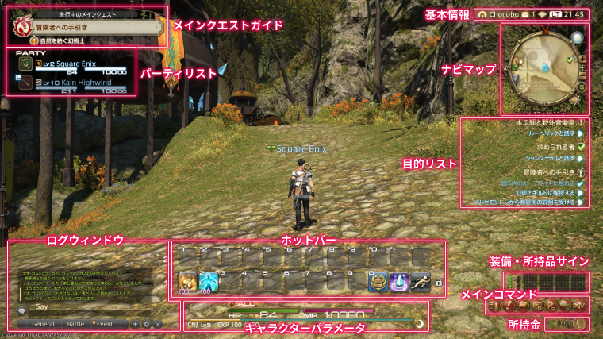
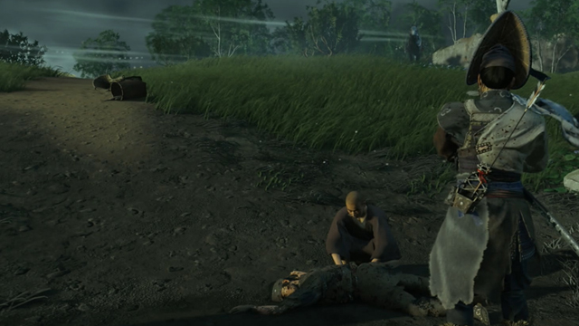

# ゲームのHUDデザイン完全解説
## ──情報量と没入感、相反する二つの要求をいかに両立させるか

***

## はじめに：HUDとは何か

**HUD（Head-Up Display、ヘッドアップディスプレイ）** とは、ゲーム画面の最前面に常時表示される、プレイヤーが必要とするあらゆる情報表示の総称である。HPゲージ、ミニマップ、残弾数、スキルアイコンなどが代表例だ。もともと航空機のコックピットでパイロットが視線を下げずに飛行情報を確認する装置として生まれた概念が、ゲームに転用された。[[1](#ref-1)][[2](#ref-2)]

HUDはUI（ユーザーインターフェース）の一部であるが、両者には明確な違いがある。HUDはゲームプレイ中に画面に重ねて表示される **非インタラクティブな情報表示** であるのに対し、UIにはメニュー操作やインベントリ画面など、プレイヤーが直接触れてゲームと対話するインタラクティブな要素も含まれる。[[3](#ref-3)][[1](#ref-1)]

***

## HUDデザインの歴史：シンプルさから複雑さ、そして再シンプル化へ

### 黎明期：ハードの制約が生んだミニマリズム（1970〜80年代）

初期のアーケードゲーム『Computer Space』（1971年）や『PONG』（1972年）のUIは、得点や残り時間のみを表示する必要最小限のものだった。ファミコン時代になると、ドラゴンクエスト（1986年）に代表される「たたかう」「にげる」「どうぐ」といったコマンド選択式UIが登場し、複雑なゲームを誰でも直感的に遊べるようになった。これは十字キーと数個のボタンしか持たないハードの制約から自然に生まれたデザインであり、「選択肢から選ぶ」スタイルはJRPGの標準として後世に引き継がれていく。[[4](#ref-4)]

### 情報量の爆発期（1990〜2000年代）

3Dへの移行とCD-ROMの普及によって、ゲームの情報量は急増した。1993年の『DOOM』はFPSというジャンルを確立しながら、画面下部に弾薬数・体力・アーマーを一覧表示する大型HUDを導入し、「HUDが演出の一部」になる先例を示した。敵に攻撃されると主人公の顔アイコンが血まみれになるといった表現は、HUDそのものに感情的なフィードバックを持たせる先駆けだった。[[4](#ref-4)]

この時代に登場したMMORPGは、海外RPGのダッシュボード型UIをさらに拡張し、 **常時10個以上のウィンドウを画面上に配置してプレイすること** が一般的となった。一方で日本では同時期に『バイオハザード』（1996年）が体力ゲージをあえて画面に出さず、インベントリ画面で「Fine」「Caution」「Danger」と文字表示する手法を採用し、緊張感を演出するためにHUDを意図的に減らすアプローチが試みられた。[[4](#ref-4)]

### 現代：没入感と情報量のバランスを問い直す時代

2000年代後半以降、「いかに没入感を壊さないか」という設計思想が前景化した。この問いに対する答えは、ゲームのジャンルやコンセプトによって大きく分岐する。多人数協力型ゲームは豊富な情報表示で戦略的プレイを支援する方向を、シングルプレイの没入型ゲームはHUDを極限まで削ぎ落とす方向を追求するようになった。[[3](#ref-3)][[4](#ref-4)]

***

## HUDの4分類：UIデザインの型を知る

HUDの設計思想は、おもに以下の4つに分類できる。[[5](#ref-5)]

| 分類 | 概要 | 代表例 |
|------|------|--------|
| **標準的UI（Functional UI）** | ゲームプレイに必要な情報を機能優先で表示。世界観に依存しない | スーパーマリオシリーズのライフ数・残り時間 |
| **ダイエジェティックUI（Diegetic UI）** | UIがゲーム世界の一部として存在し、キャラクターも認識している | Dead Space（スーツ背中のHPバー）、MGS V（iDroid端末） |
| **ビジュアル・アイデンティティ（Visual Identity）** | UIの見た目をゲームの世界観に統一させるデザイン | ペルソナ5のUI、サイバーパンク2077のネオン風HUD |
| **ナラティブUI（Narrative UI）** | UIがストーリーや環境変化と連動し、物語を強化する | NieR:Automata（HUD要素がプラグイン・チップとして実装されており、外すと該当UIが消える）、UNDERTALE |

とりわけ **ダイエジェティックUI** は没入感の観点から注目されている。代表例である『Dead Space』（2008年）では、主人公アイザックが着るスーツの背中にHPバーが物理的に搭載されており、プレイヤーはキャラクターの目線でリアルタイムに残体力を把握できる。残弾数もアイザックが手にした武器に直接表示されるため、ゲームのUIを「見ている」のではなく「キャラクターの装備を観察している」感覚が生まれる。[[6](#ref-6)][[7](#ref-7)][[5](#ref-5)]

***

> **コラム｜「ダイエジェティック」とはどういう意味か**
>
> もともと映画・物語論の用語で、「物語世界の内部に存在するもの」を指す。劇中の音楽（キャラクターも聞こえる音楽）はダイエジェティック、BGM（キャラクターには聞こえない演出音楽）はノン・ダイエジェティック、というように区別する。ゲームのUIに応用すると、「ゲーム世界の中に道具や物として存在するUI」がダイエジェティックUIとなる。Dead SpaceのスーツHPバーは、ゲーム世界に物理的な装置として存在し、ゲーム内の他キャラクターも視認しうる情報として設定されているため、ダイエジェティックUIの代表例とされる。[[6](#ref-6)][[5](#ref-5)]

***

## MMORPG型：多情報を制するHUDデザイン

### 『ファイナルファンタジーXIV』が示す解答

スクウェア・エニックスの『FINAL FANTASY XIV』（FF14）は、MMORPGにおけるHUDデザインの最良の教科書のひとつだ。このゲームが優れているのは、膨大な情報要素を持ちながら、プレイヤーが **自由に配置・サイズ・透明度を変更できる** カスタマイズ機能を備えている点にある。[[8](#ref-8)][[9](#ref-9)][[10](#ref-10)]

*画像引用: [FINAL FANTASY XIV ゲームマニュアル - ゲーム画面の見方](https://jp.finalfantasyxiv.com/game_manual/view/)（公式ゲームマニュアル掲載スクリーンショット, © SQUARE ENIX。本文中のHUD表示例の説明に必要な範囲で引用）*

FF14が提供するHUD要素は非常に多岐にわたり、主要なものだけでも以下のように分類される：[[11](#ref-11)]

**自キャラ関連**
- キャラクターパラメータ（HP/MP）
- バフ・デバフステータス情報
- ジョブHUD（ジョブ固有のゲージ。戦士のビーストゲージ、黒魔道士のポリグロット等）
- 経験値バー

**戦闘関連**
- ターゲット情報（HP、バフ・デバフ、詠唱バー）
- フォーカスターゲット情報
- 敵対リスト（ヘイトリスト）
- リミットゲージ
- ホットバー（最大10個）、EXホットバー、クロスホットバー

**パーティ関連**
- パーティリスト
- アライアンスリスト（24人レイド用）

**探索・情報関連**
- ナビマップ（ミニマップ）
- 目的リスト/コンテンツ情報
- メインクエストガイド
- 所持金

これだけの要素が存在するのは、FF14が **1人で冒険するゲームではなく、4〜8人パーティ（アライアンスレイドでは最大24人）が役割を分担して戦う協力型ゲームである** からだ。タンク・ヒーラー・DPSという三者のロールは、それぞれ見るべき情報が異なる。[[12](#ref-12)][[13](#ref-13)]

### ロール別・必要情報の違い

| ロール | 最優先で見る情報 | 不要な情報 |
|--------|----------------|----------|
| **タンク** | 自分のHP・バフ、敵の詠唱バー、敵対リスト | 味方のHP/MP |
| **ヒーラー** | パーティリスト（全員のHP）、バフ・デバフ | 敵対リスト |
| **DPS** | 自分のバフ・デバフ、敵のバフ・デバフ（DoT更新確認）、スキルリキャスト | 味方のHP/MP（基本的に） |

[[12](#ref-12)]

このような差異があるため、FF14では **ジョブごとにHUDレイアウトを4パターンまで保存・切り替えが可能** であり、熟練プレイヤーはジョブ変更と同時に画面レイアウトも切り替えるのが常識となっている。[[9](#ref-9)][[8](#ref-8)]

また、ジョブHUDには「ノーマルモード」と「シンプルモード」の2種類があり、視覚的に複雑なゲージをコンパクトにまとめることができる。戦闘に集中するため、視点移動を最小化する工夫として「戦闘関連HUDを画面中央付近に集める」配置が基本とされる。[[14](#ref-14)][[9](#ref-9)][[12](#ref-12)]

***

> **コラム｜なぜMMORPGのHUDはあんなに多いのか**
>
> MMORPGが多量の情報を必要とする理由は、 **「自分の行動が仲間の生死に直結する」** という協力ゲームの根本設計にある。タンクが敵の注意を集めなければヒーラーが倒れ、ヒーラーが回復しなければタンクが倒れ、DPSが火力を出さなければ制限時間内にボスを倒せない。それぞれの意思決定に必要な情報量は、シングルプレイとは比べものにならない。[[13](#ref-13)][[15](#ref-15)]
>
> さらにFF14では「スキルをいつ使うか」の判断自体が高度な戦略になっており、GCD（グローバルクールダウン）とアビリティのリキャスト管理、敵の詠唱バーを読んだ回避行動、パーティのバフ合わせなど、 **複数のタイムラインを同時に処理する認知負荷** が存在する。これだけの情報を適切に扱うためにHUDは不可欠であり、「表示が多い＝良くない設計」ではなく「適切な情報を適切な場所に置く設計の妙」こそが問われる。[[16](#ref-16)][[3](#ref-3)][[12](#ref-12)]

***

## 没入型シングルプレイ：HUDを消すことで生まれる体験

### 『ゴースト・オブ・ツシマ』が示した"風の哲学"

2020年にサッカーパンチ・プロダクションズが開発したオープンワールドゲーム『Ghost of Tsushima（ゴースト・オブ・ツシマ）』は、HUDデザインの新境地を開拓した作品として語り継がれている。[[17](#ref-17)]

同作の最大の特徴は、目的地を示すマーカーを「風の向き」で表現したことだ。プレイヤーが左スティックを傾けて進みたい方向を「念じる」と、ゲーム世界の草木や木の葉が風に流れて目的地の方向を示す。ミニマップもルートラインも存在しない。この「風の導き」の着想について、サッカーパンチ・プロダクションズ創業者でプロデューサーのブライアン・フレミング氏は、ファミ通のインタビューで次のように語っている。[[18](#ref-18)][[17](#ref-17)]

> 「黒澤映画はまさに"静寂"といった感じで、動くものが少ない中で、風が効果的に演出に使われています。本作では、そこから着想を得て、風を道しるべのひとつとして使っています。これによって画面のUIを減らすことができましたし、自然が語り掛けてくれるような印象にもできました。」[[18](#ref-18)]

*画像引用: [GameRevolution - How to use the guiding wind in Ghost of Tsushima](https://www.gamerevolution.com/guides/653064-how-to-use-the-guiding-wind-in-ghost-of-tsushima-ps4)（攻略記事掲載スクリーンショット, © Sony Interactive Entertainment / Sucker Punch Productions。本文中の「風の導き」によるナビゲーション説明に必要な範囲で引用）*

これはただ「HUDを減らした」のではない。 **ゲームの世界観そのものをナビゲーションシステムに変換した** 設計だ。プレイヤーは画面上のUIではなく、ゲーム世界の自然環境を「読む」ことで次の行動を決める。このアプローチはゲームの没入感と、ゲームの舞台である対馬の自然美を同時に高める一石二鳥の解決策となっている。[[19](#ref-19)]

同じく創業者でプログラマーのクリス・ジマーマン氏は、風や動物の案内について「仁と、彼の故郷である対馬を結び付けるという意味でも重要だった」と語っており、UIの削減が単なる「見た目の美しさ」ではなく **ゲームのテーマとナラティブと結びついている** ことがわかる。[[18](#ref-18)]

### ゴースト・オブ・ツシマのHUD要素と設計思想

同作のHUDは以下のような構成で、各要素が「存在感を消す」方向で設計されている：[[20](#ref-20)][[17](#ref-17)]

- **体力ゲージ**：戦闘中のみ表示、通常探索時は非表示
- **スタミナゲージ**：使用時のみ短時間表示
- **ミニマップ**：基本的に非表示（代わりに風の導き）
- **クエストマーカー**：近距離に近づいた時のみ出現
- **アクションボタン表示**：必要な時のみフェードイン

さらに同作は「風の方向のみを表示するモード」も備えており、最も没入感の高い設定では画面上にほぼHUDが存在しない状態でプレイ可能だ。「黒澤モード」というモノクロフィルタと組み合わせると、まるで実際の時代劇映画を操作しているかのような体験が生まれる。[[20](#ref-20)][[17](#ref-17)]

***

> **コラム｜"HUDなしで誘導する"他のゲーム事例**
>
> プレイヤーをHUDに頼らず誘導する手法は、ゴースト・オブ・ツシマだけにとどまらない。
>
> **エルデンリング（フロム・ソフトウェア）**：HP/FP/スタミナゲージは画面左下の片隅に最小限に置かれ、一般的なアクションゲームと比べて著しく存在感が薄い。クエストマーカーはなく、NPCとの会話やアイテムの説明文から行動先を自ら読み解く「探索の喜び」を重視した設計だ。これはフロム作品全般に共通する哲学であり、「教えすぎないことがゲーム体験を深める」という考え方が貫かれている。[[21](#ref-21)]
>
> **ウィッチャー3（CD PROJEKT RED）**：2022年の新世代機対応アップデートで「戦闘中と「ウィッチャーの感覚」使用中以外はミニマップとクエスト目標を非表示にする」オプションが追加された。後からHUD削減機能を追加した例として興味深い。[[22](#ref-22)]
>
> **Dead Space（オリジナル版はEA Redwood Shores／のちのVisceral Games、2023年リメイクはEA Motive）**：上述のダイエジェティックUI設計により、画面上にHUDが一切表示されない。すべてのステータス情報がアイザックのスーツや武器に投影されるため、カメラが常にキャラクターに追随しながらも必要な情報が自然に視野に入る。スペースホラーとしての恐怖体験が画面端の数値表示によって損なわれない、完璧な一体化設計の例だ。[[7](#ref-7)][[6](#ref-6)]

***

## MMORPGと没入型ゲーム：HUD要素の比較

FF14（MMORPG）とゴースト・オブ・ツシマ（没入型シングルプレイ）の対比から、必要要素の差異は明確だ。

| 要素 | FF14 | ゴースト・オブ・ツシマ |
|------|------|---------------------|
| HP/スタミナゲージ | 常時表示（必須） | 戦闘時のみ表示 |
| ミニマップ | 常時表示（必須） | 原則なし（風で代替） |
| ターゲット情報 | HP・詠唱バー・バフ/デバフを常時表示 | 敵の上部に小さく表示 |
| スキル/ホットバー | 最大10個以上のホットバー（必須） | なし（ボタン操作に直結） |
| パーティ情報 | パーティリスト常時表示 | なし（ソロゲーム） |
| ナビゲーション | ナビマップ＋クエストマーカー | 風・動物・自然環境 |
| クエスト目標 | 目的リストとして常時表示 | 接近時のみ出現 |
| リソースゲージ（ジョブ固有） | ジョブHUDとして常時表示 | 気力ゲージ（戦闘時のみ） |

[[17](#ref-17)][[11](#ref-11)][[20](#ref-20)]

この対比が示すのは、HUDに要求されるものがゲームの **根本設計（何人で、何を目的に、どんな状態で遊ぶか）** に完全に従属しているということだ。MMORPGでミニマップを消せばチームプレイが崩壊し、没入型シングルプレイで大量のホットバーを並べれば世界観が崩れる。[[16](#ref-16)][[3](#ref-3)]

***

## 日本で人気のゲームに見るHUDの多様性

日本のゲーム市場で広く親しまれているタイトルのHUD設計を比較すると、さらに多彩なアプローチが見えてくる。

### モンスターハンターシリーズ（カプコン）

モンスターハンター：ワールド／アイスボーンやモンスターハンターライズ／サンブレイクは、体力・スタミナ・切れ味・仲間の情報・マップ・クエスト情報・武器情報・弾薬スライダーなど、多数のHUD要素を個別にオン／オフできる豊富なカスタマイズ機能を持つ。モンスターハンターワイルズでは表示サイズが小さすぎると批判が集まるなど、 **視認性の問題** はいつの時代も重要な設計課題として残っている。[[23](#ref-23)][[24](#ref-24)]

### スプラトゥーンシリーズ（任天堂）

スプラトゥーンのHUDは「インク残量」「スペシャルゲージ」「チームの生存状況」など、同シリーズ固有のゲームメカニクスに特化した独自要素が中心だ。インク塗布状況とチームメンバーの位置を同時に把握できるマップを備え、Xボタンで全画面表示することでスーパージャンプの起点を選択できる仕組みは、シリーズ固有のメカニクスとUIが一体化した好例である。武器やインクカラーに合わせたビジュアル・アイデンティティが強く、ゲームの世界観をUIが体現している。

### バイオハザードシリーズ（カプコン）

初代バイオハザード（1996年）から続く伝統として、HPゲージをあえて画面に常時表示せず（または最小化し）、状態を文字・色・キャラクターの歩行モーションで伝えるアプローチがある。バイオハザードVillage等の近年作では体力バー・武器情報・アイテム管理が必要最小限にまとめられ、サバイバルホラーの緊張感を損なわない設計が維持されている。[[4](#ref-4)]

***

## HUDデザインの実践的原則：ゲームプランナーへの示唆

### 原則1：情報の優先度と緊急度で整理する

HUDに表示する要素を決める際、「重要度（常に必要か）」と「緊急度（即座に確認が必要か）」の2軸で分類すると整理しやすい。HPは緊急度が高いため画面の目につく位置に、所持金は緊急度が低いため隅に小さく置く、といった判断の根拠になる。[[25](#ref-25)]

### 原則2：HUDの位置は「画面の端・隅」が基本

プレイヤーが最も集中する画面中央を情報表示でふさいではならない。固定HUDは上下左右・四隅などに置くのが基本設計だ。視点移動を最小化するため、「最もよく見る情報」を自分の視線の自然な動線上に配置するという考え方が重要になる。[[9](#ref-9)][[3](#ref-3)][[12](#ref-12)]

### 原則3：アダプティブHUD（状況連動型）の活用

「戦闘中のみ表示、探索中は非表示」というアダプティブHUDは、没入感と利便性を両立させる現代的な解答のひとつだ。ゴースト・オブ・ツシマはこの手法を徹底して採用しており、必要な情報が必要な時だけ出現するようにデザインされている。ウィッチャー3のアップデートでも同様の「探索中はミニマップ非表示」オプションが追加され、トレンドとして定着しつつある。[[26](#ref-26)][[22](#ref-22)][[20](#ref-20)]

### 原則4：世界観とUIデザインの一体化

HUDのビジュアルはゲームの世界観に沿って設計する必要がある。例えばサイバーパンク的な世界観にはネオン風のUIが合い、和風時代劇には極力自然に溶け込むUIが求められる。「どのゲームにも通用するHUD」は存在せず、ビジュアル・アイデンティティとしてのHUDがゲーム体験全体の質を左右する。[[2](#ref-2)][[5](#ref-5)][[3](#ref-3)]

### 原則5：プレイヤーに委ねるカスタマイズ設計

FF14の高度なカスタマイズ機能が示すとおり、ひとつの正解はない。初心者にはデフォルトで必要な情報を揃え、上級者には不要要素を消せるよう、段階的なカスタマイズを可能にすることが大規模ゲームでは特に重要となる。「このゲームの使いやすいHUDに正解はない」という事実を開発者自身が認識した上で設計することが、良いHUDデザインの出発点だ。[[27](#ref-27)][[8](#ref-8)]

***

> **コラム｜ゲームプランナーがHUDを設計する際の思考プロセス**
>
> トイロジック社のゲームプランナーによれば、HUD設計においては「作っているゲームと近い要素を持つ作品をプレイし、そのゲームではなぜその表示になっているか、まで細かく検討する」ことが重要とされる。HUDはビジュアルデザインの問題に留まらず、まず「ゲームシステムや、プレイ中の画面映像がどうなるか」をイメージしながら設計することが極めて重要となる。[[28](#ref-28)][[16](#ref-16)]
>
> 優れたHUDプランナーは「プレイヤー視点でHUDに求めるもの」を最優先し、設計の根拠を常にゲームデザインのコンセプトに立ち返って検証する。UIデザイナーは世界観に沿ったビジュアル設計を担い、エンジニアはゲームロジックとHUD表示を同期させるプログラミングを担う。HUD開発はプランナー・デザイナー・エンジニアの三者が一体となったチームワークの産物だ。[[16](#ref-16)][[3](#ref-3)]

***

## まとめ：「正しいHUD」は存在しない

HUDデザインに唯一の正解はない。重要なのは「どんなプレイヤーが、どんな場所で、どんな目的で、どんな状態でゲームをしているか」を徹底的に想像することだ。[[28](#ref-28)][[16](#ref-16)]

FF14が示すように、MMORPGは複数人が役割を担って協調するために豊富な情報表示が不可欠だ。ゴースト・オブ・ツシマが示すように、没入型シングルプレイではHUDをゲーム世界の一部に昇華させることで、より深い体験が生まれる。Dead Spaceが示すように、すべての情報をキャラクターの「体の一部」として表現すれば、プレイヤーは画面を「見る」のでなくキャラクターとして「生きる」感覚が生まれる。[[10](#ref-10)][[5](#ref-5)][[13](#ref-13)][[17](#ref-17)][[6](#ref-6)][[18](#ref-18)]

**HUDはゲームデザインの鏡である。** ゲームが何を伝えたいか、プレイヤーにどんな体験をさせたいかが、そのままHUDの設計に刻まれる。深くゲームを理解したいプレイヤーも、ゲームを作るプランナーも、HUDを「単なる数値表示」ではなく「ゲームデザインの哲学の表れ」として読み解くことで、ゲームという表現媒体がもつ豊かさをより深く味わうことができるだろう。

***

## References

1. [ゲームのHUD（ヘッドアップディスプレイ）とは？特徴やUIとの ...][1] - ゲームで使用する視覚的な要素をデザインするお仕事です。HUDの開発においては、プランナーの作成した仕様書などの資料を元に、画面に表示される情報を ...

2. [UIデザインのフレームワークについて - MAX ANARCHY 開発ブログ][2] - HUD：ヘッドアップディスプレイの略。UIを独立した枠内に表示するのではなく、通常の視野内にオーバーラップで表示する方式。「風景の説明を ...

3. [HUD（ヘッドアップディスプレイ）とは？ゲームにおける役割やUI ...][3] - HUDのデザインや配置は、ゲームの操作感や没入感に直結するため、開発現場では重要な設計項目とされています。本記事では、HUDの基礎知識からUIとの違い、 ...

4. [#02 ゲーセンからスマホまで ビデオゲームUIの歴史｜猫野ミル - note][4] - ファミコン時代の「シンプルさ」から、「情報量の増加」「表現力の向上 ... 進化の時代。特に『Baldur's Gate』(1998年)はPCゲームにおいて ...

5. [UIが作る『没入感』～ナラティブとかってなに？ - ゲーム - note][5] - ・デザイン要素を極力排除することで、画面から圧迫感を消し、没入感を高めている。ダイエジェティックUI（Diegetic UI）. 「UIがゲーム世界の一部として ...

6. [2008年のゲームがこれだけのダイジェティックデザインに挑戦 ...][6] - はい、(ほぼ)あなたが見るものはアイザックも見ています。Dead Spaceは、私が考えられる中で最高のHUDシステムを持っています。

7. [最高にイカした「Dead Space 2」アイザックさんの新スーツ解説 ...][7] - そんなアイザックさんの新スーツの機能解説も含めた画像がGameinformerで公開されました。「Dead Space 2」. 1.ヘルメット; 2.ホログラフィック・ ...

8. [【FF14】HUD（UI）の設定方法とおすすめレイアウト - 神ゲー攻略][8] - キーボード+マウスのレイアウトは、戦闘に関するHUDを画面中央付近に配置し、戦闘に関係ないHUDを画面端に配置するのがおすすめだ。特にホットバーやターゲット情報を近い ...

9. [【FF14】HUD(UI)のおすすめレイアウトと設定方法｜パッド【PS4 ...][9] - おすすめポイント. 戦闘情報を中央に寄せる, 敵は基本画面中央にいるため、戦闘HUDを中央に寄せる事で無駄な視点移動をせずに済む。

10. [HUDってなに？ ｜ UI（ユーザーインターフェース）ガイド][10] - HUDは、Head Up Display（ヘッドアップディスプレイ）の略語で、ゲーム画面に常に表示されている情報をさします。HUDにはたくさんの要素がありますが、使い方に合わせて ...

11. [HUD レイアウト - FFXIV テキストコマンド - Donutland][11] - ホットバー1 ... ホットバー10, Hotbar1 ... ジョブ HUD の指定を省くと、そのジョブのすべてのジョブ HUD の表示形式を一括で変更できる。

12. [【FF14】HUDレイアウトやホットバーを最適化｜rage_tht - note][12] - 今回はゲームを快適にするうえでHUDレイアウトやホットバーをどういう考え方で調節したら良いか？という観点で記事にしました。

13. [【FF14初心者向け】ロール完全ガイド！タンク・DPS・ヒーラーの ...][13] - 『Tank』(以下タンク)：敵の注意を引き付け、パーティを守る盾役 · 『DPS』：攻撃の要として敵に大ダメージを与える攻撃役 · 『Healer』(以下ヒーラー)：傷つい ...

14. [【FF14】HUDレイアウトを調整して戦闘で有利になろう！][14] - 解像度によって見えてくる情報量が違いますし、配置できるスペースも違います。※横の長さ1920pxと3440pxと5360pxの比較 縦は1440pxです. 画面が広い分 ...

15. [FF14におけるタンクとヒーラーのポジション][15] - dpsは一応牽制やアドルがあるので9割くらい火力だけを意識して戦う職で、タンクは攻撃を受けながら「火力を出す」、ヒーラーは回復をしながら「火力を出す ...

16. [ゲームプランナーと HUD のお仕事｜トイロジック - note][16] - HUD と言えば Head-Up Display の略で、一般的に画面最前面に表示される2Dの情報表示の事を指します。ただし3Dアクションゲームの場合は、空間上にある ...

17. [Ghost_of_Tsushima (ごーすとおぶつしま)とは【ピクシブ百科事典】][17] - サッカーパンチプロダクションズが開発し、ソニー・インタラクティブエンタテインメントが発売したアクションゲーム。闇に堕ち、敵を討て。概要2020年7月17日に発売 ...

18. [『ゴースト・オブ・ツシマ』開発者インタビュー。侍を味わうため ...][18] - その開発を手掛けたサッカーパンチ・プロダクションズへのインタビュー ... “風”の導きにしたがって、対馬でのすばらしい冒険を、ぜひ ...

19. [PS4「Ghost of Tsushima」の評価とクリア後のレビュー的な感想 ...][19] - 馬で移動中のゲーム画面には、最小限のHUDしか表示されません。... 【PS4】Ghost of Tsushima (ゴースト オブ ツシマ). ゲームソフト. Amazon ...

20. [ゴーストオブツシマがつまらない？それともおもしろい？][20] - HUDの調整 ... HUD（ヘッドアップディスプレイ）は、画面上に表示されるゲーム情報のことです。体力ゲージやミニマップなど、プレイに必要な情報が表示され ...

21. [ゲーム画面のHUDをさらに小さくする方法【エルデンリング】][21] - エルデンリングに表示されるHUDは一般的なゲームより小さくプレイの邪魔になりにくいことが特徴的です。雰囲気を楽しんでもらうために多くを排除した ...

22. [『ウィッチャー3 ワイルドハント』新世代アプデのパッチノート ...][22] - 戦闘中または「ウィッチャーの感覚」使用中以外は、ミニマップとクエスト目標を非表示にできるオプションを追加。オプション → ビデオ → HUD 設定→ ミニ ...

23. [【MHWilds感想】HUD・UIについて｜はいおみ - note][23] - 画面は大量に空きがあるのである。モンハンライズみたいに体力ゲージを右にいっぱい伸ばしてほしいし、文字とアイコンは3, 4倍デカくしても誰も ...

24. [【MHR:S】UIとHUDの違いは?モンハンライズのHUDで表示/非表示 ...][24] - モンハンライズのHUDは「オプション」＞「GAME SETTING」＞「HUDの表示」から変更することができます。

25. [HUDに表示する情報で、一番重要だと思うのは何？ : r/gamedesign][25] - HUD要素を優先度と緊急度で分類するのは、自分たちのHUD要素をデザインする際に必ず考慮します。... ゲームデザインは、ゲーム開発の一部の分野で、ゲーム ...

26. [戦闘中でない時にHUDを自動で非表示にする方法はありますか？][26] - 「ウィアー・ウィンズ・ミート」をすごく楽しんでいますが、戦闘中でない時や探索している時にHUDを自動で隠す方法があるのか気になっています。

27. [『ファイナルファンタジーXIV』のHUDを調整して戦闘を有利に ...][27] - パーティ全体のデバフを見やすく、自分以外の状況判断を行いやすいよう配置とUIサイズを変更しています。「これくらいでは大して変わらないかな？」と思う ...

28. [プランナーと HUD のお仕事][28] - 開発視点で見た 3DアクションゲームのHUDの特徴. HUD と言えば Head-Up Display の略で、一般的に画面最前面に表示される2Dの情報表示の事を指します。

[1]: https://confidence-creator.jp/column/29605/
[2]: https://www.platinumgames.co.jp/dev-max-anarchy/article/180
[3]: https://game-matching.jp/g-job-agent/news_articles/177
[4]: https://note.com/nekono_miru/n/nfbd92bc55772
[5]: https://note.com/nashisan9/n/n58e5d94e50e1
[6]: https://www.reddit.com/r/DeadSpace/comments/1muiuht/for_a_game_from_2008_to_attempt_this_amount_of/
[7]: https://doope.jp/2009/126556.html
[8]: https://kamigame.jp/ff14/page/250658101198383852.html
[9]: https://game8.jp/ff14/462547
[10]: https://jp.finalfantasyxiv.com/uiguide/know/know-hud/hud_about.html
[11]: https://donutland.jp/edl/eortips/textcommands/hud.html
[12]: https://note.com/rage_tht/n/n6935ab809aec
[13]: https://yuru-hikasen.com/role/
[14]: https://sarachantubuyaki.jp/2020/09/20/hudlayout/
[15]: https://www.ersharifst.com/2020/07/20/thp/
[16]: https://note.com/toylogic/n/n50f037d8431e
[17]: https://dic.pixiv.net/a/Ghost_of_Tsushima
[18]: https://www.famitsu.com/news/202007/18202279.html
[19]: https://gamefavo.com/news/playstation/ghost-of-tsushima-review/
[20]: https://sidejob.normal-happy.info/ghost-of-tsushima-tsumaranai/
[21]: https://logu.jp/elden-pc-mod-minimal-hud/
[22]: https://automaton-media.com/articles/newsjp/20221213-230518/
[23]: https://note.com/honest_kudu2282/n/n4dd6c49e1b5a
[24]: https://www.mhw-blog.com/%E3%83%A2%E3%83%B3%E3%83%8F%E3%83%B3hud%E3%81%A8ui%E3%81%AE%E9%81%95%E3%81%84hud%E8%A1%A8%E7%A4%BA%E9%A0%85%E7%9B%AE%E4%B8%80%E8%A6%A7/
[25]: https://www.reddit.com/r/gamedesign/comments/135msza/what_information_do_you_consider_most_important/
[26]: https://www.reddit.com/r/wherewindsmeet_/comments/1p28o8v/is_there_a_way_to_autohide_the_hud_when_out_of/
[27]: https://gamerszone.jp/post/619
[28]: https://blog.toylogic.co.jp/planner/3865.html
