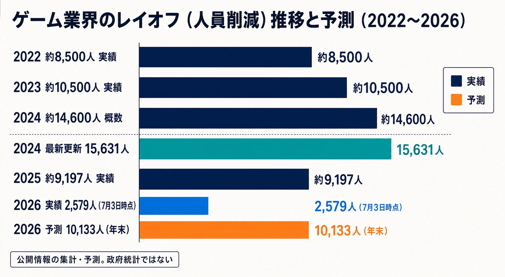
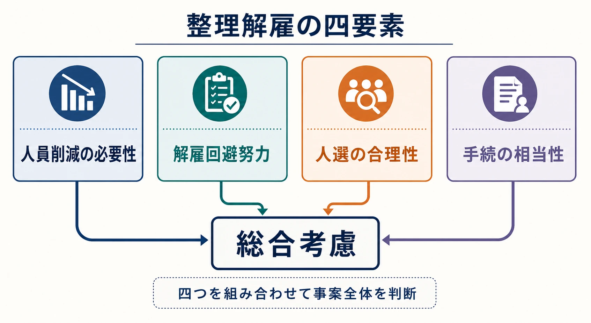
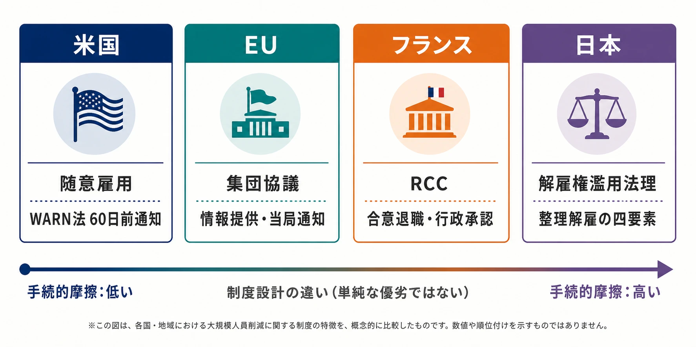
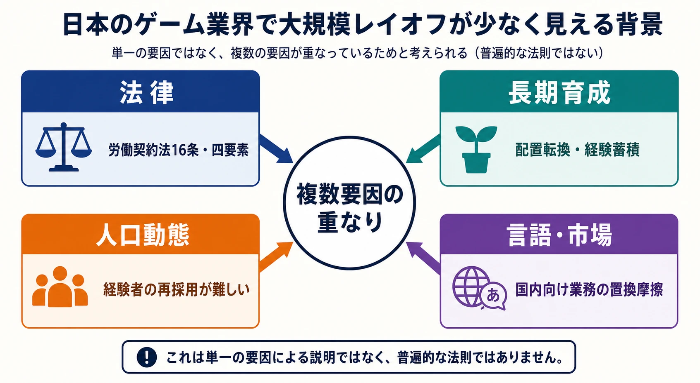
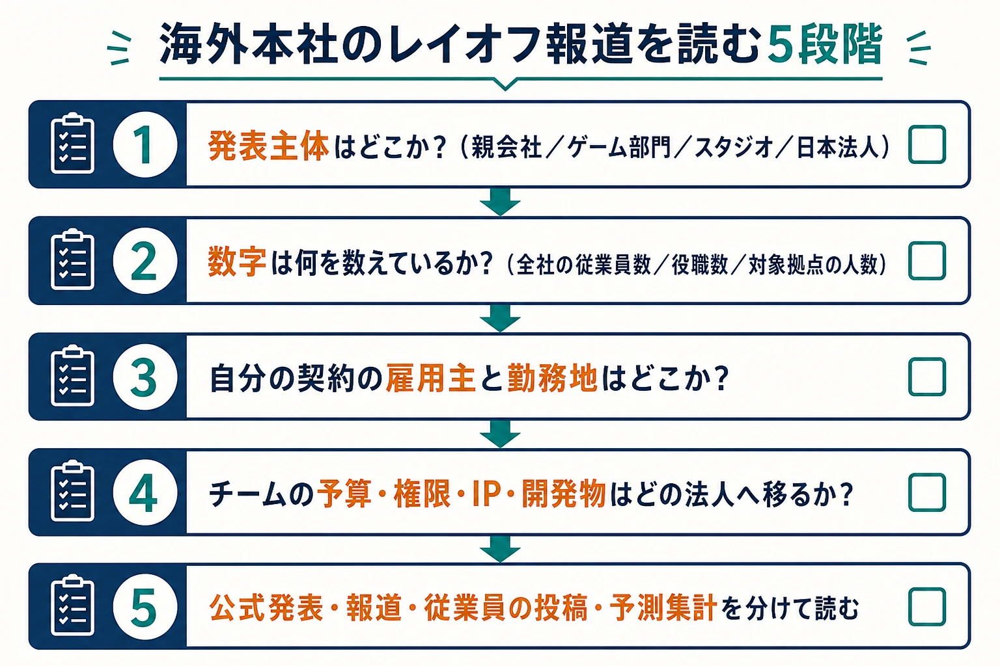

# 欧米ゲーム業界で続く大規模レイオフと、日本の労働法制
### ── なぜ日本のゲーム会社は「解雇しにくい」のか、プランナーは何を見るべきか ──

> **注意：** 本稿は法的助言ではありません。具体的な雇用契約、人員削減、解雇・雇止めの適法性については、必ず弁護士・法務部門に確認してください。労働法令、判例、行政機関の案内は改正・更新されることがあるため、実際の判断では最新の条文・裁判例・公的資料を参照してください。

## はじめに――クランチの裏側を、解雇の法制度から見る

ゲーム開発の終盤に長時間労働が集中する「クランチ」と、プロジェクトや拠点の縮小に伴って人員が削減される「レイオフ」は、別の問題に見える。しかし、どちらも開発計画と雇用のリスクを、誰がどのように引き受けるかという問いにつながっている。

既存記事「[日本のゲーム業界における『クランチ』と労働法制の歴史](game-crunch-labor-law-japan-history.md)」では、クランチとレイオフが裏表の関係にあることに触れた。本稿はその続編として、クランチの原因を再説するのではなく、会社が人員を減らそうとしたときに、国ごとの法制度がどのような違いを生むのかを掘り下げる。

先に結論を置く。「日本では解雇が禁止されている」という意味で日本のゲーム会社が特別なのではない。期間の定めのない労働契約を会社が一方的に終了させる場合、解雇の理由と必要性、回避努力、人選、説明・協議の過程が後から厳しく検討されるため、米国のように大規模な人員削減を短期間で実施しにくいのである。これは日本法人に勤めるプランナーが、海外本社のレイオフ報道を読むときにも重要な前提となる。

***

## 1. 欧米ゲーム業界のレイオフは、どれほど大きいのか

ゲーム業界のレイオフは、政府統計の一つの系列として集計されているわけではない。企業発表、報道、元従業員の情報などを積み上げた民間トラッカーであり、発表時点の概数、同じ出来事を複数回報じた場合の整理、対象を従業員数と役職数のどちらで数えるかによって差が出る。

それでも、Game Industry Layoffs系の集計が示す規模感は、単発のニュースでは説明できない。広く引用されてきた概数と、2026年7月時点の更新値を並べると、次のようになる。[[1](#ref-1)]

| 年 | 集計上の規模 | 読み方 |
|---|---:|---|
| 2022年 | 約8,500人 | 実績の集計 |
| 2023年 | 約10,500人 | 実績の集計 |
| 2024年 | 約14,600人 | 広く引用された概数。最新更新では15,631人に改定されている |
| 2025年 | 約9,197人 | 2024年より落ち着いたが、数千人規模が続いた |
| 2026年 | 7月3日時点で実績2,579人、年末予測10,133人 | 実績と予測を含む。前年実績をやや上回る予測である |

*図：ゲーム業界レイオフの公開情報集計と予測。2026年は7月3日時点の実績と年末予測を色分けしている。*

この表で注意すべきなのは、2026年の10,133人が確定値ではない点である。集計は7月3日までの実績と、残り期間の予測を合算しており、しかも実績値そのものが後日さらに下方・上方に改定されることがある。したがって「2026年のレイオフがすでに10,133人発生した」という意味ではない。一方、前年より落ち着いたという印象だけで危機が終わったと判断するのも早い。[[2](#ref-2)]

個別企業を見ると、2024年1月にはMicrosoft Gamingが約1,900人の役職削減を発表し、同年1月にはUnityが約1,800人、全従業員の約25％にあたる人員削減を公表した。[[3](#ref-3)][[4](#ref-4)] 2月にはElectronic Artsが全従業員の約5％、約670人の削減を発表し、Riot Gamesも約530人、約11％の役職を削減すると発表した。[[5](#ref-5)][[6](#ref-6)]

Embracer Groupの例は、単一タイトルの不振だけでなく、買収と拡大を続けた企業グループが、資本支出、プロジェクト、スタジオ、間接費を同時に縮小する局面に入ったことを示す。同社は2023年6月、2023年度から2024年度にかけての大規模な再編計画を発表し、間接費の削減、プロジェクトの見直し、スタジオの整理などを含む施策を始めた。[[7](#ref-7)]

Microsoftは2025年7月にも全社で約9,000人規模の削減を行い、その一部がXboxを含むゲーム部門に及んだと報じられた。数字が大きくても、全社の削減数とゲーム部門の削減数は同じではない。ゲーム関連のニュースを読む際は、親会社全体、ゲーム部門、個別スタジオのどの数字なのかを分けて見る必要がある。[[8](#ref-8)]

ここまでの数字は、ゲームの売上や開発力そのものを測る指標ではない。採用を急拡大した後の反動、買収後の重複、プロジェクト完了、経営戦略の変更、拠点閉鎖などが同じ「レイオフ」という見出しに入る。法制度を比較する目的では、人数だけでなく、どの国のどの法人が、どの契約を、どの手続で終了させたのかを見る必要がある。

***

## 2. 米国――随意雇用とWARN法は、役割が違う

### 2-1. Employment-at-willは「何でも合法」という意味ではない

米国の雇用を説明するとき、employment-at-will（随意雇用）という言葉が出てくる。これは、期間の定めや解雇理由を限定する別の合意がない限り、雇用主と労働者のどちらも、雇用関係をいつでも終了できるというデフォルトルールである。差別、報復、公共政策違反、明示・黙示の契約違反などは例外となり、州ごとの違いもある。したがって「理由を問わず」とは、差別的な理由まで無制限に許されるという意味ではない。[[9](#ref-9)]

重要なのは、会社都合のコスト削減や事業再編が、直ちに個々の従業員の能力不足を立証しなくても、人員削減の理由になり得ることである。日本の整理解雇のように、会社が解雇回避努力を十分に尽くしたか、対象者の選び方が合理的かを、全国共通の枠組みで事前に満たさなければならないわけではない。この差が、大規模レイオフの法的ハードルを相対的に低くする。

### 2-2. WARN Actは、解雇そのものの許可制度ではない

米国には、Worker Adjustment and Retraining Notification Act、通称WARN Actがある。一定規模以上の雇用主が、単一拠点で一定数以上の工場閉鎖や大量解雇を行う場合、原則として60日前の書面通知を労働者、労働者代表、州の担当部署、地方自治体に出す制度である。[[10](#ref-10)]

ここで、WARN Actの性質を取り違えてはいけない。WARN Actは「その解雇をしてよいか」を裁判所や行政が事前審査する制度ではなく、対象となる雇用喪失について、労働者が準備する時間を確保するための通知制度である。通知を怠った場合の賃金・給付相当の責任や、予見できない事業事情などの例外はあるが、通知義務を果たせば解雇の合理性が自動的に認定されるわけでもない。

つまり米国では、「雇用終了の可否を広く審査するルール」と「大規模な雇用喪失を事前に知らせるルール」が分かれている。日本の労働契約法16条が解雇の有効性そのものを問題にするのとは、制度の焦点が違う。

***

## 3. 欧州――手続と集団協議が先に来る

「欧州」と一括りにすることはできない。国ごとに解雇理由、通知期間、労働組合や従業員代表の権限、行政の関与は異なる。ただし、EUの集団整理解雇指令は、集団的な人員削減を予定する雇用主に、労働者代表への情報提供・協議と、所管当局への通知を求める枠組みを置いている。企業が削減人数を決めてから形式的に知らせるのではなく、削減を避けたり減らしたりする方法を協議の対象にする点が特徴である。[[11](#ref-11)]

フランスの制度は、ゲーム業界の事例を通じて理解しやすい。Rupture Conventionnelle Collective（集団合意退職、RCC）は、会社が一方的に解雇を宣言する制度ではなく、労使の集団合意に基づいて、無期契約の労働者が合意退職する枠組みである。労働者の参加は任意で、合意には募集人数、対象条件、退職金、再就職支援などを定め、行政機関による承認を受ける。フランス政府の案内も、RCCは解雇でも辞職でもない合意による契約終了だと説明している。[[12](#ref-12)]

Ubisoftは2026年1月、フランスの本社で最大200ポストを対象とするRCCの協議を始めたと説明した。最終決定には従業員代表との合意と当局の承認が必要であり、報道された時点では「200人がすでに解雇された」という状態ではなかった。[[13](#ref-13)]

このような枠組みは、人員削減を不可能にするものではない。だが、米国型の随意雇用に比べ、労使協議、代表機関、通知、行政確認という手続的な摩擦が大きい。欧州のニュースで「レイオフ」と書かれていても、実際には国ごとに、解雇、合意退職、希望退職、契約満了、集団協議後の削減が混在している。

***

## 4. 日本――「解雇しにくい」の中心にある四つの確認

### 4-1. 労働契約法16条の解雇権濫用法理

日本の労働契約法16条は、解雇が、客観的に合理的な理由を欠き、社会通念上相当と認められない場合には、解雇権を濫用したものとして無効になると定めている。[[14](#ref-14)]

かみ砕くと、会社が「今日から契約を終わらせる」と一方的に通知するだけでは足りない。なぜその人員削減が必要なのか、なぜその人が対象なのか、会社側はどのような代替策を試したのか、説明と手続は十分だったのかが、紛争になれば事後的に検討される。

解雇予告手当を支払うことは、30日前の予告という手続を満たすための問題であって、解雇理由の合理性を置き換えるものではない。ここを混同すると、「1か月分を払えば誰でも解雇できる」という誤解につながる。

### 4-2. 整理解雇の四要件、現在は「四要素」として総合考慮

経営不振、事業縮小、部門閉鎖など、労働者本人に落ち度がない理由で行う解雇を整理解雇という。厚生労働省は、その有効性を判断する視点として、次の四つを説明している。[[15](#ref-15)]

1. **人員削減の必要性**――赤字、事業構造、部門閉鎖などから、本当に人員を減らす必要があるか。
2. **解雇回避努力**――採用抑制、残業削減、配置転換、出向、休業、希望退職の募集など、解雇以外の手段を検討したか。
3. **人選の合理性**――対象者を選ぶ基準が客観的・合理的で、公平に運用されたか。
4. **手続の相当性**――労働組合や労働者に、必要性、規模、時期、方法を説明し、誠実に協議したか。

*図：人員削減の必要性、解雇回避努力、人選の合理性、手続の相当性を組み合わせて事案全体を判断する。*

かつては、この四つを一つずつ満たさなければ解雇が無効になるという「四要件説」と説明されることが多かった。近年は、四点を重要な判断要素として、事案全体を総合考慮する「四要素説」が有力とされる。これは会社が四項目のどれかを無視してよいという意味ではない。各要素の強弱、企業規模、契約内容、事業の閉鎖範囲、代替策の現実性などを組み合わせて判断するという意味である。[[16](#ref-16)]

### 4-3. 希望退職は、解雇回避努力と合意形成の接点

希望退職は、会社が条件を示して退職者を募り、労働者が応募して合意退職する仕組みである。応募が任意である限り、会社が一方的に契約を終わらせる整理解雇とは法的な形が違う。一方で、応募しなければ不利益になると過度に圧力をかければ、任意性や手続の適切さが問題になる。

実務上は、希望退職が単なる人員削減の道具ではなく、解雇を避ける努力、退職条件の提示、再就職支援、残るチームへの説明を一つの施策にまとめる位置づけになる。日本企業が「レイオフ」という言葉を使わず、希望退職や特別退職、合意退職という表現を使うことがあるのは、こうした法的・実務的な違いがあるためだ。

### 4-4. 有期契約の雇止めは別の論点である

契約社員などの有期労働契約は、期間満了で終わるのが原則である。しかし、契約が反復更新され、無期契約の解雇と同視できる状態にある場合や、更新への合理的な期待がある場合、労働契約法19条により、更新拒絶が客観的に合理的な理由を欠き、社会通念上相当でなければ雇止めが認められないことがある。[[17](#ref-17)]

したがって、正社員を減らしにくい会社が、契約社員、派遣社員、業務委託を使えば、法的に自由に人員を減らせるという理解も危険である。派遣では雇用主と就業先が分かれ、業務委託では労働者性や契約の実態が問題になる。名称ではなく、誰が雇用契約を結び、誰が指揮命令をし、どのような更新実態があるかを確認しなければならない。

*図：米国、EU、フランス、日本における人員削減の制度上の特徴を、単純な優劣ではなく手続的摩擦の違いとして概念比較している。*

***

## 5. なぜ日本のゲーム業界は「例外」に見えてきたのか

日本のゲーム会社で大規模レイオフが少なく見えた理由を、法律だけで説明することはできない。少なくとも次の要因が重なっている。

第一は、労働契約法16条と整理解雇の四要素である。解雇回避努力として、採用を止める、社内異動を行う、出向や休業を検討する、希望退職を募るといった手順が必要になりやすい。その結果、企業は「人を一度採用してから景気に合わせて大量に切る」よりも、採用数を抑える、外注を増やす、海外拠点を整理する、合意退職を募るといった手段を先に選びやすい。厚生労働省の解説も、日本の長期雇用システムでは、整理解雇に至る前に複数の雇用調整策が行われてきたと整理している。[[18](#ref-18)]

第二は、長期的な人材育成を重んじる経営文化である。日本の正社員は、採用時に職務を一つだけ限定せず、社内で配置や育成を行う前提が比較的強い。これは雇用を維持しやすい反面、職務と責任の境界を曖昧にし、配置転換や評価の納得感をめぐる別の問題を生む。長期雇用は善悪の一言で片づける制度ではなく、人員を固定するコストと、経験を蓄積する価値を同時に抱える仕組みである。[[19](#ref-19)]

第三は、人材需要の逼迫である。日本は人口減少局面にあり、国立社会保障・人口問題研究所の推計では、2070年の総人口は8,700万人になるとされている。人口減少がゲーム開発者の需給を直接決めるわけではないが、経験のあるプランナー、エンジニア、アーティストを失うと再採用が難しいという判断を企業がしやすくなる背景にはなる。これは法的な結論ではなく、人口動態から導く経営上の推論である。[[20](#ref-20)]

第四は、日本語と市場知識の壁である。日本国内向けの企画、運営、品質管理、ローカライズ監修、ユーザー対応には、日本語の細かなニュアンスと国内市場の習慣が関係する。海外へ業務を移せないわけではないが、英語圏のスタジオへそのまま置き換えにくい仕事が残る。この言語・市場の摩擦が、国内チームを一定程度維持する防波堤になる場合がある。ただし、これも業務内容と会社の国際化の度合いで変わるため、日本のゲーム業界全体に当てはまる法則ではない。

*図：法律、長期的な人材育成、人口動態、言語・市場という異なる次元の要因が重なって見える背景を作る。単一の原因や普遍的な法則を示すものではない。*

象徴的な対比として、任天堂では2014年にNintendo of Europeで約320人の削減が行われた。内訳には、正社員約130人と、ドイツのローカライズ部門で技術上は臨時雇用の扱いだった約190人が含まれていたと報じられている。[[21](#ref-21)] 一方、同時期の任天堂は、短期的な業績改善のために人員を減らすことが開発力や士気に与える影響を重視し、リストラを最初の選択肢としない考え方を公式に説明していた。[[22](#ref-22)]

この事例を「日本企業は国内では絶対に解雇しない」と一般化してはいけない。むしろ、同じグループの中でも、法人、契約、勤務地、法域によって調整のしやすさが変わることを示す事例である。

***

## 6. 海外拠点が「調整弁」になる構造

日本企業の国内雇用が比較的安定して見えるとき、海外拠点の人員調整が同時に進んでいないかを見る必要がある。これは企業が違法に国内雇用を守っているという意味ではなく、法人ごとに適用される法制度と雇用慣行が異なるため、グループ全体の調整が国別に分かれて見えるという意味である。

スクウェア・エニックスは2024年5月、米国・欧州の事業で役職削減を含む再編を行うと説明した。[[23](#ref-23)] その後、同社は2025年11月の中期経営計画の進捗資料で、海外の開発スタジオを閉じ、開発機能を日本へ集約する「海外構造改革」を示した。欧米の拠点で100人超が対象になったと報じられているが、同社の公式資料だけでは報道された人数や個々の契約終了方法までは確認できない。[[24](#ref-24)]

この動きは、国内の日本法人を安定させることと、海外拠点を縮小することが表裏の関係になり得ることを示す。ただし、「日本の法律を避けるために海外を切った」と企業の意図まで断定することはできない。海外の開発、販売、マーケティング、品質保証が、日本の開発組織と別法人・別契約で運営されていれば、事業上の再編理由と法的な手続は地域ごとに判断されるからである。

プランナーが見るべきなのは、グループ名ではなく、どの法人が自分を雇っているか、所属チームの予算と権限がどこにあるか、プロジェクトがどの拠点へ移管可能かという構造である。

***

## 7. 日本もレイオフと無縁ではない――Ubisoft大阪の例

日本国内でも、ゲーム拠点の閉鎖と人員削減は起きている。Ubisoftは2024年12月、基本プレイ無料タイトル『XDefiant』の開発を終了し、サンフランシスコと大阪の制作スタジオを閉鎖、シドニーの制作チームを縮小すると発表した。サンフランシスコで143人、大阪・シドニーで134人が離れる可能性があるとされ、合計では277人規模である。[[25](#ref-25)]

この発表から確認できるのは、拠点閉鎖と離職見込みの人数である。大阪拠点で、個々の労働者に対して合意退職、希望退職、解雇、契約満了、配置転換のどれが使われたのかは、公開情報から確認できない。したがって、「大阪スタジオの277人が日本の整理解雇として解雇された」と書くことはできない。

一般論として、外資系企業が日本で人員調整を行う場合、日本の解雇規制の下で、配置転換、希望退職、合意退職、契約更新の見直しなどを組み合わせることがある。だが、個別事例の法的スキームは、法人と契約書、説明・協議の記録を見なければ判断できない。ここを「欧米本社のレイオフ人数」と同じ一つの数字にまとめないことが重要である。

***

## 8. 外資系企業の判例――日本法人なら日本の枠組みで判断される

### 8-1. 経営悪化を理由にした解雇が無効とされた例

外資系金融機関のバークレイズ証券事件では、会社が外資系金融の雇用慣行や高い報酬水準を理由に、ポジション廃止に伴う解雇を正当化しようとした。しかし東京地裁は、外資系企業であることだけで整理解雇の枠組みを外すことはできないとし、人員削減の必要性、配置転換や降格などの回避策、人選の合理性を裏付ける資料が不足しているとして解雇を無効としたと紹介されている。[[26](#ref-26)]

この判例が示すのは、外資系企業の評価制度や職務限定の慣行が一切考慮されないということではない。契約で職務や勤務地がどこまで限定されているか、社内異動が現実的か、ポジション廃止の経営資料があるかなどは考慮される。そのうえで、外国本社の人事方針や「日本以外では通常こうする」という説明だけでは、日本法人の解雇を有効にできない。

### 8-2. 部門閉鎖に伴う解雇が有効とされた例

逆に、CSFBセキュリティーズ・ジャパン・リミテッド事件では、専門性を前提に部門や職種を管理し、部門閉鎖に伴う配置転換が難しかったこと、退職条件の上積みや再就職支援が行われたことなどを踏まえ、整理解雇が有効とされた例がある。厚生労働省系の解説は、この事例を、外資系企業で部門の専門性と外部労働市場を重視する場合の参考例として紹介している。[[27](#ref-27)]

ここから分かるのは、四要素が「外資系には厳しく、国内企業には緩い」という単純なルールではないことだ。雇用契約の設計、部門閉鎖の現実性、代替ポストの有無、退職条件、再就職支援、説明と協議の内容を総合して、結論が分かれる。

### 8-3. 2024年提訴、2025年12月に認諾で終結した例

2024年7月、Teslaの日本法人の従業員が、整理解雇の無効を求めて東京地裁に提訴した。報道によれば、裁判所が解雇の違法性を指摘する見方を示す中、会社側は2025年12月に請求を全面的に受け入れる「認諾」を行い、復職を認めて訴訟が終結した。[[28](#ref-28)]

ただし、認諾は、裁判所が判決理由を書いて四要素を確定的に評価したこととは違う。訴訟上の請求を会社が認めたという終わり方であり、個別事件の結果を、すべての外資系企業やゲーム会社にそのまま当てはめることはできない。それでも、外資系企業が日本で人員削減を行う場合、日本の労働法と裁判手続から逃れられないことを示す最近の事例としては重要である。

少なくとも本稿の調査範囲では、ゲーム会社そのものを当事者とし、整理解雇の四要素が正面から判断された公刊判例は確認できなかった。ゲーム業界のレイオフを法的に分析する際は、金融、航空、製造など他業種の判例を類似点と相違点を明示しながら参照する必要がある。

***

## 9. プランナーがこの知識を使う場面

### 9-1. 外資系ゲーム会社への転職では「本社名」より雇用実態を見る

求人票に有名な海外企業の名前があっても、雇用契約を結ぶのは日本法人か、海外法人か、別の受託会社かで意味が変わる。面接やオファーの段階で、少なくとも次を確認したい。

- 雇用主の法人名と勤務地。
- 無期契約か有期契約か、契約更新の基準と実績。
- 職種・勤務地・担当タイトルが契約上どこまで限定されるか。
- 事業縮小時の配置転換、社内公募、退職条件、再就職支援の制度。
- 海外本社の判断が、日本法人の従業員にどの手続で伝わるか。

「外資系だからすぐ切られる」「日本法人だから安心」という二つの短絡を避けるための確認である。

### 9-2. チームの契約形態を、制作計画のリスクとして理解する

正社員、契約社員、派遣社員、業務委託は、単に給与の支払方法が違うだけではない。契約終了の条件、指揮命令の所在、更新への期待、知識の引き継ぎ、守秘義務、成果物の権利、稼働時間の管理が違う。

プランナーが開発計画を作るときは、職種名だけでチームの継続性を見積もらないことが重要だ。発売後の運営を有期契約者に依存するなら、更新しない場合の引き継ぎ期間を取る。派遣に依存するなら、雇用主である派遣元との調整を工程に入れる。業務委託に依存するなら、成果物の範囲と検収を明確にし、雇用契約と同じつもりで指揮命令を行わない。

### 9-3. 海外本社のレイオフ報道を、日本法人へ直結させない

「親会社が9,000人削減した」という報道を見ても、日本法人の人数、雇用契約、勤務地、対象部門、通知時期が同じとは限らない。逆に、日本法人が対象外と発表されても、外注先、契約更新、採用計画、プロジェクト移管に影響が出ることはある。

ニュースを受け取ったプランナーは、次の順に切り分けるとよい。

1. 発表主体は親会社、ゲーム部門、スタジオ、日本法人のどれか。
2. 数字は全社の従業員数か、役職数か、対象拠点の人数か。
3. 自分の契約の雇用主と勤務地はどこか。
4. チームの予算、権限、IP、開発物がどの法人へ移るのか。
5. 公式発表と報道、従業員の投稿、予測集計を分けて読む。

*図：海外本社のレイオフ報道を、日本法人の雇用実態やチームへの影響へ短絡させないための確認順序。*

この切り分けは、法務だけの仕事ではない。プロジェクトの存続可能性、開発拠点の移管、知識の流出、採用計画を考えるプランナーにも必要な業務理解である。

***

## まとめ――クランチとレイオフは、雇用の不安定さの別の現れ方である

クランチでは、会社は雇用を維持したまま、納期の遅れや仕様変更のコストを労働時間と健康に負わせる。レイオフでは、会社は雇用を終了させることで、プロジェクトの縮小や資本効率のコストを個人の失業に移す。負担の現れ方は違うが、どちらも開発上の不確実性を雇用関係のどこかへ押し出す現象である。

日本のゲーム会社が「解雇しにくい」のは、会社が人員削減を決められないからではない。解雇の合理性、回避努力、人選、手続を説明できなければ、後から無効と判断され得るためである。その制約は、希望退職、配置転換、契約の設計、海外拠点の再編という別の調整手段を生む。

プランナーにとって労働法制を学ぶ意味は、法律用語を暗記することではない。どの契約で、どの法人に雇われ、どの拠点の事業計画に組み込まれ、プロジェクト終了時に誰がリスクを引き受けるのかを読めるようになることである。クランチとレイオフを別々のニュースとして消費せず、同じ開発計画の両側にある雇用リスクとして見ることが、実務感覚の出発点になる。

## References

1. [ASGC Games Industry Layoffs Tracker][1] - 2022年から2026年までのゲーム業界レイオフ集計と予測。

[1]: https://games-layoff-tracker.replit.app/

2. [Game layoffs slow down but are still concentrated in North America][2] - 2026年の実績・予測と、集計値が予測を含むことの説明。

[2]: https://gamesbeat.com/game-layoffs-slow-down-but-are-still-concentrated-in-north-america-amir-satvat/

3. [Microsoft Gaming layoffs reported in January 2024][3] - Microsoft Gamingの約1,900役職削減を伝える報道。

[3]: https://www.windowscentral.com/gaming/xbox/microsoft-announces-layoffs-at-gaming-division-with-1900-jobs-cut-across-activision-blizzard-xbox-game-studios-and-zenimaz-media

4. [Unity Software Form 8-K][4] - 2024年1月の約1,800人、約25％の人員削減に関するSEC提出資料。

[4]: https://www.sec.gov/Archives/edgar/data/1810806/000181080624000006/unity-20240108.htm

5. [Electronic Arts cutting about 5% of workforce][5] - 2024年2月の約670人、約5％の削減に関する報道。

[5]: https://apnews.com/article/8725a896ccbd19c324b48f8c69981677

6. [An Important Update about Riot’s Future][6] - Riot Gamesによる約530役職、約11％の削減の公式説明。

[6]: https://www.riotgames.com/en/news/2024-rioter-update

7. [Embracer Group announces comprehensive restructuring program][7] - Embracer Groupによる2023年の再編計画の公式発表。

[7]: https://embracer.com/releases/embracer-group-announces-comprehensive-restructuring-program-with-immediate-implementation/

8. [Microsoft's largest layoff in years hits Xbox, sales and other divisions][8] - 2025年7月の約9,000人規模の全社削減とゲーム部門への影響を伝える報道。

[8]: https://www.pbs.org/newshour/economy/microsofts-largest-layoff-in-years-hits-xbox-gaming-sales-and-other-divisions

9. [employment-at-will doctrine][9] - 米国の随意雇用原則と、差別・公共政策・契約などの例外の概要。

[9]: https://www.law.cornell.edu/wex/employment-at-will_doctrine

10. [Plant Closings and Layoffs][10] - 米国労働省によるWARN Actの対象と60日前通知の説明。

[10]: https://www.dol.gov/general/topic/termination/plantclosings

11. [Council Directive 98/59/EC][11] - EUの集団整理解雇における情報提供・協議の枠組み。

[11]: https://eur-lex.europa.eu/legal-content/EN/TXT/?uri=CELEX:31998L0059

12. [Rupture conventionnelle collective][12] - フランス政府による集団合意退職の対象、合意、行政承認、任意性の説明。

[12]: https://www.service-public.gouv.fr/particuliers/vosdroits/F37509

13. [Ubisoft Reports Third-Quarter 2025-26 Sales][13] - フランス本社で200ポストを対象とする任意退職計画に関する公式開示。

[13]: https://echanges.dila.gouv.fr/OPENDATA/AMF/MKW/2026/02/FCMKW134499_20260212.pdf

14. [労働契約法][14] - e-Gov掲載の労働契約法。第16条の解雇権濫用法理を含む。

[14]: https://laws.e-gov.go.jp/law/419AC0000000128

15. [整理解雇とはどのようなものですか][15] - 厚生労働省による整理解雇の四つの判断事項の説明。

[15]: https://www.startup-roudou.mhlw.go.jp/qa/zigyonushi/kaiko/q6.html

16. [労働契約法制の在り方に関する研究会資料][16] - 整理解雇の四要件説から四要素説への判例動向に関する厚生労働省資料。

[16]: https://www.mhlw.go.jp/shingi/2005/04/s0406-3a.html

17. [労働契約の終了][17] - 厚生労働省による労働契約法19条の雇止め法理の説明。

[17]: https://roukeiseminar.mhlw.go.jp/expiration.html

18. [整理解雇｜労働契約の終了][18] - 厚生労働省系相談センターによる解雇回避策と外資系企業の裁判例の整理。

[18]: https://hokkaido-elcc.mhlw.go.jp/employment-policy/14-2/

19. [人を雇うときのルール][19] - 厚生労働省による日本の正社員・有期契約の基本的な整理。

[19]: https://www.mhlw.go.jp/seisakunitsuite/bunya/koyou_roudou/roudouseisaku/chushoukigyou/koyou_rule.html

20. [令和7年版高齢社会白書][20] - 国立社会保障・人口問題研究所の将来推計人口を用いた人口減少の説明。

[20]: https://www8.cao.go.jp/kourei/whitepaper/w-2025/html/zenbun/s1_1_1.html

21. [Nintendo of Europe Cutting 320 Jobs][21] - 2014年のNintendo of Europeにおける約320人の削減と内訳を伝える報道。

[21]: https://www.gamespot.com/articles/nintendo-of-europe-cutting-320-jobs/1100-6422004/

22. [Second Quarter Financial Results Briefing for the 74th Fiscal Term][22] - 任天堂が長期的な開発力と雇用維持の考え方を説明した公式資料。

[22]: https://www.nintendo.co.jp/ir/en/events/131031qa/03.html

23. [Square Enix confirms US, Europe layoffs as part of restructuring][23] - 2024年5月の欧米拠点再編と人員削減を伝える報道。

[23]: https://www.videogameschronicle.com/news/square-enix-confirms-us-eu-layoffs-as-part-of-restructuring/

24. [Progress Report on the Medium-Term Business Plan][24] - スクウェア・エニックスによる海外構造改革と日本への開発機能集約の公式資料。

[24]: https://www.hd.square-enix.com/eng/news/pdf/20251106_01_en.pdf

25. [Ubisoft Discontinues Development on XDefiant][25] - Ubisoftによるサンフランシスコ・大阪のスタジオ閉鎖とシドニー縮小の公式発表。

[25]: https://staticctf.ubisoft.com/8aefmxkxpxwl/3vzLJjyWT9zUqMoxdSDRRR/f2531c0af58c76ae3c9b0413e1fd1ccb/PRESS_RELEASE.pdf

26. [外資系高収入労働者と整理解雇――バークレイズ証券事件][26] - 外資系金融機関でも日本の労働契約法16条と整理解雇の諸要素が適用された判例解説。

[26]: https://roukijp.jp/?p=7600

27. [整理解雇｜労働契約の終了][27] - CSFBセキュリティーズ・ジャパン・リミテッド事件を含む外資系企業の整理解雇裁判例の整理。

[27]: https://hokkaido-elcc.mhlw.go.jp/employment-policy/14-2/

28. [米テスラ日本法人が解雇撤回――従業員の請求を「認諾」][28] - 2024年提訴、2025年12月の請求認諾と復職を伝える報道。

[28]: https://news.livedoor.com/article/detail/30644808/

----

この文書は、Perplexity、Claude、OpenAI Codex の3つのAIの支援を受けて著述されたものです。引用画像を除き、MIT License にて提供されています。
