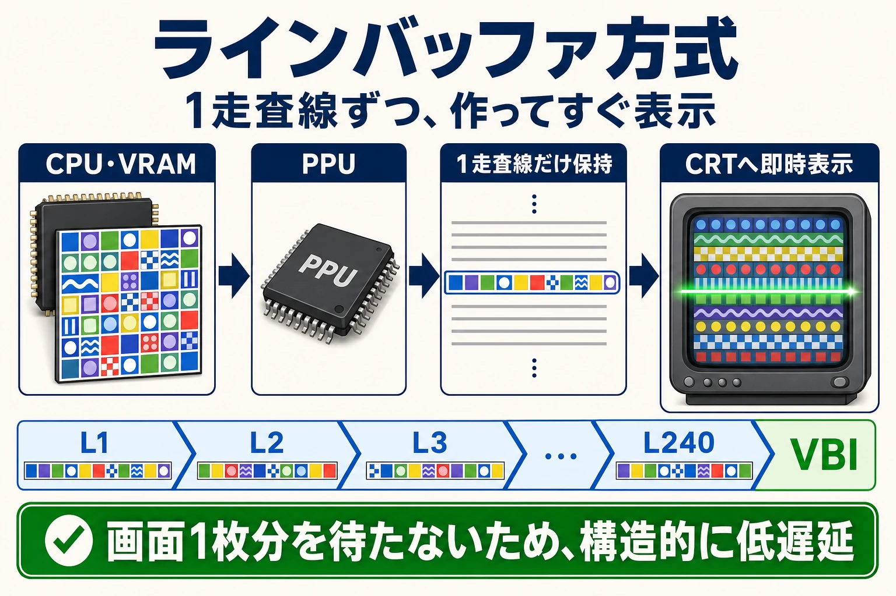
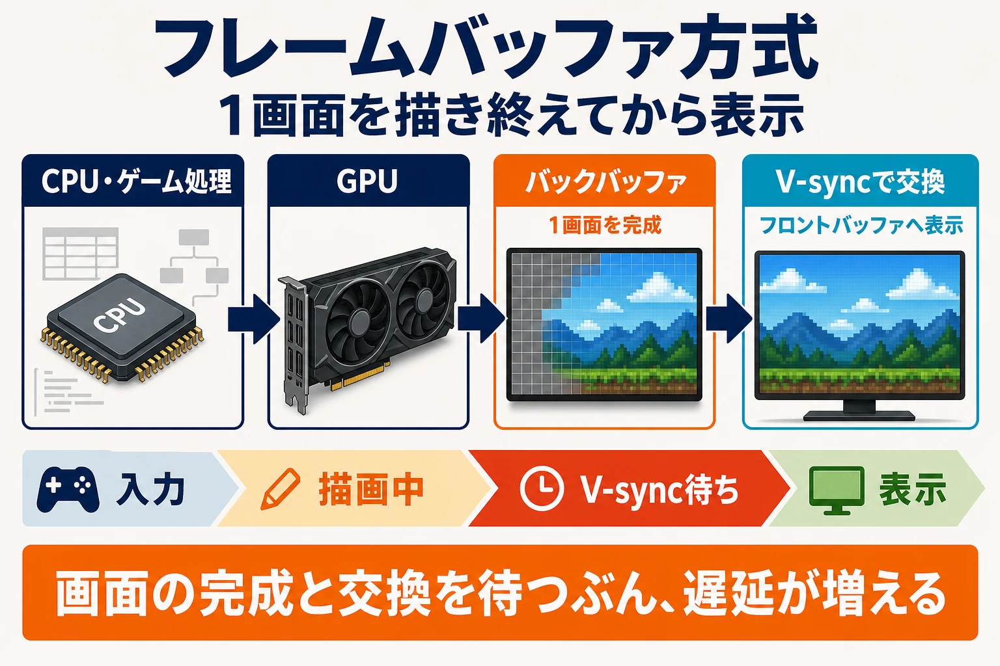
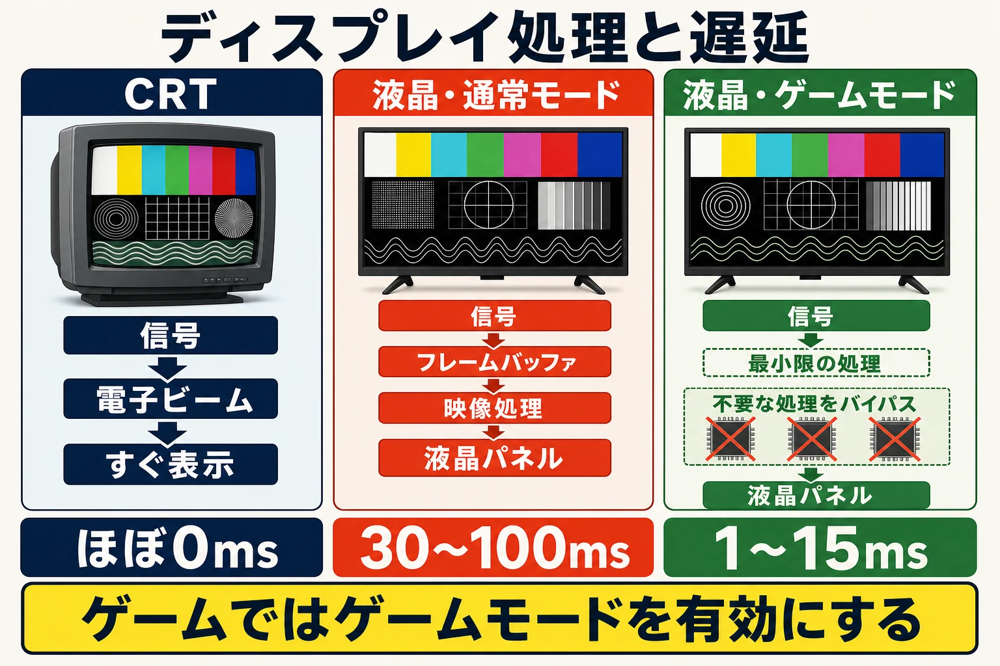

# ゲームの入力遅延――発生要因と削減・隠蔽の技術
## ──ファミコン時代から現代まで、技術と体験の変遷──

***

## はじめに：入力遅延とは何か

「入力遅延」とは、コントローラーのボタンを押した瞬間から、その結果がディスプレイに映し出されるまでのタイムラグを指す。英語では "Input Lag" や "Input Latency" と呼ばれる。日本では「操作遅延」「表示遅延」など様々な呼称が存在するが、本レポートでは「入力遅延」に統一する。[[1](#ref-1)]

この遅延がゲーム体験に与える影響は深刻だ。二重盲検テストによる実験では、60fps環境で **1フレーム（約16.7ms）単位の遅延を体感できる人が実際に存在** することが確認されている。また、人間の視覚→判断→操作にかかる最短応答時間は約200msとされるが、ここに50msの遅延が加わるだけで、応答までの総時間は25%も延びる計算になる。[[1](#ref-1)]

遅延は単一の要因ではなく、「コントローラー」「OS/ドライバ」「ゲームプログラム」「GPU描画」「ディスプレイ」という **複数の段階が積み重なった合計** として発生する。[[1](#ref-1)]

***

## 第１章：ファミコン時代の「遅延ゼロ」設計

### フレームバッファ以前：ラインバッファ方式

ファミリーコンピュータ（ファミコン）が登場した1980年代、家庭用ゲーム機の映像出力は現代とまったく異なる仕組みに基づいていた。ブラウン管（CRT）テレビは、電子ビームを画面左上から右下へと走査することで映像を作り出す装置であり、ゲーム機の映像回路はこの走査に **リアルタイムで同期して** ドット情報を出力していた。[[2](#ref-2)]

ファミコンの映像処理はPPU（映像処理ユニット）が担っており、1スキャンライン（水平線1本）ぶんを走査するごとに、次のラインのデータを準備する **ラインバッファ方式** を採用していた。1フレームは262本のスキャンラインで構成され（日本のNTSC方式の場合）、このうち240ラインが映像表示に使われ、残りが垂直帰線期間として確保される。垂直帰線期間はCPUがVRAMにアクセスして次フレームのデータを書き込む貴重な時間だった。[[3](#ref-3)][[4](#ref-4)][[5](#ref-5)]

この設計の最大の利点は、 **画面1枚分のフレームバッファが不要** であることだ。80年代の半導体コストを考えると、256×240ピクセル分のフレームバッファを持つことは経済的に非現実的だった。ラインバッファ方式はメモリをごくわずかしか必要とせず、かつ「描いた絵がそのままリアルタイムに画面に出る」という構造的な低遅延を実現していた。[[2](#ref-2)][[1](#ref-1)]

### コントローラーの直結設計

ファミコン時代のコントローラーは、現代のようにOSのドライバ層を介さず、 **回路で直接CPU（ファミコンの場合6502系）に接続** されていた。CPUはゲームプログラムが任意のタイミングでコントローラーレジスタを読み取ることができ、入力値が「定期ポーリング」による遅延を受けることはなかった。[[1](#ref-1)]

ブラウン管モニターはアナログ信号をほぼ直接表示するため、理論上遅延はマイクロ秒単位でほぼゼロに近い状態だった。これらを合計すると、ファミコン＋ブラウン管という組み合わせは、 **システム全体としての入力遅延が現代のゲーム環境よりも圧倒的に小さかった** と言える。[[6](#ref-6)][[1](#ref-1)]

***

## 第２章：フレームバッファ時代の幕開け

### フレームバッファの登場と遅延のトレードオフ

1980年代後半から1990年代にかけて、アーケードや次世代ゲーム機は3Dグラフィックスに移行し始めた。3D演算には「1フレーム分の絵を丸ごとバッファに描き上げてから表示する」 **フレームバッファ方式** が採用された。これにより、ラインバッファでは不可能だった複雑な演算（ポリゴン変換、陰面消去など）が実現したが、代わりに「描画した画面をいつ表示に切り替えるか」という問題が生まれた。[[2](#ref-2)]

セガのギャラクシーフォース（1988年）やラッドモビール（1991年）はフレームバッファ方式を採用した初期のアーケードゲームであり、のちの家庭用機セガサターン（1994年）もVDP1にフレームバッファを備える構造を持っていた。ライバルの初代プレイステーション（1994年）も同様にフレームバッファを採用しており、両機ともポリゴン描画に対応していたが、設計思想は対照的だった。サターンは2D性能を究極まで強化し、変形スプライトを応用して疑似的に3Dを実現する設計だったのに対し、プレイステーションは最初から3Dポリゴン描画に特化した専用ハードウェア（GTE・GPU）を搭載していた。[[2](#ref-2)]

### ダブルバッファと垂直同期による遅延の固定化

フレームバッファ方式では、描画中のバッファがそのまま表示されると「描きかけの絵が見える（ティアリング）」という問題が生じる。これを防ぐために、 **ダブルバッファリング** が標準的に採用された。画面に表示する「フロントバッファ」と、次のフレームを描く「バックバッファ」の2枚を用意し、垂直同期のタイミングで両者を交換（フリップ）する手法だ。[[7](#ref-7)]

この方式では、ゲームプログラムが「バックバッファへの描画を開始した直後にユーザーが入力した」というワーストケースで、次の垂直同期まで待ってからようやく入力が反映されることになる。60fps環境ならこれが最大1フレーム（16.7ms）の遅延を生む。加えてフレームの先頭（垂直同期の直後）に入力を一括バッファリングするプログラミング慣習により、 **実質1フレームの固定的な遅延** がほぼすべてのゲームに組み込まれることになった。[[8](#ref-8)]

プレイステーション2の初期ゲームでは、限られたVRAMを有効活用するために「描画バッファから表示バッファへの転送」を挟む実装が普及し、フレーム処理が「垂直同期直後」よりやや遅れて開始されるようになった。結果として、それまでの慣習で発生していた1フレーム分の入力遅延が実質的に解消されたという開発者の証言が残っている。[[8](#ref-8)]

***

## 第３章：現代ゲーム機の多重バッファと遅延の増大

### トリプルバッファリングとGPU先行処理

現代のゲーム機やPCでは、描画処理の安定性を高めるために **トリプルバッファリング** が用いられることが多い。これは1枚の表示バッファと2枚の描画バッファを持ち、GPUが1枚目のバックバッファを描き終えたら即座に2枚目のバックバッファの描画に移れるため、フレームレートの安定化に有効だ。[[9](#ref-9)][[10](#ref-10)]

しかしトリプルバッファリングは入力遅延を増大させる。CPUはGPUに対して2フレーム先行して処理を行うことになり、この先行分がそのまま遅延として蓄積される。競技性の高いゲームでは、CPUとGPUの先行量を意図的に小さく保つか、後述する専用技術を使って解消する必要がある。[[1](#ref-1)]

垂直同期を有効にした場合のダブルバッファとトリプルバッファを比較すると、 **常にターゲットfpsを維持できる環境ではダブルバッファの方が入力遅延が小さい**。一方でフレームレートが目標を下回ると、ダブルバッファは60→30fpsと急激な落ち込みを起こすが、トリプルバッファは60→59と緩やかに落ちるという利点がある。[[11](#ref-11)]

### OSのバッファリング問題（Windows）

PC環境では、OSレベルのバッファリングが深刻な遅延源となることがある。Windows Vista/7で導入されたAero（デスクトップ ウィンドウ マネージャー）は、最大で4フレーム程度の遅延をもたらすケースが報告されている。Windows 8以降はこの機能を従来の方法では無効化できなくなり、DirectX 11以前のAPIで描画されるウィンドウモードのゲームでは、構造的に大きな遅延から逃れられない状況が続いた。[[1](#ref-1)]

DirectX 12では「低遅延フリップ」（DXGIフリップモデル）の仕組みが提供され、ウィンドウモードでもデスクトップ ウィンドウ マネージャーのバッファリングをほぼ回避できるようになった。NVIDIAやAMDが提供する低遅延化技術（後述のReflex、Anti-Lag）は、こうした低遅延化の仕組みをドライバレベルで補完するものと位置づけられる。[[1](#ref-1)]

### 遅延の積み重なりと現代環境の実態

現代のゲーム環境では、遅延が以下のように積み重なる：[[12](#ref-12)][[1](#ref-1)]

| 遅延の発生源 | 概算 |
|---|---|
| コントローラーのポーリング | 最大1ポーリング間隔（1〜8ms） |
| OSドライバのバッファリング | 最大1フレーム相当（〜16.7ms） |
| ゲームプログラムの処理 | 1〜3フレーム（16〜50ms） |
| GPUの描画処理 | 0.5〜2フレーム相当 |
| ディスプレイの映像処理 | 0〜100ms（モードによる） |
| **合計（典型的なゲームモード時）** | **約50〜100ms** |

CEDEC 2014での講演では、モニターによる遅延について「人間の脳が事象の前後関係を知覚できる時間差の閾値が30〜40msである」という知見をもとに、60fps環境で **2フレーム以下（33ms以下）を理想値** としてきたとされる。ゲームの処理遅延については、ダブルバッファ方式のコンシューマ機で描画処理開始直後にユーザー入力が発生したワーストケースで「3フレーム固定」という数字が示されている。[[12](#ref-12)]

***

## 第４章：ディスプレイが生む遅延

### ブラウン管（CRT）の遅延ゼロ特性

ブラウン管テレビはアナログ信号を電子ビームで直接蛍光体に照射する仕組みのため、中間的なデジタル処理が存在しない。これにより入力から表示までの遅延はマイクロ秒単位であり、事実上人間の知覚では無視できるレベルだ。研究では、CRTの応答速度は1ms以下であるとされ、FPSや格闘ゲームでの優位性が理論的・実証的に裏付けられている。[[6](#ref-6)]

そのため今日でも、一部の格闘ゲームのプロプレイヤーや、往年のレトロゲームをオリジナルの操作感で楽しみたい層がCRTを愛用している。OSSCのようなオープンソーススキャンコンバーターはフレームバッファを介さないラインダブラー方式を採用しているため遅延が極めて小さく、レトロゲーム愛好家に支持されている。[[13](#ref-13)]

### 液晶・有機ELディスプレイと映像処理遅延

液晶モニターが主流になって以降、ディスプレイ内部で行われる映像信号処理が遅延の主要因となった。映像エンジンが映像信号を蓄積し、スケーリング・色補正・ノイズ除去・解像度変換などを施してからパネルに出力するため、処理時間がそのまま遅延になる。[[14](#ref-14)][[15](#ref-15)]

2008年頃のゲームモード（低遅延モード）は「不要な映像処理をバイパスして最低限の処理だけを有効化する」という実装だった。現代の高品質ゲーミングモニターでは1フレーム以下の遅延を実現しているが、かつては2フレーム以上の遅延が一般的だった。[[15](#ref-15)][[1](#ref-1)]

テレビが搭載する **倍速（フレーム補間）機能** は特に注意が必要だ。60fpsの映像から120fpsの映像を生成するために、隣接フレームの動きを解析して中間フレームを生成するが、この解析に「最低1フレーム＋解析時間」の遅延が発生する。「ゲームの映像をスムーズにする」と宣伝されることがあるが、実際にはゲーム用途では逆効果であり、必ず無効化すべき機能だ。[[1](#ref-1)]

有機ELディスプレイはピクセル応答が0.2ms以下と極めて高速で、応答速度の面で大きく有利だが、ゲームモード時の入力遅延（信号処理由来）は7ms前後となる。一方、VAやIPSなどの液晶パネルは入力遅延（信号処理）が1〜4msに収まるものでも、ピクセル応答に7〜14msかかるため、結果として映像が変化し終わるまでのトータル遅延は8〜18msに達する。[[16](#ref-16)]

LGは有機ELテレビで応答速度1msを謳っており、プロゲーマーが入力遅延15ms以下を目標とするのに対し、カジュアルゲーマーにとっては40ms以下が許容範囲とされている。現代のゲーム向け4K/120Hzテレビでは、ゲームモード時に10ms前後の入力遅延を実現している製品もある。[[17](#ref-17)][[18](#ref-18)]

### ゲームモードとALLM

液晶テレビのゲームモードは、映像処理を最小化して遅延を削減する設定だ。ゲームモードを有効にすることが最も手軽な遅延削減策であり、一般的な液晶モニターでも効果が得られる。[[14](#ref-14)]

HDMI 2.1規格では、 **ALLM（自動低遅延モード）** という機能が標準化された。これはゲーム機やPCがHDMIを通じてテレビにシグナルを送り、テレビが自動的にゲームモード（低遅延モード）に切り替わる仕組みだ。PS5やXbox Series Xがゲームを起動すると、手動設定なしに自動でゲームモードに入り、ストリーミングコンテンツを再生すると通常の映像モードに戻る。[[19](#ref-19)][[20](#ref-20)]

HDMI 2.1はこれに加え、VRR（可変リフレッシュレート）も規格化している。VRRはGPUの出力フレームレートに合わせてディスプレイのリフレッシュレートを動的に変化させる技術であり、ティアリングやスタッタリングを防ぎながら、垂直同期による遅延増大も回避できる。[[21](#ref-21)][[22](#ref-22)]

***

## 第５章：ワイヤレス入出力機器が生む遅延

### コントローラーのポーリングレートと遅延

コントローラーの入力遅延は、OSドライバがコントローラーを「ポーリング（定期読み取り）」する間隔に依存する。1秒間の読み取り回数がポーリングレートで、1000Hzなら1ms間隔、250Hzなら4ms間隔となる。[[1](#ref-1)]

主要コントローラーのポーリングレートと遅延を比較すると、有線・無線の接続方式による差も見えてくる：[[23](#ref-23)][[24](#ref-24)]

| コントローラー | 有線ポーリング (Hz) | 無線2.4GHz (Hz) | スティック遅延（有線・ms） |
|---|---|---|---|
| DualSense ワイヤレスコントローラー | 250（OC時8000） | — | 12.6ms |
| DualSense Edge ワイヤレスコントローラー | 1000（OC時8000） | — | 4.6ms |
| PXN P5 8K | 8000 | 4000 | 6.8ms |
| 8BitDo Ultimate 2 | 1000 | 250 | 15.5ms |

興味深いのは、PS4のDUALSHOCK 4はUSB有線よりもBluetooth無線の方がポーリングレートが高く、有線接続の方が遅延が大きいという逆転現象があったことだ。一方でPS5のDualSense ワイヤレスコントローラーでは、有線・無線間に統計的に有意な差がないことが示されている。[[25](#ref-25)]

『ロケットリーグ』など一部のゲームでの実測値：

| ゲーム | コントローラー | 接続 | 平均遅延 (ms) |
|---|---|---|---|
| ASTRO's PLAYROOM | DualSense ワイヤレスコントローラー | 有線 | 115.77 |
| ASTRO's PLAYROOM | DualSense ワイヤレスコントローラー | Bluetooth | 115.48 |
| ロケットリーグ | DualSense ワイヤレスコントローラー | 有線 | 32.87 |
| ロケットリーグ | DualSense ワイヤレスコントローラー | Bluetooth | 33.58 |

これらの数値からわかるように、現代のBluetoothコントローラーは、適切に実装されていれば有線と遜色ない遅延性能を持つ。ゲーム全体の遅延に比べれば、コントローラーの接続方式だけを変えてもほとんど体感差はない。[[25](#ref-25)]

### Bluetoothと専用2.4GHz

Bluetoothは汎用的なプロトコルであるため、標準Bluetoothの遅延は20〜40ms程度とされ、Bluetooth 5.0（DualSenseや新型Xboxワイヤレスコントローラーなど）で16〜30msとなる。一方、Xbox ワイヤレスコントローラーやロジクールのLIGHTSPEED、Razerの専用ドングルなど **専用2.4GHz方式** は15〜20msと、Bluetoothより低遅延だ。[[26](#ref-26)][[27](#ref-27)]

同じ2.4GHzドングル方式でも、製品によっては250Hz程度にとどまるものもあり（前掲の表では8BitDo Ultimate 2の2.4GHz接続が250Hz）、より高ポーリングレートの専用2.4GHzドングルを採用する競技者向け製品に比べると、遅延が大きく、ジッター（遅延のばらつき）も増大する傾向がある。[[26](#ref-26)]

注意すべき要因として、バッテリー残量の低下（20%以下でポーリングレートを下げる製品がある）、USB 3.0ポートや電子レンジ・Wi-Fiルーターからの電波干渉、ユーザーとコンソールの距離や障害物なども遅延に影響する。[[26](#ref-26)]

### ディスプレイの無線接続（ワイヤレスHDMI）

近年、ワイヤレスHDMIアダプター（IOGEAR GWHD11やMonoprice Blackbird Pro WIHDなど）が普及しつつある。これらは60GHz帯や5GHz Wi-Fi帯を使い映像信号を無線伝送するが、圧縮・エンコード・デコードのプロセスが加わるため、機種によっては数十ms以上の追加遅延が生じることがある。有線HDMI接続に比べて遅延管理が難しく、競技性の高いゲームには不向きと言われている。[[28](#ref-28)]

***

## 第６章：遅延を「隠す」技術と設計

入力遅延はハードウェアやOSの制約上、完全には排除できない。そこでゲーム設計者は「遅延をプレイヤーに気づかせない」さまざまな手法を取り入れてきた。

### ヒットストップ・カメラシェイク

**ヒットストップ** は、攻撃が命中した瞬間にゲームの時間進行を数フレーム停止（またはスロー）する技法だ。『大乱闘スマッシュブラザーズ』シリーズなどのアクションゲームでおなじみの演出だが、これは単なる演出以上の意味を持つ。プレイヤーが入力した行動の「結果」を強調し、遅延があってもヒットの感触を確実に伝える役割を果たす。[[29](#ref-29)][[30](#ref-30)]

ヒットストップと組み合わせる **カメラシェイク** や **ダメージモーション** （ダメージを受けた敵キャラクターのリアクション）は、プレイヤーに「入力が確実に効いた」という確信を与え、遅延への不満を心理的に緩和する。最近のゲームでは、ヒットストップの長さを攻撃の種類や威力ごとに個別に設定し、命中時に必ず敵のリアクションが見えるよう「ヒットストップディレイ」パラメーターまで設けている例もある。[[31](#ref-31)][[30](#ref-30)]

### 先読みアニメーション（アンティシペーション）

アクションゲームの多くでは、攻撃モーションに **予備動作（アンティシペーション）** を持たせている。プレイヤーがボタンを押した瞬間から数フレーム、キャラクターが「腰を落とす」「腕を引く」などの溜め動作を行い、その後に攻撃が繰り出される。

この予備動作は、1〜3フレームの入力遅延を自然に「吸収」する効果がある。プレイヤーが入力してから実際に攻撃が出るまでの時間を「ゲームデザインとして意図されたもの」として見せることで、技術的な遅延と演出上のタイミングを区別できなくさせるのだ。[[32](#ref-32)]

### 入力バッファリング（コマンド先行受付）

**入力バッファ** は、プレイヤーの入力を数フレームぶん「記憶」しておき、適切なタイミングで実行する仕組みだ。格闘ゲームでのコマンド技（→↓↘+ボタン）の入力受付ウィンドウが代表例で、コマンドを数フレーム早めに入力しても技が出るように設計されている。[[33](#ref-33)]

このバッファウィンドウはゲームジャンルや技の種類によって適切な長さが異なり、長すぎると誤操作が増え、短すぎると操作が難しくなる。近年では機械学習を用いた **予測型バッファリング** （プレイヤーの意図する次のアクションを予測して先行バッファリングする手法）の研究も進んでいる。[[33](#ref-33)]

### リズムゲームのキャリブレーション機能

リズムゲームは入力遅延の影響を最も受けやすいジャンルの一つだ。プレイヤーが使用するディスプレイやスピーカーによって遅延量が異なるため、 **オフセット（キャリブレーション）機能** をゲーム内に設けてプレイヤーが遅延を補正できるようにするのが標準的となっている。ゲームバランスの調整も「遅延が大きめのモニタを基準に行う」ことが推奨されている。[[1](#ref-1)]

### ロールバックネットコード（ネットワーク遅延への応用）

格闘ゲームのオンライン対戦で近年広く普及した **ロールバック方式** は、ネットワーク遅延を知覚させにくくする技術だ。[[34](#ref-34)]

従来の **ディレイ方式** では、対戦相手の入力データが届くまでゲームの進行を止める（スローモーション化）ため、通信環境が悪いと操作感が著しく損なわれる。ロールバック方式では、対戦相手の入力データが届く前に「相手は前フレームと同じ入力をしているだろう」と **予測して先読み描画** し、実際のデータが届いたときに予測と異なる場合は過去のフレームにさかのぼって処理し直す（ロールバックする）。[[35](#ref-35)][[36](#ref-36)]

これにより、多少の通信遅延があってもゲーム進行がスローモーションにならず遊びやすくなるが、予測が大きく外れた際にはキャラクターが「ワープ」するような見た目になるトレードオフがある。[[34](#ref-34)]

### クライアントサイド予測

FPSやTPSなどのオンラインゲームで用いられる **クライアントサイド予測** は、サーバーからの返答を待たずに、クライアント（自機）が独自のシミュレーションを行い「入力に反応したように見せる」技術だ。実際の判定はサーバーで行われるが、プレイヤーには即座にキャラクターが動いたように見えるため、体感的な応答性が大幅に向上する。[[32](#ref-32)]

サーバーからの応答とクライアント予測がずれた場合の補正方法として「スナッピング（強制修正）」や「補間（ゴムバンド現象）」があり、どちらも一長一短がある。[[32](#ref-32)]

***

## 第７章：ハードウェア・ドライバレベルの遅延削減技術

### NVIDIA Reflex（NVIDIA リフレックス）

**NVIDIA Reflex** は、GPUのレンダーキューを常に空に保つことで遅延を削減する技術だ。CPUがGPUの処理能力を超えてフレームを生成し続けると、キューにフレームが溜まり遅延が増大する。Reflexはゲームエンジン側でGPUが処理できるタイミングでのみフレームを送り込む制御を行う。[[37](#ref-37)]

CPU負荷が高いシナリオでは「Low Latency Boost」が発動し、GPUの動作クロックを高めてフレームレートを維持する。テスト結果では一部のゲームで最大70%の遅延削減が確認されており、特にGPUバウンドなゲームで高い効果を発揮する。ゲームエンジンへの組み込みが必要なため、対応ゲームが限られるのが欠点だ。[[37](#ref-37)]

### AMD Radeon Anti-Lag（AMD Radeon アンチラグ）

**AMD Radeon Anti-Lag** はドライバーレベルで実装されるため、ゲーム側の対応が不要で幅広いゲームに適用できる。CPUがGPUより先行しすぎていないかを定期チェックし、先行しすぎている場合にCPUをスロットルしてフレームキューを削減する。一部のゲームで最大31%の遅延削減が報告されているが、Reflexに比べてCPUバウンドシナリオでの効果は限定的だ。[[37](#ref-37)]

### VRR（G-SYNC・FreeSync）

VRRはGPUの出力フレームレートに合わせてディスプレイのリフレッシュレートを動的に変化させる技術で、垂直同期のような固定同期に伴う遅延増大（60Hz時で最大16.7ms）を回避できる。実測では、VRR有効時の追加遅延は最大0.8ms程度であり、人間が遅延を知覚できる閾値（一般的に13ms以上）を大幅に下回る。[[22](#ref-22)]

G-SYNC（NVIDIA）とFreeSync（AMD・HDMI標準VRR）は基本的に同じ目的を持つが、実装や対応範囲が異なる。適切な設定（フレームレート上限を表示リフレッシュレートよりわずかに低く設定）を行うことで、ティアリングとスタッタリングの両方を解消しつつ遅延も最小化できる。[[22](#ref-22)]

### エミュレーターの「先行実行」

RetroArchなどのエミュレーターが実装する **先行実行（Run-Ahead）** は、ゲームの現在フレームより数フレーム先を高速計算した上で「入力に最も近いフレーム」を表示することで、ゲーム内部の遅延を疑似的に相殺する技術だ。[[38](#ref-38)]

驚くべきことに、この技術はオリジナルハードウェアが構造的に抱えていた内部遅延（ゲームロジック由来の1〜3フレーム）すら削減できる。ただし先行フレーム数を増やしすぎると内部フレームの挙動に支障が出て不具合やスタッタリングが生じるため、ゲームごとの内部遅延フレーム数に合わせた慎重な設定が必要だ。[[39](#ref-39)][[38](#ref-38)]

***

## 第８章：開発者が知るべき設計指針

遅延対策はプレイヤー側だけでなく、ゲーム開発者側の設計でも大きく変わる。CEDEC 2020での「芯（シン）・遅延対策2020」では、遅延の「速さ」よりも **「安定性」が重要** という知見が共有されている。遅延量が多くても固定・安定していれば慣れることができるが、不規則に変動する遅延はプレイヤーのリズムを崩すためより有害だ。[[40](#ref-40)]

実際の設計指針としては：

- **アクション性が高いゲームほど、CPUとGPUの先行量を小さく保つ** （入力遅延の最小化）
- **プレイヤーの環境によって遅延量が異なることを前提に設計する** （遅延が大きいモニタを基準にバランス調整）
- **高速な敵弾より弾幕密度で難易度調整する** （反射速度に依存しすぎない設計）
- **エイミング補助・ロックオンなどのプレイヤー動作補正を積極活用する** （遅延の影響を吸収）
- **リズムゲームには必ずオフセット調整機能を用意する** [[1](#ref-1)]

ゲームエンジンの普及により、Unreal EngineやUnityが低遅延レンダリングパイプラインの最適化を担うようになっており、開発者が最新のOS・ドライバの遅延特性を追いかけ続ける負担は以前より軽減されている。[[1](#ref-1)]

***

## まとめ

ファミコン時代のラインバッファ＋ブラウン管という組み合わせは、構造的に入力遅延が極めて小さかった。フレームバッファの導入・液晶ディスプレイへの移行・OSのバッファリング増大が積み重なり、現代のゲーム環境ではシステム全体で50〜100msもの遅延が生じうる。

この遅延に対して、ハードウェアベンダー（NVIDIA Reflex・AMD Radeon Anti-Lag・VRR）・ディスプレイメーカー（ゲームモード・ALLM）・コントローラーメーカー（高ポーリングレート・専用2.4GHz）・そしてゲーム開発者（ヒットストップ・ロールバック・入力バッファ・クライアントサイド予測）がそれぞれの立場から技術を磨き続けている。

完全にゼロにすることは不可能だが、「遅延を計測し、理解し、設計に活かす」という姿勢こそが、快適なゲーム体験を生み出す最短経路だ。

---

## References

1. [ゲームの入力遅延問題とその対策 - yosshin4004.github.io](https://yosshin4004.github.io/memo/input_lag/index.html) - ゲームプログラムがコントローラ入力を取得してから グラフィクス描画処理を開始するまでに時間がかかる場合、 その分多くの遅延が発生します。 GPU の ...

2. [80年代の画面表示技術 - 魔法使いの森](https://www.wizforest.com/OldGood/ntsc/;p3) - 3D 処理ではフレーム（画面）バッファで画面が作成され、画面1枚分（垂直帰線期間から、次の垂直帰線期間まで）の間に処理されます。ラインバッファに比べれば ...

3. [[PDF] CSEE 4840 Embedded System Design NES Emulator](https://www.cs.columbia.edu/~sedwards/classes/2020/4840-spring/reports/nes.pdf) - No pixel rendering for this scanline. ❏ 0-239 scanline: render background and sprite. The program do...

4. [【ゆっくり解説】ファミコンはいかにして映像を出力 ... - YouTube](https://www.youtube.com/watch?v=lrrjp9ab23Q) - ... ファミコンの映像出力方法について、ブラウン管の仕組みやPPU ... ブラウン管まとめ07:16 フレームバッファ方式08:01 ラインバッファ方式 ...

5. [PPU rendering - NESdev Wiki](https://www.nesdev.org/wiki/PPU_rendering) - The PPU outputs a picture region of 256x240 pixels and a border region extending 16 pixels left, 11 ...

6. [液晶モニターとブラウン管テレビ（CRT）の表示遅延の違い - note](https://note.com/cognitive_01/n/n365f9b2b6227) - 一方、ブラウン管テレビはアナログ信号をほぼ直接表示するため、理論上遅延がほぼゼロに近い状態を実現できます。 この特性から、近年、プロゲーマーや ...

7. [What exactly causes V-sync to introduce input lag? - Page 2](https://forums.blurbusters.com/viewtopic.php?t=3139&start=10) - With vsync on, double buffering vs triple buffering means the GPU stops working when it's finished o...

8. [Playstation2の初期のゲームには入力遅延があったという話 - note](https://note.com/pink612/n/nf8e1141294a1) - 結果として、フレームの先頭で入力をバッファリングしていた場合、ほぼ1フレームの入力遅延が発生していたわけです。 これはほとんど表沙汰になって ...

9. [Input lag w/Nestopia - SOLVED - General - Libretro Forums](https://forums.libretro.com/t/input-lag-w-nestopia-solved/1636) - I did some tests of the nestopia core and found that there was significantly more input lag vs. just...

10. [Triple Buffering in Rendering APIs - Nikos Papadopoulos](https://www.4rknova.com/blog/2025/09/12/triple-buffering) - Triple buffering adds a third buffer to the swapchain so that the GPU can keep rendering even when a...

11. [入力ラグを最小にするならダブル or トリプルバッファのVSYNC](https://www.reddit.com/r/pcgaming/comments/7eiaq4/double_or_triple_buffered_vsync_for_lowest_input/) - 結論：. 常に目標のフレームレートを叩き出せる前提なら、ダブルバッファのVsyncのほうがトリプルバッファのVsyncより入力遅延が少ない（もちろん、 ...

12. [【CEDEC2014】遅延問題を錯覚利用で解決?! 「世界のみんなは4 ...](https://game.watch.impress.co.jp/docs/news/665316.html) - テレビによる遅延、ネットワークによる遅延、入力デバイスによる遅延……ゲームにおける遅延は、ゲーム性の優劣まで決めてしまうほど大きな問題だ。

13. [OSSC (Open Source Scan Converter) Review - Richretro](https://richretro.wordpress.com/2016/12/18/ossc-open-source-scan-converter-review/) - OSSC (Open Source Scan Converter) Review · Noticeable input lag · Inaccurate colours and brightness ...

14. [モニターの入力遅延問題と対応方法！ゲームをしているとき ... - Pixio](https://pixiogaming.jp/blogs/blogs/input-delay) - こんにちは、スタッフの川田です。 今回は、ゲーミングモニターの入力遅延原因と解決方法について詳しくお話したいと思います。 そもそも遅延とは何？

15. [あなたのテレビは遅れてませんか? 知っておきたい“遅延”の話](https://av.watch.impress.co.jp/docs/series/dg/1236788.html) - 右側の「ゲームモード」が点滅しているのは、残像低減のための黒挿入(バックライトオフ)処理を行なっていることによるもの。両機を見比べると、右側の「 ...

16. [We've All Been Duped by LED LCD's Input Lag vs OLED for Gaming](https://www.reddit.com/r/OLED_Gaming/comments/qvcixj/weve_all_been_duped_by_led_lcds_input_lag_vs_oled/) - Oled pixels can completely change in like 0.2ms. So you then have like 7ms input lag. And the entire...

17. [Our Guide To What Is A Good Input Lag for Gaming ｜ LG UK](https://www.lg.com/uk/lg-experience/lg-lab/input-lag-for-gaming-guide/) - Casual gamers generally find input lag under 40 milliseconds acceptable, while anything over 50 mill...

18. [The best 120Hz 4K TVs, tested for PS5 and Xbox Series X](https://www.techradar.com/best/120hz-4k-tvs) - ... gaming and ultra-low 9.9ms input lag across four HDMI 2.1 ports. ... With four HDMI 2.1 ports su...

19. [HDMI 2.1 gaming - FeinTech](https://feintech.eu/en/blogs/know-how/hdmi-2-1-gaming) - ALLM (Auto Low Latency Mode) is a feature of the HDMI 2.1 standard that allows devices to automatica...

20. [Auto Low Latency Mode (ALLM) - HDMI Licensing Administrator, Inc.](https://www.hdmi.org/spec2sub/autolowlatencymode) - ALLM lets a game console, PC or other device send a signal to the display which will cause it to aut...

21. [【G-Sync/FreeSync】VRRでゲームのカクつき・表示ズレを軽減！](https://abolution.com/vrr-gsync-freesync) - Freesyncのデメリット. 45fpsまでしか対応してない; 応答速度と入力遅延にわずかな遅れ; ティアリングとスタッタリングを完全になくなるわけではない ...

22. [VRRで遅延が増えるは半分ウソ。G-Sync・FreeSyncの誤解を ... - note](https://note.com/noted_pothos7691/n/nabbc393bf7a6) - VRRの遅延増加は最大0.8ms、ゲーム内垂直同期をONにしたままの遅延は16.7ms。数字で並べると、何が本当のリスクだったかは明白です。 VRRを使うべき人.

23. [Best Polling Rate Controllers Explained - hlplanet](https://www.hlplanet.com/polling-rate-controllers/) - Controller polling rate list ; Sony PS5 Dualsense, 250 (can be overclocked to 8000), –, 11.6 ; Sony ...

24. [Input Lag and Specs comparison: Sony DualSense vs ... - Gamepadla](https://gamepadla.com/compare/sony-dualsense-edge_vs_sony-dualsense.html) - ⚡Worst Wired latency: Sony DualSense Edge12.6 ms vs 4.8 ms ; Worst Dongle/Bluetooth latency: Sony Du...

25. [Dualsense Wired vs Wireless latency comparison : r/PS5 - Reddit](https://www.reddit.com/r/PS5/comments/m020e3/dualsense_wired_vs_wireless_latency_comparison/) - If you connect it via bluetooth, it will update its position 1000 times per second, which will resul...

26. [Wireless Gaming Controllers Latency Compared To Wired ...](https://www.alibaba.com/product-insights/wireless-gaming-controllers-latency-compared-to-wired-performance-test.html) - Polling Rate: Higher polling (1000Hz = every 1ms) reduces lag but drains battery faster. Console/PC ...

27. [Input Latency Test — Free Online Controller Input Lag Tester](https://gamepadtester.co.uk/input-latency-test/) - Modern Bluetooth 5.0 (PS5 DualSense, newer Xbox) typically delivers 16–30ms, which is only 1–2 frame...

28. [表示遅延/bluetoothゲームパッドの入力遅延/表示 ... - デジマースブログ](https://blog.digimerce.jp/2019/11/18/8902/) - 「Bluetoothキーボード」「Bluetoothコントローラ」使用時に発生する入力遅延. 以上が代表的でしょうか。 Bluetooth通信により発生する通信遅延. Google ...

29. [UE4でヒット演出解説 - Study Works - はてなブログ](https://studyworks.hatenablog.com/entry/2017/12/08/000000) - 今回はアクションゲームで重要となるヒット演出について. ・物理アニメーション・カメラシェイク・ヒットストップ・ヒットエフェクト・吹き飛ばし演出.

30. [【実例付き】「ヒット演出」代表10選](https://blog.toylogic.co.jp/planner/4111.html) - 【実例付き】「ヒット演出」代表10選 · 【1】ヒットエフェクト · 【2】ヒットSE、ボイス · 【3】ヒットストップ（スローモー） · 【4】ダメージモーション · 【5】 ...

31. [【急募】ゲームのヒットストップに詳しい方【ゲーム開発】](https://www.youtube.com/watch?v=U9tB_nFshTk) - 講談社ゲームクリエイターズラボ一期生 Hytacka（ハイタカ） 「世界一面白いアクションRPGを作る」を人生のメインクエストに掲げ ゲーム制作実況中▽開発 ...

32. [The Effects of Lag in Video Games, and How to Deal with it](https://www.gamedeveloper.com/design/the-effects-of-lag-in-video-games-and-how-to-deal-with-it) - Rather than wait for the server to return information on the game world, the client utilizes predict...

33. [The Art of Input Buffering: Mastering Responsiveness in Games](https://www.wayline.io/blog/art-of-input-buffering) - Predictive buffering: This advanced technique uses machine learning to predict the player's intended...

34. [格ゲーのラグを軽減する話題の技術「ロールバック・ネットコード ...](https://kakuge-checker.com/topic/view/07248/) - ... オンライン対戦時にどうやって通信するかというゲーム側の仕組みのこと。一般的に言うロールバック方式は、先読みで描画することで、従来のディレイ方式よりも遅延を ...

35. [オンライン対戦ゲームにおけるディレイ方式の同期メカニズム - Qiita](https://qiita.com/akiojin/items/dd11230ce282c11d66dc) - ディレイ方式の同期メカニズムは、ユーザーの入力からその結果が画面に表示されるまでに一定の遅延（ディレイ）が発生する仕組みです。例えば、パンチボタン ...

36. [格闘ゲームで話題になるロールバックの仕組みとは？攻撃が当たっ ...](https://pc.watch.impress.co.jp/docs/column/zenji/1459705.html) - ディレイ方式では、ネットワークに遅延が発生した場合、1P/2Pそれぞれのゲーム機は、相手プレイヤーの操作入力がやってくるまでゲーム内時間を進められ ...

37. [NVIDIA Reflex vs AMD Radeon Anti-Lag: A Detailed Comparison](https://prosettings.net/blog/nvidia-reflex-vs-amd-anti-lag/) - NVIDIA Reflex. Various tests show that Reflex can reduce latency by up to 70% in some games. Its sup...

38. [RetroArch Run Ahead - Libretro Docs](https://docs.libretro.com/guides/runahead/) - The Run Ahead feature calculates the frames as fast as possible in the background to "rollback" the ...

39. [How good is Run ahead (retroarch) compared to FPGA with ... - Reddit](https://www.reddit.com/r/emulation/comments/hpqpjr/how_good_is_run_ahead_retroarch_compared_to_fpga/) - Run-ahead is an absolutely incredible technology that theoretically can reduce input lag below what ...

40. [芯（シン）・遅延対策2020 ～ヒトのスペックから紐解かれる - CEDiL](https://cedil.cesa.or.jp/cedil_sessions/view/2002) - ゲームはもとより、特に即応性が重視されるコンテンツ開発・エンタメ設計への向き合い方、ミリ秒オーダーの遅延対策について、最前線の知見を共有します。

----

この文書は、Perplexity、Claude、OpenAI Codex の3つのAIの支援を受けて著述されたものです。引用画像を除き、MIT License にて提供されています。
