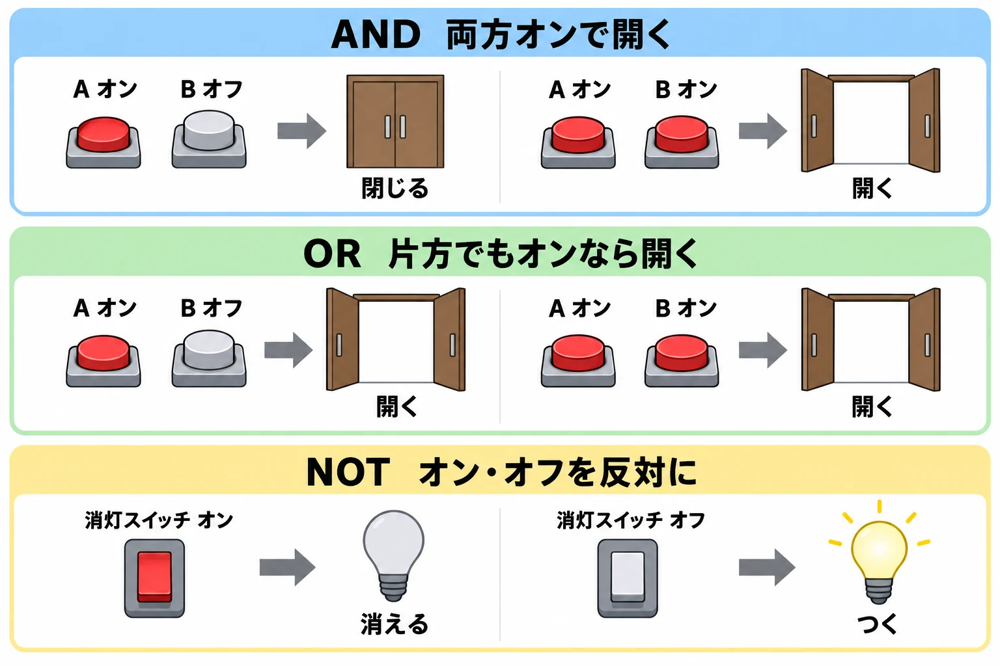

# 回路を組むと、遊びが増える――ゲームプランナーのためのAND・OR・NOT入門

2026年1月22日にリリースされた『アークナイツ：エンドフィールド』では、物を運ぶ設備が、条件を判断する装置へと変わった。[[1](#ref-1)] AUTOMATONの同年2月11日の報道によると、プレイヤーの木端氏は、集成工業の分流器と合流器を組み合わせ、AND・OR・NOTという三つの論理回路を組み立てたという。[[2](#ref-2)]

その少し前には、別のプレイヤーがバッテリーの流れる量を調整し、電力供給を細かく制御する仕組みを作ったことも報じられている。[[3](#ref-3)] いずれも、公式に用意された回路機能を使ったものではなく、物流の仕組みを転用した工夫だ。 **回路専用の部品がないところに、回路が生まれた。**

運営がこれらをどう受け止めているかは明らかになっていない。ここで注目したいのは、プレイヤーが設備のルールを読み取り、自分で新しい使い道を作ったことである。

本稿は「ゲームプランナーのためのコンピュータ科学」の番外編だ。本編5本では、[数値の上限](game-numeric-limits-for-planners.md)、[名前入力](game-name-input-character-rules.md)、[状態遷移](game-state-transitions-for-planners.md)、[操作の重複](game-concurrent-and-repeated-operations-for-planners.md)、[計算の持ち時間](game-computation-budget-for-planners.md)を通じて、仕様書の一行の裏にある落とし穴を扱った。今回は、 **計算の仕組みを遊びそのものにする** 話である。まずは、ボタンと扉から始めよう。

***

## 1. AND・OR・NOTは、条件を決める三つの基本

二つのボタンと、一枚の扉を想像してほしい。ボタンは押している間だけオンになり、離すとオフになる。扉は、届いた合図がオンなら開き、オフなら閉じるものとする。

このとき「どの条件で、扉へオンを伝えるか」を決めるのが、ここで扱う論理回路だ。受け取る合図を **入力** 、次へ渡す合図を **出力** と呼ぶ。入力と出力の間に置くルールの基本が、AND・OR・NOTである。

### AND：どちらもオンのときだけオン

ANDは「両方そろったら」という条件だ。ボタンAとボタンBを、両方押している間だけ扉が開く。片方だけでは開かない。

たとえば、離れた場所にある二つのボタンを、二人で同時に押す協力パズルが作れる。「鍵を持っている」と「扉の前にいる」の両方がそろったときだけ反応させる、と考えてもよい。

任天堂の『ナビつき！ つくってわかる はじめてゲームプログラミング』には、条件をつなぐ部品としてANDノードンが登場する。公式説明の「どちらもヨシ！ のときだけヨシ！」という言葉が、この働きを端的に表している。[[4](#ref-4)]

### OR：どちらか一方でもオンならオン

ORは「少なくとも片方がそろったら」という条件だ。ボタンAでもボタンBでも扉を開けられる。 **両方を押したときも開く。** 「どちらか一方だけ」という意味ではない。

扉の内側と外側にボタンを置き、どちらからでも開けられる入口を考えると分かりやすい。ANDと同じ二つのボタンでも、つなぐルールが変わると、協力を求める仕掛けが、行き来を便利にする仕掛けへ変わる。

| ボタンA | ボタンB | ANDでつないだ扉 | ORでつないだ扉 |
|---|---|---|---|
| オフ | オフ | 閉じる | 閉じる |
| オン | オフ | 閉じる | 開く |
| オフ | オン | 閉じる | 開く |
| オン | オン | 開く | 開く |

### NOT：オンとオフを入れ替える

NOTは、一つの入力を反対にする。入力がオンなら出力はオフ、入力がオフなら出力はオンになる。

たとえば「消灯スイッチ」を考えよう。スイッチがオンの間は明かりが消え、オフにすると明かりがつく。「人がいる」という合図を反対にすれば、「人がいないときだけ動く」という条件にも使える。

| 消灯スイッチ | NOTの出力 | 明かり |
|---|---|---|
| オフ | オン | つく |
| オン | オフ | 消える |

はじめてゲームプログラミングのNOTノードンも、入力が0なら1、それ以外なら0を出す。0をオフ、0以外をオンとして読むと、同じ関係になる。[[5](#ref-5)]

三つをつなげれば、「AかBがオンで、しかも停止スイッチがオフのときだけ扉を開ける」という条件も作れる。AとBをORでまとめ、停止スイッチをNOTで反対にし、その二つをANDで確かめればよい。

プレイヤーが組み立てるのは、部品の形だけではない。 **いつ、何が起こるかというルール** も、自分で決められるようになる。

***

## 2. 回路の部品を渡すと、拠点や工場の作り方が増える

### Minecraft：暮らしの不便が、仕掛けを作る理由になる

『Minecraft』の公式記事「Block of the Week: Redstone」（2018年3月2日）は、レッドストーンを線状に置いてブロック間へ信号を運び、回路を作れると説明している。用途は、スイッチで扉を開ける簡単なものから、ゲーム内のコンピュータまで広がる。[[6](#ref-6)]

回路を組む楽しさは、自分の拠点で暮らすことと結びついている。同記事の著者は、スイッチで水を流し、小麦をまとめて収穫する仕掛けを作った経験も紹介している。[[6](#ref-6)] 「毎回この作業をするのは大変だ」という不便が、部品を調べ、配置を考える動機になる。

ゲームデザインとして見ると、小さな成功から始められる点がよい。扉が一枚開くだけでも、自分の建築が反応する手応えがある。その先で、もっと便利な拠点や、人を驚かせる仕掛けへ進める。既刊の[Minecraftの更新設計とJava版・Bedrock版の戦略](minecraft-endless-design-java-bedrock-strategy.md)とは別に、ここでは一つのワールドの中で、プレイヤーが動作を作り足せることに注目したい。

### Factorio：工場へ、自分で判断する仕組みを足す

『Factorio』では、回路ネットワークによって設備の情報をつなぐ。開発ブログ「Friday Facts #88 - Combinators」（2015年5月29日）は、信号を扱うコンビネーターとして、次の三種類を紹介した。[[7](#ref-7)]

| 部品の役割 | 何をするか |
|---|---|
| 計算する | 受け取った数を足すなどして、結果を渡す |
| 比べる | 数の大小などを比べ、条件に合うときに信号を渡す |
| 決まった値を出す | プレイヤーが指定した値を送り出す |

ここではオン・オフに加え、品物の個数のような数値も信号になる。同記事は、これらの部品でAND・OR・NOTなどの論理回路、記憶、タイマーを作れることを示している。[[7](#ref-7)]

同記事で開発者のRobert氏が示した今後の活用例には、拠点から必要な品物を知らせ、主基地が列車に積んで送り出す構想もある。そして最後には、プレイヤーがどのような驚くものを作るか楽しみにしている、と述べている。[[7](#ref-7)] 部品を提供し、その組み合わせによる発展を期待する姿勢が読み取れる。

この設計では、「何を作る工場か」に加えて、「どんな条件で動く工場か」もプレイヤーが決められる。たとえば自分の企画なら、「在庫が足りない間だけ補充する」という課題を入口にできるだろう。回路の学習が、工場を使いやすくする目的につながる。

### 組み合わせると、覚えることや繰り返すこともできる

AND・OR・NOTは、まず「いま届いている合図」を判断する基本である。さらに、 **結果を自分の入力へ戻すつなぎ方** や、 **時間を進める仕組み** を使うと、過去の操作や時間も扱えるようになる。Factorioの開発記事も、出力を入力へ戻す例として記憶とタイマーを紹介している。[[7](#ref-7)]

遊びとして考えれば、「一度ボタンを押したら、解除するまで扉を開けておく」「一定の間隔で明かりを点滅させる」といった動きへ広げられる。単に部品を一列につなぐだけで記憶や時間が生まれるわけではないが、細かな構造はここでは追わなくてよい。

大切なのは、完成済みの「自動ドア」を一つ渡す場合と、判断する部品を渡す場合の違いだ。後者では、プレイヤー自身が条件を変え、別の用途へ作り替えられる。小さな仕掛けを動かす、動かない理由を探す、改良する。その試行錯誤も遊びになる。

***

## 3. 物流のルールを読むと、回路が見つかる

エンドフィールドの例では、物を運ぶ設備の働きが、条件を判断する役割へ読み替えられた。

木端氏の回路では、アイテムが流れている状態をオン、流れていない状態をオフに対応させている。合流器なら、どちらかの入口から物が来れば、合流後の道にも物が流れる。これをORとして使える。ANDやNOTでは、合流の優先関係や流れの詰まりを利用している。ただし報道では、ANDの構成で少量のアイテムが意図せず流れる課題も紹介されており、理想的なオン・オフと設備上の実現には隔たりがある。[[2](#ref-2)]

この事例を設計の観点から読むと、手掛かりは二つある。 **条件によって流れが変わること** と、 **その結果が次の設備へ伝わること** だ。

分流器が物を振り分け、合流器が複数の流れをまとめる。その途中で、どこから物が来るか、行き先が空いているかによって、後ろの流れも変わる。プレイヤーは、そうした規則を組み合わせて「このときだけ通す」という判断を取り出した、と捉えられる。

もちろん、この二つがあるだけで、どんな物流でも三種類すべての回路を作れるとは限らない。どちらを優先するか、詰まるとどうなるか、流れがどれほど安定するかといった細部が、使える組み合わせを左右する。

電力制御の事例も、物流を使って別の働きを得た例だ。AUTOMATONは、神仙座氏がuiui122氏のアイデアを基に、分流器などで発電用バッテリーの供給を調整する仕組みを作ったと報じている。[[3](#ref-3)] 回路を組む工夫は、設備を必要に応じて動かし、資源を使うという集成工業の目的にもつながっている。

設計者が回路づくりを目的に部品を用意しなくても、プレイヤーが規則の組み合わせから見つけ出すことはある。エンドフィールドの開発者の意図を決めつけることなく、この可能性を自分の企画へ持ち帰ることができる。

***

## 4. プランナーは、何を決めておくか

### 回路を、どこまで遊びの入口にするか

回路の部品を用意するなら、開発側は「何を判断できるか」を意図して広げられる。一方で、覚える部品や接続のルールも増える。回路を理解することを必須にするのか、興味を持った人が深める遊びにするのかは、先に決めたい。

入門の導線なら、「スイッチを押すと明かりがつく」という一つの成功から始め、次に条件を一つ足す方法が考えられる。便利になった実感があれば、その先を学ぶ理由ができる。

別の仕組みから回路が生まれる余地を残す場合には、発見そのものが楽しさになりうる。ただし、回路が必ず見つかるとは限らず、設備の複雑な挙動を調べる負担もプレイヤー側にある。両者は二者択一に固定する必要はない。見つかった遊びを受けて、後から扱いやすい部品を足す判断も可能だ。

### オン・オフと、動かない理由を見せる

部品が多くなるほど、「扉が開かない」という結果だけでは直す場所が分からなくなる。入力が届いていないのか、条件に合っていないのか、出力先をつなぎ間違えたのか。それぞれを見分けられるようにしたい。

信号の通り道を明るくする、部品を選ぶと現在の入力と出力を表示する、手動でオン・オフを試せるようにする、といった方法が考えられる。色に加えて文字や形でも状態を示せば、判断しやすい。説明文で教えることと、作ったものを観察できることは、両方が必要だ。

### プレイヤーが頼りにした挙動を、どう扱うか

物流設備の優先順や、詰まったときの動きは、回路を作った人にとって部品の性質になる。設備を改善するつもりで挙動を変えても、その性質に頼る回路が動かなくなる可能性がある。

回路の利用を歓迎して動作を守るのか、遊び方として認めつつ変更の可能性を伝えるのか、仕様外として修正するのか。開発チーム内で扱いを決め、変更時には影響を説明できるようにしておきたい。代表的なプレイヤー作品を動作確認の対象に含めることも、歓迎する場合の選択肢になる。

### 大きな回路でも、遊べる速さを保つ

小さな回路が軽く動いても、多数の部品がつながり、次々に状態が変わる場面まで同じとは限らない。部品数だけでなく、同時に動く範囲や、結果が伝わる頻度を含めて、対象機種で確かめる必要がある。

ここは既刊の[「敵は最大何体まで？」を仕様にする](game-computation-budget-for-planners.md)とつながる。回路の場合は、処理を軽くするために反応を遅らせると、点滅の間隔や設備の動く順番にも影響しうる。守りたい動作と、許容できる遅れをエンジニアと共有したい。

仕様を話し合うときは、次の項目を埋めると具体的になる。

| 決めること | 仕様書に書く内容 |
|---|---|
| 遊びの位置づけ | 必須の仕組みか、任意の工夫か。最初に何を作れるようにするか |
| 観察と練習 | 入力・条件・出力をどう見せ、どう試せるようにするか |
| 動作の約束 | 信号が届く順番と待ち時間、再開時に記憶した状態を残すか |
| 更新時の扱い | 保証する挙動、変更しうる範囲、影響を知らせる方法 |
| 規模の上限 | 部品数や同時稼働の範囲、限界に達したときの表示と動作 |

回路づくりが加わると、プレイヤーはゲームのルールを覚えるだけでなく、そのルールから新しい動作を組み立てられる。開発側が渡す部品と、プレイヤーが見つける使い道。その両方を見据え、 **試せること、結果が分かること、作ったものを使い続けられる範囲** を設計することが、回路を遊びへ育てる仕事になる。

## References

1. [Nobu「新作『アークナイツ：エンドフィールド』は2026年1月22日にリリース」][1] — 4Gamer.net、2025年12月12日。GRYPHLINEによるリリース日発表の報道。

[1]: https://www.4gamer.net/games/622/G062211/20251212065/

2. [Kosuke Takenaka「『アークナイツ：エンドフィールド』にて本当に『論理回路』を実装したユーザー現る。設備を駆使し、AND/OR/NOTを力業で作り上げる」][2] — AUTOMATON、2026年2月11日。木端氏の制作例を伝える報道。回路の構成と課題は同記事の説明に基づく。

[2]: https://automaton-media.com/articles/newsjp/arknights-endfield-20260211-419806/

3. [Kosuke Takenaka「『アークナイツ：エンドフィールド』に“電力量制御回路”をセルフ実装した工場職人あらわる。『現実の電力制御システム』の応用で電力節約」][3] — AUTOMATON、2026年2月5日。神仙座氏の制作例と、基になったuiui122氏のアイデアを伝える報道。

[3]: https://automaton-media.com/articles/newsjp/arknights-endfield-20260205-416335/

4. [任天堂「ノードン機能一覧：ANDノードン」][4] — 『ナビつき！ つくってわかる はじめてゲームプログラミング』公式サイト、公開日記載なし（2026年9月26日確認）。

[4]: https://www.nintendo.com/jp/switch/awuxa/reference/contents/Pages/Page_804944756.html

5. [任天堂「ノードン機能一覧：NOTノードン」][5] — 『ナビつき！ つくってわかる はじめてゲームプログラミング』公式サイト、公開日記載なし（2026年9月26日確認）。

[5]: https://www.nintendo.com/jp/switch/awuxa/reference/contents/Pages/Page_804945086.html

6. [Duncan Geere「Block of the Week: Redstone」][6] — Minecraft公式サイト、2018年3月2日。信号を運ぶ回路と、扉・コンピュータ・収穫装置の例を参照。

[6]: https://www.minecraft.net/en-us/article/block-week-redstone

7. [Robert「Friday Facts #88 - Combinators」][7] — Factorio開発ブログ、2015年5月29日。「The circuit network」「The combinators」「The advanced stuff」「Conclusions」を参照。当時の機能紹介と将来の活用構想を区別した。

[7]: https://www.factorio.com/blog/post/fff-88

----

この文書は、Perplexity、Claude、OpenAI Codex の3つのAIの支援を受けて著述されたものです。引用画像を除き、MIT License にて提供されています。
