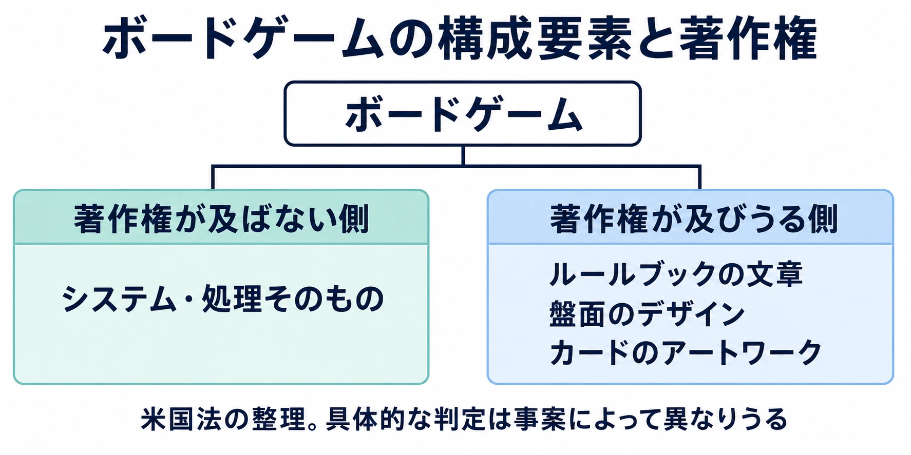
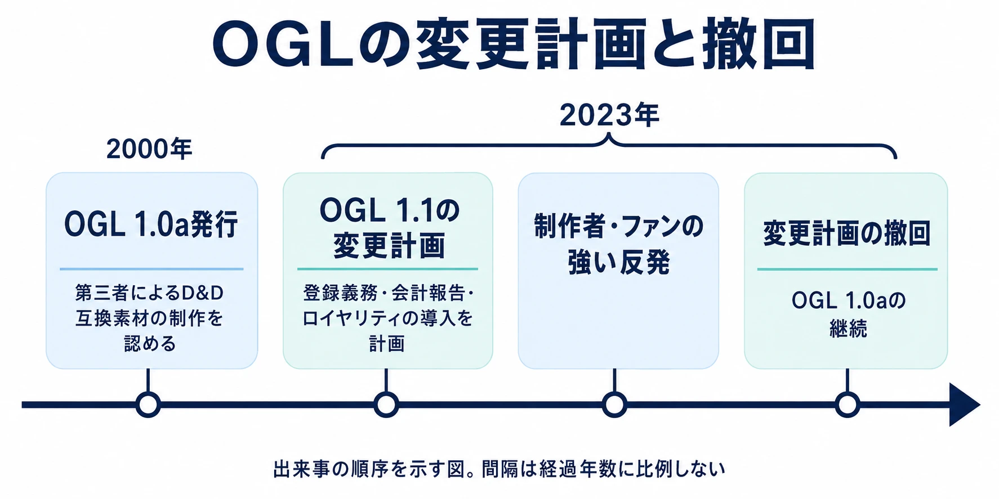
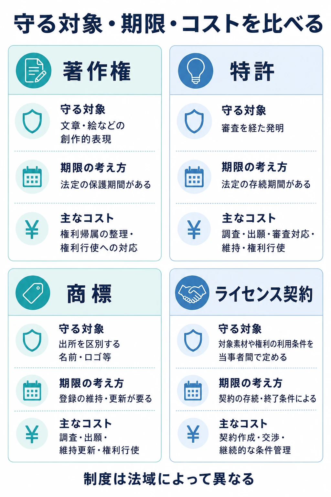

# 遊びの仕組みをどう守るか――特許、開放する契約、名前の選択

> **注意：** 本稿は法的助言ではありません。主に米国の事例から権利と契約の考え方を整理するものであり、個別事案の適法性や権利侵害の成否を判断するものではありません。制度は法域によって異なります。具体的な判断は、必ず弁護士・弁理士・法務部門に確認してください。

「遊び方にパテントはないわけです」

任天堂の元社長・山内溥氏の言葉として知られる一文である。1979年6月23日、NHK総合の「ルポルタージュにっぽん『インベーダー作戦』」で語られたものとして伝えられている。NHKクロニクルの番組表が裏付けるのは、番組の実在と、その日の午後10時15分から放送されたという事実までで、 **発言の文言そのものは一次資料で確認できていない。** [[1](#ref-1)]

インベーダーゲームのブーム下でアーケードゲームのコピーが横行した1979年、その状況についての言葉として流布してきたもの、と位置づける。「パテント」が指すのは特許であり、「遊び方に著作権はない」へと言い換えることもできない。

それでも、この一文が長く語り継がれてきたこと自体に、遊びの仕組みの独占は難しいという業界の共通認識が表れている、と読むことはできる。法解釈の権威としてではなく、「では、業界は何もしてこなかったのか」という問いの出発点にしたい。

「読める仕様書」第4回の判断軸は、 **自社のメカニクスを守りたいとき、著作権以外のどの手段を選ぶか。そして「守らない」も選択肢である** 、というものだ。ルールが読める形で公開されているゲームは、その仕組みを他者が使う条件も考えてきた。

***

## 第1章　メカニクスに著作権は及ばない、という共通の出発点

メカニクスとは、ゲームの中核をなすシステムや処理、つまり遊びの仕組みである。著作権は、文章や絵などの創作的な表現を保護する権利だ。米国法曹協会の『Landslide』誌でDaniel J. Schaeffer氏は、Baker v. Seldenの判例に基づき、システムや処理そのものは著作権の保護対象にならず、ルールブックの文章、盤面、カードのアートワークなどは保護されうると整理している。[[2](#ref-2)]

その帰結として、似た仕組みを持つ別のゲームが成立する余地がある。同論考が挙げるScrabulousからLexulousへの改名・変更やWords With Friendsも、仕組みの類似と、表現や名前の扱いを分けて考える例である。個々の製品を一括して適法と判定する話ではない。[[2](#ref-2)] 構成要素ごとの整理は[既刊の法律ガイド・第5-1章](game-planner-japanese-law-guide.md)に譲り、ここからは別の手段を選んだ業界の歩みを見る。

本文と参考文献[[2](#ref-2)]に基づく概念図。

***

## 第2章　それでも、紙のゲームは特許を取ってきた

特許は、審査を経た発明について、一定期間、他者による実施を排除できる権利である。米国では紙のゲームにも使われてきた。Schaeffer氏が紹介するモノポリーの特許は、盤を巡る連続した経路とマスのグループを備え、同じグループの所有を増やすと賃料が上がる、といった盤と遊びの構成を対象にしていた。[[2](#ref-2)] 第3回[『周回すごろくは、負けている人をどう卓に残すか』](momotetsu-player-controlled-penalties-and-participation.md)で読んだ盤上の仕様には、権利化という別の履歴もあったわけだ。

カードにも例がある。『マジック：ザ・ギャザリング』に関わる米国特許US5662332Aの名称は「Trading card game method of play」。発明者はRichard Channing Garfield、出願人はWizards of the Coast Inc.で、1995年10月17日に出願され、1997年9月2日に登録された。[[3](#ref-3)]

特許の請求項、すなわち保護を求める発明の範囲を記した部分には、使用するカードの向きを変える動作や90度の回転が含まれる。説明部分では、カードのエネルギーが使用中であることを示す「タッピング」の方法として、盤面上で反時計回りに約90度回転させる動作が記されている。手元のカードを横にする、あの状態表示が特許文書の中にある。[[3](#ref-3)]

そして、この特許には終わりがある。 **Google Patentsでは失効（Ceased）と表示され、満了予定日は2014年6月22日と記載されている。** この日付は同データベースの予定日表記に基づくもので、個別の権利状態を法的に確定する判断とは区別する。永続的に遊び方を囲えるわけではなく、期限のある手段を選んでいたことが重要だ。[[3](#ref-3)]

著作権にも保護期間はあるが、特許は発明の内容を公開し、審査を経て、限られた期間の保護を求める仕組みである。何を作ったかだけでなく、いつまでの保護に費用をかけるかが選択に入る。

見た目に向けた手段もある。米国の意匠特許は、物品の装飾的な外観を保護する制度で、新規なゲーム構成物の見た目が対象になりうる。[[2](#ref-2)] 紙のゲームにも、仕組みと外観を権利として扱ってきた歴史がある。「紙は模倣に寛容で、デジタルは権利化へ向かう」という媒体だけの対比では、この選択は捉えられない。

***

## 第3章　開放するという手段――Open Game License

ライセンス契約とは、対象となる素材や権利を、どの条件で使えるか当事者間で定める取り決めである。2000年にWizards of the Coastが発行したOpen Game License 1.0a（以下、OGL）は、当時の『ダンジョンズ＆ドラゴンズ』（D&D）第3版の一部を第三者が利用し、互換素材を作る道を開いた。冒険モジュール、つまり遊ぶためのシナリオ集や、補足的なルールブック、さらには新しいゲームシステムも、その広がりに含まれる。[[4](#ref-4)]

著作権で守れないメカニクスを、契約でわざわざ開放する。ここには一見、逆説がある。仕組みそのものを参考にすることと、公開されたルールの文章などを使って製品を作ることは、制作者にとって別の作業なのだ。

OGLは、利用対象のOpen Game Contentと、名前などを含むProduct Identityを区別し、前者の利用条件を示す。公式のルール参照文書に収録された1.0aでは、対象コンテンツについて、条件に従う永続的・世界的・非独占的・ロイヤリティ不要の許諾を定めている。非独占とは他の制作者も利用できること、ロイヤリティとは権利の利用に対して支払う対価である。D&Dの素材や名前を一律に何でも使えるという意味ではない。[[5](#ref-5)]

この仕組みの価値は、 **第三者が利用条件を見通して制作を始められること** にある、と捉えられる。使える文章や条件が明示されれば、各社が利用範囲を一から交渉する負担を減らせる。契約は、メカニクスに新しい著作権を生むのではなく、素材の利用と制作の関係を整える。

本体のルールで遊べる冒険や補助資料が増えれば、プレイヤーには遊び続ける理由が増える。本体の書籍を必要とする互換素材は、本体への需要にもつながる。法律事務所Stites & HarbisonのThomas J. Mihill（トーマス・J・ミヒル）氏は、第三者の制作がD&Dに継続的な素材と関心をもたらしたと分析している。[[4](#ref-4)] 開放は、他者の制作によって自社のゲームの価値を増やす選択にもなる。

***

## 第4章　開放したものを、囲い直せるか

### 互換素材の制作条件を変える計画

2023年1月、OGL 1.1の案が流出した。ミヒル氏の整理によれば、計画には作品の登録義務とバッジ表示、許諾対象の収入が5万ドルを超える場合の会計報告、75万ドルを超える収入に対する25%のロイヤリティが含まれ、従来のOGL 1.0aを利用し続ける道も閉じようとしていた。制作者とファンからは、即座に強い反発が起きた。[[4](#ref-4)]

登録は何を作ったか届け出る仕事、会計報告は収入を把握して報告する仕事である。従来の条件で売上を見込み、制作や販売を続けてきた人にとって、これらは契約書の文言だけの変更ではない。制作以外の作業と費用が増え、将来の製品を同じ基盤で作るかどうかの判断に及ぶ。

Wizards側は公式声明で、流出した案は最終版ではないと説明し、改訂版にはロイヤリティを含めない方針などを示した。その後、OGL 1.2案への意見募集を経て、1月27日にはOGL 1.0aを変更せず存続させると発表した。[[6](#ref-6)][[7](#ref-7)] **旧条件を使えなくする変更計画は撤回された。**

同時に同社は、ルール参照文書SRD 5.1全体をCreative Commonsのライセンスでも提供するとした。Creative Commonsは、著作物を再利用する条件を共通の形式で示すライセンス群である。公式発表は、この許諾を同社の裁量で変更・撤回できない点を強調した。これはOGL 1.0aの存続とは別に、対象文書を利用できる道を加える措置だった。[[7](#ref-7)]

本文と参考文献[[4](#ref-4)][[6](#ref-6)][[7](#ref-7)]に基づく主要経緯の要約。

### 契約の相手は、すでに事業を作っている

この経緯の教訓は、「利用料を求めると反発される」だけでは狭すぎる。報告や対価を求める設計そのものと、長く使われた条件へ後から追加することを分けて考える必要がある。

ミヒル氏は、ライセンスの設計時に、新技術、新しい著作物の類型、新しい流通方法といった将来の可能性を織り込むべきだとする。そして、変更によって得るものが、ライセンシー、すなわち許諾を受ける相手や、その信用を失うことに見合わない場合があると指摘する。[[4](#ref-4)]

制作側から見れば、ルールの採用は一冊の原稿で終わらない。続編を同じ仕組みで出す、過去の製品と組み合わせられるようにする、使い方を覚えた読者へ次作を届ける。その積み重ねを前提に事業を組む。条件変更で問われるのは、新しい負担の大きさに加え、 **次の制作でも同じ前提を信頼してよいか** である。

この意味で、開放は事実上の一方通行に近づく。これは、あらゆるライセンスが法的に変更不能だという断定ではない。開いた前提の上に他者の仕事が積み上がるほど、条件を戻すために説明し、調整し、引き受けなければならないものが増える、という事業上の性質だ。

権利者が条項を変える権限を持つかという問題と、変更後も制作者が残るかという問題は、別々に答えを出す必要がある。前者が解決しても、後者の信用が自動的に戻るわけではない。

### ゲームの外側にも、仕様の利用者がいる

この判断軸は、MOD（既存ゲームを改変・拡張する追加データ等）や二次創作の許諾にも使える。SDK（外部向けの開発道具一式）やAPI（ソフトウェアの機能・データを外部から使うための接続口）を提供するときも同様だ。

例えば、無料で提供した開発道具を前提に、外部の制作者が拡張コンテンツを販売し始めたとする。後から利用対象を限定するなら、既存作品の配布、購入者への更新、新作の開発に、それぞれ何が起きるかを書き出したい。これはOGLの条件をそのまま移植する話ではなく、条件変更の影響を受ける仕事を見つけるための例である。

開放前には、使える素材や用途とともに、変更の通知、既存成果物の扱い、終了後に残る利用を設計する。変更時には、相手の事業がどこまで依存しているかを確かめ、対話と移行の時間を見込む。利用条件もまた、他者が読んで仕事を進める仕様書になる。

***

## 第5章　名前で守るという手段

商標は、商品やサービスの出所を示し、他の売り手の商品と区別するための標識である。ゲーム名やロゴは、その代表的な対象だ。メカニクスが似ていても、誰の製品なのかをプレイヤーが見分けられるようにする。[[8](#ref-8)]

名前にも維持すべき働きがある。Schaeffer氏は、モノポリーをめぐる事件で、名前が商品の普通名称とみなされるリスクが表面化したことを紹介している。普通名称化とは、特定の出所を示す名前が、商品そのものの一般的な呼び名として扱われることである。ここで読むべきなのは、知名度の大きさと、出所を区別する機能が同じではないという点だ。[[2](#ref-2)]

自社の狙いが「同じ遊びを他社に作らせたくない」なら、名前の保護だけではその狙いを満たさない。一方、「本体や公式の追加商品を見分けて選んでもらいたい」なら、識別子を守る意味がある。開放する契約と組み合わせ、使える素材と公式性を示す名前を分ける設計も考えられる。

***

## 第6章　手段を選ぶ

以下は、自社の方針を法務や事業担当者と相談するためのチェックリストである。特許を取るかどうかだけで話を始めず、守る対象、時間と費用、開放の便益を順に揃えたい。

1. **守りたいのはメカニクスか、表現か、名前か**：仕様のどの部分を他者に使われると困るのか、具体物で挙げる。処理の構成、ルールの文章、カードの絵、商品名では相談すべき手段が違う。ライセンス契約は、そうした対象を誰にどの条件で使わせるかを決める層として考える。
2. **その手段の費用と期限を引き受けられるか**：特許は調査・出願・審査対応に加え、維持と権利行使の負担を見込む。著作権でも権利帰属の整理や紛争対応には手間がかかる。商標登録は出願後の維持・更新、契約は作成後の問い合わせや条件管理まで含めて考える。法定の保護期間、登録の更新、契約の存続条件を、同じ「ずっと使える」で括らない。[[2](#ref-2)][[9](#ref-9)]
3. **開放によって何を得たいか**：互換素材の増加、本体を遊ぶ機会の増加、外部制作者との継続的な関係など、狙う便益を言葉にする。そのために必要な範囲を開き、相手が制作を続けられる条件を用意する。利用料を取らない場合も、運用の担当者と負担は決めておく。
4. **「守らない」を選ぶ条件は何か**：権利化と維持に使う資源より、改善の速さ、遊びやすさ、供給や運営に使う資源の方が自社の強みになるかを考える。独占より普及を優先したい仕組みもありうる。ここでの「守らない」は、自社のメカニクスの独占を追わない選択であり、他者の権利確認を省くことではない。

本文と参考文献[[2](#ref-2)][[5](#ref-5)][[8](#ref-8)][[9](#ref-9)]に基づく概念的な整理。

四つの手段は、どれか一つだけを選ぶものでもない。文章と絵は保護し、名前を管理しながら、互換素材の制作は認める、といった組み合わせも考えられる。日本の特許実務については、[既刊のゲーム特許記事](game-system-patents-risks-and-strategy-for-planners.md)を入口に、個別の仕様と事業条件を専門家へ相談したい。

***

## おわりに

冒頭の「遊び方にパテントはないわけです」は、発言原文を未確認のまま現代の法律の結論に据えられる言葉ではない。本稿では、1979年時点の業界の見立てを伝えるものとして流布してきた一文と位置づけた。そのように読むなら、諦めの言葉で終わらせる必要もない。

業界はその後も、使う手段とその組み合わせを足してきた。紙のゲームの仕組みを特許に記し、契約で第三者の制作を開き、名前で製品を識別する。その途中には、期限の到来も、条件を囲い直そうとして信用を損なう失敗もある。

本稿の事例は米国が中心であり、日本の実務とは法域が異なる。特許の有効性や侵害の成否、契約変更の可否など、個別の判断は専門家に委ねる必要がある。

プランナーが用意したいのは、 **何を守り、そのために何を負担し、他者に何を作ってもらいたいのか** という答えだ。「守らない」も、その答えに合うときに選ぶ。手段を選べること自体が、公開された仕様から学べるもう一つの設計判断である。

## References

1. [ルポルタージュにっぽん「インベーダー作戦」｜NHKクロニクル][1] — 1979年6月23日の番組詳細。番組の実在・放送日時のみの裏付けであり、山内溥氏の発言原文の出典ではない。番組表に発言内容の記録はなく、出演者欄はリポーターの邦光史郎氏のみだが、取材対象者が記載されない場合もあるため、山内氏の登場の有無はこの欄からは判断できない。当該文言を伝える媒体は、本ブログの出典方針では発言の出典として採用しない。番組表の情報は編者による一次資料確認に基づく。

2. [Not Playing Around: Board Games and Intellectual Property Law｜American Bar Association『Landslide』][2] — Daniel J. Schaeffer、Vol.7, No.4、2015年3/4月号。著作権の対象、紙のゲームの特許、意匠特許、商標、類似ゲームの整理を参照。

3. [US5662332A — Trading card game method of play｜Google Patents][3] — 特許公報の書誌、請求項4・5、タッピングの説明、法的ステータス表示を参照。「反時計回りに約90度」は説明部分の文言。2014年6月22日は「Anticipated expiration」の表示であり、Googleはステータスの法的分析や正確性を保証していない。

4. [IP vs. PR: Lessons From the Dungeons and Dragons Open Game License Controversy｜Stites & Harbison PLLC][4] — Thomas J. Mihill、2023年3月23日。OGLの成立、1.1の計画内容、反発、ライセンス設計と信用についての分析。変更後の意見募集の版番号は公式発表[7]に従った。

5. [System Reference Document 5.1 — OGL版｜Wizards of the Coast][5] — 冒頭のLegal Informationと収録されたOpen Game License Version 1.0aを参照。2000年当時の第3版資料ではなく、後年の公式文書に収録された契約本文の確認に使用。

6. [An Update on the Open Game License (OGL)｜D&D Beyond][6] — Wizards側の公式声明。流出案への説明と、ロイヤリティ等の方針修正を参照。

7. [OGL 1.0a & Creative Commons｜D&D Beyond][7] — Kyle Brink、2023年1月27日。OGL 1.2案への意見募集を経た、OGL 1.0aの存続とSRD 5.1のCreative Commonsでの提供の発表。

8. [Trademark, patent, or copyright｜米国特許商標庁（USPTO）][8] — 商標・特許・著作権が扱う対象の区別。

9. [Maintaining your federal registration｜米国特許商標庁（USPTO）][9] — 米国の商標登録の維持、使用の申告、更新と費用。

[1]: https://www.nhk.or.jp/archives/chronicle/detail/?crnid=A197906232215001300100
[2]: https://www.americanbar.org/groups/intellectual_property_law/resources/landslide/archive/not-playing-around-board-games-intellectual-property-law/
[3]: https://patents.google.com/patent/US5662332A/en
[4]: https://www.stites.com/resources/client-alerts/ip-vs-pr-lessons-from-the-dungeons-and-dragons-open-game-license-controversy/
[5]: https://media.wizards.com/2016/downloads/DND/SRD-OGL_V5.1.pdf
[6]: https://www.dndbeyond.com/posts/1423-an-update-on-the-open-game-license-ogl
[7]: https://www.dndbeyond.com/posts/1439-ogl-1-0a-creative-commons
[8]: https://www.uspto.gov/trademarks/basics/trademark-patent-copyright
[9]: https://www.uspto.gov/trademarks/basics/maintaining-registration

----

この文書は、Perplexity、Claude、OpenAI Codex の3つのAIの支援を受けて著述されたものです。引用画像を除き、MIT License にて提供されています。
