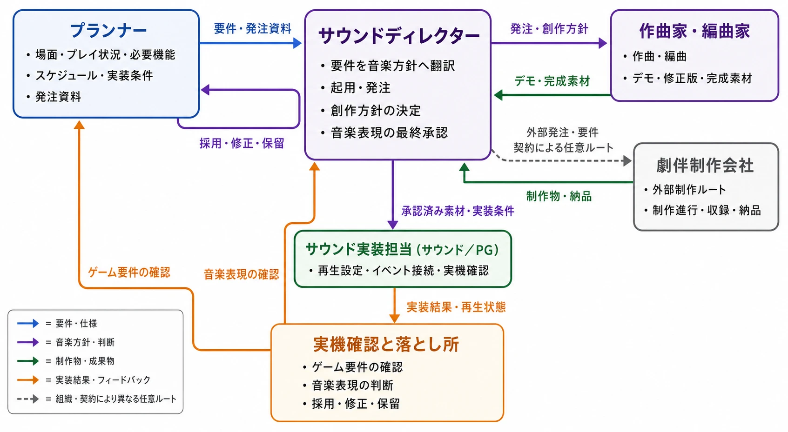
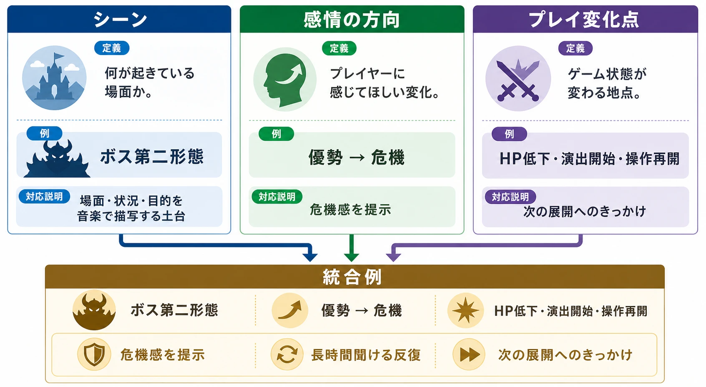
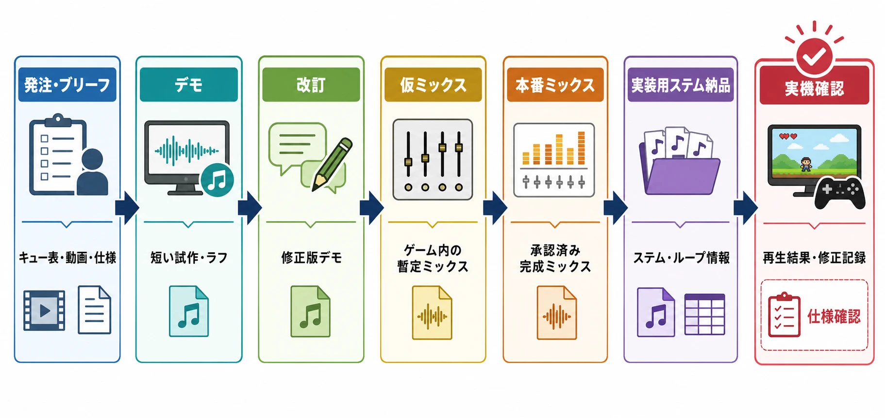
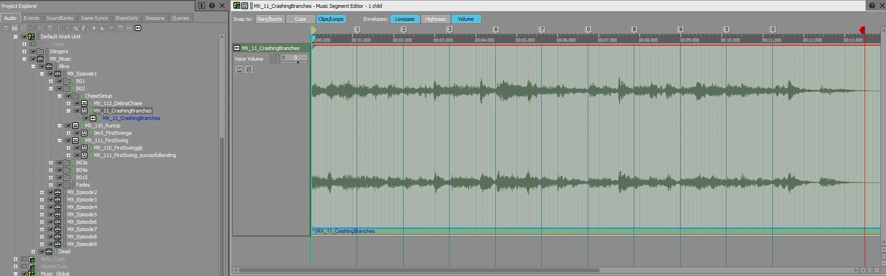
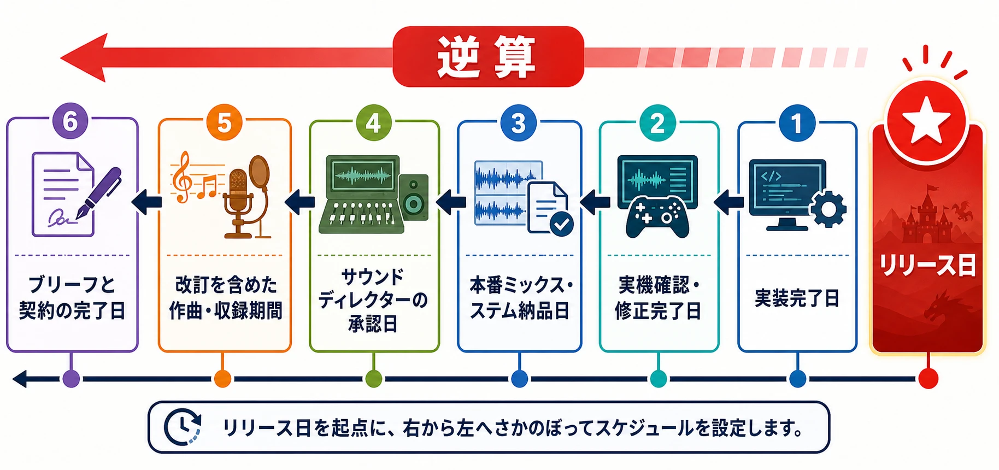

# 劇伴制作の進行管理実務――ゲームプランナーが担う発注・スポッティング・実装橋渡し
### 作曲家とサウンドチームの専門性を尊重しながら、必要な音楽を必要な時期に届けるために

## はじめに：プランナーは音楽を作る人ではなく、必要条件を渡す人である

ゲームの劇伴、つまり場面やプレイ状況を支える音楽の発注では、プランナーが「格好いい曲を考えて作曲家へ伝える人」になろうとしすぎると、役割の境界が崩れる。

作曲・編曲や音楽的な方向性の決定、作曲家や制作会社の起用判断、最終的な音楽表現の承認は、サウンドディレクターの職掌である。組織によって呼称や権限の置き方は異なるが、本稿ではこの分担を前提とする。プランナーが担うのは、どの場面に、どのような音楽的機能が必要かを言語化し、制作を進め、完成した素材を実装可能な形でゲーム側へ橋渡しすることである。

任天堂の制作紹介でも、ゲームの内容から必要な音楽や効果音を洗い出し、サウンド全体の方針を決め、制作後にゲーム上で確認する流れが示されている。さらに、ゲーム中のBGM（背景音楽）はプレイ時間が変動するため、ループや停止、フェード（音量を徐々に変える処理）など、鳴らし方まで考える必要があると説明されている。[[1](#ref-1)] ここで重要なのは、プランナーが音楽の良し悪しを単独で決めることではない。ゲーム側の条件を整理して、サウンドディレクターと作曲家が判断できる材料を不足なく渡すことである。

本稿は、作曲法、編曲法、劇伴の歴史、名曲紹介を扱わない。また、インタラクティブ／アダプティブミュージック（ゲーム状況に応じて音楽が変化する仕組み）の設計論やミドルウェアの使い方を詳しく解説する記事でもない。それらは別の専門領域である。本稿の焦点は、プランナーの仕事である「言語化」「進行管理」「橋渡し」に置く。

***

## 1. 劇伴制作の全体像と役割分担

### 1-1. まず責任の境界を表にする

劇伴制作は、発注書を作って納品物を受け取れば終わる仕事ではない。場面の要求を定義し、制作方針を決め、素材を作り、ゲーム内で鳴る状態まで確認する連続した工程である。外部発注では、NDA（秘密保持契約）、打ち合わせ、制作、修正、実機確認という流れを置く制作会社もある。[[2](#ref-2)]

| 役割 | 主な責任 | プランナーとの接点 |
| --- | --- | --- |
| プランナー | 場面・プレイ状況・必要機能の整理、発注資料、スケジュール、関係者調整、実装条件の収集 | 仕様を言語化し、決定事項を記録する |
| サウンドディレクター | 作曲家・制作会社の起用、音楽的な創作方針、音源の評価、最終的な音楽表現の承認 | プランナーの整理した要求を音楽方針へ翻訳し、判断する |
| 作曲家・編曲家 | 作曲、編曲、デモ制作、修正、ミックス、指定された形式での納品 | シーンの機能と制約をもとに音楽を制作する |
| 劇伴制作会社 | 作曲家の手配、制作進行、オーケストレーション（演奏用に編成・譜面化する作業）、収録、編集、納品管理など。範囲は契約による | 会社窓口として進行と成果物を調整する |
| サウンド実装担当 | ゲーム内の再生設定、イベントやパラメータとの接続、実機確認 | 納品物を実装仕様へ接続し、問題を返す |

サウンドディレクターが社内にいない小規模チームでは、外部会社のサウンドディレクターやプロデューサーが一部を兼任することもある。しかし、プランナーがその代わりに音楽的な最終判断を引き受ける必要はない。判断者が誰かを明確にし、プランナーは要求と事実を整理する方が、修正の責任所在も明快になる。

*図：サウンドディレクターを音楽制作上の判断・発注・承認の中心に置き、プランナーの要件整理、外部制作、サウンド実装、実機確認の流れを示した図。*

### 1-2. プランナーの成果物は「曲の感想」ではなく「使われ方の仕様」である

「壮大に」「切なく」「印象的に」といった形容詞だけでは、作曲家はゲーム内の制約を判断できない。プランナーが最低限渡すべきなのは、次のような情報である。

- どの場面で鳴るか
- プレイヤーはその場面で何をしているか
- 音楽は感情を増幅するのか、状態変化を知らせるのか、時間を支えるのか
- いつ鳴り始め、何をきっかけに終わるか
- その場面にプレイヤーが何秒から何分滞在する想定か
- プレイ状況が変化する地点はどこか
- ボイス、効果音、カットシーンの台詞と競合するか
- ループ、短いジングル、複数のステムなど、実装上の納品条件は何か

プランナーの仕事は、音の正解を決めることではない。音楽が果たすべき機能と、ゲーム側の制約を明確にすることである。

***

## 2. スポッティングを仕様へ落とし込む

### 2-1. スポッティングとは何か

スポッティングとは、どこで、なぜ音楽が必要なのかを場面単位で言語化する作業である。映画やカットシーンのタイムラインに音楽の開始・終了・転換点を置く作業を指す場合もあるが、ゲームではプレイ時間が固定されない。そのため、時刻だけでなく、プレイヤーの状態やゲーム内イベントを併記する必要がある。

発注資料では、次のような「劇伴キュー表」を作るとよい。キューとは、特定の場面や状態に対応する音楽単位のことである。

| 項目 | 書く内容 | 曖昧にしないための質問 |
| --- | --- | --- |
| キューID | BGM_BOSS_01などの一意な識別子 | 後でファイル名、実装イベント名と一致するか |
| 使用場面 | ステージ、カットシーン、画面、クエスト | どのプレイ導線に属するか |
| 開始条件 | 戦闘開始、扉を開く、台詞終了など | 画面上の時刻ではなく、何が起きたら始まるか |
| 終了・転換条件 | 勝利、敗北、会話終了、エリア離脱など | 途中で中断される可能性はあるか |
| 音楽の機能 | 緊張を支える、達成を印象づける、状況変化を知らせるなど | プレイヤーに何を受け取ってほしいか |
| 感情の方向 | 静から動、期待から解放などの変化 | 強さではなく、どちらへ動くか |
| プレイ状況 | 操作可能か、探索か、戦闘か、会話中か | 音楽が主役になる時間はあるか |
| 滞在時間 | 最短・標準・最長の想定 | イントロを置いても聞かれるか |
| 参考資料 | 動画、Vコン、画面、複数のリファレンス曲 | どの要素を参考にするのか |
| 納品条件 | ループ、ステム、イントロ、アウトロ、短い転換素材 | 実装担当が何を必要とするか |

CRIWAREの発注例でも、「通常バトル曲」のような名称だけでは情報が足りず、戦闘の滞在時間、操作可能になるまでの時間、勝敗への遷移、目的、画面動画やVコン（仮編集した動画）を共有する例が示されている。また、参考曲を一曲だけ渡すのではなく、どの要素を参考にするか分かるよう複数の曲を提示する考え方も説明されている。[[3](#ref-3)] これは音楽的な指示を増やすためではなく、作曲家が判断できる材料を増やすためである。

### 2-2. シーン、感情、プレイ変化を別々に書く

一つの欄に「ボス戦を盛り上げる」とだけ書くと、場面、感情、プレイ状況が混ざってしまう。次の三層に分けると、会話がしやすい。

1. **シーン**：何が起きている場面か。例は、ボスの第二形態へ移行する戦闘である。
2. **感情の方向**：プレイヤーに何を感じさせたいか。例は、優勢から危機へ、危機から反撃の予兆へ、である。
3. **プレイ変化点**：ゲームの状態がいつ変わるか。例は、HPが一定値を下回る、演出が始まる、操作が再開する、である。

この三層を一つの文章にすると、次のようになる。

> ボス第二形態の開始時に、プレイヤーが操作を再開するまでの数秒間で危機感を提示する。操作再開後は、プレイヤーが攻撃と回避を続けるため、長時間聞いても疲れにくい反復部分が必要である。HPが一定値を下回った後は、次の展開へ移るきっかけを作る。ただし、音楽が派手になること自体を目的にはしない。

*図：スポッティングの3層を分けて整理し、ボス第二形態の開始時の統合例へつなげた図。*

この文は、メロディ、コード、楽器編成を指定していない。それでも、必要な機能、滞在時間、ゲーム状態、非目的が伝わる。創作の裁量を残しながら、完成後に「仕様を満たしたか」を確認できる書き方である。

### 2-3. リファレンス曲は模倣依頼にしない

リファレンス曲とは、完成品の真似をさせるためではなく、方向性を共有するための参考曲である。渡すときは、曲名やURLだけで終わらせず、次のように要素を分解して記す。

| 参考にする軸 | 書き方の例 |
| --- | --- |
| 時間感覚 | 「冒頭の静けさではなく、0:42以降の推進感を参考にする」 |
| 密度 | 「常に音数が多い点ではなく、節目で密度が上がる点を参考にする」 |
| 音色 | 「金属的な質感と低域の重さを参考にする」 |
| 展開 | 「一定のループの中で、次の状態へ向かう予兆がある点を参考にする」 |
| 使わない要素 | 「ボーカル、固有のメロディ、固有のリズムパターンは求めない」 |

「この曲に似せる」「このメロディを使う」と書くと、模倣依頼や権利上の問題へ近づく。依頼文では「参考曲の固有の旋律・歌詞・編曲を再現しない」「共通する判断軸だけを参照する」と明記する。サウンドディレクターが創作方針を決める場では、プランナーは参考曲の選定理由と、ゲーム内で必要な機能を説明する役に徹する。

***

## 3. デモから実装用納品までの進行管理

### 3-1. マイルストーン（工程上の節目）を先に契約へ入れる

劇伴制作の工程名は会社によって異なるが、管理上は次のように分けると扱いやすい。

| 工程 | 主な成果物 | 決めること |
| --- | --- | --- |
| 発注・ブリーフ | キュー表、動画、参考資料、仕様、契約条件 | 目的、納期、修正回数、納品形式、権利範囲 |
| デモ | 短い試作、または曲の全体像が分かるラフ | 音楽の方向性が要求機能に合っているか |
| 改訂 | デモへの反映版 | 何を残し、何を直すか。新規要件を混ぜないか |
| 仮ミックス | ゲーム内で試せる暫定ミックス | ボイスや効果音と同時に鳴ったときの役割 |
| 本番ミックス | 承認済みの完成ミックス | 音源としての完成、仕様書との一致 |
| 実装用ステム納品 | 個別に扱えるトラック、ループ情報、短い転換素材など | 実装担当が組み込める粒度か |
| 実機確認 | ゲーム内での再生結果、修正記録 | トリガー、ループ、停止、遷移、音量の問題 |

*図：発注・ブリーフから実機確認まで、7工程の主な成果物を示した進行フロー。*

「仮ミックス」は、ゲーム内のボイスや効果音との関係を見るための暫定的な音量・処理を施した版である。「ステム」は、後から個別に音量や出力を扱えるよう分けた音楽トラックを指す。これらの言葉は会社によって範囲が違うため、発注書では用語だけでなく、ファイル数、チャンネル、命名、ループ情報まで書く必要がある。

外部制作の実務では、打ち合わせ時点でスケジュール、制作内容、納品方法、支払い、音声フォーマット、容量やミドルウェアの条件を確認し、修正後に実機チェックを行う流れが紹介されている。[[2](#ref-2)] したがって、納品日は「WAVが届く日」ではなく、「実機で確認できる状態になる日」として計画する方が安全である。

### 3-2. 改訂ラウンドが長引く典型パターン

改訂が増える理由は、作曲家の技量不足だけではない。次のような、発注側の未整理が原因になりやすい。

- デモ確認に参加する人が多く、全員の感想が直接作曲家へ届く
- 「もっと熱く」「もう少し泣ける」のように、機能ではなく印象だけで返す
- デモ承認後に、シーンの滞在時間やカットシーンの尺が変わる
- 参考曲を一曲だけ渡したため、音色・テンポ・密度のどれを指しているか分からない
- 本番ミックス後に、ステム分割やループ位置が追加要件になる
- サウンドディレクターの判断と、プランナーや演出担当の要望が混ざる

対策は、修正をゼロにすることではない。最初に「誰が音楽的な承認者か」を明記し、プランナーがフィードバックを一つの文書へ集約することである。フィードバックには、次の三つを含める。

1. 事実：どの場面の、何秒付近で問題が起きたか。
2. 機能：何を伝えられていないか。例は、危機への変化が聞き取れない、操作再開後に主張が強すぎる、である。
3. 判断：サウンドディレクターが採用する修正方針と、保留する意見。

「良い・悪い」の感想をそのまま改訂指示にしないことが重要である。感想を仕様上の問題へ翻訳し、創作判断はサウンドディレクターへ戻す。

***

## 4. 実装への橋渡しで確認すること

### 4-1. 設計論ではなく、受け渡し条件を決める

アダプティブミュージックでは、音楽を一つの完成ファイルとして受け取るだけでは足りないことがある。Wwiseの公式ドキュメントには、Music Segment、Music Track、プレイリスト、クリップ、キュー、トランジション、Stinger（再生中の音楽に重ねる短い素材）など、実装上の音楽単位が整理されている。[[4](#ref-4)] FMODの公式ドキュメントでも、ループ領域、遷移マーカー、遷移先、テンポや条件を扱うマーカーが説明されている。[[5](#ref-5)]

*画像出典（引用）：Audiokinetic公式ブログ [Making Music Design Choices in Little Orpheus](https://www.audiokinetic.com/en/blog/making-music-design-choices-in-little-orpheus/) の記事掲載画像をWebP変換。画面の説明は [Working with Music Tracks and Music Segments](https://www.audiokinetic.com/library/2025.1.3_9037/?id=working_with_music_tracks_and_segments&source=Help)（Audiokinetic公式ドキュメント）を参照。*

ここから重要なのは、プランナーが音楽システムの設計を決めることではない。サウンドディレクターと実装担当に「何を納品すれば、予定している再生単位を作れるか」を確認し、作曲家・制作会社との契約へ反映することである。

発注仕様には、少なくとも次を含める。

| 確認項目 | 仕様に書く内容 |
| --- | --- |
| 完成ミックス | 通常再生用のフルミックスの有無、長さ、バージョン |
| ステム | 何分割するか。分割名は制作会社とサウンド担当で合意する |
| ループ | ループ開始・終了位置、イントロ、ループ本体、アウトロの区別 |
| 転換素材 | 勝利、敗北、危機、演出開始などの短い素材が必要か |
| 同期情報 | BPM（1分あたりの拍数）、拍子、小節位置、キュー位置。必要な場合だけ要求する |
| ファイル形式 | サウンドチームの標準に従った形式、サンプルレート、ビット深度、チャンネル数 |
| 命名と版管理 | キューID、ステム名、バージョン、修正日、差分の記録 |
| 実装用資料 | ループ位置、想定トリガー、停止条件、注意点を記した一覧 |

「ステムをください」だけでは、ドラム、低音、和声、旋律、効果音的なレイヤーのどこで分けるかが決まらない。分割の粒度は、サウンドディレクターと実装担当が必要とする制御単位に合わせる。作曲家へ音楽的な分割方法まで一方的に指定するのではなく、必要な制御と、納品可能な選択肢を先に確認する。

### 4-2. 実機確認は音源の検収とは別に行う

本番ミックスを承認しても、実装後に問題が出ることはある。たとえば次のような問題である。

- 戦闘開始条件ではなく、画面表示条件で鳴ってしまう
- ループのつなぎ目でクリックや無音が生じる
- 戦闘終了時にアウトロを待たず、次のBGMに上書きされる
- ボイスや重要な効果音と同時に鳴り、音楽の機能が過剰になる
- 再挑戦やリトライでイントロが毎回鳴り、プレイテンポを損なう
- ステムの一つが実装対象から漏れ、デモとゲーム内の印象が変わる

実機確認では「曲が良いか」ではなく、「仕様どおりの条件で、想定した機能が働くか」を見る。次のケースを最低限再生する。

1. 通常開始
2. 最短滞在での終了
3. 最長滞在でのループ
4. 途中からの状態変化
5. リトライ、ロード、ポーズ、シーン離脱
6. ボイス・効果音が重なる状態
7. 音量設定、ミュート、ヘッドホンなど複数の再生環境

プランナーは実装方法のコードを直す立場ではないが、再現条件を記録し、サウンド担当と開発担当が修正できる形で返す立場にある。

***

## 5. ライブサービスのスケジューリング

### 5-1. 納期はリリース日から逆算する

季節イベントや新コンテンツ向けの劇伴は、イベントの仕様が固まってから発注しようとすると遅れやすい。音楽には、発注資料の整理、サウンドディレクターの判断、作曲、改訂、ミックス、収録、実装、実機確認があるためである。

以下は業界平均ではなく、初期計画に置くための管理上の仮目安である。作曲家の稼働、曲数、ボーカルの有無、権利確認、収録方法、社内承認の速度によって大きく変わる。

| 制作規模 | 計画上の仮置き | 早期に確定すべきこと |
| --- | --- | --- |
| 単曲、打ち込み中心、既存の実装方式 | 発注から実装確認まで6〜8週間 | 場面、尺、リファレンス、納品形式、承認者 |
| 複数曲、複数ステム、カットシーン連動 | 8〜12週間 | キュー表、映像尺、遷移点、実装担当の稼働 |
| 生演奏、オーケストラ、歌唱、外部権利を含む | 10〜16週間以上 | 収録枠、編成、譜面、契約、権利、予備日 |

オーケストラ収録会社の料金例では、編成によって価格が変わり、スタジオ、エンジニア、コーディネーター、指揮者、演奏者、譜面準備、マルチトラック録音、ファイル納品などが一つの収録セッションに含まれる。15〜20分の音楽を4時間程度で録音できるという案内もあるが、曲の複雑さや譜面の状態で必要時間は変わる。[[6](#ref-6)] つまり「収録日を一日押さえる」だけでは工程が終わらない。作曲、編曲、譜面、予約、収録、編集、ミックス、納品を別々の依存関係として置く必要がある。

### 5-2. 発注が遅れやすいタイミング

ライブサービスでは、次のタイミングで発注が後ろへずれやすい。

- イベントの報酬や敵の仕様が固まるまで、音楽の用途を決められない
- キービジュアルやシナリオを待ち続け、仮資料でブリーフを始められない
- イベントの告知動画用の音源と、ゲーム内音源を同じ納期で扱う
- 収録や権利確認を「完成曲ができてから」始める
- 前回イベントの修正対応が終わらず、次回の発注判断が遅れる

先回りするには、リリース日から次の締切を逆算する。

1. 実装完了日
2. 実機確認と修正の完了日
3. 本番ミックスとステムの納品日
4. サウンドディレクターの承認日
5. 改訂を含めた作曲・収録期間
6. ブリーフと契約の完了日

*図：リリース日を起点に、実装・実機確認・納品・承認・作曲と収録・ブリーフと契約の締切を逆算する流れ。*

イベントの詳細が未確定でも、音楽の役割、必要曲数の上限、仮の滞在時間、収録の有無だけは先に確認できる。プランナーは「仕様が全部決まるまで待つ」のではなく、「変わらない条件」と「後で変わる条件」を分けて、サウンドディレクターへ早めに渡すべきである。

***

## 6. 予算と権利関係の前提知識

### 6-1. オーケストラ収録と音源ライブラリはコストの発生場所が違う

オーケストラ収録では、演奏者の人数、編成、収録時間、スタジオ、エンジニア、指揮者、コーディネーター、譜面準備、編集、ミックス、追加録音などが費用へ影響する。人数やセッション時間を増やすほど、制作費と日程の両方が膨らみやすい。

音源ライブラリを使う制作では、ライブラリやソフトウェアの購入・サブスクリプション費、作曲家の制作時間、ミックス、追加の演奏者や録音の費用が中心になる。初期費用が小さく見えても、ライセンス条件、必要なライブラリの数、制作担当者の技術、最終ミックスの品質管理が別に必要である。オーケストラより必ず安い、あるいは必ず音質が低いという比較ではない。費用が発生する場所と、納期のリスクが違うという比較である。

また、音源ライブラリの利用許諾は、完成したゲーム音楽の権利を自動的に保証するものではない。たとえばSpitfire Audioは、ライセンスを取得したライブラリを使った商用録音やゲーム内の付随音楽を認める一方、個別の音や音源を別のサンプルライブラリとして再配布することは認めていない。[[7](#ref-7)] 使うライブラリが決まったら、サウンドディレクター、制作会社、法務または契約担当が、その製品のEULA（エンドユーザー使用許諾契約）を確認する必要がある。

### 6-2. プランナーが契約前に確認する項目

意思決定はサウンドディレクターと契約・法務の担当者が行う。プランナーは、後から必要になりやすい利用範囲を洗い出す役割を持つ。

- ゲーム本編、DLC（追加コンテンツ）、季節イベント、復刻イベントで使えるか
- 国内外の配信、プラットフォーム変更、サービス継続後の再利用を含むか
- 公式トレーラー、広告、配信番組、イベント映像で使えるか
- サウンドトラック配信、CD、ライブ演奏で使えるか
- 独占、期間、地域、クレジット、買い切り、印税の条件は何か
- 改訂回数、キャンセル、納品遅延、追加収録の費用はどう扱うか
- ステム、譜面、プロジェクトファイル、編集前の録音素材を受け取れるか
- 制作会社が再委託する場合、権利と責任の窓口はどこか

特に「ゲーム内で使える」と「広告やサウンドトラックでも使える」は同じではない。将来使う可能性があるなら、発注時点で利用目的として列挙し、後から追加許諾が必要にならないかを確認する。

### 6-3. 既存楽曲を使う場合は、作曲者と音源を分けて確認する

既存楽曲の利用では、楽曲そのものの権利と、特定の録音物の権利を分けて考える。JASRACは、ゲームに楽曲を録音する場合、配信とは別にゲーム目的複製の手続きが必要になる場合があり、利用可否や使用料などの条件を事前に確認するよう案内している。また、市販のCDやダウンロード音源を使う場合は、音源製作者やアーティストに関わる著作隣接権の許諾が別途必要であり、編曲や訳詞にも事前確認が必要である。[[8](#ref-8)]

したがって、プランナーが「この有名曲を使いたい」と思った段階で、サウンドディレクターと契約担当へ早めに相談する。候補曲の調査は、実装直前ではなく、企画と予算の段階で行うべきである。許諾が取れない可能性、地域や期間が限定される可能性、広告利用だけ別契約になる可能性を、企画上のリスクとして管理する。

***

## 7. 実務チェックリスト

### 発注前

- [ ] 起用・創作方針・最終承認者がサウンドディレクターであると確認した
- [ ] キューごとの使用場面、機能、開始・終了条件、滞在時間を整理した
- [ ] 参考曲を複数提示し、参考にする軸と使わない要素を書いた
- [ ] 実装担当から、ステム、ループ、転換素材、ファイル形式の条件を受け取った
- [ ] ゲーム本編以外の利用範囲と、既存音源・ライブラリの権利を確認した

### デモ確認時

- [ ] 音楽的な評価と、ゲーム上の機能評価を分けた
- [ ] フィードバックを一つの窓口へ集約した
- [ ] 変更されたシーン尺やプレイ条件を、作曲家へすぐ共有した
- [ ] 改訂内容、担当者、承認日、次の提出日を記録した

### 納品・実装時

- [ ] フルミックスとステムの対応関係を確認した
- [ ] ループ開始・終了、イントロ、アウトロ、転換素材の情報がある
- [ ] 命名規則とバージョンが一致している
- [ ] 通常開始、短時間終了、長時間ループ、リトライ、離脱を実機で確認した
- [ ] 本番ミックスの承認と、実装上の再生確認を別々に完了した

***

## おわりに：音楽の判断を奪わず、判断できる材料を整える

劇伴制作でプランナーが成果を出すのは、自分が音楽的な正解を言い当てたときではない。サウンドディレクターが創作方針を決め、作曲家が音楽を作り、実装担当がゲーム内で鳴らせるようにするための材料が、早く、正確に、同じ文書で共有されているときである。

そのためにプランナーは、場面をキューへ分け、感情の方向とプレイ変化点を分け、リファレンス曲を判断軸へ翻訳し、デモから実機確認までの決定を記録する。納期や予算、権利の確認も、音楽的な創作判断を代行するためではなく、創作が成立する条件を守るために行う。

劇伴制作の進行管理は、音楽を細かく指図する仕事ではない。ゲームの要求を音楽チームが扱える仕様へ翻訳し、完成した音源をプレイヤーへ届くところまで運ぶ仕事である。

## References

1. [ゲームサウンドが出来上がるまで｜任天堂][1] - 必要な音の洗い出し、サウンド方針、ループ、制作後のゲーム上での確認に関する公式紹介。

2. [サウンド制作の流れ｜Studio10][2] - 外部発注における打ち合わせ、制作、修正、実機チェック、納品条件の例。

3. [より伝わるサウンド発注リストの書き方（ゲームの楽曲編）｜CRIWARE Portal][3] - 楽曲発注時の場面、滞在時間、目的、動画、複数の参考曲に関する実務例。

4. [Creating interactive music｜Audiokinetic Wwise Documentation][4] - Music Segment、Music Track、ステム相当のサブトラック、キュー、遷移、Stingerなどの公式ドキュメント。

5. [Authoring Events｜FMOD Studio Documentation][5] - ループ領域、遷移マーカー、遷移先、条件、テンポに関する公式ドキュメント。

6. [OrchestraScoring™ Recording Sessions][6] - オーケストラ収録に含まれる要素、編成別の料金例、収録時間と譜面の関係に関する案内。

7. [Are Spitfire Audio sample libraries royalty free, and can I use them on commercial recordings?][7] - サンプルライブラリを使った商用録音・ゲーム音楽と、音源再配布の制限に関する公式案内。

8. [ゲームの配信｜JASRAC][8] - ゲーム目的複製、市販音源の著作隣接権、編曲・訳詞に関する公式案内。

[1]: https://www.nintendo.co.jp/jobs/introduction/sound/work02.html
[2]: https://studio10.jp/step/
[3]: https://criware.info/sound_order_list_01/
[4]: https://www.audiokinetic.com/en/public-library/2025.1.4_9062/?id=creating_interactive_music&source=Help
[5]: https://www.fmod.com/docs/2.03/studio/authoring-events.html
[6]: https://orchestrascoring.com/custom-sessions/
[7]: https://support.spitfireaudio.com/en/articles/11815239-are-spitfire-audio-sample-libraries-royalty-free-and-can-i-use-them-on-commercial-recordings
[8]: https://www.jasrac.or.jp/users/internet/game/

----

この文書は、Perplexity、Claude、OpenAI Codex の3つのAIの支援を受けて著述されたものです。引用画像を除き、MIT License にて提供されています。
