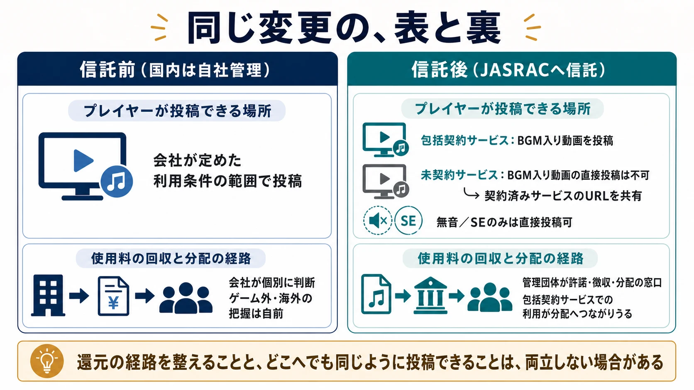
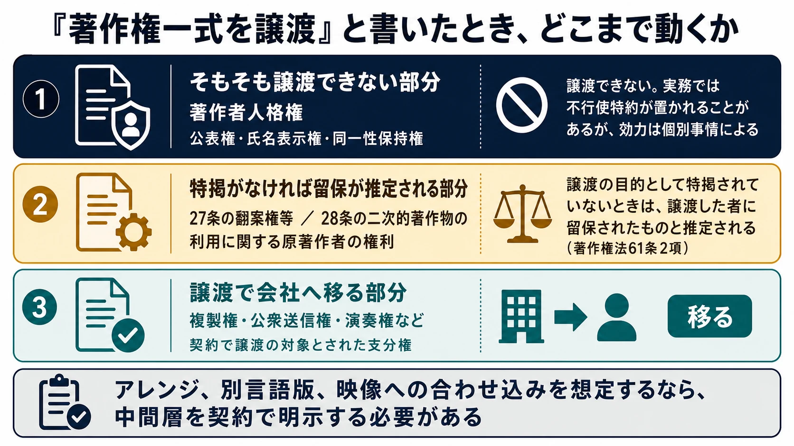
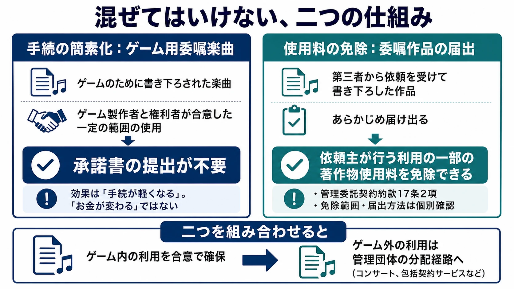
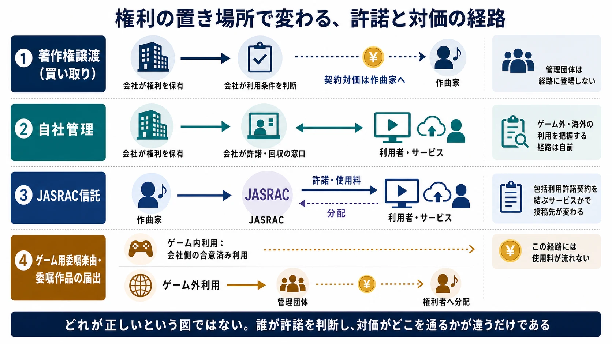
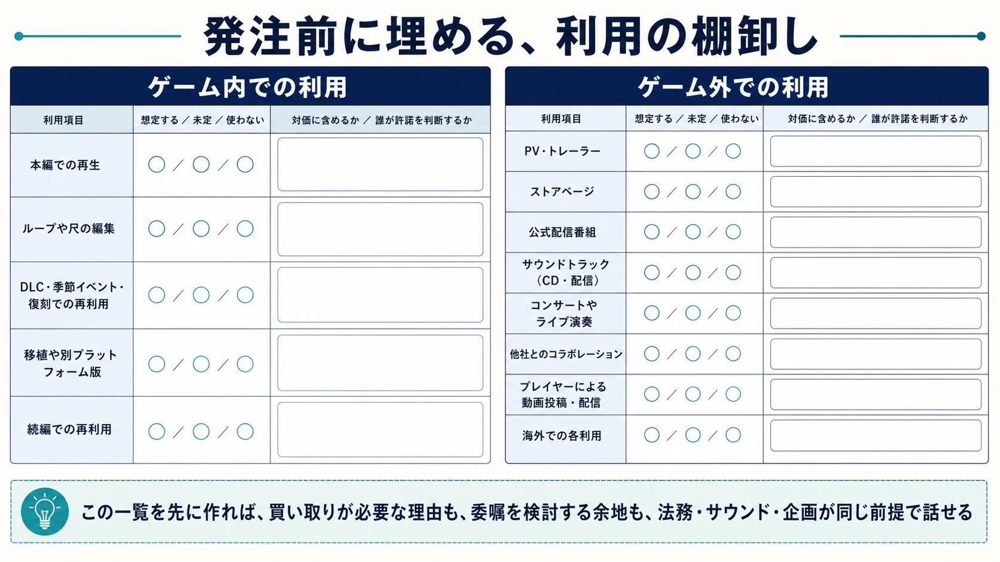

# CEDEC2026フォローアップ：ゲーム音楽の権利をどこに置くか――買い取り・自社管理・信託・委嘱の制度を読む
### 作曲家への報酬とプレイヤーの投稿条件を、同じ「権利の置き場所」から考える

## はじめに：発注実務ではなく、作った曲の行き先を考える

ゲーム用に新しく作られた一曲が、ゲーム内で鳴るだけで終わるとは限らない。トレーラー、サウンドトラック、コンサート、続編、他社とのコラボレーション、そしてプレイヤーによる配信や動画投稿へと、使われ方は後から増えていく。そのとき、曲の著作権を会社が譲り受けて自社で管理するのか、作曲家が保有して管理団体へ信託するのかで、誰が許諾し、どこから使用料が流れ、どのサービスに動画を投稿できるかが変わる。

これは「買い取りは悪い、印税は良い」という二択の話ではない。ゲーム会社には、開発後に増える利用を素早く処理し、タイトル全体を一貫して管理する合理性がある。一方、作曲家が継続利用から対価を得る経路を残す選択肢もあり、その選択はプレイヤーの利用条件にも影響する。本稿は、新規に作らせたゲーム音楽の **権利の置き場所** を対象にする。発注書、スポッティング、納品や実装の進め方は、別記事「[劇伴制作の進行管理実務](game-music-commissioning-and-production-management-for-planners.md)」で扱ったため、ここでは繰り返さない。

起点は、2026年7月23日に第6会場で行われたCEDEC2026の公募パネルディスカッション「『ゲーム音楽の著作権買取』は何が問題なのか？〜JASRAC理事と作曲家が正面から語る〜」である。公式説明も、感情論ではなく、音楽業界の著作権実務とゲーム開発の契約・運用実務との構造的な差異を整理する場だと位置付けている。[[1](#ref-1)]

法律と契約の結論は、作品、当事者、利用地域、契約文言で変わる。本稿は制度を理解して相談の論点を増やすための解説であり、個別案件への法律判断ではない。

***

## 1. セッションレポート：二人が置いた論点

この章は、パネル内の発言を登壇者ごとに要約する。ここで記事として結論を出すのではなく、以降の制度解説に必要な論点を確認する。発言の内容は、当日のセッションを取材した記事に基づく。[[2](#ref-2)]

モデレーターを務めた酒井省吾氏は、ゲーム会社でインハウス作曲家として働いた経験と、独立後に請負側に立つ経験の両方から、発注者側が権利を一元的に管理したくなる事情を説明した。ゲームでは、利用範囲が後から広がりやすい。毎回の許諾を取り直さず、すべてを自社でコントロールできる状態にしておくこと、また管理団体を経由する場合の管理手数料を避けたいことが、買い取りを選ぶ理由として語られた。

酒井氏は、会社に雇用されている作曲家については職務著作という枠組みがあり得る一方、社外の作曲家には同じ枠組みをそのまま使えない点にも触れた。外部発注では、譲渡契約によって会社側が利用をまとめて判断できる状態を作ることになる。また、著作権を譲渡しても著作者人格権は残るため、実務では「著作者人格権を行使しない」という特約が置かれることが多いことも話題になった。

エンドウ.氏は、JASRACへ信託した委嘱作品について、ゲーム会社のゲーム利用と、ゲーム外での利用を切り分けられる制度を紹介した。ゲーム用に書き下ろした曲について、ゲーム側の利用を妨げずに、コンサートや動画サービスなどでの利用からクリエイターへ還元する経路を作れる、という趣旨である。一方で、この選択肢が広く採用されない背景について、酒井氏は、社内にグラフィッカーやプログラマーがいるなかでサウンド関連だけが印税を受け取ることへの「横並び」の意識があるのではないか、と推測として述べた。これは企業側の共通方針を確認した発言ではなく、普及を妨げる要因についての見立てである。

これに対してエンドウ.氏は、世界的にクリエイターファーストの流れがあるなか、印税を分配するインフラを持つ音楽業界から先行してもよいのではないか、と述べた。また両氏は、管理団体等を通じた回収の経路を持たない場合、海外で発生した使用料を把握・回収しにくい点を指摘した。ゲーム本体の売上に比べれば小さい金額であっても、輸出産業として海外利用の対価を取りこぼす問題になり得る、という問題提起である。

比較の視点として、エンドウ.氏はドイツの「ベストセラー条項」と、アメリカでは産業の発展のために著作権を制限する傾向が強いという見解にも触れた。最後に日本も欧州のようにクリエイターや芸術を守る方向へ進んでほしい、という期待が語られた。ただし、これは登壇者の問題意識であり、直ちに日本の契約を一つの型へ寄せるべきだという結論ではない。

このセッションは、特定企業の契約慣行を批判する場として設計されていない。発注者を代表する企業を置かず、酒井氏が中立的に発注者視点を担う構成だったことも、公式ページに明記されている。[[1](#ref-1)] 以降は、この前提を保ったまま、選択肢が何を変えるのかを整理する。

***

## 2. FFXIVが示した「権利の置き場所が変わる」ということ

権利の置き場所は、作曲家と会社のあいだだけで完結しない。プレイヤーがゲーム音楽を含む動画をどこへ投稿できるかにも、具体的な差が出る。

2026年5月7日、スクウェア・エニックスは、ファイナルファンタジーXIVで使われるオリジナル楽曲の音楽著作権を、国内では従来の自社管理からJASRACへ信託したと発表した。同時に著作物利用条件を更新し、音楽データをインターネットで利用する際は、JASRACと包括的な利用許諾契約を結んだサービスを利用するよう案内している。[[3](#ref-3)][[4](#ref-4)]

そのため、JASRACと契約を結んでいないXなどへ、BGM入りの動画を直接投稿することは案内上できない。公式は、YouTubeのような契約済みサービスへ動画を投稿し、そのURLをXで共有する方法を示した。無音の動画や、楽曲ではないSEだけを含む動画は直接投稿できるとも説明している。[[3](#ref-3)]

ここで起きたことは、単純な「禁止の強化」ではない。楽曲利用の対価を回収・分配する経路を整えることと、どのプラットフォームでも同じように投稿できる状態は、両立しない場合があるという可視化である。権利を管理団体へ信託すれば、包括契約を結ぶ動画サービスでは利用と還元の仕組みが接続しやすくなる。その反面、包括契約がないサービスでは、利用方法を変える必要がある。

  

配信ガイドラインやファン創作をどう設計するか自体は、[ゲーム配信・ファン創作ガイドラインの設計](game-streaming-fan-creation-guideline-design.md)で扱っている。本稿で押さえるべきなのは、配信規約の文言だけを後から直しても足りず、音楽の権利をどこで管理するかという選択が、投稿可能な場所の前提になるという点である。

***

## 3. なぜ買い取りが既定路線になったのか

「買い取り」は法律上の厳密な用語ではなく、発注者が作曲家から著作権の譲渡を受ける契約を指して使われることが多い。これは、必ずしも不当な慣行を意味しない。法人がゲーム全体を継続して利用・展開するための、正当な選択肢の一つである。

まず、職務著作を混同しないことが必要である。著作権法15条は、法人等の発意に基づき、その業務に従事する者が職務上作成した著作物について、一定の要件の下で法人等を著作者とする仕組みを定める。これは雇用関係を前提にしたルールであり、外部の作曲家へそのまま当てはめるものではない。社外へ発注する場合、会社が同じように権利を一元管理したいなら、譲渡または十分に広い利用許諾を契約で定める必要がある。[[5](#ref-5)]

買い取りを選ぶ合理性は明快である。ゲーム本編の発売後にも、PV、DLC、移植、サウンドトラック、オーケストラコンサート、イベント、続編での再利用、他社とのコラボレーションといった利用が生じる。各利用ごとに権利者を探し、利用条件と対価を再交渉する設計では、企画が止まりかねない。あらかじめ必要な利用を譲渡範囲へ入れておけば、会社はタイトル単位で迅速に判断できる。

ただし、「著作権一式を譲渡する」とだけ書いても、それで全部が移るとは限らない。著作権法61条2項は、翻案権等を定める27条と、二次的著作物の利用に関する原著作者の権利を定める28条に規定する権利について、譲渡の目的として特掲されていないときは譲渡した者に留保されたものと推定する、と定めている。[[5](#ref-5)] アレンジ、別言語版、映像への合わせ込みといった二次利用を想定するなら、発注側も受注側も、どの利用を含めるのかを契約で明確にする必要がある。

  

重要なのは、買い取りを選んだかどうかだけではない。対価にどの利用を織り込み、何を将来の交渉対象として残したかである。買い取りは「後から使える自由」を会社へ渡す設計であり、その自由の広さと一時金の関係が、契約の中心になる。

***

## 4. 譲渡しても残るもの：著作者人格権

著作権を譲渡しても、作曲した人に残る権利がある。それが著作者人格権である。文化庁は、著作者人格権として、未公表の著作物をいつどのような方法で公表するかを決める公表権、著作者名を表示するかどうかと実名か変名かを決める氏名表示権、意に反する改変を受けない同一性保持権の三つを挙げている。著作権と異なり、著作者人格権は譲渡が認められない。[[5](#ref-5)][[6](#ref-6)]

そのため、譲渡契約には「著作者は発注者に対して著作者人格権を行使しない」とする不行使特約が置かれることがある。発注者にとっては、クレジットを載せない公表、短尺への編集、アレンジ、タイトル変更などを行いやすくするためである。作曲家にとっては、自分の名や曲の扱いに対して異議を述べる余地を狭める条項になる。

ここで「不行使特約があるから、何をしてもよい」と理解してはならない。セッションでも、著作者人格権は大きなトラブルに発展した例があるほど強い権利であり、そのため契約書に不行使が明記されることが多いこと、ただし裁判でそれが無効となる事例もあるため効力の有無はケースバイケースであることが述べられていた。[[2](#ref-2)] 特約の効力や適用範囲は、契約文言、対象となる変更、取引関係など個別の事情で判断される。定型文だけで結論を決めることはできない。

実務では、この論点を抽象語で終わらせない方がよい。少なくとも次の項目は、発注時の仕様と契約の両方で確認する。

- **クレジット**：本編、サウンドトラック、公式サイト、配信動画で、誰をどの表記で載せるか。
- **アレンジ・改変**：ループ用の編集、尺の短縮、歌詞の差し替え、編曲、他媒体への再構成を、誰がどこまで判断できるか。
- **未使用曲**：採用されなかった曲、ゲームから外した曲を、いつ誰が公表できるか。
- **再利用**：シリーズ続編、移植、コラボレーション、コンサートでの利用を、譲渡対価へ含めるか、別途扱うか。

「クレジットを載せる」「大きな改変は事前相談する」のような具体的な取り決めは、会社が必要とする運用の自由と、作曲家が守りたい関係を両方見える形にする。

***

## 5. 委嘱制度という第三の道

譲渡か、完全な自社管理かという二択の間には、管理団体へ信託しながらゲーム側の利用を設計する道がある。ただし、ここには性質の違う二つの仕組みがあり、混ぜて理解すると誤解が生じる。

ひとつは **手続の簡素化** である。JASRACの案内で用いられる呼び方は「ゲーム用委嘱楽曲」で、ゲームのために書き下ろされた楽曲を指す。ゲームに楽曲を使う場合、通常は権利者と利用条件について「承諾書」を取り交わし、それをJASRACへ提出することになるが、ゲーム用委嘱楽曲については、ゲーム製作者と権利者との間で合意した一定の範囲の使用について、この承諾書の提出が不要とされている。[[7](#ref-7)]

もうひとつが **使用料そのものの免除** である。JASRACの管理委託範囲に関するガイドラインは、「委託者の意思に基づく管理の制限」として三つの類型を挙げている。自身の作品を自ら利用する場合（管理委託契約約款17条1項）、タイアップにおける利用（同17条3項・4項）、そして広告、劇場用映画、ゲーム、演劇、ミュージカル、公益事業などで利用することを目的として第三者から依頼を受けて書き下ろした作品——委嘱作品——について、あらかじめ届け出ることで依頼主が行う利用の一部を免除できる仕組み（同17条2項）である。免除できる範囲や届出方法は個別の確認を要するとされている。[[8](#ref-8)]

つまり、承諾書が要らないことと、使用料が免除されることは別の話である。両方を組み合わせて初めて、ゲーム内で鳴らすことやゲームの発売に必要な利用を会社側の合意済み利用として確保しつつ、ゲーム外での利用には管理団体の分配経路を残す、という設計になる。たとえばコンサートの開催や、JASRACと包括利用許諾契約を結んだ動画投稿サービスでの楽曲利用などでは、利用されたことを使用料の分配へつなげられる可能性がある。JASRACは、利用者から支払われた使用料を作詞家、作曲家、音楽出版社などの権利者へ分配すると案内している。[[7](#ref-7)]

  

なお、ゲーム分野の使用料には特徴がある。JASRACは、ゲーム目的複製の使用料について、著作者または音楽出版社が指定する金額——いわゆる指し値——になると案内している。[[7](#ref-7)] 一律の料率が自動的に適用されるのではなく、権利者側が条件を提示する構造である。「管理団体を通すと手数料が引かれる」という買い取りの動機を考えるときにも、この点は押さえておきたい。

ただし、これは「委嘱ならゲーム会社は常に無償で自由に使え、作曲家には自動的に印税が入る」という万能の型ではない。どの権利を信託するのか、ゲーム内・ゲーム販売・広告・配信・サウンドトラック・演奏会のどこまでを免除または許諾するのか、誰が届出をするのかを、契約と手続きで合わせる必要がある。委嘱は、権利を曖昧にする制度ではなく、利用を分けて設計する制度である。

***

## 6. なぜ普及しないのか：横並びと配分の問題

制度が存在することと、現場で選ばれることは別である。酒井氏が示した「横並び」の見立ては、この差を理解するための一つの仮説になる。

ゲームは、プログラマー、グラフィッカー、企画、サウンド、QA、運営など多数の専門職の協働で作られる。そのなかでサウンド関連だけにゲーム後の印税が発生する状態を、発注者側が不公平と受け取る可能性がある、というのが酒井氏の推測である。これは実態を一括りにする根拠にはならない。職種ごとの契約形態、成果の権利構造、雇用か外部発注かは、そもそも同一ではないからである。

むしろ実務上の問いは、「全職種を同じ報酬形態にそろえるか」ではなく、「どの成果について、どの二次利用の対価を、誰へどう配分するか」である。エンドウ.氏が示した、音楽業界の印税インフラからクリエイターファーストを先行させるという見方は、後者の問いに答えようとするものだった。

会社が委嘱を選ばないことにも、運用を複雑にしたくない、将来利用を一元管理したい、社内の報酬設計との整合を取りたいといった理由があり得る。作曲家が買い取りを選ぶことにも、早期に対価を確定したい、事務負担を増やしたくない、案件の予見可能性を重視したいという理由があり得る。選択肢ごとの利害を、善悪ではなく配分と運用の違いとして見る必要がある。

***

## 7. 海外で鳴った曲の使用料を、誰が回収するのか

ゲームが海外で販売され、配信され、コンサートで演奏され、動画で使われるなら、音楽も国境を越えて利用される。セッションで示された「海外の使用料を回収できていない」という論点は、ゲームの輸出規模と音楽の権利処理の規模が一致していない可能性を問うものだった。

ここでも、未信託なら海外使用料が必ずゼロになる、と単純化してはならない。権利者が海外の利用者と直接契約することも理論上はできる。しかし、国・サービス・利用形態ごとに発生を把握し、許諾し、請求し、分配するには仕組みがいる。管理団体への信託は、その回収・分配の窓口を持つ方法の一つである。

ゲーム会社にとっても、これは作曲家だけの問題ではない。ゲーム外で音楽が届く経路を把握できれば、サウンドトラック、ライブ、配信、マーケティングをどう組み合わせるかの判断材料になる。一方、すべての海外利用を自由に展開したいなら、信託の対象範囲や許諾経路を慎重に設計しなければならない。回収可能性と運用の自由は、同時に最大化できるとは限らない。

***

## 8. 制度の地図：一つの正解に寄せない

海外の制度を持ち出す目的は、日本の契約をそのまま置き換えることではない。契約時点の対価と、後に生じた価値との関係を、各国がどう扱っているかを知るためである。

セッションでは、ドイツの著作権法にある「ベストセラー条項」が紹介された。著作物の需要が増加して価値の不均衡が生じた際に、適正な報酬を受け取れるよう交渉したり、契約の見直しを行ったりできるという趣旨の仕組みである。契約を結んだ時点の対価と、その後に生まれた価値とのあいだにずれが生じることを、制度の側で想定しているという点に意味がある。[[2](#ref-2)]

あわせて、アメリカには産業を発展させるために著作権を制限する傾向が顕著だ、という見解も示された。[[2](#ref-2)] この評価を、日本法や米国法の全体像として断定することはできない。ここでは、著作者の事後的な保護を強く置く考え方と、利用・流通の自由を重視する考え方があり、制度ごとに重心が異なるという比較の入口として受け取るべきである。なお本稿では、ドイツの条文の要件や適用範囲まで踏み込んで確認していない。制度設計の参考にする場合は、原典に当たる必要がある。

  

この地図で見るべきなのは、選択肢ごとの交換条件である。

| 権利の置き方 | 会社が得やすいもの | 作曲家に残りやすいもの | あらかじめ詰めるべき点 |
| --- | --- | --- | --- |
| 著作権譲渡（買い取り） | 将来利用を一元判断する自由、許諾を取り直さない運用 | 契約対価、人格権に関する合意の余地 | 譲渡範囲、27条・28条、クレジット、改変、未使用曲 |
| 自社管理 | タイトル全体の管理方針との整合、利用判断の速さ | 契約による報酬・表示条件 | 音楽単体の利用を誰が許諾するか、投稿ガイドライン |
| JASRAC信託 | 管理・許諾・分配の仕組みとの接続 | 継続利用からの分配経路 | 信託範囲、管理手数料、包括契約のないサービスへの対応 |
| ゲーム用委嘱楽曲 | ゲーム用利用を合意で確保しながら、権利管理の経路を残す設計 | ゲーム外利用からの分配を設計する余地 | 免除範囲、届出、ゲーム外利用、誰が何を管理するか |

表は典型的な傾向を示すものであり、契約内容そのものではない。同じ「信託」でも管理を委ねる範囲で結果は異なるし、同じ「買い取り」でも対価やクレジットの定め方で関係は変わる。

***

## 9. まとめ：プランナーが実務で握れること

プランナーが著作権契約を単独で決める必要はないし、決めるべきでもない。しかし、ゲームの使われ方を仕様として最も早く見渡しやすい立場だからこそ、法務とサウンド担当に渡すべき問いを具体化できる。

発注の時点で、まず **ゲーム内での利用** と **ゲーム外での利用** を分けて洗い出す。ゲーム内のループ再生だけでなく、PV、ストアページ、サウンドトラック、公式配信、ユーザー動画、コンサート、続編、コラボレーションまでを、想定と未定に分けて書く。この一覧があれば、買い取りが必要な理由も、委嘱を検討する余地も、関係者が同じ前提で話せる。

  

次に、委嘱制度を「使うべき結論」ではなく、法務とサウンド担当へ提示できる選択肢として持っておく。ゲーム内の利用を確保しつつ、ゲーム外の利用から還元するという設計が、そのタイトルの音楽展開と報酬設計に合うかを検討できるようになる。

さらに、クレジット、改変、未使用曲の扱いを、契約書の定型文に委ねず仕様として書く。誰をどう表示するか。どの編集までを想定するか。外した曲を作曲家が後に発表できるか。こうした細部が、後のサウンドトラックや動画、ライブ展開での摩擦を減らす。

最後に、権利の置き場所を変えれば、配信ガイドラインの条件も変わり得ることを織り込む。ファイナルファンタジーXIVの例が示したように、還元経路を整える選択は、プレイヤーの投稿先に条件を生む場合がある。音楽の契約、管理の仕組み、プレイヤーへの案内は、別々の書類ではあっても一つの体験につながっている。

ゲーム音楽の著作権をどこに置くかは、誰かの権利を一方的に増減させるだけの判断ではない。会社に渡す運用の自由、作曲家に残す継続利用への参加、管理団体に委ねる回収・分配、そしてプレイヤーに提示する利用条件を、どの組み合わせで設計するかという選択である。だからこそ、買い取りを既定路線として受け入れる前にも、反射的に否定する前にも、利用の地図を先に描く必要がある。

## References

1. [「ゲーム音楽の著作権買取」は何が問題なのか？〜JASRAC理事と作曲家が正面から語る〜｜CEDEC2026][1] - 2026年7月23日13:20〜14:20、第6会場、公募のパネルディスカッション。登壇者は酒井省吾（ねこネコ音楽事務所）とエンドウ.（JASRAC 理事）。特定企業を代表する発注者を置かず、モデレーターの酒井氏が中立的な立場から発注者視点を担うという設計意図も記載されている。

2. [なぜゲーム会社は音楽を"買い取る"のか？職務著作の課題やクリエイターを守るJASRACの委嘱制度を考える【CEDEC2026】｜Gamer][2] - 当日のセッションを取材した記事。買い取りの理由、著作者人格権の不行使特約とその効力、委嘱制度、社内の横並び意識、海外使用料の取りこぼし、ドイツのベストセラー条項とアメリカの傾向に関する各登壇者の発言を報じている。

3. [FFXIV全楽曲のJASRAC信託および著作物利用条件の更新について｜FINAL FANTASY XIV, The Lodestone][3] - 国内では自社管理だったオリジナル楽曲の音楽著作権をJASRACへ信託したこと、包括的な利用許諾契約を締結しているサービスの利用案内、XなどへはURLを共有する形での利用、無音の動画やSEなど楽曲でないデータを含む動画は直接投稿して問題ない旨を示すスクウェア・エニックスの公式告知。

4. [『FF14』BGM付き動画のX（Twitter）投稿を制限。全オリジナル楽曲著作権をJASRACに信託したため｜ファミ通.com][4] - 上記の告知が2026年5月7日に行われたことを、公式アカウントの投稿とともに記録した報道。公式告知ページ自体には日付の表示がないため、発表日の典拠として併記する。

5. [著作権法｜e-Gov 法令検索][5] - 職務著作を定める15条、著作者人格権の一身専属性を定める59条、27条・28条の権利が譲渡の目的として特掲されていないときは譲渡者に留保されたものと推定する61条2項。

6. [文化芸術活動に関する法的問題についてよくあるご質問｜文化庁][6] - 著作者人格権を公表権・氏名表示権・同一性保持権として説明し、著作権と異なり譲渡が認められないことを示す解説（Q2-⑯）。

7. [ゲームの製作｜JASRAC][7] - ゲーム目的複製の使用料が著作者または音楽出版社の指定する金額（指し値）であること、ゲーム用委嘱楽曲については合意した一定の範囲の使用について承諾書の提出が不要であること、支払われた使用料が作詞家・作曲家・音楽出版社などへ分配されることを案内している。

8. [管理委託範囲選択区分（演奏権分野）の運用に関するガイドライン｜JASRAC][8] - 「委託者の意思に基づく管理の制限」として、自己利用（管理委託契約約款17条1項）、委嘱作品（同17条2項）、タイアップ（同17条3項・4項）の三類型を整理し、委嘱作品についてはあらかじめ届け出ることで依頼主が行う利用の一部の使用料を免除できるとしている。

[1]: https://cedec.cesa.or.jp/2026/timetable/detail/s6973f08fbd9f2/
[2]: https://www.gamer.ne.jp/news/202607250015/
[3]: https://jp.finalfantasyxiv.com/lodestone/news/detail/41c6b418731738efb829aec618e2fbe7a12456b1
[4]: https://www.famitsu.com/article/202605/74167
[5]: https://laws.e-gov.go.jp/law/345AC0000000048
[6]: https://www.bunka.go.jp/seisaku/bunka_gyosei/kibankyoka/faq/index.html
[7]: https://www.jasrac.or.jp/users/game/
[8]: https://www.jasrac.or.jp/creators/contract/pdf/contract-guideline.pdf

----

この文書は、Perplexity、Claude、OpenAI Codex の3つのAIの支援を受けて著述されたものです。引用画像を除き、MIT License にて提供されています。
