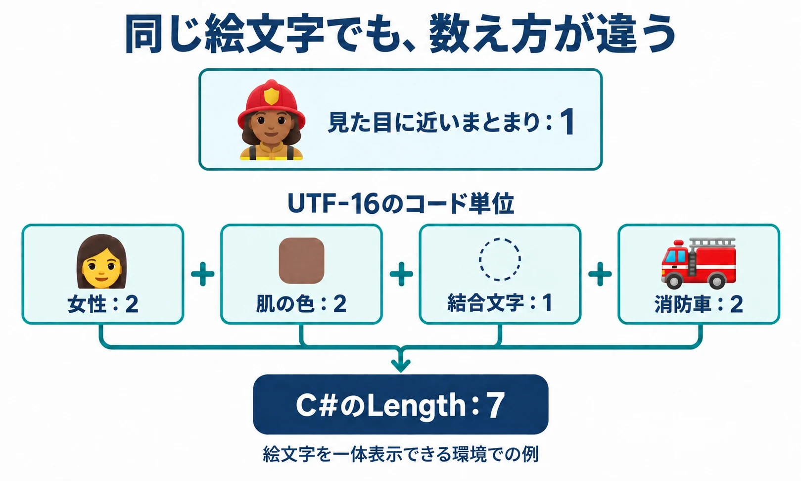

# 「名前は6文字まで」の裏にある三つの決めごと――ゲームプランナーのための文字と文字コード

初代『ドラゴンクエスト』は、64KBの容量にプログラムも絵も音楽も収めていた。堀井雄二氏のCEDEC 2009講演を伝えたGAME Watchによると、文字を6ビットに収め、使えるカタカナを20文字に絞っていたという。[[1](#ref-1)] 前回の[ゲームの上限値の話](game-numeric-limits-for-planners.md)と同じく、ビット数を決めると扱える組み合わせの数が決まる。6ビットなら64通りであり、その限られた枠へ文字などを割り当てる必要があった。

現在の『ドラゴンクエストX』にも、名前の決まりがある。公式プレイガイドでは、ひらがな・カタカナと「－」「～」「・」を使い、6文字以内で付けるよう案内している。[[2](#ref-2)] 容量に大きな余裕が生まれた現在も、名前に使える文字と長さは、ゲームのルールとして選ばれている。

では、仕様書に「名前は6文字まで」と書けば、必要なことは伝わるだろうか。実は、この一行には少なくとも三つの決めごとが隠れている。

1. **何を1文字と数えるか**：画面では一つに見えても、内部では複数に数えられることがある。
2. **どの文字を使えるようにするか**：入力できても、名前を表示する別の画面で読めるとは限らない。
3. **同じに見える文字をどう揃えるか**：表記を変えたすり抜けを防ぐ一方、無関係な名前まで拒まない工夫が要る。

本稿は「ゲームプランナーのためのコンピュータ科学」の第2回として、この三つを扱う。名前を決めるプレイヤーの体験から、文字を扱う仕組みを見ていこう。

***

## 1. 何を「1文字」と数えるか

### 文字には、番号と保存方法がある

コンピュータは文字を数値として扱う。大まかには、文字に番号を付け、その番号を決められた形式で保存・送信している。これが **文字コード** を理解する入口だ。

多くの言語の文字を共通の体系で扱う規格が **Unicode** である。そこで文字などに割り当てられる番号を **コードポイント** と呼ぶ。そしてUTF-8やUTF-16は、その番号をデータにする方式だ。「どの文字かを示す番号」と「番号をどう保存するか」は分けて考えるとよい。[[3](#ref-3)]

この仕組みがあるため、長さにも複数の数え方が生まれる。

| 数え方 | 数えているもの | 主に知りたいこと |
|---|---|---|
| バイト数 | 保存・送信するデータの量 | 保存先や通信で収まるか |
| プログラム上の長さ | その言語や機能が定める内部の単位 | 処理がいくつの単位を扱うか |
| 見た目に近い文字数 | 人が一つの文字と受け止めるまとまり | プレイヤーに何文字まで入力してもらうか |

「全角は2、半角は1」という数え方になじみがある人もいるだろう。ただし、 **文字の表示幅とバイト数は別のもの** である。たとえばUTF-8では「A」は1バイト、「あ」は3バイトだ。同じ文章でも保存方式によってデータ量は変わるため、バイト数で制限するなら方式も一緒に決める必要がある。[[3](#ref-3)]

### 絵文字一つが、プログラムでは「7」になる

Unityなどで使われるC#では、文字列の通常の長さである `Length` は、UTF-16の **コード単位**、つまり内部の16ビットの区切りを数える。見た目の文字数を直接数える機能ではない。[[3](#ref-3)]

| 入力例 | C#の `Length` | 見た目に近いまとまりの数 |
|---|---:|---:|
| あ | 1 | 1 |
| 🌹（バラ） | 2 | 1 |
| 𠮷（つちよし） | 2 | 1 |
| 👩🏽‍🚒（肌の色を指定した女性消防士） | 7 | 1 |

消防士の例は、「女性」「肌の色」「見えない結合文字」「消防車」の組み合わせである。内部の長さはそれぞれ2・2・1・2で、合計7になる。Microsoftの説明にも、この例が登場する。[[3](#ref-3)] 一つの消防士として表示できる環境を前提とした例であり、結合文字なしで女性と消防車を並べたものとは異なる。

したがって、単純に「長さが6を超えたら拒否する」と実装すると、消防士一つでも上限を超える。一部の漢字も長さ2なので、絵文字を禁止すればすべて解決する話でもない。

### プレイヤーに見せる数え方を選ぶ

人が一文字と受け止めるまとまりを扱うために、Unicodeには **書記素クラスタ** という区切り方がある。ここでは「見た目の一文字に近いまとまり」と考えればよい。Unicodeの技術文書UAX #29は、利用者が認識する文字数を示すなら、このまとまりで数えるべきだとしている。[[4](#ref-4)]

一方、サービス独自の数え方もある。SNSのXでは、日本語・中国語・韓国語の文字と絵文字を重み2で数える。肌の色を変えたり、複数の要素をつないだりした絵文字も、全体で2として扱う。[[5](#ref-5)] これは保存データの量ではなく、投稿の長さを決めるためのルールだ。

名前入力でも、「見た目の一文字に近いまとまりで6文字まで」とするのか、使える文字を絞ったうえで別の数え方を採るのかを選ぶ。そのルールを入力欄の残り文字数にも合わせたい。

さらに、上限を超えた文字列を切り詰めるなら、 **文字の途中で切らない** 必要がある。内部の区切りで機械的に切ると、漢字を表すデータや、絵文字を構成するまとまりが分断され、表示が壊れる場合がある。[[3](#ref-3)] 名前なら、勝手に末尾を削るより、超過を知らせて本人に直してもらう設計も考えられる。

なお、見た目に近いまとまりで数えても、データ量まで一定になるわけではない。UAX #29も、必要なら文字数制限とデータ量の制限を併用するよう説明している。[[4](#ref-4)] プレイヤー向けの「6文字」と、保存・通信を守るための上限は、目的の異なる決まりなのである。

数値はMicrosoft Learnの説明に基づく。[[3](#ref-3)]

***

## 2. どの文字を使えるようにするか

### 名前が表示される先まで考える

文字の番号が正しく届いても、画面に描くための字形が必要になる。それを用意するのがフォントである。名前に使える文字を決めるときは、 **その文字を描けるか** も確認しなければならない。

UnityのTextMeshProには、主に使うフォントに字形がないとき、補助のフォントなどを順番に探す **フォールバック** という仕組みがある。文字の種類が多い日本語などを、複数のフォント用データに分けて持つ用途にも使える。探した先にも字形がなければ、欠けた文字の代わりを示す記号が使われる。[[6](#ref-6)]

フォントを複数持つのは選択肢の一つであり、日本語なら必ずそうするという意味ではない。また、フォントに入っている文字をすべて名前に許可する必要もない。 **表示できる範囲を確認し、その中からゲームで許可する範囲を選ぶ** のが仕様判断だ。

確認先は、名前入力画面だけでは足りない。

| 表示する場所 | 確認したいこと |
|---|---|
| 頭上の名前、チャット、フレンド一覧 | それぞれのフォントで同じ名前を読めるか |
| ランキング、結果画面 | 小さな文字でも判別でき、表示枠に収まるか |
| 公式Webサイトや連携サービス | ゲームから受け取った名前を正しく表示できるか |
| 他言語版と交流する画面 | 相手側の表示環境でも読めるか |

見た目に近い単位で6文字と数えても、その6文字の横幅がいつも同じとは限らない。文字数の判定と、画面の表示確認は両方必要になる。

### PCの環境によっても結果が変わる

表示の問題には、字形の不足とは別に、データを文字として読む際の食い違いもある。コーエーテクモゲームスのサポートは、ゲーム内や文字入力画面の文字化けについて、PCの言語設定が原因になりうると案内している。システムロケールという言語・地域の設定や、「Unicode UTF-8を使用」というベータ設定が確認対象に挙がっている。[[7](#ref-7)]

これは同社の対象製品に関する案内であり、UTF-8自体が文字化けの原因という意味ではない。プランナーが持ち帰りたいのは、開発側の一台で表示できたことだけでは、対応するプレイヤー環境すべての保証にはならない、という点だ。

名前入力の仕様には、使える文字の一覧に加え、表示先と確認する環境も残したい。翻訳を含む制作工程全体は[ゲームローカライズの工程と実践](game-localization-guide.md)に譲り、ここでは「一度付けた名前を、どこでも読めるか」に焦点を置く。

***

## 3. 同じに見える文字をどう揃えるか

### 比較する前に、表記を揃える

半角の「A」と全角の「Ａ」、大文字の「A」と小文字の「a」は、それぞれ別の文字として扱われる。名前に含まれる禁止語をそのまま比較するだけでは、表記を変えた入力が判定をすり抜けることがある。

そこで、判定前に一定の形へ揃える。このような処理を広い意味で **正規化** と呼ぶ。ドリコムの技術ブログは、全角と半角を揃えることで、「090」を「０9０」と混ぜ書きして判定を逃れる行為に対応したと説明している。[[8](#ref-8)]

ただし、「正規化する」と書くだけでは、何を同じにするかが曖昧だ。全角・半角の統一と、大文字・小文字を区別しない比較は、別々に指定したい処理である。Unicodeの正規化にも複数の方式があり、幅の違いなどを揃える方式は、本来あった区別を取り除く。[[9](#ref-9)]

たとえば、仕様には次のように判断を書く。

- **揃える範囲**：全角・半角、大文字・小文字など、どの違いを無視するか。
- **使う目的**：禁止語の判定だけか、同名チェックや検索にも使うか。
- **表示への反映**：判定用の文字列だけを揃えるか、プレイヤーに見せる名前も変えるか。

これらは本稿の設計上の提案である。判定のために揃えることと、本人が選んだ表記を書き換えて保存することは、別々に決められる。

### 揃える範囲と、禁止語を探す範囲はセットで決める

違いを広く無視するほど、同じと判断される入力は増える。すり抜けを減らす効果は期待できるが、問題のない名前まで禁止語と一致する可能性も考えたい。

さらに、表記を揃える処理とは別に、 **単語の一部分まで禁止語として拾うか** という問題がある。ドリコムは、英語などでは単語の境界を考慮する工夫を紹介し、日本語では人名などの固有名詞に禁止語が部分的に含まれ、誤検知する課題を挙げている。日本語には空白のような分かりやすい区切りがないためだ。[[8](#ref-8)]

したがって、「正規化を強くすれば安全になる」とは限らない。揃える範囲を変えたときには、拒否したい入力だけでなく、通したい普通の名前も一緒に確認する。表記の統一と、部分一致による検出を混同せずに調整することが大切だ。

プレイヤーに見えるのは、こうした内部処理の結果である。カプコンの『モンスターハンター ストーリーズ』のFAQは、禁止用語を含む名前を登録できず、「その名前は使用できません」などと表示されることを説明している。[[10](#ref-10)]

自分のゲームでは、文字数超過、使えない文字、禁止語を含む名前を、それぞれどう伝えるかを決めたい。少なくとも、次に何を直せばよいか分かる案内が必要だ。通報や制裁を含む運営全体については、[オンラインゲームの有害行動対策](online-game-harassment-moderation-design.md)を参照してほしい。

***

## 4. 編者の考察：なぜドラクエXは、かなを中心にしたのか

日本版ドラクエXの名前は、かなと指定の記号に限られている。この理由を説明した公式資料は確認できていない。以下は、入力規則から考えられる利点を整理した **編者の考察** である。

### 仮説1：読みを共有しやすい

かなの名前なら、漢字の読み方を推測する負担が小さくなる。初対面の相手にも、チャットや音声で呼びかけやすい。文字列だけから発音が完全に一つに決まるとは限らないが、漢字の人名にある複数の読みという問題を減らせる。

### 仮説2：似た字の取り違えを減らせる

カタカナの「ロ」と漢字の「口」、長音符の「ー」と漢数字の「一」は、フォントによってよく似て見える。漢字を名前に使わせなければ、こうした組み合わせの片方を入口で除ける。

これは、似た名前を使うなりすましや、似た字への置き換えによる禁止語判定のすり抜けを減らす方向に働くと考えられる。前節の「判定前に揃える」に加え、「最初から使える文字を絞る」という選択だ。ただし、かな同士の見間違いや表記の工夫は残るため、これだけで対策が完成するわけではない。

なお、公式ガイドが記号として掲げているのは「－」である。ここで例にした長音符「ー」とは別の文字なので、実際の許可文字一覧を作る際は、見た目だけで置き換えないことも大切だ。[[2](#ref-2)]

### 仮説3：シリーズの名前入力の慣例を受け継いだ

スマートフォン版『ドラゴンクエストIV 導かれし者たち』も、主人公名は最大4文字で、ひらがな・カタカナと一部の記号・空白を使う。[[11](#ref-11)] かなを中心とする名前入力は、ドラクエXだけの特徴ではない。

この例は、先ほどの仮説を点検する反証にもなる。他プレイヤーとの呼びかけを前提にしない一人用のドラクエIVでも同様の制限があるため、オンラインの交流やなりすまし対策だけでは説明しきれない。シリーズの入力の慣例や、名前の見せ方を受け継いだ可能性も残る。

一方、 **中国大陸向けの中国語版では、漢字のプレイヤー名を使えていた。** 17173に公式名義で掲載された2016年7月6日の画面ガイドには、自分のキャラクター名として「卡卡」、他のプレイヤー名として「科比」「神话八」が表示されている。ガイドは、自分の名前を緑、別のパーティのプレイヤー名を青で表示すると説明しており、NPC名と区別できる。[[12](#ref-12)]

この例から、ドラクエXで漢字のプレイヤー名を扱うこと自体は可能だったと分かる。日本版のかな限定は、その言語版で採用された名前の規則として考えたい。また、漢字名を使う中国語版と、かなを中心とする一人用のドラクエIVを合わせて見ると、オンラインかどうかだけで使用文字が決まるわけでもない。

**日本語での呼びやすさ、見間違いの減少、シリーズの慣例は、かな中心の規則が持つ利点や背景の候補である。** どれが実際の採用理由だったかは、この比較だけでは決まらない。自分のゲームへ同じ規則を採り入れるなら、どの利点を求めるのかを先に決めたい。

***

## 5. 名前入力の仕様で決めること

名前は、プレイヤーが自分で選ぶ小さな表現の場である。自由度をどこまで持たせるかと、確実に表示・判定できる範囲を、一緒に考える必要がある。

仕様書の「名前は6文字まで」を具体化するときは、次の四項目を確認したい。

- [ ] **数え方と上限**：何を1文字と数え、何文字までにするか。残り文字数の表示と判定を一致させ、超過時に拒否するか切り詰めるかも決めたか。
- [ ] **使える文字と表示先**：かな、漢字、英数字、記号、空白、絵文字をどこまで許可するか。ゲーム内、ランキング、Webサイト、他言語版など、すべての表示先で確認できるか。
- [ ] **表記を揃える範囲と誤検知**：判定前にどの違いを無視するか。表示用の名前にも反映するか。通したい名前が誤って拒否される場合をどう扱うか。
- [ ] **拒否したときの案内**：文字数、使える文字、禁止語の問題をどう伝え、プレイヤーが修正できるようにするか。

エンジニアとの確認には、説明文に加えて具体例が役立つ。「あいうえおか」は通るか、「あいうえおかき」はどうなるか。「𠮷」は使えるか。絵文字を許可するなら「👩🏽‍🚒」をいくつと数えるか。半角と全角を混ぜた入力をどう判定するか。こうした入力と期待する結果を並べれば、同じ「6文字」を思い浮かべているか確かめられる。

**名前の上限は、数値と、その数値を数えるルールで一組である。** そこへ使える文字と比較のルールを加えることで、プレイヤーにも実装者にも伝わる仕様になる。

## References

1. [GAME Watch編集部「堀井雄二氏が持つ『ドラゴンクエスト』の文法とは？」][1] — GAME Watch、2009年9月4日。CEDEC 2009での堀井雄二氏の講演を取材したレポート。64KB、文字の6bit化、カタカナ20文字についての発言。

[1]: https://game.watch.impress.co.jp/docs/news/312961.html

2. [スクウェア・エニックス「プレイガイド：冒険の開始と終了」][2] — ドラゴンクエストX 目覚めし冒険者の広場、2026年9月24日参照。「なまえ」の使用文字と6文字以内の規則。記号は原文の表記に従う。

[2]: https://hiroba.dqx.jp/sc/public/playguide/guide_2_2/

3. [Microsoft「Character encoding in .NET」][3] — Microsoft Learn、2026年9月24日参照。Unicode、UTF-16、文字列の長さ、絵文字の構成、文字列を分割する際の注意。表の「あ」「𠮷」とUTF-8の「あ」の値は同資料の符号化規則に基づく計算例。

[3]: https://learn.microsoft.com/en-us/dotnet/standard/base-types/character-encoding-introduction

4. [Unicode Consortium「Unicode Standard Annex #29: Unicode Text Segmentation」][4] — Unicode 18.0.0、Revision 49、2026年9月1日。利用者が認識する文字数と書記素クラスタ、文字数制限とデータ量制限の区別。

[4]: https://www.unicode.org/reports/tr29/tr29-49.html

5. [X「Counting Characters」][5] — X Developer Platform、2026年9月24日参照。CJKの文字と絵文字の重み、結合された絵文字の扱い。

[5]: https://docs.x.com/fundamentals/counting-characters

6. [Unity Technologies「Fallback font assets」][6] — Unity uGUI 2.0.0ドキュメント、2026年9月24日参照。TextMeshProのフォント探索と欠落字形の代替表示。

[6]: https://docs.unity3d.com/Packages/com.unity.ugui@2.0/manual/TextMeshPro/FontAssetsFallback.html

7. [コーエーテクモゲームス「【共通】ゲーム内や文字入力画面でテキストが文字化けする/正常に表示されない」][7] — ユーザーサポート、2026年9月24日参照。WindowsのシステムロケールとUTF-8ベータ設定に関する案内。

[7]: https://support.gamecity.ne.jp/hc/ja/articles/21878019777817

8. [keiichironagano「NGワード検出の工夫とこれから」][8] — Tech Inside Drecom、2016年12月15日公開、2019年1月4日更新。全角・半角の統一、単語境界を使う判定、日本語の固有名詞などの誤検知。

[8]: https://tech.drecom.co.jp/detect-ng-words-and-future/

9. [Unicode Consortium「Unicode Standard Annex #15: Unicode Normalization Forms」][9] — Unicode技術文書、2026年9月24日参照。正規化方式と、互換性のための区別を取り除く際の注意。

[9]: https://www.unicode.org/reports/tr15/

10. [カプコン「『その名前は使用できません』『使用できない言葉が含まれています』と表示されて文字入力ができない」][10] — モンスターハンター ストーリーズ（ニンテンドー3DS）サポート、2026年9月24日参照。禁止用語を含む名前・コメントの登録拒否。

[10]: https://www.capcom.co.jp/support/faq/platform_nintendo3ds_mh-stories_0135879.html

11. [スクウェア・エニックス「主人公の名前は何文字まで入力できますか？」][11] — ドラゴンクエストIV 導かれし者たち［iOS/Google Play］サポート、FAQ番号70299、2026年9月24日参照。

[11]: https://support.jp.square-enix.com/faqarticle.php?kid=70299&id=9481&la=0&ret=faq&pv=10&page=3&c=0&sc=0&so=4

12. [公式名義「《勇者斗恶龙X》新手攻略：游戏界面介绍」][12] — 17173、2016年7月6日。著者欄は「官方」。本文の「主界面」にある名前の色分けの説明と、掲載画像「画面2.jpg」の[原寸画像](https://i.17173cdn.com/2fhnvk/YWxqaGBf/cms3/kRSQRPbkwFtEsuj.jpg)を照合。自分の名前「卡卡」と他プレイヤーの漢字名を確認した。媒体上に残る公式名義の画面資料であり、許可文字の全範囲や正式サービス期間を通じた入力規則まで示すものではない。2026年9月24日参照。

[12]: https://dqx.17173.com/content/07062016/160621512.shtml

----

この文書は、Perplexity、Claude、OpenAI Codex の3つのAIの支援を受けて著述されたものです。引用画像を除き、MIT License にて提供されています。
