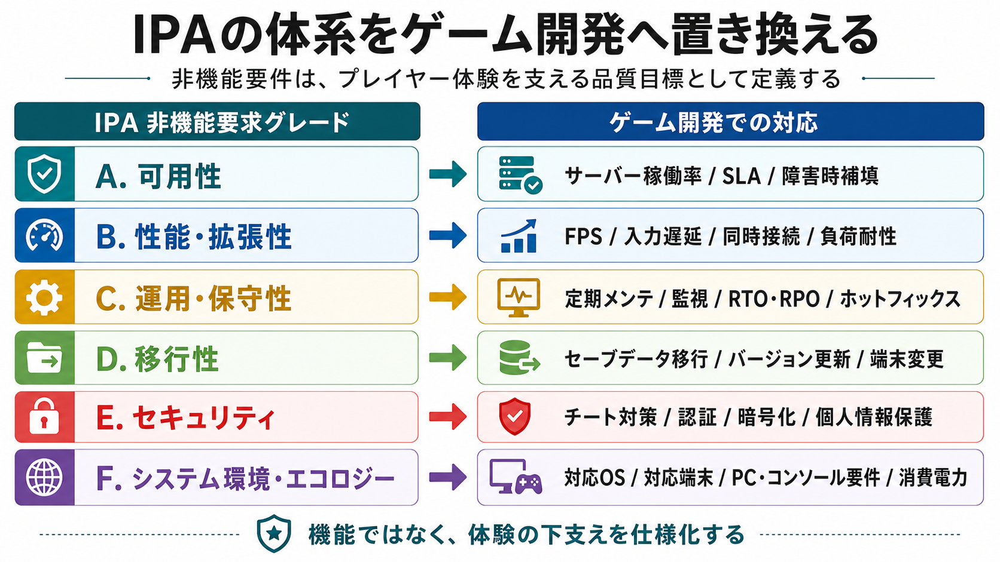

# ゲームにおける非機能要件

## はじめに：非機能要件とは何か

ゲームプランナーが日々考えるのは「どんな機能をゲームに入れるか」だ。バトルシステム、キャラクター育成、ガチャの確率、チュートリアルのフロー——これらはすべて **機能要件（Functional Requirements）** と呼ばれる。「システムが *何をするか*」を定義するものだ。[[1](#ref-1)]

これに対して **非機能要件（Non-Functional Requirements / NFR）** とは、「システムが *どのように* 動作するか」を定義する要件のことである。性能・安定性・セキュリティ・運用体制など、直接プレイヤーの目に触れる「機能」ではないが、ゲーム体験の質を根底から左右する要素だ。[[2](#ref-2)][[3](#ref-3)]

わかりやすく言えば、こうなる。

> **機能要件：** 「ガチャで★5キャラが排出される」  
> **非機能要件：** 「ガチャ演出のレスポンスは0.5秒以内で完了し、サーバー障害がなく、同時接続100万人でも動作する」

機能要件を満たすだけでは、ゲームは「使い物にならない」場合がある。非機能要件の失敗は、プレイヤー体験に直接・即座に悪影響を及ぼす。[[4](#ref-4)]

***

## IPAによる非機能要件の体系

日本では、IPA（情報処理推進機構）が **「非機能要求グレード」** として非機能要件を体系的に整理している。この枠組みはゲーム開発にも応用でき、各項目は以下のようにゲーム向けの品質目標へ置き換えられる。[[5](#ref-5)][[6](#ref-6)]

*図表作成: OpenAI gpt-image。IPAの大項目を、ゲーム開発で定義すべき品質目標へ置き換えた対応図。*

以降では、ゲームに特化した形で各要件を詳しく解説する。

***

## 1. レスポンス性能（FPS・入力遅延）

### フレームレート（FPS）

フレームレート（fps: frames per second）は、1秒間に画面が何枚更新されるかを示す指標だ。プレイヤーが感じる「滑らかさ」に直結し、ゲームジャンルによって求められる基準が異なる。[[7](#ref-7)]

| ジャンル | 最低ライン | 推奨 | 備考 |
|---|---|---|---|
| ターン制RPG / カジュアル | 30fps | 60fps | 低速でも不満が出にくい |
| アクション / 格ゲー | 60fps | 60fps固定 | フレーム単位の操作精度が重要 |
| FPS / TPS（対人） | 60fps | 144fps以上 | 競技性のある対人では差が出る |
| VR | 90fps | 120fps以上 | 低fpsは「VR酔い」を引き起こす |

一般向けゲームの基準は60fpsが業界標準とされている。ただし競技性の高いFPS（ファーストパーソンシューター）タイトルでは144fps・240fpsが求められ始めており、どのプラットフォーム・機種で「どのfpsを保証するか」を非機能要件として明確に定義しておく必要がある。[[8](#ref-8)][[7](#ref-7)]

### 入力遅延（Input Lag）

入力遅延とは、プレイヤーがボタンを押してから画面に反映されるまでの時間だ。ネットワーク遅延に加え、ローカルシステムの処理遅延も含まれる。一般的な許容範囲は以下のとおりだ。[[9](#ref-9)][[10](#ref-10)]

- **〜25ms：** ほぼ気にならない（理想）
- **25〜50ms：** 上級者には違和感あり
- **50ms〜：** 多くのプレイヤーが不満を感じ始める
- **100ms以上：** 操作感が著しく損なわれ、競技性のあるゲームでは致命的

入力遅延はハードウェア（モニター、コントローラー）だけでなく、ゲームの描画処理・ネットワーク設計によっても変わる。プランナーはエンジニアと協力して「目標遅延値」を設定し、テスト仕様に落とし込むべき指標だ。[[9](#ref-9)]

入力遅延の発生要因や、フレームバッファ・ディスプレイ・コントローラー側の対策については、関連記事「[ゲームの入力遅延――発生要因と削減・隠蔽の技術](game-input-lag-guide.md)」で詳しく整理している。

***

## 2. 安定性（クラッシュ率・バグ頻度）

クラッシュ率（Crash Rate）とは、一定時間プレイした場合にゲームが異常終了する確率だ。スマートフォン向けゲームでは、セッション中のクラッシュ率が1%前後を超えると、アプリストアでの可視性や評価に悪影響を及ぼすとされている。[[11](#ref-11)][[12](#ref-12)]

安定性に影響する主な要因は以下のとおり。

- **メモリ使用量の肥大化：** プレイ時間が長くなるにつれてメモリが増加し続ける「メモリリーク」は、長時間プレイほど落ちやすくなる典型的な不具合だ
- **温度上昇によるスロットリング：** スマートフォンでは長時間プレイで発熱が進むと、CPUが自動的に処理速度を落とす場合がある
- **GPU負荷の過多：** GPU負荷が飽和状態に達すると、フレームレートの急落やカクつき（ジャンク）が発生しやすくなる

***

## 3. 可用性（サーバー稼働率）

### 稼働率とは

稼働率は「一定期間内にサービスが正常稼働していた時間の割合」だ。計算式は以下のとおり。[[13](#ref-13)]

**稼働率（%）＝（総時間 − 停止時間）÷ 総時間 × 100**

わずかな数値の違いが、実際のダウンタイムに大きく影響する。[[14](#ref-14)]

| 稼働率 | 年間許容ダウンタイム | 月間許容ダウンタイム |
|---|---|---|
| 99.0%（ツーナイン） | 約87時間（約3.6日） | 約7.3時間 |
| 99.9%（スリーナイン） | 約8.8時間 | 約43.8分 |
| 99.95% | 約4.4時間 | 約21.9分 |
| 99.99%（フォーナイン） | 約52.6分 | 約4.4分 |
| 99.999%（ファイブナイン） | 約5.3分 | 約26秒 |

基幹的なオンラインサービスでは99.99%が一般的な目標値とされる。ゲームの場合、ガチャやリアルタイム対戦など課金・競技に関わるシステムにはより高い稼働率が求められる。[[15](#ref-15)][[14](#ref-14)]

### SLA（Service Level Agreement）との関係

SLAとは、サービス提供者と利用者が「どのレベルの品質を保証するか」を取り決めた合意書だ。ゲーム開発で契約上の保証値として確認すべき相手は、主にクラウド、ホスティング、CDN、監視、決済などのインフラ・外部サービスベンダーである。たとえばクラウドサービスでは、月間稼働率やサービスクレジットの条件がSLAとして明示される。[[16](#ref-16)][[17](#ref-17)][[40](#ref-40)]

***

## 4. 運用・保守性（メンテナンス頻度・時間）

### 定期メンテナンスの目的

オンラインゲームにおけるメンテナンスの主な目的は以下の3つだ。[[18](#ref-18)]

1. **新機能・バランス調整のリリース：** サーバーを一時停止して新バージョンに切り替える
2. **バグ修正：** ゲームプログラムの不具合を解消する
3. **インフラ整備：** DBの最適化、サーバーの負荷対策など

### メンテナンス設計における非機能要件

メンテナンスに関して定義すべき非機能要件の項目には、以下が含まれる。

- **頻度：** 週次・月次・不定期のどれか（例：黒い砂漠は毎週木曜に約4時間）[[19](#ref-19)]
- **実施時間帯：** 深夜帯（プレイヤーが少ない時間）が基本[[18](#ref-18)]
- **最大許容時間：** 何時間以内に完了するか
- **告知リードタイム：** 何時間前にプレイヤーへ通知するか
- **延長時の対応フロー：** 予定超過時の連絡・補填の基準

メンテナンスは「短く・深夜に・定期的に」が理想だが、大型アップデートでは数時間〜半日に及ぶケースもある。事前告知が不十分だったり、メンテが頻繁すぎたりするとプレイヤーの不満につながる。

### RTO・RPO

障害発生時に重要になるのがRTO/RPOだ。

- **RTO（Recovery Time Objective）：** 障害発生から復旧完了までの目標時間
- **RPO（Recovery Point Objective）：** 障害発生時にどの時点のデータまで復旧できるかの目標（例：「1時間前まで」）

オンラインゲームで課金データやキャラクターデータが消失した場合は、プレイヤーへの補填コストと信頼損失が甚大になる。特にRPOは「データ消失ゼロ」が理想だが、コストとのトレードオフになる設計上の重要判断だ。

***

## 5. 対応環境（ターゲットOS・対応機種）

「どの環境で動くか」も明確な非機能要件だ。ゲームプランナーはリリース前に以下を定義する必要がある。[[20](#ref-20)]

| 項目 | 定義すべき内容 | 例 |
|---|---|---|
| ターゲットOS | 最低サポートバージョン | iOS 16以上 / Android 12以上 |
| 対応端末 | 最低スペック（RAM・GPU） | RAM 3GB以上 |
| 推奨端末 | 最高画質で動く端末 | iPhone 15以上、Snapdragon 8 Gen2以上 |
| PC（パッケージ） | 最低・推奨スペック | VRAM 4GB以上 / NVIDIA GTX 1060以上 |
| コンソール | 対応ハード | PS5 / Xbox Series X 正式対応 |

**重要なのは「最低動作環境での品質保証」**。市場に出回っているローエンド端末でも一定のプレイ体験を保てるか。Cyberpunk 2077がPS4/Xbox One（旧世代機）での動作保証を十分に行わなかったことが、後述する深刻な問題につながった。[[21](#ref-21)]

***

## 6. スケーラビリティ（同時接続・負荷耐性）

スケーラビリティとは、利用者数や処理量が増加したときにシステムが対応できる能力のことだ。特にゲームのリリース直後や人気コンテンツ実装時は同時接続数が爆発的に増加する。[[22](#ref-22)]

非機能要件として定義すべき指標は以下のとおり。

- **最大同時接続数：** 何人まで捌けるか
- **ピーク時のレスポンス目標：** 負荷が高い状態でも何ms以内に応答するか
- **スケールアウト対応：** サーバーを自動増設（オートスケーリング）できるか
- **負荷テストの実施：** リリース前に想定ピーク接続数の何倍まで耐えられるかを検証する[[23](#ref-23)]

リリース直後のピーク負荷は「想定の数倍」に達することが多いため、テストでは想定値を大きく超えた負荷をかけることが重要だ。[[23](#ref-23)]

***

## 7. セキュリティ

ゲームのセキュリティ要件は、単なる「不正アクセス防止」にとどまらない。[[24](#ref-24)]

- **チート・ボット対策：** ゲーム内経済や対人バランスの崩壊を防ぐ
- **通信の暗号化：** プレイヤーのアカウント情報・課金データの保護（HTTPS/TLS）
- **認証強化：** 二段階認証やセッション管理の設計
- **個人情報保護：** GDPR（欧州）・個人情報保護法（日本）への準拠
- **不正課金対策：** クレジットカード詐欺やチャージバックへの対応

セキュリティ要件はプランナーが直接実装するものではないが、「どのデータを扱うか」「どんな不正が起こりうるか」を仕様レベルで整理することがプランナーの責務だ。

***

## 8. アクセシビリティ・ユーザビリティ

**アクセシビリティ** とは、障がいのあるプレイヤーや多様なユーザーがゲームを楽しめるかどうかの要件だ。近年のAAAタイトルでは標準的な考慮事項になっている。[[25](#ref-25)]

- **色覚サポート：** 色盲のプレイヤー向けのUIカラーモード
- **字幕・テキストサイズ：** 大きな文字表示オプション
- **コントローラーカスタマイズ：** ボタンの割り当て変更、片手操作対応
- **音声ガイダンス：** 視覚障がい者向けのナレーション

**ローカライズ要件** も非機能要件の一つだ。対応言語数、テキスト量の増加に対するUI拡張性（英語より日本語・ドイツ語はテキストが長くなりやすい）、音声収録の有無などをあらかじめ設計に組み込む必要がある。

翻訳、カルチャライズ、インターナショナライゼーション（i18n）の違いや実務上の注意点については、関連記事「[ゲームローカライズの工程と実践](game-localization-guide.md)」で詳しく整理している。

***

## 9. 保守性・拡張性

運営型タイトルでは、リリース後も長期間にわたってコンテンツを追加し続けることが前提だ。保守性・拡張性は以下のような形で非機能要件として定義される。

- **デプロイ時間：** 新バージョンへの切り替えをどれだけ短時間で行えるか
- **ホットフィックス対応：** 重大バグ発生時に緊急パッチを当てるまでのリードタイム
- **データ構造の拡張性：** マスターデータ（キャラクター・アイテムなど）を増やせる設計になっているか
- **ログ・監視体制：** 障害発生時に原因を素早く特定できる仕組みがあるか[[26](#ref-26)]

***

## 非機能要件の失敗が招いた実例

以下の事例はいずれも、非機能要件の不備がプレイヤー体験に深刻な影響を与えたケースだ。

### ① Cyberpunk 2077（2020年）——対応環境・安定性の失敗

CD PROJEKT REDが2020年12月にリリースした *Cyberpunk 2077* は、PC・次世代機では高く評価されたが、PS4・Xbox One（旧世代機）での動作が壊滅的だった。テクスチャが目の前でポップインし、フレームレートは20fps前後まで落ち込み、頻繁にクラッシュした。[[21](#ref-21)]

この問題の本質は **ターゲット機種に対する非機能要件の未達成** だった。旧世代機での動作品質が事前に定義・検証されていなかったとみられる。ソニー・インタラクティブエンタテインメント（SIE）は2020年12月18日、PlayStation StoreからCyberpunk 2077を削除し、購入者への全額返金を開始した。これはゲーム史上極めて異例の措置であり、非機能要件の未達成がビジネス上どれほど致命的かを示している。[[27](#ref-27)][[28](#ref-28)]

Cyberpunk 2077の失敗を、期待値管理・スコープ・クランチ・品質判断の連鎖として掘り下げたものは、関連記事「[Cyberpunk 2077 崩壊の構造](cyberpunk-2077-anatomy-of-a-collapse.md)」で扱っている。

### ② ファイナルファンタジーXIV: 暁月のフィナーレ（2021年）——スケーラビリティ・可用性の失敗

2021年12月に発売された *ファイナルファンタジーXIV: 暁月のフィナーレ* は爆発的な人気を博したが、ログインサーバーが大量接続に耐えられず、「エラー2002」が頻発し、ログインキューが1万7000人を超えると新規接続が遮断された。ログイン待ちが数時間に及ぶ状況が数週間続いた。夏以降の新規プレイヤー流入は北米・欧州で特に急増し、World of Warcraft配信者によるFFXIV配信も同時期の流入の一部として報じられたが、暁月のローンチ時の混雑自体は日本を含む全ワールドで発生した。[[29](#ref-29)][[30](#ref-30)][[41](#ref-41)][[42](#ref-42)]

スクウェア・エニックスは新規販売・フリートライアルの提供を一時停止し、課金ユーザーに対して当初の7日間に加えて追加で14日間（計21日間）の無料プレイ時間を補償した。プロデューサーの吉田直樹氏はプレイヤーに公式謝罪を行った。 **同時接続数の爆発的増加に対するスケーラビリティ設計** が非機能要件として十分に定義・テストされていなかったことが根本原因だ。[[31](#ref-31)][[29](#ref-29)]

### ③ ディアブロ IV（2023年）——可用性・ピーク負荷対応の失敗

*ディアブロ IV* は2023年6月のリリース直後にサーバーが完全ダウン。ログインエラー「300202」「300008」が世界中で発生し、Blizzard Entertainmentはサーバー負荷軽減のためにログイン数を制限した。プレイヤーのキューが1000分以上（約16時間）に達したとの報告もあった。大規模ベータテスト（「Server Slam」）を実施していたにもかかわらず、本番環境のピーク接続数に対するスケーラビリティが不足していた。[[32](#ref-32)][[33](#ref-33)]

### ④ Fallout 76（2018年）——安定性・性能の複合的失敗

Bethesda Game Studiosの *Fallout 76* はリリース時点でバグと性能問題が山積みだった。ランダムなフレームレートの急落、カメラのスタッター、頻繁なサーバー切断が報告された。リリース前からBethesda Game Studiosも「予期せぬ問題が起きる可能性がある」と事前に言及していたが、これは非機能要件の未達成を暗黙に認めていたと言える。Metacriticでの批評家・ユーザー評価は共に当時の同スタジオの作品で最低水準に落ち込んだ。[[34](#ref-34)][[35](#ref-35)][[36](#ref-36)][[37](#ref-37)]

### 実例まとめ

| タイトル | 失敗した非機能要件 | プレイヤーへの影響 |
|---|---|---|
| Cyberpunk 2077 | 対応機種での性能・安定性 | PS4/Xbox Oneで20fps・クラッシュ多発、PSストアから販売停止 |
| ファイナルファンタジーXIV: 暁月のフィナーレ | スケーラビリティ・可用性 | 数週間にわたるログイン不能、販売一時停止 |
| ディアブロ IV | ピーク負荷対応・可用性 | 全世界サーバーダウン、1000分超のログイン待ち |
| Fallout 76 | 安定性・性能 | 大量のバグ・クラッシュ、最低評価を記録 |

***

## ゲームプランナーが非機能要件に関わる理由

非機能要件は「エンジニアが決めること」と思われがちだが、ゲームプランナーが深く関与すべき理由がある。

1. **仕様と非機能要件は不可分：** 「同時に1万人が参加できるレイドボス戦」という仕様は、そのままスケーラビリティ要件を規定する
2. **障害時の補填設計：** サーバー停止時に何をプレイヤーに配布するか、告知文言はどうするか——これはプランナーの仕事だ
3. **KPIへの影響：** 応答が遅い、クラッシュが多い、メンテが長い——こうした体験の質はプレイヤーの離脱や課金行動に影響しうる要素だ[[38](#ref-38)]
4. **リリース判断：** 「非機能要件が未達のままリリースするか」は、ビジネス判断であり企画責任者の関与が求められる

***

## まとめ：非機能要件を「当たり前の品質」として設計する

非機能要件は、プレイヤーが「ゲームが面白い」と感じる前提条件だ。フレームレートが落ちすぎれば操作が不快になり、サーバーが落ちれば課金意欲も失われ、クラッシュが続けばアプリを消される。

Cyberpunk 2077のSIEによるPSストア販売停止やファイナルファンタジーXIV: 暁月のフィナーレの混乱は、非機能要件の軽視がどれほどのビジネスリスクになるかを示している。一方でファイナルファンタジーXIV: 暁月のフィナーレは補填・謝罪・原因開示を丁寧に行うことで、最終的にプレイヤーの信頼を回復した。

非機能要件を「開発終盤に確認するチェックリスト」ではなく、 **「仕様を書く段階から定義する設計の柱」** として扱う文化を作ることが、現代のゲーム開発では不可欠だ。[[39](#ref-39)]

---

## References

1. [Functional and Non Functional Requirements][1] - Non-Functional Requirements: Define how the system should perform (quality, performance, and constra...

2. [非機能要件と機能要件の違いとは？非機能要件のポイント][2] - 非機能要件とは、システムに実装される具体的な機能とは異なり、システム全体の品質や性質を規定する要件です。例えば、「どれだけ早く処理を完了できるか ...

3. [非機能要件定義とその難しさについて][3] - 非機能要件は、システムが「どのように動作するか」という品質や性能に関する側面を定義します。 具体的には、システムがいかに迅速かつ安定して、安全に ...

4. [非機能要件の定義 ｜ 令和時代のシステム開発では][4] - 非機能要件(NFR)とは、ソフトウェア設計のうち機能面以外の要件すべてを指します。“機能以外”のためその含むところが大きく、それゆえきちんと定義されず ...

5. [IPA非機能要求グレードとは｜6大項目の解説と要件定義・RFP ...][5] - IPA非機能要求グレードとは · なぜ非機能要求が重要か · 6大項目の概要 · A. 可用性 · B. 性能・拡張性 · C. 運用・保守性 · D. 移行性 · E. セキュリティ.

6. [可用性や災害対策など「非機能要求グレード」を6段階で可視化][6] - 中でも中核となるのは項目一覧である。要求定義の段階で明らかにしておくべき非機能要求を、「可用性」「性能・拡張性」「運用・保守性」 ...

7. [ゲームのフレームレート（fps）とは？目安や確認方法][7] - 【ゲームジャンル別】最適なフレームレートの目安 · 60fps：一般的なPCゲームの基準値 · 144fps：FPS/TPSで有利になる推奨値 · 240fps：プロや上級者が目指す ...

8. [ゲームのフレームレート（fps）とは？快適なプレイに必要な ...][8] - ゲームをストレスなく楽しむには「フレームレート（fps）」の設定が重要です。フレームレートを高く設定すると、残像が減って映像がなめらかに動く ...

9. [Understanding Input Lag and Response Times][9] - Input lag is influenced by multiple components, including display processing, system hardware, conne...

10. [How much delay is there really in current games?][10] - ABSTRACT. All computer games present some delay between human in- put and results being displayed on...

11. [App Crash Rate ｜ TAGLAB][11] - クラッシュ率1%未満を「良好」、1〜2%を「要監視」、2%超を「高水準」とするアプリ安定性のベンチマーク指標。

12. [Your App Crash Rate is Impacting Your Growth ｜ Yodel Mobile][12] - Google Playの「bad behavior」閾値はDAUの約1.09%。これを超えるとストア内での可視性が低下するとされる。

13. [ホスティング（レンタルサーバ）の稼働率・SLAとは？わかり ...][13] - 稼働率とは、一定期間のうちサーバが正常稼働している割合のことです。「（総時間 - 停止した時間）÷ 総時間 x 100」により算出されます。また、SLAは一定 ...

14. [99.9% vs 99.99% Uptime: Downtime Per Month/Year Calculator][14] - A 99.9% uptime SLA ("three nines") allows about 8 hours and 46 minutes of downtime per year, or roug...

15. [99.99% Uptime: Balancing High Availability and ...][15] - A service with 99.9% uptime would experience 8.77 hours of downtime per year. If a hospital had 99.9...

16. [The power of SLAs for ensuring your Web Shop's Quality ...][16] - How to significantly improve your mobile video game business by signing a robust service level agree...

17. [SLA（サービスレベルアグリーメント）とは？SLOとの違いや必要性][17] - 具体的には、「サーバーの稼働率を月間99.9%以上とする」「問い合わせには24時間以内に一次回答する」といった内容を明確に定義し、もしその基準を ...

18. [「深夜メンテ」って何してるの？スマホゲームあるあるの裏側を ...][18] - メンテナンス中はゲーム内にログインすることが出来なくなってしまうので、比較的ゲームをプレイしている人数が少ない深夜にメンテナンスをしています。

19. [Maintenance Schedule Change Notice ｜ Black Desert NA/EU][19] - パールアビス（Pearl Abyss）による公式告知。定期メンテナンス実施日を水曜から木曜へ変更する旨を案内している。

20. [IV. 非機能要件の定義方法][20] - 非機能要件の定義方法. システムの非機能要件として、以下の事項について定義を行います。 ○ ユーザビリティ及びアクセシビリティに関する事項. ➢ システムの利用者の種類 ...

21. [Cyberpunk 2077 on PS4 and Xbox One Is Suffering Performance ...][21] - The problems players are experiencing include textures and objects popping into view, even right nex...

22. [10 nonfunctional requirements to consider in your ...][22] - 10 nonfunctional requirements to consider in your enterprise architecture · 1. Scalability · 2. Avai...

23. [Launch Day Failures: Preventing Critical Issues on Game ...][23] - Learn strategies to prevent launch day failures in games with stress testing, patch validation, serv...

24. [非機能要件定義書の書き方について - SHIFT Group 技術ブログ][24] - 1.システムの利用者の特性及びユーザビリティ・アクセシビリティに関する要件; 2.方式に関する要件; 3.規模に関する要件; 4.性能に関する要件

25. [Non-functional Application Requirements: An Introduction][25] - We'll cover the nine key non-functional requirements that every modern application needs to address:...

26. [非機能要件について][26] - 非機能要件とは、システムが備えるべき「質」に関する要件を指します。 具体的には、処理速度や稼働率、障害発生時の復旧時間、セキュリティ水準、運用のしやすさなど、 ...

27. [Cyberpunk 2077 has been removed from the Playstation store, all ...][27] - Megathread: Sony/PlayStation will offer full refunds to those who have purchased Cyberpunk. - SIE wi...

28. [Sony has removed Cyberpunk 2077 from the PlayStation Store][28] - Sony has announced it is removing Cyberpunk 2077 from the PlayStation Store effective immediately, a...

29. [Regarding the Growing Player Population and Plans to Alleviate World Congestion][29] - 吉田直樹プロデューサー兼ディレクターによる公式告知。北米・欧州で特に新規プレイヤーが急増した状況と、サーバー増強計画を説明している。

30. [Regarding Congestion During Endwalker’s Launch][30] - 暁月ローンチに向けた公式告知。ログイン待機が1万7000人を超えた場合のError 2002と、新規ログインの制限を説明している。

31. [Final Fantasy 14 Director Apologises for Endwalker Login Problems ...][31] - While errors 4004, 5003, and 5006 occur due to connection timeouts as a result of waiting in the log...

32. [Diablo 4 servers are down worldwide - Windows Central][32] - The Diablo 4 servers have been down for over an hour already, players are reporting endless queue ti...

33. [Your Last Chance to Play Diablo IV Free Before Launch - XBOX Wire][33] - Diablo IV will offer one last chance to play for free before launch - join the Server Slam on May 12...

34. [List of Fallout 76 known bugs and launch issues][34] - List of Fallout 76 known bugs and launch issues · Fallout 76 'Disconnected From Server' error · Powe...

35. [Bethesda softens ground for “spectacular issues” with ...][35] - During a three-hour preview event for Fallout 76 just a few weeks ago, we did notice relatively freq...

36. [Fallout 76 review - a bizarre, boring, broken mess][36] - The combat also highlights other technical problems with Fallout 76. It suffers random framerate dro...

37. [Metacritic Reviews Rip Fallout 76 To Shreds For Its Bugs ...][37] - The majority of these reviews are for the PS4 version of the game, but the game as whole has a curre...

38. [スマホゲームの離脱・継続・復帰に関するユーザー実態を調査 ...][38] - ゲームを1時間以内にやめた理由では「チュートリアルが長い（25.3%）」が最多でした。 「グラフィックが好みでない（20.7%）」「UIが使いにくい（19.3%）」も ...

39. [Non-Functional Requirements: Tips, Tools, and Examples][39] - Non-functional requirements specify criteria that evaluate how a system performs a function, rather ...

40. [Amazon Compute Service Level Agreement][40] - AWS EC2のリージョン単位・インスタンス単位の月間稼働率、サービスクレジット、請求手続き、除外条件を定めている。

41. [Regarding Server Congestion Status (Dec. 3)][41] - 暁月の早期アクセス開始後、全ワールドで深刻な混雑が起き、ログイン待機が発生しているとする公式告知。

42. [Final Fantasy 14 just broke its concurrent player record on Steam][42] - World of Warcraft配信者のFFXIV配信と、その視聴者を含むプレイヤー流入を報じた当時の記事。

[1]: https://www.geeksforgeeks.org/software-engineering/functional-vs-non-functional-requirements/
[2]: https://www.ves.co.jp/column/024
[3]: https://www.saishunkansys.com/blog/system-development/rd_points/
[4]: https://thinkit.co.jp/article/17647
[5]: https://www.btncon.com/blog/ipa-non-functional-grade
[6]: https://it.impress.co.jp/articles/-/7854
[7]: https://www.megaegg.jp/column/0067.html
[8]: https://www.nuro.jp/article/game-framerate/
[9]: https://www.lenovo.com/au/en/knowledgebase/understanding-input-lag-and-response-times/
[10]: https://web-backend.simula.no/sites/default/files/publications/files/input_delay_demo.pdf
[11]: https://taglab.net/marketing-metrics/app-crash-rate/
[12]: https://yodelmobile.com/app-crash-rate-impacting-growth/
[13]: https://it-trend.jp/hosting/article/140-0018
[14]: https://web-alert.io/blog/uptime-sla-explained-99-9-vs-99-99-availability
[15]: https://us.sios.com/blog/99-99-uptime-guide/
[16]: https://xsolla.com/blog/the-power-of-service-level-agreements
[17]: https://www.cloudsign.jp/media/sla/
[18]: https://note.com/othellonia/n/ne25d46ea1e75
[19]: https://www.naeu.playblackdesert.com/en-US/News/Detail?groupContentNo=7265
[20]: https://www.vln.metro.tokyo.lg.jp/wp-content/uploads/2022/03/manual6.pdf
[21]: https://www.pcmag.com/news/cyberpunk-2077-on-ps4-and-xbox-one-is-suffering-performance-problems
[22]: https://www.redhat.com/en/blog/nonfunctional-requirements-architecture
[23]: https://www.testriq.com/blog/post/launch-day-failures-preventing-critical-issues-on-game-release
[24]: https://note.shiftinc.jp/n/n7288c8c1f97b
[25]: https://dev.to/aws-builders/non-functional-application-requirements-an-introduction-2f74
[26]: https://genz.jp/column/systemtest_78/
[27]: https://www.reddit.com/r/Games/comments/kfapny/cyberpunk_2077_has_been_removed_from_the/
[28]: https://www.pcgamer.com/sony-has-removed-cyberpunk-2077-from-the-playstation-store/
[29]: https://na.finalfantasyxiv.com/lodestone/topics/detail/c2d7b35d55577879086b64cfde0acb6c23ccd07f
[30]: https://na.finalfantasyxiv.com/lodestone/topics/detail/1f70135439286fa66209cd21c10e73ebb986a6ee
[31]: https://www.ign.com/articles/final-fantasy-14-director-apologises-endwalker-login-problems-offers-free-play-time
[32]: https://www.windowscentral.com/gaming/diablo-servers-are-down-worldwide
[33]: https://news.xbox.com/en-us/?p=192335
[34]: https://www.windowscentral.com/fallout-76-list-bugs-glitches-issues
[35]: https://arstechnica.com/gaming/2018/10/bethesda-prepare-for-unforeseen-bugs-and-issues-with-fallout-76s-launch/
[36]: https://www.eurogamer.net/fallout-76-review-a-bizarre-boring-and-broken-mess
[37]: https://hothardware.com/news/fallout-76-launches-to-critical-metacritic-reviews
[38]: https://lighthouse-studio.voyage/news/016/
[39]: https://www.perforce.com/blog/alm/what-are-non-functional-requirements-examples
[40]: https://aws.amazon.com/compute/sla/
[41]: https://na.finalfantasyxiv.com/lodestone/news/detail/a32225e2dc46dfaabe82058a18978d189c88e0d1
[42]: https://www.pcgamer.com/final-fantasy-14-just-broke-its-concurrent-player-record-on-steam/

----

この文書は、Perplexity、Claude、OpenAI Codex の3つのAIの支援を受けて著述されたものです。引用画像を除き、MIT License にて提供されています。
