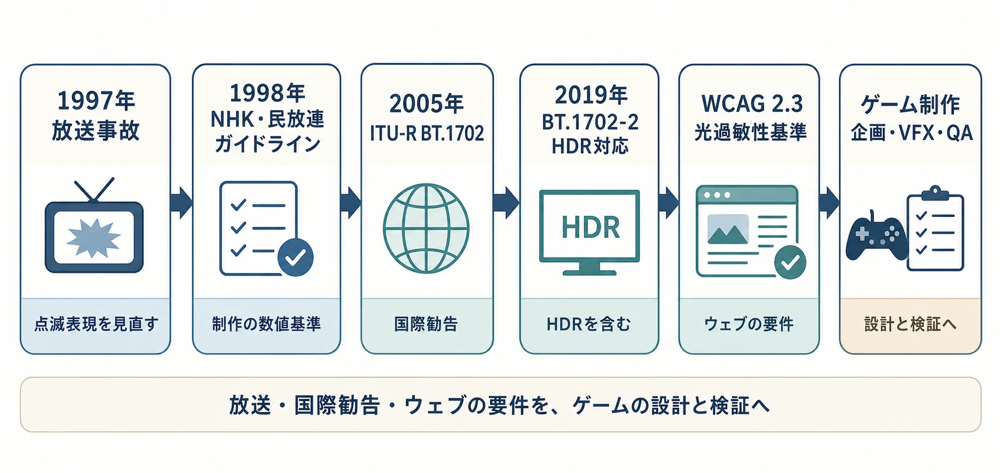
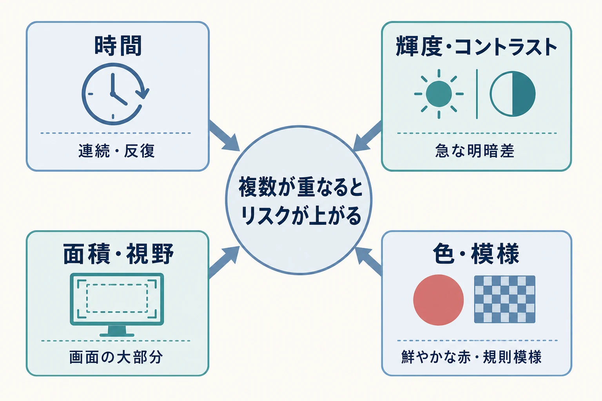
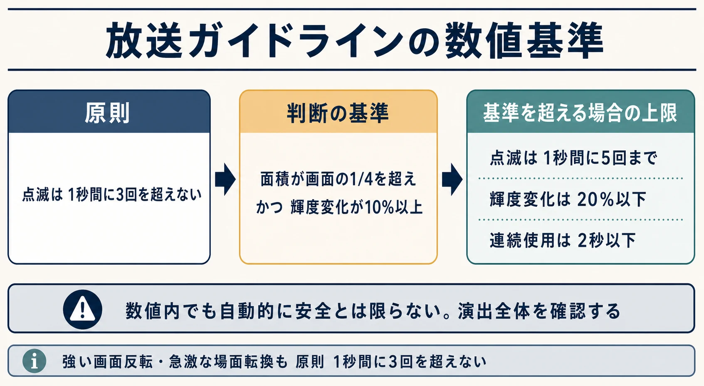
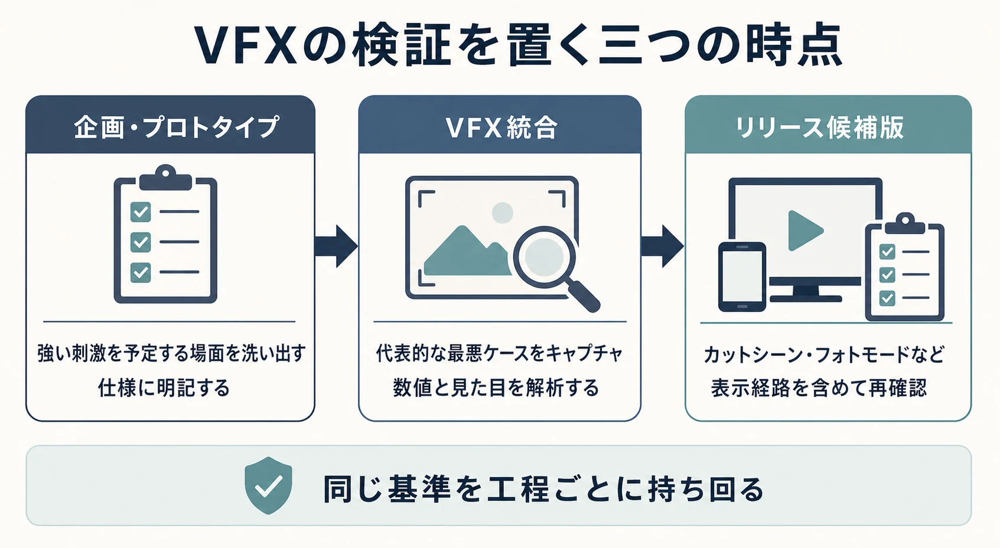

# ゲームの演出と光過敏性発作――「でんのうせんしポリゴン」事件が残した数値基準をVFX仕様へ落とし込む

## はじめに――警告文だけでは演出のリスクを下げられない

ゲームの起動時には、発作や光過敏性に関する警告が表示されることが多い。しかし、警告はプレイヤーへ情報を渡す手段であって、画面上の刺激を弱める仕組みではない。点滅、反転、鮮やかな赤、規則的な縞や同心円は、演出を派手に見せるための便利な語彙であると同時に、組み合わせ方によっては一部の人に発作などの反応を誘発しうる。

この問題を「注意書きを載せるか」という発売直前の法務確認に閉じ込めると、演出の要件が固まった後で、タイミング、色、面積、カメラ、ゲームプレイ上の意味を同時に作り直すことになる。本稿は1997年のテレビアニメ『ポケットモンスター』「でんのうせんしポリゴン」の放送で起きた事態から、放送の数値基準、ウェブ標準への展開、ゲーム制作での扱い方までを追う。医学的な診断や個別の遊び方の助言ではなく、公開されている医療・放送・アクセシビリティ資料を、企画とVFXの判断材料として紹介する。

***

## 1. 1997年12月16日に何が起きたのか

1997年12月16日18時30分から放映された『ポケットモンスター』を視聴していた幼児・児童を中心に、けいれん発作、意識障害、不快気分などが生じた。厚生省（当時）は直後に研究班を組織し、実態調査、症例検討、映像の物理的特性の検討を進めた。[[1](#ref-1)]

問題となったのは、画面の広い範囲を占める赤と青の急速な交互点滅を含む場面である。放映を見ていた患者の症例では、18時50分前後に症状が集中して出現した。W3Cは、この日本の事例について、700人を超える子どもが病院へ運ばれ、約500人が発作を起こしたと、WCAG 2.3の背景で明記している。[[2](#ref-2)]

ここで二つの数字を一つにしてはいけない。厚生省の学校調査は、有効回答9,209人のうち番組を見ていた4,026人から、健康被害を申告した417人を集計したものだ。これは搬送人数の確定値ではなく、症状の種類、視聴環境、既往歴を把握するための調査である。明るい部屋での視聴者3,757人中355人に対し、暗い部屋での視聴者177人中55人に健康被害がみられ、テレビから1メートル以内では有意に多かったという結果も出ている。画面の中の刺激だけでなく、背景との明暗差と視野に占める大きさが関わることを、この調査は示している。[[1](#ref-1)]

社会的な反応は、番組個別の問題処理にとどまらなかった。NHKと日本民間放送連盟は、医学者・心理学者を交えて原因を分析し、放送界全体の共通ルールを検討した。翌1998年4月8日には「アニメーション等の映像手法に関するガイドライン」を作成している。[[3](#ref-3)]

***

## 2. 光過敏性発作は「点滅の回数」だけで決まらない

光過敏性てんかん、または視覚刺激によって誘発される発作は、特定の光やパターンへの反応で発作が起こりうる状態を指す。任天堂は、発作を脳の異常な電気的放電によって生じる不随意の運動、感覚、意識消失などと説明し、ゲーム、テレビ、モニター、交互に変わる色のパターン、ストロボなどが、感受性のある人の引き金になりうるとしている。ゲームが光過敏性やてんかんそのものを生むのではなく、素因をもつ人の発作を誘発しうる、という区別が重要である。[[4](#ref-4)]

医療団体Epilepsy Foundationは、光の点滅速度、明るさ、背景光とのコントラスト、視聴者と光源の距離、光の波長を、反応に関わる要因として挙げる。一般に毎秒5〜30回の点滅が発作を誘発しやすい範囲と説明されるが、個人差があり、単一の周波数だけで安全を判定するものではない。縞模様のようなコントラストの強い繰り返しパターンも刺激になりうる。[[5](#ref-5)]

プランナーが仕様へ翻訳するときは、次の四つを別々の変数として扱うとよい。

| 変数 | 演出上の例 | 仕様で確認すること |
|---|---|---|
| 時間 | 爆発の連続、被弾時の点滅、画面反転 | 1秒あたりの明暗変化は何回か。連続時間とクールダウンはあるか。 |
| 輝度・コントラスト | 白いフラッシュ、HDRの発光、暗転からの復帰 | 明部と暗部の差はどれほどか。暗い背景で急に全面発光しないか。 |
| 面積・視野 | 全画面のフィニッシュ、カメラ至近の爆発 | 同時に変わる領域はどれほどか。UIを含めて画面の大部分にならないか。 |
| 色・模様 | 赤い警告、赤青の交互色、縞のワープ | 鮮やかな赤の反復にならないか。規則的な模様が動いたり反転したりしないか。 |

この分解には、画面の見栄えだけでなく、プレイヤーの視聴条件を入れる必要がある。テレビからの距離、部屋の明るさ、疲労などは開発側で固定できない。だからこそ、コンテンツ側で制御できる点滅、輝度、面積、配色を先に抑える。

***

## 3. 放送の自主基準は、数値を伴う制作ルールになった

NHK・民放連のガイドラインは、点滅を原則として1秒間に3回を超えて用いないことを示す。鮮やかな赤色の点滅は特に慎重に扱い、同時に点滅する面積が画面の4分の1を超え、かつ輝度変化が10%以上の場合を判断の基準とする。その条件を超える場合は、点滅を1秒間5回まで、輝度変化を20%以下、連続使用を2秒以下に抑える。強い画面反転や、20%を超える急激な場面転換も、原則として1秒間に3回を超えないこととしている。縞、渦巻き、同心円のような規則的なパターンが画面の大部分を占めることも避ける。[[3](#ref-3)]

数値は「5回までなら推奨」という意味ではない。まず3回を超えないことが原則であり、5回、20%、2秒は、面積と輝度の基準を超えてしまう場合に課した上限である。仕様書でこの順序を逆にすると、「5回・2秒なら派手にしてよい」という誤読を生みやすい。

### HDRでは相対値だけでは足りない

同ガイドラインは2020年の改訂で、200cd/m²を超える高輝度領域を含むHDR映像の読み替え規定を加えた。暗部が160cd/m²未満なら20cd/m²以上、160cd/m²以上なら暗部の8分の1を超える輝度変化を判断基準とする。この追加は、表示方式が変われば、SDR時代の割合だけでは評価しきれないことを示す。[[3](#ref-3)]

日本の共同ガイドラインは1998年に作成され、2005年に成立したITU-R勧告BT.1702を参考に2006年に改訂された。ITU-Rは2019年にHDRを含むBT.1702-2を成立させ、日本側はこれを受けて2020年にHDRの読み替えを追記している。[[3](#ref-3)] ITU-R勧告BT.1702-2も、感受性のある視聴者を保護するため、放送事業者が制作者へリスクを周知することを求める性格の文書である。[[6](#ref-6)]

この問題は放送だけに閉じなかった。W3CのWCAG 2.3.1「Three Flashes or Below Threshold」は、1秒間に3回を超える点滅を含めない、または一般点滅・赤色点滅の閾値を下回ることを求める。W3Cは、この基準をテレビ放送の仕様をデスクトップ画面へ適応して発展させたものと説明している。[[7](#ref-7)] つまり、1997年の出来事が直接的に「世界標準を作った」と単純化するより、日本で生まれた放送上の対応がITU-Rの勧告とウェブのアクセシビリティ要件へつながり、媒体ごとの視聴条件に合わせて調整されてきた、と捉えるほうが正確である。

***

## 4. ゲーム制作では、警告・解析・設定を役割分担させる

### 警告は入口、VFX仕様は本体

任天堂は、すべてのゲームハードとソフトの取扱説明書および安全上の注意書に発作警告を含めていると説明する。画面から離れる、明るい部屋で遊ぶ、疲労時に遊ばない、1時間ごとに10〜15分の休憩を取る、といった注意も併記している。[[4](#ref-4)]

これはプラットフォームホルダーによる情報提供の一例であり、ゲーム側の責務を置き換えない。初回起動の警告、ストアページの告知、配信時の注意表示は、プレイヤーが判断するための入口である。一方で、常時提示される被弾フラッシュ、連射の銃口炎、ボス戦の画面反転、カットシーンの転送表現は、作品側のVFX仕様として低減する必要がある。警告は一度読み飛ばせるが、刺激的な映像は発生した瞬間に影響しうるためだ。[[2](#ref-2)]

### 解析ツールは「録画を測る」ためのもの

映像解析には、点滅やパターンをフレーム単位で検出するツールがある。Harding Testの公式サイトは、映像を解析して不適合な点滅やパターンを検出し、英国と日本の放送局を含む放送でこの種の規制が採用されていると説明する。また、日本向けには「Japan NAB 2006」の試験アルゴリズムを選べるとしている。[[8](#ref-8)] W3Cも、一般点滅・赤色点滅の閾値を超えないことを確認する手段として、ツール利用を十分な手法の一つに挙げている。[[7](#ref-7)]

ただし、ゲームでは固定の納品映像だけを通せば終わりではない。プレイヤーの入力、ランダムな敵配置、カメラ距離、複数のパーティクル、UI、ポストプロセスが重なり、危険な組み合わせが実行時にだけ生じる。映像解析ツールは、キャプチャした代表的なプレイを客観的に測る検証器として使い、すべての実行時状態を自動的に保証する魔法の判定器としては扱わない。

### 検証を置くべき三つの時点

VFXの確認をマスターアップ直前に一度だけ行うと、問題箇所がコアフィードバックに結びついている場合に直せない。次の三段階で、同じ基準を持ち回るとよい。

1. **企画・プロトタイプ**：全画面フラッシュ、警告色の反復、ワープ、必殺技、失敗演出などの「強い刺激を予定する場面」を洗い出す。仕様には、点滅回数、連続時間、面積、色、代替案の担当者を記す。
2. **VFX統合**：実装中の代表的な最悪ケースをキャプチャする。高フレームレート時だけでなく、パーティクル、被弾、UI、カメラエフェクトが重なる状態を作って解析し、数値と見た目の両方をレビューする。
3. **リリース候補版**：カットシーン、チュートリアル、ボス戦、フォトモード、リプレイ、配信オーバーレイを含めて再確認する。表示モード、HDR、携帯機・TV出力など、明るさや表示面積が変わる経路も対象にする。

「最悪ケース」をテスト項目にする理由は、問題の演出が一つのエフェクトに閉じないからである。個別には弱い明滅でも、ダメージ表示、ヒットストップ、環境の発光、画面シェイクが同フレーム付近に集まれば、プレイヤーが受ける視覚刺激は変わる。

***

## 5. 基準に触れなくても、問題は起こりうる

基準が整備された後も、ゲームの派手な表現が問題視される場面はある。2020年12月、Epilepsy Foundationは『Cyberpunk 2077』について、発売前の報道に基づき、過度なストロボや持続するアニメーションが光過敏性てんかんのある人へ影響しうるとして注意喚起を出した。同団体は、開発元がゲーム冒頭へ警告を追加し、長期的な解決策を検討する初期対応を評価している。[[9](#ref-9)]

これは同作が特定の放送・ウェブ基準に不適合だったと断定する材料ではない。むしろ、インタラクティブな画面で、意図した没入感やゲーム内の意味を保ちながら、どの演出をどこまで弱めるかという設計課題が、発売直前にも表面化しうる例である。

数値基準を満たすことは、危険な表現を減らすための強い下限である。しかし、プレイヤーの距離、画面サイズ、疲労、同時に見えるUI、ゲーム中の予測不能な重なりまでは、一つの数値が取り除いてくれない。企画側は「基準を通したから安全」と言い切るのではなく、リスクを減らす設計と検証の説明責任を持つべきである。

***

## 6. プランナーのための発注チェックリスト

派手な演出を発注する場面では、「明るく、速く、全面に」といった感覚的な指示をそのまま渡さない。以下を企画書またはVFX仕様の確認欄にする。

- **目的**：この発光は、気持ちよさ、危険通知、ダメージ、場面転換のどれを伝えるのか。目的を一つに絞れるか。
- **時間**：点滅と反転は1秒あたり何回か。連続するのは何秒か。連続後に静かな区間があるか。
- **面積**：同時に変化する領域は、画面のどこまで広がるか。カメラ寄りやUIとの重なりで大部分を占めないか。
- **明暗と色**：暗い背景から白・赤・青へ急変しないか。鮮やかな赤の点滅や色の交互反転になっていないか。
- **パターン**：縞、格子、同心円、ノイズ、走査線が移動・反転・拡縮するとき、規則的な明暗変化を作っていないか。
- **重なり**：被弾、スキル、環境、UI、カメラ、ポストプロセスを同時に出したときのキャプチャを取ったか。
- **代替**：点滅を使わず、輪郭の変化、短い音、振動、ゲージ、固定アイコン、ゆっくりした発光で同じ情報を伝えられないか。

### 点滅軽減オプションを「別のゲーム」にしない

アクセシビリティ設定として点滅軽減を設ける場合、単に画面を暗くするだけでは、敵の攻撃予兆や成功フィードバックまで消えることがある。設計の単位を「エフェクトを消す」ではなく「伝えるべき意味を別の感覚・別の視覚変化で残す」とする。

たとえば、被弾時の白い全面フラッシュは、画面端の静的なダメージ枠、短い振動、HPバーの変化、音で置き換えられる。ボスの危険攻撃は、赤い点滅を削るだけでなく、床の輪郭、予兆アイコン、チャージ音、攻撃方向の矢印を残す。設定のオン・オフで攻略情報が失われないかは、通常設定と軽減設定を同じテストケースで遊ぶことで確かめる。

実装面では、発光の強さ、点滅周期、継続時間、色、画面効果を個々のVFXアセットへ埋め込まず、共通のパラメータまたはタグで管理したい。そうすれば軽減設定は一括で作用し、後から追加したイベントも検出しやすい。さらに、設定の初期値、変更可能な項目、対応していない表現をリリースノートやサポートへ明記すれば、プレイヤーは作品の限界も含めて判断できる。

***

## おわりに――派手さを諦めるのでなく、先に制約を演出へ組み込む

1997年の事故が残したのは、「点滅は危険」という抽象的な注意ではない。点滅の回数、面積、輝度、色、連続時間、パターンを測り、制作工程で判断するという発想である。放送のガイドライン、ITU-R勧告、WCAGは、刺激的な映像を完全に禁じるためではなく、危険を測定可能な制作上の条件へ変えるために整備されてきた。

ゲームでは、映像がプレイヤーの入力と状況によって変わる。そのため、演出が完成してから「点滅を弱める」のでは遅い。企画で伝達目的を分解し、VFXで数値と最悪ケースを検証し、軽減設定でも必要な情報を残す。この順番なら、安全配慮は派手な演出の対立物ではなく、演出を長く遊べる形に仕上げる設計条件になる。

## References

1. [厚生科学特別研究 光感受性発作に関する臨床研究（速報版）について][1] - 1997年の放送後に行われた実態調査、症例検討、視聴環境の分析を公表した厚生省（当時）の資料。

2. [Understanding Guideline 2.3: Seizures and Physical Reactions｜W3C WAI][2] - 1997年の日本の事例と、WCAG 2.3が点滅による発作を避ける目的を説明する公式解説。

3. [アニメーション等の映像手法に関するガイドライン｜日本民間放送連盟][3] - NHK・民放連の共同ガイドライン。点滅、輝度、面積、HDR、パターンに関する数値と改訂経緯を掲載。

4. [Information About Photosensitivity｜Nintendo Support][4] - 光過敏性の説明、全ハード・ソフトへの発作警告、プレイ時の注意を掲載する任天堂のサポート情報。

5. [Photosensitivity and Seizures｜Epilepsy Foundation][5] - 光過敏性発作の誘因、点滅速度、明るさ、背景光、距離、色、パターンについての専門団体の解説。

6. [Recommendation ITU-R BT.1702-2｜ITU][6] - テレビ映像による光過敏性発作を減らすための国際電気通信連合無線通信部門の勧告。

7. [Understanding Success Criterion 2.3.1: Three Flashes or Below Threshold｜W3C WAI][7] - ウェブコンテンツの点滅・赤色点滅の閾値、放送仕様との関係、検証ツールの位置付けを説明する公式解説。

8. [Harding Test｜PSE Harding Test & Video Correction][8] - 点滅・パターンの映像解析、放送向けの適合性検査、日本向け試験アルゴリズムを案内するサービス公式サイト。

9. [Epilepsy Foundation Advises Caution Related to Flashing Lights in Soon-to-be-Released Game “Cyberpunk 2077”][9] - 2020年、発売前の報道を受けて同団体が出した注意喚起と、開発元への呼びかけ。

[1]: https://www.mhlw.go.jp/www1/houdou/1004/h0414-2.html
[2]: https://www.w3.org/WAI/WCAG21/Understanding/seizures-and-physical-reactions.html
[3]: https://j-ba.or.jp/category/broadcasting/jba103852
[4]: https://en-americas-support.nintendo.com/app/answers/detail/a_id/59596/~/information-about-photosensitivity
[5]: https://www.epilepsy.com/what-is-epilepsy/seizure-triggers/photosensitivity
[6]: https://www.itu.int/rec/R-REC-BT.1702-2-201910-S/en
[7]: https://www.w3.org/WAI/WCAG21/Understanding/three-flashes-or-below-threshold.html
[8]: https://hardingtest.com/
[9]: https://www.epilepsy.com/stories/epilepsy-foundation-advises-caution-related-flashing-lights-soon-be-released-game-cyberpunk

----

この文書は、Perplexity、Claude、OpenAI Codex の3つのAIの支援を受けて著述されたものです。引用画像を除き、MIT License にて提供されています。
