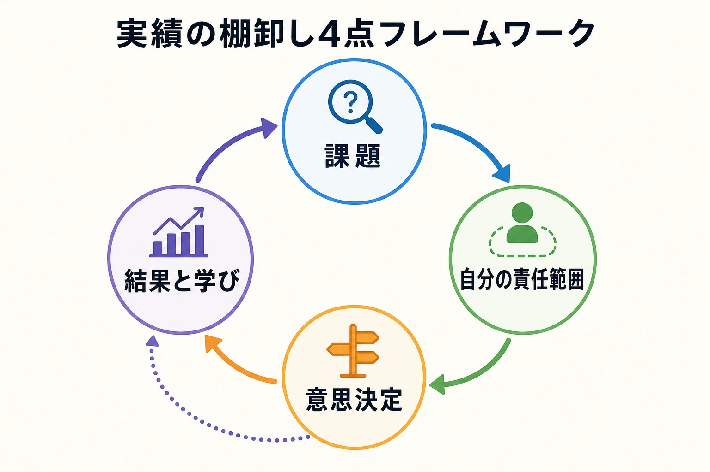
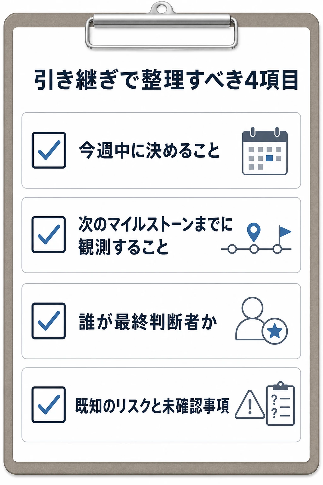
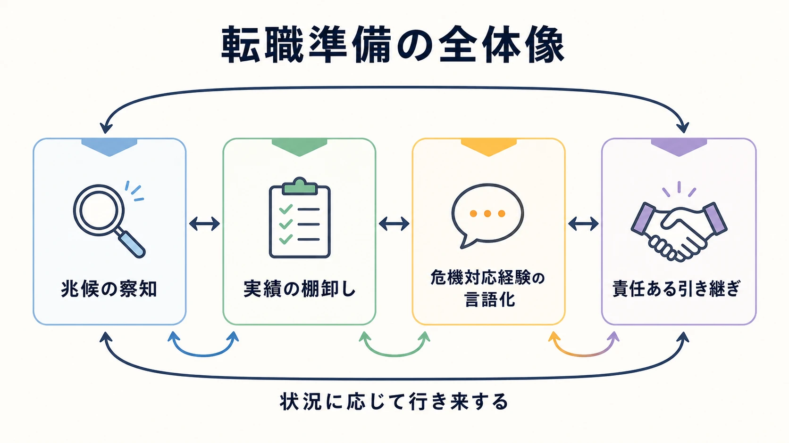

# ゲームプランナーの転職論――スキルアップか、泥舟から逃げるか

転職はしばしば「より難しい仕事に挑む」「年収を上げる」といった前向きな言葉で語られる。そこで示される準備は、次の役割に必要な能力を積み上げ、希望する会社を選び、交渉するためのものだ。

しかし、ゲーム開発の現場には別の出発点もある。業績悪化で体制が縮小する、サービスの更新が細る、炎上対応が長期化して日常の判断力まで消耗する。そうした状況から離れたいと考えることは、珍しいことでも、職業人として劣った動機でもない。問題は動機の明るさではなく、急ぐ局面でも次の職場に何を持っていけるかである。

ゲームプランナーは、成果がゲーム内に溶け込みやすく、個人の実績として切り出しにくい職種でもある。さらに、企画書、仕様書、KPIダッシュボード、未公開のロードマップは前職の著作物や秘密情報であり、そのまま持ち出してポートフォリオにできない。本稿は「辞めるべき会社」を判定するためのものではない。辞めると決めた後、前向きな転職でも、現職から離脱する転職でも、準備の質をどう上げるかを考える。

***

## 「逃げる」判断は、外から見える材料で急がせすぎない

現職の危険を察知したとき、内部情報が十分に共有されるとは限らない。だからこそ、個人は自分のキャリアを守るため、外から確認できる事実を判断材料として持つ必要がある。たとえば、公式サイトや告知の更新頻度、イベントや機能追加の継続性、採用や協業先に関する公表、親会社の開示情報は、体制の変化を読む手掛かりになる。

ただし、これらは退職の正解を自動的に示す指標ではない。更新が減った理由は、開発の集中、方針転換、広報体制の変更など複数あり得る。国内スマートフォンゲーム事業者の倒産動向と、開発費・運営費が重くなる構造は[既存記事](smartphone-game-developer-bankruptcies-2026-structural-costs-market.md)で整理した。そこにある運営費が売上を上回り続ける兆候や更新の停滞を、会社を断定する材料ではなく、履歴書を更新し、求人を見始めるための早期警報として扱うのがよい。[[1](#ref-1)][[2](#ref-2)]

不安が強い局面ほど、「残るか辞めるか」を一晩で決めようとしがちである。だが実務上は、職務経歴を棚卸しし、契約と就業規則を確認し、相談先を確保する行為そのものが選択肢を増やす。退職日を決めていなくても、準備は始められる。

***

## プランナーは何を持って辞められるか

プランナーの転職で示すべきものは、自分がどの制約の下で、誰と何を決め、その決定がどんな結果につながったかという再現可能な仕事の説明である。完成済みの企画書のファイルではなく、守秘義務を守りながら、事実を自分の役割に引き寄せて翻訳したものである。

棚卸しは、案件名や売上額を列挙するより、次の四点を一組にすると語りやすい。

- **課題**：どのプレイヤー行動、開発上の詰まり、運営上のリスクを扱ったか。
- **自分の責任範囲**：仕様の起案、KPIの観測、関係部署との調整、実装後の検証のうち、どこを担ったか。
- **意思決定**：選択肢と制約をどう整理し、何を優先して決めたか。
- **結果と学び**：数値や反応がどう変わったか。数値を開示できない場合は、比較対象、観測期間、次の改善へ反映した点をどう説明できるか。

たとえば「KPIを改善した」という一文だけでは、採用側は再現条件を判断できない。「特定の導線で離脱が増えたため、行動ログと問い合わせを照合し、チュートリアルの説明順と報酬提示を変更した。施策後は週次で完了率と関連する離脱率を追い、想定外の副作用も確認した」と説明できれば、ゲーム固有の名称や秘匿すべき数値を出さずに、分析から実装後の検証までの仕事が伝わる。

数値は無理に丸めたり、印象的な割合だけを抜き出したりしない。公開済みの数字以外を話す必要がある面接では、開示可能な範囲を先に区切り、変化の方向、比較期間、自分の寄与を曖昧にしないことが重要である。成果が未達だった案件も、失敗の原因を外部要因だけに置かず、早期に置けた仮説、見落とした前提、次に変える工程を語れれば、判断の質として残る。

実績メモは、退職直前ではなく、案件が終わるたびに自分用の非機密な言葉で残しておく。公開資料のURL、すでに公表された担当範囲、自分の学びを分けて記録すれば、記憶が薄れる前に職務経歴書の材料を作れる。前職の資料を自宅へ転送して保管することは、その代替ではない。

*図：実績は「課題→自分の責任範囲→意思決定→結果と学び」の順で整理すると、次の案件にもつながる説明になる。*

***

## 「炎上対応」を危機対応の経験値に変換する

炎上対応の渦中にいた経験は、当人にとって成功談になりにくい。ユーザーの不満、SNSでの拡散、問い合わせの集中、開発チームへの負荷が同時に起きるため、離れたいという感情が残るのは自然である。

一方で、採用側が知りたいのは、炎上の規模そのものではない。情報が不完全で感情の振れ幅が大きい局面で、プランナーがどのように判断を支えたかである。次の問いに答えられるよう整理すると、経験は「逃げた話」ではなく危機対応の技能になる。

- 事実確認、影響範囲の推定、対外説明の準備を、どの順で進めたか。
- ユーザーへの説明と、未確定事項を伏せる必要との境界を、誰とどう決めたか。
- 問い合わせ、SNS、ゲーム内の挙動など、どの情報を判断材料として扱ったか。
- 一時対応の後、仕様、監視、承認経路、エスカレーションのどこを恒久的に変えたか。

ここでも、個別の投稿、未公開の売上、社内チャットを証拠として示す必要はない。時系列を一般化し、自分の役割と意思決定のプロセスを説明する。危機対応の経験を「トラブルを起こさなかった能力」に言い換える必要もない。トラブルが起きたときに、プレイヤー、事業、開発チームの間で情報と優先順位を整えた能力として位置付ければよい。

***

## 責任ある辞め方が、次の評価を決める

引き継ぎの質は、残るチームの負荷だけでなく、自分がプロジェクトを完了へ近づける人材かどうかを示す最後の実績になる。ゲーム開発では、仕様の背景、未解決の課題、関係者との約束が一人の頭の中に残りやすく、転職活動は内定を得た時点で終わるものではない。

引き継ぎでは、担当タスクの一覧だけで終わらせず、「今週中に決めること」「次のマイルストーンまでに観測すること」「誰が最終判断者か」「既知のリスクと未確認事項」を分ける。後任が資料を読んで同じ迷いを繰り返さない状態を目標にする。必要なら、受け手と一度読み合わせをして、引き継ぎ後にどの連絡経路を使うかも明確にする。

秘密保持と競業避止については、感覚で処理しない。雇用契約、就業規則、退職時の誓約書を確認し、守秘対象や退職後の義務に不明点があれば、署名前に会社の窓口や専門家へ確認する。経済産業省も、転職前に会社の営業秘密を持ち出していないか確認し、転職後に前職の情報を不用意に持ち込まないよう案内している。[[3](#ref-3)]

無断退職、いわゆる「バックレ」は推奨しない。体調や安全に緊急の危険がある場合は、まず医療機関、家族、労働相談窓口などへの接続を優先すべきであり、一人で引き継ぎを完遂しようとする必要はない。それ以外では、退職の意思と退職日を記録に残る形で伝え、必要な手続きを進めることが、自分と周囲を守る。厚生労働省は、無期労働契約では退職の申出から原則として2週間で契約が終了すると案内する一方、就業規則等にある退職手続を確認し、適切に進めることがトラブル防止に重要だとしている。個別の契約や健康上の事情によって対応は変わるため、法的な判断が必要な場合は専門家へ相談する。[[4](#ref-4)]

*図：後任者が引き継ぎ直後に確認できる4項目。*

*図：4つの準備は一方向の手順ではなく、状況に応じて行き来する。*

***

## 結び――動機ではなく、準備の質が結果を分ける

「スキルアップのための転職」と「泥舟から逃げる転職」は、最初の感情としては異なる。だが、次の職場で評価されるのは、その感情を美化できるかではない。自分の仕事を守秘義務の範囲で説明できるか、困難な局面の判断を学びとして整理できるか、残るチームへ責任を果たせるかである。

後ろ向きな動機は、準備を急がせる現実的な理由になり得る。そのこと自体を恥じる必要はない。求人を見る前に、非機密の実績メモを作る。職務経歴書では成果を課題・役割・意思決定・結果に分ける。契約と退職手続を読み、引き継ぎを完了条件として置く。この準備は、現職に残る選択をしても無駄にならない。

キャリアを守るとは、危ない場所から離れることだけでも、華やかな経歴を積むことだけでもない。自分が積み上げた判断と協働の経験を、次の仕事で再び使える形にして持ち出すことである。動機がどちらから始まっても、転職の結果を分けるのは準備の質である。

## References

1. [「スマホゲーム事業者」の倒産動向（2026年8月8日）][1] - 帝国データバンク。国内スマートフォンゲーム事業者の倒産件数、集計対象、背景の分析。

2. [『文豪ストレイドッグス 迷ヰ犬怪奇譚』――告知から実質1日、廃業と「異能石」払戻し拒否が突いた法とサービス終了設計の隙間][2] - 本ブログ。公式サイトの更新停滞を、サービス継続性を推し量る外部の手掛かりとして扱う際の留意点。

3. [営業秘密～営業秘密を守り活用する～][3] - 経済産業省。退職・転職時の営業秘密、秘密情報の取扱いに関する資料への案内。

4. [退職、解雇、雇止めなど][4] - 厚生労働省「確かめよう労働条件」。退職手続、無期労働契約における退職の申出に関する案内。

[1]: https://www.tdb.co.jp/report/economic/20260808-smartphonegames26y1-7/
[2]: bungo-stray-dogs-mayoi-inu-bankruptcy-shutdown-refund-gap.md
[3]: https://www.meti.go.jp/policy/economy/chizai/chiteki/trade-secret.html
[4]: https://www.check-roudou.mhlw.go.jp/study/roudousya_taisyoku.html

----

この文書は、Perplexity、Claude、OpenAI Codex の3つのAIの支援を受けて著述されたものです。引用画像を除き、MIT License にて提供されています。
