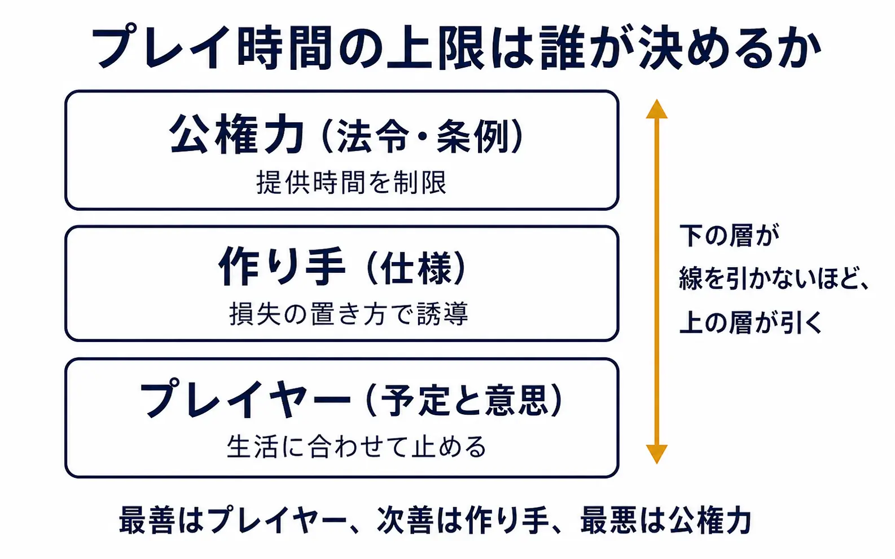
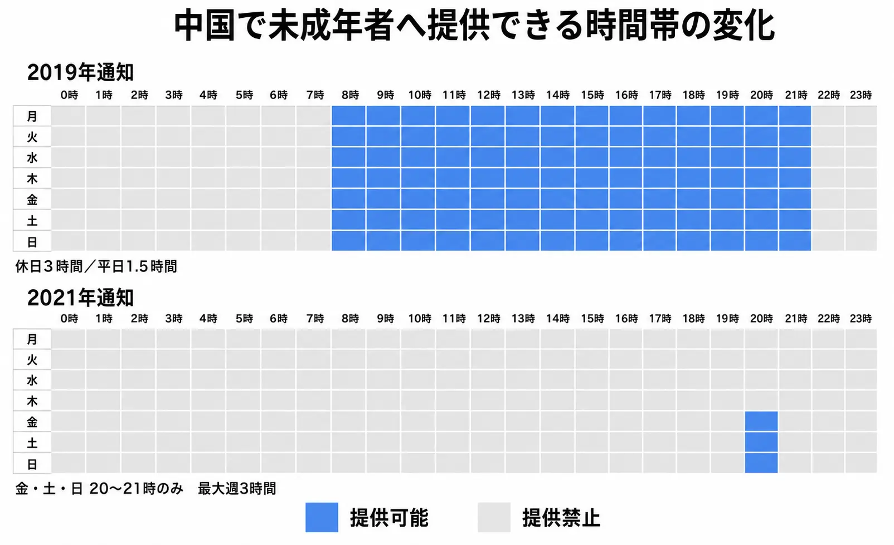
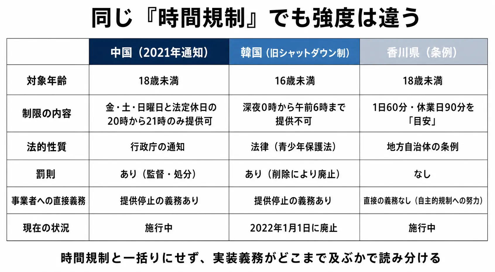
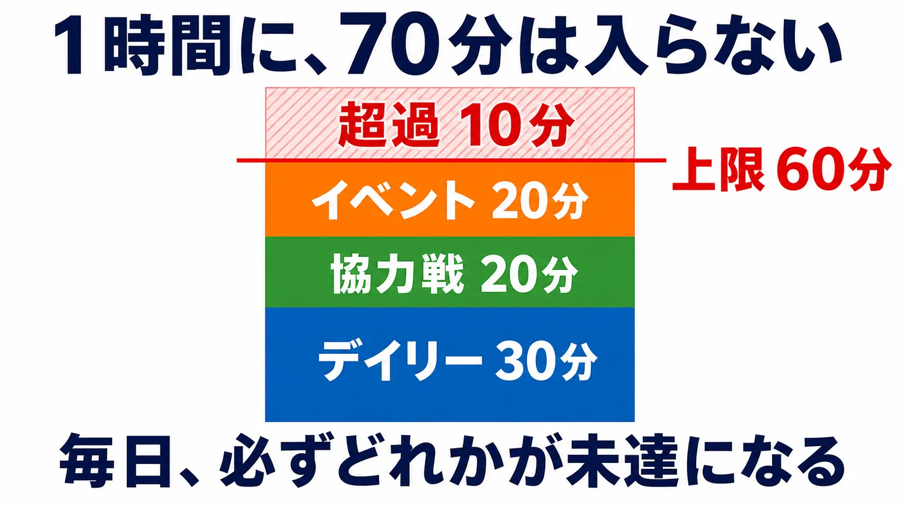
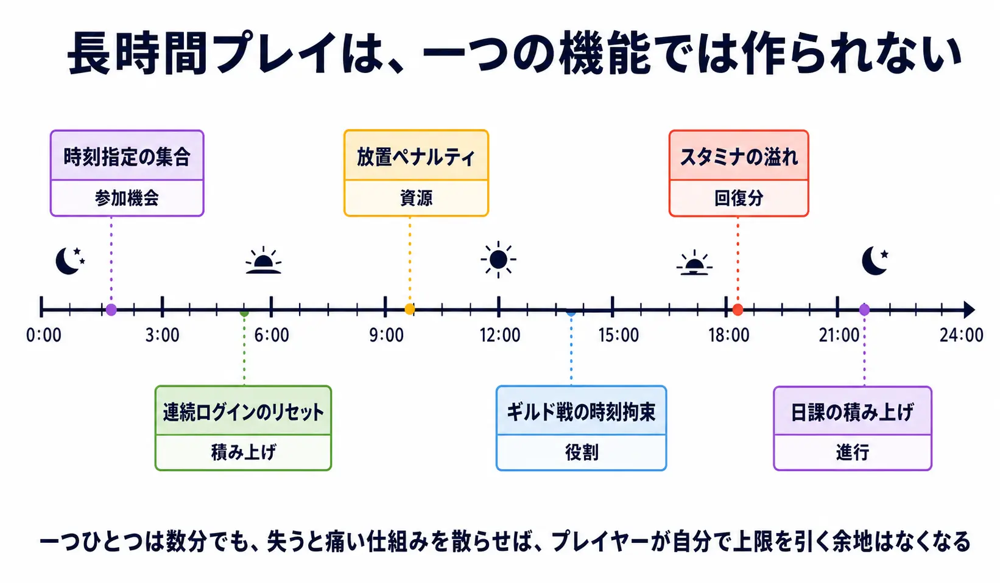
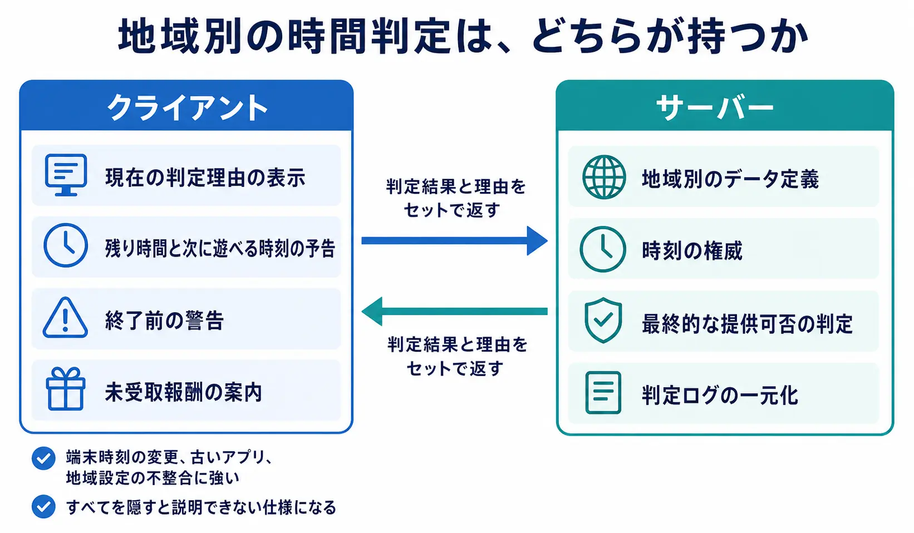

# プレイ時間の上限は誰が決めるのか――各国の時間規制から考えるコンテンツ消費設計

「1日何時間まで遊んでよいか」は、数字だけを比べても設計の問いにならない。重要なのは、その上限を誰が決め、誰が実装し、誰が取りこぼしの責任を負うのかである。

上限を決めうる主体は三者ある。自分の予定に合わせて止めるプレイヤー、仕様によって遊び方に線を引く作り手、そしてルールで提供時間を制限する公権力である。本稿は作り手の側から、この三者の境界を考える論考である。ゲーム障害の医学的な定義や治療、依存症の是非は扱わない。扱うのは、外部から定められた時間上限が、ゲームの仕様とコンテンツの消費速度をどう変えるかである。

各国のレーティングや年齢確認、未成年の課金保護を横断的に確認したい場合は、先に「[ゲームにおける各国の審査機関のレギュレーション](game-global-rating-regulations.md)」を参照してほしい。本稿は対応項目のチェックリストではない。また、スタミナの回復速度や上限値、課金との関係は「[スタミナ・AP（行動力）システムの設計実務](stamina-energy-system-design-practices.md)」で扱っている。ここで見るのは、時間の上限が外から入ったとき、そうした消費設計がどこで衝突するかである。

***

## 1. 規制を「思想」ではなく仕様への要求として読む

制度の賛否を先に決めると、実装上の要求が見えなくなる。ゲームを提供する側に届くのは理念ではなく、「いつ、誰に、どの機能を提供してよいか」という制約である。

### 中国：提供可能な時間帯そのものが変わる

中国の国家新聞出版署は2021年の通知で、未成年者へのオンラインゲーム提供を、金・土・日曜日と法定休日の各日20時から21時までの1時間に限ると定めた。全てのオンラインゲームは同署の実名認証システムへ接続し、実名登録・ログインをしていない利用者へは、体験用のゲスト利用を含めてサービスを提供してはならない。通知は同年9月1日に施行された。[[1](#ref-1)]

注意したいのは、この基準が最初からこの形だったわけではないことである。2019年の通知では、22時から翌8時までの提供を禁じたうえで、法定休日は1日3時間以内、それ以外は1日1.5時間以内としていた。[[2](#ref-2)] 同署は2021年の記者質疑で、この基準についてなお緩いという保護者からの意見が少なくなく、より厳しく圧縮すべきだという提案を受けたと説明している。[[3](#ref-3)] 規制は一度決まれば固定される要件ではない。数値が動けば、提供可否の判定も、告知も、コンテンツの回転も作り直しになる。

同署が2019年に示した枠組みには、未成年者への課金サービスの制限も含まれる。8歳未満への課金提供を禁じ、8歳以上16歳未満には1回50元、月200元、16歳以上の未成年者には1回100元、月400元の上限を設けた。[[2](#ref-2)] 本稿の焦点は課金額ではないが、時間と支出を別々の画面で処理していても、年齢判定という同じ基盤に依存することは押さえておく必要がある。

出典：国家新聞出版署「[2019年通知に関する記者専訪][2]」および「[2021年通知][1]」。

作り手にとってこれは「未成年に長く遊ばせない方針」では済まない。利用者の年齢をアカウント単位で確定し、公式時刻を基準に提供可否を判定し、開始中のセッションを終了させ、次回のログインまで進行・報酬・購入導線をどう扱うかを実装する要求である。イベントの開始直後に全対象者が同じ1時間へ集中するなら、同時接続、マッチング、通知、サポート導線もそのピークに耐えなければならない。

### 韓国：一律停止から選択制へ移った制度

韓国のシャットダウン制は、深夜0時から午前6時まで、16歳未満の青少年へオンラインゲームを提供できないとする仕組みだった。2000年代初頭にゲームへの過度の没入が社会問題として浮上したことを受け、2005年に国会へ青少年保護法の改正案が発議され、多様な社会的議論を経て2011年から施行された。[[4](#ref-4)]

この制度は10年で終わっている。廃止を柱とする青少年保護法の改正案が2021年11月11日に国会本会議を通過し、2022年1月1日をもって、16歳未満への深夜時間帯のゲーム提供制限と、違反した場合の罰則規定が削除された。以後は、保護者と子どもが自律的に利用時間を調節する「ゲーム時間選択制」へ、時間制限の制度が一元化されている。[[4](#ref-4)]

女性家族部が挙げた廃止の理由は四つある。シャットダウン制が適用されないモバイルゲームが市場を主導するようになったこと、深夜に青少年が利用できる媒体が多様化したこと（個人配信、OTT、SNS、ウェブトゥーンなど）、先進国は個人と家庭の自律的な調節を原則としていること、そして過去に比べて保護者のゲーム指導の力量が高まったことである。[[4](#ref-4)]

ここから読めるのは、時間制限が不要になったという結論ではない。一律の時刻停止が、端末や配信形態の変化に追随できなければ、制限の対象外へ行動を移すだけになりうるということである。規制の実装対象を狭く切った制度は、ゲームの遊ばれ方が変わるほど、目的と実効性の距離を広げる。

### 香川県：国の法律ではなく、罰則を置かない県条例

香川県のネット・ゲーム依存症対策条例は、2020年4月1日に施行された県条例である。国の法律ではない。第18条は保護者に対し、子どもと話し合って利用ルールを作り直すことを求めたうえで、ゲーム利用を1日60分まで、学校等の休業日は90分までとし、スマートフォン等の使用を義務教育修了前の子どもは午後9時までに、それ以外の子どもは午後10時までにやめることを「目安」とし、そのルールを守らせるよう努めるとしている。条例には違反に対する罰則や行政罰を定める条はない。[[5](#ref-5)]

この制度は、ゲーム事業者に特定時刻の強制ログアウトを直接命じるものではない。事業者には、依存症の予防等への配慮と県の対策への協力に加えて、射幸性が高いオンラインゲームの課金システム等により依存症を進行させるなど子どもの福祉を阻害するおそれがあるものについて、自主的な規制に努めることを求めている。[[5](#ref-5)] 名指しされているのが時間だけではない点は、作り手として押さえておきたい。あわせて同条例は、施行後3年間は毎年、その後は2年ごとに実態調査を行うと定めており、効果測定を条例自身に組み込んでいる。[[5](#ref-5)]

したがって、実装へ直結する中国の通知や旧韓国制度と同じ強度で読んではならない。ただし、プレイ時間をめぐる問題が自治体の条例としても扱われ、事業者の自主的対応に言及している事実は、作り手にとって無関係ではない。

### 共通して発生する非機能要件

制度の強さは異なるが、強制的な時間制限を実装する市場では、少なくとも次の論点を仕様に落とす必要がある。

| 論点 | 決めるべきこと |
|---|---|
| 年齢・本人確認 | 年齢区分の根拠、認証失敗時の扱い、アカウント移管時の再判定 |
| 時刻の権威 | 端末時刻ではなく、どのサーバー時刻と休日カレンダーを正とするか |
| 地域判定 | 居住地、ストア地域、接続地域、本人確認情報が食い違う場合の優先順位 |
| セッション終了 | 対戦中、協力戦中、演出中に上限へ達した場合の中断、保存、再接続 |
| 経済と返金 | 上限直前の購入、未使用アイテム、失効報酬、問い合わせと返金判断 |
| 監査可能性 | 認証、ログイン、ログアウト、購入、補償を時刻付きで追跡できるか |

特に強制ログアウトはUIの警告だけでは完結しない。協力戦の一人が離脱することで他者の報酬まで失わせるのか、切断者をAIへ置き換えるのか、途中報酬をどの時点で確定するのかを決める必要がある。時間規制は、ゲームループの外側に付けるタイマーではなく、セーブ、ネットワーク、経済、CSを横断する要件である。

***

## 2. 時間上限はコンテンツ供給計画を変える

ライブサービスでは、プレイ時間は単なる滞在時間ではない。週次イベント、シーズンパス、デイリー任務、スタミナ回復、ギルド活動は、プレイヤーが一定の可処分時間を持つことを前提に消費速度を設計している。外部から上限が入れば、その前提が崩れる。

たとえば、1時間しか入れない市場で、デイリー任務30分、協力戦20分、イベント周回20分を同日に要求すれば、プレイヤーはどれかを切るしかない。ここで「優先順位を選ばせている」と言えるのは、取り逃しても主要な報酬・成長・所属感を失わない場合だけである。全部が期限付きで、全部が翌日に持ち越せないなら、選択ではなく未達の配分になる。

期間限定コンテンツでは、この問題がさらに強く出る。上限のある時間帯だけを開ける設計で、開始直後の障害、学校行事、家庭の予定が重なれば、その日の参加機会は丸ごと失われる。取り逃しは運の悪い例外ではなく、仕様が作る構造になる。期間限定イベントの救済や終了処理は「[期間限定イベント設計の実務](limited-time-event-design-practices.md)」で詳しく扱っているが、時間規制がある市場では救済を例外処理にせず、完走計画そのものに組み込む必要がある。

スタミナも同様である。短い自然回復上限は、複数回のログインを促すために使われやすい。しかし利用できる時間帯が限られているなら、回復が溢れたことを「戻らなかったプレイヤーの損失」にしてはならない。上限を越えた分のオフライン蓄積、未消化分の繰越、指定時間外でも編成・閲覧・受取だけは行える機能分離などが必要になる。回復速度を速くするか遅くするかより先に、限られた接続枠へ何を詰め込むかを決めるべきである。

時間制限を前提とする市場向けには、次の変更が有効である。

- 日次の必須行動を減らし、週単位の累計目標へ丸める
- 主報酬を短いプレイで到達できる位置へ置き、反復は外見報酬や挑戦報酬へ分離する
- 開催時間を一つの時刻へ固定せず、複数の参加枠または非同期の達成方法を用意する
- 受取・交換・物語閲覧に、プレイ本体より長い猶予を与える
- 短時間に同時接続が集まる前提で、待ち行列、マッチング、障害時の補償を設計する

これは規制対応だけの話ではない。時間に余裕がないプレイヤーにとっても、コンテンツの価値を「長く接続した者だけが得るもの」から、「遊んだ内容で選べるもの」へ移す設計になる。

***

## 3. 作り手が引いてこなかった線

作り手がプレイ時間を直接指定していなくても、設計は行動を拘束できる。「24時間ベッタリ」を要求する設計とは、長時間プレイを一つの機能で強制することではない。短い拘束を、失うと痛い複数の仕組みとして積み上げることである。

| 仕組み | 時間を拘束する仕方 | 外したときの損失 |
|---|---|---|
| 時刻指定の集合 | 決められた時刻にだけ協力・対戦が成立する | 所属集団の参加機会、順位、関係性 |
| 連続ログインのリセット | 毎日の接続を連鎖させる | それまでの積み上げと次の報酬 |
| 放置ペナルティ | 非ログイン中の損失を可視化する | 資源、育成効率、順位 |
| ギルド戦の時刻拘束 | 集団の都合を個人の予定より優先させる | 仲間への負債感、役割、報酬 |
| スタミナの溢れ | 戻らない時間を損失に変える | 自然回復分とイベント進行 |
| 日課の積み上げ | 短い必須行動を毎日増やす | 成長、通貨、シーズン進行 |

これらを収益に結び付けること自体を、直ちに不当と断じるわけではない。運営型ゲームには継続率、コミュニティ、コンテンツ供給の調整が必要である。しかし、余暇のなかで時間を捻出して遊ぶことと、遊ばない時間に損失を積み、予定に合わせることを要求することは別である。後者を重ねれば、プレイヤーが自分で上限を決める余地は狭くなる。

作り手が引く線は、禁止画面や警告だけではない。次のような自制の手立てを、失敗時の救済ではなく通常仕様にできる。

- オフラインでも一定量を蓄積し、短時間で回収・消化できるようにする
- 連続記録ではなく通算記録を基準にし、欠席の1日で進捗を壊さない
- 日次目標を週次の累計へ丸め、参加する曜日を選べるようにする
- 日課の一部を自動消化、まとめ受取、予約実行にして、操作回数で忠誠を測らない
- 協力・対戦は複数時刻、非同期参加、代理編成を用意し、生活時間の違いを罰しない
- 終了前の追い込みではなく、残り時間と到達可能性を早い段階から示す

線を引くとは、プレイを短くすることではない。止めても戻れること、休んでも集団から切れないこと、限られた時間で核となる体験を選べることを、仕様として保証することである。

***

## 4. 罰する方向の危うさと、規制を支持する理由

時間を使ったこと自体を公権力が問題行動として扱う仕組みには、限界がある。ゲームだけを時刻で止めても、睡眠や家庭内の課題が別の媒体、別のアカウント、別の名義へ移るなら、原因の全てには届かない。韓国の制度改正理由が、PCオンラインゲーム中心の規制と、モバイルを含む利用環境の変化のずれを挙げたことは、この限界を示す具体例である。[[4](#ref-4)]

より直接的な証言は、規制を進めている側から出ている。中国の国家新聞出版署は2021年の記者質疑で、一部の未成年者が保護者の身分情報を使ったり、成人の身分情報を購入したりして実名認証を迂回し、身分による制限を突破していること、その結果として時間帯・時間長の制限が機能しなくなっており、これが対策の効果に影響する重要な原因になっていることを認めている。[[3](#ref-3)] 世界でも最も強い部類の時間規制を、国家規模の実名認証基盤とともに敷いた市場で、当局自身がこう述べている事実は重い。強制の強度を上げることと、目的に届くことは、同じではない。

ただし、ここで規制を支持する側を「ゲームを嫌う人」として退けてはならない。最も強い論拠は、保護者が個別のサービス、機器、課金、通知、家庭内の交渉を一人で管理しきれない現実にある。中国の2021年通知が、社会各方面とりわけ広範な保護者からの反響が強いことを背景に挙げ、より厳しい時間の圧縮を望む声に応えたと説明していること、[[1](#ref-1)][[3](#ref-3)] 韓国がシャットダウン制の廃止理由の一つに、過去と比べて保護者のゲーム指導の力量が高まった点を挙げたこと[[4](#ref-4)]——後者は裏を返せば、導入当時それが十分ではないと見なされていたということでもある。睡眠を含む生活時間を守りたい保護者にとって、事業者が一律に停止する機能は、交渉の負担を減らす手段になる。事業者の自主規制が十分に機能してこなかったという評価があるからこそ、制度は導入されてきた。

規制側が一律の全面禁止を志向しているとも限らない。中国の当局は、未成年者に少量の時間を残した理由として、適度にゲームに触れることは理解できるという教師や保護者の声があり、特に運動系のゲームやプログラミング、将棋・囲碁のような形式は成長に積極的な作用があるという認識を挙げている。[[3](#ref-3)] 時間の総量をめぐる議論の底には、何を遊ばせたくないのかという内容の判断も潜んでいる。

それでも作り手の立場からは、罰を前提にした一律停止を最初の解にすべきではないと考える。対象が変化すれば規制は追随しにくく、正当に遊ぶ利用者の途中体験も切り、設計側は回避ではなく急造の強制終了に追われるからである。保護者が使える選択肢と、プレイヤーが自分で止められる設計を先に整える方が、目的に対して細かく働く。

***

## 5. プランナーが実務で握れること

時間規制は法務や基盤チームだけの仕事ではない。プランナーがイベント、報酬、進行、地域別運用を決める段階で、後から救えない要求を作ってしまう。

### 保護者向け機能を「規制対応の画面」にしない

保護者向け機能は、上限設定、利用時間の確認、例外の承認、通知先の設定を一か所に集める。重要なのは、設定した結果を子ども側にも分かる形で示すことだ。急な遮断だけでは、約束を作る機能にならない。次に遊べる時刻、今日の残り枠、未受取報酬の扱いを明示すれば、家庭内のルールとゲームの状態がずれにくい。

### 時間ではなく到達で区切る

「30分遊んだら終わる」より、「このクエストを終えたら区切れる」方が、プレイヤーは止めどころを選びやすい。長い協力戦や物語の途中で上限に達する設計は、制限への反発を強める。短い目標単位、任意の中断セーブ、残りの見通しを用意し、終了を敗北や切断にしないことが重要である。

### 可視化と自己申告を、制約ではなく選択肢にする

プレイ時間の週次表示、目標時間の自己申告、上限到達前の通知、翌日に持ち越す選択は、プレイヤーが自分で線を引くための道具になる。初期値を短く押し付けるのではなく、変更しやすく、解除にも待機時間や再確認を置くなど、衝動的な延長だけを防ぐ設計がよい。成人にも使える機能として提供すれば、年齢認証の有無にかかわらず、設計思想を全体へ広げられる。

### 地域別仕様は、判定をサーバーに寄せる

地域ごとの提供可否、年齢区分、時間枠、休日は、クライアントだけで決めない。時刻と権限の最終判定はサーバーが持ち、クライアントは表示と予告を担当する方が、端末時刻の変更、古いアプリ、地域設定の不整合に強い。とはいえ、すべてをサーバーへ隠すと説明できない仕様になる。プレイヤーが見えるルール、現在の判定理由、次に可能になる行動はクライアントで明確に伝え、地域別のデータ定義と判定ログはサーバーで一元化する。この分担を企画書の段階で書いておく必要がある。

***

## まとめ：線を引く順序を取り違えない

プレイ時間の上限は、数字の正しさだけでは決められない。上限を誰が決められるかで、ゲームがプレイヤーの余暇を尊重しているか、外部から管理される対象になっているかが変わる。

最善は、プレイヤー自身が予定と意思に合わせて上限を引けるように設計することである。次善は、作り手が取り逃しや所属の不安を減らし、無理をしなくても遊び続けられる線を引くことである。最悪は、作り手が線を引かないまま、強制的な停止を公権力に引かせることである。

公権力の介入には、保護者だけでは対処しきれない現実という理由がある。だからこそ作り手は、規制を遠い法務の問題として待つのではなく、コンテンツの消費速度、終了のしやすさ、休んだときの損失を日々の仕様から見直すべきである。プレイヤーが自分で止められるゲームは、規制を回避するためのゲームではない。遊ぶ時間の主導権を、プレイヤーへ返すゲームである。

## References

1. [关于进一步严格管理 切实防止未成年人沉迷网络游戏的通知][1] - 中国・国家新聞出版署が2021年8月30日に発出した通知（国新出発〔2021〕14号）。未成年者へのオンラインゲーム提供を金・土・日曜日と法定休日の20時から21時までの1時間に限ること、実名認証システムへの接続とゲスト利用の禁止、2021年9月1日施行、未成年者を18歳未満と定義することを示す。

2. [国家新闻出版署有关负责人就《关于防止未成年人沉迷网络游戏的通知》有关情况接受记者专访][2] - 2019年通知に関する国家新聞出版署担当者への記者専訪（2019年11月5日）。22時から翌8時までの提供禁止、法定休日1日3時間以内・それ以外1日1.5時間以内という当時の時間規制と、8歳未満への課金提供禁止および年齢別の課金上限（8歳以上16歳未満は1回50元・月200元、16歳以上の未成年者は1回100元・月400元）を示す。

3. [国家新闻出版署有关负责人就《关于进一步严格管理 切实防止未成年人沉迷网络游戏的通知》答记者问][3] - 2021年通知に関する国家新聞出版署担当者への記者質疑（2021年8月30日）。2019年の基準が緩いという保護者の意見を受けて時間を圧縮した経緯、身分情報の借用・購入による実名認証の迂回が時間制限を機能させなくしているという認識、少量の時間を残した理由を示す。

4. [게임 셧다운제 폐지, 게임이용시간 가정 자율 선택][4] - 大韓民国女性家族部の報道資料（2021年11月11日、政策ブリーフィング掲載）。深夜0時から午前6時まで16歳未満へのオンラインゲーム提供を制限する制度が2005年の改正案発議を経て2011年に施行されたこと、廃止を柱とする青少年保護法改正案が2021年11月11日に国会本会議を通過し2022年1月1日に廃止されること、提供時間制限と罰則規定の削除、ゲーム時間選択制への一元化、および廃止理由の四項目を示す。

5. [香川県ネット・ゲーム依存症対策条例][5] - 令和2年3月24日条例第24号、令和2年4月1日施行。第18条の利用時間および時刻の目安、第11条の事業者の役割（課金システムに関する自主的規制を含む）、第20条の実態調査を定める。罰則規定は置かれていない。

[1]: https://www.nppa.gov.cn/xxfb/tzgs/202108/t20210830_666285.html
[2]: https://www.nppa.gov.cn/xxfb/ywxx/201911/t20191105_664150.html
[3]: https://www.nppa.gov.cn/xxgk/zcjd/202108/t20210830_4759.html
[4]: https://www.korea.kr/briefing/pressReleaseView.do?newsId=156480390
[5]: https://www.pref.kagawa.lg.jp/documents/1150/jourei.pdf

----

この文書は、Perplexity、Claude、OpenAI Codex の3つのAIの支援を受けて著述されたものです。引用画像を除き、MIT License にて提供されています。
