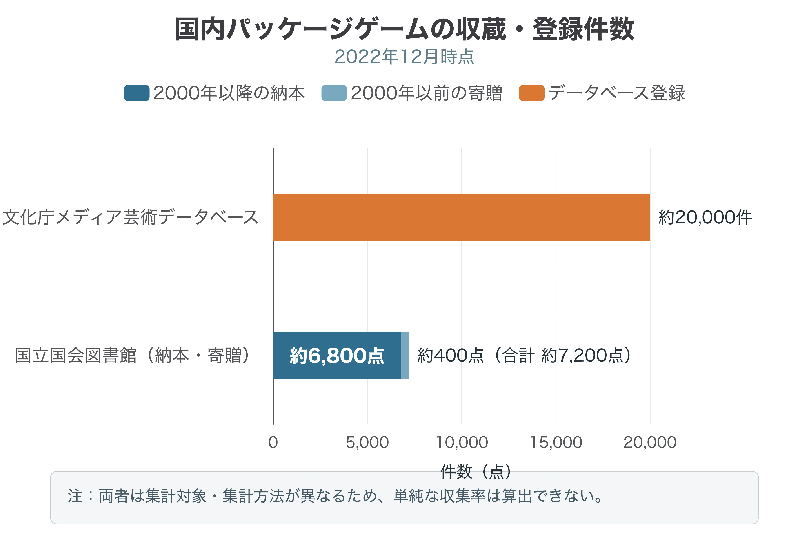
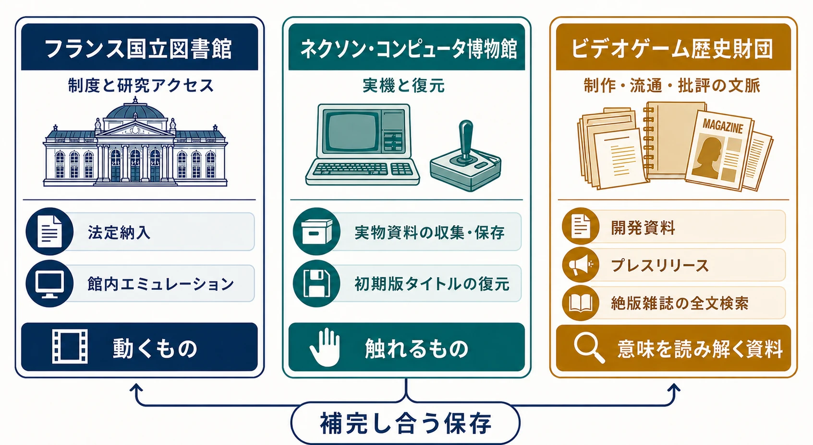
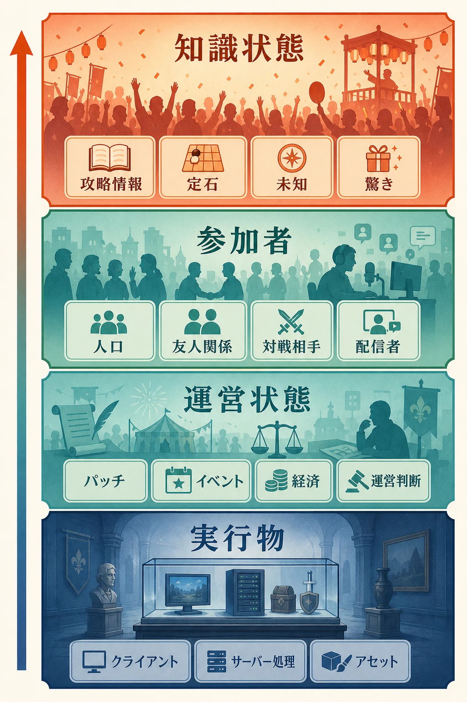

# ゲームはどこまで保存できるのか――博物館に残せる作品と、戻らないライブサービスの「お祭り」

## はじめに：「保存」という一語に二つの仕事がある

ゲーム保存には、性質の異なる二つの対象がある。

一つは、パッケージソフト、基板、筐体、家庭用ゲーム機、周辺機器などを収集し、将来も調査・展示・プレイできるようにする **博物館的な保存** である。ゲーム史、技術史、デザイン史を検証する基盤であり、本記事はこの活動を強く支持する。

もう一つは、サーバーへ依存するライブサービスを、公式運営の終了後も遊べるようにしてほしいという要求である。こちらにも消費者保護と文化保存の重要な問題提起がある。ただし、ソフトウェアを起動可能にすることと、稼働当時のサービス体験を保存することは同じではない。

ライブサービスの体験は、クライアントとサーバーだけで完結しない。参加するプレイヤー、運営の判断、季節イベント、その時点の経済、攻略知識の広まり方が互いに影響して生まれる。それは、会場を残せても同じ観客と熱気までは戻せない **一回性の「お祭り」** に近い。記録はできる。技術的な再演もできる。しかし、当時の体験そのものを再現し、永続化することはできない、というのが本記事の立場である。

この論点は、既存記事「[サービス終了をどう設計するか――オンラインゲームを破綻なく畳む実務](service-shutdown-design-and-practice.md)」で扱った課金停止、払戻し、告知、オフライン化といった終了実務とは異なる。本記事では終了手順を繰り返さず、 **完成品として何を保存できるか、共同で生成された体験について何を記録すべきか** を考える。

***

## 完成品を残すことには、現実的な意義がある

パッケージ・アーケード型の保存対象には、比較的はっきりした境界がある。正規のソフト、稼働するハード、必要な周辺機器、説明書、更新データをそろえれば、同じ入力に対して同じ規則が応答する状態へ近づける。ブラウン管、特殊コントローラー、通信ケーブル、筐体の音響まで含めれば完全な再現は難しいが、何が欠けたかを特定しながら保存精度を高められる。

| 対象 | 保存の中心 | 成功を判断する基準 | 残る限界 |
|---|---|---|---|
| パッケージ型 | ソフト、ハード、更新データ、説明書 | 同じ規則と内容へ再びアクセスできる | 媒体劣化、機器故障、DRM、配信終了 |
| アーケード型 | 基板、筐体、表示・音響・入力機器、運営資料 | 当時の物理条件を含めて動作を観察できる | 部品枯渇、設置空間、店舗環境の差 |
| ライブサービス型 | クライアント、サーバー処理、設定、運営記録 | 特定時点の仕組みを動かし、研究できる | 人口、運営判断、経済、知識状態は戻らない |

2026年7月、ソニー・インタラクティブエンタテインメントは、PS3とPS VitaのPlayStation Storeについて、大半の地域で2027年7月に新規購入を終了すると発表した。購入済みコンテンツは終了後も当面再ダウンロードできるとしている。[[1](#ref-1)] 同日には、PlayStation向け新作ゲームの物理ディスク生産を2028年1月から終了する方針も示した。既発売作品と、それまでにディスクで発売される作品には影響しない。[[2](#ref-2)]

この二つの発表は、流通手段が保存可能性を左右することを端的に示す。物理媒体は劣化するが、正規品を収集し、読み取り、別の媒体へ移す出発点を残せる。ダウンロード専売作品は、販売、認証、再ダウンロードの仕組みが閉じた後、保存機関が正規に収集する入口そのものを失いやすい。だからこそ、パッケージ・アーケード型の収集は懐古趣味ではなく、将来の検証可能性を確保する文化基盤なのである。

***

## 日本の「プレイアブル保存」は、収蔵から利用へ進み始めた

参議院議員の赤松健は、2022年7月に「過去のゲームをプレイ可能な状態で合法的に保存する」活動を始めた。デジタルアーカイブ学会で検討チームを組み、ゲーム文化保存研究所、ゲーム保存協会、立命館大学ゲーム研究センター、国立国会図書館を訪問し、ゲーム会社とも意見交換した。その後、参議院文教科学委員会で文化庁、文部科学大臣、国立国会図書館から答弁を引き出した経緯を本人の活動報告で公開している。[[3](#ref-3)]

2023年3月24日に閣議決定された「文化芸術推進基本計画（第2期）」では、前文のメディア芸術の例示に「ゲーム」が明記された。[[4](#ref-4)] 国会質疑で国立国会図書館が示した収集状況は、保存の前進と空白を同時に表している。

- 納本制度の対象は、2000年10月以降に国内で発行されたパッケージ版ゲームソフトである
- 2022年12月時点で、2000年以降発行分が約6,800点、それ以前の寄贈分が約400点、合計約7,200点である
- 文化庁「メディア芸術データベース」には、2000年以降の物理パッケージゲームが約2万件登録されている
- 国立国会図書館は一部資料を実機で試行提供しており、調査研究向けに対象機種を広げる方針を示した

登録件数と納本数は同じ条件の母集団ではないため、単純な収集率にはできない。それでも、発行実態に対して収蔵が十分とはいえない状況は読み取れる。制度が存在するだけでは資料は集まらず、メーカーからの納入、過去資料の寄贈、目録の照合が必要である。

出典：赤松健「プレイ可能な状態での『過去のゲームの合法的保存』について」に基づく参議院文教科学委員会答弁。[[3](#ref-3)]

立命館大学ゲーム研究センターは、1998年からゲームアーカイブ・プロジェクトを進めてきた。同センターは、 **現物保存、エミュレータ、ビデオ映像を組み合わせて、保存・展示・利活用を実現する** という方針を示している。[[5](#ref-5)] これは重要な考え方である。実機だけでは故障に弱く、エミュレータだけでは物理的な操作感や表示条件が抜け、映像だけではプレイヤーの選択を試せない。複数の方法を重ねることで、一つの方法が失う情報を別の方法が補える。

アーケードゲームでは、この重ね合わせがさらに重要になる。同じタイトルでも基板の版、筐体、レバー、ボタン、ブラウン管、店舗の音量設定によって受け取る感覚が変わる。ゲーム文化保存研究所のような専門組織が基板や部品を扱い、ゲーム保存協会が磁気媒体や紙資料を管理し、公的機関や大学が目録と研究利用を担う。[[3](#ref-3)] 単独の巨大施設にすべてを集めるより、専門性の異なる機関を接続することが現実的である。

***

## 海外の三つの路線：制度、実機、周辺資料

海外の事例は、「ゲーム本体だけを一種類の方法で残す」という発想から先へ進んでいる。

フランス国立図書館（Bibliothèque nationale de France、BnF）は、1992年からゲームを法定納入の対象とし、現在は2万2,000タイトル超を所蔵している。機器と媒体の劣化を避けるため、研究図書館でのアクセスではエミュレーションを重視する。[[6](#ref-6)] 赤松の視察報告によれば、所蔵物への館内アクセスという研究目的に限り、必要なエミュレータ利用や保護解除を例外的に扱い、画面撮影も認めない運用だった。保存と無制限配布を切り分け、アクセスの場所と目的を限定する設計である。[[3](#ref-3)]

韓国・済州島のネクソン・コンピュータ博物館は、2013年の開館以来、コンピュータとゲーム文化に関する実物資料を収集・保存してきた。運営母体のNXCによれば、コンピュータ・ゲーム関連資料は1万6,000点を超え、初期版『風の王国』の復元も行っている。[[7](#ref-7)] 同館を訪問した赤松は、レトロPCやゲーム機を当時の実機で動かし、携帯電話向けゲームは端末ごと、オンラインゲームは会社側がバージョンごとに残す方針を報告している。[[3](#ref-3)] 実機保存は部品と保守人材を消費するが、物理的な体験条件を観察できる強みがある。

米国の非営利団体Video Game History Foundation（VGHF）は、別の欠落を埋めている。2025年1月に公開したデジタルライブラリには、開発資料、プレスリリース、販促物、カタログ、絶版のゲーム雑誌や業界誌が収録され、全文検索できる。[[8](#ref-8)] 公開時点で検索対象となった絶版雑誌は1,500冊を超えた。[[9](#ref-9)] ゲームの実行物を提供する図書館ではないが、当時の作品がどう作られ、売られ、論じられたかを調べる基盤である。

三つの路線は競合しない。BnFは制度と研究アクセス、ネクソン・コンピュータ博物館は実機と復元、VGHFは制作・流通・批評の文脈を担う。完成品の保存には、 **動くもの、触れるもの、意味を読み解く資料** のすべてが必要なのである。

***

## 著作権とDRMは、保存と利用の間に立つ

技術的にコピーできることと、保存機関が合法的に複製・提供できることも分けて考える必要がある。

日本の著作権法第30条は、個人または家庭内などの限られた範囲で使うため、利用者本人が複製することを原則として認める。したがって、正当に入手した媒体から自分の利用のために複製する行為は、条件を満たせば私的複製に含まれ得る。ただし、コピーガードの回避によって可能になった複製を、その事実を知りながら行う場合は対象外である。[[10](#ref-10)] **「所有しているゲームのROM吸い出しは常に適法」と一括りにはできない。** 媒体、保護手段、複製方法、利用範囲を個別に確認する必要がある。

プログラムを調査・解析するリバースエンジニアリングは、著作物の表現を鑑賞する目的ではなく、必要な範囲で行う場合、著作権法第30条の4の権利制限対象になり得る。文化庁も同条の例としてプログラムの調査解析を挙げている。[[11](#ref-11)] 相互接続できる独自プログラムを作るための解析は典型例になり得るが、契約、営業秘密、不正競争防止、アクセス制御など別の論点まで自動的に解決するわけではない。

さらに、個人が手元に複製を置くことと、図書館・博物館が保存用複製を作り、遠隔地の研究者へ公衆送信することは別の行為である。保存の公益性があっても、複製権や公衆送信権に対する根拠が要る。ここが「収蔵できるが、広く遊べる形では提供できない」という壁になる。

米国では、デジタルミレニアム著作権法（Digital Millennium Copyright Act、DMCA）1201条の技術的保護手段回避禁止について、3年ごとに例外が検討される。2024年の審査では、外部サーバーが終了したゲームなどを適格な図書館・文書館・博物館が館内で保存・利用する既存例外は更新された。一方、保存ゲームを館外の研究者へ遠隔提供できるようにする拡張は、想定用途がフェアユースであるとの立証が足りないとして認められなかった。[[12](#ref-12)]

米国のゲーム業界団体Entertainment Software Association（ESA）は、過去の例外審査でも同種の拡張に反対を続け、2024年の手続でも遠隔アクセスの拡張に反対した。無断配布や娯楽利用への転用、現行販売や再発売市場への影響を理由に挙げ、審理ではどのような制限の組合せでも保存ゲームの遠隔アクセスを支持しないと述べた。[[12](#ref-12)][[13](#ref-13)] 保存側から見れば研究機会を狭める姿勢であり、業界側から見れば保存を名目にした代替流通を警戒する姿勢である。両者の対立は、保存用コピーを作る段階より、誰がどこから利用できるかという段階で鋭くなる。

### Yuzu訴訟が示した萎縮

任天堂の北米子会社Nintendo of America（NOA）は2024年2月26日、Nintendo Switch用エミュレータ「Yuzu」を開発したTropic Hazeを提訴した。[[14](#ref-14)] 両者は3月4日に、Tropic HazeがNOAへ240万ドルを支払い、Yuzuの提供を停止する内容で合意した。3月6日に確定した恒久的差止命令は、YuzuがNintendo Switchの技術的保護手段を回避すると認定し、開発・配布や関連ドメインの使用などを禁じた。[[15](#ref-15)]

この事件が示したのは、YuzuがNintendo Switchの技術的保護手段を回避していたという個別の認定であり、和解によって決着した一件にとどまる。エミュレータ一般の合法性について、裁判所が全面的な判断を下したわけではない。それでも影響はYuzuだけに収まらなかった。同じ開発チームが支援していたニンテンドー3DS用エミュレータ「Citra」も同時に公開を終了した。[[16](#ref-16)] 別チームのNintendo Switch用エミュレータ「Ryujinx」も同年10月、任天堂から開発停止と資産削除の合意を提示されたとして終了した。[[17](#ref-17)]

ここから「すべてのエミュレータが違法」とは導けない。一方で、現行機の暗号鍵、発売前流出、収益化と結びついた事件が、保存目的のエミュレータ開発にも法的費用と停止リスクを意識させる萎縮効果を持った、と見ることはできる。保存機関と権利者が協力し、対象、場所、利用者、セキュリティを限定した合法的な経路を作る意義は、その分だけ大きい。

***

## ライブサービスは、保存物である前に「お祭り」である

ライブサービスの終了をめぐっては、映像制作者Ross Scottが始めた「Stop Killing Games」キャンペーンに連なる欧州市民イニシアチブ「Stop Destroying Videogames」が大きな支持を集めた。2026年1月26日、129万4,188件の有効な支持とともに欧州委員会へ提出され、必要な基準を24加盟国で満たした。[[18](#ref-18)]

この要求は、企業に公式サーバーを永久運営させるものではない。登録されたイニシアチブの文言は、販売・ライセンスしたゲームを、運営者が関与し続けなくても合理的に機能する状態へ残すことを求めている。[[19](#ref-19)] オフラインパッチ、プレイヤーが接続先を指定できる私設サーバー対応、専用サーバーソフトの提供は、その状態を作る代表的な道筋である。[[20](#ref-20)] 正式要求は実装方式を一つに固定せず、終了後も「動く」という結果を求めている。

欧州委員会は2026年6月16日、ゲームを商業提供終了後もプレイ可能に保つ一般的な法的義務を現段階で提案することは、費用、知的財産、セキュリティ、設計の多様性を踏まえると比例的ではないと判断した。一方、既存の消費者保護を周知・執行し、2026年末までに業界と消費者団体の対話を始め、ゲームの終末期を扱う自主規範の可能性を探るとした。[[20](#ref-20)]

この運動が提起した「購入したゲームを運営者が遠隔で完全に利用不能にしてよいのか」という問いは重い。終了後に最低限動く状態を計画することも、開発者が正面から検討すべきである。ただし、その解決を **ライブサービス体験の保存** と呼ぶと、残せるものを過大評価する。

### サーバーを戻しても、当時のサービスは戻らない

オフライン版や私設サーバーで保存できるのは、主として **実行物** である。さらにデータベースと設定を残せば、ある時点の敵配置、報酬、価格、イベントを再現できる。しかし、その上には少なくとも三つの再現困難な層がある。

1. **運営状態**：不具合や人口変化を見てイベントを延長する、経済を見て報酬を調整する、不正へ対応するといった判断の連鎖
2. **参加者**：同時接続する人数、フレンド、ギルド、対戦相手、配信者、初心者と熟練者の比率
3. **知識状態**：攻略法、最適編成、相場、隠し要素、物語の展開を共同体がどこまで知っているか

同じ夏祭りを翌年も開くことはできる。屋台の配置も曲目も再現できる。それでも、昨年その場にいた人、初めて見た驚き、偶然の雨、話題になった出来事までは戻せない。ライブサービスも同じである。私設サーバーは会場を開き直せるが、当時の「お祭り」を冷凍保存したものではない。

この区別は、保存要求を退けるための言葉ではない。オフライン化やサーバー提供に何を期待するかを正確にするための線引きである。残るのは、当時と同一のサービスではなく、終了した作品を別の条件で遊び直せる **再演環境** である。

***

## Nostalriusと『WoW Classic』が示した再演の逆説

『World of Warcraft』の非公式サーバー「Nostalrius」は、この違いを考える好例である。Nostalriusは2004年当時の初期版、通称「Vanilla」の体験を再現することを掲げ、2015年2月28日に公開された。運営側の公表では、約1年間で80万アカウントが作成された。Blizzard Entertainmentから停止要求を受け、2016年4月10日に閉鎖した。[[21](#ref-21)]

閉鎖は大きな反発を呼び、Nostalrius側はレガシーサーバーを求める公開書簡を始めた。[[21](#ref-21)] これだけで『WoW Classic』がNostalriusによって作られたと断定することはできない。それでも、公式に古い版を遊びたい需要を可視化し、Blizzardが向き合う議題にしたことは確かである。

Blizzardは2017年のBlizzConで『World of Warcraft Classic』を発表し、[[22](#ref-22)] 2019年8月に正式サービスを開始した。[[23](#ref-23)] これは、権利者自身が過去のライブサービスを大規模に再演した成功例である。同時に、完全な時間旅行が不可能であることも示した。

Blizzardが復元対象に選んだのは、2004年の発売初日ではなく、クラシック期の完成形と判断したパッチ1.12である。古いデータを現代のサーバー基盤、セキュリティ、不正対策、Battle.netへ載せ直した。[[24](#ref-24)] つまり、公式リバイバルでさえ特定時点を選び、現代の運営条件へ翻訳した再構成なのである。

さらに2019年のプレイヤーは、クエストの場所、クラス構成、レイド攻略、効率的な育成法を検索できた。配信、データベース、過去の経験によって、2004年当時の「何が起きるか分からない」という知識状態はすでに失われていた。地形、数値、敵を近づけても、未知は復元できない。『WoW Classic』は昔の『World of Warcraft』を保存瓶から取り出したものではなく、既知の作品を新しい人口と運営で始めた **別のライブサービス** だったのである。

Nostalriusもまた、2004年の保存物そのものではなかった。2015年の参加者が、当時の記憶と蓄積済みの攻略知識を持ち寄って作った新しい「お祭り」である。私設サーバーが高い再現度を達成しても、一回性の問題は残る。

***

## 記録は再現ではない。それでも記録には価値がある

再現できないことは、残す意味がないことを意味しない。むしろ、ライブサービスでは **実行可能な資料の保存** と **起きたことの記録** を分け、両方を設計する必要がある。

BnFは、将来の利用が難しい多人数参加型オンラインRPGなどについて、ウェブサイト、証言、プレイ動画を集める「遊び方のアーカイブ」を検討している。[[6](#ref-6)] VGHFが雑誌や開発資料を検索可能にした意義も同じである。後世の研究者は、実行ファイルだけから、なぜ調整が行われ、プレイヤーがどう受け止め、どのような遊びが流行したかを読み取れない。

開発・運営側が残す対象は、次のように分けられる。

| 記録対象 | 残す内容 | 後世に分かること | 注意点 |
|---|---|---|---|
| 実行資料 | 最終クライアント、サーバービルド、依存物、ビルド手順、DBスキーマ | 何が動いていたか | 秘密鍵、脆弱性、第三者ライセンスを分離する |
| 版の履歴 | パッチ、設定値、マスターデータ、配信期間 | いつ何が変わったか | 最終版だけでなく転換点を選ぶ |
| 判断の記録 | 企画書、会議記録、障害報告、調整理由 | なぜ変えたか | 個人評価や機密情報の保存範囲を定める |
| プレイの記録 | 公式配信、許諾済み動画、イベント映像、画面遷移 | どう遊ばれたか | 一つの代表動画を全体像とみなさない |
| 共同体の記録 | 告知、パッチノート、FAQ、フォーラム、二次創作の目録 | 何が語られたか | 著作権、削除要請、引用範囲を管理する |
| 集計資料 | 人口推移、経済分布、マッチング状況、イベント参加 | どの規模で成立したか | 個人データを匿名化し、保持目的を限定する |

ここで重要なのは、ログを無期限に全部残すことではない。個人情報、チャット、決済、不正対策データには別の削除義務と危険がある。保存用の資料群からプレイヤーを再識別できる情報を外し、公開、限定研究利用、非公開保管、廃棄を分類する。保存計画は、データ保持の免罪符ではない。

### プランナーが開発中に決める四つの境界

ライブサービスの保存方針は、終了決定後に初めて作ると選択肢が少ない。企画・運営段階で、少なくとも四つの境界を決めておく。

1. **動作の境界**：認証、課金、ソーシャル機能を外したとき、どこまで単体で動かせるか
2. **版の境界**：全パッチを残すのか、シーズン開始・大型調整・最終版など節目を残すのか
3. **権利の境界**：楽曲、ブランド、ボイス、ミドルウェアを保存機関へ寄託できる契約になっているか
4. **記録の境界**：どの意思決定、指標、告知、映像を、誰が、どの公開範囲で残すか

オフライン版や専用サーバー配布を実現できるなら、それは大きな価値を持つ。ただし、そこで約束できるのは「遊べる再演環境」であり、「サービス当時の体験」ではない。この期待値を企画、契約、告知でそろえることが、保存と終了の双方に誠実な設計となる。

***

## まとめ：作品は保存し、お祭りは記録する

パッケージ・アーケード型ゲームは、完成品として保存する対象である。媒体、実機、エミュレータ、映像、紙資料を組み合わせれば、将来も規則、表現、技術、操作を検証できる。国立国会図書館、大学、博物館、民間保存団体が進めるプレイアブル保存には、現実的な意義と実現可能性がある。デジタル販売への移行が加速する今、その活動はさらに重要になる。

ライブサービス型にも、クライアント、サーバー処理、パッチ、運営告知、プレイ動画、開発資料を残す価値がある。終了後にオフライン版や私設サーバーを用意することも、消費者と研究者へ渡せる重要な成果である。

それでも、人口、運営判断、季節、経済、未知の攻略情報が相互作用して生まれた時間は戻らない。ライブサービスは、保存可能なソフトウェアを土台に、運営とプレイヤーが一度だけ作る「お祭り」である。

したがって、目標を「サービスを止めないこと」だけに置くべきではない。完成品として残せる層は保存し、再現できない層は、何が起き、なぜ変わり、どう受け止められたかを記録する。 **作品は保存し、お祭りは記録する。** この区別を開発の初期から設計することが、ライブサービスを後世へ伝える現実的な道である。

## References

1. [An update on PlayStation Store for PS3 and PS Vita][1] - ソニー・インタラクティブエンタテインメントが、PS3・PS Vita向けPlayStation Storeの地域別終了時期と購入済みコンテンツの扱いを示した公式発表。

2. [Physical disc production ending in January 2028 for new games releasing on PlayStation consoles][2] - ソニー・インタラクティブエンタテインメントが、PlayStation向け新作の物理ディスク生産を2028年1月から終了するとした公式発表。

3. [プレイ可能な状態での「過去のゲームの合法的保存」について][3] - 赤松健が、2022年の活動開始、国内外の保存機関視察、国会質疑と各機関の答弁をまとめた活動報告。

4. [文化芸術推進基本計画（第2期）][4] - 文化庁が公開する、2023年3月24日閣議決定の第2期計画本文PDF。前文でメディア芸術の例示として「ゲーム」を挙げている。

5. [ゲーム資料の寄贈に関するご案内][5] - 立命館大学ゲーム研究センターが、ゲームアーカイブ・プロジェクトの沿革と、現物・エミュレータ・映像を組み合わせる保存方針を説明したページ。

6. [Les jeux vidéo à la BnF][6] - BnFが、ゲームの法定納入、所蔵、エミュレーション、オンラインゲームの記録収集を説明した公式ページ。

7. [Nexon Computer Museum][7] - NXCが、済州島のネクソン・コンピュータ博物館の開館、所蔵規模、デジタル復元活動を紹介した公式ページ。

8. [The VGHF Library opens in early access][8] - VGHFが、2025年1月のデジタルライブラリ公開と収録資料、全文検索の研究用途を説明した公式発表。

9. [The Video Game History Foundation’s digital library is now publicly available in early access][9] - VGHFライブラリ公開時の収録内容と、全文検索可能な絶版雑誌1,500冊超を報じた記事。

10. [私的使用目的の複製に係る権利制限について][10] - 文化庁が、著作権法第30条の趣旨と、技術的保護手段の回避を伴う複製などの適用除外を整理した資料。

11. [デジタル化・ネットワーク化の進展に対応した柔軟な権利制限規定に関する基本的な考え方][11] - 文化庁著作権課の資料。問12で、プログラムのリバースエンジニアリングが著作権法第30条の4の非享受目的利用に当たり得ると説明している。

12. [Section 1201 Rulemaking: Ninth Triennial Proceeding - Recommendation of the Register of Copyrights][12] - 米国著作権局が、2024年のDMCA例外審査でゲーム保存の既存例外更新と遠隔アクセス拡張の不採用理由を示した勧告書。

13. [Opposition of the Entertainment Software Association - Class 6(b)][13] - ESAが、保存ゲームの館外アクセスを認めるDMCA例外拡張へ反対した意見書。

14. [Nintendo of America Inc. v. Tropic Haze LLC, docket 1:2024cv00082][14] - 2024年2月26日のNOAによる提訴と、その後の訴訟記録を確認できる連邦裁判所事件情報。

15. [Nintendo of America Inc. v. Tropic Haze LLC, Final Judgment and Permanent Injunction][15] - 240万ドルの支払いとYuzuの開発・配布等の差止めを定めた2024年3月6日の確定判決。

16. [Nintendo 3DS emulator Citra taken offline as collateral damage in Yuzu lawsuit settlement][16] - Yuzuの和解と同時に、同じチームが支援していたCitraのリポジトリも閉鎖された経緯を報じた記事。

17. [Switch emulator Ryujinx taken down after alleged contact with Nintendo][17] - Ryujinxが任天堂から停止合意を提示されたとして公開を終了した経緯を報じた記事。

18. [14th valid initiative 'Stop Destroying Videogames' submitted to the Commission for examination][18] - 欧州市民イニシアチブ公式サイトが、129万4,188件の有効な支持を集め、24加盟国で必要な基準を満たして欧州委員会へ提出されたことを報じたニュース記事。

19. [Commission Implementing Decision (EU) 2024/1824][19] - 「Stop Destroying Videogames」の登録と、運営者の関与なしに合理的に機能する状態を求める目的を記録したEU公式文書。

20. [Communication from the Commission on the European Citizens' Initiative “Stop Destroying Videogames”][20] - 欧州委員会が、一般的な法的義務を提案しない理由と、2026年末までの業界・消費者対話を示した公式回答。

21. [Nostalrius press release - Nearly One Million Gaming Accounts Lost in Legacy Servers][21] - Nostalrius運営が、公開日、アカウント数、Blizzardの停止要求と2016年4月10日の閉鎖を公表した資料。

22. [BlizzCon 2017 World of Warcraft Day 1 Wrap-Up][22] - Blizzard Entertainmentが、BlizzCon 2017で『World of Warcraft Classic』を発表したことを記録した公式記事。

23. [Mark Your Calendars: WoW Classic Launch and Testing Schedule][23] - Blizzard Entertainmentが、『World of Warcraft Classic』の世界同時サービス開始日を案内した公式発表。

24. [Dev Watercooler: World of Warcraft Classic][24] - Blizzard Entertainmentが、パッチ1.12の選定、旧データの復元、現代基盤への移植方針を説明した開発記事。

[1]: https://blog.playstation.com/2026/07/01/an-update-on-playstation-store-for-ps3-and-ps-vita/
[2]: https://blog.playstation.com/2026/07/01/physical-disc-production-ending-in-january-2028-for-new-games-releasing-on-playstation-consoles/
[3]: https://kenakamatsu.jp/articles/26197
[4]: https://www.bunka.go.jp/seisaku/bunka_gyosei/hoshin/pdf/93856401_01.pdf
[5]: https://www.rcgs.jp/?page_id=551
[6]: https://www.bnf.fr/fr/les-jeux-video-la-bnf
[7]: https://www.nxc.com/index/museum?country=EN
[8]: https://gamehistory.org/vghf-library-launch/
[9]: https://www.videogameschronicle.com/news/the-video-game-history-foundations-digital-library-is-now-publicly-available-in-early-access/
[10]: https://www.bunka.go.jp/seisaku/bunkashingikai/chosakuken/hoki/h30_06/pdf/r1411529_06.pdf
[11]: https://www.bunka.go.jp/seisaku/chosakuken/hokaisei/h30_hokaisei/pdf/r1406693_17.pdf
[12]: https://www.copyright.gov/1201/2024/2024_Section_1201_Registers_Recommendation.pdf
[13]: https://www.copyright.gov/1201/2024/comments/opposition/Class%206%28b%29%20-%20Opp%27n%20-%20Entertainment%20Software%20Association.pdf
[14]: https://dockets.justia.com/docket/rhode-island/ridce/1%3A2024cv00082/56980
[15]: https://www.docketalarm.com/cases/Rhode_Island_District_Court/1--24-cv-00082/Nintendo_of_America_Inc._v._Tropic_Haze_LLC/11/
[16]: https://www.pcgamer.com/software/nintendo-3ds-emulator-citra-taken-offline-as-collateral-damage-in-yuzu-settlement/
[17]: https://www.tomshardware.com/video-games/nintendo/switch-emulator-ryujinx-taken-down-after-alleged-contact-with-nintendo
[18]: https://citizens-initiative.europa.eu/news/14th-valid-initiative-stop-destroying-videogames-submitted-commission-examination-2026-01-26_en
[19]: https://eur-lex.europa.eu/legal-content/EN/TXT/?uri=CELEX%3A32024D1824
[20]: https://citizens-initiative.europa.eu/document/download/75d642bc-6ff5-4713-b1cf-14f4aaf15869_en?filename=C_2026_4110_EN.pdf
[21]: https://www.nostalrius.org/pr1.pdf
[22]: https://worldofwarcraft.blizzard.com/en-us/news/21187743
[23]: https://news.blizzard.com/en-us/article/22990080/mark-your-calendars-wow-classic-launch-and-testing-schedule
[24]: https://news.blizzard.com/en-us/article/21881587/dev-watercooler-world-of-warcraft-classic

----

この文書は、Perplexity、Claude、OpenAI Codex の3つのAIの支援を受けて著述されたものです。引用画像を除き、MIT License にて提供されています。
