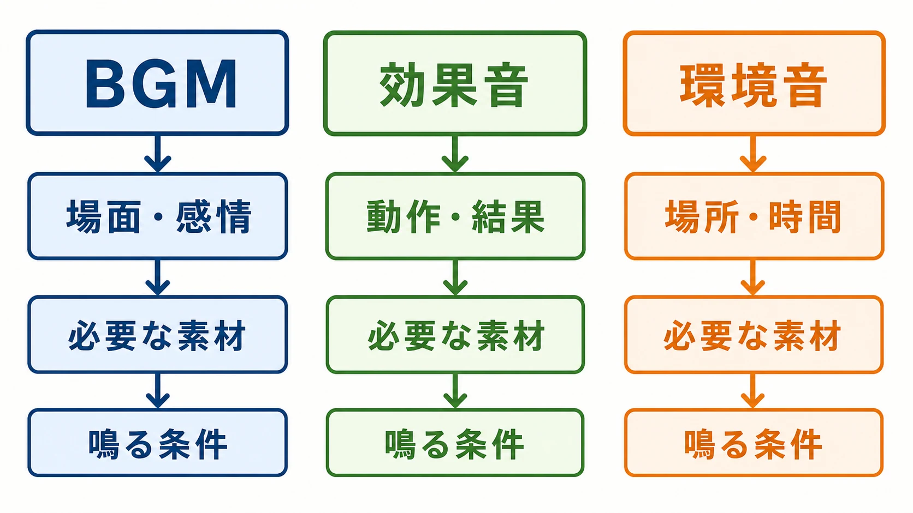
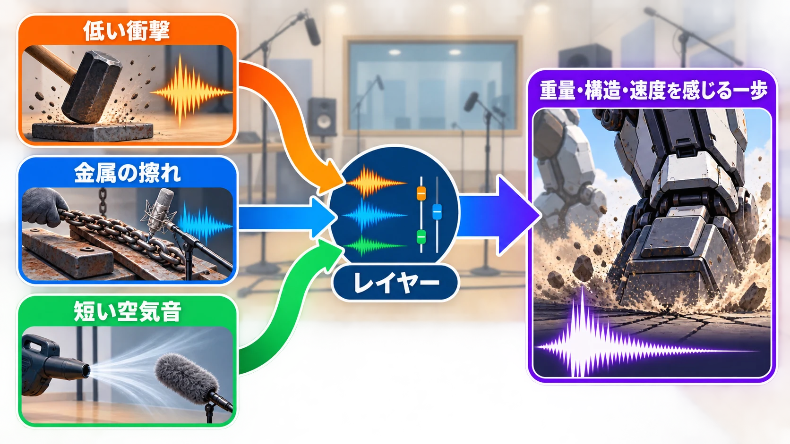
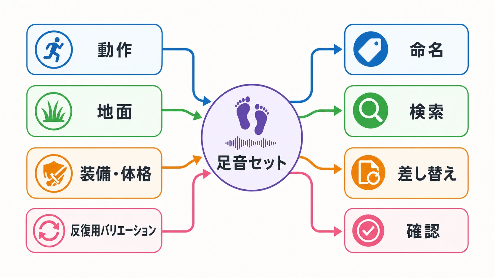
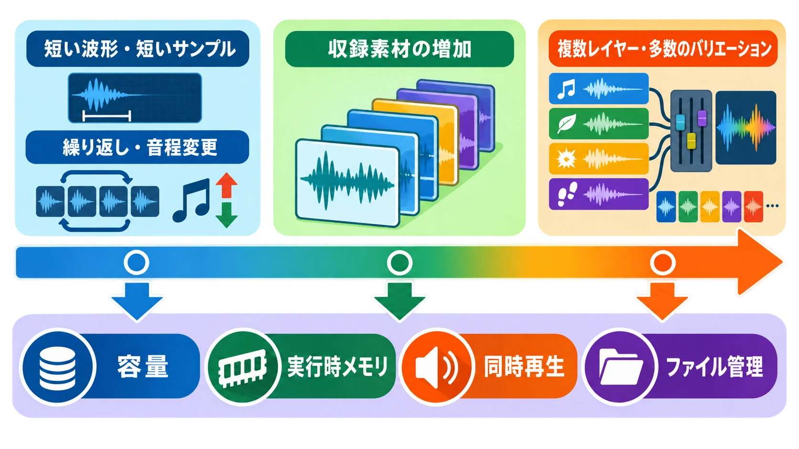
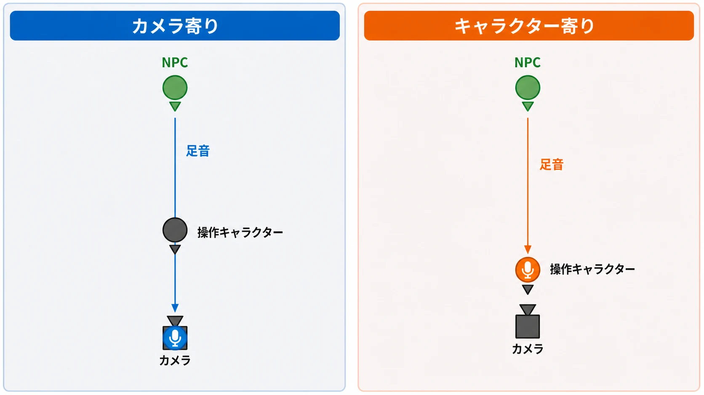

# ゲームの効果音・環境音はどう作られているか
### 「聞き流している音」の裏にある実務

ゲームの中では、歩けば足音が鳴り、風が吹けば木々がざわめき、機械は金属らしく動く。あまりに自然なので、プレイヤーはその大半を意識せずに聞き流している。

ところが、その自然さを作る現場は驚くほど人工的である。『ファイナルファンタジーXIV』では、祖堅正慶氏が足音だけで「1万近く」ファイルがあると説明している。PlayStation Studiosのフォーリーアーティスト、Joanna Fang氏は、トイレの吸引カップをコンクリートへ打ちつけて馬の蹄を、ナイフとトルクレンチを組み合わせて銃器の作動音を作る。拳銃のホルスターへ筒状パスタを詰めれば、骨が折れる音になる。[[1](#ref-1)][[2](#ref-2)]

ここにあるのは、奇抜な小道具の面白さだけではない。どの素材を選ぶか、同じ動作へ何種類を用意するか、限られた容量へどう収めるか、どこに立つ人の耳として聞かせるか。ゲームの音は、こうした判断を積み上げた制作物である。

本稿ではDAWの操作やミキシング手法ではなく、効果音と環境音がどう発想され、作られ、管理されるかを追う。

***

## 第1章：BGM・効果音・環境音は別の仕事

### 音色ではなく「何を担当する音か」で分ける

ゲームのサウンドを考えるとき、まず役割を分ける必要がある。本稿ではボイスを脇に置き、BGM、効果音、環境音の三つを扱う。

| 種類 | 設計の起点 | 主な役割 | 制作時に必要な情報 |
| --- | --- | --- | --- |
| BGM | 場面、展開、感情 | 緊張、安心、期待など、場面の受け止め方を導く | どの状況で始まり、変化し、終わるか |
| 効果音 | 動作、衝突、操作結果、状態変化 | 何が起きたか、どれほど強いかを瞬時に伝える | 発生源、動作、材質、規模、再生頻度 |
| 環境音 | 場所、時間帯、天候、生態 | その場所に何があり、どんな空間かを感じさせる | 地域差、距離、密度、変化の周期 |

BGMは、場面の感情や時間の流れを受け持つ。任天堂の制作紹介でも、長さがプレイヤー次第で変わる場面ではループを考え、繰り返し訪れる場所では細かなフレーズの組み合わせによって毎回の展開を変える例が示されている。[[3](#ref-3)]

効果音は、攻撃が当たった、装置が動いた、扉が閉じたといった出来事を受け持つ。同じ攻撃でも、空振り、命中、無効ではプレイヤーへ伝える結果が違う。任天堂は、結果のパターンに応じて音を鳴らし分けることを効果音設計の例として紹介している。[[3](#ref-3)]

環境音は、風、鳥、波、雑踏、遠くの機械などを重ね、場所の状態を作る。データ上は効果音として扱われることも多いが、一度の出来事へ反応する音とは設計の起点が異なる。環境音の配置や3Dオーディオについては、既刊の[ゲームにおける環境音と3Dオーディオ](game-ambient-sound-and-3d-audio-planner-guide.md)で詳しく扱っている。本稿では、その手前にある素材制作へ焦点を当てる。

  

### 「音周りお願いします」では仕事が始まらない

三者を分けずに「この場面の音周りをお願いします」と発注すると、受け手は目的から推測しなければならない。曲が欲しいのか、操作の手応えが欲しいのか、空間の寂しさを埋めたいのかで、必要な人、素材、作業量、確認方法が変わるからである。

最低限、企画側は次の情報を渡す必要がある。

- **役割**：感情を導く、結果を知らせる、場所を感じさせる、のどれか
- **発生条件**：何が起きたときに鳴り、いつ止まるか
- **発生源と聞き手**：何が鳴っており、誰の位置から聞くか
- **反復頻度**：一度だけか、数秒ごとか、何時間も繰り返すか
- **優先順位**：同時に鳴る音の中で、何を聞き取らせたいか

複数の音が重なると、強い音や似た高さの音によって別の音が聞き取りにくくなる。これを **マスキング** と呼ぶ。専門的な処理方法を企画側が指定する必要はないが、「この警告音は戦闘中でも聞こえる必要がある」という優先順位は仕様である。『ファイナルファンタジーXIV』の制作解説でも、多人数の戦闘では効果音同士の優先順位を整理し、楽器や歌が同じ帯域へ重ならないように譲り合わせる話が紹介されている。[[4](#ref-4)]

***

## 第2章：「現実にない音」をどう作るか――フォーリーという実演の技

### 本物を録ることと、本物らしく聞かせることは違う

**フォーリー** とは、映像や動きに合わせて足音、衣擦れ、物を扱う音などを人が実演し、収録する技法である。現地へ出向いて自然や街の音を録るフィールドレコーディングに対し、フォーリーは制御された場所で、必要な動きと音の質感を演じる。セガのサウンド制作解説も、足音では靴と地面の材質による違いを録り分ける仕事としてフォーリーを紹介している。[[5](#ref-5)]

画面に巨大な怪物が映っていても、現実にはその足音を録れない。未来の銃、架空のロボット、魔法が鳴る正解も存在しない。そこで作り手は、対象の名前ではなく、音を構成する性質へ分解する。

- 重いのか、軽いのか
- 硬いのか、柔らかいのか
- 金属の細かな動きがあるのか
- 衝撃の直後に、破片や残響が続くのか
- 生々しく聞かせたいのか、親しみやすく聞かせたいのか

Fang氏の実演では、固形の木炭を踏んで雪の砕ける感触を作り、筒状パスタを入れたホルスターを潰して骨折の複雑な割れ方を作っている。素材の正体ではなく、鳴ったときに取り出せる性質を見ているのである。[[2](#ref-2)][[6](#ref-6)]

### 一つの音は、複数の素材でできている

**レイヤー** とは、役割の違う複数の音を重ね、一つの完成音にする考え方である。たとえば架空の大型機械なら、低い衝撃で重量を、金属の擦れで構造を、短い空気音で速度を伝えられる。どれか一つが「大型機械の本物の音」である必要はない。

カプコン公式の『ロックマン11』制作映像では、スタジオに集めた身近な道具や部品を鳴らし、ロボットの関節や動きへ当てる工程が紹介されている。収録音をそのまま使うのではなく、複数の素材を合わせ、作品の表現に合うよう整える。生々しいだけでは『ロックマン11』らしくならないため、聞き覚えのある質感や親しみやすい要素も足していく、という判断が見える。[[7](#ref-7)]

  

この工程の評価基準は、素材の由来を当てられるかではない。画面上の物体の重さ、速度、材質、感情が伝わるかである。現実に忠実な音より、プレイヤーがその瞬間に納得できる音のほうが、ゲームでは正解になる場合がある。

***

## 第3章：同じ音を鳴らし続けると「ロボットっぽくなる」

### 一回だけなら自然でも、十回続けば規則が見える

人間の歩行では、左右の足、踏み込む角度、体重の移動が毎回少しずつ変わる。ところがゲームで一つの足音ファイルを繰り返すと、波形がまったく同じ間隔で戻ってくる。プレイヤーは音の正体を意識しなくても、繰り返しの規則には気づく。自然な歩行ではなく、機械が一定周期で信号を出しているように聞こえてしまう。

『ファイナルファンタジーXIV』の解説では、同じ足音を繰り返すとリアルさが失われ、機械的に聞こえてしまうため、少しずつ異なる足音を十個ほど用意し、ランダムに鳴らす例が語られている。ここでいう **ランダマイズ** は、複数候補から再生する音を変え、規則的な反復を隠す方法である。[[4](#ref-4)]

候補を完全な無作為で選ぶだけでは、同じ音が偶然二回続くこともある。そのため、直前の音を候補から外す、全候補を一巡するまで重複させない、といった考え方も使われる。音響ミドルウェアWwiseの公式資料でも、同じ地面を歩くたびに異なる足音を選ぶ構成や、全候補を再生するまで重複を避ける方式が示されている。[[8](#ref-8)][[9](#ref-9)]

### 足音は「一種類」ではなく、条件の掛け合わせで増える

足音の必要数を数えるとき、「歩く音を一個」と置くことはできない。少なくとも、次の軸が候補になる。

- 歩く、走る、着地する、滑るといった動作
- 石、土、木、金属、水といった地面
- 靴、裸足、装備品といった身につけているもの
- 体格や重量による重さの違い
- 同じ条件内で反復を隠すための複数テイク

すべての組み合わせへ別ファイルが必要とは限らない。元の素材を共有し、音の高さや重さを調整できる場合もある。一方で、調整だけでは不自然になり、根元の素材から差し替える必要もある。

祖堅氏は『ファイナルファンタジーXIV』について、体型によって体重が変わり、足音の重さや高さも変わると説明している。共有できる素材は調整して使うが、それでは対応できない部分は元から替える。その積み重ねによって、足音だけで「1万近く」ファイルがあるという。個々のファイルは小さくしていても、長期運営の中で管理対象は膨らむ。[[1](#ref-1)]

  

量産とは、似た音を大量に作る作業ではない。必要な差を定義し、その差を検索でき、差し替えられ、ゲーム内で確認できる状態に保つ仕事である。プランナーが「足音一式」とだけ書けば、条件の抜けは制作終盤に発覚する。動作、地面、装備、体格、再生頻度を早い段階で洗い出すことが、音の品質だけでなく見積もりと進行を守る。

***

## 第4章：容量とファイル数の戦い

### 制約は音色だけでなく、作り方を決めてきた

初期のゲーム機では、短い波形や小さな楽器音を音源チップで鳴らす設計が中心だった。現在「チップチューン」と呼ばれる音楽の出発点には、矩形波などの単純な波形や、短いサンプルを限られた同時発音数とメモリで使う事情がある。制約は単なる音質の低さではなく、何をデータとして持ち、何を再生時の仕組みで補うかという設計思想を生んだ。[[1](#ref-1)]

『ファイナルファンタジーV』『ファイナルファンタジーVI』の時代を振り返る説明では、シンバルの長い余韻を丸ごと収録せず、ごく短い部分をサンプリングして繰り返し、音量を下げる仕組みで余韻のように聞かせる例が挙げられている。さらに祖堅氏は、昔のあるハードウェアでサウンドに使える容量が128KBしかなく、その中でオーケストラを鳴らす必要があったと説明している。[[1](#ref-1)]

家庭用ゲーム機の世代ごとの音源仕様は、既刊の[家庭用ゲーム機サウンドの歴史](console-game-sound-history.md)で整理している。ここで重要なのは、容量が少なかったという事実だけではない。短い素材を切り出す、繰り返す、音程を変える、再生時に形を作るという発想が、制約への回答だったことである。

### 大容量化は「全部を長く録る」ことを意味しない

現代は長い高品質素材も、多数のバリエーションも扱える。それでも、音声データには次の四つの負担がある。

| 負担 | 問題になること |
| --- | --- |
| 保存容量 | 製品へ収録する音声データ全体の大きさ |
| 実行時メモリ | その場ですぐ鳴らすために保持する量 |
| 同時再生 | 一度に重なる音の数と処理量 |
| ファイル管理 | 命名、検索、更新、差し替え、確認の手間 |

一つの完成音を複数のレイヤーへ分ければ、状況に応じて一部を変えたり再利用したりできる。その代わり、素材数と組み合わせは増える。足音を豊かにするためにバリエーションを増やせば、反復感は減るが、保存容量と管理対象は増える。品質を上げる選択が、そのまま別の負担を生むのである。

環境音では、長い録音を一つ流し続けることだけが答えではない。『ファイナルファンタジーXIV』の海辺の解説では、鳥の鳴き声を長い空気感ごと多数用意すると容量を使うため、短い鳴き声を複数用意し、鳴る位置と時刻をランダムにする方法が紹介されている。実際の鳥も同じ場所で同じ順番に鳴き続けるわけではない。短い素材と再生ルールの組み合わせが、容量を抑えながら自然さを作る。[[4](#ref-4)]

  

容量の判断は「圧縮して小さくする」の一語では終わらない。何度も鳴る短い音か、たまに鳴る長い音か。ランダム再生に何候補が必要か。複数の場面で素材を共有できるか。音声データ固有の使われ方を先に決めて、容量と自然さの交換条件を選ぶ仕事である。

***

## 第5章：「聞こえ方」も設計対象――仮想マイクという発想

### 音源の位置だけでは、聞こえ方は決まらない

ゲーム空間には音を出す物体があり、同時に、それを聞く位置がある。後者を理解するには、ゲーム内に見えないマイクが置かれていると考えると分かりやすい。ここでは、この聞き手の基準点を **仮想マイク** と呼ぶ。

三人称視点のゲームでは、仮想マイクをカメラへ置くか、操作キャラクターへ置くかで体験が変わる。

- **カメラ寄り**：画面に映る方向と音の左右が対応しやすい
- **キャラクター寄り**：キャラクターの背後にいる人物を、背後からの音として感じやすい

『ファイナルファンタジーXIV』の解説では、聞き手の位置をカメラ側とキャラクター側の間で変えられる設定が実演されている。キャラクター寄りなら、その背後を歩く人物の音は後ろから聞こえる。一方で、画面を基準に音を捉える人にはカメラ寄りが自然に感じられる。祖堅氏自身はカメラ寄りを好むとしつつ、感じ方に個人差があるためスライダーを用意したと説明している。[[1](#ref-1)]

**定位** とは、音がどの方向、どの距離にあるように感じるかである。暖炉へ近づけば燃える音が大きくなり、カメラを回せば左右の聞こえ方が変わる。収録素材を用意するときも、耳元で鳴る装備音なのか、部屋の奥で鳴る機械音なのか、広い屋外を満たす風なのかによって、必要な距離感が違う。[[1](#ref-1)]

  

ここで企画側が決めるのは、具体的な音響計算ではない。プレイヤーをカメラの位置へ置きたいのか、キャラクターの身体へ置きたいのか、重要な音をどの距離から認識させたいのかという体験上の基準である。仮想マイクは技術用語である前に、誰の耳でゲーム世界を聞かせるかという演出判断なのである。

***

## まとめ：自然に聞こえる音ほど、多くの判断でできている

ゲームの効果音と環境音は、現実の環境をそのまま録音して置いたものではない。吸引カップから馬の蹄を取り出し、パスタから骨折を作る素材選びがある。反復を隠すためのバリエーションがあり、足音だけで1万近くへ膨らむファイル管理がある。128KBへオーケストラを収めた時代から、多数のレイヤーを扱える時代まで、容量と再生方法の交換条件がある。そして最後には、カメラとキャラクターのどちらへ仮想マイクを寄せるかという、聞き手の設計がある。

一般のプレイヤーがこれらを意識せず遊べるなら、音はうまく働いている。しかし制作側は、聞き流すわけにはいかない。企画段階で最低限、次の問いへ答える必要がある。

- その音はBGM、効果音、環境音のどの役割を担うか
- 何の材質、重さ、速度、感情を伝えるか
- 何度繰り返され、どの条件でバリエーションが必要か
- 容量、メモリ、同時再生、ファイル管理のどこに負担が出るか
- 誰の位置を仮想マイクとして聞かせるか

ゲームの音は、画面へ後から添える飾りではない。素材選び、量産、容量制約、聞こえ方という無数の実務判断によって、プレイヤーが信じられる手触りと空間を作る仕事である。

## References

1. [【ゲームの音を作る仕事】サウンドディレクター達といくファイナルファンタジーの世界／ゲームさんぽ×FF14①][1] - スクウェア・エニックスの祖堅正慶氏らが、足音のファイル数、旧世代の容量制約、環境音の距離と定位、カメラ側・キャラクター側の聞き手位置を実演する動画。

2. [プレステのスタジオで働く、ゲーム効果音職人の仕事｜Obsessed｜WIRED Japan][2] - PlayStation StudiosのJoanna Fang氏が、吸引カップ、木炭、工具、パスタなどを使ったフォーリーを実演する動画。

3. [ゲームサウンドが出来上がるまで - 任天堂][3] - ゲーム内容から音楽と効果音を洗い出し、BGMの反復や効果音の鳴らし分けを設計してゲーム内で確認する制作工程。

4. [【細か〜い話】周波数のゆずり合い、嫌なコード進行、エフェクトの範囲指定etc／ゲームさんぽ×FF14②][4] - 音同士の優先順位、足音のランダマイズ、環境音を短い素材と位置・時刻のランダム化で構成する方法を紹介する動画。

5. [ゲームサウンドクリエーターの役割 - SEGA TECH Blog][5] - BGMと効果音の役割、フィールドレコーディングとフォーリー、実在音やシンセサイザーを組み合わせる制作工程の解説。

6. [The Squelchy, Messy Art of Video Game Sound Effects - WIRED][6] - Fang氏のフォーリー素材と用途を文章で整理したWIREDの取材記事。

7. [『ロックマン11』ゲームのつくりかた。#05番外編〜SE／効果音〜 - カプコン公式][7] - 身近な道具や部品を収録し、組み合わせと加工によってロボットの動きへ音を与える工程を紹介する動画。

8. [Defining the contents and behavior of Switch Containers - Audiokinetic Wwise Documentation][8] - 地面の種類ごとに足音を分け、同じ地面でも毎回異なる候補を選ぶ構成の公式資料。

9. [Creating Random Containers - Audiokinetic Wwise Documentation][9] - 候補の無作為選択、全候補を使うまで重複を避ける方式、直前の音を繰り返さない設定の公式資料。

[1]: https://www.youtube.com/watch?v=euqkJwbf8_0
[2]: https://www.youtube.com/watch?v=ZKM8CyrOP4g
[3]: https://www.nintendo.co.jp/jobs/introduction/sound/work02.html
[4]: https://www.youtube.com/watch?v=PQgD5L-Kkmg
[5]: https://techblog.sega.jp/entry/2018/06/25/100000
[6]: https://www.wired.com/story/obsessed-joanna-fang-god-of-war-sound-effects/
[7]: https://www.youtube.com/watch?v=sYQksQsVhNg
[8]: https://www.audiokinetic.com/en/public-library/2024.1.8_8893/?id=defining_contents_and_behavior_of_switch_containers&source=Help
[9]: https://www.audiokinetic.com/en/public-library/2024.1.4_8780/?id=creating_random_container&source=Help

----

この文書は、Perplexity、Claude、OpenAI Codex の3つのAIの支援を受けて著述されたものです。引用画像を除き、MIT License にて提供されています。
