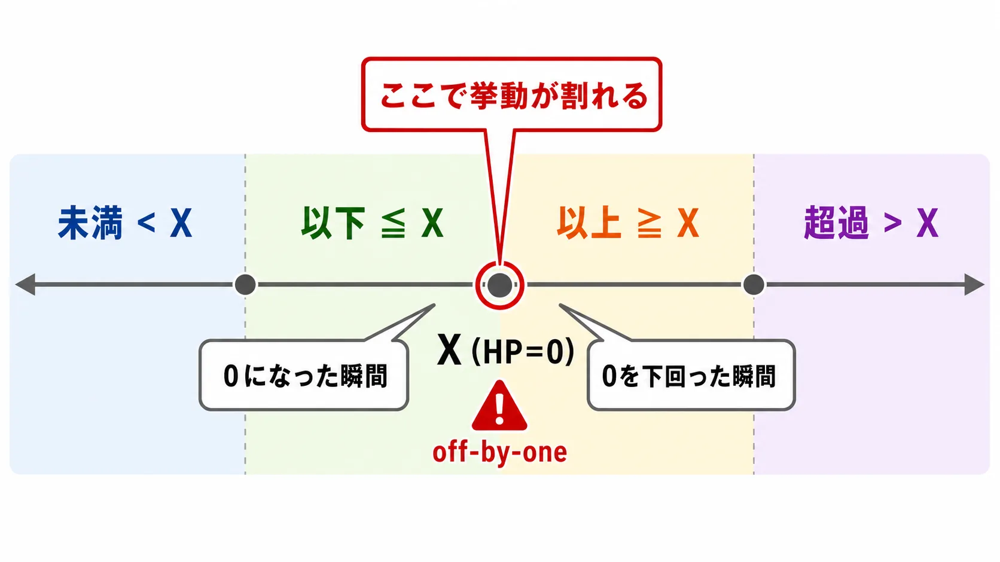
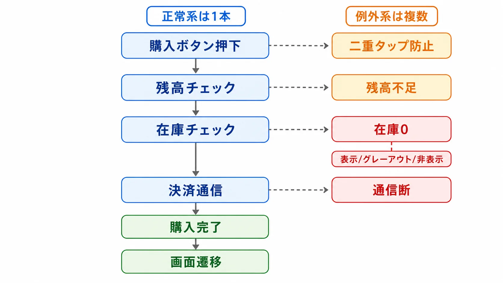
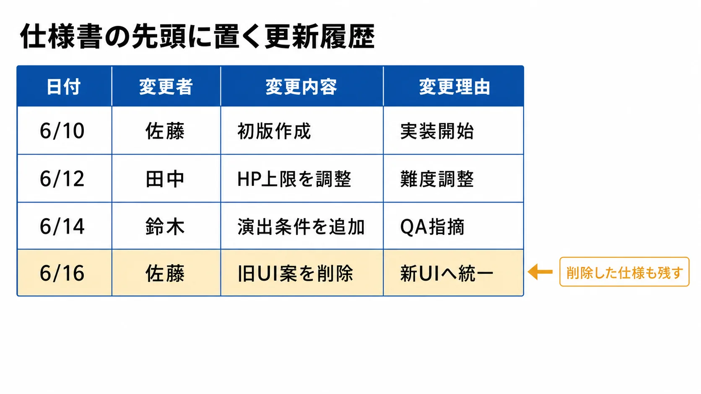
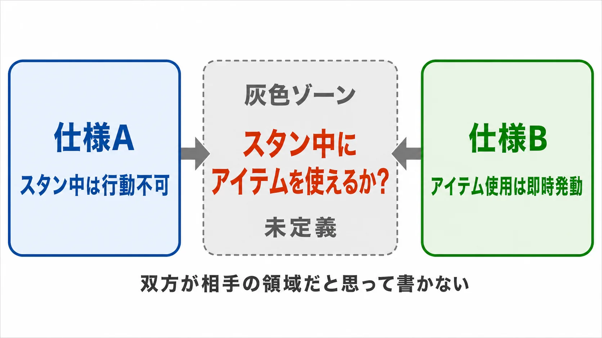

# 「実装後に炎上する仕様書」の共通点——曖昧さの解剖と、書ける仕様書の作り方

***

## はじめに

「仕様書通りに作ったのに、なんか違う」「こんなケースは想定していなかった」「実装してみたら仕様が矛盾していた」——ゲーム開発の現場でこうした言葉が飛び交うとき、その原因の多くは仕様書の書き方に根ざしている。

IPAの調査によれば、システム開発プロジェクトの約5割が何らかの問題を抱えており、その主因の一つが「要件定義の不備」や「仕様の認識ズレ」だ。ゲーム開発も例外ではない。新米プランナーが最初につまずくのは「仕様書をどのツールで書くか」ではなく、「何をどこまで書けばいいか」という問いだ。[[1](#ref-1)]

この記事では「実装後に炎上しやすい仕様書」に共通するパターンを7つに分類し、それぞれに対して具体的な対処法を示す。

***

## パターン1：「なんとなく動いてほしい」を書いている——目的の不在

最も根本的な問題は、**「何のためにその機能があるのか」が書かれていない** ことだ。

「ダメージを与える」「アイテムを拾う」「レベルアップする」——これらは動作の記述であって、**目的の記述ではない**。目的が書かれていないと、実装者は「書いてある通りの動き」を実現しようとする。しかし書いてある通りに作っても、プランナーが期待していたプレイヤー体験とはかけ離れた結果になることがある。[[2](#ref-2)]

仕様項目の冒頭に「この機能の目的」を1〜2行で書く習慣をつけるだけで、実装者が「なぜそういう動きをすべきか」を理解した上で作業できるようになる。目的が明記されていれば、「この実装方法では目的を達成できないのではないか」という建設的なフィードバックも生まれやすくなる。[[2](#ref-2)]

**悪い例**
> キャラクターはダメージを受けたとき点滅する。

**良い例**
> 【目的】プレイヤーが「ダメージを受けた」と瞬時に認知できるようにするため。  
> キャラクターはダメージを受けた瞬間から0.1秒間隔で5回点滅する。点滅は透明度50%と100%を交互に繰り返す。

***

## パターン2：「未満」と「以下」が混在している——境界値の地雷

数値を含む仕様書で最も頻発するミスが、**境界値の記述の曖昧さ** だ。[[3](#ref-3)]

「HPが0になったとき死亡する」——この一文は一見明確に見えるが、「0になったとき」はHP＝0の瞬間なのか、0を下回った瞬間なのかが不明だ。「100文字以内で入力できる」は101文字目を入力しようとしたときに何が起きるかが書かれていない。「3体以上の敵がいる場合に演出が発生する」は3体のときに発生するのか、4体以上のときに発生するのかが解釈によって割れる。

仕様書で数値を扱うときのルール：[[3](#ref-3)][[4](#ref-4)]

- 「未満（< X）」「以下（≦ X）」「超過（> X）」「以上（≧ X）」を意識して使い分ける
- **最小値・最大値・デフォルト値** を必ずセットで記述する
- 境界値で何が起きるかを明示する（例：「HP=0のとき死亡判定が発生し、即座に死亡アニメーションへ遷移する」）
- 入力できる文字列の最大長、数値の有効桁数も定義する

数値の最大値・最小値を決めるコストと、後から境界値バグを修正するコストを比べれば、前者が圧倒的に安い。[[4](#ref-4)]

***

## パターン3：「正常系しか書いていない」——例外ケースの不在

仕様書を初めて書くプランナーがやりがちなのが、**「うまくいった場合のフロー」だけを書いて終わり** にしてしまうことだ。

例えばアイテム購入フローの仕様書に「ボタンを押すとアイテムを購入できる」とだけ書いてある場合、以下のような問いがすべて未定義になる：[[5](#ref-5)]

- 残高が足りないときどうなるか？
- 購入中に通信が途切れたらどうなるか？
- 在庫が0のときボタンは表示されるか、グレーアウトされるか、非表示になるか？
- 二重タップしたら2回購入されてしまうか？
- 購入完了後に画面はどこへ遷移するか？

これらは「エラー系」「例外系」と呼ばれ、仕様書の中で最も抜け落ちやすい部分だ。エンジニアがこのような未定義の状態に遭遇したとき、開発中に善意で「こういうことだろう」と独自解釈して実装を進めることになる。それが後から「そういう動きは意図していなかった」という炎上につながる。[[5](#ref-5)][[6](#ref-6)]

仕様書を書く際は、**「この処理が失敗したとき/中断したとき/同時に起きたとき」を必ずセットで考える** という習慣を持つこと。機能仕様書のテンプレートには「正常系フロー」の隣に「例外フロー」の欄を必ず設けておくとよい。[[5](#ref-5)]

***

## パターン4：「プランナーの頭の中」だけにある仕様——口頭依存と暗黙知

「詳しくは口頭で説明します」「ニュアンスは前に話した通りです」——これは仕様書ではない。

ゲーム開発の現場では、担当プランナーが「喋れば説明できる」状態で仕様書を書き、その口頭説明を受けた実装者だけが正しく理解している、という状況が生まれがちだ。これが問題なのは：[[7](#ref-7)]

1. 後から参加したメンバーが文書だけでは理解できない
2. バグ発生時に「仕様書とにらめっこして原因を探す」ができない
3. 口頭説明の内容が時間の経過とともに変質・忘却される
4. リリース後に「これは仕様ですか、バグですか？」の問いが仕様書では答えられない

「書かれていない仕様はテストもできない」。QAエンジニアはテストケースを仕様書から作成するため、仕様書に記載のない挙動については原則としてテストが行われない。書かれていないことは確認されないまま本番を迎える、ということだ。[[8](#ref-8)]

仕様書は「その場にいなかった人間が、仕様書だけを読んで正しく実装できる」水準を目指して書くべきだ。[[9](#ref-9)][[10](#ref-10)]

***

## パターン5：「変更したけど仕様書は古いまま」——更新履歴の欠如

開発中に仕様が変わることは避けられない。問題なのは仕様が変わっても仕様書が更新されないことだ。

藤井厚志『プロフェッショナルゲームプランナー』をもとにした解説記事では、仕様書の中で最も重要なシートは更新履歴だと指摘されている。バグの原因は「最初から存在していたバグ」と「仕様変更で生まれたバグ」に大別でき、圧倒的に多いのは後者だという。「いつ・何を・どう変えたか」を更新履歴で追えれば原因究明が格段に速くなるため、更新履歴は「バグ対策の最前線」だと位置づけられている。[[11](#ref-11)]

更新履歴のない仕様書が引き起こす具体的な問題：[[2](#ref-2)][[7](#ref-7)]

- 「どのバージョンの仕様で実装されたか」がわからない
- 過去の判断の理由が失われ、「なぜこうなっているのか」がブラックボックス化する
- 仕様変更の影響範囲の確認ができない
- 新しく参加したメンバーが最新版を特定できない

実践的な対処法：
- 仕様書の先頭に更新履歴テーブルを置く（日付・変更者・変更内容・変更理由）
- SlackやIssueトラッカーの議論へのリンクを残す
- 「削除した仕様」も履歴として残す（なぜ削除したかを書く）

***

## パターン6：「他の仕様との相互作用」を考えていない——孤立した仕様書

一つの仕様書が単体では正しくても、他の仕様と組み合わせたときに矛盾や予期せぬ挙動を生む、というパターンがある。[[2](#ref-2)]

例えば「スタン状態のキャラクターは行動できない」という仕様と「アイテム使用はアクションではなく即時発動する」という仕様が独立して存在するとき、「スタン中のキャラクターがアイテムを使えるか」は誰も書いていない。このような「仕様の組み合わせによって生まれる灰色ゾーン」は、どちらの担当者も「相手の領域だ」と考えて書かないことが多い。

複雑なゲームでは、パラメータや状態間の依存関係をマップやチャートとして視覚化した **関係図（依存関係ドキュメント）** を仕様書とは別に用意することが有効だ。すべての仕様を頭の中で把握することには限界があるため、「この機能が影響するパラメータ・状態一覧」を仕様書に明記しておくだけでも、見落としは大幅に減る。[[2](#ref-2)]

***

## パターン7：「誰に読ませる仕様書か」を考えていない——読者の不在

仕様書の読者はプランナー自身ではない。プログラマー、デザイナー、QAエンジニア、場合によってはプロデューサーや外注先だ。[[2](#ref-2)][[9](#ref-9)]

読者を意識しないと起きること：[[9](#ref-9)]

- **ドキュメントの階層がない**：何がどこに書いてあるかわからず、毎回全文検索が必要になる
- **文字の塊**：箇条書き・表・見出しが使われず、読む気が失せる
- **読者が知っているはずの前提**：プランナーにとって「常識」でも、プログラマーにはゲームデザイン的な文脈が伝わらないことがある
- **プログラマーが知っているはずの前提**：「よしなにやっておいてください」が技術的に何を意味するかが書かれていない

仕様書の章立て・見出し・表・箇条書きは装飾ではなく **情報を処理しやすい構造に整える技術** だ。「書いた量が多い＝良い仕様書」ではない。6ページの仕様書に中身のない文が並ぶより、3ページの仕様書が具体的で読みやすい方が、実装者にとっては価値が高い。[[9](#ref-9)][[10](#ref-10)]

***

## 炎上する仕様書の共通点まとめ

| パターン | 典型的な表現 | 引き起こす問題 |
|---|---|---|
| 目的の不在 | 「〇〇する」という動作のみ記述 | 意図と異なる実装・品質不足 |
| 境界値の曖昧さ | 「〜以上」「〜になったとき」 | 境界バグ・Off-by-Oneエラー |
| 例外系の欠如 | 正常系フローのみ | エラー時の動作が実装者任せ |
| 口頭依存・暗黙知 | 「口頭で説明済み」「ニュアンスは前述の通り」 | 引き継ぎ不能・テスト漏れ |
| 更新履歴の欠如 | バージョン管理なし | バグ原因の特定困難・古い仕様での実装 |
| 相互作用の見落とし | 他仕様への参照なし | 仕様の組み合わせによる灰色ゾーン |
| 読者の不在 | 文字の塊・構造なし | 誤読・読まれない仕様書 |

***

## 「仕様書が読まれない」問題

最後に、構造的な問題として触れておきたいのが「そもそも仕様書が読まれない」現象だ。

開発が炎上状態になると、現場の士気が低下し、「より良いものを作ろう」という意識が薄れていく。その結果、仕様書の問題点を指摘するメンバーが減り、問題が表面化しないまま進行する。さらに「メスを入れることで上流の工程が遅れ、下流全体が遅れる」「チームの士気がさらに下がる」というリスク計算から、気づいても言わない選択をする人も現れる。[[12](#ref-12)]

この構造は仕様書の品質問題というよりも、チームのコミュニケーション問題だ。しかし、**仕様書が最初から明確で読みやすい状態** であれば、問題を発見したときの修正コストは小さく、「指摘するハードル」も低くなる。仕様書の品質はプロジェクト全体の心理的安全性にも影響する。

***

## プランナーが今日からできること

完璧な仕様書を最初から書こうとする必要はない。まず以下の5点を意識するだけで、炎上率は大きく変わる。[[4](#ref-4)][[7](#ref-7)][[10](#ref-10)]

1. **目的を1行書く**：「この機能の目的：〜」を仕様の先頭に入れる
2. **数値には最小・最大・デフォルトをセットで書く**
3. **正常系の次に「失敗したらどうなるか」を書く**
4. **変更したら更新履歴に1行追加する**
5. **書いた後に「この文書で実装できるか？」と自問する**

仕様書は「書き終わった瞬間に完成する」ものではなく、「実装が終わった瞬間に初めて検証できる」生きたドキュメントだ。丁寧さと根気こそが、仕様書品質を決める最大の要素である。[[7](#ref-7)]

---

## References

1. [システム開発で「仕様ズレ」を防ぐ方法｜発注者が押さえるべき5つのポイント][1] - IPAの調査を引用し、発注者の立場から仕様の認識ズレを防ぐ方法を解説。

2. [ゲームの仕様書に必要なコト｜mTsuruta][2] - ゲーム仕様書に盛り込むべき要素と考え方をまとめた記事。

3. [境界値分析とは？流れやおさえておきたいポイントをわかりやすく解説｜SHIFT][3] - 仕様条件の境界となる値とその隣の値をテストする「境界値分析」の解説。

4. [ゲーム開発時の仕様書や仕様作成者との関わり方｜Qiita][4] - 仕様書および仕様作成者とどう向き合うかを論じた記事。

5. [アプリ開発の仕様書には何を書く？初めてでも迷わない書き方｜Sun*][5] - 仕様書の種類・役割と、初心者向けの書き方の手順を解説。

6. [要件定義の失敗事例5選｜システム開発におけるトラブル｜Lychee Redmine][6] - 要件定義の不備が招くトラブルの代表的な失敗事例。

7. [デジタルゲームの仕様書の書き方｜さだまつひろゆき][7] - ゲーム仕様書の書き方を実務目線でまとめた記事。

8. [ゲーム開発に仕様書を求めるのは間違っているだろうか｜Qiita][8] - テストケースは仕様書をベースに作るため、記載のない機能はテスト対象外になるという指摘。

9. [Game Design Document Formatting: 5 Critical Mistakes That Make Your Docs Ignored｜KARA][9] - 仕様書が読まれなくなる書式上の典型的な失敗を解説（同内容が whalebraindesign.com にも掲載）。

10. [A Cheat Sheet to help you Avoid Problems with a Game Design Document｜Metapress][10] - ゲームデザインドキュメントの問題を避けるためのチートシート。

11. [ゲーム仕様書の書き方【プランナー直伝】概要仕様書から更新履歴まで｜GPC][11] - 藤井厚志（元コナミ、著書『プロフェッショナルゲームプランナー』）監修。更新履歴の重要性などを解説。

12. [おかしいと批難されているゲームの要素が開発内で指摘されない理由｜panke][12] - 炎上時に現場で問題が指摘されにくくなる構造的要因を論じた記事。

[1]: https://www.revcreate.co.jp/blog/development/p6117/
[2]: https://note.com/mtsuruta/n/n10d85462511c
[3]: https://service.shiftinc.jp/column/4792/
[4]: https://qiita.com/tamutamuta/items/05cc1ad19dd088cf29fd
[5]: https://sun-asterisk.com/service/development/topics/app-dev/6646/
[6]: https://lychee-redmine.jp/blogs/project/tips-definition-elements-failures/
[7]: https://note.com/sadamatsu/n/nb8fc79db026c
[8]: https://qiita.com/gomez_te/items/0db755dc32b3696c7552
[9]: https://www.karagamedesign.com/newsletter/gdd-formatting-mistakes
[10]: https://metapress.com/a-cheat-sheet-to-help-you-avoid-problems-with-a-game-design-document/
[11]: https://www.gpc.games/game-spec-writing/
[12]: https://note.com/panke/n/n26716d505f18

----

この文書は、Perplexity、Claude、OpenAI Codex の3つのAIの支援を受けて著述されたものです。引用画像を除き、MIT License にて提供されています。
