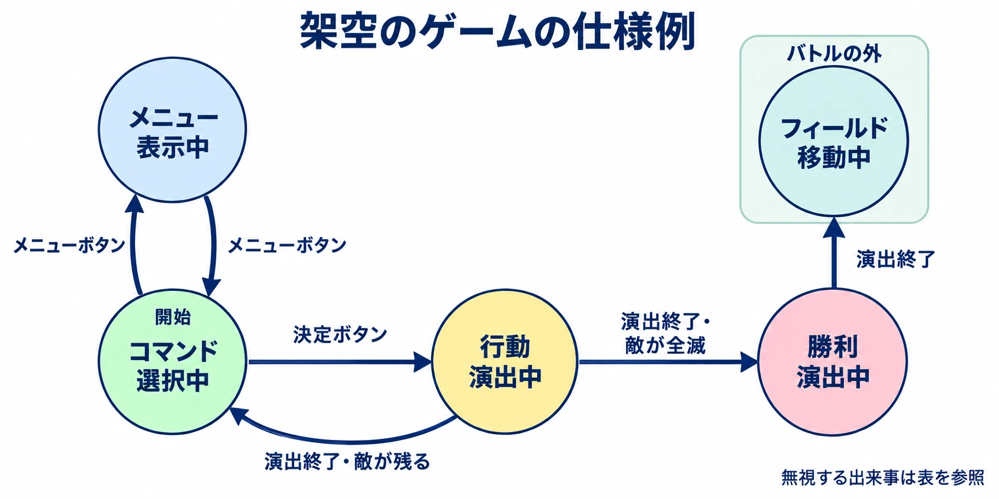

# 「いま何ができるか」を仕様にする――ゲームプランナーのための状態遷移入門

Nintendo Switch版『スーパーマリオRPG』の更新データVer.1.0.1（2023年12月13日）では、ゲームが進行しなくなる複数の不具合が修正された。キノコ城で戦闘後に次の戦闘がすぐ始まることを繰り返す症状や、メリー・マリー村のイベント中にマリオが驚いた姿のまま先へ進めなくなる症状が、その中に含まれている。[[1](#ref-1)]

任天堂の告知が示しているのは症状と修正内容であり、内部の原因は説明されていない。ここで注目したいのは、プレイヤーから見ると **「ある状態から抜け出せない」** と捉えられる点だ。戦闘を終えて移動へ戻る、イベントを終えて操作できるようになる。そのつながりが成立してこそ、ゲームは先へ進む。

仕様書の「バトル中はメニューを開けない」「ジャンプ中はしゃがめない」という一行も、このつながりの一部である。いま何をしていて、何が起きたら、次に何ができるようになるのか。それを整理するのが **状態遷移** という考え方だ。

本稿は「ゲームプランナーのためのコンピュータ科学」の第3回である。[ゲームの上限値](game-numeric-limits-for-planners.md)、[名前入力の決めごと](game-name-input-character-rules.md)に続き、今回はプレイヤーの操作・画面・ゲーム進行を扱う。目標は、自分の仕様書に「状態の一覧」と「状態×出来事の表」を書けるようになることだ。

***

## 1. 同じボタンでも、いまの状態で意味が変わる

「決定ボタンを押すと攻撃する」とだけ書くと、攻撃の演出中にもう一度押した場合が分からない。演出を飛ばすのか、次の攻撃を予約するのか、それとも無視するのか。決定ボタンの役割は、押された場面と組にして初めて決まる。

ここでは、三つの言葉を使う。

- **状態**：いま、どのような状況にいるか。「コマンド選択中」「行動演出中」など。
- **出来事**：変化のきっかけ。「決定ボタンを押した」「演出が終わった」など。
- **遷移**：出来事を受けて、ある状態から別の状態へ移ること。

たとえば「コマンド選択中に決定ボタンを押したら、行動演出中へ移る」と書けば、状態・出来事・移る先がそろう。「行動演出中の決定ボタンは無視する」と続ければ、演出中の操作も決まる。

決められた状態のうち一つにいて、出来事に応じて移る仕組みを、専門用語では **有限状態機械（FSM）** と呼ぶ。まずは「いまいる場所と、そこから移れる道を決めるもの」と考えればよい。[[2](#ref-2)]

敵の行動を整理する際にも使われる考え方だ。そちらに関心があれば、[敵AI設計の実務](enemy-ai-design-practices.md)で判断方式の選び方を扱っている。

***

## 2. オン・オフの印を足すと、矛盾した組み合わせも作れる

Robert Nystromの『Game Programming Patterns』「State」章には、横スクロールゲームの主人公へ動作を足していく例がある。最初はボタンを押すたびにジャンプさせるだけなので、空中でも繰り返し跳べてしまう。そこで「ジャンプ中か」というオン・オフの印、つまり **フラグ** を追加する。[[2](#ref-2)]

ところが、しゃがむ動作も加えると別の問題が出る。しゃがんでからジャンプし、空中で下ボタンを離すと、見た目だけ立ち姿へ戻ってしまう。さらに「しゃがみ中か」という印や入力条件を足しても、急降下攻撃を追加した際には、急降下中の再ジャンプを防ぐ条件が抜ける。章では、こうした修正と新しい不具合の連鎖が描かれる。[[2](#ref-2)]

この例のルールでは、ジャンプとしゃがみは同時に成立させたくない。しかし二つの印を別々に持つと、両方がオンの組み合わせも記録できる。それを防ぐ条件を、動作が増えるたびに漏れなく書く必要がある。

そこで現在の動作を「立ち」「ジャンプ中」「しゃがみ」「急降下中」のどれか一つとして持つ。同時に一つだけ選ぶ形なら、「ジャンプ中でもあり、しゃがみ中でもある」という組み合わせは作れない。[[2](#ref-2)]

プランナーにとっての判断軸は、 **その状態同士が、本当に同時に成立してよいか** である。「毒を受けている」と「ジャンプ中」は、ゲームによっては両立する。その場合は、体調と動作を別々に整理すればよい。一方、同時に成立させたくない動作は、一つの一覧から選ぶ形にすると意図が伝わりやすい。

「ジャンプ中はしゃがめない」も、ここまで分ければ具体的になる。ジャンプ中に下ボタンを押したら無視するのか、急降下へ移るのか。禁止事項の一行に、代わりに何が起きるかを書き足せる。

***

## 3. 演出を見ている間にも、状態がある

『Celeste』の開発者が公式に公開しているリポジトリのプレイヤーコードには、通常・登り・ダッシュなど、23の状態定数が定義されている。その中には、登場時の動作やカットシーンに使う状態も含まれる。[[3](#ref-3)]

興味深いのは、付属文書にある開発者自身の振り返りだ。登場演出用の状態群と「Dummy」という状態について、カットシーン用の別の存在に分け、通常のプレイヤーと入れ替えるべきだったと述べている。これは実装の分け方についての反省である。[[4](#ref-4)]

ここから仕様書へ持ち帰れるのは、 **演出中の操作と、演出終了後の戻り先も決める必要がある** という視点だ。プレイヤーから見て操作できない時間も、ゲームの進行を担う一つの状態である。

たとえば会話イベントなら、「移動は受け付けない」「決定ボタンで次の台詞へ進む」「最後の台詞が終わったら通常操作へ戻る」と書ける。スキップできるなら、スキップした場合も同じ戻り先へ進むのかを決める。「操作不可」と一括りにせず、受け付ける操作を出来事ごとに整理するわけだ。

通常操作へ戻る前に扉を開ける必要があるなら、その完了も戻る条件に含める。演出の見た目が終わる時点と、ゲームを再開してよい時点が一致するかを、ここで確認できる。

***

## 4. 小さなバトル画面を、表にしてみる

以下は説明用に作った **架空のゲームの仕様** であり、実在タイトルの仕様ではない。攻撃コマンドを決めると行動を演出し、敵が残っていれば次のコマンド選択へ、全滅していれば勝利演出へ進む場面を考える。敗北や逃走などは、この見本の範囲には含めない。

### まず、状態の一覧を書く

バトル中の画面を、次の四つに分ける。

- **コマンド選択中**：次の攻撃を決める。メニューを開ける。
- **行動演出中**：決めた攻撃の演出を見る。ボタン操作は受け付けない。
- **勝利演出中**：勝利の演出を見る。ボタン操作は受け付けない。
- **メニュー表示中**：操作説明を読む。メニューボタンでもう一度閉じる。

この例のメニューは、操作説明を見るだけの簡単なものとする。バトル開始時の状態は「コマンド選択中」。勝利演出を終えると、バトルの外にある「フィールド移動中」へ戻る。

### 次に、状態×出来事を埋める

縦にいまの状態、横に出来事を並べる。各マスには、移る先の状態か「無視する」を書く。条件によって行き先が変わるマスには、その条件も添える。

| いまの状態 | 決定ボタンを押す | メニューボタンを押す | 演出が終わる |
|---|---|---|---|
| コマンド選択中 | 行動演出中へ | メニュー表示中へ | 無視する |
| 行動演出中 | 無視する | 無視する | 敵が残る：コマンド選択中へ／敵が全滅：勝利演出中へ |
| 勝利演出中 | 無視する | 無視する | フィールド移動中へ |
| メニュー表示中 | 無視する | コマンド選択中へ | 無視する |

「無視する」は、その出来事によって処理を起こさず、いまの状態を保つという意味である。この見本では、無視した入力を後で実行するために予約もしない。「演出が終わる」は、現在の状態で再生している演出の終了を指す。

この表なら、「メニューを閉じる方法」や「敵を倒しきれなかった場合の戻り先」を一緒に読める。行動演出中のメニューボタンのマスが空いていたら、その瞬間に押された場合の仕様が未決定かもしれない。

**空欄は、抜け漏れを調べる入口になる。** 起きないと思っていた組み合わせでも、無視してよいのか、それを異常として扱うのかを確認する。すべてを反射的に「無視する」で埋めると、必要な処理まで消えてしまう。

### 図では、行き先と戻り道を見る

同じ内容を丸と矢印で描いたものが状態遷移図である。丸に状態名、矢印に出来事や条件を書く。表は出来事への対応を一マスずつ確かめやすく、図は状態同士のつながりを追いやすい。

***

## 5. プレイヤーが何も押さなくても、状態は変わる

### 着信やホーム画面への移動

スマートフォンでは、着信への応答や通知から別のアプリを開く操作、ホーム画面への移動などによって、ゲームを操作できる状態から離れることがある。仕様書の出来事には、ゲーム内のボタン以外も入ってくる。

Appleの開発者向け文書は、操作可能な状態を離れる際にデータを保存し、アプリの動作を静めるよう求めている。また、アプリの画面ひとつ分を「シーン」と呼び、バックグラウンドや実行を停止された状態にあるシーンは、システムが資源回収のためにいつでも切り離しうると説明している。[[5](#ref-5)]

そのため、「アプリに戻ったら続きが動く」とだけ書くと、どこから続けるかが残る。たとえば行動演出中に中断した場合、演出の途中から再開するのか、保存済みの結果をもとに演出終了後の画面へ進むのか。アプリを起動し直すことになった場合も含め、保存する区切りと再開する状態をそろえて決める必要がある。

ここで扱う「アプリの中断」は、先ほどのバトル画面全体に関わる出来事だ。通常操作の表へ詰め込みすぎるなら、中断時と復帰時の扱いを別の小さな表に分けてもよい。

### 通信が切れたあとにも、行き先がある

カプコンのNintendo Switch版『モンスターハンターライズ』FAQでは、マルチプレイのクエスト中に通信が切れると、そのプレイヤーはオフラインでクエストを続行すると説明されている。通信切断という出来事に対して、「オフラインで続行」という行き先が用意されている例だ。[[6](#ref-6)]

さらに、切断されたクエストへ合流し直すには、メニューの「クエストリセット」で一度里へ戻り、同じロビーへ移動して途中参加する。このとき、得たアイテムなどを放棄して受注前の状態へ戻る。クリアなど別の方法で里へ戻った場合は、同じロビーに移動しても、そのクエストへ途中参加できないとされる。[[6](#ref-6)]

「切れたら続行」と「合流し直すにはどこへ戻るか」は、別々の決めごとである。通信切断を仕様へ加える際にも、直後の行き先と、その後に選べる行動を続けて考えたい。

***

## 6. 最後に、どの状態からも抜け出せるかを確かめる

表のマスが埋まったら、状態ごとに出口をたどる。見本の「メニュー表示中」はメニューボタンで抜けられる。「行動演出中」は演出終了を待つ。「勝利演出中」は演出終了後にバトルの外へ出る。

ただし、 **出口が書いてあることと、その条件が成立することは別である。** 演出の終了をいつまでも受け取れなければ、表に矢印があってもそこへ進めない。

演出や通信を待つ状態については、予定どおりに終わらない場合も仕様にする。たとえば、所定の待ち時間を超えたら待機を打ち切り、説明を表示して、保存済みの区切りへ戻す方法がある。時間切れにする長さ、表示内容、強制的な戻し先、そのとき保持する進行を決めておく。戻した先で、同じ待機を繰り返すだけにならないかも確認する。

行動演出が止まったからといって、常にコマンド選択へ戻せばよいわけでもない。攻撃結果がすでに確定しているなら、その結果を保持した行き先が必要になる。どの時点まで完了したものとして扱うかを、エンジニアと共有したい。

終了画面のように意図して処理を終える状態なら、そこで終わると明記すればよい。出口の確認とは、すべてを循環させることではなく、 **待ち続ける状態と、意図した終わりを区別すること** である。

仕様書を見直すときは、次の四点から始められる。

1. **状態の一覧**：その画面や機能が取りうる状態と、最初の状態を書いたか。
2. **状態×出来事の表**：各マスに行き先や「無視する」を書き、条件による分岐も決めたか。
3. **出口**：各状態から抜ける手段と、待っている条件が成立しない場合の扱いを決めたか。
4. **中断後の戻り先**：中断・切断・起動し直しのあと、何を保持してどの状態へ戻るかを決めたか。

そして、その表を順にたどって操作を試せば、仕様と実際の動作を照らし合わせられる。「演出中にメニューを押す」「メニューを開いて閉じる」「中断して戻る」といった確認項目も、表から取り出せる。

「この間は操作できない」という一行の次に、「何が終われば、どこで操作を再開できるか」を書く。そこまでつなげることが、抜け漏れや抜け出せない状態を減らすための、プランナーの具体的な仕事になる。

## References

1. [任天堂「スーパーマリオＲＰＧ 更新データ」][1] — 任天堂サポート、2023年12月13日。Ver.1.0.1の「ゲームの進行に関する不具合の修正」を参照。

[1]: https://support.nintendo.com/jp/switch/software_support/a8lua/101.html

2. [Robert Nystrom「State」][2] — Game Programming Patterns、公開日記載なし（2026年9月24日確認）。冒頭の操作追加の例と「Finite State Machines to the Rescue」「Enums and Switches」を参照。

[2]: https://gameprogrammingpatterns.com/state.html

3. [Celeste開発チーム「Source/Player/Player.cs」][3] — GitHub、公開日記載なし（2026年9月24日確認）。NoelFB/Celesteの公開版に定義された0〜22の状態定数を参照。

[3]: https://github.com/NoelFB/Celeste/blob/master/Source/Player/Player.cs

4. [Celeste開発チーム「Source/Player/Readme.md」][4] — GitHub、公開日記載なし（2026年9月24日確認）。「States that shouldn't be states」を参照。

[4]: https://github.com/NoelFB/Celeste/blob/master/Source/Player/Readme.md

5. [Apple「Managing your app’s life cycle」][5] — Apple Developer Documentation、公開日記載なし（2026年9月24日確認）。操作可能な状態を離れる際の保存・動作抑制と、シーンの切り離しに関する説明を参照。

[5]: https://developer.apple.com/documentation/uikit/managing-your-app-s-life-cycle

6. [カプコン「マルチプレイのクエスト中に通信切断された後、まだプレイ中のクエストにもう一度合流したい」][6] — カプコン サポート、公開日記載なし（2026年9月24日確認）。Nintendo Switch版『モンスターハンターライズ』のFAQ。

[6]: https://www.capcom.co.jp/support/faq/platform_switch_monsterhunter_rise_0148425.html

----

この文書は、Perplexity、Claude、OpenAI Codex の3つのAIの支援を受けて著述されたものです。引用画像を除き、MIT License にて提供されています。
