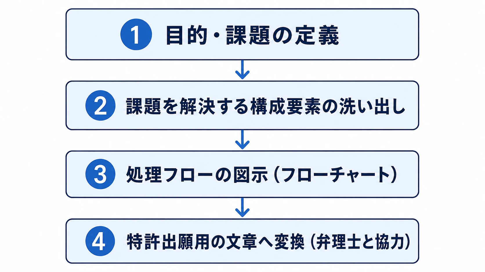

# ゲームシステムに関わる特許：プランナーが知るべき特許リスクと取得戦略

## はじめに：なぜゲームプランナーが特許を学ぶべきか

ゲームの特許とは、「新しく考えた遊びの仕組み（発明）を文章・図面で可視化し、財産として権利化したもの」である。著作権がキャラクターやストーリーといった「表現」を守るのに対し、特許権が守るのは「仕組み・処理の流れ」だ。ゲームプランナーがこの違いを理解しないまま開発を進めると、競合他社の特許を知らずに侵害してサービス停止や多額の賠償金を求められるリスクがある。[[1](#ref-1)][[2](#ref-2)]

一方で特許は、自社が苦労して生み出したシステムを守る強力な武器にもなる。新しい遊びのアイデアを思いついた段階から「これは特許になるか？」と意識することが、ゲームプランナーとしての重要なスキルになっている。[[3](#ref-3)]

***

## 第1章：ゲーム特許の基本ルール

### 特許になるもの・ならないもの

ゲームの要素すべてが特許の対象になるわけではない。以下の表に整理する。

| 要素 | 特許対象 | 理由 |
|------|----------|------|
| 情報処理の手順（バトルの計算フロー、マッチング処理） | ✅ 対象になりうる | 技術的な処理として評価される |
| 操作入力に応じた処理（タッチ操作、ジェスチャー認識） | ✅ 対象になりうる | 技術的構成として説明できる |
| ゲームのルール・遊び方そのもの | ❌ 原則対象外 | 自然法則を利用しない知的活動のルール |
| ストーリー・世界観・キャラクターデザイン | ❌ 著作権の範囲 | 特許ではなく著作権で保護 |
| 抽象的なゲームコンセプト | ❌ 対象外 | 技術として整理されていない |

重要なのは、「面白いアイデア」ではなく「技術的な処理の構成」に新規性があることだ。アイデアをフローチャートとして書き下し、その処理ステップに新しさがあれば特許化の余地が生まれる。[[4](#ref-4)][[3](#ref-3)]

### 特許侵害の判定ロジック

特許侵害とは、「特許に記載されたアイデアの構成要素をすべて採用していること」を意味する。言い換えると、特許の請求項に書かれた要素が1つでも欠けていれば、原則として侵害にはならない。これが設計回避の理論的根拠になる。[[1](#ref-1)]

逆に言えば、新しい要素を追加していても、元の構成要素をすべて満たしていれば侵害となる点に注意が必要だ。[[1](#ref-1)]

***

## 第2章：有名特許事例から学ぶ

### 事例1：スクウェアのATB（アクティブタイムバトル）システム

**特許番号：** 日本特許第2794230号・第3571207号

FFシリーズで有名なATBシステムは、日本のゲーム業界における最も歴史的な特許の一つだ。ターン制とは異なり「常に時間が流れ、キャラクターごとのゲージが満タンになったときに行動できる」というリアルタイム性が、ファイナルファンタジーIVで初出した。[[5](#ref-5)]

スクウェア（現スクウェア・エニックス）はこのシステムを特許化し、他社は特許期間中、同一システムを実装できなかった。同社はこの特許を取得するにあたり不服審判と分割出願も駆使しており、知財戦略の先進事例として業界で語り継がれている。ATBは日本でソフトウェア特許が認められるようになった先駆けとも位置づけられている。[[6](#ref-6)][[7](#ref-7)]

**ATBの核心となる構成要素（請求項の骨格）：**

1. キャラクターごとの時間計測手段がある
2. 計測完了後に行動が可能になる
3. 行動後に再計測が再開される

この3要素のうち1つでも変えれば、別のアイデアとして扱われる。これがATBに代表される「仕様変更による回避」の具体例だ。[[1](#ref-1)]

***

### 事例2：ナムコのロード中ミニゲーム特許

**特許番号：** US5718632A（日本：特許第2742394号）、1995年出願・2015年11月満了

ナムコ（現バンダイナムコ）が取得したこの特許は、「メインゲームのデータをロードしている間に、サイズの小さい補助ゲームプログラムを先に読み込んでプレイヤーが遊べるようにする」仕組みを保護するものだ。リッジレーサーのロード中にギャラクシアンが遊べた仕掛けがその実装例として知られる。[[8](#ref-8)][[9](#ref-9)]

この特許の存在により、他社はロード中にミニゲームを提供することができず、代替手段として「TIPS表示」「トレーニングモード（=メインコンテンツと同じ動作をするゲームなのでミニゲームではない、という言い訳が成立）」といった回避手法が普及した。特許は2015年11月27日に失効し、翌日からは他社もロード中ミニゲームを自由に実装できるようになった。[[10](#ref-10)][[11](#ref-11)]

**この事例から学べること：**
- 特許期間（出願日から最長20年）が終わった技術は誰でも使える「自由技術」になる[[12](#ref-12)]
- 期間中は、同じ目的を「別の技術的手段」で達成することで回避できる

***

### 事例3：コナミの壁半透明特許（現在は失効）

**特許番号：** 日本特許第2902352号

3Dゲームのカメラと自キャラクターの間に障害物（壁など）が入り込んだとき、その壁を半透明（透過）表示して自キャラクターを見えるようにする技術として広く知られた特許だ。1996年5月15日の出願から20年の存続期間を経て、2016年5月15日に満了している。特許期間中は他社がそのまま使えなかった。[[10](#ref-10)][[33](#ref-33)]

当時の業界では代替手段として以下が用いられた：[[10](#ref-10)]

- 「間に障害物が来ないようにカメラを設計する」（カメラポジションの制御）
- 「壁をワイヤーフレームで表示する」（描画スタイルの変更）
- 「カメラを自キャラの真後ろではなく肩口に置く」（構図自体の変更）

現在はこの特許が失効しているため、任天堂の別の特許（シルエット表示：特許第3637031号）が「障害物に隠れたキャラクターをシルエット表示する」仕組みを保護している。[[10](#ref-10)]

***

### 事例4：任天堂 vs コロプラ「ぷにコン」訴訟

**争点特許：** 任天堂特許第3734820号ほか5件、2017年12月提訴

白猫プロジェクトが採用する「ぷにコン」操作システム——画面上のどこにタッチしてもそこが仮想ジョイスティックの起点になり、指を動かした方向にキャラクターが動く——が、任天堂のタッチパネル操作特許を侵害するとして提訴された。任天堂は当初44億円の損害賠償を求めたが、2021年8月にコロプラが和解金33億円を支払うことで決着した。[[13](#ref-13)][[14](#ref-14)]

この訴訟は、「スマートフォンゲームで広く普及している操作体系であっても、特許を侵害していれば訴えられる」という事実をゲーム業界全体に知らしめた。ぷにコン特許の回避方法として、「ベクトルの起点をタッチ開始座標に固定するのではなく、一定時間ごとに現在タッチしている座標に更新する」という設計変更が有効とされている。[[10](#ref-10)]

***

### 事例5：任天堂 vs ポケットペア「パルワールド」訴訟（進行中）

**争点特許：** 日本特許第7545191号・第7493117号・第7528390号

2024年9月、任天堂とポケモン社がパルワールド開発元のポケットペアを特許権侵害で提訴した。注目すべきは、著作権侵害（キャラクターデザインの類似）ではなく、**ゲームシステムの特許侵害** が訴因である点だ。[[15](#ref-15)]

任天堂が主張する3つの特許侵害：

1. **モンスター捕獲メカニクス** ― フィールド上でアイテムを投擲して野生クリーチャーを捕獲し、成功率をUIで表示する仕組み[[16](#ref-16)]
2. **クリーチャーへの搭乗・乗り換え** ― オープンワールド内で生き物に騎乗し、別のクリーチャーに乗り換えられる仕組み[[17](#ref-17)]
3. **捕獲・召喚システム** ― 捕獲したモンスターをフィールドや戦闘に召喚する仕組み[[15](#ref-15)]

この訴訟では設計変更（仕様の変更）が一部実施されたが、**設計変更後も過去の侵害期間に対する損害賠償請求は継続される** という点が重要だ。早期の対処が不可欠な理由がここにある。[[15](#ref-15)]

2025年10月には日本特許庁が訴訟関連の特許申請の一つについて「進歩性がない」として拒絶理由通知を送付した。引用先行例にはARK、モンスターハンター4、ポケモンGO自身も含まれており、ゲームシステムの先行例（自由技術）が特許有効性争いの鍵になることを示している。[[18](#ref-18)][[17](#ref-17)]

***

### 事例6：EAのApex Legendsピングシステムとアクセシビリティ特許の無償開放宣言

**特許番号：** 米国特許（EA所有）

Apex Legendsの「ピングシステム」（音声なしでマップ上のポイントを指示・共有できる仕組み）はEAが特許を保有するが、2021年8月にEAはこの特許を含むアクセシビリティ関連の5件の特許を「ロイヤリティフリーで業界全体が使える」と宣言した。[[19](#ref-19)]

これは「特許を武器として使うのではなく、アクセシビリティの普及のために開放する」という異例の戦略であり、特許をCSR（企業の社会的責任）や業界連携の道具として使う可能性を示す好例だ。[[20](#ref-20)][[19](#ref-19)]

***

### 事例7：カプコン×バンダイナムコ クロスライセンス

カプコンとバンダイナムコエンターテインメントは、オンラインマッチングに関する特許についてクロスライセンス契約を締結した。両社が保有する特許を相互に使用できるようにすることで開発の自由度を高め、コスト削減にもつながる。ストリートファイターシリーズなどへの技術活用が目的だ。[[21](#ref-21)][[22](#ref-22)]

コロプラも2017年11月、カプコンとマルチプレイ関連特許のクロスライセンスを締結している（任天堂による提訴前の出来事である）。自社特許ポートフォリオを持つことがクロスライセンスの交渉力になるという実例だ。[[23](#ref-23)]

***

## 第3章：特許侵害への対応策と設計回避手法

ゲームプランナーが特許侵害の懸念に気づいたとき、取りうる手段は大きく3つある。[[1](#ref-1)]

### 手段①：仕様の変更（設計回避）

最も現実的な手段。特許の請求項に列挙された構成要素を1つでも変えれば、原則として侵害にならない。侵害している特許の内容を正確に把握するほど、効率的な変更案が出しやすくなる。[[1](#ref-1)]

**具体的な設計変更パターン（ゲームジャンル別）：**

| 対象特許 | 侵害が疑われる実装 | 有効な設計変更例 |
|---------|-------------|----------------|
| ぷにコン操作（任天堂） | 仮想スティックの起点をタッチ開始点に固定 | 一定時間ごとに起点を現在座標へ更新[[10](#ref-10)] |
| タッチチャージ攻撃（任天堂） | 長押しリリースで敵へ攻撃 | 敵方向ではなく移動方向へ攻撃[[10](#ref-10)] |
| スタミナ上限突破（セガ） | 上限超過分をそのまま加算 | 超過分を別スタック（別ゲージ）に保持[[10](#ref-10)] |
| リズムゲーム判定（コナミ） | 2つのアイコンが重なったタイミングで判定 | 片方のアイコン位置を固定する[[10](#ref-10)] |
| 壁半透明（コナミ・失効済み） | 障害物をそのまま半透明化 | ワイヤーフレーム表示・カメラポジション制御[[10](#ref-10)] |
| ロード中ミニゲーム（ナムコ・失効済み） | ロード中に独立したミニゲームを提供 | TIPS表示・トレーニングモードで代替[[10](#ref-10)] |
| ATB（スクウェア・失効済み） | キャラクターごとの個別時間ゲージ+行動 | 3要素のうち1つを変える（例：全体共通の1本ゲージ化）[[1](#ref-1)] |

> **設計変更の副産物：** 変更後に生まれた新しいアイデアが、新たに特許化できる可能性がある。プランナーにとって「問題解決の過程が発明の種」になる。[[1](#ref-1)]

***

### 手段②：自由技術の活用（先行例の立証）

特許の大原則として、「新規性のないアイデア」は特許として認められない。つまり、対象の特許が成立する以前に、同様の仕組みを持つゲームや技術が公知であれば、「自由技術（先行例あり）」として特許を無効にできる可能性がある。[[1](#ref-1)]

パルワールド訴訟でも、特許庁がARK、モンスターハンター4、ポケモンGO自身を先行例として挙げて特許申請を拒絶したことは、この手段の実効性を示す最新事例だ。[[24](#ref-24)][[18](#ref-18)]

活用のポイント：
- 問題の特許より前に公開されたゲーム・文献で「同様の仕組み」を探す
- 日本語圏だけでなく海外ゲームも調査対象に含める
- 開発中のゲームが特許を侵害していそうなら、J-PlatPatや特許無効審判の活用を弁理士と検討する[[25](#ref-25)]

***

### 手段③：特許ライセンス・クロスライセンス

権利者にライセンス料を支払って正規に使用する方法だ。売上の一定割合を支払う「ランニングロイヤリティ」や、一括払いの「一時金」などの形態がある。[[1](#ref-1)]

自社も有用な特許を保有している場合は、**クロスライセンス**（相互に使い合う契約）という選択肢が生まれる。カプコン×バンダイナムコ、コロプラ×カプコンの事例が示すように、特許ポートフォリオは「交渉のカード」にもなる。[[21](#ref-21)][[23](#ref-23)][[1](#ref-1)]

***

## 第4章：特許を「取る側」になる ― 出願の手順と注意点

ここまで見てきたのは、主に他社特許を踏まえて「侵害しない」ための考え方だった。しかしゲームプランナーにとって特許は、避けるべきリスクであるだけでなく、自社が生み出した仕組みを守り、将来の交渉力を高めるための資産にもなる。ここからは視点を反転させ、企画や仕様の中から特許になりうる発明を見つけ、出願につなげるための実務的な流れを整理する。[[2](#ref-2)][[3](#ref-3)]

### ステップ1：先行技術調査（出願前に必須）

出願前の先行技術調査は最重要工程だ。出願後に同じアイデアの特許が先に存在していたと判明しても取り返しがつかない。[[26](#ref-26)]

- **J-PlatPat**（特許情報プラットフォーム、無料）でキーワードや出願人名、特許分類コード（FI/Fターム）で検索する[[27](#ref-27)]
- **Google Patents** でグローバル調査（英語キーワードでの同義語or検索も重要）[[28](#ref-28)]
- 「タッチパネル」だけでなく「タッチパッド」「タッチスクリーン」など同義語をor検索でカバーする[[28](#ref-28)]
- 調査で出てきた特許の請求項をフローチャートに分解し、自分の発明との構成要素を照合する[[28](#ref-28)]

### ステップ2：発明の技術的整理（プランナーの腕の見せどころ）

特許出願には「ゲームが面白い」の説明ではなく、「処理の手順と構成をどう実現するか」の技術的記述が求められる。[[4](#ref-4)]

**フローチャート化が起点になる：**

CEDEC 2017の講演では「楽しませる仕組み＝フローが書ける仕組み」と定義し、フローチャートを文章に落とし込むことで出願書類の核心が完成すると説明された。プランナーがゲーム仕様書でフローチャートを書く習慣は、そのまま特許明細書の素材になる。[[2](#ref-2)][[3](#ref-3)]

**権利範囲の広さのバランス：**

- 広すぎる記述 → 既存特許に抵触するリスクが高まる
- 狭すぎる記述 → 競合に容易に回避される
- 「少なくとも一つ」「所定の条件」など抽象度を上げる言葉を使うほど権利範囲が広がる[[2](#ref-2)]

最終的な文書化は弁理士に依頼するが、「どの構成要素が必要不可欠か」を判断するのはプランナー自身だ。[[2](#ref-2)]

### ステップ3：出願タイミングの管理

**最大の注意点：公開前に出願すること**

特許出願前にゲームをリリースしたり、学会・展示会で発明内容を公開してしまうと「新規性の喪失」が生じ、原則として特許を取れなくなる。[[29](#ref-29)]

ただし、「発明の新規性の喪失の例外規定」（2018年6月9日施行の改正特許法により、現在は公開から1年以内なら出願可能）が日本では適用できるため、意図しない公開があった場合は直ちに弁理士に相談する。[[29](#ref-29)][[32](#ref-32)]

**出願から登録までの流れ：**

| フェーズ | タイミング | 内容 |
|---------|-----------|------|
| 特許出願 | 任意のタイミング | 願書・明細書・請求項・図面を提出 |
| 出願公開 | 出願から1年6か月後 | 内容が自動的に公開（特許成立前でも） |
| 出願審査請求 | 出願から3年以内 | この手続きをしないと特許を取得できない[[12](#ref-12)] |
| 審査・拒絶対応 | 審査請求後1〜5年 | 審査官との書面でのやり取り |
| 特許登録 | 査定後30日以内に特許料納付 | 3年分の特許料（年金）を納付で権利発生[[12](#ref-12)] |
| 権利存続 | 出願日から最長20年 | 4年目以降は毎年特許料を納付[[12](#ref-12)] |

**コスト目安：** 出願から登録までのトータルコストは数百万円程度。自社製品の優位性維持のための投資として考えることが業界の一般的な認識だ。[[2](#ref-2)]

### ステップ4：出願後の注意点

- **分割出願の活用：** 元の出願に含まれる複数の発明を別々の特許として出願する手法。スクウェアのATBでも活用され、権利化の可能性を広げる[[6](#ref-6)]
- **実施していなくても権利は有効：** 特許権は、自社ゲームに実装していなくても保持できる。将来の実装案や代替実装まで明細書に記載しておくほど価値が高い[[30](#ref-30)][[31](#ref-31)]
- **他社の模倣への監視：** J-PlatPatでは競合他社の出願を定期的に確認できる。自社特許に類似した出願が出てきたら弁理士と早期に対応を検討する

***

## 第5章：ゲームプランナーのための特許チェックリスト

### 開発開始前（企画フェーズ）

- [ ] 新しいゲームシステム・操作方式を考案したらJ-PlatPatとGoogle Patentsで先行調査をする
- [ ] 競合タイトルが採用している特徴的なシステムは、その会社が特許を保有していないか確認する[[25](#ref-25)]
- [ ] 特許侵害のリスクがあると感じたら弁護士・弁理士に相談する（判断は専門家へ）[[25](#ref-25)]

### 開発中（仕様確定フェーズ）

- [ ] 新規性のある仕組みが生まれたら、即座に「特許になるか？」を自問しフローチャートで整理する
- [ ] 実装前に「同じ目的を別の技術的手段で達成できないか」を検討し、侵害リスクの高い実装を避ける
- [ ] 特許を取ると決めたら、社外公開・展示より先に出願する

### リリース前後

- [ ] 過去の特許侵害（リリース前の開発段階）も訴訟対象になりうる。設計変更は早いほど賠償額が抑えられる[[15](#ref-15)]
- [ ] 自社の重要な技術的差別化要素は特許出願し、競合に模倣されるリスクを下げる
- [ ] 自社特許ポートフォリオを積み上げ、将来のクロスライセンス交渉に備える[[1](#ref-1)]

***

## まとめ：特許はゲームプランナーの「もう一つの設計書」

特許の世界では、アイデアをフローチャートに落とし込み技術として説明する能力が核心を成す。これはゲームプランナーが日常的に行っている仕様書・フロー設計の作業と本質的に同じだ。[[3](#ref-3)]

「守る（侵害しない）」と「攻める（自社優位を確立する）」の両輪を意識することが、これからのゲームプランナーに求められる知財リテラシーだ。特許制度が存在するからこそ、クリエイターが新しいアイデアを考え続ける動機が保たれ、多様なゲームが生まれる。特許をコンプライアンスの「制約」としてではなく、ゲームデザインを深化させる「構造的思考のツール」として使いこなすことが、業界全体の発展につながる。[[1](#ref-1)]

---

## References

1. [【CEDEC2016】ゲーム業界における特許侵害とは何か？ 回避 ...](https://gamebiz.jp/news/167880) - 仮に特許を侵害していると判明した場合の対応として、(1)仕様の変更などの方法があると説明されている。

2. [【CEDEC 2017】ゲームの特許は難しくない！だれでもわかる ...](https://www.inside-games.jp/article/2017/08/31/109452.html) - CEDEC 2017の講演「だれでもわかる。超簡単！効果的なゲーム特許の取得方法」のレポート。

3. [［CEDEC 2017］ゲーム特許とはなにか？ 効果的な ...](https://business.4gamer.net/article/1709/17090503/) - 概要から特許申請の文章までの一連の流れが読み取れるレポート。

4. [個人のゲーム開発において特許で保護されるもの・されないもの](https://itip-law.com/game-tokkyo/%E5%80%8B%E4%BA%BA%E3%81%AE%E3%82%B2%E3%83%BC%E3%83%A0%E9%96%8B%E7%99%BA%E3%81%AB%E3%81%8A%E3%81%84%E3%81%A6%E7%89%B9%E8%A8%B1%E3%81%A7%E4%BF%9D%E8%AD%B7%E3%81%95%E3%82%8C%E3%82%8B%E3%82%82%E3%81%AE/) - 情報処理の方法やシステムの構成は特許で保護される可能性があると解説。

5. [アクティブタイムバトルシステム](https://ja.wikipedia.org/wiki/%E3%82%A2%E3%82%AF%E3%83%86%E3%82%A3%E3%83%96%E3%82%BF%E3%82%A4%E3%83%A0%E3%83%90%E3%83%88%E3%83%AB%E3%82%B7%E3%82%B9%E3%83%86%E3%83%A0) - ATBの概要・誕生の経緯・特許（第2794230号）・搭載作品などを解説。

6. [知財戦略の基本はFFのATB(アクティブタイムバトル)特許に ...](https://note.com/ponpoko_tanuki/n/nea6415de7096) - 特許2794230・3571207によりスクウェアがATBを独占的に搭載できたと解説。

7. [ゲーム「ファイナルファンタジー」が独自の世界観を守るために ...](https://shousei.jp/topics/16100501/) - ATBの特許取得は日本でソフトウェア特許が認められる先駆けとなったと説明。

8. [2015: The Year We Get Loading Screen Mini-Games Back](https://www.gamedeveloper.com/business/2015-the-year-we-get-loading-screen-mini-games-back) - ナムコのロード中ミニゲーム特許（1995年出願）が2015年に満了する経緯を解説。

9. [Recording medium, method of loading games program code means, and games machine](https://www.perplexity.ai/rest/file-repository/patents/US5718632A?lens_id=187-051-169-527-943) - 米国特許US5718632A（出願人：NAMCO）。補助ゲームに関する記録媒体・ロード方法・ゲーム機の特許。

10. [ゲーム制作において注意すべき特許 - manicreator.com](https://manicreator.com/articles/game-patents/) - ゲーム制作で注意すべき各社特許とその回避手法を紹介。

11. [The Loading Screen Game Patent Finally Expires](https://www.eff.org/deeplinks/2015/12/loading-screen-game-patent-finally-expires) - ナムコの「補助ゲーム」特許の満了と、先行例（Invade-a-Load等）を論じたEFFの記事。

12. [特許出願から登録までの流れは？](https://www.lhpat.com/software/patent/flow.html) - 特許査定後30日以内に3年分の特許料を納付すると特許権が発生すると解説。

13. [任天堂vsコロプラ特許侵害訴訟の経緯を分かりやすく解説](https://legalsearch.jp/portal/column/nintendo-patent-infringement-suit/) - 任天堂がコロプラに44億円の損害賠償を求めて提訴した経緯を解説。

14. [任天堂とコロプラの「白猫プロジェクト」特許権侵害訴訟で和解 ...](https://chizaizukan.com/news/4rHDMKGkD9m5osbBnXUpA5/) - 特許5件を巡り任天堂が2017年12月22日に提起、和解金33億円で決着したと報道。

15. [パルワールド特許訴訟から学ぶ｜ゲーム開発者が知るべき知 ...](https://ip-fellows.jp/patent-article/business-patent6/) - パルワールド特許訴訟で争点となった3件の特許や設計変更・特許無効化の論点を解説。

16. [『パルワールド』訴訟に見るゲーム業界の著作権保護の難し ...](https://patent-revenue.iprich.jp/%E4%B8%80%E8%88%AC%E5%90%91%E3%81%91/2669/) - 捕獲用アイテムを投げて捕獲成功を判定するメカニクスが争点であると解説。

17. [【海外の反応】任天堂が『パルワールド』関連特許で特許庁 ...](https://www.youtube.com/watch?v=H7IwnL5b0jE) - 任天堂のパルワールド関連特許が特許庁から拒絶理由通知を受けた件の解説動画。

18. [Nintendo's patent relevant to the Palworld case has been rejected](https://www.windowscentral.com/gaming/nintendos-palworld-case-japan-patent-office-rejects-claim-not-original-enough) - 日本の特許庁が任天堂の主要な特許クレームを新規性・進歩性の欠如で拒絶したと報道。

19. [EA will let devs use accessibility tech like Apex Legends ping system for free](https://www.gamedeveloper.com/programming/ea-will-let-devs-use-accessibility-tech-like-apex-legends-ping-system-for-free) - EAがApex Legendsのピングシステムを含むアクセシビリティ技術を無償開放すると報道。

20. [EA secures a patent for the Apex Legends Ping system and it's giving it away for free](https://www.gamesradar.com/ea-secures-a-patent-for-the-apex-legends-ping-system-and-its-giving-it-away-for-free/) - Apex Legendsのピングシステムを含む5件のアクセシビリティ特許を他社に無償提供。

21. [「ストリートファイター」シリーズなどのオンラインマッチング ...](https://www.capcom.co.jp/ir/news/html/170619.html) - オンラインマッチングに関する特許クロスライセンスをストリートファイター等に活用（カプコン公式）。

22. [カプコンとバンダイナムコ，オンラインマッチングの特許クロス ...](https://www.4gamer.net/games/999/G999905/20170619049/) - カプコンが2017年6月19日にバンダイナムコとオンラインマッチング特許のクロスライセンスを締結。

23. [カプコンと特許クロスライセンス契約を締結 ～IP活用戦略を ...](https://colopl.co.jp/news/info/2017112801.php) - コロプラが2017年11月28日にカプコンとマルチプレイ分野の特許クロスライセンスを締結（コロプラ公式）。

24. [BREAKING! Nintendo's Palworld Lawsuit Just GOT REJECTED!](https://www.youtube.com/watch?v=8FqWe0OmqVU) - 2025年10月下旬に特許庁が拒絶理由通知を出した件を扱う動画。

25. [ゲームの開発にかかわる著作権・特許権を弁護士が解説！ ...](https://gamemakers.jp/article/2024_12_10_87869/) - ゲームの著作権・特許権の考え方、警告書が届いた場合の対応などを弁護士が解説。

26. [自分で特許出願する方法](https://www.koyamapat.jp/patent_link/) - 特許出願では権利化を目指す場合、出願日から3年以内に出願審査請求が必要と解説。

27. [J-PlatPatを用いた特許調査方法](https://nakajimaip.jp/tokkyochosa/) - 特許庁（INPIT）が提供するJ-PlatPatを用いた特許調査の手法・テキストを紹介。

28. [【CEDEC 2018】難解な”特許”の簡単な「読み方」と「探し方」 ...](https://gamebiz.jp/news/218889) - バンダイナムコ登壇の講演「開発者向けの、簡単特許調査方法」のレポート。

29. [特許制度の概要 赤澤特許事務所【京都市】](http://www.tokkyo.ne.jp/pat.html) - 特許査定後に3年分の特許料を納付することで特許権が設定登録されると解説。

30. [今のゲームの特許権は強すぎる？～「パルワールド」特許訴訟 ...](https://toreru.jp/media/patent/8448/) - 先行作品の要素を取り入れる慣行と、巨大企業の特許保有を巡る論点を解説。

31. [ゲーム会社の知財部が求める理想の特許事務所 およびゲーム ...](https://jpaa-patent.info/patent/viewPdf/4279) - 実装予定がなくても将来の実装やベストモードの代替案まで明細書に反映させる重要性を論じる。

32. [発明の新規性喪失の例外期間が6か月から1年に延長されます（特許庁）](https://www.jpo.go.jp/system/laws/rule/guideline/patent/hatumei_reigai_encho.html) - 平成30年改正特許法第30条が2018年6月9日に施行され、同日以降の出願に新規性喪失の例外期間1年が適用される。

33. [コナミの「俯瞰視点で壁を透過表示する特許」が期間満了（AUTOMATON）](https://automaton-media.com/articles/newsjp/konami-camera-work-patent-was-expired/) - コナミが取得していた壁・床を透過してキャラクターを表示する特許が、2016年5月15日付で存続期間を満了した。

----

この文書は、Perplexity、Claude、OpenAI Codex の3つのAIの支援を受けて著述されたものです。引用画像を除き、MIT License にて提供されています。
