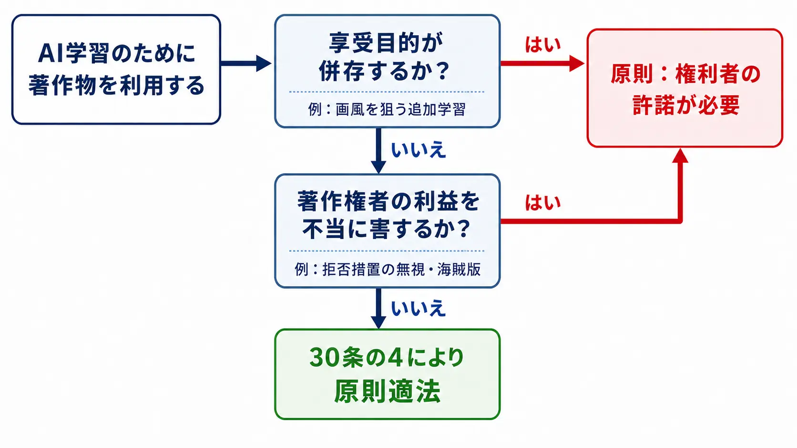
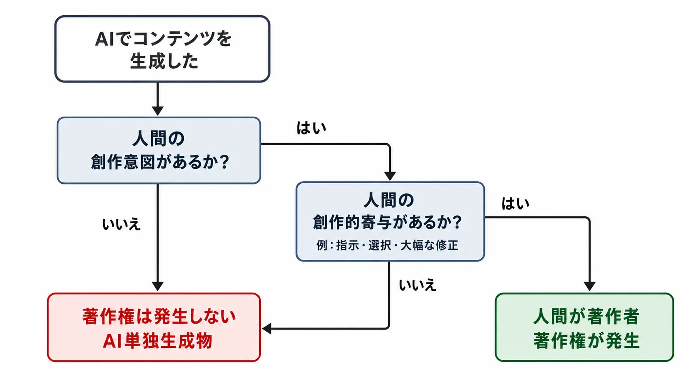
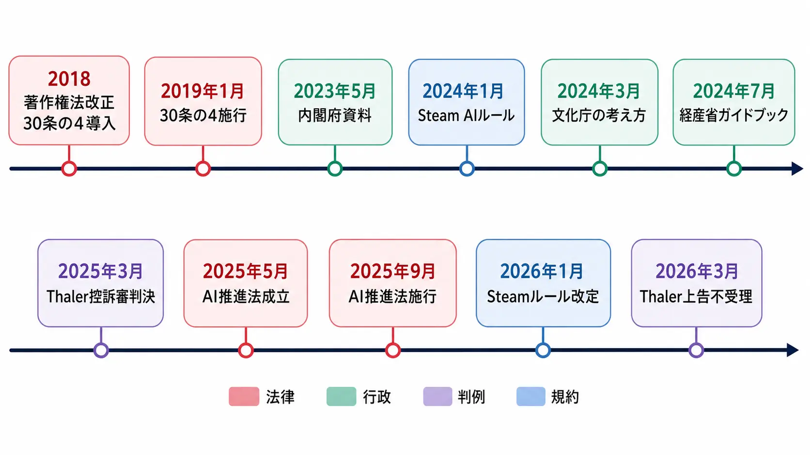

# 生成AIと著作権法 ― ゲーム業界の実務論点ガイド

> **注意：** 本記事は法的助言ではありません。個別の企画・運用に関する法的判断は、必ず弁護士または自社の法務部門にご確認ください。法令、行政の考え方、判例、各サービスの利用規約は改正・更新されることがあるため、実装時点の最新版をご参照ください。

***

## はじめに ― なぜゲーム業界にとって重要なのか

生成AIはゲーム開発の現場を急速に変えつつある。2024年後半以降、国内の大手ゲーム会社が生成AI活用の事例を相次いで公表するようになった。セガは法務・情報セキュリティ部門と部門横断のタスクフォースからなる「生成AI委員会」を設置し、2024年4月に社内ガイドラインを公開した。[[1](#ref-1)] Cygamesはバグ報告やSNS分析ツールを大規模言語モデルで内製する取り組みを公開している。[[2](#ref-2)] 一方、任天堂は2026年6月の株主総会で、生成AIについて「よりクリエイティブなこともできるが、知的財産権に関する問題等も有していると認識している」と述べ、独自の開発ノウハウで培ってきた価値を今後も届けていくとの立場を示すにとどめており、生成AI利用の可否そのものは明言していない。[[3](#ref-3)] 業界内のスタンスは一様ではない。

こうした技術革新の背景で、実務担当者が最も頭を悩ませるのが著作権との向き合い方だ。「AIに画像を学習させてもいいのか」「生成された素材は誰のものか」「ツールの利用規約に何が書いてあるか」――これらはゲームプランナーが日常業務で直面する問いになっている。本稿では、日本の法制度を軸に、ゲーム業界固有の文脈を加えて整理する。

なお、本稿は、生成AIの出力物に対するプレイヤーの受容・反発や、作品評価をめぐる議論は取り上げない。これらは開発・運営上の重要な論点だが、コミュニティの文脈や作品ごとの差異を踏まえた別の検討を要するためである。本稿では論点の混同を避け、著作権と契約、開発現場における権利処理に範囲を限定する。

***

## 1. 大前提 ― 「学習段階」と「生成・利用段階」で考え方が異なる

生成AIと著作権の問題は、フェーズを二つに分けて考えることが出発点になる。

| フェーズ | 主な行為者 | 適用される主要論点 |
|---------|-----------|------------------|
| AI開発・学習段階 | AI開発者・ゲーム会社の技術チーム | 著作権法第30条の4（情報解析の権利制限） |
| 生成・利用段階 | ゲームプランナー・アーティスト・パブリッシャー | 類似性・依拠性による侵害判断、著作物性の有無 |

この二分論は、内閣府が2023年5月に公表した資料 [[4](#ref-4)] 以来、文化庁も一貫して示してきた指針である。[[5](#ref-5)] たとえば「AIにゲームグラフィックを学習させる行為」と「AIが生成したキャラクターアートをゲームに収録する行為」は、それぞれ異なる法的ルールの下で評価される。混同すると判断を誤るため、まずこの枠組みを押さえておく必要がある。

***

## 2. 著作権法第30条の4 ― 学習段階の「原則OK」ルール

### 条文の骨格

著作権法第30条の4は、2018年の著作権法改正で導入された「柔軟な権利制限規定」の中核であり、2019年1月1日に施行された。[[6](#ref-6)] 簡単に言えば、著作物を鑑賞（享受）する目的でなければ権利者の許諾なしに著作物を利用できるという内容で、AIの機械学習はこの「情報解析」に該当するとされている。[[7](#ref-7)]

ゲーム会社がAI開発のために大量のCGイラストや音声データを学習データとして取り込む行為は、原則としてこの規定の下で適法となる。日本が諸外国に比べてAI開発に有利な法環境にあると評されることが多いのは、この条文が根拠になっている。

### 「原則OK」の例外 ― 2つのただし書き

ただし、無制限ではない。以下の場合は30条の4が適用されず、権利者の許諾が必要になる。

- **「享受目的」が併存する場合：** 特定クリエイターの画風を出力させるために、そのクリエイターの作品を意図的に大量学習させるケース。文化庁の「考え方」も、享受目的が一つでも併存すれば30条の4は適用されないと明示した。[[5](#ref-5)]
- **「著作権者の利益を不当に害する」場合：** 学習データの収集・利用態様が権利者市場を破壊する場合。技術的な収集拒否措置を無視した利用、海賊版コンテンツを学習データに用いる場合などが該当しうる。[[8](#ref-8)]

### ゲーム業界での実務的含意

ゲーム開発で問題になりやすいのは、競合他社のキャラクターアートを大量収集してLoRAモデルを作成する、特定のクリエイターの作風を再現するための意図的学習といったケースだ。これらは享受目的が明白に認定されやすく、30条の4の保護外になるリスクが高い。一方、自社IP内のデータのみで学習する、あるいはパブリックドメインや許諾済みデータセットを使用する方針は、法的リスクを大幅に低減する。

***

## 3. AI生成物の著作物性 ― 「誰が作ったか」が鍵

### 原則：AIには著作権が発生しない

日本の著作権法は、著作物を「思想又は感情を創作的に表現したもの」と定義し（著作権法第2条第1項第1号）、著作者を「著作物を創作する者」としている。[[7](#ref-7)] AIそのものは思想も感情も持たないため、AIが自律的に生成したコンテンツには原則として著作権は発生しない。[[5](#ref-5)]

これは文化庁の公式見解であり、米国の司法判断とも方向性が一致する。米国では、AIが自律的に生成した作品の著作権登録を求めたThaler v. Perlmutter事件で、連邦控訴裁判所（DC巡回区）が2025年3月18日に「人間の著作者性が著作権保護の要件である」と判断し、[[9](#ref-9)] 2026年3月2日には連邦最高裁が上告を受理せず、この判断が確定した。[[10](#ref-10)] したがってゲーム会社がAI生成物をゲーム内に収録しても、その生成物自体に著作権保護はなく、他社が模倣しても原則として著作権侵害にはならない。

### 例外：人間の「創作的寄与」があれば保護される

逆に言えば、人間がAIを道具として使い、創作意図と創作的寄与の両方が認められる場合は、その人間が著作者となり著作権保護が生じうる。[[5](#ref-5)]

創作的寄与が認められやすい行為の例：

- 詳細なプロンプト設計と複数回の反復指示・選択
- AI出力への大幅な加筆・修正・リデザイン
- AI生成物を素材として人間がレイアウト・構成する行為

逆に「ボタンを一回押して出てきた画像をそのまま使う」ような場合、創作的寄与は認められにくい。ゲームプランナーの視点では、 **アーティストがAIをペンタブの代わりに使うレベルまで関与しているか** が著作物性の分岐点になる。

### ゲーム固有の問題：声優・キャラクターのパブリシティ権

生成AIがゲームに利用される際、著作権のほかにパブリシティ権も問題になる。音声生成AIで特定の声優の声を再現してゲームに利用する場合、著作権侵害とは別に、その声優のパブリシティ権（人格的・財産的利益）を侵害するリスクがある。ゲームでは声優のキャスティングが作品価値の一部をなすため、このリスクは特に大きい。[[11](#ref-11)]

***

## 4. 文化庁の考え方 ― 2024年「AIと著作権に関する考え方について」

### 文書の位置づけ

文化審議会著作権分科会法制度小委員会は2024年3月15日、「AIと著作権に関する考え方について」を公表した。[[5](#ref-5)] これは法的拘束力を持たないが、現時点での法解釈の指針として実務上非常に重要な文書であり、今後の裁判例の蓄積や立法論議に大きな影響を与える。

### 主要な整理ポイント

| 論点 | 文化庁の考え方の要旨 |
|------|-------------------|
| 学習段階の適法性 | 30条の4により原則適法。ただし享受目的の併存または権利者利益の不当侵害は例外 |
| 生成・利用段階の侵害判断 | 人間の著作権侵害と同様。類似性＋依拠性の両要件で判断 |
| AI生成物の著作物性 | AI自体は著作者にならない。人間の創作的寄与があれば当該人物が著作者に |

[[5](#ref-5)]

### 「類似性」と「依拠性」の実務的意味

生成・利用段階で著作権侵害が成立するには、 **類似性** （AI生成物が既存著作物の表現上の本質的な特徴を直接感得できるほど似ている）と **依拠性** （AIが当該著作物を学習していた）の両方が認められる必要がある。アイデアや「雰囲気が似ている」だけでは不十分で、具体的な表現の一致が問われる。[[5](#ref-5)]

ゲーム開発の現場では、AI生成のキャラクターデザインについて逆画像検索や類似性検出ツールを使って既存著作物との類似性を事前チェックすることが、リスク管理の基本実務として推奨されている。

***

## 5. 学習データの権利処理 ― 実務上の最大難所

### オプトアウト問題

現在の日本の著作権法では、権利者側にAI学習からオプトアウトする仕組みがない。ゲームクリエイターやイラストレーターが「自分の作品を学習させたくない」と主張しても、法的に拒否する手段が現行法では限られている。EUでは透明性義務や学習データの開示を求める仕組みの整備が進んでおり、日本でも同様の議論が高まっているが、2026年7月時点で立法化には至っていない。[[8](#ref-8)]

### インターネット上の海賊版・無断収集のリスク

スクレイピングで収集した画像を学習データに使う場合、それらが海賊版や無断アップロードされたゲームグラフィックである場合は、30条の4のただし書きにより違法になりうる。「ネット上にある画像は何でも学習に使える」という誤解は危険で、取得元の権利状況の確認が必要だ。[[8](#ref-8)]

### ゲーム会社の現実的な対応

主要ゲーム会社は以下のようなアプローチで権利リスクを管理している。

- **自社IP内データのみで学習：** 最もリスクが低い選択肢。
- **許諾済みデータセットの利用：** Adobe Fireflyは、Adobe Stock画像・オープンライセンスコンテンツ・一般提供コンテンツを学習に用いていることを公式に開示している。[[12](#ref-12)]
- **社内審査ガバナンス：** セガは「生成AI委員会」を設置し、法務・情報セキュリティ部門を含む横断審査フローを整備した。[[1](#ref-1)]

経済産業省が2024年7月5日に公表した「コンテンツ制作のための生成AI利活用ガイドブック」も、ゲーム・アニメ・広告産業向けに具体的な留意点を整理しており、社内ガイドライン作成の参考資料として活用できる。[[13](#ref-13)]

***

## 6. ツール利用規約の各論点 ― 契約で決まるグレーゾーン

法律だけでなく、各AIサービスの利用規約（ToS）が実務上の権利関係を大きく左右する。法律と規約が異なる場合、契約当事者間では規約が優先される点に注意が必要だ。

### 主要ツールの規約比較

| ツール | 生成物の著作権帰属 | 商用利用 | 主な注意点 |
|-------|-----------------|---------|-----------|
| ChatGPT（OpenAI） | 入力・出力とも利用者側の権利として規約上整理されている | 可（規約・法令遵守の限り） | 既存著作物と類似した出力のリスクは利用者負担 [[14](#ref-14)] |
| Midjourney | 有料プランは商用利用ライセンスを取得できる。無料プランの生成物はMidjourney社が権利を保持し、利用者はCC BY-NC 4.0（表示・非商用）ライセンスを得るのみ | 有料プランのみ可 | 無料プランの生成物は「パブリックドメイン」ではない点に注意 [[15](#ref-15)] |
| Stable Diffusion（ローカル） | 利用者が管理するが、使用モデルの学習データに依存 | モデルライセンスによる | 使用モデルのライセンス（CreativeML Open RAIL等）を個別確認する必要がある [[16](#ref-16)] |

### 「商用利用可」≠「著作権侵害なし」

多くのツールが「生成物を商用利用してよい」と規約で認めているが、これはツール提供者との間の合意に過ぎない。生成された画像が第三者の著作物に類似していた場合、その第三者に対する著作権侵害は別途発生しうる。「規約でOKと書いてあるから全部合法」という誤解が現場でトラブルを招くことが多い。

### Steamの事例 ― プラットフォームが課す追加義務

プラットフォーム規約も重要だ。Valve社は2024年1月、Steamで配信するゲームにおけるAI生成コンテンツの取り扱いルールを整備した。事前生成コンテンツ（開発中にAIツールで作成した素材）と実行時生成コンテンツ（プレイ中にAIが生成するコンテンツ）を区分し、開発者に内容の開示を義務付けるとともに、「違法または権利侵害となるコンテンツを含まない」旨の誓約を求める仕組みになっている。開示内容の一部はストアページにも掲載され、プレイヤーがAI利用の実態を確認できるようにしている。[[17](#ref-17)] この仕組みにより、AI生成コンテンツを含むゲームの著作権侵害リスクは、実質的に開発者側が負う形になっている。なお2026年1月には、AIコードアシスタントのように開発効率化のみに使うツールを開示対象から除外するなど、規約がさらに整理された。[[18](#ref-18)]

***

## 7. ゲームプランナーのための実践チェックリスト

以上の論点を踏まえ、ゲームプランナーが業務でAIツールを使う際の確認事項をまとめる。

**①学習・開発フェーズ**

- [ ] 学習データの取得元を明確に記録しているか
- [ ] 使用データに享受目的（特定作家の画風を狙った収集等）が含まれていないか
- [ ] 海賊版・無断アップロードのコンテンツを使っていないか
- [ ] 社内の「生成AI利用ガイドライン」に沿った申請・承認フローを経ているか

**②生成・制作フェーズ**

- [ ] 使用するAIツールの利用規約（商用利用可否・著作権帰属）を確認したか
- [ ] 生成物と既存著作物の類似性チェック（逆画像検索等）を実施したか
- [ ] 人間による創作的寄与（加筆・修正・選択）が十分あるか（著作物性の担保）
- [ ] 声優・キャラクターのパブリシティ権への影響を確認したか

**③リリース・配信フェーズ**

- [ ] 配信プラットフォーム（Steam等）のAI生成物に関する規約を確認したか
- [ ] AI生成アセットの利用を開示するか否かを社内で決定しているか（任意だが透明性の観点から推奨）
- [ ] 問題が発生した場合の対応フロー（法務・IP担当への報告ルート）を把握しているか

***

## 8. AI推進法と今後の展望

2025年5月28日、AIの研究開発・活用を包括的に推進するための基本法として「人工知能関連技術の研究開発及び活用の推進に関する法律（AI推進法）」が成立し、同年9月1日に全面施行された。[[19](#ref-19)] 内閣にAI戦略本部を設置し、AI基本計画の策定や、AIによる権利侵害事案の調査・分析を国の役割として位置づける枠組み法であり、罰則規定は設けられていない。著作権法そのものを改正するものではないが、AI政策全体の司令塔が明確になった意味は大きく、今後の著作権関連の運用にも影響しうる。

日本の著作権法は国際的にみてAI学習に寛容な制度設計だが、クリエイターからのオプトアウト要求や、諸外国に倣った透明性義務の導入を求める議論が続いている。法制度は今後数年で変化する可能性が高く、「現在は合法」が将来も続くとは限らない。

ゲーム業界固有の課題として残るのは、生成AIが既存IPのキャラクターや世界設定を模倣できてしまう問題だ。著作権法は「アイデア」を保護せず「表現」のみを保護するため（アイデア・表現二分論）、既存作品の作風を模したゲームをAIで量産するような行為への対抗手段は現状では限られる。ゲームIPの保護は、著作権・商標権・不正競争防止法など複合的な手段の組み合わせが必要になる。

プランナーとしての現実的な心構えは、 **ツールを使いこなす能力** と **法的リスクを見立てる知識** を同時に育てることだ。AIは強力なアシスタントだが、最終的な責任判断は常に人間側にある。

***

*本稿は2026年7月時点の公開情報・文化庁見解に基づく。法改正・新判例・ツール規約の変更によって解釈が変わる可能性があるため、重要な判断は法務担当者への相談を推奨する。*

## References

1. [「生成AI＝悪ではない」――セガ、ゲーム開発でAI活用するための取り組みを紹介 “安心安全”担う方法とは？][1] - セガが設置した「生成AI委員会」の体制（法務・情報セキュリティ部門、部門横断タスクフォース）と2024年4月のガイドライン公開を報じたITmedia記事。

2. [削減工数も丸裸──Cygames、LLM活用の最新状況を公開 バグ報告・SNS分析ツールを内製][2] - Cygamesがバグ報告・SNS分析ツールを大規模言語モデルで内製している状況を報じたITmedia記事。

3. [第86期定時株主総会 質疑応答（要旨）][3] - 任天堂の公式IR資料。生成AIに関する質問への古川俊太郎社長の回答（知的財産権上の課題認識、独自の遊びによる強み維持の方針）を収録。

4. [AIと著作権の関係等について][4] - 内閣府が2023年5月に公表した、AIと著作権に関する論点を学習段階・生成利用段階に分けて整理した資料。

5. [AIと著作権に関する考え方について][5] - 文化審議会著作権分科会法制度小委員会が2024年3月15日に取りまとめ、文化庁が公表した公式見解。

6. [著作権法の一部を改正する法律（平成30年法律第30号）について][6] - 文化庁による2018年著作権法改正（30条の4等の導入）の解説ページ。2019年1月1日施行を明記。

7. [著作権法（e-Gov法令検索）][7] - 著作権法第30条の4（情報解析のための権利制限）および第2条第1項第1号（著作物・著作者の定義）の条文本文。

8. [生成AIの開発・利用における著作権法上の問題][8] - 経済産業研究所（RIETI）のセミナー資料。オプトアウト、技術的収集拒否措置、海賊版データ利用に関する論点を整理。

9. [Thaler v. Perlmutter 判決文（米国連邦控訴裁判所DC巡回区）][9] - 2025年3月18日、AI単独生成物の著作権登録を認めず、人間の著作者性を要件と判断した控訴審判決の原文。

10. [Supreme Court Denies Certiorari in Thaler v. Perlmutter: AI Cannot Be an Author Under the Copyright Act][10] - 2026年3月2日の連邦最高裁による上告不受理と、控訴審判断の確定を解説する法律事務所の記事。

11. [「生成AI」は著作権を侵害するか？AI生成物に著作権は発生するのか][11] - 音声生成AIによる声優の声の再現とパブリシティ権侵害リスクを解説するゲーム業界専門メディアの記事。

12. [Adobe Fireflyを適切に活用するための著作権との付き合い方 第6回 生成AIの業務利用は（どこまで）可能か？][12] - Adobe公式ブログ。Fireflyの学習データ（Adobe Stock画像・オープンライセンスコンテンツ・一般提供コンテンツ）の開示を含む。

13. [「コンテンツ制作のための生成AI利活用ガイドブック」を公表しました][13] - 経済産業省が2024年7月5日に公表した、ゲーム・アニメ・広告産業向け生成AI活用ガイドブックの公式発表ページ。

14. [Terms of Use（OpenAI）][14] - OpenAIの公式利用規約。入力・出力に関する利用者側の権利の扱いを規定。

15. [Terms of Service（Midjourney）][15] - Midjourneyの公式利用規約。無料プランがCC BY-NC 4.0ライセンスの対象であり、著作権はMidjourney社が保持することを規定。

16. [CreativeML Open RAIL-M License][16] - Stable Diffusionで用いられるCreativeML Open RAILライセンスの公式文書（Hugging Face）。

17. [Steamworks Development - AI Content on Steam][17] - Valveが2024年1月9日に公表した、Steam配信ゲームにおけるAI生成コンテンツの開示・誓約制度に関する公式発表。

18. [Valve tweaks and clarifies AI disclosure rules for Steam][18] - 2026年1月のSteam AI開示ルール改定（AIコードアシスタントの開示対象除外等）を報じるゲーム業界専門メディアGame Developerの記事。

19. [AI法 全面施行 ― 次なるフェーズへ ―][19] - 内閣府による、AI推進法（2025年5月28日成立、同年9月1日全面施行）の全面施行を伝える公式発表。

[1]: https://www.itmedia.co.jp/aiplus/article/2507/24/1250724035/
[2]: https://www.itmedia.co.jp/aiplus/article/2507/29/1250729033/
[3]: https://www.nintendo.co.jp/ir/pdf/2026/qa2606.pdf
[4]: https://www8.cao.go.jp/cstp/ai/ai_team/3kai/shiryo.pdf
[5]: https://www.bunka.go.jp/seisaku/chosakuken/aiandcopyright.html
[6]: https://www.bunka.go.jp/seisaku/chosakuken/hokaisei/h30_hokaisei/
[7]: https://laws.e-gov.go.jp/law/345AC0000000048
[8]: https://www.rieti.go.jp/jp/events/24031801/pdf/03_ashidate.pdf
[9]: https://media.cadc.uscourts.gov/opinions/docs/2025/03/23-5233.pdf
[10]: https://www.bakerdonelson.com/supreme-court-denies-certiorari-in-thaler-v-perlmutter-ai-cannot-be-an-author-under-the-copyright-act
[11]: https://gamemakers.jp/article/2023_10_13_49893/
[12]: https://blog.adobe.com/jp/publish/2024/06/03/cc-firefly-generative-ai-and-copyright-risks-and-usecases
[13]: https://www.meti.go.jp/policy/mono_info_service/contents/aiguidebook.html
[14]: https://openai.com/policies/row-terms-of-use/
[15]: https://docs.midjourney.com/hc/en-us/articles/32083055291277-Terms-of-Service
[16]: https://huggingface.co/spaces/CompVis/stable-diffusion-license
[17]: https://store.steampowered.com/news/group/4145017/view/3862463747997849618
[18]: https://www.gamedeveloper.com/business/valve-tweaks-and-clarifies-ai-disclosure-rules-for-steam
[19]: https://www.cao.go.jp/press/new_wave/20251003.html

----

この文書は、Perplexity、Claude、OpenAI Codex の3つのAIの支援を受けて著述されたものです。引用画像を除き、MIT License にて提供されています。
