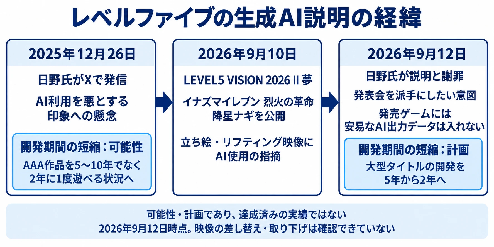
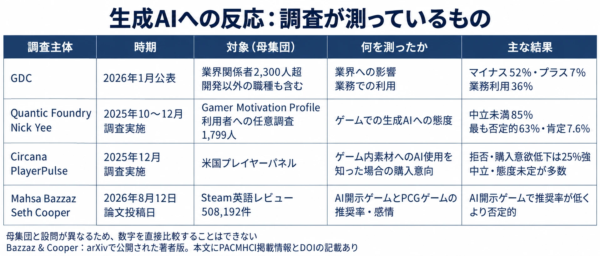
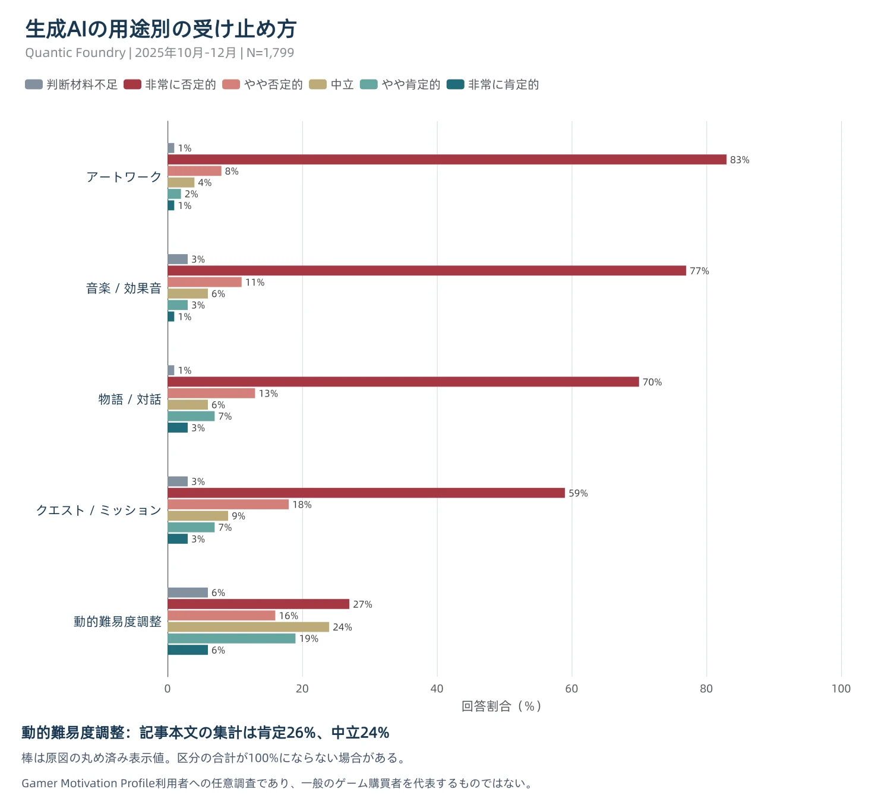

# 「製品には入っていません」では、なぜ火が消えないのか ― 生成AI素材の現在地

2026年9月、レベルファイブの新作発表会で使われた生成AI映像に指摘が集まり、日野晃博氏が説明と謝罪を行った。その説明には、発表会の映像をきっかけに、作品の内容まで不安視されているという本人の認識が示されていた。[[1](#ref-1)]

本稿が扱うのは、生成AI利用の是非ではなく、 **現時点で受け手が素材から何を読み取っているか** である。開発者とプレイヤーの調査を分け、結果が割れる理由も含めて、宣伝素材を制作・発注する前の判断につなげる。

中心となる見方は、宣伝素材への生成AIの使用が、送り手の「何を足したか」という意図を離れ、受け手には「何を省いたか」と読まれうることだ。製品への手間や創作上の関与を推し量っている相手にとって、「製品には入っていません」という区分だけでは推論は止まらない。ただし、これは全プレイヤーの反応を説明する法則ではない。以下の調査にも、否定、肯定、中立、態度未定が併存している。

***

## 1. 2026年9月に起きたこと、そして9か月前に起きていたこと

9月10日22時からの「LEVEL5 VISION 2026 II 夢」では、『イナズマイレブン 烈火の革命』と新キャラクター「降星ナギ」が公開された。AUTOMATONによれば、立ち絵とリフティング映像に対し、画風やボールが不自然に画面外から出現する様子から、AIの使用を疑う指摘が集まった。ここで確認できるのは映像への指摘であり、キャラクターデザインそのものの制作方法をそれだけで確定することはできない。[[2](#ref-2)]

9月12日、日野氏は本人のXアカウント（@AkihiroHino）で、イベント映像へのAI使用を認め、説明と謝罪を投稿した。冒頭の **「作品の内容に関しても不安の声があがってしまってる」** は、本人が観測した反応として重要である。宣伝素材への疑問が、製品の中身への不安に移っていることが、本稿の出発点になる。[[1](#ref-1)]

日野氏は発表会を派手にするための実験だったと説明し、シナリオ、キャラクターデザイン、基礎設定などは人の手で作っていると述べた。製品についての表現は「発売されるゲームに、安易なAI出力データが入ってることはありません」である。これはAIを開発工程で一切使わないという説明ではなく、人の創作物をデジタル化する工程などで効率化を進めるという説明と併記されている。[[1](#ref-1)]

さかのぼる2025年12月26日にも、同氏は本人アカウントで発信していた。あるゲーム開発者がAIを使用したことで賞を取り消された一件をきっかけに、レベルファイブの開発効率化が話題になっている、という状況を受けたものである。[[3](#ref-3)]

> ここで、『AIを使うことが悪』という印象をつくってしまっては、現代のデジタルテクノロジーの発展は大きく遅れることになりかねません。

その投稿は、AAAゲームを遊べる間隔が開発の5年〜10年から2年に1度へ変わる可能性にも言及している。2026年9月の投稿では、大型タイトルの開発期間を5年から2年へ縮める計画が示された。 **両方に開発期間の短縮が登場する** のである。いずれも将来の可能性や計画であり、達成済みの実績ではない。[[1](#ref-1)][[3](#ref-3)]

2026年9月12日時点で、同日の説明以降に映像が差し替えられたり、取り下げられたりしたことは確認できていない。

出典：日野晃博氏の投稿およびAUTOMATONの報道をもとに作成。[[1](#ref-1)][[2](#ref-2)][[3](#ref-3)]

***

## 2. 開示していても批判される ― Activisionの場合

Activisionの『Call of Duty: Black Ops 7』『Black Ops 6』『Warzone』について、Steamの開示文は次の一文である。[[4](#ref-4)][[5](#ref-5)][[6](#ref-6)]

> Our team uses generative AI tools to help develop some in game assets.

日本語のストアページでは「弊社では一部のゲームアセット開発に生成AIツールを使用しています。」と表示される。PCGamesNは2025年11月の記事で、この開示がある一方、プレイヤーが『Black Ops 7』の報酬用アートなどをAI生成ではないかと問題視していることを伝えた。同誌へのActivisionの声明は次のとおりである。[[7](#ref-7)]

> Like so many around the world, we use a variety of digital tools, including AI tools, to empower and support our teams to create the best gaming experiences possible for our players. Our creative process continues to be lead by the talented individuals in our studios.

AIを含むデジタルツールがチームを支え、創作はスタジオの人材が主導する、という説明である。ただし、声明は個々の素材の制作方法までは特定していない。[[7](#ref-7)]

日野氏は発表会映像への指摘を受けて説明した。Activisionの事例では、利用の開示があっても素材への批判が続いていた。 **情報を出す順番が違っても、利用を伝えることだけでは批判が収まらない点が似ている。** これは事前開示が無意味だという証明ではない。両社では素材の使い場所も顧客も異なり、順番だけの効果を比べた実験ではないからだ。

Steamの制度自体は、既刊[「Steamのライブ生成AI審査とEpic Games Storeの異なる哲学」](instantale-steam-live-generated-ai-review-epic-policy.md)に譲る。ここで見るのは、開示の存在と、受け手の納得が別の問題であるという点だ。

***

## 3. 数字は割れている ― 受け手の反応をどう読むか

### 開発者側では、否定的な評価と業務利用が併存する

GDCの「State of the Game Industry 2026」は、開発者だけでなくマーケティングや経営などを含む、2,300人超の業界関係者から回答を得ている。生成AIが業界にマイナスの影響を与えていると考える割合は52%で、2025年版の30%、2024年版の18%から上昇した。プラスと考える割合は7%で、前年の13%から下がった。[[8](#ref-8)]

否定的な回答が多い職種は、ビジュアル／テクニカルアート64%、ゲームデザイン／ナラティブ63%、ゲームプログラミング59%である。その一方、 **36%は業務で生成AIツールを使っている。** 業界への影響の評価と、自分の仕事で利用することは別の設問であり、この二つは両立している。ただし集計値だけから、否定的な回答者の何割が利用者なのかまでは分からない。[[8](#ref-8)]

また、2026年版は対象を広げ、質問も見直している。年次比較は回答傾向の変化を示すが、同じ人を追跡して態度の変化を測った数字としては扱えない。[[8](#ref-8)]

### プレイヤー側の三つの調査は、違うものを測っている

Quantic FoundryのNick Yee氏は、2025年10〜12月、Gamer Motivation Profileの利用者への任意調査を実施した。回答者1,799人の85%が中立未満の態度を示し、63%が最も否定的な選択肢を選んだ。肯定は7.6%である。これは、主にPC・コンソールで遊ぶコア層に寄った標本での、生成AI全般への態度だ。[[9](#ref-9)]

一方、CircanaのPlayerPulseでは、2025年12月の米国プレイヤーのうち、生成AIの使用で購入意欲が下がるとする人は25%を少し超える程度だった。GameSpotの報道では、購入を拒否する回答と購入しにくくなる回答の合計が、2024年3月の約22%から増えている。多数を占めたのは中立と態度未定である。[[10](#ref-10)][[11](#ref-11)]

CircanaのMat Piscatella氏は、強く反対する一部の声が目立つ一方、多数のプレイヤーは現時点でどちらにも強い関心を持っていない、という趣旨の見方を示した。ただし、 **中立や「わからない」は積極的な支持ではなく、購入意向も実際の購入行動とは異なる。** 設問が尋ねているのは、ゲーム内の絵、台詞、文章、音楽、音声に生成AIを使ったと知った場合の反応である。[[11](#ref-11)]

Mahsa Bazzaz氏とSeth Cooper氏の研究は、アンケートではなくSteamの英語レビュー508,192件を分析している。生成AI使用を開示したゲームは、手続き型生成（PCG）を使うゲームより推奨率が低く、全体の感情も否定的だった。2026年8月12日にarXivで公開された著者版で、本文にはPACMHCI（Proceedings of the ACM on Human-Computer Interaction）への掲載情報とDOIが記されている。[[12](#ref-12)]

このレビュー分析は、購入・プレイ後に評価を書いた人の反応を捉える。生成AIだけを変えて同じゲームを比較した実験ではないため、推奨率の差をそのまま生成AI使用の因果効果や売上への影響には置き換えられない。

### 数字を選ぶ前に、対象と設問を選ぶ

Quantic Foundryは動機診断の利用者への任意調査、Circanaはゲーム購買者を含む米国プレイヤーのパネル、Steam分析は英語のレビュー投稿である。 **測っている相手に加え、態度、購入意向、作品評価という測定対象も違う。**

したがって、「大多数は今のところ気にしない」と「85%が否定的」は、母集団が違えば同時に成り立ちうる。さらに、否定的な態度を持ちながらゲームを買う人も論理上はありうる。どちらかの調査を退けたり、中間の割合を作ったりする読み方は適切ではない。

実務では、広い購買者層への到達を考えるのか、物語やキャラクターへの関与が強い既存ファンへの提示を考えるのかで、参照すべき結果が変わる。「コア層の85%」という短縮表現にも注意が要る。正確には、この調査に自ら回答した、コア層に偏る1,799人の結果であり、コアゲーマー全員の代表値ではない。

出典：各調査の公表資料・報道および論文をもとに作成。[[8](#ref-8)][[9](#ref-9)][[10](#ref-10)][[11](#ref-11)][[12](#ref-12)]

***

## 4. 同じ生成AIでも、使う場所で反応が違う

Quantic Foundryの用途別調査では、動的難易度調整への肯定が26%、中立が24%だった。一方、アートワーク、音楽・効果音、物語・対話といった創作表現への使用は強く否定されている。 **キャラクターの絵は、否定の強い領域の中心にある。そして宣伝で真っ先に見せる素材も、まさにその絵である。** [[9](#ref-9)]

同社は、2024年のクエスト／対話のAI生成への否定46%に対し、2025年はクエスト77%、対話83%になったと報告している。前年は一つにまとめた項目、翌年は別項目であり、同一設問の厳密な追跡比較ではない。方向として否定の強まりを示す結果と読むのが妥当だ。[[9](#ref-9)]

遊ぶ動機による違いもある。StoryとDesignはそれぞれ態度と弱い負の相関（r=-.12）、Powerは弱い正の相関（r=.15）を持つ。ここでDesignは、ゲーム設計一般の評価というより、見た目のカスタマイズなどを重視する動機である。Powerはレベル上げや装備強化などへの志向を指す。物語や外見の表現に関心の強い層ほど否定的という傾向であり、動機から個人の態度を決めつけられる強さではない。[[9](#ref-9)]

年齢別の肯定率は13〜17歳で3%、18〜24歳で7%、45歳以上で22%だった。若いほど一律に受容的とはいえない。ただし同調査の45歳以上は標本の2%であり、年齢差もこの標本の範囲で捉える必要がある。[[9](#ref-9)]

日本市場の背景として、総務省『令和7年版 情報通信白書』では、生成AIサービスの利用経験は2024年度調査で26.7%であり、2023年度の9.1%から増えている。同じ2024年度の米国68.8%、ドイツ59.2%、中国81.2%より低い。国内では、利用したことがない人のほうが多数派という状況で宣伝素材を出している。ただし、これは一般の個人の利用経験であり、日本のゲーム購買者の賛否を測った数字ではない。利用経験の少なさから、否定や不信の強さまでは断定できない。[[13](#ref-13)]

出典：Quantic Foundryの用途別調査をもとに作成。棒には原図の丸め済み表示値を使用しており、各用途の合計が100%にならない場合がある。動的難易度調整の肯定は原図の内訳では19%と6%、調査記事本文の集計では26%とされている。[[9](#ref-9)]

***

## 5. なぜ「足した」が「省いた」と読まれるのか

Bazzaz氏とCooper氏は600件のレビューを質的に分析し、生成AIの利用が、開発者によるゲームへの投資の少なさとして受け取られることを示した。ここでいう投資とは、実際の予算額を調べた結果ではなく、プレイヤーが素材から推し量る手間や関与である。分析対象も、生成AIなどに明示的に言及したレビューから選ばれている。全プレイヤーがそう考えているという意味ではない。[[12](#ref-12)]

著者らは、導入を成功させるには開発を安くするためではなく、プレイヤーが必要とすることのために生成AIを配置すべきだと論じる。一方で、動的な物語など、プレイヤーの必要に応じる使用が受け入れられる例も扱っている。反応を単一の拒絶に還元した研究ではない。[[12](#ref-12)]

日野氏が説明した動機は「ひとえに発表会を派手にしたいという思い」であり、演出を足す方向だった。その同じ投稿が、作品の内容への不安を報告している。Activisionの「empower and support our teams」も、送り手がチームの能力を支える道具として説明している点で共通する。送り手の説明と受け手の懸念が一致していないことは確認できる。[[1](#ref-1)][[7](#ref-7)]

ただし、レベルファイブへの反応を体系的に調べた結果ではない以上、その受け手全体が投資量を問題にしたとまでは言えない。レビュー研究が示すのは、このずれを理解する一つの根拠である。

### 編者の考察：効率化の説明が推論の材料になる場合

ここからは編者の考察である。素材から手間の省略を疑っている受け手には、開発期間の短縮という説明が、その疑いを補強する材料として読める。送り手には演出や制作能力の追加であっても、受け手には創作上の投資の削減という説明も立つ。

この見方への反証となる説明も、日野氏の同じ投稿にある。日野氏は「AI効率化によって生まれた時間で、よりクリエイターが、創造の本質に時間がつかえるようになってきており、完成した製品は、これまで以上に、皆さんに納得していただける仕上がりになっていると思っています」と述べている。[[1](#ref-1)]

編者の考察としては、この説明は効率化で浮いた時間を創作へ戻すという再投資の説明と読める。したがって、効率化を語れば常に逆効果になるとは限らず、削減した工程と増やした創作上の関与を一緒に受け取れば、別の評価が生まれるという説明も立つ。

***

## 6. 素材を用意する立場は、何を決めておくか

ここまでの事例と調査から、制作・発注前の判断を五つに整理できる。特定の説明をすれば必ず受け入れられるという処方箋ではなく、素材が何を伝えてしまうかを点検するための確認事項である。

| 決めておくこと | 素材を用意する前の確認 |
| --- | --- |
| 宣伝素材を、製品への投資量の最初のサンプルとして扱う | キャラクターの絵や映像を見た人が、製品のどの品質や制作姿勢まで推し量るか。「宣伝用」という区分だけで、その推論を止められると考えていないか |
| 開示の粒度を決める | 何に使い、何に使っていないか。絵の設計、動きの付与、背景、音声など、実際に説明できる単位で記録を残せるか |
| 効率化と再投資を一緒に示す | 省けた時間を、どの作業や表現の改善へ戻したか。確認できる成果を伴わない効率化だけの説明にならないか |
| 使う場所を選ぶ | キャラクターの絵、音楽、対話など、作品の個性を受け手が直接見る箇所か。社内の補助工程への利用と同じ反応を想定していないか |
| 判断に使う調査と顧客像を先に決める | 自社の顧客は広い購買者パネルに近いか、物語・外見の表現に関心の強い層に近いか。態度と購入意向のどちらを判断材料にしているか |

**開示は必要条件だが、十分条件ではない。** ここでいう必要条件は、受け手が判断できる情報を用意するという実務上の出発点である。開示した事実そのものを納得の保証にせず、素材ごとに利用範囲を言える状態を作る。実際に確認していない工程まで「人が作った」とまとめてしまえば、説明の精度が落ちる。

**効率化の話を単独で出さない** という判断も、効率化自体を否定するものではない。浮いた時間を何に使ったか示せない段階では、時間短縮だけを前面に出すことを避けたほうがよい場合がある。再投資について話すなら、予定と達成済みの改善を分ける必要がある。

用途の違いも、裏方であれば必ず歓迎されるという保証ではない。調査が直接示したのは、難易度調整と創作表現で反応が異なることだ。社内工程での利用については、その工程を対象とするデータや自社顧客への確認を別途用意する。

最後に、「大多数は気にしない」を根拠にする場合も、「コア層に偏る調査で85%が否定的」を根拠にする場合も、 **自社の顧客がその標本にどれほど近いかを、結果を見る前に決めておく。** 年齢やプラットフォームだけでなく、何を楽しみにその作品を待っている人なのかまで考えることが、数字の都合のよい使い分けを防ぐ。

***

## 結論

宣伝素材は、受け手がまだ触れられない製品を判断する手掛かりである。送り手が演出や能力を足したつもりでも、受け手がそこから手間の省略を読むことがある。そのとき、製品への収録の有無を説明するだけでは、制作姿勢への疑問に答えきれない。

調査は、強い否定と、購入意向を大きく変えない多数派の両方を捉えている。素材を用意する立場に必要なのは、生成AIを使うか使わないかの態度表明だけではない。 **誰に、何を、どの用途で見せたときに、何がどう読まれるかを先に知っておくこと** である。

***

## この記事もまた、生成AIの支援を受けて書かれている

本ブログのフッターには、Perplexity・Claude・OpenAI Codexの支援を受けて著述している旨を記している。制作工程については、既刊[「番外編：生成AIと一緒に、このブログを作るまで」](making-this-blog-with-ai-tools.md)に記載している。

本稿もまた、受け手から投資量を推し量られる対象である。ここで扱った、生成AIの使用から手間や関与を読むという見方は、本稿自身にも当てはまる。

## References

1. [日野晃博（@AkihiroHino）「【AIの使用について・LEVEL５VISION2026Ⅱ】」][1] — X、2026年9月12日（画面表示の最終更新14:51、日本時間）。本人投稿の本文を確認。

[1]: https://x.com/AkihiroHino/status/2098650784934338645

2. [Shion Kaneko「レベルファイブ日野社長、“AI盛り込みトレイラー発表会”について『派手にしたかった』ためと弁明。ただ発売するゲームには、“安易なAI出力データ”は入れない」][2] — AUTOMATON、2026年9月12日15:55。

[2]: https://automaton-media.com/articles/newsjp/20260912-467049/

3. [日野晃博（@AkihiroHino）「【AIをめぐる騒動について】」][3] — X、2025年12月26日15:31（日本時間）。関連報道：吉川大貴「[レベルファイブ日野社長、『ゲーム制作でのAI使用は悪』とする論調に言及](https://www.itmedia.co.jp/aiplus/articles/2512/26/news112.html)」ITmedia AI＋、同日17:10公開、17:13更新。本文引用は本人投稿による。

[3]: https://x.com/AkihiroHino/status/2004439840868421650

4. [Activision『Call of Duty: Black Ops 7』Steamストアページ][4] — AI Generated Content Disclosure（AI生成コンテンツの開示）。

[4]: https://store.steampowered.com/app/3606480/Call_of_Duty_Black_Ops_7/

5. [Activision『Call of Duty: Black Ops 6』Steamストアページ][5] — AI Generated Content Disclosure（AI生成コンテンツの開示）。

[5]: https://store.steampowered.com/app/4384550/Call_of_Duty_Black_Ops_6/

6. [Activision『Call of Duty: Warzone』Steamストアページ][6] — AI Generated Content Disclosure（AI生成コンテンツの開示）。

[6]: https://store.steampowered.com/app/1962663/Call_of_Duty_Warzone/

7. [Jamie Hore「Activision confirms Black Ops 7 uses gen-AI tools for assets, says they help “empower” its teams to “create the best gaming experiences possible”」][7] — PCGamesN、2025年11月14日更新。初回公開日の独立した表示は未確認。声明は同誌がActivisionから受け取ったもの。英語の「lead」は掲載原文どおり。

[7]: https://www.pcgamesn.com/call-of-duty-black-ops-7/ai-assets-steam-disclosure

8. [Beth Elderkin「GDC 2026 State of the Game Industry Reveals Impact of Layoffs, Generative AI, and More」][8] — GDC。ページ本文に日付表示はなく、著者による[公表告知](https://bsky.app/profile/bethelderkin.bsky.social/post/3mdlc4iuv2s2x)は2026年1月29日。

[8]: https://gdconf.com/article/gdc-2026-state-of-the-game-industry-reveals-impact-of-layoffs-generative-ai-and-more/

9. [Nick Yee「Gamers Are Overwhelmingly Negative About Gen AI in Video Games, but Attitudes Vary by Gender, Age, and Gaming Motivations.」][9] — Quantic Foundry、2025年12月18日。本文および掲載グラフ。肯定7.6%は全体グラフの3.0%、2.8%、1.8%の合計。

[9]: https://quanticfoundry.com/2025/12/18/gen-ai/

10. [Mat Piscatella「From Circana’s PlayerPulse」][10] — Bluesky、2026年3月22日（UTC）。2025年12月の米国調査結果を紹介する本人発信。市場への見方は同じスレッドの[続く投稿](https://bsky.app/profile/matpiscatella.bsky.social/post/3mhntb5ozv224)を参照。

[10]: https://bsky.app/profile/matpiscatella.bsky.social/post/3mhnszt5wsc24

11. [Eddie Makuch「GenAI In Games? Most Players Just Don’t Care, Study Finds」][11] — GameSpot、2026年3月24日6:18AM PDT。PlayerPulseの設問、前年との比較、Piscatella氏の見解。

[11]: https://www.gamespot.com/articles/genai-in-games-most-players-just-dont-care-study-finds/1100-6538972/

12. [Mahsa Bazzaz, Seth Cooper「Player Perceptions of Generative AI in Games: A Steam Review Analysis」][12] — arXiv:2608.11539、2026年8月12日公開。[本文v1](https://arxiv.org/html/2608.11539v1)にPACMHCI（Volume 107、GAMES056）およびDOI 10.1145/3831347の記載がある。確認時にDOIのリンク先は取得できず、ACM Digital Library側の確認は未了。

[12]: https://arxiv.org/abs/2608.11539

13. [総務省『令和7年版 情報通信白書』「個人におけるAI利用の現状」][13] — 2025年。同節の記述による。

[13]: https://www.soumu.go.jp/johotsusintokei/whitepaper/ja/r07/html/nd112210.html

----

この文書は、Perplexity、Claude、OpenAI Codex の3つのAIの支援を受けて著述されたものです。引用画像を除き、MIT License にて提供されています。
