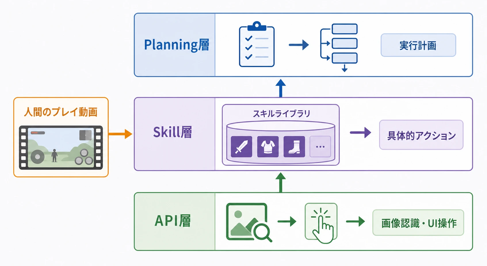
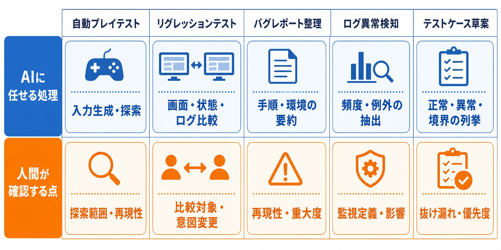
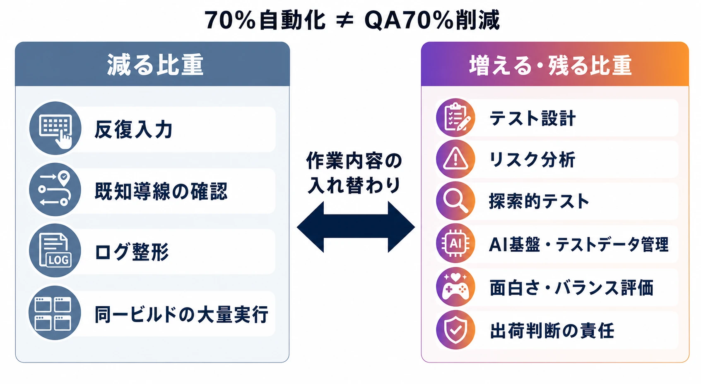
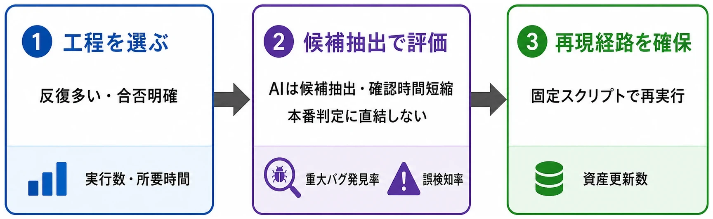

# 生成AIによるQA・デバッグの実装レベル判断――2026年の実用化領域と人間が担うべき境界

> **注意書き**
>
> 本稿は現在進行中の話題を扱っており、2026年7月22日から24日に開催予定のCEDEC2026で発表される予定の内容を含む。講演後に新たな情報や実装結果が公開された場合は、本文を改稿する可能性がある。最新情報と本稿の記載が異なる場合は、公式発表を優先されたい。

## エグゼクティブサマリー

2026年のゲーム開発で問われているのは、生成AIを使うかどうかだけではない。どのテスト工程を機械に任せ、どの判定を人間に残し、そこで得た記録を次のテスト設計へどう戻すかという、品質保証プロセスの再設計である。

スクウェア・エニックスは2025年11月、東京大学松尾・岩澤研究室との共同研究に関連して、2027年末までにゲーム開発におけるQA・デバッグ作業の70％を自動化する目標を公表した。[[1](#ref-1)] これは単なる実験の紹介ではなく、ゲーム会社がQAを生成AIの実装対象として明確に扱い始めたことを示す材料である。

ただし、70％という数字を「QA担当者の70％を減らす」という意味に読み替えてはならない。何を作業単位とするのか、どの品質水準を合格とするのか、AIの誤検知と見逃しを誰が引き受けるのかは、公開資料だけでは定義されていないからである。最終的な導入判断は、QAディレクター、テクニカルディレクター、プロダクションなど、品質・技術・予算・納期を横断して責任を負う側が行うべきである。

プランナーは導入の意思決定者ではない。しかし、仕様書と受け入れ条件の書き方によって、AIが作れるテスト、異常として拾えるログ、バグか仕様かを切り分ける材料の質は変わる。本稿では、生成AIをQA・デバッグのどこへ組み込めるかと、人間の判断を残すべき境界を、プランナーの実務から考える。

***

## 1. 最初に決めるのは「AIを使う人」ではなく「責任を負う人」である

生成AIをQAへ導入するとき、最初に決めるべきなのはツール名ではない。失敗したときに出荷を止めるのか、再テストを要求するのか、仕様を変更するのかを決める責任者である。

QAディレクターは、テストの目的、リスク、優先順位、完了条件を管理する。テクニカルディレクターは、ゲームエンジン、ビルド、ログ、実機環境、データ保護、CI/CD（変更を継続的にビルド・テストして統合する開発運用）にAIを接続できるかを判断する。プロダクションは、導入費、開発期間、社内教育、外部委託、リリース日とのトレードオフを含めて意思決定する。

この三者の役割は、必ずしも別の人物が担うとは限らない。小規模なチームでは一人の責任者が複数の役割を兼ねる場合もある。ただし、責任の所在を曖昧にしたままAIを動かすと、AIが「不具合らしいもの」を大量に出したときに、誰もリリース判断を引き受けられない。

一方、プランナーが担う接点は仕様の形式化である。例えば「ボス戦は緊張感があること」だけでは、テストの合否を決めにくい。「第2形態への移行はHPが30％以下かつイベントフラグが成立したときに一度だけ発生し、通信切断後の再接続では二重発生しない」のように、状態、入力、期待結果、例外を分ければ、テストケースや観測項目へ変換しやすくなる。

プランナーは意思決定者ではない。しかし、AI活用の効果が仕様の観測可能性に左右されることを理解していれば、QAや技術側との会話を「AIに任せられるか」から「何を合格と定義できるか」へ進められる。

***

## 2. 「導入すべきか」の議論から、実装レベルの判断へ

生成AIに対する期待と反発が併存していることは、2026年にも変わらない。GDCの2026年調査（2,300人超の業界関係者からの回答に基づく）では、ゲーム業界の回答者の36％が仕事で生成AIツールを使っている一方、52％は生成AIがゲーム業界に悪影響を与えていると回答した。[[2](#ref-2)] 回答者数の規模を踏まえても、この数字は業界全体が導入に合意したことを意味しない。

それでも、企業や開発現場の論点は「AIを使うべきか」という抽象的な賛否だけでは進まなくなっている。スクウェア・エニックスがQA・デバッグの自動化目標を掲げ、CESAの「CEDEC ゲーム開発技術ロードマップ」でも、AIによるテスト計画、テストケース、自動テスト、異常検知の進展が整理されている。[[3](#ref-3)] 研究発表では、ソニー・インタラクティブエンタテインメントがゲームQA向けのVLM（画像と自然言語を組み合わせて理解するモデル）の評価ベンチマークを公開している。[[4](#ref-4)]

したがって、2026年時点の実務的な認識は次のように表現するのが適切である。

> AI導入の是非を議論するだけでは、実装計画として不十分である。少なくとも一定の工程では導入を前提に、投資先、評価指標、人間の承認点、失敗時の戻し方を決める段階に移っている。

これは「全社が導入済み」という意味ではない。対象工程の選び方を誤れば、誤検知の確認に人手を取られ、従来の手動テストより遅くなる。AIを使うこと自体ではなく、費用とリスクが釣り合う工程へ入れることが意思決定の中心になる。

***

## 3. スクウェア・エニックスの70％目標をどう読むか

スクウェア・エニックスの2025年11月6日付の中期経営計画進捗報告には、東京大学松尾・岩澤研究室と同社グループ内エンジニアによる10名以上の共同研究チームと、2027年末までにゲーム開発のQA・デバッグ作業の70％を自動化する目標が記載されている。[[1](#ref-1)]

ここで重要なのは、同社が「ゲームの面白さをAIが保証する」と発表したわけではない点である。公表資料が示すのは、QA・デバッグ作業の自動化によってQA業務を効率化し、ゲーム開発における競争優位性を目指すという方向性である。70％の分母がテスト手順数なのか、実行時間なのか、工数なのか、発見対象の件数なのかは、資料からは判断できない。

また、同社のCEDEC2026セッションには、生成AIを使ったゲームQAシステムのアーキテクチャ、動画からのテストコード生成、画像認識による模倣プレイが紹介予定である。[[5](#ref-5)] ただし、本稿執筆時点の2026年7月11日では、CEDEC2026は7月22日から24日までの開催予定である。[[8](#ref-8)] したがって、以下で触れるスキルマイニングやAIリプレイは、講演後の成果報告ではなく、公式タイムテーブルで公開されているセッション概要に基づく実装例として扱う。

スキルマイニングは、AIにゲームをゼロから遊ばせる方法ではない。QA担当者や開発者の手動プレイ動画を正解データとして扱い、LLM（大量の文章から言語の規則性を学習した大規模言語モデル）に抽出したい行動のリストを与え、動画から「装備を変更する」「特定の場所へ移動する」といった操作をラベル付けし、再利用可能なスキルとしてライブラリ化する仕組みである。公式概要では、Planning層、Skill層、API層の3層構成と、製品版に近いROMを映像の道標で操作するAIリプレイも説明されている。[[5](#ref-5)]

この例が示すのは、生成AIが「魔法のように全ゲームを理解する」ことではない。人間のプレイ知識、動画、操作の部品、画面認識、実行計画を組み合わせて、テスト資産を作り直すことである。

***

## 4. 2026年に実用化しやすい領域

生成AIの得意領域は、判断の最終責任を持つことではなく、観測、列挙、変換、要約、優先順位付けの補助である。実装対象を工程別に分けると、次のようになる。

| 領域 | AIに任せる処理 | 人間が確認する点 |
| --- | --- | --- |
| 自動プレイテスト | 画面を見て入力を生成し、既知の導線や未知の分岐を探索する。いわゆるバグ探索ボットである | 探索範囲、再現性、プレイヤーが実際に遭遇する確率 |
| リグレッションテスト | 変更前後の画面、状態、ログを比較し、既存機能への影響候補を挙げる | 比較対象の妥当性、意図した変更との区別 |
| バグレポート整理 | 動画、ログ、入力履歴から再現手順、環境、要約を作る | 手順が本当に再現可能か、重大度、報告の欠落 |
| ログ異常検知 | 大量のログから頻度の変化、例外、特定状態での異常を抽出する | 監視対象の定義、ノイズ、ユーザー影響との関係 |
| テストケース草案 | 仕様、受け入れ条件、過去バグから正常系・異常系・境界値を列挙する | 抜け漏れ、優先度、テスト可能な合否条件 |

リグレッションテストとは、修正や機能追加の後に、変更していない領域まで壊れていないかを確認するテストである。ゲームでは、UI変更がセーブデータに影響する、報酬テーブル変更がクエスト進行を壊す、カメラ変更が当たり判定の見え方を変えるといった連鎖が起きる。変更点を起点に周辺のテスト候補を選ぶ作業は、AIの検索・比較と相性がよい。

バグレポートの整理も、実務上の効果が出やすい。AIが「再現率の高い手順」「発生ビルド」「入力列」「画面録画」「関連ログ」を一つの要約にまとめれば、開発者が最初に読む時間を短縮できる。ただし、要約の流暢さは事実性を保証しない。再現手順が途中の状態を飛ばしていれば、文章が自然でも修正には使えない。

ソニー・インタラクティブエンタテインメントが公開したVideoGameQA-Benchは、視覚的なユニットテスト、ビジュアルリグレッションテスト、画面上の小さな異常の発見、画像・動画からのバグレポート生成を評価対象にしている。[[4](#ref-4)] 同時に、現在のVLMは細かな視覚差分、微妙なリグレッション、長い動画内の異常位置の特定に苦戦すると報告されている。AIが実際に使える領域と、まだ人間の確認が必要な領域が同じ資料に並んでいる点が重要である。

***

## 5. スクリプトベースの自動テストと何が違うのか

従来型の自動テストは、あらかじめ決めた入力と期待結果を、決めた順番で実行する。例えば「タイトル画面で決定を押す」「メニューを開く」「所持金が100減る」といった手順をスクリプトとして保存する方式である。条件が安定している機能では、速く、再現性が高く、合否も明確になる。Unity Test Frameworkのような仕組みは、Edit ModeとPlay Modeのテストを自動実行し、ビルド時にリグレッションを検出する基盤として使える。[[6](#ref-6)]

一方、生成AIを含む自動テストは、自然言語の指示、プレイ動画、画面認識、ログ、過去のテスト結果を組み合わせ、実行計画や操作を動的に作る。違いは、単にスクリプトを書く速度ではなく、テスト資産の作り方と保守の単位にある。

| 比較軸 | スクリプトベース | 生成AIを含む方式 |
| --- | --- | --- |
| 操作 | 固定された命令列 | 指示、動画、画面認識から計画・操作を生成 |
| 強み | 再現性、合否の明確さ、速度 | 未知の分岐、表現の変化、手順作成の省力化 |
| 弱み | UI変更や導線変更で壊れやすい | 出力の揺らぎ、誤検知、再現性の管理 |
| 保守 | スクリプトを直接修正する | スキル、プロンプト、判定基準、学習・参照データを更新する |
| 人間の役割 | 事前に手順と期待結果を設計する | AIの探索範囲と判定結果を監督し、資産を育てる |

生成AI方式にも、最終的には固定化されたスキルやテストコードが必要になる。したがって「スクリプトが不要になる」というより、固定スクリプトだけでは表現しにくい探索や手順生成を、別の管理可能な層で補うと考えるほうが正確である。CEDEC2026の公開概要がテストスクリプトの保守コストと専用デバッグ機能への依存を課題としているのは、この差を示している。[[5](#ref-5)]

***

## 6. 人間の判断を残すべき三つの領域

### 6.1 面白さとバランスの評価

AIは、勝率、クリア時間、被ダメージ、リトライ回数、入力の成功率などを比較できる。しかし、それだけで「面白い」「緊張感がある」「上達を実感できる」とは判定できない。

例えば、ボスの攻撃頻度を上げれば、統計上の難易度は上がる。だが、予兆が読めず、失敗理由が理解できないなら、挑戦ではなく理不尽さとして受け取られる。逆に、プレイヤーがぎりぎりで回避できるなら、同じ被ダメージ率でも評価は変わる。AIは体験の候補を比較する補助には使えるが、ゲームデザイン上の価値を決める承認者にはしないほうがよい。

### 6.2 「バグか仕様か」のグレーゾーン

仕様書に書かれていない挙動は、すべてバグとは限らない。意図した仕様の相互作用、プレイヤーが発見した有利な遊び方、修正コストに対して影響が小さい不具合、逆に小さく見えても経済や対戦公平性を壊す不具合がある。

AIには、仕様書との差分、発生頻度、ユーザーへの不利益、過去の判断、関連するシステムを整理させられる。しかし「この挙動を残すとプレイヤーが喜ぶか」「残すことでゲーム全体のルールが崩れないか」「仕様化した判断を将来のチームが理解できるか」は、人間の合意形成が必要である。

### 6.3 誤検知と見逃しを受け入れる基準

誤検知は、問題がないのに問題があると報告することだ。見逃しは、実際の問題を拾えないことだ。誤検知が多いとQAがAIの報告を読むだけで疲弊し、見逃しが多いと「AIで検査したから安心」という誤った保証が生まれる。

ソニー・インタラクティブエンタテインメントの評価でも、現在のVLMは細部や長時間動画の異常特定に限界がある。[[4](#ref-4)] さらに、2026年に公開されたゲームQAベンチマークでは、LLMエージェント（複数の手順を自律的に計画して実行する仕組み）によるバグ発見が研究対象になっているが、自律的なバグ発見は依然として難しい課題とされている。[[7](#ref-7)]

実務では、AIの正答率だけを追わないことが重要である。重大度の高いバグをどれだけ見逃さなかったか、報告から再現まで何分かかったか、誤検知の確認に何人時を使ったか、AIが拾えなかった範囲を人間の探索が補えているかを、工程単位で計測する必要がある。

***

## 7. 70％の自動化は、QA人員の70％削減を意味しない

自動化目標が人員構成へ影響しうることは否定できない。反復的な入力、既知の導線の確認、ログの整形、同一ビルドの大量実行に必要な工数が減れば、同じ人数でより多くのビルドや端末を検証できる可能性がある。反対に、AIの基盤整備、テストデータの管理、誤検知の分析、再現性の確保には新しい仕事が発生する。

ただし、スクウェア・エニックスの公開資料は70％の自動化目標を示しているが、QA担当者の採用数、配置転換、契約更新、外部委託の扱いまでは示していない。[[1](#ref-1)] したがって、そこから人員削減や採用停止を断定することはできない。

実装が進んだ場合に職能の比重が変わる方向としては、次のような整理が現実的である。

- 手動で同じ手順を繰り返す比重が下がり、テスト設計、リスク分析、探索的テストへ時間を移す
- AIが使うスキル、テストデータ、期待結果、ログの観測点を管理する人が必要になる
- 自動テスト基盤、実機・クラウド環境、ビルドパイプラインを扱う技術寄りのQAが重要になる
- プレイヤーの感覚、面白さ、対戦の納得感、仕様かバグかの判断を担う人間の役割が残る
- AIの出力を鵜呑みにせず、出荷判断へ接続するQAリードやプロダクションの責任が重くなる

つまり、採用の変化を考えるときは人数だけでなく、作業の内訳を見るべきである。自動化率が上がっても、テスト対象そのものが増えれば総工数は減らないことがある。ライブサービスでは、毎週の更新、端末・OSの増加、イベント報酬、復帰ユーザーの状態、障害対応が新たなテスト需要を作るからである。

***

## 8. プランナーの仕様書がAIテストの精度を左右する

AIにテストケースを作らせるとき、入力になる仕様が曖昧なら、出力されるテストも曖昧になる。プランナーが書くべきなのは、実装者だけが理解できる説明ではなく、QA、AI、将来の担当者が同じ状態を再現できる記録である。

最低限、次の項目を仕様書と受け入れ条件に持たせたい。

| 項目 | 書く内容 | AIテストへの効果 |
| --- | --- | --- |
| 状態 | 初回起動、クリア済み、通信切断中、所持数上限など | 前提条件を固定できる |
| 入力 | 操作、順番、待ち時間、キャンセル、再接続 | 再現手順と境界ケースを作れる |
| 期待結果 | 画面、数値、フラグ、サーバー保存、通知 | 合否判定の根拠になる |
| 例外 | 二重押下、途中離脱、異常値、権限不足 | 異常系テストの候補になる |
| 観測点 | ログ名、イベント名、画面要素、計測値 | 目視以外の判定経路を作れる |
| 優先度 | 進行不能、課金、対戦公平性、見た目の軽微な差 | テスト実行順と人間の確認順を決められる |

例えば「報酬を受け取れること」という受け入れ条件では不足している。「クエスト達成状態で受取ボタンを一度押すと、報酬が一回だけ付与され、通信切断後の再接続や連打でも二重付与されず、受取済み状態がサーバー保存される」と書けば、正常系だけでなく連打、切断、再接続、再ログインというテスト候補が生まれる。

ここで大切なのは、AI向けに不自然な長文を書くことではない。仕様を「条件」「操作」「結果」「例外」「観測」に分解することである。AIはその構造からテストの組み合わせを増やせるが、何を重要とみなすかは、ゲームの目的とリスクを理解する人間が決める。

また、AIに過去のバグレポートを参照させる場合は、単にチケットを大量投入しないほうがよい。修正済みの再発防止テスト、仕様化された挙動、既知の環境依存、誤報として閉じたチケットを区別しないと、AIが古い判断を新しい仕様として再生するからである。

***

## 9. 導入を実装へ落とすための判断順序

AI導入の成否は、最初から自律プレイを目指すかではなく、観測可能で失敗時に戻せる工程から始めるかで決まる。

第一に、反復回数が多く、合否条件が比較的明確な工程を選ぶ。ビルド起動、メニュー遷移、セーブ・ロード、報酬付与、既知のクリア導線、画面差分、ログの異常候補は候補になりやすい。第二に、AIの出力を本番の合否判定へ直結させず、最初は「候補の抽出」と「人間の確認時間の短縮」として評価する。第三に、失敗した場合に同じ入力を固定スクリプトで再実行できるようにし、生成AIだけに再現経路を依存させない。

評価指標も、自動化率だけにしないほうがよい。次のような指標を組み合わせると、工程の実益が見えやすい。

- 1ビルドあたりのテスト実行数と所要時間
- 重大バグの発見率と、発見から再現確認までの時間
- AI報告の誤検知率と、人間が確認するために要した時間
- 仕様変更後に更新が必要だったテスト資産の数
- 手動探索へ戻せた時間と、その探索から発見された問題の種類
- AIの判定を人間が覆した件数と、覆した理由の分類

この記録があれば、AIが人間の代わりになったかではなく、品質保証全体の検出力と判断速度が上がったかを評価できる。逆に、自動化率だけを目標にすると、簡単なテストを大量に自動化して数字を達成し、重要なグレーゾーンや未知の遊び方を見落とす危険がある。

***

## 結び：生成AI導入は、QA工程の再設計である

生成AIは、自動プレイ、リグレッションテスト、バグレポート整理、ログ異常検知、テストケース草案、プレイ動画からのスキル抽出など、ゲームQAの複数の工程へ入り始めている。スクウェア・エニックスの70％目標や、CEDEC2026で公開予定のスキルマイニングは、その方向を象徴する具体例である。

しかし、AIは「面白さ」を自動で保証せず、「仕様かバグか」の判断責任も負わない。現在のVLMやLLMエージェントには、細かな視覚差分、長い動画、未知の状態、再現性、見逃しの問題が残る。人間が担うべきなのは、AIの導入に反対することでも、AIの結果を無条件に承認することでもない。何を観測し、何を合格とし、どの失敗を許容せず、誰が出荷を止めるかを設計することである。

QA・デバッグへの生成AI導入は、効率化ツールを一つ追加する話ではない。仕様書、テスト資産、ログ、チケット、職能分担、リリース判断をつなぎ直し、品質保証プロセスそのものを設計し直す話である。プランナーに求められるのは、AIの導入を決めることではなく、AIと人間が同じ仕様を見て、同じリスクを議論できるように、ゲームの状態と受け入れ条件を明確にすることである。

## References

1. [中期経営計画 進捗報告（2025年3月期～2027年3月期）][1] - スクウェア・エニックスが公表した生成AIによるゲームQA・デバッグ自動化の目標と共同研究体制。

2. [GDC 2026 State of the Game Industry Reveals Impact of Layoffs, Generative AI, and More][2] - 2026年のゲーム業界調査における生成AIの利用状況と評価。

3. [CEDEC ゲーム開発技術ロードマップ（プロダクション分野）2025年度版][3] - QAにおけるAI、自動テスト、テストケース生成、異常検知の現在と今後の整理。

4. [VideoGameQA-Bench: Evaluating Vision-Language Models for Video Game Quality Assurance][4] - ソニー・インタラクティブエンタテインメント等によるゲームQA向けVLM評価と限界の報告。

5. [スクリプト不要、仕込みも最小限。動画と生成AIで挑むゲームQAの現在地 | CEDEC2026][5] - スクウェア・エニックスの公式セッション概要。3層アーキテクチャ、スキルマイニング、AIリプレイを扱う予定内容。

6. [How to run automated tests for your games with the Unity Test Framework][6] - Unity Test FrameworkのEdit Mode、Play Mode、ゲーム向け自動テストの公式説明。

7. [GBQA: A Game Benchmark for Evaluating LLMs as Quality Assurance Engineers][7] - LLMエージェントによるゲームバグ発見を評価する2026年の研究ベンチマーク。

8. [CEDEC2026][8] - CEDEC2026の開催日と開催概要を示す公式ページ。

[1]: https://web.hd.square-enix.com/jpn/news/pdf/20251106_01.pdf
[2]: https://gdconf.com/article/gdc-2026-state-of-the-game-industry-reveals-impact-of-layoffs-generative-ai-and-more/
[3]: https://cedec.cesa.or.jp/2026/uploads/2025_roadmap_PRD_1208.pdf
[4]: https://sonyinteractive.com/en/innovation/research-academia/research/vision-language-models-for-quality-assurance/
[5]: https://cedec.cesa.or.jp/2026/timetable/detail/s6985e6f038961/
[6]: https://unity.com/how-to/automated-tests-unity-test-framework
[7]: https://arxiv.org/abs/2604.02648
[8]: https://cedec.cesa.or.jp/2026/

----

この文書は、Perplexity、Claude、OpenAI Codex の3つのAIの支援を受けて著述されたものです。引用画像を除き、MIT License にて提供されています。
