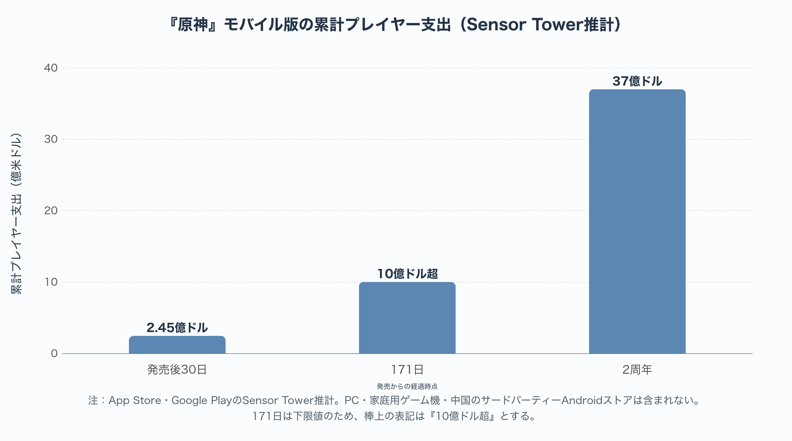
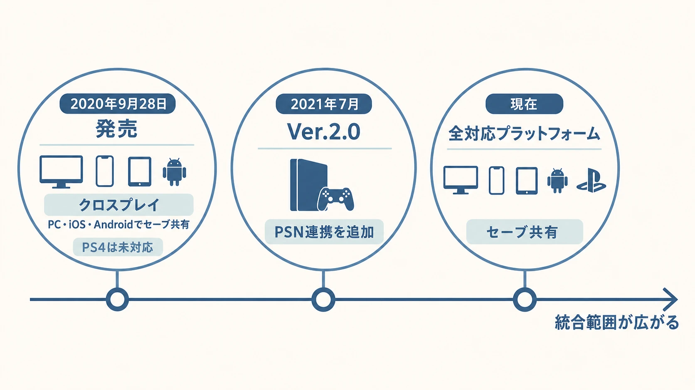
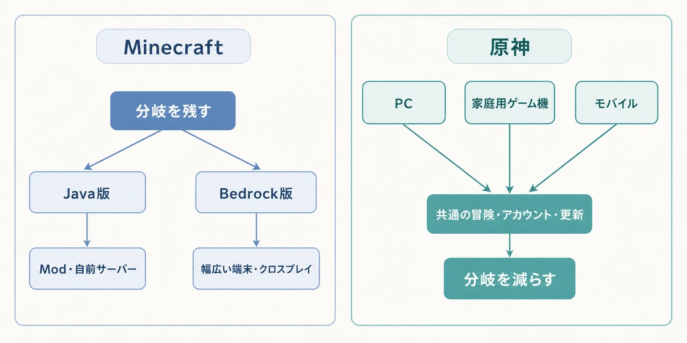
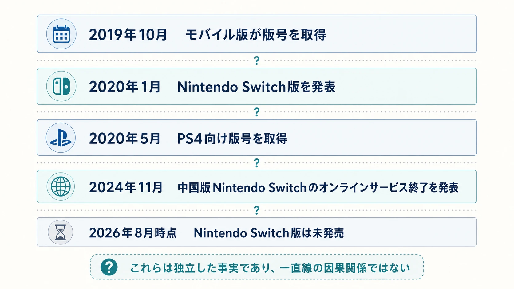

# 『原神』はなぜ超大型タイトルになれたのか――端末を増やし、体験を分岐させない設計

2020年9月28日、miHoYoは『原神』をPS4、PC、iOS、Androidで世界同時にサービス開始した。[[1](#ref-1)] 発売後30日間のモバイル売上は、Sensor Tower推計で約2億4,500万ドルに達した。[[2](#ref-2)] 同社の推計では、モバイル版は171日で累計10億ドルを超え、2周年時点では37億ドルに達している。[[3](#ref-3)][[4](#ref-4)][[5](#ref-5)]

ただし、これらはApp StoreとGoogle Playでのプレイヤー支出の推計であり、PC、家庭用ゲーム機、中国のサードパーティーAndroidストアは含まれない。数字を読む際には「全プラットフォームの売上」ではないことを外してはならない。また、2022年5月に公表された累計30億ドル時点の市場構成は、中国30.7％（中国iOSのみ）、日本23.7％、米国19.7％である。[[5](#ref-5)] これは2022年末の地域構成ではない。37億ドルという2周年時点の推計とも、同じ基準日として混ぜてはいけない。

この規模を、スマートフォン向けの基本プレイ無料ゲームが「たまたま広く売れた」結果とだけ捉えると、設計上の核を見落とす。本稿が読むのは、PC、家庭用ゲーム機、モバイルを別々の商品へ分けず、同じテイワットの冒険へ寄せようとした判断である。これは、MinecraftがJava版とBedrock版をあえて一つに畳み切らなかった判断と、対称的な位置にある。

*図：App Store・Google PlayにおけるSensor Tower推計。PC・家庭用ゲーム機・中国のサードパーティーAndroidストアは含まれない。171日は下限値のため、棒上の表記を「10億ドル超」とした。*

***

## 「マルチプラットフォーム」と「一つの作品」を分けて考える

複数の端末に出すこと自体は、販売窓口を増やす判断である。しかし、それだけではプレイヤーが同じ作品を遊んでいることにはならない。プラットフォームごとにサーバー、セーブデータ、アップデート、購入したキャラクターが別なら、実質的には別の商品になる。

『原神』は発売前から、PS4、PC、iOS、Androidのクロスプレイを明言していた。[[6](#ref-6)] そのうえで、PC・iOS・Android間では同一アカウントのセーブデータを共有し、Ver.2.0ではPSNアカウントとmiHoYoアカウントの連携によるセーブデータ共有も追加した。公式FAQは、連携後に進行度とゲーム内データを共有できるとしている。[[7](#ref-7)]

ここには重要な順序がある。発売時点のPS4版はクロスプレイに参加できたが、PC・モバイルとのクロスセーブはまだできなかった。後から統合範囲を広げたのである。したがって「発売初日から全端末で完全に同じセーブデータだった」と言うのは正確ではない。一方、端末ごとに別の本編や別の成長経路を作るのでなく、アカウント連携を完成させる方向を取り続けたことは明確である。

*図：クロスプレイからPSN連携を経て、アカウント連携によるセーブ共有の範囲が広がった経過。*

### 端末は入れ替わっても、冒険の履歴は残す

「一つの作品」とは、対応ハードを永久に固定することではない。『原神』は2021年4月28日にPS5版を正式リリースし、4K表示と高速な読み込みを前面に出した。[[8](#ref-8)] 反対にPS4版は、2025年8月の告知に基づき、同年9月に新規配信、2026年2月にゲーム内購入を順次終了し、2026年4月8日にアップデート対応とログインを終了した。公式はPS4プレイヤーにPS5またはほかの対応プラットフォームへの移行を案内し、進行度は影響を受けないとしている。[[9](#ref-9)]

この移行は、PS4版を別作品として残すのではなく、同じアカウントの履歴を新しい端末へ引き継ぐための運用である。すべてのクライアントを同じ寿命にそろえることよりも、端末の世代交代に合わせて入口を更新し、プレイヤーの投下時間を持ち運べることを優先した。ここでも、作品の連続性と、個々のハードの継続可否は別の判断として扱われている。

この選択は、プレイヤーにとって「通勤中にスマートフォンで素材を集め、帰宅後にPCや家庭用ゲーム機で任務を進める」という切り替えを可能にする。開発側にとっては、端末ごとのUI、操作、性能、ストア要件を抱えながら、クエスト、キャラクター、イベント、報酬の意味を一つに保つ選択になる。機種を増やすほど、同じ更新を同じサービスへ着地させる難しさも増す。

### Minecraftとの対称性

[Minecraftの記事](minecraft-endless-design-java-bedrock-strategy.md)で扱ったJava版／Bedrock版の分離は、広い端末への接続性をBedrockへ集約しながら、Modや自前サーバーを核とするJava版を残す判断であった。公式の比較ページも、両版のクロスプレイ範囲とサーバーの持ち方を分けて案内している。[[10](#ref-10)] あちらは、異なる改変文化を一つの標準へ押し込まないことに価値があった。

対して『原神』が守ろうとしたのは、追加コンテンツを受け取り、キャラクターを育て、仲間と遊ぶという長期サービスの連続性である。Java版のように別々の改変文化を維持する必要が中心にはない。ならば、端末の性能差を理由に冒険の履歴まで分けるより、同じ履歴へ戻れるようにする便益が大きい。両者に優劣はない。どの差を製品価値として残し、どの差を利用者に背負わせないかが違うのである。

*図：Minecraftと『原神』は、優劣ではなく残す分岐と減らす分岐の設計目的が異なる。*

***

## Nintendo Switch版の空白が示す、対応範囲の限界

miHoYoは2020年1月、Nintendo Switch版をリリースすると発表した。[[11](#ref-11)] しかし2026年8月時点で、発表されたNintendo Switch版は発売されていない。これは「全プラットフォームを同じ体験へ寄せる」という方針が、すべてのハードに無条件で適用できるわけではないことを示す。

もっとも、未発売の理由を外部から一つに決めることはできない。オープンワールドを継続更新する作品では、CPU・GPU性能、メモリ、ストレージ容量、ロード、発熱、通信、認証と課金の導線を同時に満たす必要がある。実際、HoYoverseはPS4版のサービス終了について、機器性能とプラットフォーム上のアプリ容量の制限を理由に挙げている。[[12](#ref-12)] Nintendo Switchの性能制約は、移植の難所を考えるうえで当然に検討すべき論点ではある。しかし、このPS4版の説明はNintendo Switch版の未発売理由を示すものではない。HoYoverseが未発売の決定理由を性能だと公表したわけではなく、性能だけを原因と断定してはならない。

中国市場の制度と流通の事情も、別の事実として置く必要がある。『原神』は2019年10月にモバイル版の版号を得たと中国ゲームメディアが報じ、PS4向けの版号は2019年12月ではなく、2020年5月の公示で確認できる。[[13](#ref-13)][[14](#ref-14)] 一方、任天堂は2019年4月にテンセントとの中国展開の協業を発表し、同年12月にはテンセントを正規販売代理店とする中国版Nintendo Switchの発売を発表した。[[15](#ref-15)][[16](#ref-16)]

さらにテンセントは2024年11月、中国版Nintendo SwitchのNintendo eショップにおける販売を2026年3月31日に止め、ダウンロード、コード引き換え、その他のオンライン関連サービスを同年5月15日に終了すると発表した。[[17](#ref-17)] 版号を得た事実、中国版Nintendo Switchのオンラインサービスが終了した事実、Nintendo Switch版『原神』が発売されていない事実は、いずれも重要である。ただし、これらを一直線の因果関係にはできない。開発進行、技術判断、契約、地域別の事業優先度は公表されていないからである。

*図：これらは独立した事実であり、一直線の因果関係ではない。*

プランナーがここから受け取るべきなのは、「全ハードに出す」と「アカウントを一つにする」は別々の約束だということである。後者を守るために、対応ハードを増やす順序や、あるハードを見送る判断さえ必要になり得る。

***

## 追随例との比較で見える、『原神』固有の判断

『原神』の後、中国発の基本プレイ無料オープンワールドRPGがPCとモバイルを同時に狙うことは珍しくなくなった。たとえば『Tower of Fantasy（幻塔）』は、PC、iOS、Androidの間でキャラクター、進行、購入情報を共有し、クロスプラットフォームで遊べると公式に案内している。[[18](#ref-18)]

だが、同作のPlayStation版は2023年に別サービスとして発売され、PC・モバイル版とのクロスプラットフォーム接続やデータ移行はできなかったと報じられている。[[19](#ref-19)] この違いは、マルチプラットフォームという言葉だけでは設計を比較できないことをよく表す。

本稿の問いは、後続作がどれだけ似た構成を採ったかではない。『原神』が、長い探索とキャラクター育成を、最初から特定の端末だけの習慣に閉じなかった理由である。新しい地域や人物を追加するたび、プレイヤーがどの端末から入るかは変わり得る。そのたびに最初から育成をやり直させることは、コンテンツを増やすほど大きな摩擦になる。アカウントと更新を共通にすることは、その摩擦を将来に持ち越さないための選択だったと読める。

***

## F2Pの入口と、コンシューマー級の期待をつなぐ

『原神』の入口は基本プレイ無料である。App Storeの公式掲載でも、無料でダウンロードできアプリ内課金があることが示されている。[[20](#ref-20)] プレイヤーは購入前に数時間の体験版で品定めするのではなく、探索、任務、戦闘の手触りを自分の端末で確かめられる。広告による中断を挟まず探索や任務を自分のペースで進められることも、広い空間を歩き、物語を追う体験と整合しやすい。

これは「無課金で全要素を即座に得られる」こととは別である。キャラクターや武器の獲得には課金を含む抽選型の仕組みがあり、育成素材の取得には時間に関わる制約もある。課金設計の評価を、広告がない一点だけで肯定も否定もできない。それでも、探索や任務の入り口を料金や広告中断で細かく分けないことは、幅広い端末で同じ第一印象を作る設計として意味を持つ。

その第一印象は、ゲーム内の最低限の入口だけで終わらない。Sensor Towerは、地域、キャラクター、ゲームプレイ要素を継続的に追加するライブ運営を売上継続の背景として挙げている。[[5](#ref-5)] プレイヤーから見える制作価値には、フルボイスの会話、演出用の映像、地域ごとの音楽と景観、イベントの仕立てが含まれる。これらは一度作って終わりではなく、更新のたびに期待値として積み上がる。

ここで「収益がそのまま映像制作費へ回った」といった直接の因果は、公表資料だけでは言えない。miHoYo／HoYoverseは作品別の再投資額を詳細に開示していないからである。より慎重には、次のような循環として捉えられる。

1. 無料かつ広告なしの入口と、端末をまたぐ継続性が、試す人と戻る人を増やす。
2. 一部のプレイヤーが、欲しいキャラクター、武器、成長を理由に支出する。
3. 支出を含む継続運営の基盤が、新地域、任務、音声、映像、イベントの制作を支える。
4. 追加された制作価値が、次のプレイヤーに「無料で始めてもよい理由」と、既存プレイヤーに「戻る理由」を渡す。

これは公開売上と更新内容から読める事業モデルであり、個々の予算配分を示す内部資料ではない。だからこそ、プランナーは「高品質な演出を増やせば成功する」と短絡してはならない。F2Pの収益化、更新頻度、アカウントの連続性、プレイヤーが最初に失うものの少なさが、同時に回るときに初めて循環になる。

***

## 結び：端末数ではなく、分岐の数を数える

『原神』の規模は、複数プラットフォームへ出したことだけでは説明できない。PC、家庭用ゲーム機、モバイルという異なる入口を設けながら、冒険の進行、キャラクターの育成、継続更新の受け皿を一つのサービスへ寄せたことに特徴がある。発売時点で完全だったわけではなく、PSN連携によるクロスセーブを後から追加した過程にも、その意志が表れている。

Minecraftのように、異なる利用者価値を守るために版を分ける設計は有効である。一方で、『原神』のように、端末差をまたいでも同じサービスへ戻れること自体を価値にする設計もある。前者は分岐を保存し、後者は分岐を減らす。重要なのは、どちらが先進的かではない。

プラットフォームを一つ増やすとき、プランナーが問うべきは「移植できるか」だけではない。その端末のプレイヤーは、既存の仲間、育成、購入、更新履歴へそのまま戻れるのか。それとも別のコミュニティ、別の進行、別の期待値を作るのか。端末を増やすことと、体験を分岐させないことは、同じ意思決定ではない。『原神』は、その二つを分けて考えたからこそ、モバイル発の入口を世界規模の継続サービスへ広げられたのである。

## References

1. [《原神》全球同步公测现已开启][1] - 2020年9月28日のPS4、iOS、Android、PCにおける世界同時サービス開始の公式告知。

2. [Genshin Impact Hits Nearly $250 Million in Its First Month][2] - 発売後30日間のモバイル版プレイヤー支出約2億4,500万ドルのSensor Tower推計。

3. [Genshin Impact Races Past $1 Billion on Mobile in Less Than Six Months][3] - 発売から半年足らずでモバイル版の累計プレイヤー支出が10億ドルを超えたというSensor Tower推計（記事本文に171という具体的日数の記載はない）。

4. [Genshin Impact Generates $3.7 Billion on Mobile in First Two Years][4] - 2周年時点のモバイル版累計37億ドル推計と、計測範囲の説明。

5. [Genshin Impact Surpasses $3 Billion on Mobile, Averages $1 Billion Every Six Months][5] - 2022年5月時点のモバイル版地域構成、計測の除外範囲、定期更新に関するSensor Towerの分析。10億ドル到達までの具体的な日数（171日）もこの記事内で言及されている。

6. [Genshin Impact hits PS4 this fall][6] - PS4、PC、iOS、Androidのクロスプレイを事前に告知したPlayStation Blog記事。

7. [Notice on Cross-Save Function Between Account for PSN and miHoYo Account][7] - Ver.2.0でのPSNアカウントとmiHoYoアカウントの連携、進行度とゲーム内データ共有の公式FAQ。

8. [PS5™『原神』が4月28日(水)に配信開始！ 新世代の進化したオープンワールドを楽しもう！][8] - 2021年4月28日のPS5版正式リリース、4K表示、ロード時間短縮に関する公式説明。

9. [Notice on the Removal and Discontinuation of Updates for Genshin Impact on PS4®][9] - PS4版の新規配信・購入・アップデート対応の終了時期、ログイン停止、ほかの対応プラットフォームへの移行と進行度維持に関する公式告知。

10. [Minecraft Java or Bedrock Edition][10] - Java版とBedrock版のクロスプレイ範囲、サーバー運用の違いを示す公式比較ページ。

11. [株式会社miHoYoの新作タイトル『原神』、Nintendo Switchでのリリースが決定][11] - 2020年1月のNintendo Switch版発表。

12. [「原神」PS4版がサービス終了。ゲームの配信は9月10日に停止、アプデは2026年4月8日で停止に][12] - PS4版の終了と、機器性能・アプリ容量の制限に関する説明を報じる。

13. [第22批国产版号：21个获批，米哈游《原神》在列][13] - 2019年10月にモバイル版『原神』が版号を得たという中国メディア報道。

14. [2020年第10批国产游戏版号公布][14] - 中国国家新聞出版署による2020年5月の公示を掲載した、PS4向け『原神』の版号報道。

15. [中国でのNintendo Switchの発売について（2019年4月26日）][15] - 任天堂とテンセントによる中国でのNintendo Switch展開に向けた協業発表。

16. [中国でのNintendo Switchの発売について（2019年12月4日）][16] - テンセントを中国の正規販売代理店とするNintendo Switch発売の任天堂公式発表。

17. [腾讯国行 Switch 将于 2026 年 3 月 31 日起逐步停止任天堂 e 商店和其他网络相关运营服务][17] - 2024年11月のテンセント発表を報じる、中国版Nintendo Switchのeショップ販売・オンライン関連サービス終了時期。

18. [Tower of Fantasy Steam version Frequently Asked Questions (FAQ)][18] - PC（Steam版・公式版）、iOS、Android間でのキャラクター、進行、購入情報の共有とクロスプラットフォーム対応を説明する公式FAQ。

19. [Tower of Fantasy for PS5, PS4 launches August 8][19] - PlayStation版がPC・モバイル版と別サービスとして提供され、クロスプラットフォーム接続を持たなかったことの報道。

20. [Genshin Impact - App Store][20] - 無料でダウンロードでき、アプリ内課金があることを示す公式ストア掲載。

[1]: https://ys.mihoyo.com/main/m/news/detail/10015
[2]: https://sensortower.com/blog/genshin-impact-first-month-revenue
[3]: https://sensortower.com/blog/genshin-impact-one-billion-revenue
[4]: https://sensortower.com/blog/genshin-impact-mobile-two-years-analysis
[5]: https://sensortower.com/blog/genshin-impact-three-billion-revenue
[6]: https://blog.playstation.com/2020/08/06/genshin-impact-hits-ps4-this-fall/
[7]: https://www.hoyolab.com/article/533197
[8]: https://blog.ja.playstation.com/2021/04/22/20210422-genshin/
[9]: https://www.hoyolab.com/article/40408849
[10]: https://www.minecraft.net/en-us/article/java-or-bedrock-edition
[11]: https://prtimes.jp/main/html/rd/p/000000015.000048345.html
[12]: https://game.watch.impress.co.jp/docs/news/2037317.html
[13]: https://www.jiemian.com/article/3610477.html
[14]: https://games.sina.cn/cyfw/2020-05-29/detail-iircuyvi5672710.d.html
[15]: https://www.nintendo.co.jp/ir/pdf/2019/190426.pdf
[16]: https://www.nintendo.co.jp/corporate/release/2019/191204.html
[17]: https://www.ithome.com/0/813/359.htm
[18]: https://steamstore-a.akamaihd.net/news/externalpost/steam_community_announcements/4714731755410928335
[19]: https://www.gematsu.com/2023/06/tower-of-fantasy-for-ps5-ps4-launches-august-8
[20]: https://apps.apple.com/us/app/genshin-impact/id1517783697

----

この文書は、Perplexity、Claude、OpenAI Codex の3つのAIの支援を受けて著述されたものです。引用画像を除き、MIT License にて提供されています。
