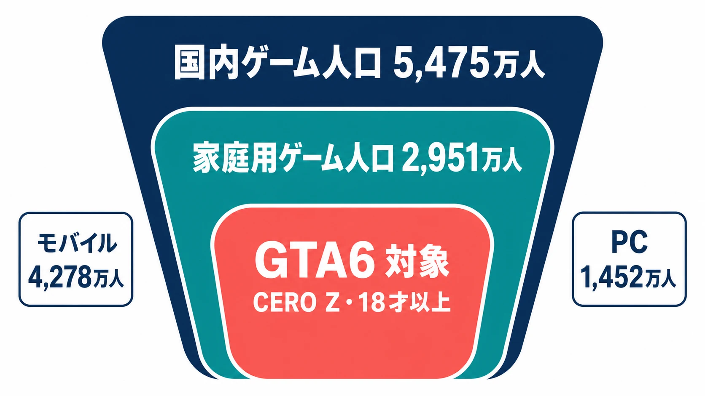
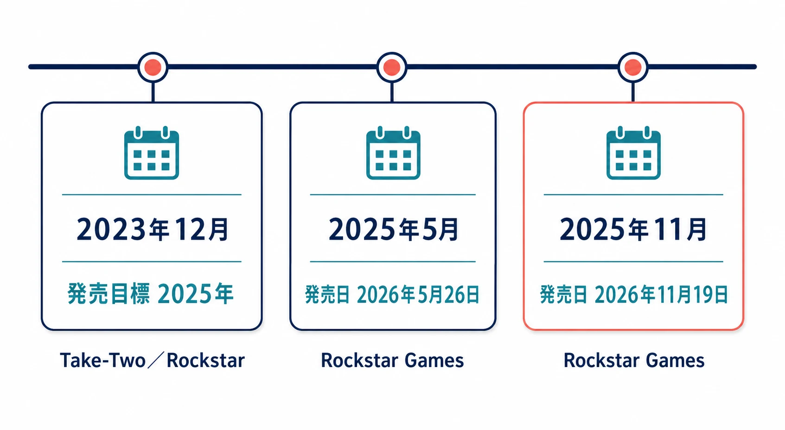
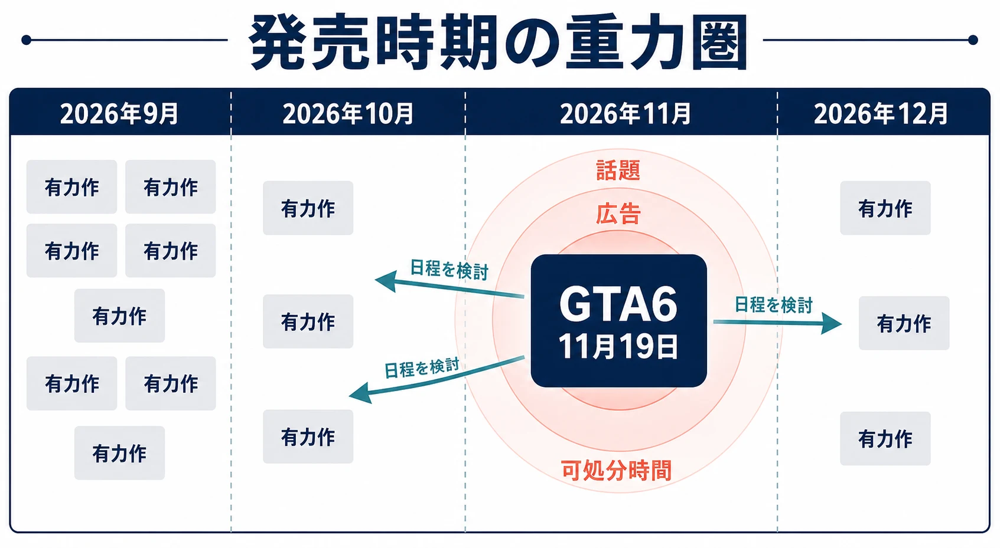
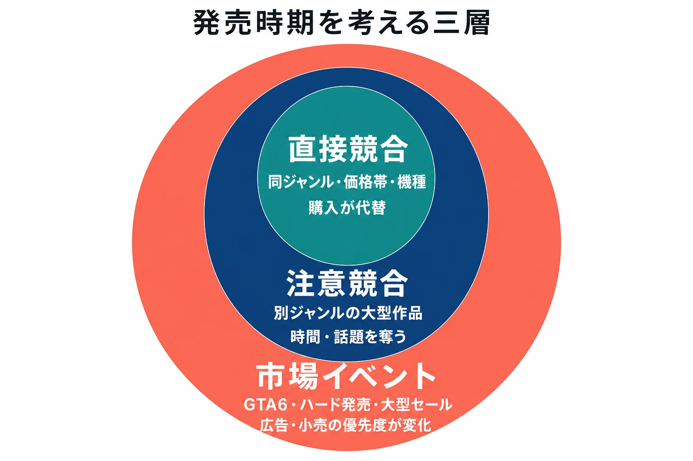

# GTA6再延期はなぜ海外を揺らし、日本では温度差が見えるのか――メガタイトルの「重力圏」と発売時期の設計
### ──2026年11月19日という日付から、グローバル市場を読み解く

Rockstar Gamesは2025年11月7日（Rockstar Newswireの掲載日表記は11月6日）、『グランド・セフト・オートVI』（以下、GTA6）の発売日を2026年11月19日へ変更すると発表した。予定をさらに後ろへ動かす知らせであるにもかかわらず、これは単に一本のゲームの延期としては受け止められなかった。待望論、投資家の反応、競合各社の発売予定までを巻き込む出来事になった。Rockstarは、追加の数か月を「プレイヤーが期待し、受けるに値する水準の磨き込み」のために使うと説明している。[[1](#ref-1)]

一方、日本では「海外ほどの大騒ぎには見えない」と感じる人もいる。この差は、日本のプレイヤーがGTAを知らないからでも、海外だけが誇張しているからでもない。作品が届く年齢層、普段ゲームを買うプラットフォーム、広告が届く場、そして一作が企業業績と発売カレンダーに占める意味が地域で異なるためである。

本稿では、GTA6を「世界で売れる有名作」とだけ捉えず、他社の計画にも判断コストを生じさせるメガタイトルとして読む。なお、発売日は記事執筆時点でRockstar公式サイトが示す2026年11月19日であり、対応機種はPlayStation 5とXbox Series X｜Sである。[[2](#ref-2)]

*画像出典（引用）：Rockstar Games, [Grand Theft Auto VI is Now Set to Launch November 19, 2026](https://www.rockstargames.com/newswire/article/ak3ak31a49a221/grand-theft-auto-vi-is-now-set-to-launch-november-19-2026)。© Rockstar Games 2026. All Rights Reserved. 公式記事に掲載された画像をWebPへ変換して掲載。*

***

## GTAが海外で「スーパーメジャー」になる三つの理由

### 一作の販売規模が、通常の続編とは違う

まず過去作の到達点が大きい。Take-Twoは2023年12月のGTA6発表時点で、『グランド・セフト・オートV』（GTA5）の累計出荷本数を1億9,000万本超、シリーズ累計を4億1,000万本超としていた。これは「新作が出れば注目される」規模ではなく、長い間に複数のハード世代と地域をまたいで顧客基盤を育ててきた規模である。[[3](#ref-3)]

ここでいうオープンワールドとは、広いフィールドを比較的自由に移動し、任務、探索、乗り物、寄り道を自分の順で進められるゲーム設計を指す。GTAはこの形式に、現代都市を舞台にした犯罪劇、車両移動、風刺、オンライン運営を重ねてきた。北米・欧州では、映画やテレビの大人向け娯楽と隣り合う形で、こうした高予算のコンソール向け作品を発売日に購入する層が厚い。したがってGTA6は、既存ファンだけでなく、ハード購入、休暇の予定、友人間の会話まで動かし得る年末商戦のイベントになる。

### Take-Twoにとっては、将来の業績見通しを支える柱である

GTA6の重要性は人気投票だけではない。Take-Twoは再延期を発表した2025年11月の決算で、GTA6を含むラインアップによって2027年度に過去最高のNet Bookingsを見込むと述べた。Net Bookingsはデジタル販売、パッケージの出荷、追加コンテンツ、広告などを含む同社の事業指標である。つまりGTA6の発売時期は、一本の売上だけでなく、会社がいつ大きな収益成長を見込むかという説明の中心に置かれている。[[4](#ref-4)]

延期の発表直後には、好調な四半期決算と通期見通し引き上げが併存していたにもかかわらず、Take-Two株が時間外取引で7％下落したとの報道もあった。これは「延期すれば必ず企業価値が下がる」という単純な法則ではない。だが市場が、完成度の上昇という長期的な期待と、売上・マーケティング・投資回収の時期が後ろへずれる不確実性を同時に値付けすることは示している。[[5](#ref-5)]

このように、ファンの熱狂、販売規模、投資家の期待が同じ発売日に集まる。海外メディアがGTA6を「2026年の一本」ではなく、娯楽市場全体の大型イベントとして扱う背景はここにある。

***

## 日本で見える温度差は、市場の構造から説明できる

### CERO Zという販売条件が、購買層を最初から区切っている

事実から確認する。国内のPlayStation StoreにおいてGTA5はCERO「Z」（18才以上のみ対象）に区分され、18才未満には販売されない。さらにCERO Z作品の本編・体験版の購入には、クレジットカード決済が必須である。[[6](#ref-6)]

ここから導かれる帰結は三つある。第一に、18才未満は正規の購入経路から制度的に除外される。全年齢向けの大作が持つ「子供から大人までを一度に取り込む」市場の広がりを、GTAは日本では最初から持てない。第二に、クレジットカード必須という決済条件は、18才以上であってもカードを持たない層を購入から遠ざける。年齢確認の仕組みとしては合理的だが、購入のハードルとしては確実に一段高い。第三に、家庭内や学校といった、日本で全年齢向け大作の話題が増幅されてきた経路が、対象年齢の壁によって最初から細い。つまり日本での販売本数や話題量は、この狭められた入口を通過した後の数字であり、作品の人気や評価だけを映す鏡ではない。

### 日本のゲーム人口の中心は、GTA6が発売される場所にない

CESAの調査によれば、2024年の国内ゲーム人口5,475万人のうち、最大勢力はモバイルゲーム人口の4,278万人であり、家庭用ゲーム人口は2,951万人、PCゲーム人口は1,452万人である。世界のゲームコンテンツ市場全体でもモバイルが約6割を占め、PC市場は家庭用ゲーム市場を上回る規模に成長している。[[7](#ref-7)]

GTA6が発売されるのはPlayStation 5とXbox Series X｜Sであり、日本のゲーム人口の中心であるモバイルではなく、家庭用ゲーム市場の、さらにその中の「18才以上」という一区画が主戦場になる。一方、北米・欧州では、大人がコンソールの大作を発売日に購入する習慣が市場の太い幹として存在する。海外の熱狂と日本の相対的な静けさは、作品の魅力の差ではなく、この市場構成の差がそのまま数字と話題量に表れたものである。

GTA5は日本で無名だったのではない。日本語表示に対応し、Take-Two Interactive Japanが正規に販売し、大人向け海外大作としての確固たる地位を築いてきた。[[6](#ref-6)] ただしその届き方は、全年齢を横断する国民的キャラクター作品の拡散とは別種のものである。日本の温度差は「知られていない」ことの表れではなく、「届く範囲が販売条件と市場構成で区切られている」ことの表れだ、と読むのが正確である。

*図：CESAが公表した2024年の国内ゲーム人口を基に、GTA6が届く市場を段階的に表した模式図。CERO Z対象人口の数値は公表されていない。[[6](#ref-6)][[7](#ref-7)]*

***

## 二度の延期が意味すること

GTA6の発売予定は、次のように動いた。

| 時点 | 発表された発売目標・日付 | 発表主体 | 読み取れること |
| --- | --- | --- | --- |
| 2023年12月 | 2025年 | Take-Two／Rockstar | 初報は暦年での発売目標だった。[[3](#ref-3)] |
| 2025年5月 | 2026年5月26日 | Rockstar Games | 当初目標から初めて具体的な日付へ変更された。[[8](#ref-8)] |
| 2025年11月 | 2026年11月19日 | Rockstar Games | さらに約6か月の追加期間を取り、磨き込みを理由に再延期した。[[1](#ref-1)] |

最初の延期は、開発の遅れを外部から推測する材料にはなるが、内部の問題の内容までは公表していない。二度目についてRockstarが公式に述べた理由も、追加の時間で期待に見合う水準へ仕上げるため、という範囲である。開発費、機能削減、人員、特定の技術的課題といった未公表の事情を、外部の観測だけで断定してはならない。

ただし、事業上の意味は明瞭である。発売日が決まると、広告出稿、予約、流通、レビュー計画、関連するオンライン施策、決算見通しが連動する。延期は開発チームだけの予定変更ではなく、その連動を再計算する仕事になる。Take-Twoが2027年度の記録的な業績見通しをGTA6と結び付けたことは、この一本が同社の計画に持つ比重を端的に示す。[[4](#ref-4)]

*図：Rockstar GamesとTake-Twoの公式発表に基づく発売時期の推移。[[1](#ref-1)][[3](#ref-3)][[8](#ref-8)]*

***

## 2026年後半に生まれた「GTA6の重力圏」

発売時期の競合は、同じジャンルの作品同士だけで起こるわけではない。プレイヤーの可処分時間、可処分所得、配信者やメディアの注目枠は有限である。特に発売直後の数週間は、ネタバレを避けたい人、友人と同時に遊びたい人、実況を見たい人が一つの大作へ集まりやすい。ここでいう「重力圏」とは、巨大IPの発売日が、その作品と直接競合しないタイトルまで含めて、周辺の発売・宣伝判断を引き寄せる状態を指す。

実際、2026年9月には『Marvel’s Wolverine』『ファイアーエムブレム 万紫千紅』『CONTROL Resonant（コントロール レゾナント）』など、複数の有力作が近い日程に並ぶ。GameSpotも、GTA6が11月に発売されることを背景に、開発各社が前後の月へ日程を配置しようとして9月が過密になったと報じている。[[9](#ref-9)][[10](#ref-10)][[11](#ref-11)]

ただし、「大手パブリッシャーがすべてGTA6を避けて前倒しした」と断定するのは早い。発売日の決定には、開発の完成度、プラットフォームホルダーの施策、シリーズの例年枠、地域別の祝日、社内の販売目標が絡むからである。個別の会社がGTA6を理由に移動したと公式に説明しない限り、外部から因果を確定することはできない。

それでも、11月19日の正面衝突を避け、春から秋、とりわけ9月・10月の選択肢を検討する誘因は大きい。これは「GTAより売れないから」ではなく、初週の話題、広告効率、レビュー露出、配信視聴、オンライン人口の獲得を同時に失う確率を下げるためのマーケティング判断である。小さな作品ほど、同じ顧客に届くための広告費を追加で払えない。大作ほど、数年かけた投資の初動を他作品の話題に埋もれさせたくない。こうして空いたはずの前後月が過密になる。

*図：メガタイトルの発売日が周辺月の発売・宣伝判断に与え得る影響を表した模式図。個別作品の発売日変更について、GTA6との因果関係を示すものではない。*

***

## 新人プランナーが持つべき三つの見方

### 1. 発売日を「カレンダーの空き」だけで決めない

発売日の候補を比較する際は、競合の本数予測だけでなく、顧客の時間、広告単価、配信露出、既存タイトルの大型アップデート、セール時期までを見る必要がある。GTA6級の作品は、発売月だけでなく予約開始、トレーラー公開、レビュー解禁の段階から周辺の話題を吸う。これが重力圏である。

実務では、次の三層で競合を分けると考えやすい。

| 層 | 確認する相手 | 主なリスク |
| --- | --- | --- |
| 直接競合 | 同じジャンル・価格帯・対応機種の作品 | 購入が代替される |
| 注意競合 | 別ジャンルでも同じ遊ぶ時間を奪う大型作品 | 配信・会話・プレイ時間を取られる |
| 市場イベント | GTA6のようなメガタイトル、ハード発売、大型セール | 宣伝の到達率や小売の優先度が変わる |

*図：発売時期の検討で確認する競合・市場イベントを三層に整理した模式図。*

### 2. 海外のヒット規模を、そのまま日本のKPIにしない

KPIとは、施策や事業の状態を測るために置く重要業績評価指標である。世界販売本数、予約数、ウィッシュリスト、同時接続、動画視聴数はいずれも重要だが、地域ごとの意味は同じではない。GTAのグローバルな規模は「国内でも同じ比率で売れる」ことの証明ではない。

日本の数値を見るなら、年齢区分、対応プラットフォーム、ローカライズの質、国内向け広告の到達、価格、配信視聴と購入の関係を分けて確認するべきである。海外での大成功を根拠に日本の低調を「失敗」と呼ぶと、そもそもの到達可能な顧客数を取り違える。逆に国内の初動だけから世界展開を悲観することも同じ誤りである。

### 3. 「日本だけ伸びない」を、すぐにローカライズの失敗と決めない

グローバル同時発売で日本の数字が期待を下回ったとき、最初に調べるべきは翻訳の良し悪しだけではない。購入に至るまでの漏斗を分解する。

1. **到達**：国内で情報が届いたか。年齢区分や広告面の制約で、狙う層へ届いているか。
2. **関心**：題材、操作、価格、対応機種が国内の対象層に合っているか。
3. **購入**：発売日が他の大作、セール、ハード購入と衝突していないか。
4. **継続**：オンライン要素があるなら、地域人口、通信品質、イベント時刻、コミュニティ導線が機能しているか。

この順に見ると、「日本だけ数字が伸びない」は単一原因ではなくなる。GTA6をめぐる温度差も、作品の優劣ではなく、到達範囲と市場の組み合わせとして扱える。

***

## 終わりに：海外ニュースの大きさを、国内の常識で縮めない

GTA6の再延期は、2026年11月19日という日付を後ろへ動かしただけではない。Rockstarにとっては仕上げの時間、Take-Twoにとっては将来の業績の山、競合各社にとっては発売・宣伝の前提条件、プレイヤーにとっては遊ぶ予定を組み替える合図になった。

日本での話題量が海外と同じに見えなくても、それだけで世界的な重要性を小さく見積もってはならない。同時に、海外での熱狂を国内需要へ機械的に写してもならない。市場ごとの年齢区分、プラットフォーム、販売経路、文化的な受容、情報の届き方を分けて見ることが、海外ゲーム業界ニュースを企画判断へ変換する第一歩である。

## References

1. [Grand Theft Auto VI is Now Set to Launch November 19, 2026][1] - Rockstar Gamesによる再延期と追加期間の公式説明。

2. [Grand Theft Auto VI][2] - Rockstar公式サイトの発売日・対応機種表記。

3. [Rockstar Games Announces Grand Theft Auto VI, Coming 2025][3] - 2023年12月時点のGTA5・シリーズ累計出荷本数とGTA6の初期発売目標。

4. [Take-Two Interactive Software, Inc. Reports Results for Fiscal Second Quarter 2026][4] - 再延期発表時のTake-Twoの業績、Net Bookingsの定義、2027年度見通し。

5. [Take-Two stock sinks 7% on delay of Grand Theft Auto VI to November 2026][5] - 再延期発表後、時間外取引でTake-Two株が7%下落したと報じたCNBCの記事。

6. [『グランド・セフト・オートV』(PS4™ & PS5™)][6] - 日本のPlayStation StoreにおけるCERO Z、年齢・購入条件、販売元・表示言語の表記。

7. [ゲーム産業レポート2025][7] - 2024年の国内ゲーム人口と世界市場のプラットフォーム別概況。

8. [Grand Theft Auto VI is Now Coming May 26, 2026][8] - 2025年5月の最初の延期に関するRockstar公式発表。

9. [September Is So Busy For Games That One Of Them Just Got Delayed To Avoid The Others (And GTA 6)][9] - GTA6の前後に発売予定が集中する2026年のカレンダーについての専門メディア報道。

10. [ファイアーエムブレム 万紫千紅][10] - 任天堂による日本語の公式タイトル・発売日表記。

11. [CONTROL Resonant（コントロール レゾナント）][11] - PlayStation Storeの日本語ページにおける公式タイトル表記。

[1]: https://www.rockstargames.com/newswire/article/ak3ak31a49a221/grand-theft-auto-vi-is-now-set-to-launch-november-19-2026
[2]: https://www.rockstargames.com/VI
[3]: https://www.take2games.com/ir/news/rockstar-games-announces-grand-theft-auto-vi-coming-2025
[4]: https://www.take2games.com/ir/news/take-two-interactive-software-inc-reports-results-fiscal-3
[5]: https://www.cnbc.com/2025/11/06/take-two-gta-vi-delay.html
[6]: https://www.playstation.com/ja-jp/games/grand-theft-auto-v/
[7]: https://www.cesa.or.jp/action/industry-research/2025/
[8]: https://www.rockstargames.com/newswire/article/258aa538o412ok/grand-theft-auto-vi-is-now-coming-may-26-2026
[9]: https://www.gamespot.com/articles/september-is-so-busy-for-games-that-one-of-them-just-got-delayed-to-avoid-the-others-and-gta-6/
[10]: https://www.nintendo.com/jp/games/switch2/aacsa/index.html
[11]: https://www.playstation.com/ja-jp/games/control-resonant/

----

この文書は、Perplexity、Claude、OpenAI Codex の3つのAIの支援を受けて著述されたものです。引用画像を除き、MIT License にて提供されています。
