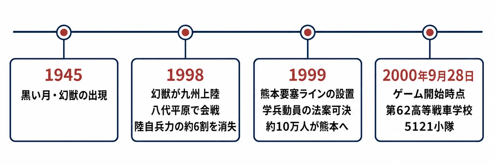
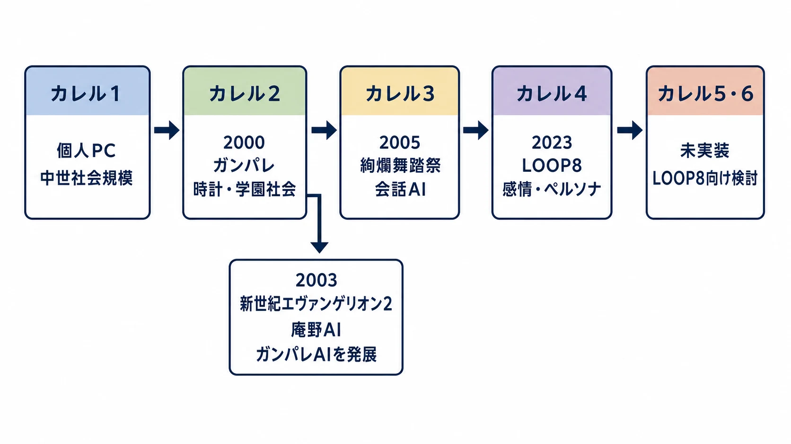

# 『高機動幻想ガンパレード・マーチ』はなぜNPCが生きて見えたのか――カレル2から学ぶ、再現できる設計と再現できない条件

> **用語注記：「世界観」という言葉について**
>
> 「世界観」（Weltanschauung）は本来、「ある人物がこの世界をどのように捉えているか」という哲学的な概念を指す言葉である。「創作物の舞台設定やデザインのまとまり」を指す用法は本来の語義からの転用であり、規範的には誤用とする立場もある（一方で、現在は主要な国語辞典がこの拡張義を採録している）。本稿では誤解を避けるため、一貫して **「世界設定」** という言葉を使用する。

2000年9月28日にPlayStation向けに発売された『高機動幻想ガンパレード・マーチ』は、学園生活と戦場を同じ日常に置くシミュレーションゲームである。プレイヤーは熊本の第62高等戦車学校に集められた学兵として、授業を受け、部隊の仕事をし、クラスメイトと話し、幻獣との戦闘にも向かう。主人公だけが物語を進める一般的なRPGとは違い、周囲の人物もまた、時間と関係に沿って動く。[[1](#ref-1)][[2](#ref-2)]

発売前の宣伝は店頭配布用リーフレット1枚が事実上の中心で、PS2発売後のPS1末期にひっそりと出た。ところがプレイヤー間の口コミと、『電撃PlayStation』の大きな特集・リプレイ記事が遊び方を伝え、後から売上と評価が追いついた。第5回日本ゲーム大賞優秀賞、第3回SFオンライン大賞ゲーム部門、そして日本SF大会の場での星雲賞メディア部門受賞も、その受容の広がりを示す。星雲賞のメディア部門をゲーム作品が受賞したのはこれが初めてだった。[[2](#ref-2)][[3](#ref-3)][[4](#ref-4)]

この作品はしばしば「AI NPCが意志を持つように動く」と記憶される。しかし、その評価を「当時としては高度なAIだった」の一語で済ませると、企画へ持ち帰れる部分を見失う。カレル2の中心には、個々の人物を賢くしすぎないこと、生活の制約を与えること、プレイヤーが実際に取った行動で物語を組み直すことがあった。本稿は、この再利用可能な設計と、同じ形では戻せない発売条件を分けて読む。

***

## まず前提：自由な学園生活ではなく、失敗が残る戦時下の生活

作中の歴史では、1945年に出現した「幻獣」との戦争が終わらずに続く。九州での戦線崩壊を受け、14〜17歳の少年少女は学籍を残したまま学兵として動員される。ゲーム開始時点でも熊本の防衛線は危うく、学兵は時間稼ぎのために置かれている。紹介記事が記す設定では、1999年に約10万人の学兵が熊本へ集められ、彼らの大半が同年中に死亡すると政府が見込んでいた。[[2](#ref-2)]

この重い設定は、雰囲気づくりだけではない。NPCが戦闘で死ぬ、誰かとの関係が修復できないほど悪化する、部隊の役割が空く、といった変化を「イベントを見逃した」以上の出来事に変える。教室での会話、恋愛、部隊運用は別々のミニゲームではなく、同じ人物と同じ時間を取り合う行為になる。平日に授業を受け、放課後に部隊で働くという通常の生活が、戦況によって突然断ち切られうるからである。[[2](#ref-2)]

*図：『高機動幻想ガンパレード・マーチ』における戦時下設定の経過。本文の参照 [[2](#ref-2)] に基づく。*

ここで重要なのは、NPCの自律性を、AI単体の出来と取り違えないことだ。同じ行動選択でも、無傷で何度でも巻き戻せる学園では「少し変わったランダムイベント」に見えやすい。『ガンパレード・マーチ』では、失われる可能性がある人物と関係を、戦争という継続的な圧力の中に置いた。結果として、NPCの振る舞いに観察者自身の緊張が加わる。

なお、この作品群に共通する固有の共有設定は「無名世界観」と呼ばれる。本稿でいう戦争、学兵、熊本という設定は、その大きな共有設定の説明そのものではなく、『ガンパレード・マーチ』でNPCの変化へ意味を与える局所的な装置として扱う。

***

## カレル2は「人格を再現するAI」ではなく、社会を動かす小さな規則の束である

群体型AIとは、個々のエージェントを万能な知能にする代わりに、単純な規則と役割の組み合わせから集団の振る舞いを作る考え方である。本作で企画・シナリオを担い、開発中には実質的な社内ディレクターも務めた芝村裕吏氏は、カレルの発想を蟻に置いた。蟻の個体は小さな脳しか持たなくても、役割分担と組織を持つ。ならば人間を丸ごと模倣するのでなく、蟻程度の単純さから社会を組めないか、という仮説である。[[5](#ref-5)]

この見方では、NPCは内面を文章で大量に抱えた小説の登場人物ではない。空腹、疲労、好悪、役職、現在地、周囲の人物、時刻といった状態を持ち、その時点で優先度の高い行動を選ぶ存在である。状態機械とは、現在の状態と条件に応じて、取り得る次の状態を決める仕組みを指す。カレル2を「単純な状態機械の組み合わせ」として捉えると、神秘化せずに設計の要点を考えられる。

前身のカレル1は、芝村氏のPC上で動いていた同じ群体型AIであり、中世程度の社会までしか再現できなかったという。カレル2で追加された決定的な要素が「時計」である。学校へ行く時刻、食事をする時刻、勤務に入る時刻を扱えるようになり、より現代的な学園社会へ対象を広げた。[[5](#ref-5)]

この「時計」は、単なる待ち時間ではない。NPCに予定を与え、プレイヤーとのすれ違いを生み、行動の理由をつくる制約である。誰かが会話に応じないとき、プレイヤーは必ずしも「会話フラグが立っていない」と受け取らない。その人物には授業、職務、戦闘、別の関係があるのだと解釈できる。少ない規則でも、時間・場所・役割を交差させれば、プレイヤーは行動の因果を補完する。

ただし、カレル2に万能さを読み込むべきではない。後年のインタビューで芝村氏自身は、カレル2のNPCは時間による補正も弱く、高度に完成したNPCではなかったと振り返る。また、当時は人が群れる表現も限られ、主人公の周囲に人が集まる程度だったという。[[6](#ref-6)] だからこそ学べるのは、完全な人格シミュレーションではなく、限られた状態からプレイヤーが「その人物らしい理由」を読める配置である。

***

## シナリオを守ったのは、思い込みではなくテストプレイの統計だった

カレル2を搭載して人物が自律的に動くようになると、通常のRPGで使われるシナリオ導線が壊れた。複数のNPCへ進行フラグを分散し、「この人からヒントを聞き、次の人と話す」という設計では、プレイヤーが特定の一人だけを好きになった瞬間に進行が止まる。テストでは、依頼を無視する人が多いことも判明した。[[7](#ref-7)]

ここで開発側は「プレイヤーは全員と均等に交流するはずだ」という前提を守らなかった。未経験者を集めて行動を記録し、統計的に多くの人が一人の人物と徹底して仲良くしようとすることを確認した。通常のRPG式フラグ管理を外し、極端には芝村舞と話し続けるだけでもゲームが終わるようなシナリオへ作り直したのである。テストにはアルファ・システムの社員が参加し、当時の社長も腱鞘炎になるほど遊んだと語られている。[[7](#ref-7)]

プランナーがここから持ち帰るべきなのは、「偏愛するプレイヤーを想定する」という一般論だけではない。新しい行動様式を導入した企画ほど、旧ジャンルの常識は観測で壊す必要がある、という手順である。

1. **仮説を明文化する**：誰と話すか、依頼を受けるか、何を無視するかを、仕様の前提として書く。
2. **初見者で観測する**：熟練者や開発者の理解を、一般的な導線と見なさない。
3. **偏りを失敗として捨てない**：多くの人が特定の人物に集中するなら、それはコンテンツ消費の誤りではなく、作品が生んだ欲求である。
4. **フラグより到達保証を先に決める**：どの関係だけを育てても、最低限どの結末と理解に到達できるべきかを設計する。

この方法は、NPCが自由に動くゲームに限らない。プレイヤーの主導権を増やすほど、作者が想定した「当然の行動」は崩れる。数値を集める目的は正解のプレイを矯正することではなく、プレイヤーが実際に選んだ楽しみ方を、失敗しない設計に変換することにある。

***

## 出発点はAIへの憧れではなく、データ制作費への危機感だった

カレル2は、まず「人のようなNPCを作りたい」から始まった企画ではない。1995年頃、アルファ・システムではRPGの開発費が1本およそ3000万円から、スーパーファミコン期に6000万〜7000万円、PS1期には1億円を超えると見積もられていた。開発費がさらに上がれば、外れたときの損失を吸収できず、RPGを継続して作れなくなるという危機感が出発点だった。[[8](#ref-8)]

社内の分析では、費用を押し上げていたのはプログラムだけではなく、シナリオ、グラフィック、演出、敵の数値調整などのデータ制作だった。そこで、手作業で積むデータを圧縮し、プログラム主導で変化を生むRPGを目指した。元プログラマーの社長のもとでプログラマーが厚く、強みでもあった社風は、この方針と噛み合った。[[8](#ref-8)]

この経緯は、「手作りの物語を減らせば安くなる」という単純な教訓ではない。データを減らすなら、代わりに何が繰り返し使われ、誰が検証し、どこに体験の密度を置くのかを先に決めなければならない。カレル2は、個別のイベントを無限に増やす代わりに、人物の状態と時間の組み合わせで変化を作ろうとした。だが開発では、AIに物語を語らせる方法が分からず、シナリオとの結合に苦しんだという。[[5](#ref-5)] コスト構造を変える設計は、別の工程の難しさを消すのではなく、移し替える。

***

## なぜ「カレルを入れる」だけでは再現にならないのか

『ガンパレード・マーチ』は、再現可能な方法と、再現不能な条件が強く絡み合った作品である。これを分けずに「奇跡だから学べない」としても、「カレルを実装すれば再現できる」としても、企画判断を誤る。

| 再現可能な設計 | 同じ形では再現できない条件 |
| --- | --- |
| 小さな状態・役割・時刻を組み合わせ、NPCの行動理由を作る | 1年の予定に対し、実際には約4年まで延びた開発の時間と予算超過 |
| 初見テストの行動を集め、フラグと導線を作り直す | 本来の構想が縮小されたまま発売へ至った、仕様と発売判断の経緯 [[9](#ref-9)] |
| 手作業のデータ量を減らす代わりに、再利用できる規則へ投資する | 店頭リーフレット中心の低い事前露出から、電撃PlayStationの特集と口コミで広がった受容 |
| 世界設定で、NPCの変化に損失と緊張を与える | 当時のPS1末期、販売店、ゲーム雑誌、黎明期のネット掲示板が同時に働いた流通環境 |

開発期間は当初1年に対し、延期分を含め約4年だったと芝村氏は述べている。[[10](#ref-10)] 通常プレイでプレイヤーキャラクターにできるのは速水厚志、芝村舞、田辺真紀、来須銀河、中村光弘の5人であり、裏技では5121小隊の22人全員を選べる。[[11](#ref-11)] 標準の2周目以降では5人に選択肢が絞られていること自体、完成した可能性を無制限に渡すのでなく、発売可能な導線へ収めた形として読むことができる。

同じく外部環境も、仕様書へ再現可能な変数ではない。発売後の作品を電撃PlayStationが大作級に扱い、遊び方をリプレイとして伝えたことは、開発側自身が「自分たちの力だけでは売れなかった」と振り返るほど大きかった。ネットも、まだ一般的ではなかったからこそ情報格差を伴いながら、公式掲示板や口コミを熱量の共有へ変えた。[[12](#ref-12)]

関連作を「作者が同じものを作れなかった証拠」として並べるのも正確ではない。『絢爛舞踏祭』は2005年にSCEから発売され、カレル3と会話のエキスパートAIを用いて、イベントすら不要にする方向を試みた。『ガンパレード・オーケストラ』は物語上の続編だが、イベント性を強めた別の設計である。『LOOP8』は2023年に発売され、カレル4を基盤にしつつ、感情のレイヤーと「ペルソナ」を扱い、イベントも1200個を超える規模へ増やしたとされる。[[13](#ref-13)][[14](#ref-14)]

アルファ・システムはこの技術系列を、自社の完全新規IPだけでなく他社IPの版権ゲームにも応用している。2003年にバンダイから発売された『新世紀エヴァンゲリオン2』（PS2）は、キャラクターがそれぞれの意志で行動するAIに加え、原作アニメ総監督・庵野秀明氏本人の思考をモデル化してイベントや使徒の出現を制御する「庵野AI（ゲームマスターAI）」を搭載した「ワールドシミュレーター」である。GAME Watchはこの制作方針を「『ガンパレード・マーチ』のAIにさらに磨きをかけて、庵野氏の作風を再現するべく」作り上げたものと紹介しており、システム設計を担当した芝村氏自身も、庵野氏が映像制作時に何を考えていたかを打ち合わせを重ねて確認し、ゲームへ反映させたと説明している。[[15](#ref-15)][[16](#ref-16)][[17](#ref-17)] ここでの「再現できない条件」は、開発費や販売環境ではなく、特定の実在の作家本人と直接対話しながらその思考パターンを抽出するという、他の版権作品には持ち出しにくい製作条件そのものだったといえる。

*図：カレル技術系列と『新世紀エヴァンゲリオン2』の庵野AIへの分岐。本文の参照 [[5](#ref-5)]、[[6](#ref-6)]、[[13](#ref-13)]〜[[17](#ref-17)] に基づく。*

つまり、技術の系列は続いているが、目標、制約、テキスト量、調整方法、販売環境は同一ではない。「当時と同じ評価に至らなかった」と一つの物差しで結論することはできない。ただし、より高機能なカレルがあれば『ガンパレード・マーチ』と同じ手触りが自動的に戻るわけではない、という反証にはなる。技術が真似できても、作家性や受容の条件は真似できないという芝村氏の後年の整理は、この区別をよく表している。[[14](#ref-14)]

***

## 企画に持ち帰るのは「奇跡」ではなく、検証の順番である

『ガンパレード・マーチ』のNPCが生きて見える理由は、AIが人間の心を完全に理解したからではない。簡単な規則で人物を動かし、時計で社会へつなぎ、世界設定で失敗を重くし、初見者の実測で物語の通り道を作り直したからである。プレイヤーは、すべてを説明されない行動の前に、自分で理由を補う。その補完を支える状態と制約が、カレル2の仕事だった。

プランナーが再現すべきなのは、20年以上前のソースコードでも、予算超過を許す制作体制でもない。

- まず、NPCの「賢さ」ではなく、誰がいつどこにいて何を優先するかを小さく定義する。
- 次に、行動が変わったときに失うもの、守りたいものを世界設定とゲーム進行の両方へ置く。
- そして、プレイヤーが実際に偏愛し、無視し、迷った結果で、導線と到達保証を直す。

再現できない偶然まで模倣しようとすると、企画は過去の逸話に縛られる。再現できる設計思想だけを取り出せば、カレル2は「AI NPCの伝説」ではなく、制約を規則へ変え、観測を仕様へ戻すための実務例になる。

## References

1. [Gunparade March : Home Page｜アルファ・システム][1] - PlayStation版の発売日、対応機種、権利表記を参照。

2. [「高機動幻想ガンパレード・マーチ」本日23周年！ 20世紀最後の年に起きた奇跡の宴――あの熱狂の日々を今再び振り返る｜GAME Watch][2] - 発売時の宣伝、口コミ、学兵と戦況の設定、作品の基本構造を参照。

3. [「高機動幻想ガンパレード・マーチ」本日23周年！ 20世紀最後の年に起きた奇跡の宴――あの熱狂の日々を今再び振り返る｜GAME Watch][3] - 第5回日本ゲーム大賞優秀賞、第3回SFオンライン大賞ゲーム部門、日本SF大会の場での星雲賞メディア部門受賞を参照。

4. [SFファンからも高い評価！『ガンパレード・マーチ』が星雲賞メディア部門を受賞！｜電撃オンライン][4] - 星雲賞メディア部門の受賞と、ゲーム作品として初めての受賞だった旨を参照。

5. [『ガンパレ』の企画書、ついに公開――初代PSの伝説的タイトルは、なぜ生まれたのか？（1ページ目）｜電ファミニコゲーマー][5] - 開発費の背景、データ制作費、群体型AI、カレル1からカレル2への「時計」の導入、シナリオ設計を参照。

6. [『ガンパレ』の企画書、ついに公開――初代PSの伝説的タイトルは、なぜ生まれたのか？（5ページ目）｜電ファミニコゲーマー][6] - カレル2の制限と、カレル4との比較を参照。

7. [『ガンパレ』の企画書、ついに公開――初代PSの伝説的タイトルは、なぜ生まれたのか？（1ページ目）｜電ファミニコゲーマー][7] - テストプレイから得た行動傾向、フラグ設計の再構成、社内でのテストを参照。

8. [『ガンパレ』の企画書、ついに公開――初代PSの伝説的タイトルは、なぜ生まれたのか？（1ページ目）｜電ファミニコゲーマー][8] - 1995年頃の開発費認識、データ制作を圧縮する方針、プログラム重視の社内事情を参照。

9. [『ガンパレ』の企画書、ついに公開――初代PSの伝説的タイトルは、なぜ生まれたのか？（4ページ目）｜電ファミニコゲーマー][9] - 当初1,000〜3,000人規模で構想された「フルスケール・ガンパレードマーチ」が、実際の約20人規模まで縮小された経緯を参照。

10. [『ガンパレ』の企画書、ついに公開――初代PSの伝説的タイトルは、なぜ生まれたのか？（1ページ目）｜電ファミニコゲーマー][10] - 当初1年、延期分を含め約4年とする開発期間を参照。

11. [「高機動幻想ガンパレード・マーチ」本日23周年！ 20世紀最後の年に起きた奇跡の宴――あの熱狂の日々を今再び振り返る（2ページ目）｜GAME Watch][11] - 2周目以降のプレイヤーキャラクター選択と、裏技による5121小隊22人の選択を参照。

12. [『ガンパレ』の企画書、ついに公開――初代PSの伝説的タイトルは、なぜ生まれたのか？（2ページ目）｜電ファミニコゲーマー][12] - 電撃PlayStationによる紹介、販売店、公式掲示板とネットを使った情報提供を参照。

13. [『ガンパレ』の企画書、ついに公開――初代PSの伝説的タイトルは、なぜ生まれたのか？（5ページ目）｜電ファミニコゲーマー][13] - 『絢爛舞踏祭』のカレル3と会話のエキスパートAIを参照。

14. [『ガンパレ』の企画書、ついに公開――初代PSの伝説的タイトルは、なぜ生まれたのか？（5ページ目）｜電ファミニコゲーマー][14] - 『LOOP8』のカレル4、感情レイヤー、ペルソナ、技術と作家性に関する発言を参照。

15. [バンダイ、AI化された庵野氏がゲーム世界を演出。PS2「新世紀エヴァンゲリオン2」を11月に発売｜GAME Watch][15] - 『新世紀エヴァンゲリオン2』の概要、ゲームマスターAI「庵野AI」の仕組みを参照。

16. [バンダイ、PS2「新世紀エヴァンゲリオン2」完成記者会見開催。庵野秀明氏とアルファシステム芝村裕吏氏が登場｜GAME Watch][16] - 「『ガンパレード・マーチ』のAIにさらに磨きをかけて」制作されたという紹介を参照。

17. [『エヴァンゲリオン2』完成記念！庵野監督と芝村氏が明かす『エヴァ2』の世界｜電撃オンライン][17] - 芝村氏による庵野氏への取材・思考の反映プロセスに関する説明を参照。

[1]: https://www.alfasystem.net/game/gp/
[2]: https://game.watch.impress.co.jp/docs/kikaku/1529910.html
[3]: https://game.watch.impress.co.jp/docs/kikaku/1529910.html
[4]: https://dengekionline.com/data/news/2001/8/21/fa085c943617e7736168212c6c57148f.html
[5]: https://news.denfaminicogamer.jp/projectbook/230526g
[6]: https://news.denfaminicogamer.jp/projectbook/230526g/5
[7]: https://news.denfaminicogamer.jp/projectbook/230526g
[8]: https://news.denfaminicogamer.jp/projectbook/230526g
[9]: https://news.denfaminicogamer.jp/projectbook/230526g/4
[10]: https://news.denfaminicogamer.jp/projectbook/230526g
[11]: https://game.watch.impress.co.jp/docs/kikaku/1529910-2.html
[12]: https://news.denfaminicogamer.jp/projectbook/230526g/2
[13]: https://news.denfaminicogamer.jp/projectbook/230526g/5
[14]: https://news.denfaminicogamer.jp/projectbook/230526g/5
[15]: https://game.watch.impress.co.jp/docs/20031016/eva.htm
[16]: https://game.watch.impress.co.jp/docs/20031030/eva.htm
[17]: https://dengekionline.com/data/news/2003/10/30/da06e64083185f76d1da5f5417d7a811.html

----

この文書は、Perplexity、Claude、OpenAI Codex の3つのAIの支援を受けて著述されたものです。引用画像を除き、MIT License にて提供されています。
