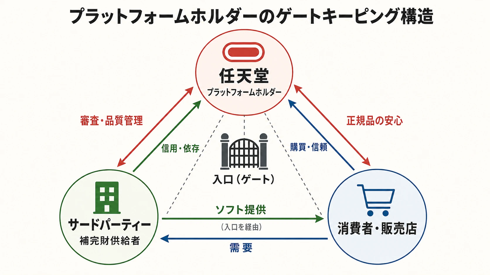

# 山内溥と任天堂のライセンスビジネス——主導権を手放さなかった経営判断

## はじめに：厳しい契約をつくった人、だけでは見誤る

山内溥を語るとき、「強権的な社長がサードパーティーを締めつけた」という説明は分かりやすい。だが、それだけでは重要な点を取り逃がす。

山内が恐れていたのは、一社のソフトが失敗することだけではなかった。質の低い商品や過剰在庫が増え、販売店と消費者の信頼が崩れ、 **ゲーム機を中心とする市場全体が消えること** だった。その損失を最後に引き受けるのは誰か。品質、供給量、流通を誰が止められるのか。そこから逆算すると、山内にとってプラットフォームの主導権は、収益源であると同時に破綻を防ぐブレーキだった。

ここでいう **プラットフォーム** とは、ゲーム機だけでなく、その上でソフトを開発・製造・販売するための共通基盤を指す。本稿ではライセンス契約の条件を再掲しない。制度の詳しい仕組みは別記事に譲り、山内がなぜ制御を選び、なぜ後に譲れなくなったのかを追う。

先に結論を言えば、その判断は単純な「先見の明」ではない。多角化の失敗から得た生存感覚、娯楽商品の短命さへの恐れ、ソフトの希少性を守る発想、そして決定権を一か所に集める経営手法が重なったものだった。同じ一貫性が任天堂を強くし、同時に環境変化への適応を難しくした。

----

## 22歳の社長が学んだのは、成功法則ではなく不安定さだった

山内は1949年、祖父の後を継いで22歳で社長に就いた。任天堂の公式社史にも、この年の社長就任が記録されている。会社は当時、花札やトランプを主力とする京都のメーカーだった。[[1](#ref-1)]

のちの成功だけを見ると、カード会社をゲーム会社へ計画的に転換したように見える。しかし本人の回顧はもっと切迫している。1989年のインタビューで山内は、じっとしていれば沈むためにもがいた結果が任天堂になったと説明し、 **「成功は目的じゃなくて結果だ」** と語った。[[2](#ref-2)]

カード市場の先行きに限界を感じた任天堂は、タクシーや食品などへ事業を広げたものの、うまくいかなかった。玩具へ戻った後も、家庭用光線銃の大型案件がオイルショックの影響で取り消され、経営が瀬戸際に立ったと報じられている。[[3](#ref-3)]

この経験から、少なくとも二つの判断軸が見える。

- **売れている商品を永続する事業と見なさない。** 娯楽は生活必需品ではなく、飽きられれば需要が消える。
- **自社が勝てる場所を選ぶ。** 既存玩具では専業メーカーの蓄積に勝てないため、任天堂はエレクトロニクスとの組み合わせへ進んだ。[[2](#ref-2)]

これは「失敗したから慎重になった」というだけではない。山内の慎重さは、投資を小さくする方向ではなく、 **勝つと決めた市場では主導権を確保する方向** へ働いた。ここが、一般的なリスク回避と異なる。

横井軍平のウルトラハンドを商品化し、宮本茂らにゲーム開発の機会を与えたのも山内だった。山内自身が設計したのではない。技術や表現の才能を見つけ、会社の資源を集中し、市場に出すかどうかを決める役割を握ったのである。横井の「制約から遊びをつくる」設計思想と、山内の「どこに賭け、誰に任せるか」という経営判断は、対になる関係だった。

----

## なぜ「自由」ではなく「制御」だったのか

### 山内が見ていたのは、一本の品質より市場の連鎖だった

1984年のインタビューで、山内は娯楽を **「遊ぶ時間を売る商売」** と表現し、その難しさを語っている。商品を一度買ってもらえば終わりではない。限られた余暇を次も任天堂の遊びに使ってもらわなければ、市場は続かない。[[4](#ref-4)]

この前提に立つと、粗悪なソフトの損害は発売元だけに閉じない。購入者はパッケージを開けるまで面白さを十分に判断できず、失望すると次のソフトや本体そのものを疑う。販売店は返品や値崩れを恐れ、棚を減らす。すると良作まで届きにくくなる。これは **負の外部性** 、つまり一社の判断が取引外の他社や市場全体へ損失を及ぼす状態である。

山内は1986年、アタリの崩壊を、外部メーカーへ自由を与えすぎて低品質なゲームが市場にあふれた結果だと説明した。市場崩壊には過剰生産、流通、家庭用コンピューターとの競争など複数の原因があり、この発言は完全な歴史分析ではない。それでも、 **山内が何を最大リスクと認識していたか** を示す本人発言として重要である。[[5](#ref-5)]

つまり彼の問いは、「各社が自由に作れば良作が増えるか」ではなく、次のようなものだった。

1. 参入者の利害と、市場を長く維持する利害は一致するのか。
2. 売り逃げや過剰供給が起きたとき、誰が止めるのか。
3. 失敗の費用を負う者が、発売の決定権も持っているか。

山内の答えは、プラットフォームホルダーである任天堂がゲートを握ることだった。 **ゲートキーピング** とは、誰が市場へ参加し、何を流通させるかを入口で管理することをいう。制度の個別条件は別記事の領域だが、その思想は「優越感を示すための制限」より、「市場全体の失敗を一社で止めるための集中管理」と捉えるほうが本人の説明に近い。

### 対等な協業より、最終決定権を重く見た

ただし、目的が市場保護なら、手段が何でも正当化されるわけではない。ここは功罪を分けて考える必要がある。

任天堂は、自社だけでは十分な種類のソフトを供給できない。サードパーティーは不可欠な **補完財供給者** である。補完財とは、本体と組み合わせて初めて価値を生む商品をいう。研究でも、ゲーム機の普及には外部ソフト会社との協調が必要である一方、望ましい規格や導入時期が各社で異なるため、調整が難しいと整理されている。[[6](#ref-6)]

山内はこの難しさを、対等な合議で解くより、任天堂が最終判断を持つことで解こうとした。それは多角化期の学習ともつながる。不得意な市場へ参加者の一社として入ると、既存企業の技術、流通、規模に負ける。反対に、自社が規格と入口を握る市場なら、任天堂の「面白いかどうか」という評価を競争力に変えられる。

この構図では、品質管理と交渉力が同じ装置から生まれる。任天堂が入口を管理すれば、消費者に一定の安心を与えられる。一方で、ソフト会社は任天堂の判断に従わなければ顧客へ届きにくい。 **品質を守る権限と、取引相手へ圧力をかける権限を分離しにくい** のである。

*任天堂、サードパーティー、消費者・販売店の関係を、入口（ゲート）に権限が集まる構造として整理した図。*

----

## 「数より面白さ」は、経営上の在庫観でもあった

山内の経営哲学は、しばしば「一発の大ヒットを狙う勝負師」と要約される。だが、本人の言葉から見えるのは、無計画な大勝負というより、娯楽商品の収益分布は均等にならないという認識である。

1996年のテレビインタビューで山内は、ゲームはソフト主導であり、新しい面白さを出し続けられなければ終わると語った。同時に、作品数を増やせば多くが売れるという競合側の考えを批判した。[[7](#ref-7)] 2004年に公表された調査報告も、山内の経営理念を「ヒットははかないもの」であり、売れている間に次の手を考える必要があるという認識として整理している。[[8](#ref-8)]

ここから導かれるのは、次のようなポートフォリオ観である。

- 娯楽商品は、平均的に少しずつ売れるとは限らない。
- 大ヒットは会社を支えるが、再現手順はつくりにくい。
- 作品数を増やすだけでは、開発費と在庫と消費者の探索負担が増える。
- だから入口を絞り、一本ごとの期待値を上げようとする。

これは **ヒット駆動型** の事業設計である。少数の成功作が大きな収益を生み、多数の不発を補う市場の見方を指す。山内の「数より質」は作品評価だけでなく、製造、在庫、流通まで含めた経営判断だった。

ただし、入口を絞れば必ず質が上がるわけではない。新規参入者の実験まで減らせば、将来のヒットの芽を摘む。審査者の好みが固定化すれば、市場の変化を見落とす。管理の強さには、常に次の交換条件がある。

| 判断軸 | 集中管理がもたらすもの | 集中管理が失いやすいもの |
|---|---|---|
| 消費者 | 品質や正規品への安心 | 多様な作品、安価な選択肢 |
| 開発会社 | 大きな市場、ブランドの信用 | 交渉余地、媒体や供給量の自由 |
| プラットフォーム | 品質、供給、収益の統制 | 外部の実験、離反への耐性 |
| 流通 | 商品数を絞った販売計画 | 仕入れ条件や価格形成の自由 |

新人プランナーが学ぶべきなのは、「厳しく審査すればよい」という処方箋ではない。 **失敗の影響範囲に合わせて、誰が決定権を持つべきか** を考えることである。そして、権限を集中するなら、異論や市場変化を拾う別の仕組みが必要になる。

----

## スクウェアとの対立——正しさではなく、前提が分かれた

スクウェアとの対立を、ROMカセット対CD-ROMの性能比較だけで説明すると本質を外す。詳しい時系列や技術条件は別記事で扱っているため、ここでは判断の前提だけを見る。

任天堂側にとって媒体は、単なる記憶容量ではなかった。読み込み速度、製造、在庫、正規品の識別、ライセンス収入を一体で管理する装置だった。一方、スクウェア側にとって重要だったのは、当時目指していた映像表現を実現できる容量と、制作した作品を有利に販売できる条件である。研究では、動きの速い自社ソフトを持つ任天堂にはROMのアクセス速度が合理的だった一方、映像表現を重視するスクウェアにはCD-ROMの大容量が魅力だったと整理されている。[[6](#ref-6)]

ここで争われたのは「どちらの媒体が普遍的に優秀か」ではない。 **プラットフォーム全体の安定を優先する任天堂** と、 **一本の作品表現と事業採算を優先するソフト会社** の目的関数が分かれたのである。

山内が譲らなかった理由は、媒体だけを例外扱いすると、それまで一体で成立していた制御がほどけると見たからだと考えられる。これは本人の内心を直接記録した断言ではなく、発言と制度を結んだ推論である。しかし1996年のインタビューで、山内が32ビット機へ移ったソフト会社を「任天堂の政策のせいにしている」と捉え、作品数を歓迎する競合の姿勢を市場理解の不足として批判したことは確認できる。[[7](#ref-7)]

この語り方には、山内の強さと限界が同時に表れている。

- 強さは、人気企業の離反があっても、自社の原則を短期交渉で変えないこと。
- 限界は、相手の合理性を「市場を理解していない」と処理し、協業条件を作り直す機会を狭めること。

結果を知る後世から「CD-ROMへ移ればよかった」と言うのは簡単である。実務では、媒体変更は品質保証、製造契約、収益配分、在庫責任まで動かす。山内の判断は頑固さだけでなく、 **一つを譲ると運用モデル全体が変わる** というプラットフォーム経営の難しさを示している。

ソニーとの関係でも同じ輪郭が見える。スーパーファミコン用CD-ROMをめぐる協業の破談について、当時ソニー・ミュージック側にいた丸山茂雄は、CD-ROM上の音楽・映像を含むプラットフォームの支配を任天堂が警戒した可能性を回顧している。[[9](#ref-9)] 技術導入の可否より、導入後に誰がソフトと権利の入口を握るかが問題だった、という見方である。

スクウェアとの関係については、当事者本人の証言によって断絶の実態そのものを確認できる。同社に財務担当役員として2000年に入社し、のちに社長・会長を務めた和田洋一は、着任した時点でスクウェアがソニーのプレイステーション以外にソフトを供給しておらず、任天堂から一切の取引を拒まれている唯一のゲーム会社だったと回顧している。[[10](#ref-10)]

和田によれば、この状態は着任当初の社内では深刻に受け止められていなかったが、2001年初頭、関係修復の見込みもないまま任天堂機向けの新作供給を示す社内資料が出たことで局面が変わる。証券会社出身の和田は、この動きが断絶を恒久化しかねないと危惧し、自ら関係修復に動き始めたという。[[10](#ref-10)]

同年10月にソニーから資本を受け入れて経営基盤を立て直したのち、任天堂との取引再開は2002年3月に公表された。[[10](#ref-10)][[11](#ref-11)]

この経緯は、山内が恐れていたものが単なる一本のソフトの出来ではなく、誰が入口を握るかという構造そのものであったことを、対立した当事者の側から裏づけている。

----

## ワンマン経営は、判断速度と認知の偏りを同時に生む

山内は強権的、トップダウンだったと語られる。ただし、怒鳴った、即座に解雇したといった逸話の多くは伝聞が混ざる。確認しやすいのは、任天堂の後継経営陣が、山内の役割を **会社の力を一つに集める決定者** として説明していることだ。

岩田聡は後年、会社には「今回はこれにこだわる」と決める人が必要で、そうしなければ組織の力が分散すると語った。宮本茂も山内の役割は大きかったと振り返っている。[[12](#ref-12)] これはワンマン経営を無条件に称賛する証言ではない。山内型マネジメントの実務上の機能をよく表している。

会議で全員の合意を待てば、責任の所在は曖昧になりやすい。山内が決めるなら、開発チームは制約の中で走れる。ウルトラハンド、ゲーム＆ウオッチ、ファミコンのように、結果が読めない商品へ資源を集中する場面では、この速度が強みになった。

反対に、最終判断者の認識が外れたとき、組織全体が同じ方向へ外れる。サードパーティーとの摩擦や光ディスクへの対応では、その弱点が表面化した。トップダウンの評価は「速かったか」だけでは足りない。

- 決定者へ反対情報が届いたか。
- 前提が変わったとき、過去の原則を再審査できたか。
- 取引相手が退出する選択肢を現実的に見積もったか。
- 一度の判断ミスを吸収できる財務と人材があったか。

山内の経営を実務へ移すなら、豪胆さをまねるのではなく、この確認項目まで持ち帰る必要がある。

----

## 強い入口が生んだブランドと反発

集中管理は、任天堂の正規品であること、一定の審査を通っていることを消費者へ伝えた。また、任天堂は製造と流通を束ねることで、プラットフォームの価値と利益を自社へ集めた。この高収益が、次のハードやソフトへ投資する余力にもなった。

一方、外部企業から見れば、任天堂は競争相手でありながら、市場へ入る門も管理していた。自社ソフトと競合する会社が、他社ソフトの参入条件を決める。ここには構造的な緊張がある。

北米では、アタリ系企業がライセンス慣行を反競争的だとして提訴した。別件では、複数州がNES本体の再販売価格を維持させたと主張し、1991年に任天堂が価格拘束をやめることなどを含む和解が成立した。 **再販売価格維持** とは、メーカーが小売店の販売価格を拘束する行為を指す。[[13](#ref-13)][[14](#ref-14)]

ただし、「任天堂のライセンス制度は違法だった」と一括りにするのも不正確である。独占化を主張した別の訴訟でも、1992年に陪審が任天堂側の主張を認めたと報じられている。この訴訟の原告はアタリ社（Atari Corp.）であり、前段の10NES訴訟の当事者であるアタリ・ゲームズ社（Atari Games Corp.）およびテンゲン社とは別法人である。[[15](#ref-15)] 争点、当事者、結論は事件ごとに異なる。

ここから得られる判断材料は、法務の細部ではなく、 **市場を守るための統制と、市場を閉じる力は同じ場所に宿る** ということだ。管理者が「品質のため」と説明しても、取引先の代替経路が乏しければ、権限は交渉圧力になる。現代のストア審査や配信プラットフォームにも続く課題である。

----

## 最後の大きな判断は、自分の型を継がせないことだった

2002年5月、山内は社長を退き、当時42歳だった岩田聡が後継となった。岩田はHAL研究所でプログラマーと経営者を経験し、2000年に任天堂へ移って経営企画を担当していた。社長交代は任天堂の公式発表と当時の報道で確認できる。[[16](#ref-16)][[17](#ref-17)]

この人事は「血縁より実力」という美談だけで片づけないほうがよい。山内が岩田を選んだ内心の全ては、公開資料からは分からない。それでも、創業家外から初めて社長を選び、ソフト開発と会社再建の双方を知る人物へ渡した事実には、山内の経営哲学との整合性がある。

山内が重視したのは、伝統の形式より会社が生き残ることだった。カード会社の形を守らず、玩具とエレクトロニクスへ移った。外部人材の技術を見て仕事を任せた。そして最後には、山内家が経営することより、娯楽企業を率いる能力を優先したと読める。

同時に、社長交代時には宮本茂、竹田玄洋ら開発・技術の責任者も専務へ昇格した。[[17](#ref-17)] 一人の後継者へ同じワンマン権力をコピーするのではなく、複数の専門家が経営を担う体制へ移した点も重要である。山内の最後の判断は、山内の再現ではなかった。

----

## おわりに：ライセンスは契約書ではなく、失敗の配分設計である

山内溥のライセンス思想を一文でまとめるなら、 **市場が壊れたときの損失を恐れ、その損失を止める決定権を任天堂へ集めた** となる。

その選択は、正規品への信頼、ブランド価値、投資余力を生んだ。任天堂が外部の才能を大きな市場へ接続する土台にもなった。一方で、サードパーティーの自由を狭め、強い反発と離反を招いた。市場の技術と力関係が変わった後も同じ制御を守れば、かつての安全装置が適応の障害になった。

だから、山内から学ぶべきことは「主導権は絶対に渡すな」ではない。実務の問いはもっと細かい。

- その制約は、誰のどんな失敗を防ぐのか。
- 制約の費用は誰が負担し、決定権と釣り合っているか。
- 品質管理が取引支配へ変わる境界はどこか。
- 市場環境が変わったとき、制度を緩める観測点はあるか。
- 強い個人が去った後も、判断の質を保てる組織になっているか。

山内一人がゲーム市場を設計したわけではない。横井軍平、宮本茂、竹田玄洋、荒川實らの仕事、サードパーティーのソフト、玩具流通、半導体の低価格化、北米市場の崩壊と再建が重なっている。それでも、一人の経営者が「どのリスクを最も恐れるか」を定めたことで、契約、製造、流通、人材配置が同じ方向を向き、業界構造まで変わった。

企画も同じである。仕様書に書かれた制約は、誰かのリスク認識が形になったものだ。制約だけを受け継ぐと、時代遅れのルールになる。 **なぜその制約が必要だったのかまで引き継いで初めて、変えるべき時期を判断できる。**

## References

1. [Nintendo 2003 アニュアルレポート 日本語版][1] - 1889年の創業、1949年の山内溥社長就任など、任天堂の公式沿革を掲載。

2. [「他社の類似品は出すな」「面白いと思うものをつくれ」任天堂・山内溥社長の経営哲学][2] - 『致知』1989年掲載の山内溥インタビューを再掲。多角化、電子玩具への進出、生存と成功に対する本人の認識を収録。

3. [山内溥さん 任天堂3代目社長／人様のために貢献する][3] - 日本記者クラブ掲載の元京都新聞記者による取材回顧。若年での就任、多角化、光線銃事業の危機を記述。

4. [任天堂 山内溥社長「娯楽には常に“異質の創造”が必要、改良じゃダメ」][4] - 『週刊ダイヤモンド』1984年12月15日号のインタビュー。電子娯楽への参入と娯楽事業の難しさを本人が説明。

5. [Video Games Gain in Japan, Are Due For Assault on U.S.][5] - 1986年6月20日付『The Vindicator』。アタリ崩壊とサードパーティーの自由に関する山内の認識を報道。

6. [業界標準をめぐる競争戦略——コンピュータおよびゲーム産業における企業間協調と競争][6] - 規格企業と補完財企業の協調問題、および任天堂とスクウェアで異なった媒体選択の合理性を分析。

7. [1996年NINTENDO64発売前 任天堂社長山内溥が語った関西偉人館インタビュー記録][7] - テレビ番組の録画に基づく書き起こし。ソフト主導論、作品数、32ビット機と競合への本人発言を収録。

8. [コンテンツ・プロデュース機能の基盤強化に関する調査研究][8] - 経済産業省の委託調査。任天堂の管理政策、山内の発言、ソフト会社側の負担と批判を整理。

9. [「久夛良木が面白かったからやってただけ」プレイステーションの立役者に訊くその誕生秘話][9] - 当時ソニー・ミュージック側で事業に関わった丸山茂雄による、任天堂とのCD-ROM協業と権利関係についての回顧。

10. [そろそろ語ろうか（其の弐）][10] - 当時スクウェアの財務担当役員（のち社長・CEO）だった和田洋一による回顧録。任天堂との取引断絶の実態と、2001年から2002年にかけての関係修復の経緯を当事者本人の視点で記す。note.comの個人アカウントによる公開だが、当事者本人の一次証言として例外的に採用する。

11. [スクウェアはいかにして出禁状態から任天堂と繋がったのか？ 和田洋一氏がnoteで『ファイナルファンタジー・クリスタルクロニクル リマスター』発売までの軌跡を振り返る][11] - 電ファミニコゲーマーによる和田note記事の紹介記事。和田証言の要旨と、2002年3月の取引再開公表を報じる。

12. [社長が訊く『ニンテンドー3DS』「山内溥、『飛び出さへんのか？』と言う。」][12] - 岩田聡と宮本茂が、山内のこだわりと組織の力を集中させる決定者の役割を説明。

13. [Atari Games Corp. v. Nintendo of America Inc., 975 F.2d 832][13] - 連邦控訴裁判所判決。ライセンス条件、アタリ側の反トラスト法上の主張、10NESをめぐる争いの経緯を記載。

14. [New York v. Nintendo of America, Inc., 775 F. Supp. 671][14] - 全米法務長官協会による事件概要。再販売価格維持をめぐる州側の主張と1991年の和解内容を整理。

15. [Nintendo wins antitrust suit][15] - 1992年、アタリ社による独占化の主張を陪審が認めなかったとするUPIの同時代報道。

16. [代表取締役の異動について（2002年5月24日）][16] - 山内溥の退任と岩田聡の代表取締役社長就任を公表した任天堂の報道資料。

17. [任天堂、山内溥社長が相談役に 42歳の岩田取締役が昇格][17] - 岩田のHAL研究所での開発歴、任天堂での経営企画担当、同時期の役員体制を報道。

[1]: https://www.nintendo.co.jp/kessan/annual0303j.pdf
[2]: https://www.chichi.co.jp/web/nintendo-yamauchi-hiroshi/
[3]: https://www.jnpc.or.jp/journal/interviews/35369
[4]: https://diamond.jp/articles/-/207605
[5]: https://news.google.com/newspapers?id=QBhcAAAAIBAJ&pg=2846%2C1271636
[6]: https://www.jstage.jst.go.jp/article/amr/1/2/1_010201/_pdf/-char/ja
[7]: https://web-academia.org/2134/
[8]: https://producerhub.net/library/339.pdf
[9]: https://news.denfaminicogamer.jp/interview/ps_history/2
[10]: https://note.com/waday/n/n27fb1b6a2838
[11]: https://news.denfaminicogamer.jp/news/200831h
[12]: https://www.nintendo.co.jp/3ds/interview/hardware/vol1/index4.html
[13]: https://law.justia.com/cases/federal/appellate-courts/F2/975/832/163650/
[14]: https://www.naag.org/multistate-case/new-york-v-nintendo-of-america-inc-775-f-supp-671-s-d-n-y-1991/
[15]: https://www.upi.com/Archives/1992/05/01/Nintendo-wins-antitrust-suit/4471704692800/
[16]: https://www.nintendo.co.jp/corporate/release/2002/020524.html
[17]: https://www.itmedia.co.jp/news/0205/24/njbt_06.html

----

この文書は、Perplexity、Claude、OpenAI Codex の3つのAIの支援を受けて著述されたものです。引用画像を除き、MIT License にて提供されています。
