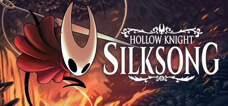
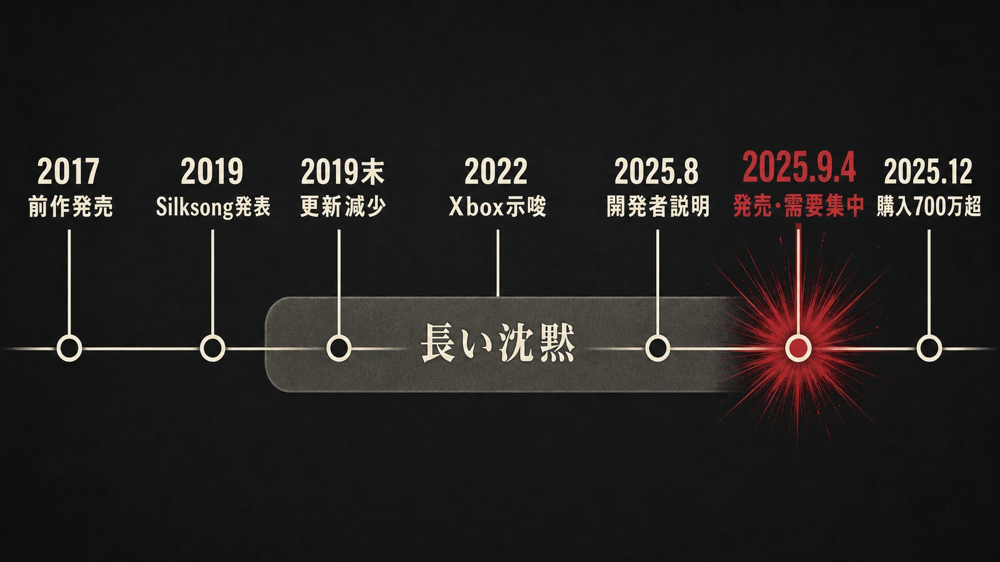
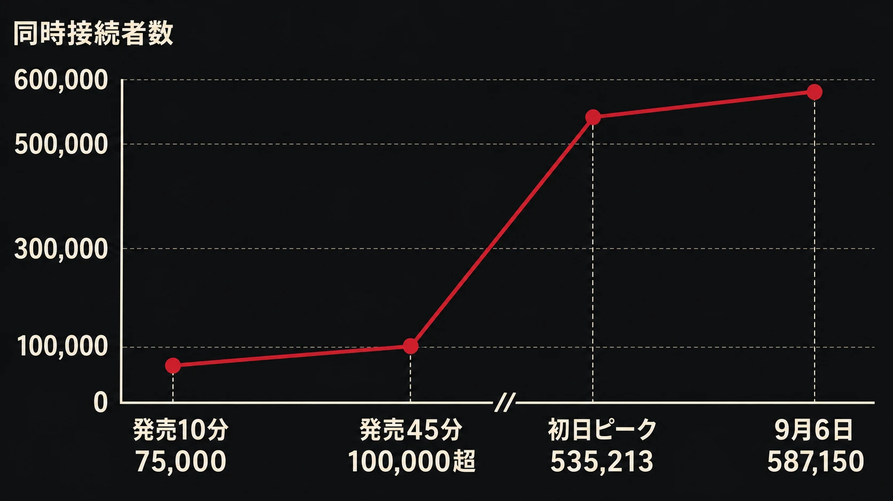
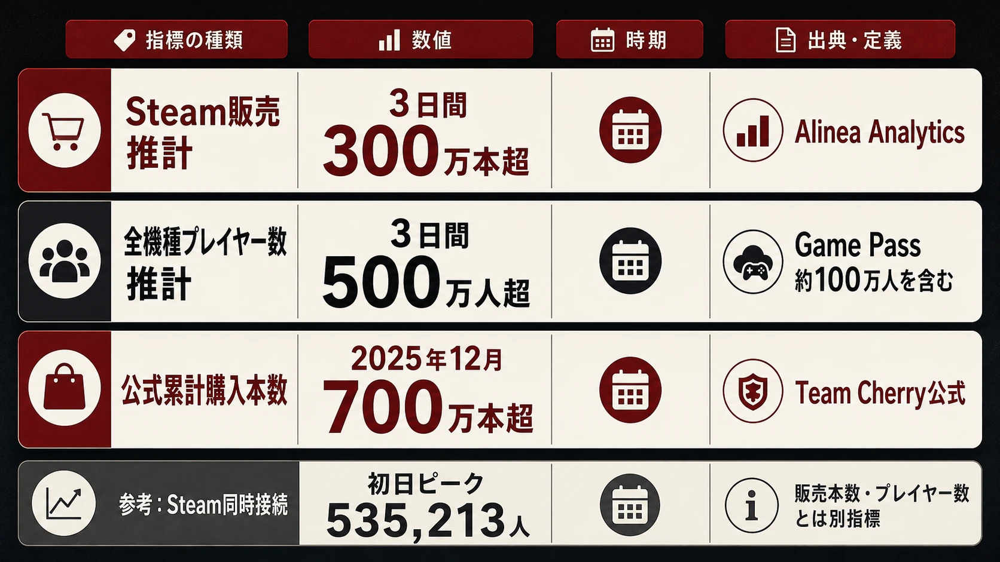
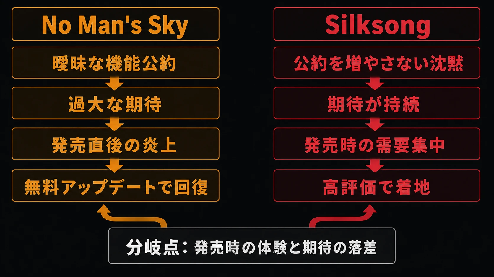

# Hollow Knight: Silksongの発売経緯とその意味――7年の沈黙が、なぜ炎上ではなく好意的な殺到につながったのか

## はじめに：沈黙は「成功する広報戦略」ではない

2025年9月4日、『Hollow Knight: Silksong』の発売直後、Steam、Nintendo eShop、PlayStation Store、Microsoft Storeで購入・配信に関する障害が相次いだ。長い待機期間を経たファンが一斉にストアへ到達し、単一のインディー作品が複数のデジタル販売基盤に負荷をかけた格好である。発売45分以内にSteamだけで同時接続者数は10万人を超え、週末にはさらに記録を伸ばした。[[1](#ref-1)][[2](#ref-2)]

*画像出典（引用）：Team Cherry, [Hollow Knight: Silksong on Steam](https://store.steampowered.com/app/1030300/Hollow_Knight_Silksong/)。Steamストア掲載の公式キービジュアルを、作品紹介のため必要な範囲で引用。WebP変換。*

この出来事を「開発情報を出さなくても、熱狂は保てる」という成功方程式として読むのは危険である。Team Cherryは沈黙を宣伝文句として売ったわけではなく、共同創業者は後に、伝えられることが「まだ制作中である」だけなら反復更新はファンをかえって疲れさせると考えた、と説明している。[[3](#ref-3)]

また、これは[『No Man's Sky』の炎上と復活――期待値管理と運営立て直しの事例](no-mans-sky-expectation-management-case-study.md)と同じ型ではない。あちらは発売時の機能と事前に増幅された期待との隔たりが信頼を損ない、発売後の継続更新で回復していった事例である。Silksongは、長期の不在が不満を生まなかったわけではないが、発売前に機能を曖昧に確約して積み上げたり、大規模な露出で発売時の内容以上を連想させたりする局面が比較的少なかった。そして発売時には、批評と購入者の初動が作品自体を肯定する方向へ働いた。本稿はこの差を「沈黙の美談」ではなく、情報の公約範囲、既存作品への信頼、コミュニティの振る舞い、そして発売時の製品品質が重なった事例として読む。

***

## 1. 続編が背負っていたもの

### 1-1. 小規模チームと、すでに大きかった前作

『Hollow Knight』は2017年2月24日にPC版が発売された。2019年2月のSilksong発表時点で、Team Cherryは前作が280万人超に購入・プレイされたと公表している。これは続編発表の時点で、単なるカルト的人気作ではなく、すでに大きな到達点を持つシリーズだったことを示す数字である。[[4](#ref-4)]

Team Cherryはオーストラリア・アデレードの小規模インディー開発チームである。Ari GibsonとWilliam Pellenは共同ディレクターであり、当時の発表ではコーダーのJack Vineを含む3人で、複数機種版まで含む開発に取り組んでいると記していた。したがって「Ari GibsonとWilliam Pellenの2人だけが7年間の全工程を作った」と単純化するのは正確ではない。一方で、創作と方向付けを担う共同創業者2人を核に、少人数で長期のスコープを抱えたことは確かである。[[3](#ref-3)][[4](#ref-4)]

この規模は、進捗報告の頻度にも影響する。大規模なパブリッシャー組織なら、広報、コミュニティ、開発が別担当になりやすい。少人数チームでは、公開物を作る時間そのものが開発時間と競合しやすい。ただし人数の少なさは沈黙の免責理由ではない。プレイヤーにとっては、発売日・内容・問題発生時の対応という外部から見える約束の方が重要である。

### 1-2. DLCからフル続編へ

2019年2月14日、Team Cherryは『Hollow Knight: Silksong』を正式発表した。Hornetを主役にした企画は、前作発売直後から断片的に作られ始め、当初はDLCとして計画されていた。しかし新しい土地を舞台にする構想が拡大し、開発側自身の説明によれば「大きく、独自性の高い」ものになったため、DLCの枠には収まらずフル続編になった。[[3](#ref-3)]

この変更は、単にコンテンツ量を増やしたという話ではない。DLCなら前作の移動、経済、マップ、物語の前提に乗れる。独立続編では、主人公の移動・戦闘、地形の組み立て、進行のテンポ、敵との相互作用を別の全体として設計し直す必要がある。公開時点でTeam Cherryは新王国、新しいアクション、クラフト用ツール、クエスト、150種超の敵などを掲げていたが、発売日や全機種版を確約する表現は避けていた。[[3](#ref-3)]

ここで重要なのは、規模拡大を「遅延の言い訳」として後から置いたのではなく、発表そのものにDLCから続編への転換理由を含めていた点である。プレイヤーは少なくとも、待ち時間が当初より長くなる理由を、機能リストではなくプロダクトの単位変更として受け取ることができた。

***

## 2. 2019年末以降の沈黙は、何を意味したか

### 2-1. 更新を止めた理由：語れる事実が増えなかった

2019年にはキャラクター紹介やE3出展などの更新があったが、その後、開発側による定期的な進捗報告は途切れた。2025年のインタビューでGibsonは、繰り返し更新しても「まだ制作中である」としか言えず、その反復はかえって人をうんざりさせると感じた、と振り返っている。Pellenも、ただ顔を出して知らせるより、ゲームを作ることが自分たちの責任だと考えたとしている。[[5](#ref-5)]

これは「沈黙には不満を防ぐ効果がある」という実証ではない。むしろ、発信内容が実質的に変わらない場合に、日付や機能を追加で約束して期待の負債を増やさない、という判断だったと読むべきである。開発側は当初、1〜2年静かにしてから発売できると見込んでいたとも語っており、沈黙の長さ自体を精密に設計していたわけでもない。[[5](#ref-5)]

2022年のXboxショーケースでは「今後12か月以内」の作品群にSilksongが含まれたが、結果としてその期間には発売されなかった。このため、完全に無風だったわけではない。ただし、Team Cherry自身が繰り返す発売日を提示したわけではなく、その後に新しい期日や詳細な仕様を重ねて約束する流れにもならなかった。長期開発で最も避けるべきなのは、未確定の予定を更新のたびに確約へ変えることである。

### 2-2. 不満はあった。それでもコミュニティは待機を遊びに変えた

沈黙期のコミュニティを「怒らなかった」と描くのも誤りである。大型イベントのたびに不在を惜しむ投稿や、いつ出るのかという苛立ちは存在した。だが、それは発売済み製品の不具合や公約違反への抗議を中心とする炎上ではなく、道化師の化粧、架空の発表、儀式めいた投稿といった *silkposting* のミームに変換され、参加型の待機文化として長く続いた。報道でも、ほぼ情報のない期間がミームと自嘲を育てたこと、発売を機にその文化が一区切りを迎えたことが記録されている。[[6](#ref-6)][[7](#ref-7)]

ミームは好意の統計ではない。熱心な少数の可視性を高め、疲れた人や離れた人を見えにくくもする。それでも、コミュニティ内で「待つこと」自体を共有可能な冗談にしたことには意味がある。開発側の無言を、ただちに裏切りや未完成の隠蔽と解釈する物語へ一本化させなかったからである。

この転換を可能にした前提は、前作で積み上がった信頼と、機能面の大きな確約を追加し続けなかったことにある。長期沈黙そのものが信頼を生んだのではない。すでにある信頼残高を、追加の曖昧な公約で消費しなかった、と捉える方が実務に近い。

***

## 3. 2025年9月4日：好意的な殺到は、どのように可視化されたか

### 3-1. ストア障害と同時接続者数

発売直後から購入希望者が各ストアへ押し寄せた。Steamではストアへの接続やカート、購入処理が不安定になり、`E502 L3` エラーも相次いだ。Nintendo eShop、PlayStation Store、Microsoft Storeでも、商品ページを開けない、購入やダウンロードを完了できないといった障害が発生した。四つの主要ストアが同時に混乱したことで、本作を待っていた人の多さが目に見える形で表れた。[[1](#ref-1)][[8](#ref-8)]

ストアが混乱する一方で、プレイを始めた人も急速に増えた。Steamの同時接続者数は発売45分以内に10万人を超え、初日には535,213人まで伸びた。勢いはその日だけで終わらず、9月6日には587,150人を記録している。発売直後だけでなく、週末にかけても大きなプレイ需要が続いたことを示す数字である。[[1](#ref-1)][[9](#ref-9)][[10](#ref-10)]

| 指標 | 数値・時点 | 読み方 |
| --- | --- | --- |
| Steam同時接続 | 発売45分以内に10万人超 | 購入処理に障害があっても、すでに起動できた人が急増していたことを示す |
| Steam同時接続 | 発売初日ピーク535,213人 | Steam内の瞬間的な活動量であり、販売本数ではない |
| Steam同時接続 | 2025年9月6日に587,150人 | SteamDBが記録する週末の最高値 |
| Steam販売推計 | 3日間で300万本超 | Alinea Analyticsによる推計。公式発表ではない |
| 全機種プレイヤー数推計 | 3日間で500万人超 | Xbox Game Pass経由の約100万人を含むため、販売本数とは一致しない |
| 公式購入本数 | 2025年12月時点で700万本超 | Team Cherry自身が「purchased」と公表した累計 |

[[10](#ref-10)][[11](#ref-11)][[12](#ref-12)]

### 3-2. 「3日間で500万人」と「700万本超」を混同しない

発売3日後に報じられたAlinea Analyticsの推計では、Steamでの販売は300万本超、全機種のプレイヤー数は500万人超であり、そのうち約100万人はXbox Game Pass経由だった。したがって「3日間で500万本売れた」とは言えない。Game Passのプレイヤーは、サブスクリプションを通じてアクセスした人を含むからである。コンソール単品販売の内訳も、この時点では公式に開示されていなかった。[[11](#ref-11)]

一方、同年12月15日、Team Cherryは700万人超が本作を購入したと公式に発表し、これとは別にXbox Game Passで遊んだ人も「数百万人」と述べた。こちらは数か月後の公式購入本数であり、初動の推計とは出所も定義も異なる。プランナーがKPIを読む際は、販売本数、ユニークプレイヤー数、同時接続者数、サブスクリプション経由の利用者数を一つの成功数字に畳み込まないことが必要である。[[12](#ref-12)]

### 3-3. 価格、Game Pass、批評の着地

通常価格は19.99ドル（日本では2,300円）であり、Team Cherryは発売初日からXbox Game Passでも提供した。買い切りの低価格とサブスクリプション初日提供は、収益の取り方が異なる二つの入口を同時に置く判断である。Game Passの契約条件は公開されていないため、これが低価格を可能にした、あるいは販売本数を押し上げたと断定することはできない。それでも、待機者に購入か加入かの選択肢を与え、発売日の心理的・金銭的な摩擦を下げたことは確かである。[[13](#ref-13)][[14](#ref-14)]

批評家評価も、期待の反動で発売直後に否定的評価が集中する形にはならなかった。Metacriticの2026年7月18日閲覧時点では、PC版90点、Nintendo Switch版94点、Nintendo Switch 2版91点、PlayStation 5版92点、Xbox Series X版90点である。評価集計はレビュー数と対象機種で変動するため、これは恒久的な品質の証明ではなく、批評的な着地を読むためのスナップショットである。[[15](#ref-15)]

***

## 4. なぜ「炎上」ではなく、肯定的な需要の爆発になったのか

因果を一つに還元することはできない。しかし、少なくとも次の四つの条件が重なったと考えられる。

1. **信頼の出発点があった**：前作は2019年の時点で280万人超に届いており、続編を待つ層はゼロから作られた見込み客ではなかった。[[3](#ref-3)]
2. **機能の公約が膨張しにくかった**：DLCから続編への変更は早い段階で説明されたが、その後に未確定の発売日や細かな機能表を反復して約束するキャンペーンにはならなかった。少なくとも、発売日に「聞いていた機能がない」という種類の期待破綻を量産しにくい情報設計だった。
3. **不在を共有コンテンツに変えるコミュニティがあった**：ミームは不満を消したのではないが、不在を語る場を維持し、新規の関心を可視化した。[[6](#ref-6)][[7](#ref-7)]
4. **最終的に出た製品が期待を受け止めた**：ストアが不安定でも、プレイヤーはゲームへ入ると留まり、批評集計も高い地点に着地した。高い需要を受け止めるのは広報文ではなく、遊べる製品である。[[10](#ref-10)][[15](#ref-15)]

『No Man's Sky』との違いは第2点にある。同作では発売時点の機能と、メディア露出・開発者発言から受け取られた可能性との境界が曖昧になり、購入後の体験との落差が問題になった。Silksongの沈黙が優れていたからではなく、少なくともTeam Cherryが機能面の大規模な曖昧な約束を積み上げず、発売時の作品がその期待を裏切る形にならなかったから、沈黙は「未達の証拠」ではなく待機文化の題材になりえたのである。

ただし、これは再現性の低い事例でもある。前作の成功、作品の識別しやすい魅力、数年単位で活動するファン層、開発完了まで資金を保てる組織、そして高評価で発売できる品質がそろわなければ、同じ沈黙は単に忘却か不信につながる。

***

## 5. ゲームプランナーが持ち帰るべき実務

### 5-1. 沈黙を選ぶ前に「情報の契約」を分ける

対外発信では、情報を少なくとも三つに分けるべきである。

| 区分 | 外部への表現 | 運用上の扱い |
| --- | --- | --- |
| 確定済み | 「発売時に入る」「この日に提供する」 | 変更時は、理由・影響・代替策を説明する。最も重い約束である |
| 方向性のみ | 「検討中」「試作中」「今回の発信では詳細を出さない」 | 期待を作れるが、日付・数量・対応範囲と結びつけない |
| 未公開 | 「現時点で新情報はない」または無発信 | 未公開であることを、存在の否定や確約と読ませない。問い合わせへの定型回答は用意する |

Silksongの事例から持ち帰るべきなのは、三つ目を多用することではない。第一の区分を軽く発行しないことだ。機能、公約日、対応機種、価格、ライブサービスの更新予定は、いったん確定として言えば、開発中の願望ではなくユーザーとの契約になる。

### 5-2. 「何も言わない」期間にも、最低限の設計は要る

更新が少ない期間を設けるなら、少なくとも次を事前に決めておく。

- **沈黙の対象**：発売日、機能、試遊、採用、障害対応のうち、何を非公開にするかを決める。障害対応まで沈黙することは別問題である。
- **再登場の条件**：新映像、発売日、価格、体験版、延期など、何が確定すれば発表するのかを社内で合意する。
- **否定情報の扱い**：リーク、誤った発売日、プラットフォーム側の告知、既存仕様の誤解に、いつ短く訂正するかを定める。
- **コミュニティの観測**：ミームの量を好意の総量と扱わない。問い合わせ、離脱、攻撃的反応、二次創作、待機リストを別々に見る。

Silksongでは、長い沈黙がコミュニティの遊びとして機能した。しかし、これはファンにコミュニティ運営を委ねる設計ではない。開発側は、製品に関する誤解が購入判断を誤らせる段階に入れば、短くても明確な訂正を出す必要がある。

### 5-3. 発売当日の「好意的な殺到」も失敗しうる

ストア障害は大きな需要の証拠ではあっても、ユーザー体験として望ましいものではない。各ストアの基盤はTeam Cherryだけで制御できないが、発売時刻、予約・事前ダウンロードの可否、プラットフォームとの負荷共有、障害時の案内文、代替購入導線は、発売計画として確認できる。

特に本作のように予約を大きく積み上げず、世界同時刻に販売を開始する場合、購入要求が一つの瞬間に集中する。需要の大きさを祝う広報と、買えない人の不満に対応する運用は両立させなければならない。発売初日に守るべきKPIは販売速度だけでなく、購入完了率、ダウンロード成功率、サポート問い合わせの滞留、誤情報の拡散速度である。

***

## おわりに：信頼残高を使い切らないために

Silksongは、7年待たせたから成功した作品ではない。前作で信頼の出発点を作り、DLCから続編への拡大を早期に説明し、その後の不確実な期間に仕様や日付の公約をむやみに増やさず、最後にその大きな期待を受け止める作品を出した。そこへコミュニティのミーム文化と、低価格・Game Passを含む到達経路が重なり、発売時の膨大な需要は敵意より先に購入・起動へ向かった。

この順序は逆にできない。製品の完成度がないまま沈黙で期待を保とうとすれば、それは期待値管理ではなく情報不足である。プランナーが設計すべきなのは沈黙の演出ではない。確約できる情報の粒度、確約しない情報の境界、変更時に信頼を失わない説明、そして約束を受け止められる発売時の製品である。

***

## References

1. [Silksong Releases, Immediately Crashes Steam And Nintendo eShop, Game Pass Also Affected][1] - 発売直後のSteam・eShop障害、45分以内のSteam同時接続10万人超を報じた記事。

2. [Digital game stores crash as Hollow Knight: Silksong finally arrives][2] - Steam、Nintendo eShop、Microsoft Store、PlayStation Storeの発売時障害を報じた記事。

3. [HOLLOW KNIGHT: SILKSONG REVEALED!][3] - 2019年2月14日の公式発表。DLCからフル続編へ拡大した経緯、前作の280万人超、当時の開発体制を示す。

4. [About — Team Cherry][4] - Ari Gibson、William Pellen、Jack Vineの役割を示すTeam Cherry公式プロフィール。

5. [Why did Team Cherry's devs stay so quiet about Hollow Knight: Silksong?][5] - GibsonとPellenが、定期更新を控えた理由と開発への集中について語ったインタビュー紹介。

6. [Jeu vidéo : comment six ans d'attente ont fait du petit poucet « Hollow Knight : Silksong » l'événement de la rentrée][6] - 長期の待機と、道化師画像などのミーム文化を扱った報道。

7. [Why ‘Silksong’ Took Seven Years to Make][7] - Team Cherry共同創業者へのインタビュー。開発期間、前作の販売規模、沈黙期の背景を扱う原報。

8. [Hollow Knight: Silksong is breaking Steam, Nintendo’s eShop][8] - Steamの購入・ダウンロード障害、eShopなどでの障害、DownDetectorの報告を扱った記事。

9. [Hollow Knight: Silksong's launch crashed Steam, PlayStation, Xbox, and Nintendo stores][9] - 発売初日のSteam同時接続ピーク535,213人と、複数ストアの障害を報じた記事。

10. [Hollow Knight: Silksong Steam Charts · SteamDB][10] - Steamの同時接続者数推移と、2025年9月6日の最高同時接続587,150人を示す記録。

11. [Hollow Knight: Silksong Already Has Over 5 Million Players After Just A Few Days, Analyst Says][11] - Alinea Analyticsの3日間の推計。Steam販売300万本超、全機種プレイヤー500万人超、Game Pass経由100万人を扱う記事。

12. [SILKSONG EXPANSION, HOLLOW KNIGHT REFRESHED, AND MORE!][12] - Team Cherryが2025年12月に公表した、Silksong購入者700万人超とGame Pass利用者数に関する公式発表。

13. [Team Cherry Confirms Hollow Knight: Silksong Price, Release Times][13] - Team Cherryの公式投稿に基づく、19.99ドル・2,300円の価格と発売時刻の確認記事。

14. [THE HUNT IS ON!][14] - 発売当日のTeam Cherry公式告知。全機種での提供とXbox Game Pass初日提供を示す。

15. [Hollow Knight: Silksong Reviews - Metacritic][15] - 機種別Metascoreとレビュー数を示す批評集計ページ。

[1]: https://www.gamespot.com/articles/silksong-releases-immediately-crashes-steam-and-nintendo-eshop/1100-6534478/
[2]: https://www.shacknews.com/article/145792/hollow-knight-silksong-store-crashes
[3]: https://www.teamcherry.com.au/blog/hollow-knight-silksong-revealed
[4]: https://www.teamcherry.com.au/about/
[5]: https://www.pcgamer.com/games/action/why-did-team-cherrys-devs-stay-so-quiet-about-hollow-knight-silksong-all-we-could-really-say-is-were-still-working-on-it-so-they-stopped-doing-that/
[6]: https://www.lemonde.fr/pixels/article/2025/09/04/jeu-video-comment-six-ans-d-attente-ont-fait-du-petit-poucet-hollow-knight-silksong-l-evenement-de-la-rentree_6638859_4408996.html
[7]: https://www.bloomberg.com/news/newsletters/2025-08-21/why-silksong-team-cherry-s-sequel-to-hollow-knight-took-so-long-to-make
[8]: https://arstechnica.com/gaming/2025/09/hollow-knight-silksong-is-breaking-steam/
[9]: https://www.techspot.com/news/109345-hollow-knight-silksong-launch-crashed-steam-playstation-xbox.html
[10]: https://steamdb.info/app/1030300/charts/
[11]: https://www.gamespot.com/articles/hollow-knight-silksong-already-has-over-5-million-players-after-just-a-few-days-analyst-says/1100-6534584/
[12]: https://www.teamcherry.com.au/blog/holiday2025
[13]: https://www.pushsquare.com/news/2025/09/team-cherry-confirms-hollow-knight-silksong-price-release-times
[14]: https://www.teamcherry.com.au/blog/silksong-available-now
[15]: https://www.metacritic.com/game/hollow-knight-silksong/

----

この文書は、Perplexity、Claude、OpenAI Codex の3つのAIの支援を受けて著述されたものです。引用画像を除き、MIT License にて提供されています。
