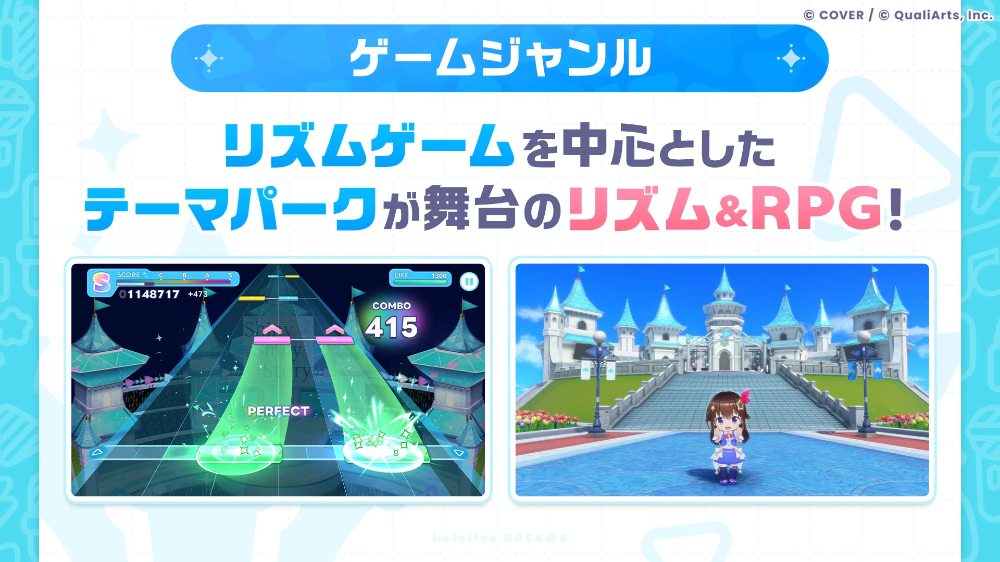
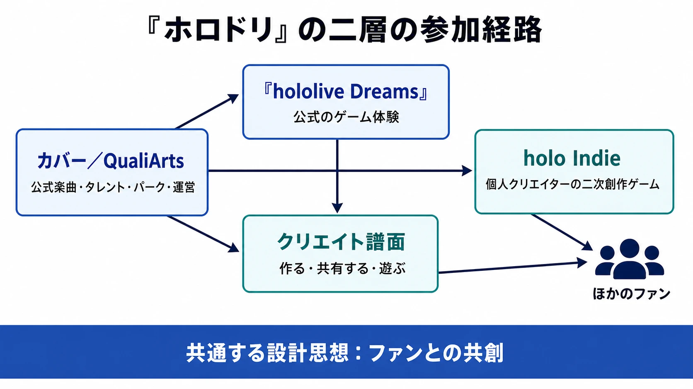
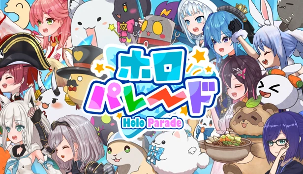
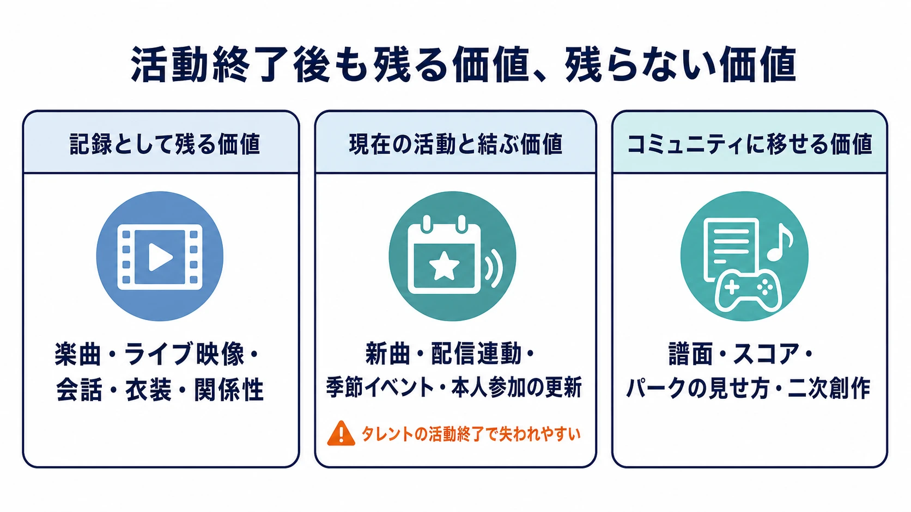

# 『hololive Dreams』とholo Indie――配信者IPを「ファンと一緒に遊び続けるゲーム」へ翻訳する設計

映画、アニメ、漫画をゲーム化するとき、プランナーは多くの場合、完成済みの物語、人物相関、印象的な場面を出発点にできる。何を遊びへ変換するかは難しいが、原作そのものは更新を止めても変わらない。

VTuber IPは違う。配信者本人が日々の配信、歌、コラボレーション、ファンとのやり取りによってIPを更新し続ける。プレイヤーが愛着を持つ対象はキャラクター設定だけではなく、現在も活動している人と、その周囲で生まれる出来事である。

本稿は、ホロライブプロダクション初の公式スマートフォンゲーム『hololive Dreams』（ホロドリ）を題材に、この「生きたIP」をゲームへ翻訳する論点を考える。中心に置くのは、リズムゲームや箱庭の完成度そのものではない。カバー株式会社が、トップダウンで作る公式旗艦タイトルと、個人の二次創作ゲームを支援する「holo Indie」を同時に運用している構造である。前者の「クリエイト譜面」機能まで含めると、二つはファンが創作へ参加できる経路を異なる粒度で用意する、一つのIP戦略として読める。

[にじさんじ甲子園を扱った既存記事](nijisanji-koshien-publisher-engagement-design.md)が、個人発の配信企画にゲームのパブリッシャーがどう関与を深めたかを追ったのに対し、本稿の射程は異なる。ここで問うのは、固定シナリオを持たない配信者IPを自社ゲームに定着させるとき、何を固定し、どこを参加者へ開放し、活動終了の変化をどう設計へ織り込むかである。

***

## VTuberプロダクションを、更新され続けるIPとして見る

VTuberは、2Dまたは3Dのアバターを用いて、動画・ライブ配信・音楽・イベントなどを行う活動者の総称である。アバターを単なる映像上のマスコットではなく、配信者の表現と継続的なコミュニケーションを受け止める表現媒体として捉えると分かりやすい。視聴者は配信を見て、楽曲を聴き、切り抜き動画や二次創作を作り、ほかの視聴者と出来事を語り直す。この反復が、キャラクターの意味を増やしていく。

カバー株式会社は2016年6月13日設立。2017年9月にときのそらが活動を始め、2018年6月に女性VTuberグループ「hololive」を立ち上げた。2019年には男性VTuberグループ「HOLOSTARS」を、2020年にはホロライブインドネシアとホロライブEnglishを、2022年にはHOLOSTARS Englishを始動している。会社概要は2025年5月時点で社員679名を記載し、カバーはVTuberプロダクションに加え、メディアミックスとメタバースへの展開を掲げる。2023年3月27日には東京証券取引所グロース市場へ上場した。[[1](#ref-1)][[2](#ref-2)]

ここでいうホロライブプロダクションは、女性グループの「hololive」だけでなく、HOLOSTARSや地域・言語別のグループを含むプロダクション名である。本稿で主題にする『ホロドリ』は、そのうち女性グループ「ホロライブ」初の公式ゲームとして告知されている。

にじさんじを運営するANYCOLORも、オーディション、デビュー、日々の配信を支援するVTuber／バーチャルライバーグループである。両社を「片方は選抜型、片方は放任型」と二分するのは正確ではない。現在の公式情報でも、カバーは書類選考・複数回の審査とデビュー用カリキュラムを掲げており[[3](#ref-3)]、ANYCOLORも、にじさんじのノウハウを生かしたタレント育成プロジェクト「バーチャル・タレント・アカデミー」（VTA）でオーディションを随時開催するなど、独自の育成の枠組みを持つ。[[4](#ref-4)][[5](#ref-5)]

そのうえで、にじさんじ甲子園が示したのは、多人数のライバーを大会の役割へ再編し、活動中の人々が自発的に生む企画を大規模な観戦導線へ育てる型であった。対してホロライブは、歌・ライブ・ユニットやタレント個々の表現を、選考と制作支援を通じて高密度に展開するイメージを強く持つ。本稿ではこの差を、会社の優劣や不変の組織文化ではなく、ゲーム化する際にまず公式側で体験の骨格を作るか、活動者発の企画を束ねるかという設計上の重心の違いとして扱う。

***

## 『ホロドリ』が固定したもの、プレイヤーへ渡したもの

カバーとQualiArtsが共同開発した『hololive Dreams』は、2026年7月23日にiOS、Android、Steamで世界同時に正式サービスを開始した。公式発表では、開始時に好きなタレントの最高レアリティを一人選んで獲得できるとしている。QualiArtsの事前発表は、50名以上のタレントと初期収録150曲以上を掲げた。先行プレイを行った電撃オンラインの記事はプレイアブルタレントを54名と報じており、この人数は正式サービス開始時の公式発表内の事前登録ギフト（タレント54人分のアクセサリー等）からも確認できる。[[6](#ref-6)][[7](#ref-7)][[8](#ref-8)]

事前登録者数は2026年5月29日に100万人を超え、その後150万人を突破したと公式が発表した。また、事前ダウンロード開始時には複数地域のApp Store無料ランキングで首位を獲得した。これらは発売前後の到達と初速を示す数字であり、継続率、運営収益、長期的な支持を示すものではない。『ホロドリ』の持続性は、公開後まもない本稿執筆時点では検証できない。[[6](#ref-6)][[9](#ref-9)]

ゲームの構造は単一ではない。専門メディア記者による2026年7月10日公開の先行プレイレポートによれば、無人島で「ドリーム・パーク」を作る箱庭パート、タップ・スワイプなどで遊ぶリズムゲーム、複数のミニゲームが組み合わされている。初回ガチャは重複なしの5人が出現する固定仕様と報じられた。これは開発者への直接取材ではなく、記者が先行版を遊んだレビューに基づく情報である。したがって、開発意図や正式リリース後の挙動まで同記事から断定することはできない。[[8](#ref-8)]

*画像出典（引用）：カバー株式会社「[『hololive Dreams』正式サービス開始](https://cover-corp.com/news/detail/20260723-01)」。リズムゲームとドリーム・パークという本稿で扱う複合的なゲーム構造を示すため、掲載されたゲーム画面を必要な範囲で引用。© COVER / © QualiArts, Inc.／無改変・WebP変換。*

この複合構造は、配信者IPを「ストーリーを読むゲーム」だけに閉じない。

- パーク運営は、タレントが集う場所をプレイヤー自身の進行へ接続する。
- リズムゲームは、配信とライブで蓄積された楽曲を、繰り返し操作する遊びへ変える。
- ミニゲームは、音楽ゲームに慣れていないプレイヤーにも短い入口を作る。
- クエストや会話は、人物間の関係を初見のプレイヤーが知る導線になる。

特に重要なのは「クリエイト譜面」である。同じ先行プレイレポートは、プレイヤーがオリジナル譜面を作成し、世界中のユーザーと共有・公開できること、公式の高難度にはない三本指以上の譜面も作れることを伝えている。公式楽曲とタレントという素材はカバー側が管理する一方で、「この曲のどこにどのノーツを置けば面白いか」という解釈の一部をプレイヤーへ渡す設計である。[[8](#ref-8)]

***

## 「譜面を作れる」は、小さなライセンス開放である

UGC機能は、コンテンツ量を増やす装置として説明されがちだ。もちろん、譜面を共有できれば、公式が単独で供給するより多様な難度、遊び方、話題が生まれうる。しかし配信者IPでは、量だけでは足りない。

ファンが「歌ってみた」や切り抜き動画で行うのは、素材をただ複製することではない。どの場面を選び、どの順番で見せ、何に意味を見いだすかを自分で決め、ほかのファンへ返す行為である。クリエイト譜面も、楽曲の時間構造をノーツというルールに訳し直す行為になる。公式の正解を消すのではなく、公式が提供した曲を何度も別の角度で読める状態にする。

ここで設計対象になるのは、エディタの機能だけではない。譜面の公開範囲、検索・推薦、通報、難度表示、著作権や不適切表現への対応、作成者名の扱い、配信で紹介された譜面へ人が集中したときの導線まで、創作物がコミュニティを巡る条件になる。公式が強い編集権を残すほど安全性と体験の統一は保ちやすい。開放するほど、タレントの現在の活動から予想できない遊びが生まれる。どこに境界を引くかは、IP管理とゲーム運営を同じ仕様として扱う仕事である。

***

## holo Indieは、ゲーム一本分の創作へ出口を作る

カバーは2023年11月15日、二次創作ゲームに関するガイドラインを定め、二次創作ゲーム向けブランド「holo Indie」を開始した。個人クリエイターが同社IPを使うゲームを有償配布できるようにし、子会社CCMCがゲームクリエイター・サポートプログラムを通じたSteamアカウントへの掲載、審査・管理業務を担う仕組みである。[[10](#ref-10)]

第一弾は、個人ゲームデベロッパーのろぼくろ氏が制作した、2Dタワーディフェンスゲーム『ホロパレード』である。公式発表では、ホロライブプロダクションのVTuberやマスコットキャラクター65体以上を集め、育て、眺めるシングルプレイ作品として、2023年12月1日にリリース予定とされた。ここで会社は、公式ゲームの一部機能を開放したのではない。個人が別のゲームジャンル、別の画面、別のゲームループを作って販売するための、権利と流通の入口を用意している。[[10](#ref-10)]

*画像出典（引用）：カバー株式会社「[holo Indie立ち上げと『ホロパレード』発表](https://cover-corp.com/news/detail/20231115-02)」。ろぼくろ氏が制作したholo Indie第一弾タイトルを示すため、公式発表に掲載されたキービジュアルを必要な範囲で引用。© COVER／ろぼくろ氏制作・カバー株式会社掲載／無改変・WebP変換。*

『ホロドリ』とholo Indieは、制作主体も責任の範囲も違う。前者ではカバーとQualiArtsが、曲数、登場タレント、プラットフォーム、継続運営を決める。後者では個人クリエイターが企画・制作の中心に立ち、カバー側は許諾と掲載支援、ガイドラインによる境界を提供する。両者を同じ「ファン制作」と呼ぶのは粗い。

それでも二層を同時に置く意味はある。公式旗艦は、もっとも多くの人が共有できる基準点を作る。holo Indieは、公式が選ばなかったジャンルや規模、個人の得意技を試せる周辺を広げる。その間にあるクリエイト譜面は、ゲームを一本作るほどの負担を負わずに、プレイヤーが作品へ手を入れる入口になる。

これは、中央で品質を統制し、周縁で創作の多様性を受け止める構造である。重要なのは「公式とファンのどちらが上か」ではない。小さな譜面から有償の独立ゲームまで、参加のコストと責任が異なる複数の入口を連続して用意している点にある。VTuber文化に先行して存在する歌ってみたや切り抜きの参加型文化とも、この構造は接続する。

***

## 決算数字は、ゲームの成否ではなく事業環境の一断面である

ゲーム企画の議論に上場会社の決算を持ち込むときは、数字が何を説明できないかを先に決める必要がある。以下のカバーの2026年3月期とANYCOLORの2026年4月期は、いずれも『ホロドリ』の2026年7月発売前の決算である。したがって、数字から『ホロドリ』という投資判断の成果や妥当性を説明することはできない。ここでは、配信者IPを事業として見るときの経営環境の一断面、そしてプランナーが利用IPの継続投資余力や事業上の論点を考えるための材料の一つとしてのみ置く。

| 会社・対象期 | 売上高 | 営業利益 | 当期純利益 | 前期比 |
|---|---:|---:|---:|---|
| カバー：2026年3月期 | 493億30百万円 | 70億56百万円 | 30億16百万円 | 売上高 +13.7％／営業利益 -11.8％／当期純利益 -45.7％ |
| ANYCOLOR：2026年4月期 | 556億81百万円 | 201億72百万円 | 140億91百万円 | 売上高 +29.9％／営業利益 +23.9％／当期純利益 +22.4％ |

カバーの減益について、同社の決算説明資料は、ホロアースの開発方針転換に伴うソフトウェア資産の減損損失33億円と、過去の在庫拡大期に生産した低回転在庫の除却・評価減約18億円を示している。ここから、個別のゲーム投資の理由や将来の収益性を推測してはならない。確認できるのは、売上高が増加する一方で、これらの費用が同年度の利益へ影響したという事実までである。ANYCOLORの増益も、両社の運営思想の優劣を直ちに証明するものではない。[[11](#ref-11)][[12](#ref-12)]

***

## 活動終了は、IPの利用不能とは違うが、ゲーム体験を変える

VTuber IPに固有の難しさは、権利を保有する会社と、IPの意味を日々更新するタレントが同一ではないことにある。カバーがIP・版権の主体である以上、タレントが卒業または配信活動を終了した後も、キャラクターやIPをライセンス利用すること自体は権利上は可能である。だが、権利上利用できることと、ゲームにその人物を置くことが現在のファン体験として同じ意味を持つことは別である。

たとえば、固定シナリオ型の映画・アニメ・漫画では、原作が完結していても、作品内の人物と場面は変わらず参照できる。配信者IPでは、直近の配信、次のライブ、コラボレーション、ファンが切り抜く出来事が「今の推し」を形作る。活動していないタレントには、ゲーム上のキャラクターとして使えても「今は新しい活動がない」というハンデが生じる。これは品質や人気を否定する話ではなく、ライブ性を前提にしたIPの構造上のリスクである。ここでは便宜上、現役で活動する前提が崩れた人物へ依存するリスクを「生存者リスク」と呼ぶ。

実例として、カバーはホロスターズ所属の花咲みやび、岸堂天真、律可、アルランディス、水無世燐央、影山シエンについて、2026年6月8日から7月5日にかけて段階的に配信活動を終了すると告知した。hololive本体でも、2024年8月から2025年11月にかけて湊あくあ、ワトソン・アメリア、沙花叉クロヱ、セレス・ファウナ、紫咲シオン、七詩ムメイ、がうる・ぐら、火威青の卒業が発表されている。[[13](#ref-13)][[14](#ref-14)]

カバー取締役CFOの金子陽亮氏は、2026年3月期第2四半期決算資料に関する投資家質疑応答を引用したゲームメディアの記事で、タレント数の減少とEC売上の減少の因果関係を数学的に正確に示すことは難しいとした上で、タレント一人あたり年間およそ2回の記念グッズ販売機会が失われること、前下半期比でコンテンツの総再生時間が約10％減少していることを説明したと報じられている。これはCFO本人への直接取材ではなく、質疑応答を引用する二次報道である。また、再生時間やグッズ機会だけで卒業の影響全体を測れるわけでもない。だが、活動終了を単なる名簿上の人数変化ではなく、接点・供給・商機の減少として捉えていることは読み取れる。[[14](#ref-14)]

プランナーにとっては、最初から「誰がゲームに残るか」を一律に決めることが答えではない。次のように、活動状況が変わっても価値を保つ単位を選び分ける必要がある。

- **記録として残る価値**：楽曲、ライブ映像、既存の会話、衣装、関係性。活動終了後もアーカイブとして遊べる。
- **現在の活動と結ぶ価値**：新曲、配信連動、季節イベント、本人の参加を前提にした更新。現役性が強い。
- **コミュニティに移せる価値**：譜面、スコア、パークの見せ方、二次創作。特定の一人の新規活動だけに依存しない。

この三つを混ぜることはできる。ただし比率を意識しなければ、あるタレントの活動終了が、コンテンツ追加だけでなく、プレイヤーの目標、SNSで語る理由、ゲーム内経済の接点まで同時に弱める。

***

## 「誰を再現するか」ではなく、「誰が次の意味を作るか」

配信者IPのゲーム化で、忠実なモデルや大量のボイスを用意することは重要である。しかしそれだけでは、配信で更新されるIPを保存した展示へ近づけてしまう。『ホロドリ』のパーク運営、リズムゲーム、ミニゲームは、タレントを操作・鑑賞・反復という複数の接点へ置き直す。クリエイト譜面は、そこへプレイヤー自身の解釈を加える余地を作る。holo Indieは、その余地を一本のゲームを作るところまで拡張する。

この二層戦略は、ほかの参加型IPにも応用できる可能性がある。VTuber以外の配信者やインフルエンサーを扱うなら、まず次の問いを企画書に置きたい。

1. 公式が品質と継続責任を持って固定すべき「共通の遊び」は何か。
2. ファンが低いコストで意味を足せる編集単位は何か。
3. 個人クリエイターがより大きく試せる、許諾・流通・収益化の出口をどこまで作るか。
4. 活動休止、卒業、方針転換が起きたとき、どの体験が残り、どの更新を止めるか。

回答はIPごとに違う。だが、原作を一回ゲームへ移植して終えるのではなく、公式制作、プレイヤーの小さな創作、個人クリエイターの大きな創作をつなげる考え方は再利用できる。生きたIPのゲーム化とは、現在の人物をただ再現する仕事ではない。人が活動し、ファンが解釈し、時には活動が終わる変化の中でも、次に遊びと意味を作れる関係を設計する仕事である。

## References

1. [COVERについて][1] - 設立日、沿革、社員数、海外グループ、事業方針を確認。

2. [株式情報 ｜ カバー株式会社][2] - 東証グロース市場への上場日を確認。

3. [hololive production VTuberオーディション][3] - 選考フローとデビュー用カリキュラムを確認。

4. [にじさんじプロジェクト ｜ ANYCOLOR株式会社][4] - タレント活動支援の公式説明を確認。

5. [VTA公式【にじさんじ】][5] - にじさんじのノウハウを生かしたタレント育成プロジェクト「バーチャル・タレント・アカデミー」の概要とオーディション開催状況を確認。

6. [QualiArtsとカバーが共同開発する「ホロライブ」初のスマホゲーム『hololive Dreams』、正式サービス開始！][6] - 発売日、共同開発、対応プラットフォーム、開始時の最高レア選択、事前登録150万人達成、タレント54人分の記念アイテムを確認。

7. [QualiArtsとカバーが共同開発する『hololive Dreams』、全世界同時リリースが決定！][7] - 参加タレント数と初期収録曲数を確認。

8. [『hololive Dreams（ホロドリ）』先行レビュー][8] - 箱庭、リズムゲーム、ミニゲーム、クリエイト譜面、先行プレイ時点のプレイアブル人数・排出仕様を報じた専門メディアの先行プレイレポート。

9. [『hololive Dreams』事前登録100万人突破のお知らせ][9] - 事前登録者数と事前ダウンロード時のApp Store無料ランキングを確認。

10. [カバー株式会社、「holo Indie」を立ち上げ][10] - 二次創作ゲームのガイドライン、Steam掲載支援、第一弾『ホロパレード』を確認。

11. [カバー株式会社 2026年3月期 決算説明資料][11] - カバーの業績とホロアース開発資産の減損、低回転在庫の除却・評価減を確認。

12. [ANYCOLOR株式会社 2026年4月期 決算短信][12] - ANYCOLORの業績を確認。

13. [ホロスターズの今後の活動に関するお知らせ][13] - ホロスターズ所属タレントの配信活動終了を確認。

14. [ホロライブ卒業タレントと売上・再生時間を報じたインサイドの記事][14] - カバーCFOの投資家質疑応答を引用した二次報道。

[1]: https://cover-corp.com/company
[2]: https://cover-corp.com/ir/stockInformation
[3]: https://audition.hololivepro.com/
[4]: https://www.anycolor.co.jp/service/nijisanji
[5]: https://vta.anycolor.co.jp/
[6]: https://cover-corp.com/news/detail/20260723-01
[7]: https://qualiarts.jp/news/detail/227
[8]: https://dengekionline.com/article/202607/79730
[9]: https://hololivepro.com/news/20260529-01-291
[10]: https://cover-corp.com/news/detail/20231115-02
[11]: https://www2.jpx.co.jp/disc/52530/140120260514534184.pdf
[12]: https://www2.jpx.co.jp/disc/50320/140120260610567133.pdf
[13]: https://hololivepro.com/news/20260526-01-290
[14]: https://www.inside-games.jp/article/2025/11/26/174414.html

----

この文書は、Perplexity、Claude、OpenAI Codex の3つのAIの支援を受けて著述されたものです。引用画像を除き、MIT License にて提供されています。
