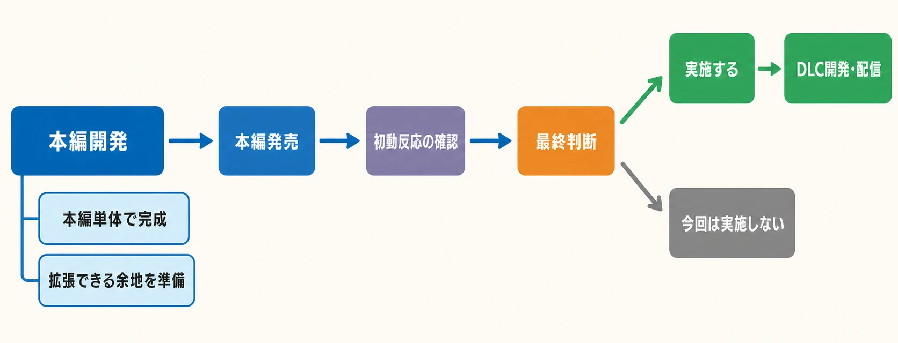

# DLC・シーズンパスは実際どう作られているか――本編開発中の仕込みと発売後の判断

***

## はじめに――DLCは準備と判断を重ねて形になる

ゲームを遊び終えたころにDLCが発表されると、「評判がよかったから、発売後に急いで続きを考えたのだろう」と見えることがある。実際の作り方は、もう少し段階的である。

**DLC（ダウンロードコンテンツ）** は、本編とは別に配信される追加の物語、ステージ、キャラクター、機能などを指す。 **シーズンパス** は、今後配信される複数のDLCをまとめて入手できる販売方式である。名称に「シーズン」とあっても、必ずしも春夏秋冬や対戦ゲームのシーズンを意味するわけではない。

シーズンパスを販売する場合は、複数のDLCを届ける計画を商品として示すため、販売時点で先の見通しが必要になる。一方、個別のDLCは、本編発売後に実施が正式決定する場合もある。ただし、その場合でも本編完成後に何もないところから考え始めるとは限らない。

本編の開発中に「あとから広げられる場所」を用意しておき、発売後の反応を見て、実際に作るかを決める。そこから数か月、場合によっては数年にわたる追加開発へ進む。この記事では画像や音声などを作る技術的な工程ではなく、 **いつ準備し、いつ実施を決めるのか** という流れを見ていく。

***

## 1. 本編の開発中から「伸びしろ」を仕込む

『ファイナルファンタジーXVI』（以下、『FFXVI』）の事例は、準備と正式決定が別の段階にあることをよく示している。

同作のプロデューサー・吉田直樹氏は、ファミ通.comのインタビューで、開発当初からDLC前提の作りにはしたくなかったと説明している。本編だけで一つの作品として成立させることを優先したのである。そのうえで開発中盤ごろから、世界をあとで拡張できるよう、世界設定に手掛かりを残した。プレイヤーがDLCを望んだ場合に開発へ進める設計であった。[[1](#ref-1)]

これは、本編の物語を途中で切り、残りをDLCとして売るという意味ではない。本編を完成させながら、追加の物語を自然につなげられる余地も残す考え方である。

DLCディレクターの鯨岡武生氏も、本編の中に世界を拡張する余地がすでに埋め込まれていたため、それを使ってDLCの内容を詰めたと語っている。作ることが正式に決まった段階で、以前から用意されていた手掛かりが、追加の物語や遊びへ育てられたのである。[[1](#ref-1)]

プレイヤーから見れば、本編に残された謎や遠景は作品を豊かにする要素である。開発側から見れば、それらはDLCを作ることになったときの出発点にもなる。ただし、すべての謎や行けない場所がDLCの予告とは限らない。ここで押さえたいのは、追加できる余地を残すことと、追加を約束することは別だという点である。

***

## 2. 最終的なゴーサインは、発売後の反応を見て出す

『FFXVI』では、発売前から少しずつ準備を進めていた一方、DLCを実際に作るという最終判断は、発売後の初動反応を見て行われた。[[1](#ref-1)]

ここに、DLCの意思決定を理解する鍵がある。

1. 本編を単体で完成させる。
2. 開発中に、あとから広げられる余地を残す。
3. 発売前に、実施できる範囲で準備する。
4. 発売後の初動反応を確かめる。
5. 実施するかを最終判断し、DLCの内容を具体化する。

準備があるから、発売後の判断に素早く動ける。しかし、準備したからといって必ずDLCが作られるわけではない。反対に、発売後に正式決定したからといって、すべてをその時点で思いついたわけでもない。

『FFXVI』のDLCは、ひとつの大きな追加コンテンツではなく、第一弾と第二弾に分けて開発された。ひとつにまとめると完成まで長くかかり、プレイヤーを待たせるため、当初から二つに分けて進めたという。[[1](#ref-1)] ゴーサインのあとにも、「どの単位なら、どの時期に届けられるか」というスケジュールの判断がある。

*図：DLCの準備は本編開発中から進められるが、実施の正式判断は発売後の初動反応を経て行われる。*

***

## 3. ひとたび始まれば、数年間続く開発にもなる

DLCは一本を作って終わるとは限らない。『ドラゴンボールZ KAKAROT』は、その規模を想像しやすい例である。

サイバーコネクトツーの制作プロデューサー・木本一輝氏が登壇したCEDEC 2024のセッション概要によると、同作はバンダイナムコエンターテインメントから2020年に発売され、その後約4年間に6弾のDLCが配信された。内容には追加シナリオやカードゲームの追加などが含まれる。[[2](#ref-2)]

この期間中には、Nintendo Switch版とリマスター版の制作もDLC開発と並行して進められた。[[2](#ref-2)] 開発側が向き合う対象は、最初に発売した本編だけではない。追加する内容を考え、各機種版へ届ける計画を立てながら、新しい機種版の制作も同時に進む時期があったのである。

したがって、長期DLC展開は「発売後に同じチームが同じ作業を続ける」だけでは捉えにくい。追加内容ごとの区切りがあり、対応する製品版も増え、複数の予定を並行して管理する継続開発になる。

なお、サイバーコネクトツーは開発元、バンダイナムコエンターテインメントは発売元である。会社間の役割そのものは、既刊記事「[パブリッシャーとデベロッパーは何が違うのか――「ベヨネッタ」の発売元と開発元から読むゲーム業界](publisher-developer-role-differences-bayonetta.md)」で詳しく扱っている。本稿で重要なのは、一本のゲームに対する判断と制作が、発売後も年単位で続く場合があることだ。

***

## 4. 番外――発売から時間を置いて発表される例もある

DLCの展開時期には、大きな幅がある。発売から時間を置いたあと、大型の有料DLCが発表された例もある。

- **『マリオカート8 デラックス』**：本編は **2017年4月28日** に発売。有料DLC「コース追加パス」は **2022年2月10日** のNintendo Directで発表された。[[3](#ref-3)][[4](#ref-4)]
- **『あつまれ どうぶつの森』**：本編は **2020年3月20日** に発売。有料DLC『あつまれ どうぶつの森 ハッピーホームパラダイス』は **2021年10月15日** に発表され、 **2021年11月5日** に発売された。[[5](#ref-5)][[6](#ref-6)]

ここで比べているのは、公表された本編発売日とDLC発表日である。社内で企画や制作が始まった日までは、これらの日付から判断できない。それでも、プレイヤーから見える展開時期が作品によって大きく異なることは分かる。

こうした例は、すべてのDLCが本編発売直後の計画だけで決まるわけではないことを示している。ただし、個別作品の社内事情を外から推測する材料にはしない方がよい。確認できるのは、いつ本編が発売され、いつ追加コンテンツが公表されたかまでである。

***

## まとめ――「仕込み」と「反応判断」が組み合わさって形になる

DLC・シーズンパスは、本編開発中の仕込みと発売後の反応判断を組み合わせて形になる。

『FFXVI』では、本編を単体で完成させる方針を守りながら、開発中盤から拡張できる手掛かりを残した。そして、発売後の初動反応を見て実施を最終判断した。『ドラゴンボールZ KAKAROT』では、2020年の発売後、約4年間に6弾のDLCが展開され、別機種版の制作も並行した。

基本の流れは、 **本編開発中に伸びしろを用意する → 発売後の反応を確認する → 実施を判断する → 届けられる単位と時期へ分けて開発する** と整理できる。作品によっては、発売から長い時間を置いて追加DLCが発表されることもある。

プレイヤーが発表で初めて見るDLCにも、その前には準備と判断の積み重ねがある。DLCの発表時期だけで「最初から決まっていた」「後から急に考えた」と二択にせず、そのあいだにある段階を見ると、発売後も続くゲーム制作の姿が分かりやすくなる。

## References

1. [〖FF16DLC〗鯨岡武生氏＆吉田直樹氏＆高井浩氏開発インタビュー][1] - 本編開発中の準備、発売後の初動反応による最終判断、二つのDLCへ分けた理由を説明。

2. [4年間で6本配信！長期的にタイトルを盛り上げるDLC開発の全貌][2] - 『ドラゴンボールZ KAKAROT』の長期DLC展開と、別機種版を並行制作したCEDEC 2024セッション概要。

3. [『マリオカート8 デラックス』が発売された日][3] - 本編の発売日と「コース追加パス」の発表日を掲載。

4. [『マリオカート８ デラックス』にシリーズ歴代コースが登場。全48コースを順次追加。][4] - 任天堂による「コース追加パス」の発表記事。

5. [あつまれ どうぶつの森：商品情報][5] - 任天堂公式の商品ページ。パッケージ版とダウンロード版の発売日を掲載。

6. [『あつまれ どうぶつの森』有料DLC「ハッピーホームパラダイス」発表][6] - DLCの発表日と発売日を掲載。

[1]: https://www.famitsu.com/news/202312/08325585.html
[2]: https://cedec.cesa.or.jp/2024/session/detail/s660526791a42f/
[3]: https://www.famitsu.com/article/202604/72804
[4]: https://www.nintendo.com/jp/topics/article/65af41f1-4f93-4aae-99d4-8ff09a3f53e0
[5]: https://www.nintendo.com/jp/switch/acbaa/products/soft.html
[6]: https://automaton-media.com/articles/newsjp/20211016-179225/

----

この文書は、Perplexity、Claude、OpenAI Codex の3つのAIの支援を受けて著述されたものです。引用画像を除き、MIT License にて提供されています。
