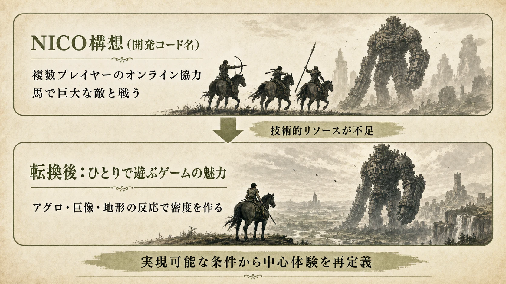
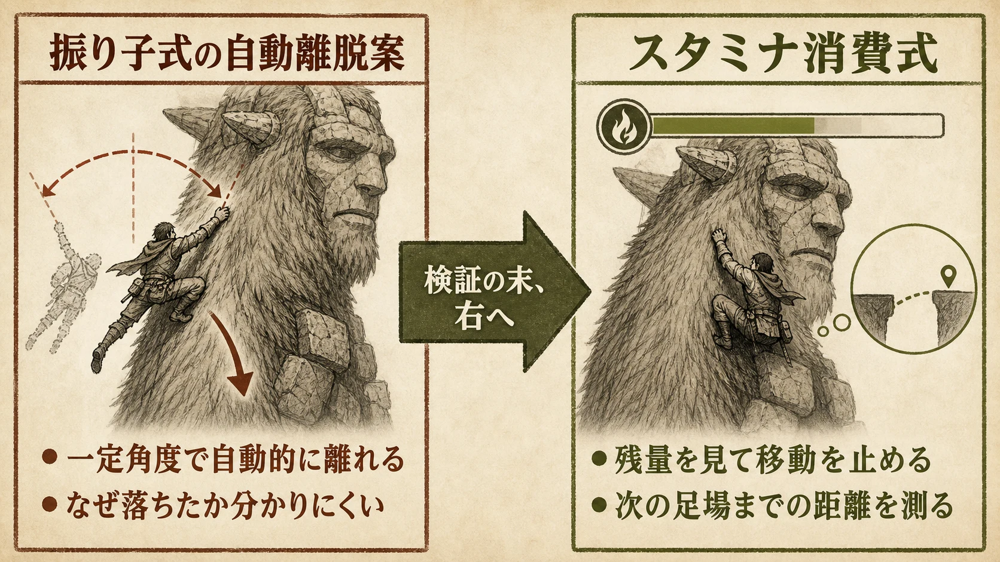
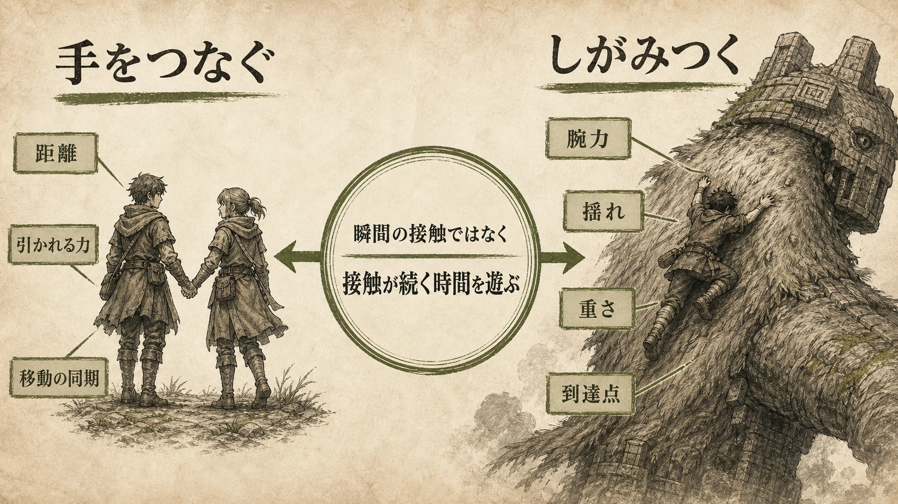
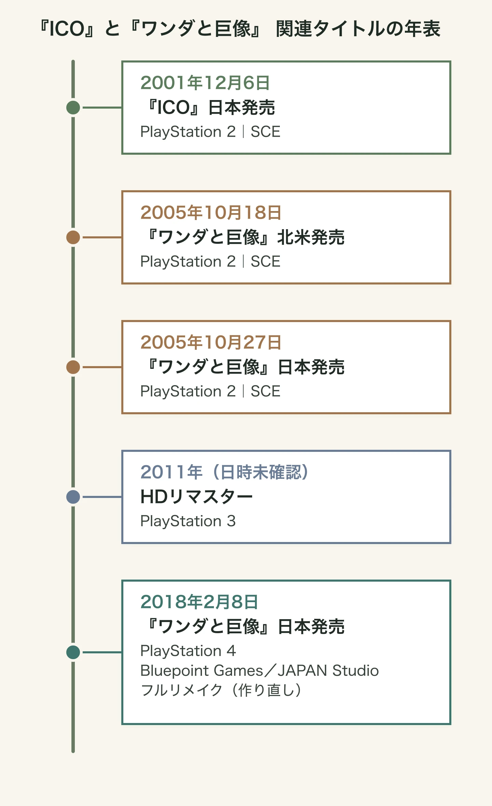

# 『ICO』と『ワンダと巨像』は、なぜ20年を経ても代わりが作りにくいのか――「持続する接触」を中心に据えた上田文人氏の設計判断

## はじめに：発明を一つだけ取り出しても、同じ体験にはならない

2001年12月6日、ソニー・コンピュータエンタテインメント（現ソニー・インタラクティブエンタテインメント、以下SCE）はPlayStation 2向けに『ICO』を発売した。少年イコと少女ヨルダが城からの脱出を目指すアクションアドベンチャーである。[[1](#ref-1)][[2](#ref-2)] 2005年には、北米で10月18日、日本で10月27日に同じくSCEから『ワンダと巨像』が発売された。プレイヤーはワンダとして、16体の巨像だけを倒すために古えの地を進む。[[3](#ref-3)]

二作はしばしば「引き算のゲーム」と呼ばれる。だが、この言い方だけでは、なぜ似た雰囲気の遺跡、巨大な敵、よじ登りの操作を置いても、同じような体験にならないのかを説明できない。

上田文人氏が二作で守ったのは、要素数の少なさではなく、 **プレイヤーの身体と相手・空間の関係を、接触が続く時間として感じさせること** である。『ICO』では手をつなぐ。『ワンダと巨像』では巨像にしがみつく。どちらもボタンを押した瞬間に判定を終える接触ではなく、距離、引かれる力、重さ、失敗の危険を継続して扱う。

本稿は、『塊魂』の単一ルールや『ピクミン』のゲームフローを扱った既存記事とは切り口を分ける。焦点は、魅力的なアイデアを増やすことではない。一つの身体感覚を成立させるために、どこへ制作資源を集め、どの構想を見切り、何をゲームから外したかという設計判断である。

***

## 1. 『ICO』の「引き算」は、ヨルダを実在させるための配分だった

『ICO』を、アイテム、スコア、敵の種類を減らした作品とだけ捉えると、再現の方向を誤る。上田氏が後年に振り返ったのは、レベルデザインやギミックで他作に勝つのではなく、ヨルダというキャラクターの「存在感」に資源を集中させるという判断だった。方向転換を一点で済ませるような機械的な動きや、位置が近ければ即座にスイッチ操作へ移るような都合のよい補間を避け、ヨルダが自分でスイッチまで急ぐ動きを作った。[[4](#ref-4)]

この判断には、操作性を悪くするための不自由さではなく、プレイヤーが「これは命令に反応するUIではなく、そこにいる相手だ」と受け取るための条件がある。ヨルダが賢すぎれば、手を引く必要はなくなる。逆に、ただ遅く不正確なら、連れ歩きは作業になる。だから必要なのは、性格を説明する大量の台詞でも、複雑な自律行動でもない。プレイヤーが相手の姿勢や移動の理由を想像できる最低限の振る舞いである。

### 手付けキーフレームは、細部を直せる制作方法だった

当時の『ICO』ではモーションキャプチャを使わず、手付けのキーフレームでモーションを作った。上田氏は、歩幅を少し狭くする、しゃがむ速度を少し上げる、といった調整を撮り直しなしで繰り返せることを理由の一つとして挙げている。モーションキャプチャを避けたことは、手作業の味を足すためではない。キャラクターの印象を決める小さな差分を、制作途中でも何度も動かせるようにした選択である。[[4](#ref-4)]

プランナーがここから持ち帰るべきなのは、「手付けにすれば実在感が出る」という結論ではない。先に問うべきは、体験の核を壊す細部は何か、そしてそれを終盤まで調整できる制作経路があるか、である。自動生成、モーションキャプチャ、手付けのどれを選んでもよい。ただし、選んだ方式が「この一歩は大きすぎる」「この停止は速すぎる」を直せないなら、その方式は体験の核と合っていない。

### 高所の怖さは、カメラではなく重力の一貫性から生まれる

『ICO』の細い足場が怖く感じられる理由を、見下ろしのカメラや霧だけに求めるのも不十分である。上田氏は、落下を怖がらせるには、プレイヤーへ「この世界には現実と同じ重力がある」と事前に刷り込む必要があると説明する。重力に反するモーションが混ざれば世界の法則が崩れ、高所に立ったときの恐怖も弱くなる。ジャンプ力、着地、物が落ちる様子を通じて、プレイヤーは落下の結果を予測する。予測できるからこそ、狭い足場で失敗を具体的に想像できる。[[4](#ref-4)]

これは、危険を演出だけで知らせない設計である。たとえば落下を主題にしたステージなら、まず低い場所で重力、跳躍距離、着地の結果を学ばせる。その後に高所へ置く。画面上に「危険」と表示するより先に、世界の法則を身体で理解させる。この順序があると、同じ崖でもプレイヤー自身の予測が恐怖になる。

***

## 2. NICOを捨てたのは、規模を諦めたからではない

『ワンダと巨像』の出発点は、開発コード名「NICO」のパイロットムービーだった。『ICO』のカットシーン用エンジンで作られた映像には、複数のプレイヤーキャラクターが馬で荒野を走り、誰かが弓で巨大な敵を引き付け、別の誰かが馬から飛び乗って背の弱点へ向かう協力プレイの構想が映っていた。[[3](#ref-3)]

しかし当時のチームには、オンラインを実現する技術的リソースが足りなかった。上田氏は「できること、できないこと」を精査してオンライン要素を見送り、そこから「ひとりで遊ぶゲームの魅力」を考え直したと語っている。目指したのは、ひとりでいても生きているように感じる存在と出会う体験であった。[[3](#ref-3)]

ここで重要なのは、オンライン協力の縮小版として一人用を作ったのではないことだ。協力プレイでは、仲間への役割分担、状況共有、他者の予測不能な行動が体験の密度を作る。単独プレイへ転じるなら、その穴をNPCの数で埋めるのではなく、馬のアグロ、巨像の動き、広大な地形が一人のプレイヤーに返す反応で埋める必要がある。技術不足を隠すために要素を減らしたのではなく、成立できる条件の下で別の中心体験を選び直したのである。

この見切りは企画の初期ほど価値が高い。実装できない機能を最後まで仕様書の中心に置くと、代替案は常に「本来より劣るもの」に見える。反対に、実現可能性を精査した時点で体験の中心を置き直せば、後の全ての判断が新しい中心を強くする。機能を残すか削るかではなく、 **その制約の下でしか作れない主役は何か** を決める判断である。

*NICOの協力プレイ構想を縮小版として残すのではなく、実現可能な条件から単独プレイの中心体験を再定義した。*

***

## 3. 「つかむ」を判定で終わらせず、腕力の時間にした

『ワンダと巨像』の巨像戦には、敵の身体へつかまり、毛や突起を頼りによじ登り、弱点まで到達する過程がある。このときプレイヤーは、巨像に触れた一瞬だけでなく、揺さぶられている間じゅう「まだ握っていられるか」を考える。上田氏は、当時の多くのアクションゲームが接触した瞬間にダメージをやり取りする構造だったのに対し、『ワンダと巨像』では接触が持続する状態そのものを遊びにしたかったと説明している。[[3](#ref-3)]

### 自動離脱ではなく、納得できる失敗を選ぶ

腕力ゲージは、巨大な敵に登る映像をそのままゲームにするための制限である。開発中には、つかんだまま振り子のように揺れ、ある角度を超えると手を自動的に離す案も検証された。しかし、その方式ではプレイヤーが「なぜ落ちたのか」を理解しにくかった。そこで、スタミナが尽きれば離れる方式へ落ち着いた。[[3](#ref-3)]

この差は小さく見えるが、失敗の帰属先を変える。自動離脱では、物理挙動の閾値をプレイヤーが把握できなければ、失敗は偶然に見える。腕力ゲージなら、残量を見て移動を止める、揺れが小さい場所を探す、次の足場までの距離を測るという判断ができる。緊張を作る制限は、厳しいだけでは足りない。プレイヤーが対処法を考えられ、失敗後にも「次はこうする」と言える因果を持たなければならない。

*失敗の理由が見えにくい自動離脱案から、残量と移動判断を結び付けるスタミナ消費式へ移った。*

### 第1の巨像を人型にしたのは、登頂を読ませるためだった

第1の巨像が人型なのは、単に分かりやすい導入用の敵だからではない。上田氏は、よじ登りの到達点が高い位置にある方が、地面から見上げ、登り、最上部へ着くまでの高さのコントラストを明確にできると語る。人型なら、ワンダを視認して踏み潰しに来る行動にも説得力を置きやすい。さらに、見栄えがし、制作上もっとも難しいから最初に作った。[[3](#ref-3)]

これは、チュートリアルを文章で説明する代わりに、最初の対象の形でゲームの目的を読ませる例である。最初の敵は難易度を下げるだけの存在ではない。プレイヤーが何を目指して登るのか、敵がどうこちらを脅かすのか、成功したときにどんな高さへ着くのかを、一つの形で見せる教材になる。

*瞬間の接触ではなく、接触が続く時間を遊びにするという考えが、二作をつないでいる。*

***

## 4. 『ICO』の手つなぎは、巨像へのしがみつきへ拡張された

『ICO』の手つなぎと『ワンダと巨像』のしがみつきは、見た目の異なる仕掛けではある。しかし上田氏は、両者とも瞬間的な接触ではなく、継続して物理的な関係を保つことを重視したと明言している。『ICO』ではキャラクター間の距離や引かれる力を設計し、『ワンダと巨像』ではそれを大きなスケールの「力がかかる」「重さを感じる」関係へ拡張した。[[3](#ref-3)]

この連続性を見れば、『ワンダと巨像』の発明を「巨大な敵に登れるようにしたこと」だけに狭めずに済む。登攀は、巨大なオブジェクトを移動する技術ではない。相手が動く間に接触を維持し、プレイヤーが自分の力の限界を管理するための対話である。

だからこそ、似たメカニクスを他作へ取り入れるときは、登れる場所を増やす前に問いを立てる必要がある。

- プレイヤーは接触している間、何を観察し、何を管理するのか。
- 相手の動きは、単なる妨害ではなく、次の移動や退避の判断を生むか。
- 失敗は、接触のルールから説明できるか。
- 接触が終わった後、その前後の移動や戦闘と別の意味を持つか。

四つに答えられなければ、しがみつきは移動アニメーションの一種に留まりやすい。二作が作ったのは新しいボタン操作ではなく、接触の長さを中心にした判断の連鎖である。

***

## 5. 巨像戦だけで成立させるため、周辺のループを置かなかった

『ワンダと巨像』には、広い土地を移動するミニマップ、雑魚敵との反復戦闘、ファストトラベルがない。広大なフィールドにも、戦うべき敵は16体の巨像だけである。[[3](#ref-3)][[5](#ref-5)] この構造は、コンテンツが不足しているように見えるかもしれない。しかし、巨像へ向かう移動、発見、観察、登攀、弱点への到達、討伐後の余韻を、別の反復ループで細切れにしないための構造でもある。

たとえば雑魚戦を入れれば、移動中の注意は敵の対処へ向かう。ファストトラベルを入れれば、土地の遠さや移動の持続は薄くなる。常時ミニマップを強くすれば、地形を画面上の記号として先読みしやすくなる。これらは一般には便利な機能であり、採用が誤りという意味ではない。ただし『ワンダと巨像』が必要としたのは、次の巨像を効率よく消化することより、古えの地を一人と一頭で進み、巨大な存在に出会うまでの間を保つことであった。

ここに、長く模倣されにくかった理由の一端がある。腕力ゲージだけなら実装できる。巨大な敵だけでも作れる。しかし、主役でない戦闘、収集、成長、移動短縮、情報表示をどこまで外すかまで含めて決めなければ、巨像戦は多くのループの一つになる。二作の強さは、独自の機能を足したことだけでなく、主役でない機能が主役の体験を奪わないように全体を組んだことにある。

プランナーが「要素を減らそう」と提案するときは、項目数を目標にしない方がよい。代わりに、各要素について「この機能は主役の感情を準備するか、分断するか」を問う。分断するなら、削除だけでなく、主役のループへ吸収できないかを検討する。その判断がなければ、引き算は単なる不足になってしまう。

***

## 6. 2018年のリメイクは、何を現代化し、何を守ったのか

  

*2011年のHDリマスターは月日を確認できないため、年のみを表示している。*

2018年2月8日、日本でPlayStation 4用『ワンダと巨像』が発売された。Bluepoint GamesとJAPAN Studioによるこの版は、2011年のPlayStation 3向けHDリマスターとは異なるフルリメイクであり、キャラクターから背景までのゲーム内モデルを作り直した。PS4 Proでは解像度優先とフレームレート優先を選択でき、フォトモードも加わった。[[5](#ref-5)][[6](#ref-6)]

変更点は見た目だけではない。公式の試遊記事では、ジャンプを×ボタンへ、回避ロールを○ボタンへ移し、タッチパッドでマップを呼び出せるようにした一方、クラシック操作も選べると説明されている。つかむ操作は肩ボタンに残された。[[6](#ref-6)]

一方でBluepointのプロデューサー、Randall Lowe氏は、弓を射るときにワンダが立ち止まること、ワンダの動きが重く軽快なアーケード調ではないことを、変えないものの例として挙げた。[[7](#ref-7)] この線引きは、操作の配置と体験の速度を分けて考えている。ボタンの位置は現代のプレイヤーが入力しやすいように変えられる。しかし、弓を引くために立ち止まり、巨像にしがみつくために肩ボタンを押し続けるという重さまで軽くすれば、持続的接触の緊張は別物になる。

また、巨像の毛は見栄えだけの更新ではない。Bluepointのアートディレクター、Mark Skelton氏は、巨像の毛をつかみ、そこを通って登ることがゲームの核心であるため、毛の寝方、束、陰影、登るときの動きに時間をかけたと語る。毛はエンジンが動的に生成する。[[7](#ref-7)] これは、原作の「登れる手掛かり」が単なる装飾ではなく、身体を預ける対象だったことを、現代の表現でも守るための仕事である。

リメイクの企画で参照すべきなのは、「原作に忠実か、新しくするか」という二択ではない。まず、原作のどの遅さ、重さ、摩擦が体験を支えているかを分解する。その上で、入力の慣習、表示の解像度、撮影機能のように変えても主役の感情を壊さない層を更新する。『ワンダと巨像』のリメイクは、その境界を操作、移動、登攀、表現の単位で引いた例である。

***

## おわりに：模倣しにくいのは、同じものを捨てる必要があるからである

『ICO』と『ワンダと巨像』が20年以上を経ても代わりを作りにくいのは、技術を再現することが不可能だからではない。手つなぎ、登攀、巨大な敵、広い土地は、それぞれ別のゲームにも存在する。難しいのは、それらを支えるために制作方法、失敗の説明、敵の形、移動の構造、周辺のコンテンツを同じ方向へそろえることである。

二作から持ち帰れる設計判断は、次の五つに整理できる。

1. **体験の中心を一文で定める**：『ICO』なら相手の手を引いて進むこと、『ワンダと巨像』なら動く巨大な相手へしがみつき続けることを、他の機能より先に置く。
2. **実在感に必要な調整余地を確保する**：モーション、距離、停止、重さの小さな差を、制作の終盤まで直せる方法を選ぶ。
3. **失敗を理解可能な状態へ結び付ける**：落下や離脱を、見えない閾値ではなく、プレイヤーが観察し対処できる因果で起こす。
4. **実現不能な構想は、中心体験ごと置き直す**：NICOのように前提が崩れたとき、縮小版を守るのでなく、残った条件でしか作れない魅力を再定義する。
5. **便利な要素も主役を基準に採否を決める**：ミニマップや移動短縮の有無を慣習で決めず、主役の感情を準備するか分断するかで判断する。

独自性は、奇抜な設定を一つ見つけた時点では生まれない。プレイヤーが何に触れ、どれだけの時間そこに留まり、失敗したときに何を学ぶかを決める。そして、その感覚を守るために他の機能を配置し直す。上田氏の二作が示すのは、発明とは追加する一機能ではなく、体験の中心を守るための判断を最後までそろえる仕事だということである。

## References

1. [PlayStation.Blog 日本語「『ICO』発売20周年記念！ 初音源化楽曲も完全収録したサウンドトラック｢ICO -Perfect Music Files-｣本日配信開始！」][1] — 『ICO』の日本発売日、対応機種を示すSIE公式記事。

2. [電ファミニコゲーマー「世界が認めるゲームデザイナー・上田文人とはいったい何が凄いのか？ ヨコオタロウ・外山圭一郎らと共に『ICO』に込められたこだわりを語り尽くす！」（1ページ目）][2] — 上田文人氏本人の発言「業務委託として入ったのが当時のSCE」を参照。開発の経緯を示す。

3. [電ファミニコゲーマー「上田文人氏に聞く『ワンダと巨像』20周年インタビュー。プログラムの中に息づくリアリティ“体験が物語になる”瞬間を求めて」][3] — 上田文人氏本人へのインタビュー。発売日、NICO、単独プレイへの転換、腕力ゲージ、巨像の設計、手つなぎとの連続性を参照。

4. [電ファミニコゲーマー「世界が認めるゲームデザイナー・上田文人とはいったい何が凄いのか？ ヨコオタロウ・外山圭一郎らと共に『ICO』に込められたこだわりを語り尽くす！」（3ページ目）][4] — 上田文人氏の発言。ヨルダの実在感、手付けキーフレーム、重力の一貫性と高所の怖さを参照。

5. [PlayStation.Blog 日本語「12年の時を経てPS4®に蘇った『ワンダと巨像』の魅力に迫る!!」][5] — PS4版の日本発売日、対応機種、フルリメイクの範囲、PS4 Proの選択肢、フォトモードを示すSIE公式記事。

6. [PlayStation.Blog「Shadow of the Colossus on PS4: New Details From Our Paris Games Week Hands-On」][6] — Bluepoint GamesとJAPAN Studioによる開発である旨、PS4版の操作変更、クラシック操作、つかむ操作を肩ボタンに残した方針を示すSIE公式記事。

7. [PlayStation.Blog「Shadow of the Colossus: Remaking a Masterpiece」][7] — Bluepoint Games開発陣の発言。重い移動と立ち止まって放つ弓を変えない判断、巨像の毛の表現を参照。

[1]: https://blog.ja.playstation.com/2021/12/06/20211206-ico/
[2]: https://news.denfaminicogamer.jp/projectbook/211228a
[3]: https://news.denfaminicogamer.jp/interview/251027y
[4]: https://news.denfaminicogamer.jp/projectbook/211228a/3
[5]: https://blog.ja.playstation.com/2018/01/23/20180123-wander/
[6]: https://blog.playstation.com/2017/11/03/shadow-of-the-colossus-on-ps4-new-details-from-our-paris-games-week-hands-on/
[7]: https://blog.playstation.com/2018/01/26/shadow-of-the-colossus-remaking-a-masterpiece/

----

この文書は、Perplexity、Claude、OpenAI Codex の3つのAIの支援を受けて著述されたものです。引用画像を除き、MIT License にて提供されています。
