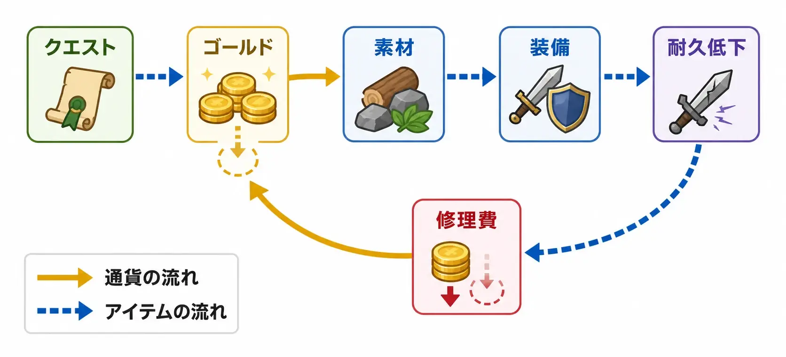
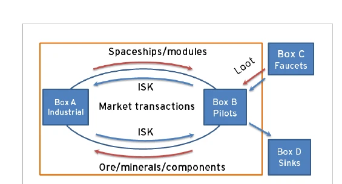
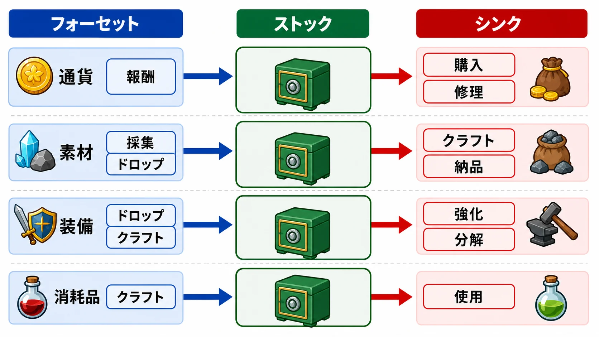
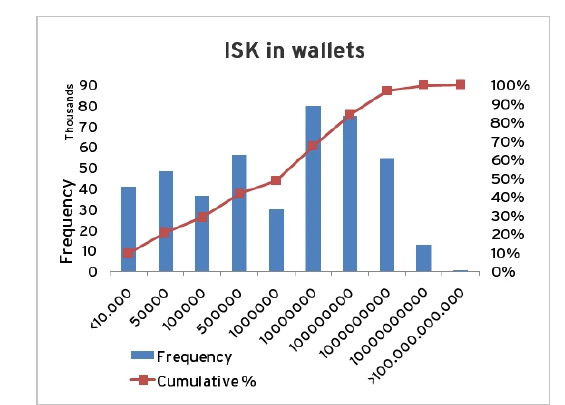
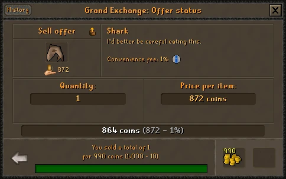
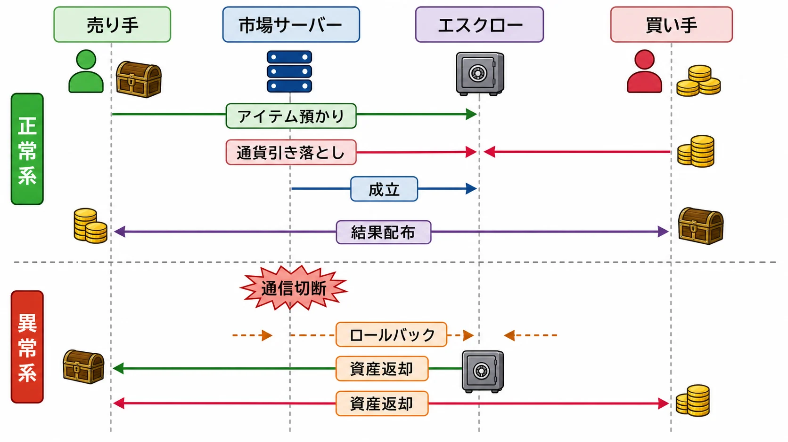
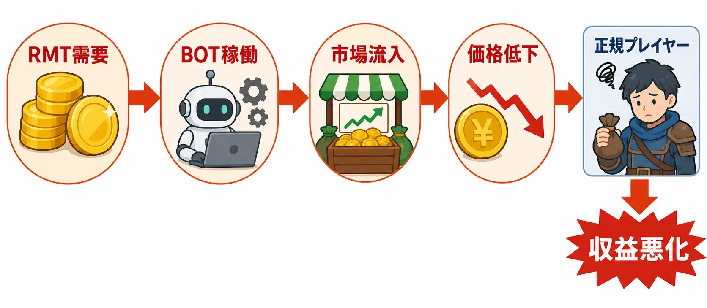
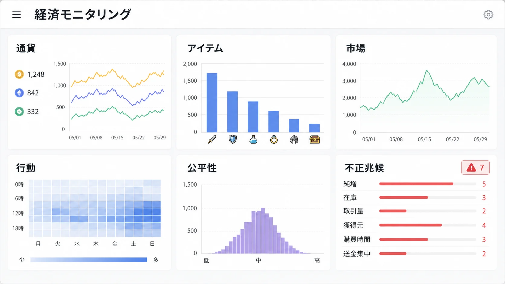

# ゲーム内経済の設計――通貨とアイテムを壊さず回し続ける実務

***

## はじめに

敵を倒すと100ゴールドを得る。店でポーションを30ゴールドで買う。

一見すると、これは報酬と価格を決めるだけの小さな仕様に見える。しかし、大勢が繰り返し受け取り、余った通貨を何年も保有し、品物を売買できるなら話は変わる。運営は通貨の発行、商品の供給、取引ルールまで決める立場になる。

ここで先に、ありがちな誤解をほどいておきたい。

- 報酬額と店の価格が同じ桁なら、経済は釣り合う
- 通貨が増えすぎたら、高額商品を一つ追加すれば回収できる
- プレイヤー間取引は、売り手と買い手を結ぶUIを作れば完成する
- RMTは利用規約とアカウント停止だけで、経済設計とは別に扱える

実際には、誰が、何を、どれだけ生み、どこで消し、どの層に蓄積しているかを見なければならない。ライブサービスでは、コンテンツ追加のたびに入口と出口も変わる。

本記事は、課金心理やガチャ規制を扱わない。見るのは、 **ゲーム内通貨とアイテムが循環する仕組みを、どう観測し、壊さず運用するか** である。

***

## 1. ゲーム内経済とは何か

ゲーム内経済とは、通貨、素材、装備、消耗品などが、獲得、交換、消費される仕組みの総体である。通貨だけの話ではない。

たとえば、プレイヤーはクエストでゴールドを得る。そのゴールドで素材を買い、装備を作る。使った装備は耐久度を失い、修理にゴールドが要る。不要な素材は別のプレイヤーへ売る。この一連のループでは、次のものが同時に動いている。

- 通貨の発生と消滅
- アイテムの発生と消滅
- プレイヤー間の所有権移転
- 時間、労力、危険と報酬の交換

*通貨の流れとアイテムの流れを分けて見ると、同じループの中で発生、移転、消滅が同時に起きていることが見える。*

実装でも、通貨残高、インベントリ、資源を換える取引は異なるデータである。UnityのEconomyサービスも、通貨、アイテム、仮想購入を別のリソース種別としている。[[1](#ref-1)]

### 1-1. 現実の経済学は、設計の比喩として借りる

ゲーム開発では「インフレ」「通貨供給量」「シンク」「フォーセット」といった言葉を使う。ただし、これらは現実社会の経済学をそのまま移植したものではない。

現実では、家計、企業、政府などが別々の意思を持つ。ゲームでは運営が、通貨を出す敵、税率、商品の供給、取引範囲、ルールまで変更できる。

したがって経済学由来の言葉は、複雑な流れを考えるための **モデル** として使うのがよい。「現実の理論がそう言っているから正しい」と仕様を権威づけるためではない。

### 1-2. 売り買いがあるだけでは、通貨は増えない

プレイヤーAがプレイヤーBから剣を1,000ゴールドで買ったとする。手数料がなければ、Aの通貨が1,000減り、Bの通貨が1,000増える。世界全体の通貨総量は変わらない。

一方、NPCがクエスト報酬として1,000ゴールドを渡せば、新しい通貨が世界へ入る。NPC店へ1,000ゴールドを払い、その代金が再流通しないなら、通貨は世界から消える。

この区別は重要である。EVE Onlineの公式経済レポートも、NPCから得る報酬などを通貨の流入、NPCへ払う税や手数料などを流出として整理し、プレイヤー間取引は新しい通貨を加えないと説明している。[[2](#ref-2)]

*画像出典（引用）：CCP Games, [EVE Online Quarterly Economic Newsletter, Q3 2007][2], Figure 5 / プレイヤー間取引とNPC由来のフォーセット・シンクを区別する資料として引用。WebP変換。*

***

## 2. フォーセットとシンク――蛇口と排水口を分ける

**フォーセット（蛇口）** は、通貨や資源がゲーム内へ供給される経路である。 **シンク（排水口）** は、それらが消費され、再流通しない形で消える経路を指す。

*通貨、素材、装備、消耗品は、それぞれ別の入口と出口を持つ。フォーセットとシンクは一対一ではなく、複数の経路が重なっている。*

| 対象 | フォーセットの例 | シンクの例 |
|---|---|---|
| 通貨 | クエスト報酬、敵の直接ドロップ、ログイン報酬、NPCへの売却 | NPC店での購入、修理費、強化費、取引手数料、ファストトラベル代 |
| 素材 | 採集、敵ドロップ、分解、定期配布 | クラフト、強化、納品、交換、使用期限 |
| 装備 | ボス報酬、クラフト、宝箱 | 分解、強化素材化、耐久消失、回収交換 |
| 消耗品 | クラフト、店売り、イベント報酬 | 戦闘での使用、入場料、再抽選 |

ここで「消費」と「移転」を混同してはいけない。フリーマーケットで装備を売っても、その装備は別の人へ移っただけである。倉庫へしまうのも流通から一時的に外れただけで、シンクではない。期間終了後に削除されるイベント通貨はシンクだが、次回へ持ち越せるなら蓄積する。

### 2-1. 最初に作るべきは収支表である

ある期間の通貨総量の変化は、概念上、次のように整理できる。

$$
\text{通貨総量の変化} = \text{フォーセット総量} - \text{シンク総量}
$$

ただし、収支が同額なら健全とは限らない。

古参の一部だけが巨額を持てば、総量が安定しても新規は市場へ参加しにくい。通貨が倉庫口座で眠れば、総量が多くても影響は小さい。全員が同じ素材へ殺到すれば、通貨総量が変わらなくても価格は上がる。

最低でも、次を分けて見る必要がある。

- **ストック：** 現時点で保有されている通貨・アイテム量
- **フロー：** 1日や1週間に新規発生・消滅した量
- **分布：** 新規、中央値付近、上位層がそれぞれ持つ量
- **流通：** 取引回数、取引額、保有から使用までの時間

*画像出典（引用）：CCP Games, [EVE Online Quarterly Economic Newsletter, Q3 2007][2], Figure 9 / 通貨保有の分布を観測する具体例として引用。WebP変換。*

### 2-2. 良いシンクは、単に高価なだけではない

シンクを増やすときは、「いくら消すか」と「誰が払うか」を分けて考える。

| シンクの型 | 長所 | 主な副作用 |
|---|---|---|
| 修理費・移動費などの反復型 | 利用量に応じて継続的に回収できる | 日常行動への罰に感じやすい |
| 取引手数料などの比例型 | 大口取引から多く回収しやすい | 直接取引や別市場への迂回を促す |
| 外見・住宅などの任意型 | 楽しさを増やしながら回収できる | 興味のない層には効かない |
| 強化・再抽選などの成長型 | 目標と消費を結びつけやすい | 必須化すると格差と疲労を強める |
| 期間限定イベント型 | 短期的な滞留資産を動かせる | 後出し回収やFOMOに見えやすい |

全員へ同額を課すシンクは、新規プレイヤーほど重い。資産比例の手数料は上位層へ効きやすいが、高額取引を市場外へ追い出すことがある。任意の高級品は受け入れられやすいが、買い切った後は効かない。

一つの巨大なシンクに頼らず、日常の回収、上位層向けの選択的消費、取引手数料を組み合わせると、対象を分散しやすい。

***

## 3. インフレは「お金が増えた」だけでは判定できない

ゲームデザインでいう **インフレ** は、主に通貨の購買力が下がり、同じ品物を買うために必要な通貨が増える状態を指す。ただし、特定の剣が値上がりしただけで「経済全体がインフレした」とは言えない。

その剣だけ供給が減ったのかもしれない。アップデートで性能が上がり、需要が集中したのかもしれない。情報を早く得た買い手が買い占めた可能性もある。

用途の異なる複数品目の価格、取引量、供給量、通貨量が同じ方向へ動いているかを見る。現実の物価指数を再現しなくても、代表的な「買い物かご」があれば変化を追いやすい。

たとえば、次の価格を別々に見る。

- 初心者向け回復薬と基礎素材
- 中間層が日常的に使う消耗品
- 高難度へ入るための装備と素材
- 収集家向けの希少品
- NPCが固定価格で売る基準品

中央値だけでも足りない。高級品だけが上がっているのか、生活必需品まで上がっているのかで、困るプレイヤーが違う。

### 3-1. MMOとライブサービスで蓄積しやすい理由

ライブサービスでは、敵やクエストが何度でも通貨と素材を生む。一方、永久装備や保有通貨は、プレイヤーが使わない限り残る。運営期間が長いほど、過去のプレイ時間が資産として積み上がる。

さらに大型アップデートでは、報酬の高い新コンテンツを追加しがちである。古い報酬より魅力を出そうとして供給量を上げ続けると、入口だけが太くなる。プレイヤーがコンテンツを攻略する速度に、新しい消費先の制作が追いつかないこともある。

問題は単純なプレイヤー数ではない。新規プレイヤーが増えても、初期配布と同程度に消費すれば影響は限られる。重要なのは、 **1人・1時間あたりの純増量と、それを何人が何時間繰り返すか** である。

### 3-2. 制御手法は、それぞれ違う痛みを持つ

インフレへ対応する代表的な手法には、次がある。

- 既存フォーセットの報酬量や回数を調整する
- 修理、クラフト、強化、取引へシンクを追加する
- 期間限定の交換所や収集イベントで消費先を作る
- 通貨の保有上限を設ける
- 市場取引へ出品料、成立手数料、税を設ける
- アイテムを分解、合成、納品で消す用途を増やす

通貨上限は、データ上の無限蓄積を防げる。UnityのEconomyサービスにも、プレイヤーごとの通貨残高上限がある。[[1](#ref-1)] しかし上限へ達した報酬が消える設計は、プレイ損失の感覚を生む。上限到達前の警告、余剰分の別資源化、使い道への導線も必要になる。

シンクの実例として、Old School RuneScapeは2021年、Grand Exchangeの売却へ手数料を導入し、同時に手数料の一部を用いて特定アイテムを市場から買い取って削除する仕組みを導入した。通貨シンクとアイテムシンクを別々に扱った例である。[[3](#ref-3)] ただし、同じ方式がどのゲームにも適するわけではない。取引所を使わないゲームでは効かず、対象アイテムの選び方によって価格への影響も変わる。

*画像出典（引用）：Jagex, [Grand Exchange Tax & Item Sink][3] / Grand Exchangeの売却時に手数料が表示される例として引用。WebP変換。*

### 3-3. 一度に強く直すと、別の経済を壊す

経済調整はプレイヤーの予定も変える。修理費は戦闘回数、ドロップ率はプレイ時間の価値、手数料は低利幅の商売へ影響する。

そのため、調整前に次を決める。

1. 何を問題と判定したか
2. どの指標を、どの期間で動かしたいか
3. 影響を受けるプレイヤー層は誰か
4. 迂回行動や代替市場が生まれないか
5. 期待と違ったとき、どこまで戻せるか

小さく変更し、駆け込み取引も観測する。変更日だけでなく告知日も記録する。経済は告知を読んだ瞬間から動くからである。

***

## 4. プレイヤー間取引は、ゲームループまで書き換える

オークションハウスやフリーマーケットは、余剰品を必要な人へ渡し、分業を成立させる。採集、クラフト、売買そのものを遊びにもできる。

その一方で、取引が便利になるほど「自分で敵を倒して装備を得る」より「最も効率のよい作業で稼いで買う」方が速くなることがある。

Diablo IIIのオークションハウスは、安全で便利な取引を目標に作られた。しかしBlizzardは後に、それが「敵を倒して良い戦利品を得る」という中核のゲームプレイを損なったとして、ゴールド用と現金用の両方を閉鎖した。[[4](#ref-4)] これは「取引所は悪い」という教訓ではない。 **取引の便利さは、ドロップ率や成長速度と同じゲームバランス変数である** という例である。

### 4-1. 仕様書で決める項目は価格だけではない

プレイヤー市場を持つなら、少なくとも次を決める。

- 何を取引でき、何をアカウントやキャラクターへ固定するか
- 固定価格、入札、注文板のどれを使うか
- 出品枠、出品期間、購入数に上限を設けるか
- 出品時と成立時のどちらで手数料を取るか
- 価格履歴、取引量、最終成立時刻をどこまで見せるか
- サーバー、地域、プラットフォーム間で市場を共有するか
- キャンセル、通信切断、ロールバック時に資産をどう戻すか

出品枠を狭めれば大量出品を抑えられるが、少量多品種の商売が難しくなる。価格情報は初心者を助ける一方、高速取引も促す。取引不可はRMTの移転経路を減らすが、贈り物やクラフト職の価値も傷つける。

### 4-2. 実装では「二重に渡さない」が最優先になる

市場取引は、売り手からアイテムを取り上げ、買い手から通貨を引き、双方へ結果を渡す処理である。途中で通信が切れても、片方だけ成功してはいけない。

実務では、取引中の資産を預かるエスクロー、二重処理を防ぐ取引ID、成立・取消・返却を追える監査ログが要る。通信が再送されても、結果は一度だけ反映する。複製バグの影響範囲を検索できる台帳も必要である。

*市場取引では、正常系の成立処理だけでなく、通信切断時に資産を戻せる異常系も同じ設計対象になる。*

経済設計とバックエンド設計は分離できない。複製バグで大量の通貨や装備が出たとき、ログがなければ、回収対象も正規取得者への二次流通も判定できない。

***

## 5. RMTとBOTは、外から来る需要と自動化された供給である

**RMT（リアルマネートレード）** は、ゲーム内通貨、アイテム、役務などを、運営が認めない形で現実の金銭や価値と交換する行為を指す。本稿では、運営が公式に販売する商品ではなく、第三者市場での取引を主に扱う。

RMTが経済を歪める経路は一つではない。

- 売る通貨を作るため、BOTや大量アカウントがフォーセットを長時間回す
- 自動採集された素材が市場へ流れ、正規プレイヤーの収益機会を下げる
- 現実の支払能力が、ゲーム内の進行や競争力へ持ち込まれる
- 不正取得した資産を複数口座と取引で移し、追跡を難しくする
- アカウント窃取や詐欺が、資産供給の手段になる

*RMTの需要は外部から来るが、その供給活動はゲーム内のフォーセットと市場価格へ影響する。*

Jagexは2025年の公式告知で、RMTの金購入需要が、販売目的のBOTや使い捨てアカウントに経済的動機を与え、BOT由来資源が市場へ入ることで正規プレイヤーの売却収入にも影響すると説明した。[[5](#ref-5)] FINAL FANTASY XIVの運営も、RMTなどの不正行為はゲームバランスを乱すとして禁止し、RMT、BOT、広告への措置を継続的に公表している。[[6](#ref-6)]

ただし、「RMTがあれば必ず全価格が上がる」とは限らない。BOTが大量供給する素材は値下がりする一方、その売却で生まれた通貨が別の希少品へ向かえば、そちらは値上がりしうる。どのフォーセットを回し、何を市場へ出し、どこへ通貨が移ったかを見る必要がある。

### 5-1. 対策は、遊びやすさとの交換になる

対策の候補には、次がある。

- 高価値アイテムを取引不可または一定期間取引不可にする
- 新規アカウントの送金額、出品数、取引範囲を段階的に広げる
- BOTが集中する獲得経路を監視し、報酬設計も見直す
- 通貨移転のグラフから、中継口座や不自然な集中を調べる
- 複数の弱い兆候を組み合わせ、人手確認と制裁へつなぐ
- 不正資産を凍結・回収できる運用手順とログを用意する

万能策はない。自由取引を止めればRMTは移しにくくなるが、プレゼント、ギルド支援、クラフト分業も傷つく。厳しい日次上限は大量送金を止めるが、共同購入や復帰者支援を誤検知する。BOT対策の詳細を公開しすぎれば回避へ使われる一方、説明がなければ正規プレイヤーは制限の理由を理解しにくい。

重要なのは、検知率だけでなく、誤検知、調査工数、プレイヤーの摩擦、攻撃側の乗り換え先まで比較することである。不正対策チームだけへ任せず、経済担当、バックエンド、カスタマーサポートが同じ台帳を見る必要がある。

***

## 6. 経済モニタリング――何を毎日見るか

経済は、障害が起きたときだけログを見るのでは遅い。平常時の幅を知って初めて、異常を異常と判断できる。

EVE Onlineでは、CCP Gamesが2007年に主任エコノミストを起用し、四半期レポートや物価動向の分析を開発にも活用すると発表した。[[7](#ref-7)] 公式の月次経済レポートでは、生産、採掘、破壊、通貨のフォーセットとシンクなどを扱い、元データも配布している。[[8](#ref-8)] すべてのゲームに経済学者が必要なのではない。経済を継続的な観測対象にする点が重要である。

### 6-1. 最低限のダッシュボード

| 分類 | 主な指標 | 異常から考えられること |
|---|---|---|
| 通貨 | 発生量、消滅量、純増、保有分布 | 報酬設定ミス、シンク不足、不正生成 |
| アイテム | 生成量、消費量、在庫、保有者数 | ドロップ偏り、複製、需要消失 |
| 市場 | 成立価格、取引量、出品数、成立時間 | 供給不足、買い占め、UI障害 |
| 行動 | 獲得元・消費先別の人数と回数 | 特定経路への集中、迂回、イベント影響 |
| 公平性 | 新規・復帰・上位層別の購買可能時間 | 参入障壁、資産格差、追いつきにくさ |
| 不正兆候 | 長時間反復、送金集中、関連口座 | BOT、RMT、複製資産の洗浄 |

*ダッシュボードは、価格だけでなく、発生量、在庫、取引、行動、公平性、不正兆候を同じ画面で見られるようにする。*

平均値は少数の大口保有者に引っ張られる。中央値、上位層、プレイ開始時期別も見る。曜日との比較、移動平均、アップデート前後の比較も使う。

### 6-2. アラートは「価格が何％動いたら」だけでは弱い

価格は告知や攻略法の発見でも動く。価格だけで自動停止すると、正常な人気まで異常扱いする。

より実用的なのは、複数の条件を組み合わせることである。

- 価格上昇と同時に、出品者数が急減した
- 生成量が変わらないのに、特定口座群の在庫だけ増えた
- 新規アカウントから少数口座へ送金が集中した
- 取引量が急増したのに、固有の買い手と売り手が極端に少ない
- パッチ後、想定していないNPC売却経路から通貨が増えた

アラートには、担当者、期限、一次対応もひもづける。停止可能なフォーセット、取引凍結、告知、ロールバック判断を事前に決める。

### 6-3. 指標には必ず設計上の問いを付ける

ダッシュボードが豪華でも、意思決定につながらなければ意味がない。

たとえば通貨純増を見るなら、「どの水準で、どのシンクを検討するか」を決める。初心者装備の購入時間を見るなら、「何時間を超えたら初期報酬か価格を再確認するか」を決める。異常検知は、仕様変更の自動命令ではない。調査を始める合図である。

***

## 7. 買い切り型とライブサービス型では、壊れ方が違う

シングルプレイヤーRPGにも経済はある。ただし、多くは一人分の疑似経済である。他人の大量生産や買い占めはなく、セーブデータごとに閉じている。

その場合の主な問いは、進行中に選択が残るかである。回復薬と装備更新のどちらへ使うか、探索報酬が店売り品を無意味にしないか、終盤で通貨が余らないか、価格が稼ぎを強制しないかを見る。

多少の余剰は、クリア前の解放感にもなる。ライブサービスでは古参の資産が新規コンテンツと他人の価格へ影響するため、過去資産の価値、新規の参入可能性、不正利用への耐性を長く保つ必要がある。

だから判断軸は、タイトルの寿命と取引範囲で変わる。

| 条件 | 優先しやすい判断 |
|---|---|
| 短編・買い切り・取引なし | 1周の選択と報酬感を優先する |
| 長編・取引なし | 終盤の余剰と稼ぎ作業を確認する |
| 協力型・限定取引 | ギフトの楽しさと不正移転を比較する |
| MMO・自由市場 | 長期供給、価格形成、監視、復旧を一体で設計する |

***

## 8. 実装前とアップデート前のレビュー手順

経済仕様は、個々の価格表より先に流れを見る。

### 8-1. 実装前

1. 通貨と主要アイテムを一覧にし、フォーセット、シンク、移転経路を図にする
2. 1人・1日あたりの獲得量と消費量を進行帯別に置く
3. 取引可否、上限、期限、返却条件を決める
4. 増減へ理由コードと取引IDを記録する
5. 複製、切断、再送、ロールバックを試し、アラート後の担当者を決める

### 8-2. アップデート前

新コンテンツには、新しい蛇口が付きやすい。報酬会議では次も確認する。

- その報酬は新規発行か、既存資産の移転か
- 何回繰り返せ、1時間あたり何個入るか
- 既存のどの報酬と店売り品を代替するか
- 使い道は同時に増えるか、永久在庫になるか
- BOTが回しやすい単純反復になっていないか
- 想定外なら、報酬停止と回収を安全に行えるか

本番後は、最速攻略層の供給量も見る。将来の一般層を先に見せることがあるからだ。ただし、その行動を全員の標準として一般層まで締め付けてはいけない。

***

## おわりに――経済設計は、数字を置く仕事ではなく流れを守る仕事である

ゲーム内経済は、報酬表と価格表を埋めた時点では完成しない。

通貨とアイテムには、それぞれ入口、移転、滞留、出口がある。プレイヤー間取引を加えれば、便利さがゲームループを書き換える。RMTとBOTは、外部の需要と自動化された供給を持ち込み、不正対策と経済設計を同じ問題にする。

実務で重要なのは、次の順序である。

- フォーセット、シンク、移転を分ける
- 通貨とアイテムを別々に数える
- 総量だけでなく、フロー、分布、取引を見る
- 調整の対象と副作用を先に決める
- 増減を追跡できるログと復旧手順を作る
- アップデートのたびに観測し、小さく直す

シンクを増やせばよい、取引を制限すればよい、という正解集は作れない。短編RPGと長期MMOでは必要な安定性が違う。自由市場を楽しませたい作品と、自力入手を核にする作品でも答えは変わる。

だからこそ、判断材料を残す。何を守りたい経済なのか、誰にどの負担が生じるのか、どの指標が動けば見直すのかを言葉にする。

**ゲーム内経済の設計とは、完成時の均衡を当てる仕事ではない。変化し続ける流れを観測し、プレイヤーの選択が成立する範囲へ戻し続ける運用の仕事である。**

## References

1. [Introduction to resources in Economy][1] - Unity Gaming Servicesが、通貨、インベントリアイテム、仮想購入を別のリソースとして扱い、通貨残高へ上限を設定できることを説明した公式文書。

2. [EVE Online Quarterly Economic Newsletter, Q3 2007][2] - EVE Onlineの公式経済レポート。フォーセット、シンク、プレイヤー間取引を区別し、通貨とアイテムの流れを整理している。

3. [Grand Exchange Tax & Item Sink][3] - Old School RuneScapeがGrand Exchangeの売却手数料と、対象アイテムを買い取って削除する仕組みを説明した公式アップデート。

4. [Diablo III Auction House Update][4] - Blizzard Entertainmentが、オークションハウスは便利で安全な取引を目指した一方、中核である戦利品獲得のゲームプレイを損なったとして閉鎖を発表した公式記事。

5. [A Message about Real World Trading][5] - Jagexが、第三者RMTの需要、BOTによる供給、市場価格と正規プレイヤーへの影響、売り手と買い手双方への対応方針を説明した公式告知。

6. [Actions Taken Against In-Game RMT & Other Illicit Activities][6] - FINAL FANTASY XIV運営が、RMTなどはゲームバランスを乱すとして禁止し、RMT、BOT、広告に対する措置を公表した公式告知。

7. [EVE Online Appoints In-World Economist][7] - CCP Gamesが2007年、EVE Onlineの経済監視・研究、四半期レポート、開発への分析活用を担う主任エコノミストの起用を発表した公式資料。

8. [Monthly Economic Report - March 2025][8] - EVE Online Economic Councilが、生産、採掘、通貨のフォーセットとシンクなどをまとめ、元データも公開した月次経済レポート。

[1]: https://docs.unity.com/en-us/economy/item-types
[2]: https://cdn1.eveonline.com/community/QEN/QEN_Q3-2007.pdf
[3]: https://secure.runescape.com/m=news/grand-exchange-tax--item-sink?oldschool=1
[4]: https://news.blizzard.com/en-gb/article/10974978/diablo-iii-auction-house-update
[5]: https://secure.runescape.com/m=news/a-message-about-real-world-trading?oldschool=1
[6]: https://na.finalfantasyxiv.com/lodestone/news/detail/1ef64c24ec33eb1162ec98cae61371295a9d970f
[7]: https://community.eveonline.com/news/news-channels/press-releases/eve-online-appoints-in-world-economist-1/
[8]: https://www.eveonline.com/news/view/monthly-economic-report-march-2025

----

この文書は、Perplexity、Claude、OpenAI Codex の3つのAIの支援を受けて著述されたものです。引用画像を除き、MIT License にて提供されています。
